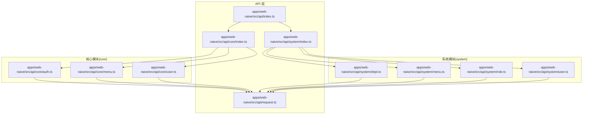
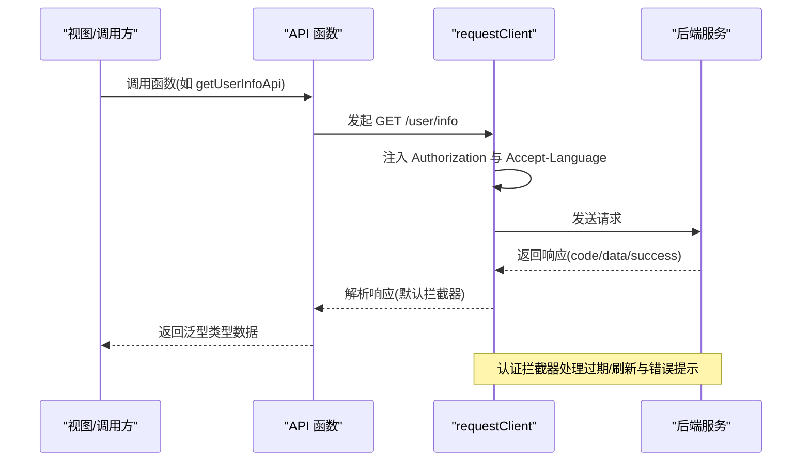
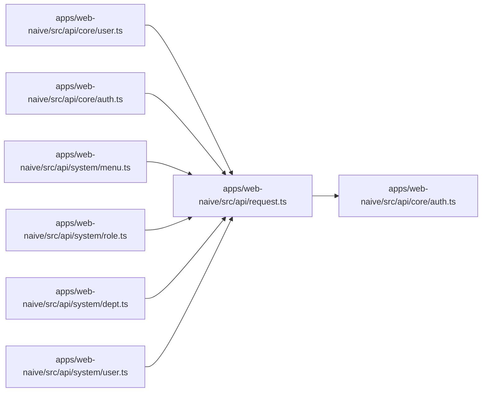

# API 命名规范

<cite>
**本文引用的文件**
- [apps/web-naive/src/api/core/auth.ts](file://apps/web-naive/src/api/core/auth.ts)
- [apps/web-naive/src/api/core/menu.ts](file://apps/web-naive/src/api/core/menu.ts)
- [apps/web-naive/src/api/core/user.ts](file://apps/web-naive/src/api/core/user.ts)
- [apps/web-naive/src/api/system/dept.ts](file://apps/web-naive/src/api/system/dept.ts)
- [apps/web-naive/src/api/system/menu.ts](file://apps/web-naive/src/api/system/menu.ts)
- [apps/web-naive/src/api/system/role.ts](file://apps/web-naive/src/api/system/role.ts)
- [apps/web-naive/src/api/system/user.ts](file://apps/web-naive/src/api/system/user.ts)
- [apps/web-naive/src/api/request.ts](file://apps/web-naive/src/api/request.ts)
- [apps/web-naive/src/api/core/index.ts](file://apps/web-naive/src/api/core/index.ts)
- [apps/web-naive/src/api/system/index.ts](file://apps/web-naive/src/api/system/index.ts)
- [apps/web-naive/src/api/index.ts](file://apps/web-naive/src/api/index.ts)
- [playground/src/api/examples/table.ts](file://playground/src/api/examples/table.ts)
- [playground/src/api/examples/upload.ts](file://playground/src/api/examples/upload.ts)
- [playground/src/api/examples/download.ts](file://playground/src/api/examples/download.ts)
- [playground/src/api/core/auth.ts](file://playground/src/api/core/auth.ts)
- [playground/src/api/core/user.ts](file://playground/src/api/core/user.ts)
</cite>

## 目录

1. 引言
2. 项目结构
3. 核心组件
4. 架构总览
5. 详细组件分析
6. 依赖关系分析
7. 性能考量
8. 故障排查指南
9. 结论
10. 附录

## 引言

本文件系统性梳理 shiyu-ui 项目的 API 命名规范与组织原则，覆盖文件命名、函数命名、接口命名与常量命名的统一标准；明确核心模块、系统模块与其他业务模块的命名差异；给出 API 接口命名规范（HTTP 方法映射、URL 路径、参数与返回值）；并通过实际示例展示正确与错误的命名对比；最后说明制定依据、遵循原则及在团队协作中的一致性要求。

## 项目结构

API 层采用按功能域分层组织：核心模块（core）、系统模块（system），以及示例模块（examples）。各模块通过 index 文件聚合导出，便于上层按需引入。

图表来源

- [apps/web-naive/src/api/index.ts:1-2](file://apps/web-naive/src/api/index.ts#L1-L2)
- [apps/web-naive/src/api/core/index.ts:1-4](file://apps/web-naive/src/api/core/index.ts#L1-L4)
- [apps/web-naive/src/api/system/index.ts:1-5](file://apps/web-naive/src/api/system/index.ts#L1-L5)
- [apps/web-naive/src/api/core/auth.ts:1-52](file://apps/web-naive/src/api/core/auth.ts#L1-L52)
- [apps/web-naive/src/api/core/menu.ts:1-11](file://apps/web-naive/src/api/core/menu.ts#L1-L11)
- [apps/web-naive/src/api/core/user.ts:1-11](file://apps/web-naive/src/api/core/user.ts#L1-L11)
- [apps/web-naive/src/api/system/dept.ts:1-64](file://apps/web-naive/src/api/system/dept.ts#L1-L64)
- [apps/web-naive/src/api/system/menu.ts:1-169](file://apps/web-naive/src/api/system/menu.ts#L1-L169)
- [apps/web-naive/src/api/system/role.ts:1-56](file://apps/web-naive/src/api/system/role.ts#L1-L56)
- [apps/web-naive/src/api/system/user.ts:1-99](file://apps/web-naive/src/api/system/user.ts#L1-L99)
- [apps/web-naive/src/api/request.ts:1-114](file://apps/web-naive/src/api/request.ts#L1-L114)

章节来源

- [apps/web-naive/src/api/index.ts:1-2](file://apps/web-naive/src/api/index.ts#L1-L2)
- [apps/web-naive/src/api/core/index.ts:1-4](file://apps/web-naive/src/api/core/index.ts#L1-L4)
- [apps/web-naive/src/api/system/index.ts:1-5](file://apps/web-naive/src/api/system/index.ts#L1-L5)

## 核心组件

- 请求客户端封装：统一创建请求客户端与基础客户端，注入鉴权头、响应格式化、刷新令牌与错误提示等拦截器。
- 核心模块 API：认证、菜单、用户等基础能力，提供命名空间与函数组合。
- 系统模块 API：部门、菜单、角色、用户等管理能力，提供命名空间、分页模型与 CRUD 函数。
- 示例模块 API：演示上传、下载、表格分页等用法，体现参数与返回值命名风格。

章节来源

- [apps/web-naive/src/api/request.ts:1-114](file://apps/web-naive/src/api/request.ts#L1-L114)
- [apps/web-naive/src/api/core/auth.ts:1-52](file://apps/web-naive/src/api/core/auth.ts#L1-L52)
- [apps/web-naive/src/api/system/user.ts:1-99](file://apps/web-naive/src/api/system/user.ts#L1-L99)
- [playground/src/api/examples/upload.ts:1-26](file://playground/src/api/examples/upload.ts#L1-L26)
- [playground/src/api/examples/download.ts:1-29](file://playground/src/api/examples/download.ts#L1-L29)

## 架构总览

API 层通过统一请求客户端发起 HTTP 请求，自动携带鉴权头与语言头；响应统一走默认拦截器与认证拦截器，支持刷新令牌与错误提示；各模块函数以“动词+名词+Api”的形式暴露，参数与返回值通过命名空间接口定义，确保类型安全与可读性。

图表来源

- [apps/web-naive/src/api/core/user.ts:1-11](file://apps/web-naive/src/api/core/user.ts#L1-L11)
- [apps/web-naive/src/api/request.ts:1-114](file://apps/web-naive/src/api/request.ts#L1-L114)

## 详细组件分析

### 命名规范总则

- 文件命名：采用小驼峰或模块名，如 auth.ts、menu.ts、user.ts、dept.ts、role.ts、table.ts、upload.ts、download.ts。
- 命名空间：模块内使用“模块名+Api”命名空间，如 AuthApi、SystemUserApi、SystemMenuApi、SystemDeptApi、SystemRoleApi。
- 接口命名：参数接口以“动词+对象+Params”或“对象+Params”，返回值接口以“动词+对象+Result”或“对象+Result”，如 LoginParams、LoginResult、PageResult<T>。
- 常量命名：模块内导出的枚举/常量集合使用大写蛇形或全大写，如 BadgeTypes、BadgeVariants、MenuTypes。
- 函数命名：统一使用“动词+对象+Api”的形式，如 loginApi、getUserInfoApi、getAllMenusApi、getDeptList、createUser、updateMenu、deleteRole、isMenuNameExists、downloadFile1、upload_file。
- 参数命名：遵循语义化，如 id、name、path、page、pageSize、password 等；分页参数统一使用 page/pageSize。
- 返回值命名：优先使用命名空间内的 PageResult<T> 包装分页数据，或直接返回数组/对象；避免直接返回原始后端字段。

章节来源

- [apps/web-naive/src/api/core/auth.ts:1-52](file://apps/web-naive/src/api/core/auth.ts#L1-L52)
- [apps/web-naive/src/api/system/user.ts:1-99](file://apps/web-naive/src/api/system/user.ts#L1-L99)
- [apps/web-naive/src/api/system/menu.ts:1-169](file://apps/web-naive/src/api/system/menu.ts#L1-L169)
- [apps/web-naive/src/api/system/dept.ts:1-64](file://apps/web-naive/src/api/system/dept.ts#L1-L64)
- [apps/web-naive/src/api/system/role.ts:1-56](file://apps/web-naive/src/api/system/role.ts#L1-L56)
- [playground/src/api/examples/table.ts:1-19](file://playground/src/api/examples/table.ts#L1-L19)
- [playground/src/api/examples/upload.ts:1-26](file://playground/src/api/examples/upload.ts#L1-L26)
- [playground/src/api/examples/download.ts:1-29](file://playground/src/api/examples/download.ts#L1-L29)

### 核心模块（core）

- 认证模块（auth.ts）
  - 命名空间：AuthApi
  - 接口：LoginParams、LoginResult、RefreshTokenResult
  - 函数：loginApi、refreshTokenApi、logoutApi、getAccessCodesApi
  - URL 路径：/auth/login、/auth/refresh、/auth/logout、/auth/codes
  - HTTP 方法：POST/GET
- 菜单模块（menu.ts）
  - 函数：getAllMenusApi
  - URL 路径：/menu/all
  - HTTP 方法：GET
- 用户模块（user.ts）
  - 函数：getUserInfoApi
  - URL 路径：/user/info
  - HTTP 方法：GET

章节来源

- [apps/web-naive/src/api/core/auth.ts:1-52](file://apps/web-naive/src/api/core/auth.ts#L1-L52)
- [apps/web-naive/src/api/core/menu.ts:1-11](file://apps/web-naive/src/api/core/menu.ts#L1-L11)
- [apps/web-naive/src/api/core/user.ts:1-11](file://apps/web-naive/src/api/core/user.ts#L1-L11)

### 系统模块（system）

- 部门模块（dept.ts）
  - 命名空间：SystemDeptApi
  - 接口：SystemDept
  - 函数：getDeptList、getDeptListForGrid、createDept、updateDept、deleteDept
  - URL 路径：/dept/list、/dept、/dept/{id}
  - HTTP 方法：GET/POST/PUT/DELETE
- 菜单模块（menu.ts）
  - 命名空间：SystemMenuApi
  - 常量：BadgeTypes、BadgeVariants、MenuTypes
  - 接口：SystemMenu 及其元信息 meta
  - 函数：getMenuList、getMenuListForGrid、isMenuNameExists、isMenuPathExists、createMenu、updateMenu、deleteMenu
  - URL 路径：/menu/list、/menu/name-exists、/menu/path-exists、/menu、/menu/{id}
  - HTTP 方法：GET/POST/PUT/DELETE
- 角色模块（role.ts）
  - 命名空间：SystemRoleApi
  - 接口：SystemRole
  - 函数：getRoleList、createRole、updateRole、deleteRole
  - URL 路径：/role、/role/{id}
  - HTTP 方法：GET/POST/PUT/DELETE
- 用户模块（user.ts）
  - 命名空间：SystemUserApi
  - 接口：SystemUser、PageResult<T>
  - 函数：getUserList（分页）、createUser、updateUser、deleteUser、resetUserPassword
  - URL 路径：/user、/user/{id}、/user/{id}/password
  - HTTP 方法：GET/POST/PUT/DELETE
  - 分页策略：兼容 records/total 与直接数组两种返回格式，并转换为 items/total

章节来源

- [apps/web-naive/src/api/system/dept.ts:1-64](file://apps/web-naive/src/api/system/dept.ts#L1-L64)
- [apps/web-naive/src/api/system/menu.ts:1-169](file://apps/web-naive/src/api/system/menu.ts#L1-L169)
- [apps/web-naive/src/api/system/role.ts:1-56](file://apps/web-naive/src/api/system/role.ts#L1-L56)
- [apps/web-naive/src/api/system/user.ts:1-99](file://apps/web-naive/src/api/system/user.ts#L1-L99)

### 其他业务模块（examples）

- 表格分页（table.ts）
  - 命名空间：DemoTableApi
  - 接口：PageFetchParams
  - 函数：getExampleTableApi
  - URL 路径：/table/list
  - HTTP 方法：GET
- 上传（upload.ts）
  - 函数：upload_file（注意：此处未使用“Api”后缀，建议统一为 uploadFileApi）
  - URL 路径：/upload
  - HTTP 方法：POST（通过 upload 扩展）
- 下载（download.ts）
  - 函数：downloadFile1、downloadFile2
  - URL 路径：静态资源地址
  - HTTP 方法：GET（通过 download 扩展）

章节来源

- [playground/src/api/examples/table.ts:1-19](file://playground/src/api/examples/table.ts#L1-L19)
- [playground/src/api/examples/upload.ts:1-26](file://playground/src/api/examples/upload.ts#L1-L26)
- [playground/src/api/examples/download.ts:1-29](file://playground/src/api/examples/download.ts#L1-L29)

### 请求客户端与拦截器（request.ts）

- 统一创建 requestClient/baseRequestClient，设置 baseURL
- 请求拦截器：注入 Authorization 与 Accept-Language
- 响应拦截器：
  - 默认拦截器：统一 code/data 字段与成功码
  - 认证拦截器：处理过期/刷新与登录弹窗/跳转
  - 错误拦截器：提取后端错误信息并提示
- 导出：requestClient（带默认响应处理）、baseRequestClient（基础客户端）

章节来源

- [apps/web-naive/src/api/request.ts:1-114](file://apps/web-naive/src/api/request.ts#L1-L114)

### 模块聚合导出（index.ts）

- apps/web-naive/src/api/index.ts：导出 core
- apps/web-naive/src/api/core/index.ts：导出 auth、menu、user
- apps/web-naive/src/api/system/index.ts：导出 dept、menu、role、user

章节来源

- [apps/web-naive/src/api/index.ts:1-2](file://apps/web-naive/src/api/index.ts#L1-L2)
- [apps/web-naive/src/api/core/index.ts:1-4](file://apps/web-naive/src/api/core/index.ts#L1-L4)
- [apps/web-naive/src/api/system/index.ts:1-5](file://apps/web-naive/src/api/system/index.ts#L1-L5)

## 依赖关系分析

- 模块间依赖：各模块函数均依赖 requestClient；认证模块在请求拦截器中调用 refreshTokenApi 实现自动刷新。
- 外部依赖：统一使用 @vben/request 的 RequestClient 与拦截器扩展。
- 类型依赖：统一使用 @vben/types 中的 UserInfo、Recordable 等类型。

图表来源

- [apps/web-naive/src/api/core/user.ts:1-11](file://apps/web-naive/src/api/core/user.ts#L1-L11)
- [apps/web-naive/src/api/core/auth.ts:1-52](file://apps/web-naive/src/api/core/auth.ts#L1-L52)
- [apps/web-naive/src/api/system/menu.ts:1-169](file://apps/web-naive/src/api/system/menu.ts#L1-L169)
- [apps/web-naive/src/api/system/role.ts:1-56](file://apps/web-naive/src/api/system/role.ts#L1-L56)
- [apps/web-naive/src/api/system/dept.ts:1-64](file://apps/web-naive/src/api/system/dept.ts#L1-L64)
- [apps/web-naive/src/api/system/user.ts:1-99](file://apps/web-naive/src/api/system/user.ts#L1-L99)
- [apps/web-naive/src/api/request.ts:1-114](file://apps/web-naive/src/api/request.ts#L1-L114)

## 性能考量

- 统一响应解析：通过默认拦截器减少重复代码，提升一致性和性能。
- 分页兼容：系统模块对后端返回格式进行兼容处理，避免多次转换开销。
- 令牌刷新：在认证拦截器中统一处理刷新逻辑，避免重复实现与网络抖动导致的频繁刷新。

## 故障排查指南

- 无权限/过期：检查认证拦截器是否触发刷新与弹窗/登出流程。
- 错误提示：确认错误拦截器是否正确提取后端错误字段并提示。
- 参数校验：确认分页参数与后端约定一致（page/pageSize）。
- 类型不匹配：核对命名空间接口与实际返回结构是否一致。

章节来源

- [apps/web-naive/src/api/request.ts:1-114](file://apps/web-naive/src/api/request.ts#L1-L114)

## 结论

本规范以“模块+命名空间+函数+接口”的四维命名体系为核心，结合统一请求客户端与拦截器，形成清晰、一致且可维护的 API 设计范式。建议在团队协作中严格执行命名与导出规范，确保跨模块协作与长期演进的稳定性。

## 附录

### 命名规范速查表

- 文件命名：小驼峰或模块名（如 auth.ts、menu.ts、user.ts、dept.ts、role.ts、table.ts、upload.ts、download.ts）
- 命名空间：模块名+Api（如 AuthApi、SystemUserApi、SystemMenuApi、SystemDeptApi、SystemRoleApi、DemoTableApi）
- 接口命名：动词+对象+Params/Result（如 LoginParams、LoginResult、PageResult<T>）
- 常量命名：全大写/大写蛇形（如 BadgeTypes、BadgeVariants、MenuTypes）
- 函数命名：动词+对象+Api（如 loginApi、getUserInfoApi、getAllMenusApi、getDeptList、createUser、updateMenu、deleteRole、isMenuNameExists、downloadFile1、uploadFileApi）

### 正确与错误命名对比

- 正确：loginApi、getUserInfoApi、getAllMenusApi、getDeptList、createUser、updateMenu、deleteRole、isMenuNameExists、downloadFile1、uploadFileApi
- 错误示例（来自仓库现有代码）：
  - upload_file（缺少 Api 后缀，建议改为 uploadFileApi）
  - getExampleTableApi（参数接口命名合理，但函数名可考虑统一为 getExampleTableDataApi 以强调数据获取意图）

章节来源

- [playground/src/api/examples/upload.ts:1-26](file://playground/src/api/examples/upload.ts#L1-L26)
- [playground/src/api/examples/table.ts:1-19](file://playground/src/api/examples/table.ts#L1-L19)
