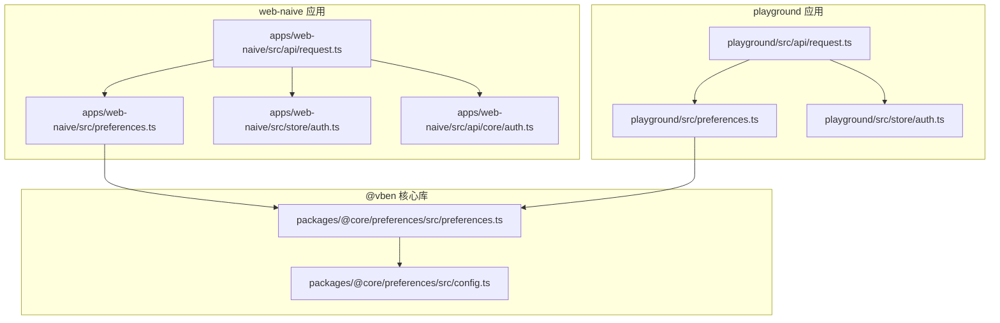
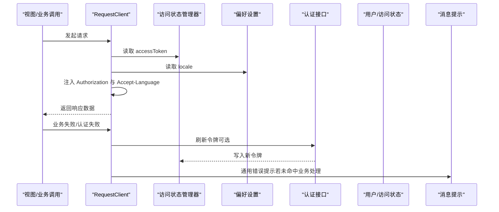
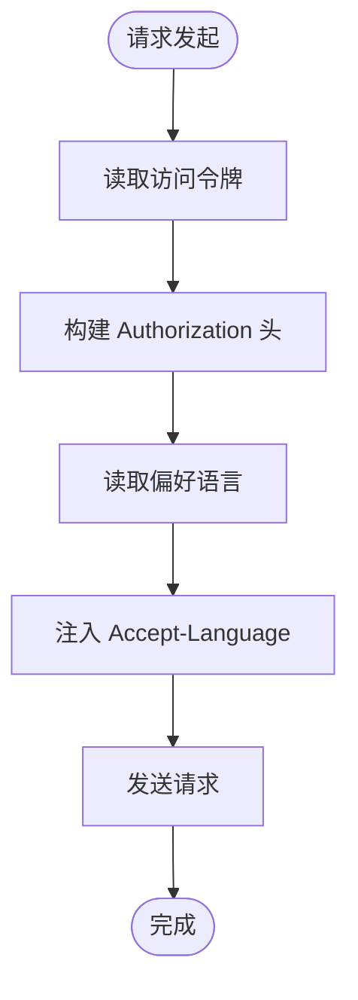
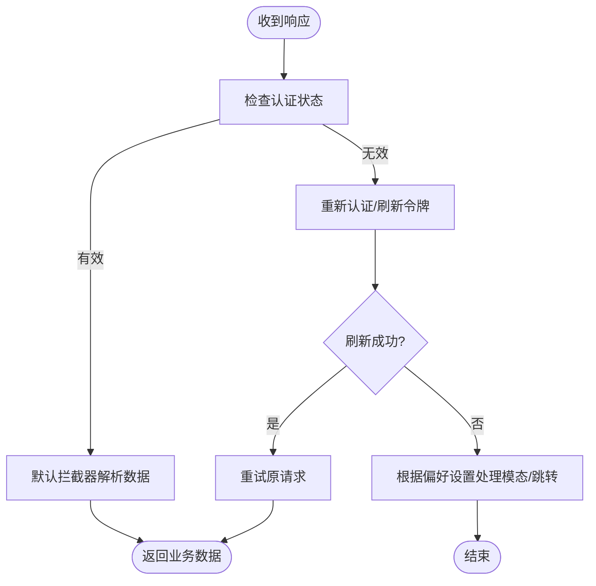
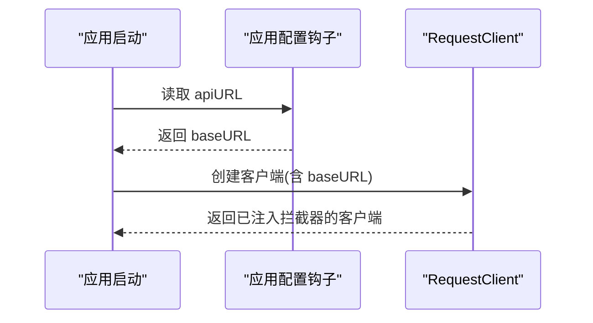
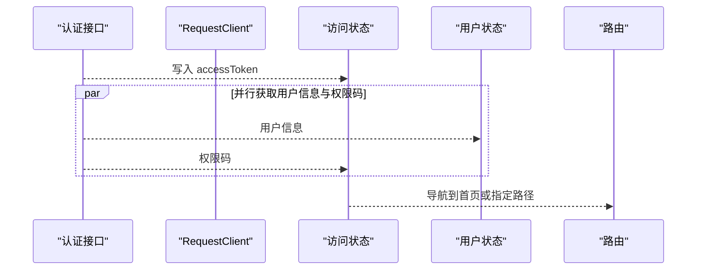
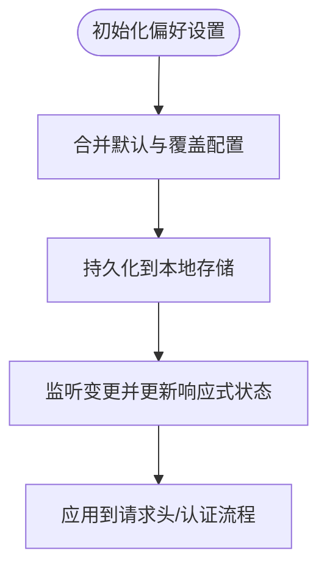
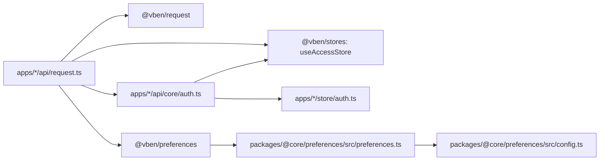

# API 客户端配置

<cite>
**本文引用的文件**
- [apps/web-naive/src/api/request.ts](file://apps/web-naive/src/api/request.ts)
- [playground/src/api/request.ts](file://playground/src/api/request.ts)
- [apps/web-naive/src/preferences.ts](file://apps/web-naive/src/preferences.ts)
- [playground/src/preferences.ts](file://playground/src/preferences.ts)
- [packages/@core/preferences/src/preferences.ts](file://packages/@core/preferences/src/preferences.ts)
- [packages/@core/preferences/src/config.ts](file://packages/@core/preferences/src/config.ts)
- [apps/web-naive/src/store/auth.ts](file://apps/web-naive/src/store/auth.ts)
- [playground/src/store/auth.ts](file://playground/src/store/auth.ts)
- [apps/web-naive/src/api/core/auth.ts](file://apps/web-naive/src/api/core/auth.ts)
- [apps/web-naive/src/bootstrap.ts](file://apps/web-naive/src/bootstrap.ts)
- [playground/src/bootstrap.ts](file://playground/src/bootstrap.ts)
</cite>

## 目录

1. [简介](#简介)
2. [项目结构](#项目结构)
3. [核心组件](#核心组件)
4. [架构总览](#架构总览)
5. [详细组件分析](#详细组件分析)
6. [依赖关系分析](#依赖关系分析)
7. [性能考虑](#性能考虑)
8. [故障排查指南](#故障排查指南)
9. [结论](#结论)
10. [附录](#附录)

## 简介

本文件面向 shiyu-ui 项目的 API 客户端配置，系统性阐述请求与响应拦截器、错误处理机制、重试策略、初始化配置（基础 URL、超时、请求头、认证令牌）、安全配置（CORS、HTTPS、CSRF、敏感数据保护）、多环境配置差异、动态配置更新与校验、以及性能优化与监控建议。目标是帮助开发者快速理解并正确配置与扩展 API 客户端。

## 项目结构

API 客户端位于两个应用中：

- web-naive 应用：生产级前端，包含统一的请求客户端与认证流程。
- playground 应用：演示与示例应用，包含对大整数解析等增强能力。

两者均通过统一的 @vben/request 库封装，结合偏好设置与访问/用户状态管理实现认证与国际化语言头注入。

**图表来源**

- [apps/web-naive/src/api/request.ts:1-114](file://apps/web-naive/src/api/request.ts#L1-L114)
- [playground/src/api/request.ts:1-135](file://playground/src/api/request.ts#L1-L135)
- [apps/web-naive/src/preferences.ts:1-17](file://apps/web-naive/src/preferences.ts#L1-L17)
- [playground/src/preferences.ts:1-88](file://playground/src/preferences.ts#L1-L88)
- [packages/@core/preferences/src/preferences.ts:1-459](file://packages/@core/preferences/src/preferences.ts#L1-L459)
- [packages/@core/preferences/src/config.ts:1-148](file://packages/@core/preferences/src/config.ts#L1-L148)
- [apps/web-naive/src/store/auth.ts:1-119](file://apps/web-naive/src/store/auth.ts#L1-L119)
- [playground/src/store/auth.ts:1-127](file://playground/src/store/auth.ts#L1-L127)
- [apps/web-naive/src/api/core/auth.ts:1-52](file://apps/web-naive/src/api/core/auth.ts#L1-L52)

**章节来源**

- [apps/web-naive/src/api/request.ts:1-114](file://apps/web-naive/src/api/request.ts#L1-L114)
- [playground/src/api/request.ts:1-135](file://playground/src/api/request.ts#L1-L135)

## 核心组件

- 统一请求客户端
  - 基于 @vben/request 的 RequestClient 实例，支持请求/响应拦截器、错误处理与认证刷新。
  - 提供 requestClient（默认返回 data 字段）与 baseRequestClient（基础客户端，用于刷新令牌等场景）。
- 认证与令牌管理
  - 通过访问状态管理器注入 Authorization 头与 Accept-Language。
  - 支持刷新令牌与重新认证流程，依据偏好设置决定行为（模态框或跳转页面）。
- 偏好设置与动态配置
  - 通过 @vben/preferences 的偏好管理器加载/合并默认配置与覆盖配置，支持本地持久化与响应式更新。
- 错误处理与消息提示
  - 默认响应拦截器提取业务 code/data；认证拦截器处理过期/无效令牌；通用错误拦截器兜底提示。

**章节来源**

- [apps/web-naive/src/api/request.ts:23-114](file://apps/web-naive/src/api/request.ts#L23-L114)
- [playground/src/api/request.ts:26-135](file://playground/src/api/request.ts#L26-L135)
- [packages/@core/preferences/src/preferences.ts:32-459](file://packages/@core/preferences/src/preferences.ts#L32-L459)
- [packages/@core/preferences/src/config.ts:1-148](file://packages/@core/preferences/src/config.ts#L1-L148)

## 架构总览

API 客户端整体工作流如下：

**图表来源**

- [apps/web-naive/src/api/request.ts:63-104](file://apps/web-naive/src/api/request.ts#L63-L104)
- [apps/web-naive/src/api/core/auth.ts:31-35](file://apps/web-naive/src/api/core/auth.ts#L31-L35)
- [apps/web-naive/src/store/auth.ts:36-52](file://apps/web-naive/src/store/auth.ts#L36-L52)
- [packages/@core/preferences/src/preferences.ts:87-89](file://packages/@core/preferences/src/preferences.ts#L87-L89)

## 详细组件分析

### 请求拦截器与请求头配置

- 注入 Authorization 头：基于访问状态管理器中的 accessToken，格式化为 Bearer Token。
- 注入 Accept-Language 头：来自偏好设置的 app.locale。
- 作用范围：所有经 requestClient 发起的请求。

**图表来源**

- [apps/web-naive/src/api/request.ts:63-71](file://apps/web-naive/src/api/request.ts#L63-L71)
- [playground/src/api/request.ts:77-86](file://playground/src/api/request.ts#L77-L86)

**章节来源**

- [apps/web-naive/src/api/request.ts:63-71](file://apps/web-naive/src/api/request.ts#L63-L71)
- [playground/src/api/request.ts:77-86](file://playground/src/api/request.ts#L77-L86)

### 响应拦截器与错误处理

- 默认响应拦截器：按约定字段提取业务数据，如 code/data/successCode。
- 认证响应拦截器：处理令牌过期/无效，支持刷新令牌与重新认证，依据偏好设置选择模态框或页面跳转。
- 通用错误拦截器：兜底错误提示，优先使用后端返回的错误字段，否则回退到状态码提示。

**图表来源**

- [apps/web-naive/src/api/request.ts:74-104](file://apps/web-naive/src/api/request.ts#L74-L104)
- [apps/web-naive/src/api/core/auth.ts:31-35](file://apps/web-naive/src/api/core/auth.ts#L31-L35)
- [apps/web-naive/src/store/auth.ts:81-99](file://apps/web-naive/src/store/auth.ts#L81-L99)

**章节来源**

- [apps/web-naive/src/api/request.ts:74-104](file://apps/web-naive/src/api/request.ts#L74-L104)
- [playground/src/api/request.ts:89-120](file://playground/src/api/request.ts#L89-L120)

### 初始化配置与基础 URL

- 基础 URL 来源于应用配置钩子，结合运行时环境变量与生产/非生产模式。
- requestClient 默认返回 data 字段，baseRequestClient 用于无需业务解包的场景（如刷新令牌）。
- 可扩展 RequestClientOptions 以支持超时、序列化等高级选项（在现有封装内可透传）。

**图表来源**

- [apps/web-naive/src/api/request.ts:21-27](file://apps/web-naive/src/api/request.ts#L21-L27)
- [apps/web-naive/src/api/request.ts:109-114](file://apps/web-naive/src/api/request.ts#L109-L114)

**章节来源**

- [apps/web-naive/src/api/request.ts:21-27](file://apps/web-naive/src/api/request.ts#L21-L27)
- [apps/web-naive/src/api/request.ts:109-114](file://apps/web-naive/src/api/request.ts#L109-L114)

### 认证令牌管理与刷新

- 刷新令牌：通过 baseRequestClient 调用刷新接口，携带凭据，成功后写入访问状态管理器。
- 重新认证：当令牌无效或过期时，清除访问令牌并根据偏好设置触发模态框或直接登出。
- 登录流程：登录成功后同时拉取用户信息与权限码，写入对应状态管理器。

**图表来源**

- [apps/web-naive/src/api/core/auth.ts:24-51](file://apps/web-naive/src/api/core/auth.ts#L24-L51)
- [apps/web-naive/src/store/auth.ts:36-62](file://apps/web-naive/src/store/auth.ts#L36-L62)

**章节来源**

- [apps/web-naive/src/api/core/auth.ts:31-35](file://apps/web-naive/src/api/core/auth.ts#L31-L35)
- [apps/web-naive/src/store/auth.ts:36-62](file://apps/web-naive/src/store/auth.ts#L36-L62)

### 安全配置

- CORS 处理：由服务端配置，客户端通过标准跨域请求头与 withCredentials（刷新令牌场景）配合使用。
- HTTPS 要求：建议生产环境强制 HTTPS，避免令牌在传输中被窃取。
- CSRF 防护：建议服务端启用 SameSite Cookie、CSRF Token 校验；客户端避免无谓的跨站 GET/HEAD 请求携带敏感数据。
- 敏感数据保护：避免在日志与错误信息中输出令牌；仅在必要时通过 withCredentials 传递 Cookie。

**章节来源**

- [apps/web-naive/src/api/core/auth.ts:31-43](file://apps/web-naive/src/api/core/auth.ts#L31-L43)

### 多环境配置与动态更新

- 环境差异：通过应用配置钩子与环境变量区分开发/生产 baseURL；偏好设置覆盖 app.enableRefreshToken、loginExpiredMode 等。
- 动态更新：偏好设置管理器支持响应式更新与本地持久化，变更后自动生效。
- 验证方法：可通过读取偏好设置对象与访问状态来确认当前配置是否生效。

**图表来源**

- [packages/@core/preferences/src/preferences.ts:110-158](file://packages/@core/preferences/src/preferences.ts#L110-L158)
- [packages/@core/preferences/src/preferences.ts:390-401](file://packages/@core/preferences/src/preferences.ts#L390-L401)
- [apps/web-naive/src/preferences.ts:8-16](file://apps/web-naive/src/preferences.ts#L8-L16)
- [playground/src/preferences.ts:18-26](file://playground/src/preferences.ts#L18-L26)

**章节来源**

- [apps/web-naive/src/preferences.ts:8-16](file://apps/web-naive/src/preferences.ts#L8-L16)
- [playground/src/preferences.ts:18-26](file://playground/src/preferences.ts#L18-L26)
- [packages/@core/preferences/src/preferences.ts:110-158](file://packages/@core/preferences/src/preferences.ts#L110-L158)

### 性能优化与监控

- 请求去抖与缓存：对高频查询使用缓存策略，减少重复请求。
- 超时控制：为长耗时请求设置合理超时，避免阻塞 UI。
- 响应解析优化：playground 示例展示了针对大整数的响应解析，避免精度丢失。
- 监控指标：记录请求耗时、成功率、错误分类、认证失败次数等，便于定位问题与容量规划。

**章节来源**

- [playground/src/api/request.ts:27-42](file://playground/src/api/request.ts#L27-L42)

## 依赖关系分析

API 客户端与周边模块的耦合关系如下：

**图表来源**

- [apps/web-naive/src/api/request.ts:1-18](file://apps/web-naive/src/api/request.ts#L1-L18)
- [playground/src/api/request.ts:1-22](file://playground/src/api/request.ts#L1-L22)
- [apps/web-naive/src/api/core/auth.ts:1-1](file://apps/web-naive/src/api/core/auth.ts#L1-L1)
- [packages/@core/preferences/src/preferences.ts:1-24](file://packages/@core/preferences/src/preferences.ts#L1-L24)

**章节来源**

- [apps/web-naive/src/api/request.ts:1-18](file://apps/web-naive/src/api/request.ts#L1-L18)
- [playground/src/api/request.ts:1-22](file://playground/src/api/request.ts#L1-L22)

## 性能考虑

- 合理设置超时与并发限制，避免请求风暴。
- 对大整数/高精度数值采用专用解析策略，确保数据一致性。
- 通过拦截器统一处理错误与重试，减少业务层重复代码。
- 使用响应式偏好设置减少不必要的重渲染与重复请求。

[本节为通用指导，无需具体文件引用]

## 故障排查指南

- 令牌过期/无效
  - 现象：认证拦截器触发重新认证或刷新令牌。
  - 排查：确认刷新接口可用、withCredentials 配置正确、偏好设置中 enableRefreshToken 是否开启。
- 登录后仍提示未认证
  - 现象：Authorization 头缺失或为空。
  - 排查：确认访问状态管理器已写入 accessToken，请求拦截器已注入头。
- 错误提示不准确
  - 现象：通用错误拦截器兜底显示。
  - 排查：确认后端返回的错误字段与默认拦截器约定一致，或在业务层自定义错误处理。
- 语言不生效
  - 现象：Accept-Language 未按预期设置。
  - 排查：确认偏好设置 app.locale 已更新且未被覆盖。

**章节来源**

- [apps/web-naive/src/api/request.ts:83-104](file://apps/web-naive/src/api/request.ts#L83-L104)
- [apps/web-naive/src/api/request.ts:63-71](file://apps/web-naive/src/api/request.ts#L63-L71)
- [packages/@core/preferences/src/preferences.ts:87-89](file://packages/@core/preferences/src/preferences.ts#L87-L89)

## 结论

本项目通过统一的 API 客户端封装，实现了请求/响应拦截、认证刷新、错误处理与国际化语言头注入。结合偏好设置的动态配置能力，可在多环境下灵活调整行为。建议在生产环境中强化安全策略（HTTPS、CSRF、敏感数据保护），并通过监控与缓存策略提升性能与稳定性。

[本节为总结，无需具体文件引用]

## 附录

### 常见配置项与含义

- 基础 URL：后端服务地址，来源于应用配置钩子与环境变量。
- 偏好设置 app.enableRefreshToken：是否启用刷新令牌。
- 偏好设置 app.loginExpiredMode：令牌过期时的行为（页面跳转/模态框）。
- 偏好设置 app.locale：请求头 Accept-Language 的来源。
- 偏好设置 app.accessMode：访问模式（前端/混合/后端），影响鉴权策略。

**章节来源**

- [apps/web-naive/src/preferences.ts:10-16](file://apps/web-naive/src/preferences.ts#L10-L16)
- [playground/src/preferences.ts:20-26](file://playground/src/preferences.ts#L20-L26)
- [packages/@core/preferences/src/config.ts:4-36](file://packages/@core/preferences/src/config.ts#L4-L36)

### 启动与初始化要点

- 应用启动时初始化组件适配器、国际化、状态管理与路由。
- 偏好设置在初始化阶段合并默认与覆盖配置，并持久化到本地存储。

**章节来源**

- [apps/web-naive/src/bootstrap.ts:19-77](file://apps/web-naive/src/bootstrap.ts#L19-L77)
- [playground/src/bootstrap.ts:21-91](file://playground/src/bootstrap.ts#L21-L91)
