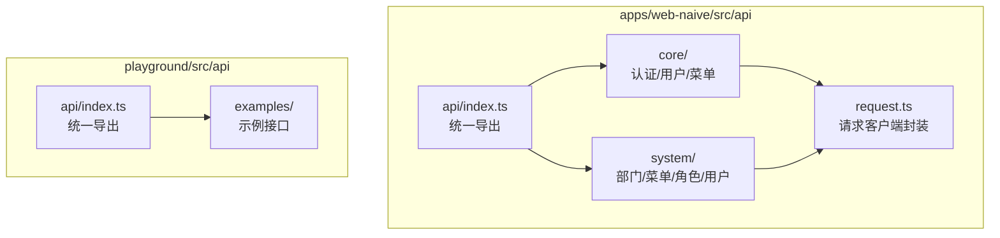
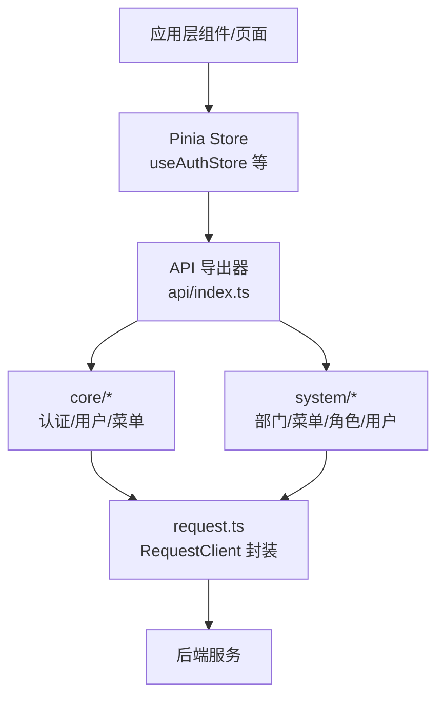
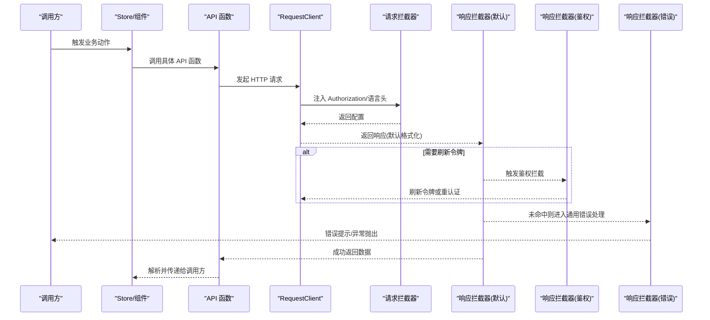
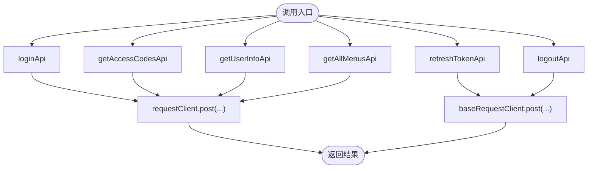
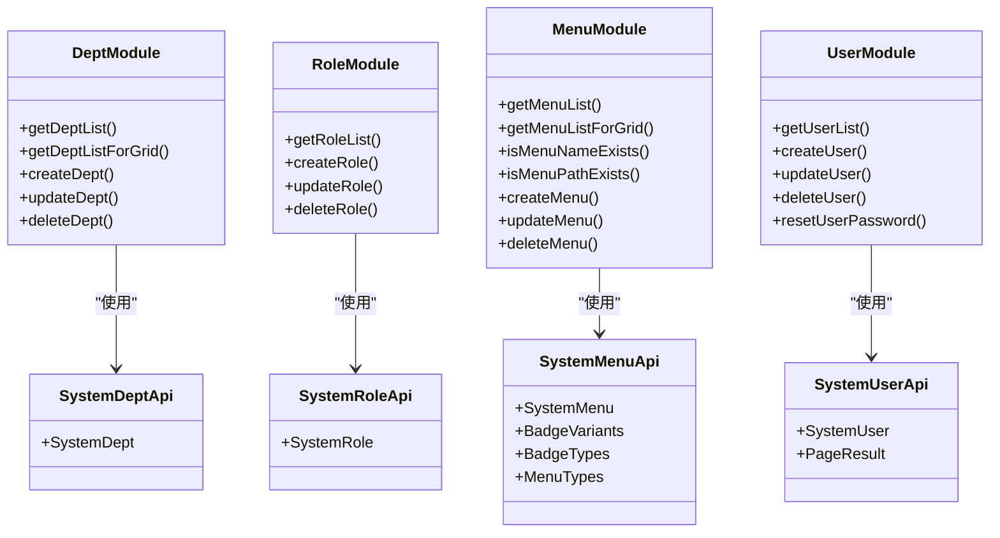
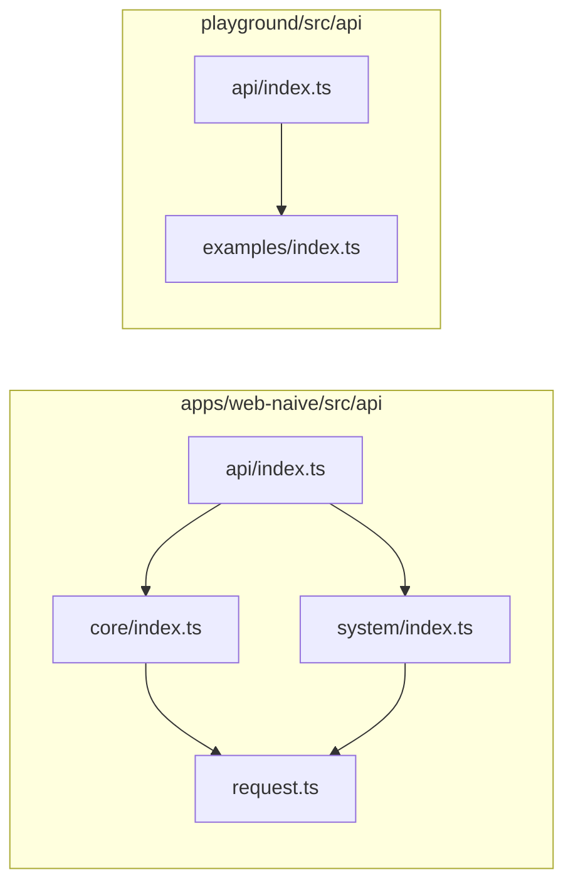

# API 模块组织

<cite>
**本文引用的文件**
- [apps/web-naive/src/api/index.ts](file://apps/web-naive/src/api/index.ts)
- [apps/web-naive/src/api/request.ts](file://apps/web-naive/src/api/request.ts)
- [apps/web-naive/src/api/core/index.ts](file://apps/web-naive/src/api/core/index.ts)
- [apps/web-naive/src/api/core/auth.ts](file://apps/web-naive/src/api/core/auth.ts)
- [apps/web-naive/src/api/core/menu.ts](file://apps/web-naive/src/api/core/menu.ts)
- [apps/web-naive/src/api/core/user.ts](file://apps/web-naive/src/api/core/user.ts)
- [apps/web-naive/src/api/system/index.ts](file://apps/web-naive/src/api/system/index.ts)
- [apps/web-naive/src/api/system/dept.ts](file://apps/web-naive/src/api/system/dept.ts)
- [apps/web-naive/src/api/system/menu.ts](file://apps/web-naive/src/api/system/menu.ts)
- [apps/web-naive/src/api/system/role.ts](file://apps/web-naive/src/api/system/role.ts)
- [apps/web-naive/src/api/system/user.ts](file://apps/web-naive/src/api/system/user.ts)
- [playground/src/api/index.ts](file://playground/src/api/index.ts)
- [playground/src/api/examples/index.ts](file://playground/src/api/examples/index.ts)
- [playground/src/api/examples/table.ts](file://playground/src/api/examples/table.ts)
- [apps/web-naive/src/store/auth.ts](file://apps/web-naive/src/store/auth.ts)
</cite>

## 目录

1. [简介](#简介)
2. [项目结构](#项目结构)
3. [核心组件](#核心组件)
4. [架构总览](#架构总览)
5. [详细组件分析](#详细组件分析)
6. [依赖分析](#依赖分析)
7. [性能考虑](#性能考虑)
8. [故障排查指南](#故障排查指南)
9. [结论](#结论)
10. [附录](#附录)

## 简介

本文件面向 shiyu-ui 项目的 API 模块组织，系统性阐述 API 的模块化划分原则与组织方式，覆盖核心模块（认证、用户、菜单等）、系统模块（部门、菜单、角色、用户）以及其他业务模块（示例），并说明命名规范、目录结构、接口导出方式、模块间依赖与调用关系，以及新模块开发最佳实践与使用示例。

## 项目结构

API 模块位于应用层的 src/api 目录，采用“按功能域分层 + 按领域聚合”的组织方式：

- apps/web-naive/src/api：主应用 API 模块
- playground/src/api：演示应用 API 模块
- 每个子目录代表一个功能域，如 core、system、examples 等
- 每个子目录通常包含若干业务接口文件与一个 index.ts 导出器，统一对外暴露

图表来源

- [apps/web-naive/src/api/index.ts:1-2](file://apps/web-naive/src/api/index.ts#L1-L2)
- [apps/web-naive/src/api/core/index.ts:1-4](file://apps/web-naive/src/api/core/index.ts#L1-L4)
- [apps/web-naive/src/api/system/index.ts:1-5](file://apps/web-naive/src/api/system/index.ts#L1-L5)
- [apps/web-naive/src/api/request.ts:1-114](file://apps/web-naive/src/api/request.ts#L1-L114)
- [playground/src/api/index.ts:1-4](file://playground/src/api/index.ts#L1-L4)

章节来源

- [apps/web-naive/src/api/index.ts:1-2](file://apps/web-naive/src/api/index.ts#L1-L2)
- [apps/web-naive/src/api/core/index.ts:1-4](file://apps/web-naive/src/api/core/index.ts#L1-L4)
- [apps/web-naive/src/api/system/index.ts:1-5](file://apps/web-naive/src/api/system/index.ts#L1-L5)
- [playground/src/api/index.ts:1-4](file://playground/src/api/index.ts#L1-L4)

## 核心组件

- 请求客户端封装：基于 @vben/request 构建，统一注入鉴权头、语言头、响应拦截器、错误提示与刷新令牌逻辑
- 核心模块：认证（登录/刷新/登出/权限码）、用户（个人信息）、菜单（全量菜单）
- 系统模块：部门、菜单、角色、用户管理（CRUD、分页、校验唯一性）
- 示例模块：演示场景下的接口（如表格分页）

章节来源

- [apps/web-naive/src/api/request.ts:1-114](file://apps/web-naive/src/api/request.ts#L1-L114)
- [apps/web-naive/src/api/core/auth.ts:1-52](file://apps/web-naive/src/api/core/auth.ts#L1-L52)
- [apps/web-naive/src/api/core/user.ts:1-11](file://apps/web-naive/src/api/core/user.ts#L1-L11)
- [apps/web-naive/src/api/core/menu.ts:1-11](file://apps/web-naive/src/api/core/menu.ts#L1-L11)
- [apps/web-naive/src/api/system/dept.ts:1-64](file://apps/web-naive/src/api/system/dept.ts#L1-L64)
- [apps/web-naive/src/api/system/menu.ts:1-169](file://apps/web-naive/src/api/system/menu.ts#L1-L169)
- [apps/web-naive/src/api/system/role.ts:1-56](file://apps/web-naive/src/api/system/role.ts#L1-L56)
- [apps/web-naive/src/api/system/user.ts:1-99](file://apps/web-naive/src/api/system/user.ts#L1-L99)
- [playground/src/api/examples/table.ts:1-19](file://playground/src/api/examples/table.ts#L1-L19)

## 架构总览

API 层通过 request.ts 统一封装网络请求，核心模块与系统模块分别提供业务接口；应用层（如 store）通过统一导出入口按需引入具体接口函数，形成清晰的“请求封装—业务接口—应用调用”链路。

图表来源

- [apps/web-naive/src/api/index.ts:1-2](file://apps/web-naive/src/api/index.ts#L1-L2)
- [apps/web-naive/src/api/core/index.ts:1-4](file://apps/web-naive/src/api/core/index.ts#L1-L4)
- [apps/web-naive/src/api/system/index.ts:1-5](file://apps/web-naive/src/api/system/index.ts#L1-L5)
- [apps/web-naive/src/api/request.ts:1-114](file://apps/web-naive/src/api/request.ts#L1-L114)
- [apps/web-naive/src/store/auth.ts:1-119](file://apps/web-naive/src/store/auth.ts#L1-L119)

## 详细组件分析

### 请求客户端封装（request.ts）

- 功能职责
  - 基于 baseURL 初始化 RequestClient
  - 注入请求拦截器：自动附加 Authorization 与 Accept-Language
  - 注入响应拦截器：默认响应格式化、鉴权失败刷新/重认证、通用错误提示
  - 对外导出 requestClient（带拦截器）与 baseRequestClient（基础客户端）
- 关键点
  - 支持刷新令牌开关与刷新逻辑
  - 统一 code/data/total 字段映射，兼容后端不同返回结构
  - 错误提示可按业务定制

图表来源

- [apps/web-naive/src/api/request.ts:23-107](file://apps/web-naive/src/api/request.ts#L23-L107)

章节来源

- [apps/web-naive/src/api/request.ts:1-114](file://apps/web-naive/src/api/request.ts#L1-L114)

### 核心模块（core）

- 认证（auth）
  - 登录、刷新访问令牌、登出、获取权限码
  - 使用 requestClient/post 与 baseRequestClient/post 区分是否需要拦截器
- 用户（user）
  - 获取用户信息
- 菜单（menu）
  - 获取全量菜单

图表来源

- [apps/web-naive/src/api/core/auth.ts:24-51](file://apps/web-naive/src/api/core/auth.ts#L24-L51)
- [apps/web-naive/src/api/core/user.ts:8-10](file://apps/web-naive/src/api/core/user.ts#L8-L10)
- [apps/web-naive/src/api/core/menu.ts:8-10](file://apps/web-naive/src/api/core/menu.ts#L8-L10)

章节来源

- [apps/web-naive/src/api/core/auth.ts:1-52](file://apps/web-naive/src/api/core/auth.ts#L1-L52)
- [apps/web-naive/src/api/core/user.ts:1-11](file://apps/web-naive/src/api/core/user.ts#L1-L11)
- [apps/web-naive/src/api/core/menu.ts:1-11](file://apps/web-naive/src/api/core/menu.ts#L1-L11)

### 系统模块（system）

- 部门（dept）
  - 列表查询、vxe-table 包装、创建、更新、删除
- 菜单（menu）
  - 列表查询、vxe-table 包装、名称/路径唯一性校验、创建、更新、删除
- 角色（role）
  - 列表查询、创建、更新、删除
- 用户（user）
  - 分页列表（适配后端分页字段）、创建、更新、删除、重置密码

图表来源

- [apps/web-naive/src/api/system/dept.ts:3-63](file://apps/web-naive/src/api/system/dept.ts#L3-L63)
- [apps/web-naive/src/api/system/role.ts:5-55](file://apps/web-naive/src/api/system/role.ts#L5-L55)
- [apps/web-naive/src/api/system/menu.ts:5-168](file://apps/web-naive/src/api/system/menu.ts#L5-L168)
- [apps/web-naive/src/api/system/user.ts:5-98](file://apps/web-naive/src/api/system/user.ts#L5-L98)

章节来源

- [apps/web-naive/src/api/system/dept.ts:1-64](file://apps/web-naive/src/api/system/dept.ts#L1-L64)
- [apps/web-naive/src/api/system/menu.ts:1-169](file://apps/web-naive/src/api/system/menu.ts#L1-L169)
- [apps/web-naive/src/api/system/role.ts:1-56](file://apps/web-naive/src/api/system/role.ts#L1-L56)
- [apps/web-naive/src/api/system/user.ts:1-99](file://apps/web-naive/src/api/system/user.ts#L1-L99)

### 示例模块（playground/examples）

- 示例接口（table）
  - 分页参数适配与数据返回结构包装
- 示例导出器
  - 统一导出示例相关接口

章节来源

- [playground/src/api/examples/index.ts:1-3](file://playground/src/api/examples/index.ts#L1-L3)
- [playground/src/api/examples/table.ts:1-19](file://playground/src/api/examples/table.ts#L1-L19)

## 依赖分析

- 模块导出
  - apps/web-naive/src/api/index.ts：统一导出 core、system
  - apps/web-naive/src/api/core/index.ts：统一导出 auth、menu、user
  - apps/web-naive/src/api/system/index.ts：统一导出 dept、menu、role、user
  - playground/src/api/index.ts：统一导出 core、examples、system
- 调用关系
  - 应用层（如 store）通过 api/index.ts 按需引入具体接口函数
  - 所有接口函数均依赖 request.ts 提供的 requestClient/baseRequestClient
- 依赖方向
  - API 层仅向下依赖 request.ts，不反向依赖上层组件
  - 各业务模块内部保持低耦合，通过公共类型与请求客户端交互

图表来源

- [apps/web-naive/src/api/index.ts:1-2](file://apps/web-naive/src/api/index.ts#L1-L2)
- [apps/web-naive/src/api/core/index.ts:1-4](file://apps/web-naive/src/api/core/index.ts#L1-L4)
- [apps/web-naive/src/api/system/index.ts:1-5](file://apps/web-naive/src/api/system/index.ts#L1-L5)
- [apps/web-naive/src/api/request.ts:1-114](file://apps/web-naive/src/api/request.ts#L1-L114)
- [playground/src/api/index.ts:1-4](file://playground/src/api/index.ts#L1-L4)
- [playground/src/api/examples/index.ts:1-3](file://playground/src/api/examples/index.ts#L1-L3)

章节来源

- [apps/web-naive/src/api/index.ts:1-2](file://apps/web-naive/src/api/index.ts#L1-L2)
- [apps/web-naive/src/api/core/index.ts:1-4](file://apps/web-naive/src/api/core/index.ts#L1-L4)
- [apps/web-naive/src/api/system/index.ts:1-5](file://apps/web-naive/src/api/system/index.ts#L1-L5)
- [playground/src/api/index.ts:1-4](file://playground/src/api/index.ts#L1-L4)

## 性能考虑

- 请求拦截与响应拦截的链式处理应避免重复计算，确保鉴权头与语言头只在必要时设置
- 分页接口建议结合后端分页字段与前端缓存策略，减少不必要的重复请求
- 错误处理拦截器应尽量早返回，避免后续拦截器重复处理
- 大对象传输建议在接口侧进行字段裁剪与懒加载，降低首屏压力

## 故障排查指南

- 登录失败/鉴权失效
  - 检查鉴权拦截器是否正确触发刷新令牌流程
  - 确认刷新令牌接口返回的访问令牌已写入访问存储
- 无错误信息提示
  - 检查通用错误拦截器对后端错误字段的提取逻辑（error/message）
- 请求头缺失
  - 确认请求拦截器已注入 Authorization 与 Accept-Language
- 跨模块调用
  - 通过 api/index.ts 统一导出，避免直接跨目录引用，降低耦合

章节来源

- [apps/web-naive/src/api/request.ts:63-104](file://apps/web-naive/src/api/request.ts#L63-L104)
- [apps/web-naive/src/store/auth.ts:34-74](file://apps/web-naive/src/store/auth.ts#L34-L74)

## 结论

本项目 API 模块以“请求封装 + 功能域聚合”的方式实现了高内聚、低耦合的组织结构。通过统一导出器与清晰的命名规范，既保证了模块边界明确，又便于跨模块复用与扩展。建议在新增模块时遵循现有命名与导出约定，并优先使用 request.ts 提供的拦截器能力，确保一致的鉴权与错误处理体验。

## 附录

### 命名规范与组织结构

- 文件命名
  - 业务接口文件采用小驼峰命名，如 auth.ts、menu.ts、user.ts
- 目录结构
  - core：核心域（认证/用户/菜单）
  - system：系统域（部门/菜单/角色/用户）
  - examples：演示域（示例接口）
- 导出方式
  - 每个子目录提供 index.ts，统一导出该域内的接口函数
  - 根级 api/index.ts 统一导出各域

章节来源

- [apps/web-naive/src/api/core/index.ts:1-4](file://apps/web-naive/src/api/core/index.ts#L1-L4)
- [apps/web-naive/src/api/system/index.ts:1-5](file://apps/web-naive/src/api/system/index.ts#L1-L5)
- [apps/web-naive/src/api/index.ts:1-2](file://apps/web-naive/src/api/index.ts#L1-L2)
- [playground/src/api/examples/index.ts:1-3](file://playground/src/api/examples/index.ts#L1-L3)

### 使用示例与最佳实践

- 使用示例
  - 在应用层（如 store）通过 api/index.ts 导入所需接口，避免直接引用具体文件路径
  - 登录流程可参考 useAuthStore 中对 loginApi、getUserInfoApi、getAccessCodesApi 的组合使用
- 最佳实践
  - 新增接口统一在对应域目录下新建文件，并在该域的 index.ts 中导出
  - 参数与返回值尽量使用命名空间类型定义，提升可维护性
  - 分页接口统一处理后端字段映射，保证上层调用一致性
  - 避免在接口层引入 UI 组件或 store，保持纯数据层职责

章节来源

- [apps/web-naive/src/store/auth.ts:13-105](file://apps/web-naive/src/store/auth.ts#L13-L105)
- [apps/web-naive/src/api/system/user.ts:33-50](file://apps/web-naive/src/api/system/user.ts#L33-L50)
