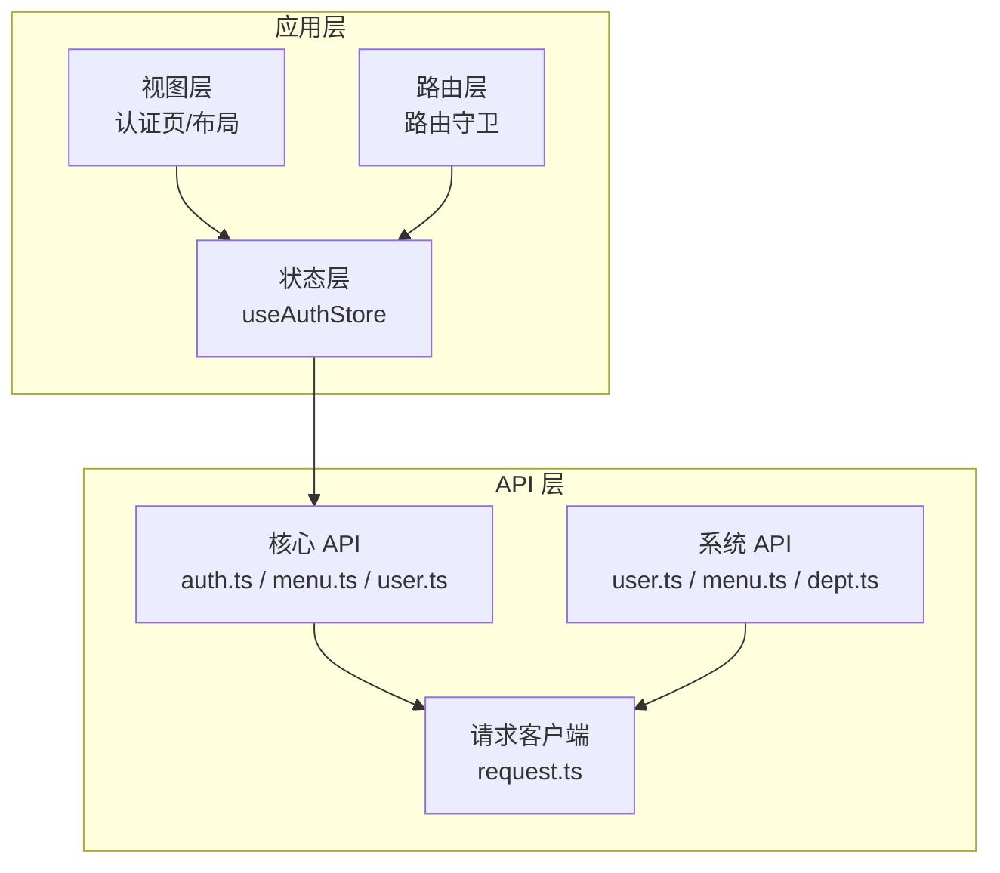
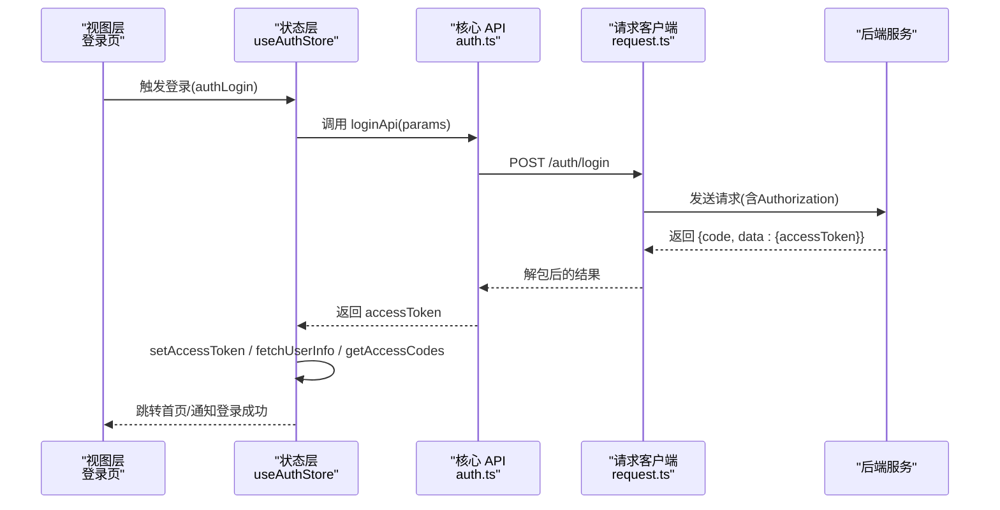
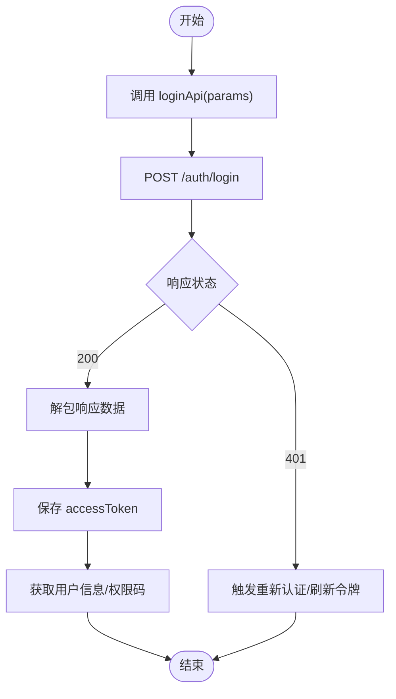
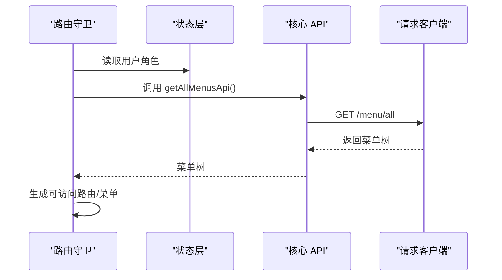
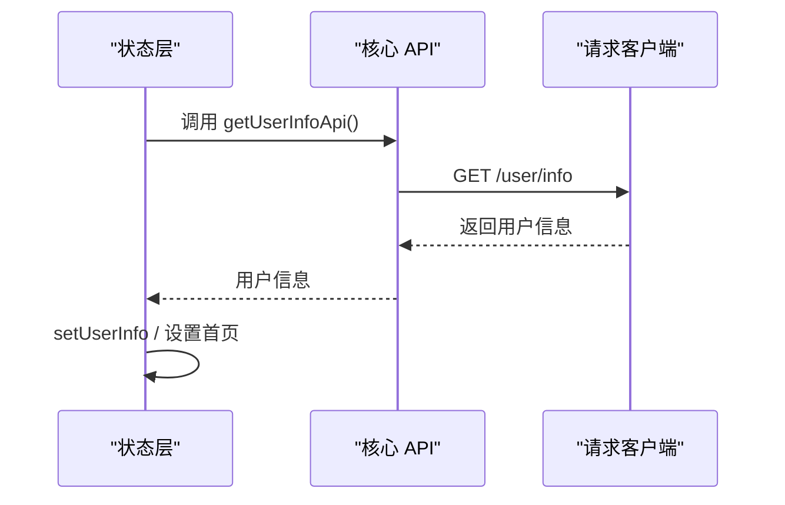
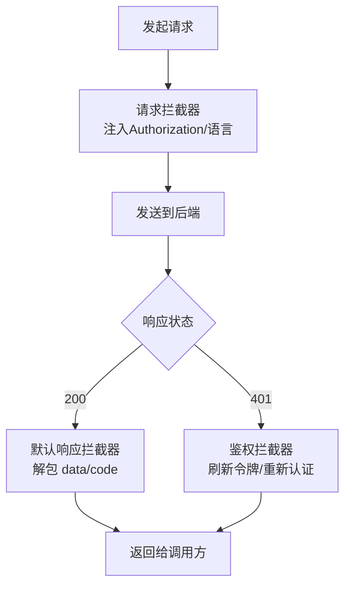
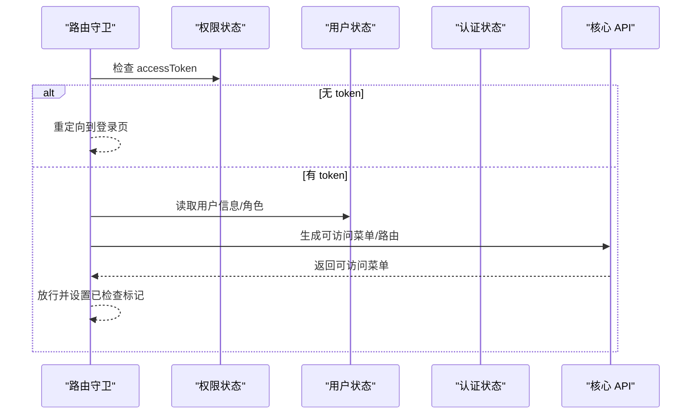
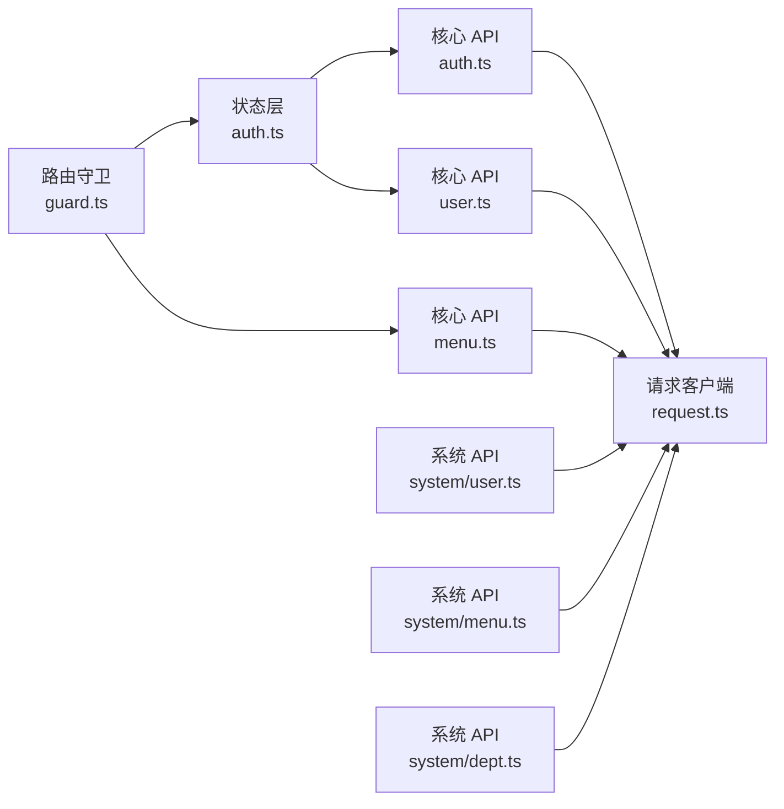

# 核心 API 模块

<cite>
**本文引用的文件**
- [apps/web-naive/src/api/core/index.ts](file://apps/web-naive/src/api/core/index.ts)
- [apps/web-naive/src/api/core/auth.ts](file://apps/web-naive/src/api/core/auth.ts)
- [apps/web-naive/src/api/core/menu.ts](file://apps/web-naive/src/api/core/menu.ts)
- [apps/web-naive/src/api/core/user.ts](file://apps/web-naive/src/api/core/user.ts)
- [apps/web-naive/src/api/request.ts](file://apps/web-naive/src/api/request.ts)
- [apps/web-naive/src/store/auth.ts](file://apps/web-naive/src/store/auth.ts)
- [apps/web-naive/src/router/guard.ts](file://apps/web-naive/src/router/guard.ts)
- [apps/web-naive/src/views/_core/authentication/login.vue](file://apps/web-naive/src/views/_core/authentication/login.vue)
- [apps/web-naive/src/layouts/auth.vue](file://apps/web-naive/src/layouts/auth.vue)
- [apps/web-naive/src/api/system/user.ts](file://apps/web-naive/src/api/system/user.ts)
- [apps/web-naive/src/api/system/menu.ts](file://apps/web-naive/src/api/system/menu.ts)
- [apps/web-naive/src/api/system/dept.ts](file://apps/web-naive/src/api/system/dept.ts)
- [packages/types/src/user.ts](file://packages/types/src/user.ts)
</cite>

## 目录

1. [简介](#简介)
2. [项目结构](#项目结构)
3. [核心组件](#核心组件)
4. [架构总览](#架构总览)
5. [详细组件分析](#详细组件分析)
6. [依赖分析](#依赖分析)
7. [性能考虑](#性能考虑)
8. [故障排查指南](#故障排查指南)
9. [结论](#结论)
10. [附录](#附录)

## 简介

本文件面向 shiyu-ui 项目的“核心 API 模块”，系统性梳理认证（auth）、菜单（menu）、用户（user）三大核心接口的设计理念、职责边界与实现细节，并阐明其与路由守卫、状态管理、系统模块之间的关系。文档同时提供认证流程、菜单获取、用户信息管理等典型场景的使用说明，以及扩展与自定义配置建议。

## 项目结构

核心 API 模块位于应用层的 API 层，采用按功能域划分的组织方式：核心 API（core）与系统 API（system）分离，便于区分“平台能力”与“业务数据”。核心 API 通过统一请求客户端封装网络层，配合拦截器完成鉴权、刷新令牌、错误提示等横切逻辑；系统 API 则聚焦于后台管理系统中的用户、菜单、部门等实体 CRUD。

图表来源

- [apps/web-naive/src/api/core/index.ts:1-4](file://apps/web-naive/src/api/core/index.ts#L1-L4)
- [apps/web-naive/src/api/request.ts:1-114](file://apps/web-naive/src/api/request.ts#L1-L114)
- [apps/web-naive/src/store/auth.ts:1-119](file://apps/web-naive/src/store/auth.ts#L1-L119)
- [apps/web-naive/src/router/guard.ts:1-133](file://apps/web-naive/src/router/guard.ts#L1-L133)

章节来源

- [apps/web-naive/src/api/core/index.ts:1-4](file://apps/web-naive/src/api/core/index.ts#L1-L4)
- [apps/web-naive/src/api/request.ts:1-114](file://apps/web-naive/src/api/request.ts#L1-L114)

## 核心组件

- 认证模块（auth）
  - 职责：登录、刷新令牌、退出登录、获取权限码
  - 关键接口：loginApi、refreshTokenApi、logoutApi、getAccessCodesApi
  - 数据模型：LoginParams、LoginResult、RefreshTokenResult
- 菜单模块（menu）
  - 职责：获取用户可见菜单树
  - 关键接口：getAllMenusApi
  - 返回类型：RouteRecordStringComponent[]
- 用户模块（user）
  - 职责：获取当前用户信息
  - 关键接口：getUserInfoApi
  - 返回类型：UserInfo

章节来源

- [apps/web-naive/src/api/core/auth.ts:1-52](file://apps/web-naive/src/api/core/auth.ts#L1-L52)
- [apps/web-naive/src/api/core/menu.ts:1-11](file://apps/web-naive/src/api/core/menu.ts#L1-L11)
- [apps/web-naive/src/api/core/user.ts:1-11](file://apps/web-naive/src/api/core/user.ts#L1-L11)
- [packages/types/src/user.ts:1-20](file://packages/types/src/user.ts#L1-L20)

## 架构总览

核心 API 的调用链路遵循“视图 -> 状态 -> 核心 API -> 请求客户端 -> 后端服务”的模式。请求客户端内置拦截器，负责：

- 请求头注入：自动附加 Authorization 与语言头
- 响应解包：按约定字段解包 data/code
- 鉴权刷新：在 401 场景下尝试刷新令牌或触发重新认证
- 错误提示：兜底错误消息展示

图表来源

- [apps/web-naive/src/views/\_core/authentication/login.vue:1-99](file://apps/web-naive/src/views/_core/authentication/login.vue#L1-L99)
- [apps/web-naive/src/store/auth.ts:28-79](file://apps/web-naive/src/store/auth.ts#L28-L79)
- [apps/web-naive/src/api/core/auth.ts:24-26](file://apps/web-naive/src/api/core/auth.ts#L24-L26)
- [apps/web-naive/src/api/request.ts:63-104](file://apps/web-naive/src/api/request.ts#L63-L104)

## 详细组件分析

### 认证模块（auth）

- 接口与职责
  - loginApi：提交用户名/密码，换取 accessToken
  - refreshTokenApi：刷新 accessToken（需携带凭证）
  - logoutApi：退出登录（需携带凭证）
  - getAccessCodesApi：获取用户权限码列表
- 参数与返回
  - LoginParams：username/password 可选
  - LoginResult：包含 accessToken 字段
  - RefreshTokenResult：包含 data/status
- 错误处理
  - 401 场景下，请求客户端触发刷新令牌或重新认证流程
  - 通用错误通过响应拦截器统一提示

图表来源

- [apps/web-naive/src/api/core/auth.ts:24-51](file://apps/web-naive/src/api/core/auth.ts#L24-L51)
- [apps/web-naive/src/api/request.ts:83-104](file://apps/web-naive/src/api/request.ts#L83-L104)

章节来源

- [apps/web-naive/src/api/core/auth.ts:1-52](file://apps/web-naive/src/api/core/auth.ts#L1-L52)
- [apps/web-naive/src/api/request.ts:1-114](file://apps/web-naive/src/api/request.ts#L1-L114)

### 菜单模块（menu）

- 接口与职责
  - getAllMenusApi：获取用户可见菜单树
- 返回类型
  - RouteRecordStringComponent[]：符合路由记录的字符串组件形式
- 使用场景
  - 路由守卫生成动态路由时消费菜单数据
  - 导航组件渲染菜单树

图表来源

- [apps/web-naive/src/router/guard.ts:98-108](file://apps/web-naive/src/router/guard.ts#L98-L108)
- [apps/web-naive/src/api/core/menu.ts:8-10](file://apps/web-naive/src/api/core/menu.ts#L8-L10)
- [apps/web-naive/src/api/request.ts:1-114](file://apps/web-naive/src/api/request.ts#L1-L114)

章节来源

- [apps/web-naive/src/api/core/menu.ts:1-11](file://apps/web-naive/src/api/core/menu.ts#L1-L11)
- [apps/web-naive/src/router/guard.ts:1-133](file://apps/web-naive/src/router/guard.ts#L1-L133)

### 用户模块（user）

- 接口与职责
  - getUserInfoApi：获取当前登录用户信息
- 返回类型
  - UserInfo：包含用户基本信息、首页路径、token 等
- 与认证流程的关系
  - 登录成功后，状态层并发拉取用户信息与权限码，随后跳转首页

图表来源

- [apps/web-naive/src/store/auth.ts:101-105](file://apps/web-naive/src/store/auth.ts#L101-L105)
- [apps/web-naive/src/api/core/user.ts:8-10](file://apps/web-naive/src/api/core/user.ts#L8-L10)
- [apps/web-naive/src/api/request.ts:1-114](file://apps/web-naive/src/api/request.ts#L1-L114)
- [packages/types/src/user.ts:1-20](file://packages/types/src/user.ts#L1-L20)

章节来源

- [apps/web-naive/src/api/core/user.ts:1-11](file://apps/web-naive/src/api/core/user.ts#L1-L11)
- [apps/web-naive/src/store/auth.ts:101-105](file://apps/web-naive/src/store/auth.ts#L101-L105)
- [packages/types/src/user.ts:1-20](file://packages/types/src/user.ts#L1-L20)

### 请求客户端与拦截器（request）

- 统一基座
  - requestClient：默认解包 data/code，统一返回 data
  - baseRequestClient：不启用默认解包，用于无需解包的场景（如登出/刷新）
- 拦截器
  - 请求头拦截：注入 Authorization 与 Accept-Language
  - 响应拦截：默认解包、鉴权刷新、通用错误提示
  - 刷新策略：可配置是否启用刷新令牌，失败则触发重新认证

图表来源

- [apps/web-naive/src/api/request.ts:63-104](file://apps/web-naive/src/api/request.ts#L63-L104)

章节来源

- [apps/web-naive/src/api/request.ts:1-114](file://apps/web-naive/src/api/request.ts#L1-L114)

### 状态层与路由守卫（store/auth 与 router/guard）

- 状态层（useAuthStore）
  - authLogin：登录主流程，保存 token、并发拉取用户信息与权限码、跳转首页
  - logout：调用后端登出、重置状态、回退登录页
  - fetchUserInfo：获取并缓存用户信息
- 路由守卫
  - 未登录或无权限时重定向至登录页
  - 已登录且未生成动态路由时，基于菜单生成可访问路由并写入状态

图表来源

- [apps/web-naive/src/router/guard.ts:47-119](file://apps/web-naive/src/router/guard.ts#L47-L119)
- [apps/web-naive/src/store/auth.ts:28-79](file://apps/web-naive/src/store/auth.ts#L28-L79)

章节来源

- [apps/web-naive/src/store/auth.ts:1-119](file://apps/web-naive/src/store/auth.ts#L1-L119)
- [apps/web-naive/src/router/guard.ts:1-133](file://apps/web-naive/src/router/guard.ts#L1-L133)

### 视图层与布局（views/\_core/authentication/login.vue 与 layouts/auth.vue）

- 登录页
  - 表单 Schema 定义用户名/密码/验证码
  - 绑定 useAuthStore.authLogin 执行登录
- 认证布局
  - 提供统一的认证页容器与品牌信息

章节来源

- [apps/web-naive/src/views/\_core/authentication/login.vue:1-99](file://apps/web-naive/src/views/_core/authentication/login.vue#L1-L99)
- [apps/web-naive/src/layouts/auth.vue:1-26](file://apps/web-naive/src/layouts/auth.vue#L1-L26)

## 依赖分析

- 模块内聚与耦合
  - 核心 API 仅依赖统一请求客户端，保持低耦合
  - 状态层聚合核心 API 与系统 API，形成业务编排中心
  - 路由守卫依赖状态层与核心 API，确保访问控制一致性
- 外部依赖
  - 类型定义来自 @vben/types，确保 UserInfo 等模型一致
  - 配置偏好来自 @vben/preferences，影响刷新策略与界面行为

图表来源

- [apps/web-naive/src/api/core/auth.ts:1-52](file://apps/web-naive/src/api/core/auth.ts#L1-L52)
- [apps/web-naive/src/api/core/menu.ts:1-11](file://apps/web-naive/src/api/core/menu.ts#L1-L11)
- [apps/web-naive/src/api/core/user.ts:1-11](file://apps/web-naive/src/api/core/user.ts#L1-L11)
- [apps/web-naive/src/api/request.ts:1-114](file://apps/web-naive/src/api/request.ts#L1-L114)
- [apps/web-naive/src/store/auth.ts:1-119](file://apps/web-naive/src/store/auth.ts#L1-L119)
- [apps/web-naive/src/router/guard.ts:1-133](file://apps/web-naive/src/router/guard.ts#L1-L133)
- [apps/web-naive/src/api/system/user.ts:1-99](file://apps/web-naive/src/api/system/user.ts#L1-L99)
- [apps/web-naive/src/api/system/menu.ts:1-169](file://apps/web-naive/src/api/system/menu.ts#L1-L169)
- [apps/web-naive/src/api/system/dept.ts:1-64](file://apps/web-naive/src/api/system/dept.ts#L1-L64)

章节来源

- [apps/web-naive/src/api/core/index.ts:1-4](file://apps/web-naive/src/api/core/index.ts#L1-L4)

## 性能考虑

- 并发优化：登录成功后并发拉取用户信息与权限码，减少总等待时间
- 缓存策略：状态层对用户信息与权限码进行本地缓存，避免重复请求
- 请求去重：路由守卫在已生成动态路由后直接放行，避免重复生成菜单/路由
- 体积与加载：核心 API 按需引入，避免不必要的模块打包

## 故障排查指南

- 登录后无法跳转首页
  - 检查登录返回的 accessToken 是否正确写入状态
  - 确认 getUserInfoApi 是否成功返回用户信息
- 401 频繁出现
  - 检查刷新令牌开关与后端令牌有效期
  - 查看请求头 Authorization 是否正确注入
- 菜单不显示
  - 确认路由守卫已生成可访问菜单并写入状态
  - 检查用户角色是否包含对应权限

章节来源

- [apps/web-naive/src/store/auth.ts:28-79](file://apps/web-naive/src/store/auth.ts#L28-L79)
- [apps/web-naive/src/api/request.ts:83-104](file://apps/web-naive/src/api/request.ts#L83-L104)
- [apps/web-naive/src/router/guard.ts:98-119](file://apps/web-naive/src/router/guard.ts#L98-L119)

## 结论

核心 API 模块以“统一请求客户端 + 状态编排 + 路由守卫”为核心，实现了认证、菜单与用户信息的标准化接入。通过并发优化、拦截器统一处理与清晰的职责划分，既保证了开发效率，也提升了运行时稳定性。系统 API 与核心 API 的分离设计，使得平台能力与业务数据解耦，便于扩展与维护。

## 附录

- 使用示例（场景化）
  - 认证流程
    - 登录页提交用户名/密码与验证码，调用登录接口
    - 成功后保存 token，拉取用户信息与权限码，跳转首页
  - 菜单获取
    - 路由守卫在首次访问受控路由时，调用菜单接口生成可访问菜单
  - 用户信息管理
    - 登录后拉取用户信息，后续在个人中心等页面复用
- 扩展与自定义
  - 自定义请求拦截器：在现有拦截器基础上新增或替换
  - 自定义刷新策略：通过配置项控制刷新令牌行为
  - 自定义错误提示：在响应拦截器中按业务定制错误消息
