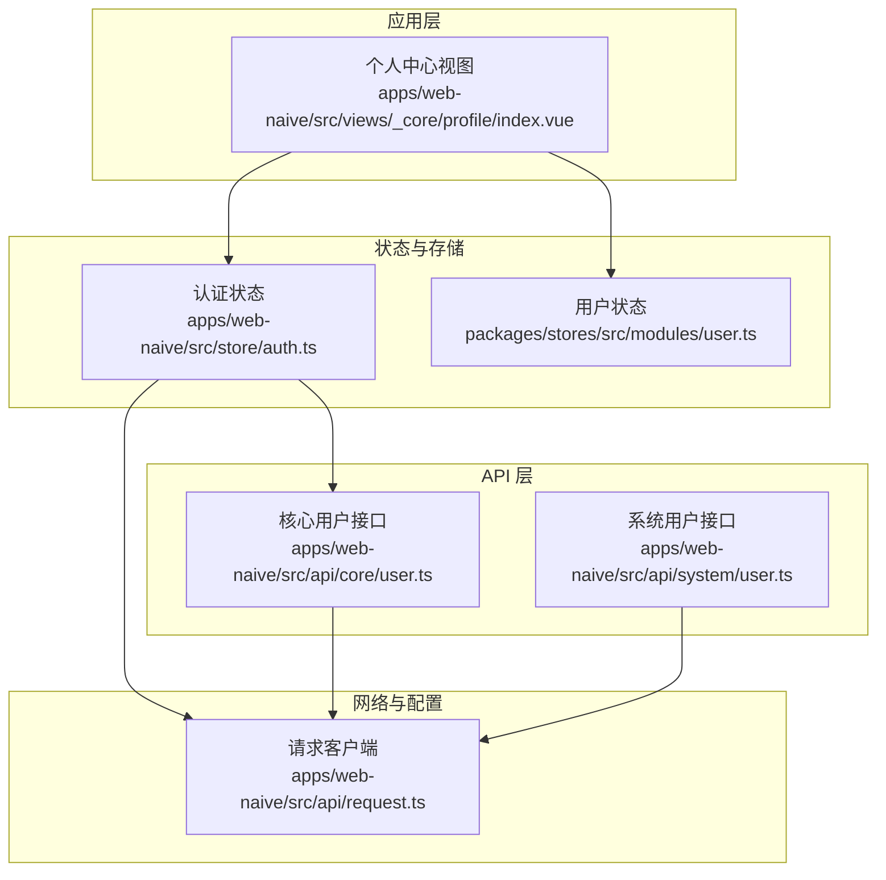
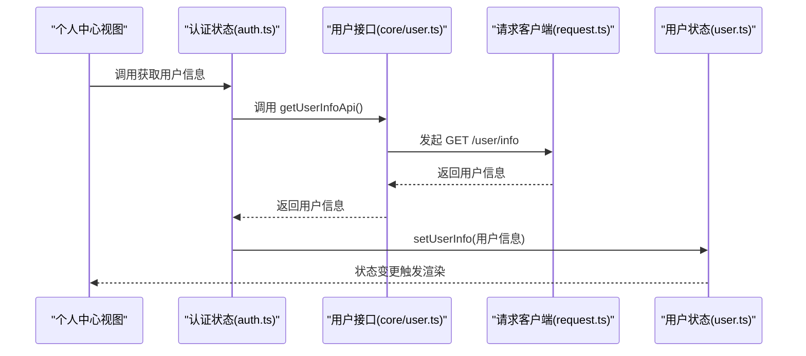
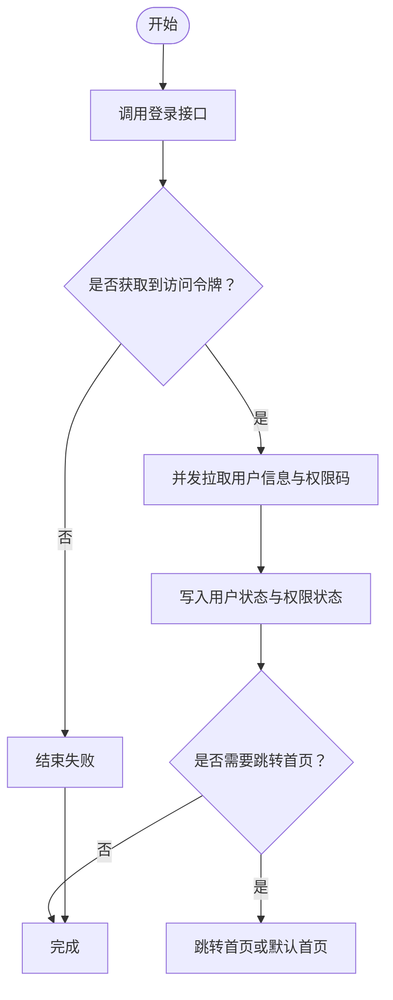
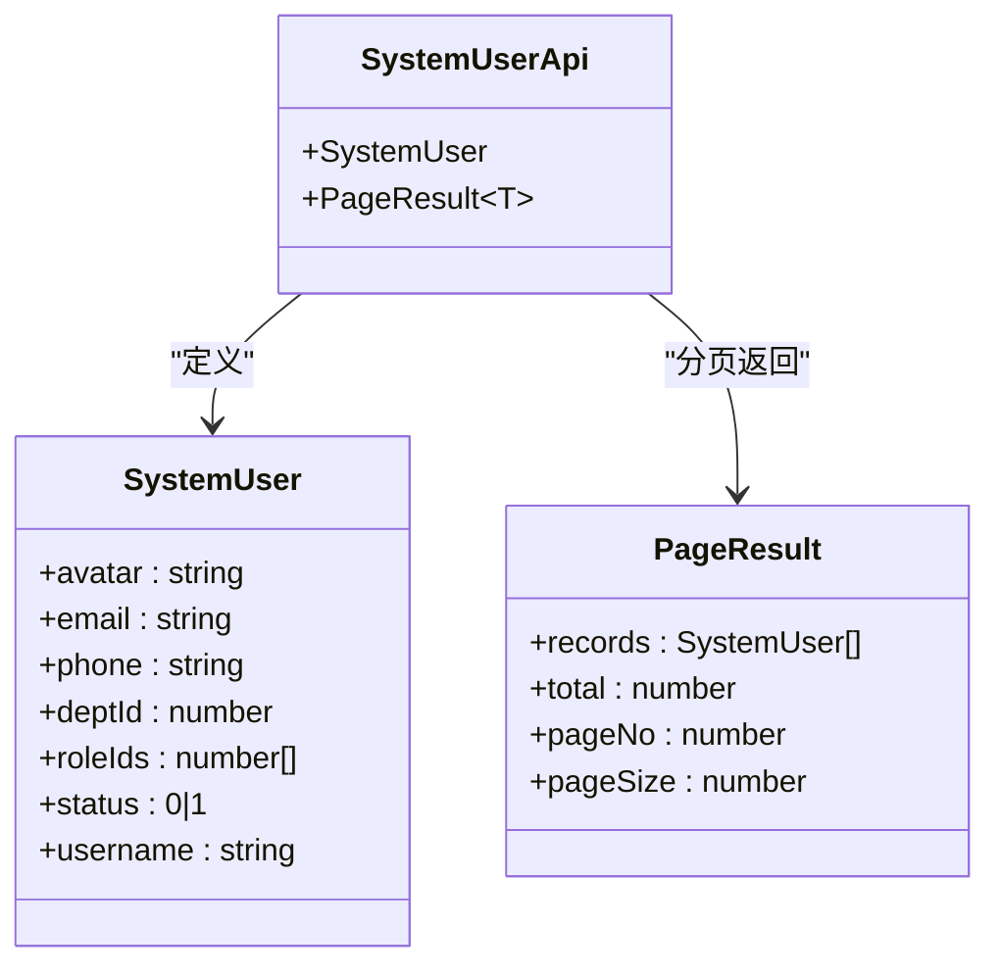
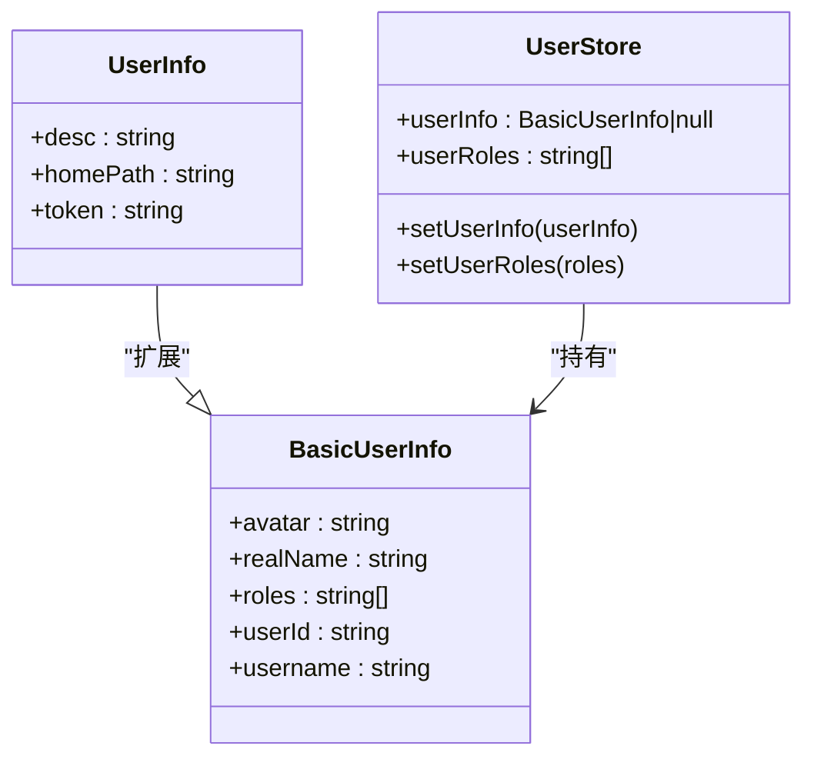
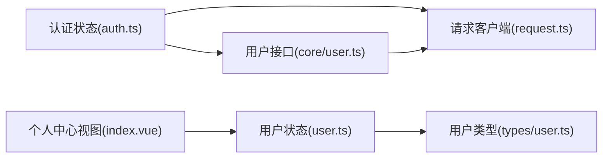

# 用户 API

<cite>
**本文引用的文件**
- [apps/web-naive/src/api/core/user.ts](file://apps/web-naive/src/api/core/user.ts)
- [playground/src/api/core/user.ts](file://playground/src/api/core/user.ts)
- [apps/web-naive/src/store/auth.ts](file://apps/web-naive/src/store/auth.ts)
- [playground/src/store/auth.ts](file://playground/src/store/auth.ts)
- [apps/web-naive/src/api/system/user.ts](file://apps/web-naive/src/api/system/user.ts)
- [packages/types/src/user.ts](file://packages/types/src/user.ts)
- [packages/stores/src/modules/user.ts](file://packages/stores/src/modules/user.ts)
- [apps/web-naive/src/views/_core/profile/index.vue](file://apps/web-naive/src/views/_core/profile/index.vue)
- [playground/src/views/_core/profile/index.vue](file://playground/src/views/_core/profile/index.vue)
- [apps/web-naive/src/api/request.ts](file://apps/web-naive/src/api/request.ts)
- [playground/src/api/request.ts](file://playground/src/api/request.ts)
</cite>

## 目录

1. [简介](#简介)
2. [项目结构](#项目结构)
3. [核心组件](#核心组件)
4. [架构总览](#架构总览)
5. [详细组件分析](#详细组件分析)
6. [依赖分析](#依赖分析)
7. [性能考虑](#性能考虑)
8. [故障排查指南](#故障排查指南)
9. [结论](#结论)
10. [附录：使用示例与最佳实践](#附录使用示例与最佳实践)

## 简介

本文件聚焦于“用户 API 模块”，系统性阐述用户信息获取、用户状态管理与个人资料相关能力在前端侧的设计与实现。内容涵盖：

- 用户数据模型与字段定义
- 用户接口与认证系统的协作关系（令牌传递、用户信息同步）
- 完整使用示例（获取当前用户信息、更新个人设置、管理用户偏好）
- 安全处理与隐私保护要点
- 错误处理与异常场景应对策略

## 项目结构

用户 API 模块由以下关键部分组成：

- 核心用户接口：提供“获取当前用户信息”的基础能力
- 认证与用户状态管理：负责登录、登出、用户信息拉取与缓存
- 系统用户管理：提供后台管理所需的用户增删改查等接口
- 数据模型与状态：统一的用户信息类型与 Pinia 用户状态存储
- 视图层集成：个人中心页面通过用户状态驱动界面渲染
- 请求客户端：统一的请求拦截器、鉴权头注入与错误处理

图表来源

- [apps/web-naive/src/views/\_core/profile/index.vue:1-50](file://apps/web-naive/src/views/_core/profile/index.vue#L1-L50)
- [apps/web-naive/src/store/auth.ts:1-119](file://apps/web-naive/src/store/auth.ts#L1-L119)
- [packages/stores/src/modules/user.ts:1-65](file://packages/stores/src/modules/user.ts#L1-L65)
- [apps/web-naive/src/api/core/user.ts:1-11](file://apps/web-naive/src/api/core/user.ts#L1-L11)
- [apps/web-naive/src/api/system/user.ts:1-99](file://apps/web-naive/src/api/system/user.ts#L1-L99)
- [apps/web-naive/src/api/request.ts:1-114](file://apps/web-naive/src/api/request.ts#L1-L114)

章节来源

- [apps/web-naive/src/api/core/user.ts:1-11](file://apps/web-naive/src/api/core/user.ts#L1-L11)
- [apps/web-naive/src/store/auth.ts:1-119](file://apps/web-naive/src/store/auth.ts#L1-L119)
- [apps/web-naive/src/api/system/user.ts:1-99](file://apps/web-naive/src/api/system/user.ts#L1-L99)
- [packages/types/src/user.ts:1-21](file://packages/types/src/user.ts#L1-L21)
- [packages/stores/src/modules/user.ts:1-65](file://packages/stores/src/modules/user.ts#L1-L65)
- [apps/web-naive/src/views/\_core/profile/index.vue:1-50](file://apps/web-naive/src/views/_core/profile/index.vue#L1-L50)
- [apps/web-naive/src/api/request.ts:1-114](file://apps/web-naive/src/api/request.ts#L1-L114)

## 核心组件

- 用户信息接口
  - 提供“获取当前用户信息”的只读接口，返回用户基本信息与首页路径等
  - 接口路径与泛型类型由请求客户端统一处理
- 认证与用户状态管理
  - 登录流程：调用登录接口获取访问令牌，随后并发拉取用户信息与权限码，并写入状态
  - 登出流程：调用登出接口并清理所有状态，支持带重定向参数跳转登录页
  - 用户信息同步：每次登录或手动刷新时，从服务端拉取最新用户信息并写入用户状态
- 系统用户管理接口
  - 提供用户列表分页查询、创建、更新、删除、重置密码等能力
  - 统一处理后端分页返回结构与数组返回结构
- 用户数据模型与状态
  - 用户信息类型扩展自基础类型，包含头像、昵称、角色、用户ID、用户名、首页路径与令牌
  - 用户状态存储负责持久化用户信息与角色集合
- 视图层集成
  - 个人中心视图通过用户状态驱动界面渲染，支持基本设置、安全设置、修改密码、通知设置等子页面
- 请求客户端
  - 自动注入 Authorization 头与语言头
  - 统一响应格式处理、鉴权失败自动刷新与重新认证、通用错误提示

章节来源

- [apps/web-naive/src/api/core/user.ts:1-11](file://apps/web-naive/src/api/core/user.ts#L1-L11)
- [apps/web-naive/src/store/auth.ts:1-119](file://apps/web-naive/src/store/auth.ts#L1-L119)
- [apps/web-naive/src/api/system/user.ts:1-99](file://apps/web-naive/src/api/system/user.ts#L1-L99)
- [packages/types/src/user.ts:1-21](file://packages/types/src/user.ts#L1-L21)
- [packages/stores/src/modules/user.ts:1-65](file://packages/stores/src/modules/user.ts#L1-L65)
- [apps/web-naive/src/views/\_core/profile/index.vue:1-50](file://apps/web-naive/src/views/_core/profile/index.vue#L1-L50)
- [apps/web-naive/src/api/request.ts:1-114](file://apps/web-naive/src/api/request.ts#L1-L114)

## 架构总览

用户 API 的调用链路围绕“认证状态”与“请求客户端”展开，形成清晰的职责分离与解耦。

图表来源

- [apps/web-naive/src/store/auth.ts:101-105](file://apps/web-naive/src/store/auth.ts#L101-L105)
- [apps/web-naive/src/api/core/user.ts:8-10](file://apps/web-naive/src/api/core/user.ts#L8-L10)
- [apps/web-naive/src/api/request.ts:63-71](file://apps/web-naive/src/api/request.ts#L63-L71)
- [packages/stores/src/modules/user.ts:43-49](file://packages/stores/src/modules/user.ts#L43-L49)

## 详细组件分析

### 用户信息接口（获取当前用户）

- 设计目标
  - 提供只读的当前用户信息获取能力，避免在前端暴露敏感写操作
- 关键点
  - 使用统一请求客户端发起 GET 请求至 /user/info
  - 返回类型为 UserInfo 泛型，确保类型安全
- 典型调用方
  - 登录成功后并发拉取用户信息与权限码
  - 手动刷新用户信息时调用

章节来源

- [apps/web-naive/src/api/core/user.ts:1-11](file://apps/web-naive/src/api/core/user.ts#L1-L11)
- [playground/src/api/core/user.ts:1-11](file://playground/src/api/core/user.ts#L1-L11)

### 认证与用户状态管理（登录/登出/刷新）

- 登录流程
  - 调用登录接口获取访问令牌
  - 并发拉取用户信息与权限码，写入状态
  - 根据用户首页路径或默认首页进行路由跳转
  - 登录成功后显示欢迎通知
- 登出流程
  - 调用登出接口（忽略异常），清理所有状态
  - 支持是否重定向到登录页以及携带当前路由地址
- 用户信息同步
  - 通过 fetchUserInfo 拉取最新用户信息并写入用户状态

图表来源

- [apps/web-naive/src/store/auth.ts:28-79](file://apps/web-naive/src/store/auth.ts#L28-L79)
- [apps/web-naive/src/store/auth.ts:101-105](file://apps/web-naive/src/store/auth.ts#L101-L105)

章节来源

- [apps/web-naive/src/store/auth.ts:1-119](file://apps/web-naive/src/store/auth.ts#L1-L119)
- [playground/src/store/auth.ts:1-127](file://playground/src/store/auth.ts#L1-L127)

### 系统用户管理接口（后台管理）

- 能力范围
  - 用户列表分页查询（兼容后端不同返回结构）
  - 创建用户、更新用户、删除用户
  - 重置用户密码
- 数据模型
  - 用户实体包含头像、邮箱、手机号、部门ID、角色ID数组、状态、用户名等
  - 分页结果包含记录集与总数，兼容数组返回

图表来源

- [apps/web-naive/src/api/system/user.ts:6-28](file://apps/web-naive/src/api/system/user.ts#L6-L28)

章节来源

- [apps/web-naive/src/api/system/user.ts:1-99](file://apps/web-naive/src/api/system/user.ts#L1-L99)

### 用户数据模型与状态

- 用户信息类型
  - 扩展自基础用户信息，新增描述、首页路径与令牌字段
- 用户状态存储
  - 维护用户信息与角色集合
  - 提供设置用户信息与角色的方法

图表来源

- [packages/types/src/user.ts:4-18](file://packages/types/src/user.ts#L4-L18)
- [packages/stores/src/modules/user.ts:3-25](file://packages/stores/src/modules/user.ts#L3-L25)
- [packages/stores/src/modules/user.ts:41-57](file://packages/stores/src/modules/user.ts#L41-L57)

章节来源

- [packages/types/src/user.ts:1-21](file://packages/types/src/user.ts#L1-L21)
- [packages/stores/src/modules/user.ts:1-65](file://packages/stores/src/modules/user.ts#L1-L65)

### 视图层集成（个人中心）

- 个人中心视图通过用户状态驱动界面渲染
- 支持多个设置标签页（基本设置、安全设置、修改密码、通知设置）

章节来源

- [apps/web-naive/src/views/\_core/profile/index.vue:1-50](file://apps/web-naive/src/views/_core/profile/index.vue#L1-L50)
- [playground/src/views/\_core/profile/index.vue:1-50](file://playground/src/views/_core/profile/index.vue#L1-L50)

### 请求客户端（拦截器与错误处理）

- 请求头注入
  - 自动注入 Authorization 与 Accept-Language
- 响应处理
  - 默认响应拦截器：统一 code/data 字段映射
  - 鉴权拦截器：处理令牌过期与刷新
  - 错误提示拦截器：提取后端错误信息并统一提示
- 刷新与重新认证
  - 令牌过期时尝试刷新，失败则触发重新认证（弹窗或强制登出）

章节来源

- [apps/web-naive/src/api/request.ts:1-114](file://apps/web-naive/src/api/request.ts#L1-L114)
- [playground/src/api/request.ts:1-135](file://playground/src/api/request.ts#L1-L135)

## 依赖分析

- 组件耦合
  - 认证状态依赖用户接口与请求客户端
  - 用户状态独立于具体接口，仅通过 setUserInfo 写入
  - 视图层依赖用户状态，不直接依赖接口
- 外部依赖
  - 请求客户端封装了拦截器与错误处理
  - 类型与状态来自共享包（@vben/types、@vben/stores）

图表来源

- [apps/web-naive/src/store/auth.ts:13](file://apps/web-naive/src/store/auth.ts#L13)
- [apps/web-naive/src/api/core/user.ts:3](file://apps/web-naive/src/api/core/user.ts#L3)
- [apps/web-naive/src/api/request.ts:14](file://apps/web-naive/src/api/request.ts#L14)
- [apps/web-naive/src/views/\_core/profile/index.vue:5](file://apps/web-naive/src/views/_core/profile/index.vue#L5)
- [packages/stores/src/modules/user.ts:1](file://packages/stores/src/modules/user.ts#L1)
- [packages/types/src/user.ts:1](file://packages/types/src/user.ts#L1)

## 性能考虑

- 并发拉取
  - 登录成功后并发获取用户信息与权限码，减少总等待时间
- 状态复用
  - 用户信息写入状态后，视图层按需订阅，避免重复请求
- 请求拦截
  - 统一注入令牌与语言头，减少重复配置开销

## 故障排查指南

- 登录后无法看到用户信息
  - 检查登录流程是否正确写入用户状态
  - 确认 getUserInfoApi 是否被调用且返回有效数据
- 令牌过期导致接口失败
  - 检查鉴权拦截器是否正确触发刷新与重新认证
  - 确认刷新接口可用且返回新的访问令牌
- 错误提示不符合预期
  - 检查错误提示拦截器是否正确提取后端错误字段
  - 确认响应格式符合 code/data 的约定

章节来源

- [apps/web-naive/src/store/auth.ts:44-47](file://apps/web-naive/src/store/auth.ts#L44-L47)
- [apps/web-naive/src/api/request.ts:83-104](file://apps/web-naive/src/api/request.ts#L83-L104)
- [playground/src/api/request.ts:98-119](file://playground/src/api/request.ts#L98-L119)

## 结论

用户 API 模块以“只读用户信息接口 + 认证状态管理 + 统一请求客户端”为核心，实现了用户信息获取、登录态维护与错误处理的闭环。通过并发拉取、状态复用与拦截器机制，既保证了用户体验，也提升了系统的稳定性与可维护性。系统用户管理接口为后台提供了完善的 CRUD 能力，配合统一的数据模型与分页处理，满足多场景需求。

## 附录：使用示例与最佳实践

- 获取当前用户信息
  - 在认证状态中调用获取用户信息方法，随后写入用户状态
  - 参考路径：[apps/web-naive/src/store/auth.ts:101-105](file://apps/web-naive/src/store/auth.ts#L101-L105)
- 更新个人设置与偏好
  - 个人中心视图通过用户状态驱动渲染
  - 参考路径：[apps/web-naive/src/views/\_core/profile/index.vue:1-50](file://apps/web-naive/src/views/_core/profile/index.vue#L1-L50)
- 管理用户偏好（如语言、主题）
  - 建议通过全局偏好配置与用户状态结合，避免在用户接口中暴露敏感写操作
- 安全与隐私
  - 仅通过只读接口获取用户信息，避免在前端暴露写操作
  - 统一通过请求拦截器注入令牌，避免硬编码或明文传输
- 错误处理
  - 依赖统一错误提示拦截器，确保错误信息一致化展示
  - 对于鉴权失败场景，优先尝试刷新令牌，失败后再触发重新认证
