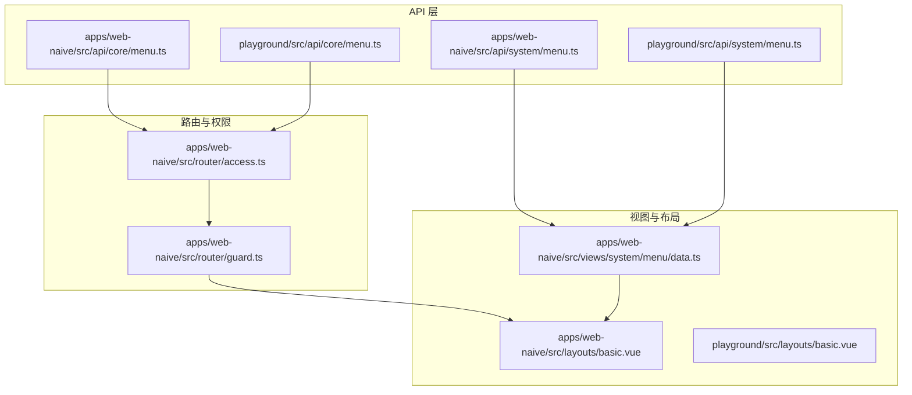
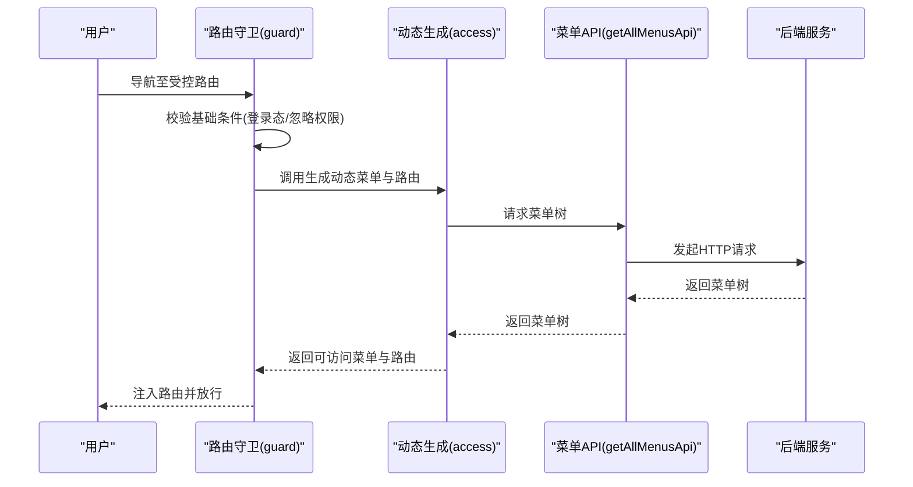
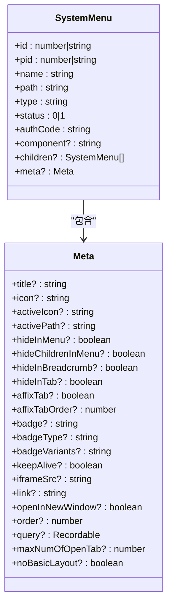
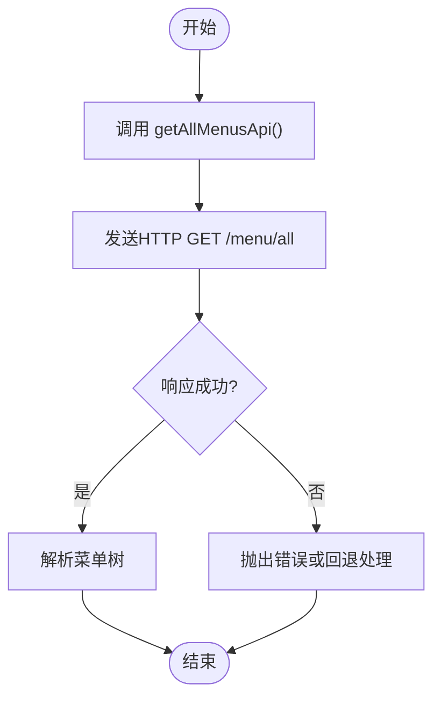
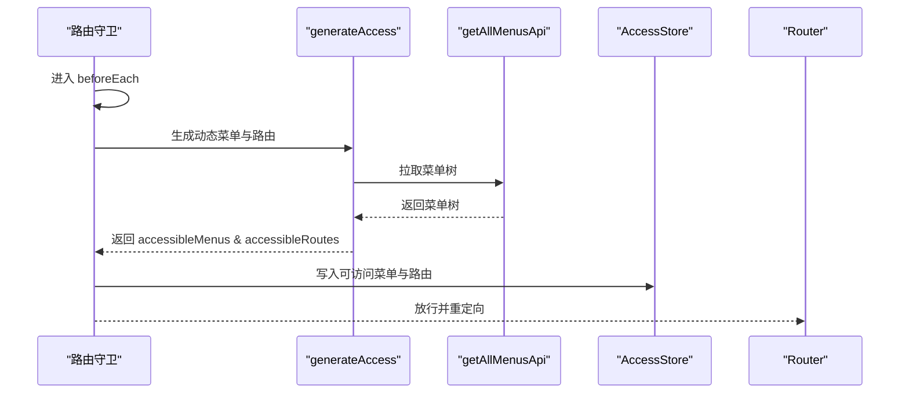
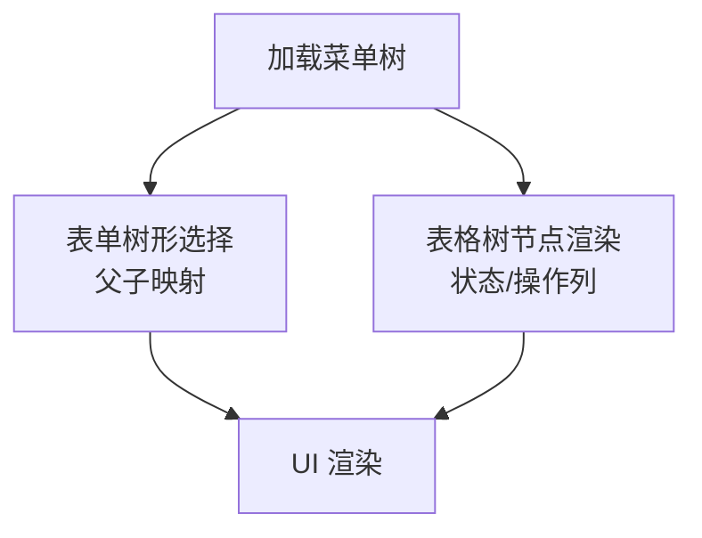
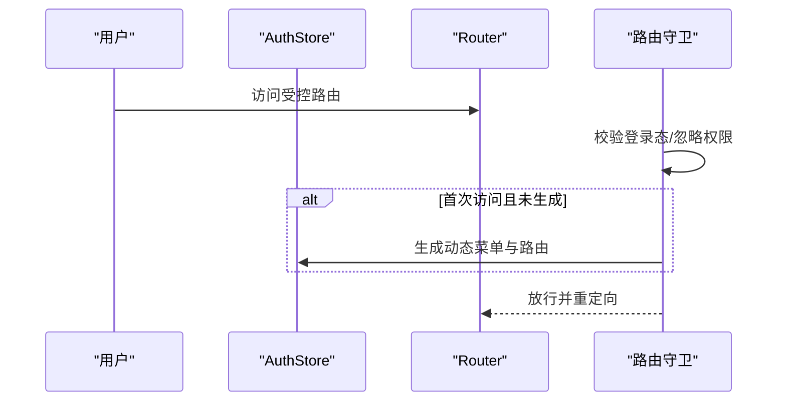
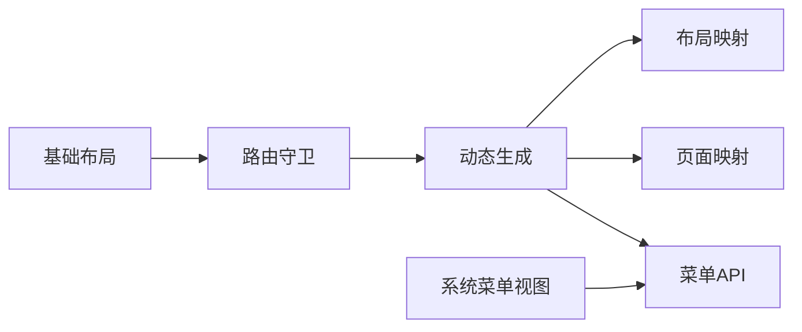

# 菜单 API

<cite>
**本文引用的文件**
- [apps/web-naive/src/api/core/menu.ts](file://apps/web-naive/src/api/core/menu.ts)
- [apps/web-naive/src/api/system/menu.ts](file://apps/web-naive/src/api/system/menu.ts)
- [playground/src/api/core/menu.ts](file://playground/src/api/core/menu.ts)
- [playground/src/api/system/menu.ts](file://playground/src/api/system/menu.ts)
- [apps/web-naive/src/router/guard.ts](file://apps/web-naive/src/router/guard.ts)
- [apps/web-naive/src/router/access.ts](file://apps/web-naive/src/router/access.ts)
- [apps/web-naive/src/store/auth.ts](file://apps/web-naive/src/store/auth.ts)
- [apps/web-naive/src/views/system/menu/data.ts](file://apps/web-naive/src/views/system/menu/data.ts)
- [apps/web-naive/src/layouts/basic.vue](file://apps/web-naive/src/layouts/basic.vue)
- [playground/src/layouts/basic.vue](file://playground/src/layouts/basic.vue)
</cite>

## 目录

1. [简介](#简介)
2. [项目结构](#项目结构)
3. [核心组件](#核心组件)
4. [架构总览](#架构总览)
5. [详细组件分析](#详细组件分析)
6. [依赖分析](#依赖分析)
7. [性能考量](#性能考量)
8. [故障排查指南](#故障排查指南)
9. [结论](#结论)
10. [附录](#附录)

## 简介

本章节面向“菜单 API”模块，系统性阐述菜单接口的设计理念与实现细节，覆盖以下主题：

- 菜单获取接口：统一入口与响应形态
- 菜单树形结构处理：父子关系与层级渲染
- 动态菜单生成机制：基于权限与路由的联动
- 菜单数据结构与权限控制：字段语义与鉴权逻辑
- 与路由系统的集成：动态路由生成与导航控制
- 使用示例：如何获取用户可访问菜单并构建前端导航
- 缓存策略与性能优化：加载体验与资源利用
- 权限验证与安全注意事项：最小暴露与边界防护

## 项目结构

菜单相关能力在应用层与 Playground 示例中均有体现，核心分布如下：

- API 层
  - 核心菜单接口：获取用户所有菜单
  - 系统菜单接口：列表、校验唯一性、增删改
- 路由与权限层
  - 路由守卫：权限拦截与动态路由注入
  - 动态菜单生成：从后端拉取菜单并映射为路由
- 视图与布局层
  - 系统菜单管理视图：表单、表格、树选择
  - 基础布局：承载菜单与导航

图表来源

- [apps/web-naive/src/api/core/menu.ts:1-11](file://apps/web-naive/src/api/core/menu.ts#L1-L11)
- [apps/web-naive/src/api/system/menu.ts:1-169](file://apps/web-naive/src/api/system/menu.ts#L1-L169)
- [playground/src/api/core/menu.ts:1-11](file://playground/src/api/core/menu.ts#L1-L11)
- [playground/src/api/system/menu.ts:1-157](file://playground/src/api/system/menu.ts#L1-L157)
- [apps/web-naive/src/router/guard.ts:1-133](file://apps/web-naive/src/router/guard.ts#L1-L133)
- [apps/web-naive/src/router/access.ts:1-41](file://apps/web-naive/src/router/access.ts#L1-L41)
- [apps/web-naive/src/views/system/menu/data.ts:1-284](file://apps/web-naive/src/views/system/menu/data.ts#L1-L284)
- [apps/web-naive/src/layouts/basic.vue:1-237](file://apps/web-naive/src/layouts/basic.vue#L1-L237)
- [playground/src/layouts/basic.vue:1-262](file://playground/src/layouts/basic.vue#L1-L262)

章节来源

- [apps/web-naive/src/api/core/menu.ts:1-11](file://apps/web-naive/src/api/core/menu.ts#L1-L11)
- [apps/web-naive/src/api/system/menu.ts:1-169](file://apps/web-naive/src/api/system/menu.ts#L1-L169)
- [playground/src/api/core/menu.ts:1-11](file://playground/src/api/core/menu.ts#L1-L11)
- [playground/src/api/system/menu.ts:1-157](file://playground/src/api/system/menu.ts#L1-L157)
- [apps/web-naive/src/router/guard.ts:1-133](file://apps/web-naive/src/router/guard.ts#L1-L133)
- [apps/web-naive/src/router/access.ts:1-41](file://apps/web-naive/src/router/access.ts#L1-L41)
- [apps/web-naive/src/views/system/menu/data.ts:1-284](file://apps/web-naive/src/views/system/menu/data.ts#L1-L284)
- [apps/web-naive/src/layouts/basic.vue:1-237](file://apps/web-naive/src/layouts/basic.vue#L1-L237)
- [playground/src/layouts/basic.vue:1-262](file://playground/src/layouts/basic.vue#L1-L262)

## 核心组件

- 菜单获取接口
  - 应用层：统一导出“获取用户所有菜单”的异步方法，返回路由记录类型数组
  - Playground：同名接口，功能一致
- 系统菜单接口
  - 定义菜单数据模型（含元信息、类型、父子关系、状态等）
  - 提供菜单列表查询、唯一性校验、增删改等操作
- 路由守卫与动态生成
  - 路由守卫在首次访问受控路由时触发动态菜单与路由生成
  - 动态生成器从后端拉取菜单，结合页面与布局映射生成可访问路由
- 视图与布局
  - 系统菜单管理页面使用树形选择与表格展示菜单树
  - 基础布局承载用户信息、通知、水印等，支撑菜单导航

章节来源

- [apps/web-naive/src/api/core/menu.ts:5-10](file://apps/web-naive/src/api/core/menu.ts#L5-L10)
- [playground/src/api/core/menu.ts:5-10](file://playground/src/api/core/menu.ts#L5-L10)
- [apps/web-naive/src/api/system/menu.ts:25-92](file://apps/web-naive/src/api/system/menu.ts#L25-L92)
- [apps/web-naive/src/router/guard.ts:47-118](file://apps/web-naive/src/router/guard.ts#L47-L118)
- [apps/web-naive/src/router/access.ts:16-38](file://apps/web-naive/src/router/access.ts#L16-L38)
- [apps/web-naive/src/views/system/menu/data.ts:66-191](file://apps/web-naive/src/views/system/menu/data.ts#L66-L191)

## 架构总览

菜单 API 的调用链路与职责划分如下：

- 客户端通过“获取用户所有菜单”接口向后端请求菜单树
- 路由守卫在首次访问时触发动态生成流程，将菜单映射为可访问路由
- 权限控制贯穿登录、令牌校验、动态路由生成与页面元信息
- 视图层负责菜单的增删改查与树形展示

图表来源

- [apps/web-naive/src/router/guard.ts:47-118](file://apps/web-naive/src/router/guard.ts#L47-L118)
- [apps/web-naive/src/router/access.ts:16-38](file://apps/web-naive/src/router/access.ts#L16-L38)
- [apps/web-naive/src/api/core/menu.ts:8-9](file://apps/web-naive/src/api/core/menu.ts#L8-L9)

## 详细组件分析

### 菜单数据结构与权限控制

- 数据模型要点
  - 菜单标识、名称、路径、父级、类型、状态、元信息（图标、标题、keepAlive、徽标、隐藏策略等）
  - 支持父子关系与树形结构，用于前端渲染与权限过滤
- 权限控制
  - 路由元信息中可配置权限标识与可见性策略
  - 动态生成阶段依据用户角色与后端菜单树进行过滤与映射
  - 对于无权限但需显示的菜单，可配置“被禁止时仍显示”的策略

图表来源

- [apps/web-naive/src/api/system/menu.ts:25-92](file://apps/web-naive/src/api/system/menu.ts#L25-L92)

章节来源

- [apps/web-naive/src/api/system/menu.ts:25-92](file://apps/web-naive/src/api/system/menu.ts#L25-L92)
- [apps/web-naive/src/router/access.ts:16-38](file://apps/web-naive/src/router/access.ts#L16-L38)

### 菜单获取接口

- 接口职责
  - 提供“获取用户所有菜单”的异步方法，返回路由记录类型数组
  - 作为动态路由生成的数据源
- 典型调用场景
  - 路由守卫首次访问时触发
  - 系统菜单管理页面的树形选择数据源

图表来源

- [apps/web-naive/src/api/core/menu.ts:8-9](file://apps/web-naive/src/api/core/menu.ts#L8-L9)
- [playground/src/api/core/menu.ts:8-9](file://playground/src/api/core/menu.ts#L8-L9)

章节来源

- [apps/web-naive/src/api/core/menu.ts:5-10](file://apps/web-naive/src/api/core/menu.ts#L5-L10)
- [playground/src/api/core/menu.ts:5-10](file://playground/src/api/core/menu.ts#L5-L10)

### 动态菜单生成与路由集成

- 流程概述
  - 路由守卫检测到未生成动态路由时，调用动态生成器
  - 动态生成器拉取菜单树，结合页面与布局映射生成可访问路由
  - 将可访问菜单与路由写入状态，完成一次性的动态注入
- 关键点
  - 加载提示：生成过程中显示加载消息
  - 忽略权限：部分路由可忽略权限直接访问
  - 登录态与重定向：根据登录态与重定向参数决定最终目标

图表来源

- [apps/web-naive/src/router/guard.ts:47-118](file://apps/web-naive/src/router/guard.ts#L47-L118)
- [apps/web-naive/src/router/access.ts:16-38](file://apps/web-naive/src/router/access.ts#L16-L38)

章节来源

- [apps/web-naive/src/router/guard.ts:47-118](file://apps/web-naive/src/router/guard.ts#L47-L118)
- [apps/web-naive/src/router/access.ts:16-38](file://apps/web-naive/src/router/access.ts#L16-L38)

### 菜单树形结构处理与前端渲染

- 树形数据来源
  - 后端返回的菜单树，包含父子关系与元信息
- 前端处理
  - 表单层：使用树形选择组件，支持父子字段映射
  - 表格层：支持树节点渲染、状态展示、操作列
- 渲染策略
  - 根据菜单类型与元信息决定是否渲染、是否缓存、是否隐藏

图表来源

- [apps/web-naive/src/views/system/menu/data.ts:75-83](file://apps/web-naive/src/views/system/menu/data.ts#L75-L83)
- [apps/web-naive/src/views/system/menu/data.ts:196-282](file://apps/web-naive/src/views/system/menu/data.ts#L196-L282)

章节来源

- [apps/web-naive/src/views/system/menu/data.ts:66-191](file://apps/web-naive/src/views/system/menu/data.ts#L66-L191)
- [apps/web-naive/src/views/system/menu/data.ts:196-282](file://apps/web-naive/src/views/system/menu/data.ts#L196-L282)

### 与路由系统的集成与导航控制

- 集成点
  - 路由守卫在首次访问受控路由时触发动态生成
  - 生成后的路由注入到路由器，后续访问不再重复生成
- 导航控制
  - 登录成功后根据用户首页路径或默认首页跳转
  - 忽略权限的路由可直接访问
  - 无权限访问时可重定向至登录页或403页面（取决于配置）

图表来源

- [apps/web-naive/src/store/auth.ts:28-79](file://apps/web-naive/src/store/auth.ts#L28-L79)
- [apps/web-naive/src/router/guard.ts:47-118](file://apps/web-naive/src/router/guard.ts#L47-L118)

章节来源

- [apps/web-naive/src/store/auth.ts:28-79](file://apps/web-naive/src/store/auth.ts#L28-L79)
- [apps/web-naive/src/router/guard.ts:47-118](file://apps/web-naive/src/router/guard.ts#L47-L118)

### 使用示例：获取用户可访问菜单并构建前端导航

- 获取菜单树
  - 调用“获取用户所有菜单”接口，得到菜单树
- 构建导航
  - 将菜单树映射为路由，结合布局与页面映射
  - 根据菜单元信息配置图标、标题、隐藏策略、缓存策略等
- 渲染导航
  - 在基础布局中渲染菜单，支持点击跳转与多标签页控制

章节来源

- [apps/web-naive/src/api/core/menu.ts:8-9](file://apps/web-naive/src/api/core/menu.ts#L8-L9)
- [apps/web-naive/src/router/access.ts:16-38](file://apps/web-naive/src/router/access.ts#L16-L38)
- [apps/web-naive/src/layouts/basic.vue:87-122](file://apps/web-naive/src/layouts/basic.vue#L87-L122)

## 依赖分析

- 组件耦合
  - 路由守卫依赖动态生成器与菜单 API
  - 动态生成器依赖菜单 API、页面映射与布局映射
  - 视图层依赖系统菜单 API 与表单/表格组件
- 外部依赖
  - 请求客户端封装 HTTP 调用
  - Pinia 状态管理用于存储访问码、用户信息与可访问菜单/路由
  - Vue Router 提供路由守卫与导航能力

图表来源

- [apps/web-naive/src/router/guard.ts:47-118](file://apps/web-naive/src/router/guard.ts#L47-L118)
- [apps/web-naive/src/router/access.ts:16-38](file://apps/web-naive/src/router/access.ts#L16-L38)
- [apps/web-naive/src/views/system/menu/data.ts:8](file://apps/web-naive/src/views/system/menu/data.ts#L8)

章节来源

- [apps/web-naive/src/router/guard.ts:47-118](file://apps/web-naive/src/router/guard.ts#L47-L118)
- [apps/web-naive/src/router/access.ts:16-38](file://apps/web-naive/src/router/access.ts#L16-L38)
- [apps/web-naive/src/views/system/menu/data.ts:8](file://apps/web-naive/src/views/system/menu/data.ts#L8)

## 性能考量

- 加载体验
  - 动态生成期间显示加载提示，避免用户感知卡顿
- 资源利用
  - 菜单树仅在首次访问时生成，后续路由切换不重复拉取
  - 页面组件按需加载，减少初始包体
- 可选优化建议
  - 菜单树本地缓存：在会话期间缓存菜单树，刷新页面时再拉取
  - 分页/懒加载：对于大型菜单树，可采用分页或懒加载策略
  - 并发优化：在登录成功后并发拉取用户信息与访问码，缩短首屏时间

章节来源

- [apps/web-naive/src/router/access.ts:26-30](file://apps/web-naive/src/router/access.ts#L26-L30)
- [apps/web-naive/src/store/auth.ts:44-47](file://apps/web-naive/src/store/auth.ts#L44-L47)

## 故障排查指南

- 无法获取菜单
  - 检查网络请求与后端接口可用性
  - 确认路由守卫是否正确触发动态生成
- 菜单不显示或显示异常
  - 检查菜单元信息配置（如隐藏策略、类型）
  - 确认页面映射与布局映射是否正确
- 登录后无法跳转
  - 检查登录成功后的重定向参数与默认首页配置
  - 确认忽略权限路由的配置是否符合预期

章节来源

- [apps/web-naive/src/router/guard.ts:47-118](file://apps/web-naive/src/router/guard.ts#L47-L118)
- [apps/web-naive/src/router/access.ts:16-38](file://apps/web-naive/src/router/access.ts#L16-L38)
- [apps/web-naive/src/store/auth.ts:54-62](file://apps/web-naive/src/store/auth.ts#L54-L62)

## 结论

菜单 API 模块通过统一的菜单获取接口与动态生成机制，实现了灵活的菜单树管理与路由集成。其设计强调：

- 明确的数据模型与权限控制
- 与路由系统的深度集成与一次性注入
- 前端渲染的树形结构与丰富的元信息支持配合合理的缓存与加载策略，可在保证安全的前提下提升用户体验。

## 附录

- 相关文件索引
  - [apps/web-naive/src/api/core/menu.ts:1-11](file://apps/web-naive/src/api/core/menu.ts#L1-L11)
  - [apps/web-naive/src/api/system/menu.ts:1-169](file://apps/web-naive/src/api/system/menu.ts#L1-L169)
  - [playground/src/api/core/menu.ts:1-11](file://playground/src/api/core/menu.ts#L1-L11)
  - [playground/src/api/system/menu.ts:1-157](file://playground/src/api/system/menu.ts#L1-L157)
  - [apps/web-naive/src/router/guard.ts:1-133](file://apps/web-naive/src/router/guard.ts#L1-L133)
  - [apps/web-naive/src/router/access.ts:1-41](file://apps/web-naive/src/router/access.ts#L1-L41)
  - [apps/web-naive/src/views/system/menu/data.ts:1-284](file://apps/web-naive/src/views/system/menu/data.ts#L1-L284)
  - [apps/web-naive/src/layouts/basic.vue:1-237](file://apps/web-naive/src/layouts/basic.vue#L1-L237)
  - [playground/src/layouts/basic.vue:1-262](file://playground/src/layouts/basic.vue#L1-L262)
