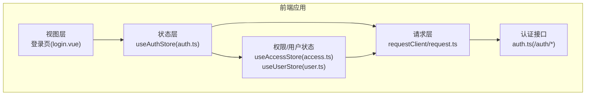
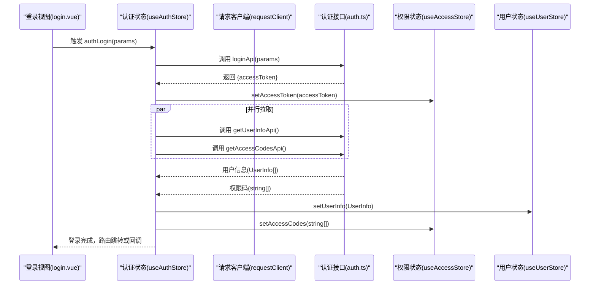
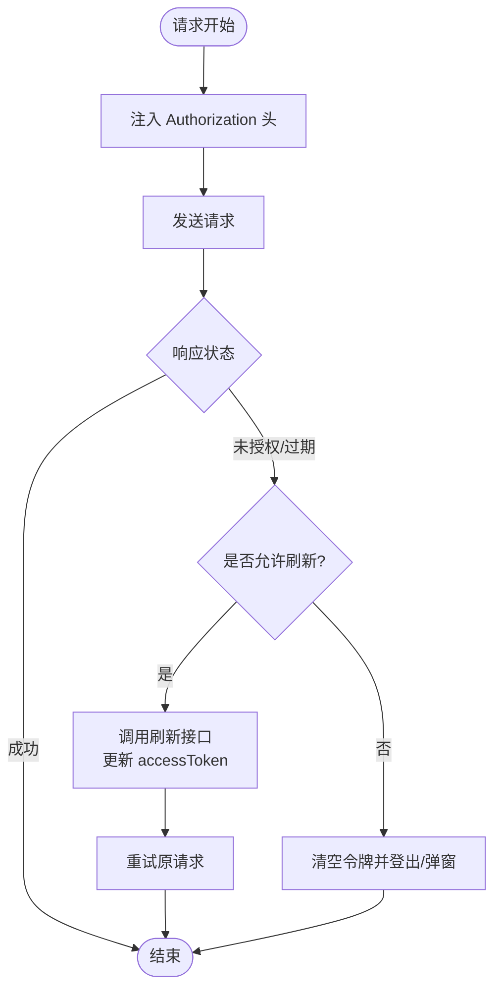
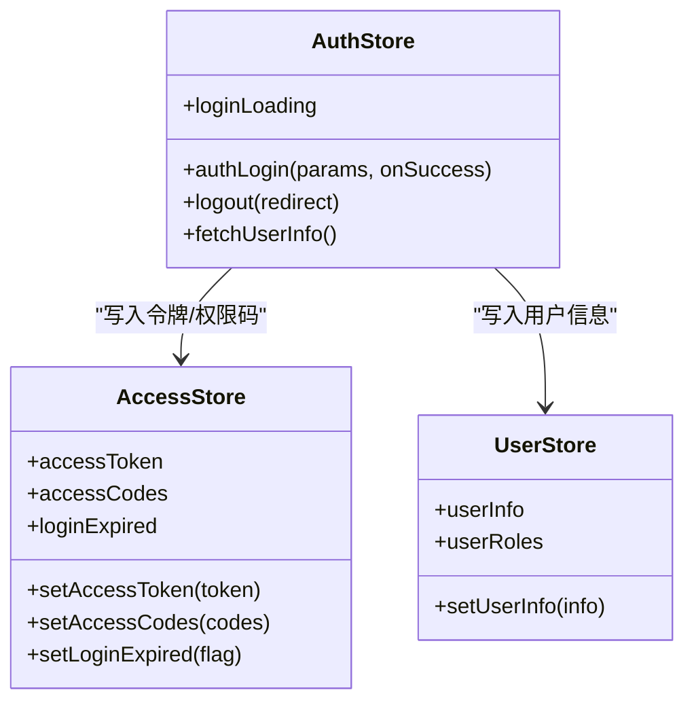
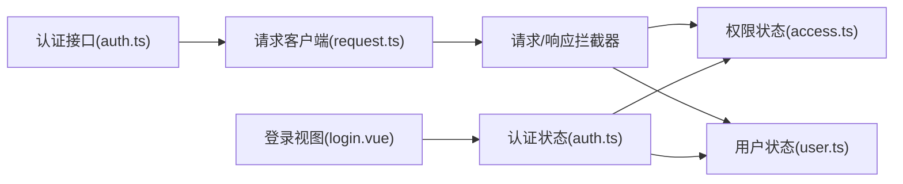

# 认证 API

<cite>
**本文引用的文件**
- [apps/web-naive/src/api/core/auth.ts](file://apps/web-naive/src/api/core/auth.ts)
- [playground/src/api/core/auth.ts](file://playground/src/api/core/auth.ts)
- [apps/web-naive/src/api/request.ts](file://apps/web-naive/src/api/request.ts)
- [playground/src/api/request.ts](file://playground/src/api/request.ts)
- [apps/web-naive/src/store/auth.ts](file://apps/web-naive/src/store/auth.ts)
- [playground/src/store/auth.ts](file://playground/src/store/auth.ts)
- [packages/stores/src/modules/access.ts](file://packages/stores/src/modules/access.ts)
- [packages/stores/src/modules/user.ts](file://packages/stores/src/modules/user.ts)
- [apps/web-naive/src/views/_core/authentication/login.vue](file://apps/web-naive/src/views/_core/authentication/login.vue)
- [playground/src/views/_core/authentication/login.vue](file://playground/src/views/_core/authentication/login.vue)
- [apps/web-naive/src/api/core/user.ts](file://apps/web-naive/src/api/core/user.ts)
</cite>

## 目录

1. [简介](#简介)
2. [项目结构](#项目结构)
3. [核心组件](#核心组件)
4. [架构总览](#架构总览)
5. [详细组件分析](#详细组件分析)
6. [依赖分析](#依赖分析)
7. [性能考虑](#性能考虑)
8. [故障排查指南](#故障排查指南)
9. [结论](#结论)
10. [附录：使用示例与最佳实践](#附录使用示例与最佳实践)

## 简介

本文件面向认证 API 模块，系统性梳理登录、刷新令牌、退出登录与权限码获取四个核心接口的设计与实现，覆盖参数类型、返回值结构、HTTP 方法与路径、数据流转、令牌管理、权限验证、会话维护、与状态管理模块的交互关系、错误处理策略以及常见问题的解决方案。文档同时提供端到端的使用示例与最佳实践，帮助开发者快速集成并稳定运行认证能力。

## 项目结构

认证相关代码主要分布在以下位置：

- 接口定义与实现：apps/web-naive/src/api/core/auth.ts 与 playground/src/api/core/auth.ts
- 请求客户端与拦截器：apps/web-naive/src/api/request.ts 与 playground/src/api/request.ts
- 认证状态与业务流程：apps/web-naive/src/store/auth.ts 与 playground/src/store/auth.ts
- 权限与用户状态：packages/stores/src/modules/access.ts 与 packages/stores/src/modules/user.ts
- 登录页面与表单：apps/web-naive/src/views/\_core/authentication/login.vue 与 playground/src/views/\_core/authentication/login.vue
- 用户信息接口：apps/web-naive/src/api/core/user.ts

图表来源

- [apps/web-naive/src/views/\_core/authentication/login.vue:1-99](file://apps/web-naive/src/views/_core/authentication/login.vue#L1-L99)
- [apps/web-naive/src/store/auth.ts:1-119](file://apps/web-naive/src/store/auth.ts#L1-L119)
- [packages/stores/src/modules/access.ts:1-130](file://packages/stores/src/modules/access.ts#L1-L130)
- [packages/stores/src/modules/user.ts:1-65](file://packages/stores/src/modules/user.ts#L1-L65)
- [apps/web-naive/src/api/request.ts:1-114](file://apps/web-naive/src/api/request.ts#L1-L114)
- [apps/web-naive/src/api/core/auth.ts:1-52](file://apps/web-naive/src/api/core/auth.ts#L1-L52)

章节来源

- [apps/web-naive/src/api/core/auth.ts:1-52](file://apps/web-naive/src/api/core/auth.ts#L1-L52)
- [playground/src/api/core/auth.ts:1-58](file://playground/src/api/core/auth.ts#L1-L58)
- [apps/web-naive/src/api/request.ts:1-114](file://apps/web-naive/src/api/request.ts#L1-L114)
- [playground/src/api/request.ts:1-135](file://playground/src/api/request.ts#L1-L135)
- [apps/web-naive/src/store/auth.ts:1-119](file://apps/web-naive/src/store/auth.ts#L1-L119)
- [playground/src/store/auth.ts:1-127](file://playground/src/store/auth.ts#L1-L127)
- [packages/stores/src/modules/access.ts:1-130](file://packages/stores/src/modules/access.ts#L1-L130)
- [packages/stores/src/modules/user.ts:1-65](file://packages/stores/src/modules/user.ts#L1-L65)
- [apps/web-naive/src/views/\_core/authentication/login.vue:1-99](file://apps/web-naive/src/views/_core/authentication/login.vue#L1-L99)
- [playground/src/views/\_core/authentication/login.vue:1-133](file://playground/src/views/_core/authentication/login.vue#L1-L133)
- [apps/web-naive/src/api/core/user.ts:1-11](file://apps/web-naive/src/api/core/user.ts#L1-L11)

## 核心组件

- 认证接口模块：封装登录、刷新令牌、退出登录、权限码获取等 API，统一暴露函数式接口。
- 请求客户端与拦截器：负责自动注入 Authorization 头、统一响应格式、过期令牌刷新与重新认证、错误提示。
- 认证状态管理：协调登录流程、用户信息与权限码拉取、登出与路由跳转。
- 权限与用户状态：集中管理 accessToken、accessCodes、用户信息、登录过期标记等。
- 登录视图：提供表单校验、提交与错误反馈，触发认证状态管理。

章节来源

- [apps/web-naive/src/api/core/auth.ts:1-52](file://apps/web-naive/src/api/core/auth.ts#L1-L52)
- [playground/src/api/core/auth.ts:1-58](file://playground/src/api/core/auth.ts#L1-L58)
- [apps/web-naive/src/api/request.ts:1-114](file://apps/web-naive/src/api/request.ts#L1-L114)
- [playground/src/api/request.ts:1-135](file://playground/src/api/request.ts#L1-L135)
- [apps/web-naive/src/store/auth.ts:1-119](file://apps/web-naive/src/store/auth.ts#L1-L119)
- [playground/src/store/auth.ts:1-127](file://playground/src/store/auth.ts#L1-L127)
- [packages/stores/src/modules/access.ts:1-130](file://packages/stores/src/modules/access.ts#L1-L130)
- [packages/stores/src/modules/user.ts:1-65](file://packages/stores/src/modules/user.ts#L1-L65)
- [apps/web-naive/src/views/\_core/authentication/login.vue:1-99](file://apps/web-naive/src/views/_core/authentication/login.vue#L1-L99)
- [playground/src/views/\_core/authentication/login.vue:1-133](file://playground/src/views/_core/authentication/login.vue#L1-L133)

## 架构总览

认证流程从视图层发起登录请求，经由状态层协调，通过请求层完成网络通信与令牌管理，最终回写权限与用户状态，驱动路由跳转与界面反馈。

图表来源

- [apps/web-naive/src/views/\_core/authentication/login.vue:1-99](file://apps/web-naive/src/views/_core/authentication/login.vue#L1-L99)
- [apps/web-naive/src/store/auth.ts:1-119](file://apps/web-naive/src/store/auth.ts#L1-L119)
- [apps/web-naive/src/api/request.ts:1-114](file://apps/web-naive/src/api/request.ts#L1-L114)
- [apps/web-naive/src/api/core/auth.ts:1-52](file://apps/web-naive/src/api/core/auth.ts#L1-L52)
- [apps/web-naive/src/api/core/user.ts:1-11](file://apps/web-naive/src/api/core/user.ts#L1-L11)
- [packages/stores/src/modules/access.ts:1-130](file://packages/stores/src/modules/access.ts#L1-L130)
- [packages/stores/src/modules/user.ts:1-65](file://packages/stores/src/modules/user.ts#L1-L65)

## 详细组件分析

### 登录接口 loginApi

- 功能：接收用户名与密码，换取访问令牌。
- 参数类型：AuthApi.LoginParams
  - username: string（可选）
  - password: string（可选）
- 返回值结构：AuthApi.LoginResult
  - accessToken: string
- HTTP 方法与路径：POST /auth/login
- 关键行为：
  - 使用 requestClient 发起带凭据的请求（部分环境配置中启用 withCredentials）。
  - 成功后将 accessToken 写入权限状态，随后并发拉取用户信息与权限码。
- 与状态管理交互：
  - 在 useAuthStore.authLogin 中消费 accessToken，并更新用户与权限状态。
- 错误处理：
  - 由请求层统一拦截器处理，必要时提示错误消息。

章节来源

- [apps/web-naive/src/api/core/auth.ts:24-26](file://apps/web-naive/src/api/core/auth.ts#L24-L26)
- [playground/src/api/core/auth.ts:24-28](file://playground/src/api/core/auth.ts#L24-L28)
- [apps/web-naive/src/store/auth.ts:36-47](file://apps/web-naive/src/store/auth.ts#L36-L47)
- [apps/web-naive/src/api/request.ts:63-71](file://apps/web-naive/src/api/request.ts#L63-L71)

### 刷新令牌接口 refreshTokenApi

- 功能：在令牌即将过期或已过期时，使用刷新令牌换取新的访问令牌。
- 返回值结构：AuthApi.RefreshTokenResult
  - data: string（新 accessToken）
  - status: number（响应状态码）
- HTTP 方法与路径：POST /auth/refresh
- 关键行为：
  - 使用 baseRequestClient 发起带凭据的请求。
  - 请求层在响应拦截器中检测过期场景并调用此接口自动续期。
- 与状态管理交互：
  - 请求层将新令牌写入权限状态，供后续请求自动携带。

章节来源

- [apps/web-naive/src/api/core/auth.ts:31-35](file://apps/web-naive/src/api/core/auth.ts#L31-L35)
- [playground/src/api/core/auth.ts:33-41](file://playground/src/api/core/auth.ts#L33-L41)
- [apps/web-naive/src/api/request.ts:50-56](file://apps/web-naive/src/api/request.ts#L50-L56)
- [playground/src/api/request.ts:65-71](file://playground/src/api/request.ts#L65-L71)

### 退出登录接口 logoutApi

- 功能：使当前会话失效，清理本地状态并跳转至登录页。
- HTTP 方法与路径：POST /auth/logout
- 关键行为：
  - 使用 baseRequestClient 发起带凭据的请求。
  - 登出完成后重置所有状态，清除登录过期标记，并携带当前路由地址跳转登录页。
- 安全与防重复：
  - 状态层对登出过程加锁，避免递归或重复触发。

章节来源

- [apps/web-naive/src/api/core/auth.ts:40-44](file://apps/web-naive/src/api/core/auth.ts#L40-L44)
- [playground/src/api/core/auth.ts:46-50](file://playground/src/api/core/auth.ts#L46-L50)
- [apps/web-naive/src/store/auth.ts:81-99](file://apps/web-naive/src/store/auth.ts#L81-L99)
- [playground/src/store/auth.ts:83-107](file://playground/src/store/auth.ts#L83-L107)

### 权限码获取接口 getAccessCodesApi

- 功能：获取当前用户的权限码集合，用于前端权限控制。
- 返回值结构：string[]（权限码数组）
- HTTP 方法与路径：GET /auth/codes
- 关键行为：
  - 与登录成功后的用户信息拉取并行执行，加速初始化。
  - 结果写入权限状态，供路由守卫与按钮级权限判断使用。

章节来源

- [apps/web-naive/src/api/core/auth.ts:49-51](file://apps/web-naive/src/api/core/auth.ts#L49-L51)
- [playground/src/api/core/auth.ts:55-57](file://playground/src/api/core/auth.ts#L55-L57)
- [apps/web-naive/src/store/auth.ts:44-52](file://apps/web-naive/src/store/auth.ts#L44-L52)
- [playground/src/store/auth.ts:44-52](file://playground/src/store/auth.ts#L44-L52)

### 数据流与令牌管理

- 请求头注入：请求层在请求拦截器中将 accessToken 统一注入 Authorization: Bearer {token}。
- 自动刷新：当响应拦截器判定需要刷新时，调用刷新接口并更新内存中的 accessToken。
- 重新认证：当令牌无效或过期且无法刷新时，清空令牌并根据配置决定弹窗提示或强制登出。
- 会话维护：退出登录时清理状态并跳转登录页，确保后续请求不再携带失效令牌。

图表来源

- [apps/web-naive/src/api/request.ts:63-92](file://apps/web-naive/src/api/request.ts#L63-L92)
- [playground/src/api/request.ts:78-107](file://playground/src/api/request.ts#L78-L107)
- [apps/web-naive/src/api/core/auth.ts:31-35](file://apps/web-naive/src/api/core/auth.ts#L31-L35)
- [playground/src/api/core/auth.ts:33-41](file://playground/src/api/core/auth.ts#L33-L41)

### 与状态管理模块的交互

- useAuthStore
  - authLogin：串行执行登录、设置令牌、并发拉取用户信息与权限码、更新用户与权限状态、路由跳转或回调。
  - logout：调用后端登出接口，重置所有状态，清除登录过期标记，并携带当前路由地址跳转登录页。
- useAccessStore
  - setAccessToken/setAccessCodes：写入令牌与权限码，支持持久化。
  - loginExpired：在特定模式下标记登录过期，用于弹窗提示。
- useUserStore
  - setUserInfo：写入用户信息，派生用户角色等。

图表来源

- [apps/web-naive/src/store/auth.ts:16-119](file://apps/web-naive/src/store/auth.ts#L16-L119)
- [packages/stores/src/modules/access.ts:51-130](file://packages/stores/src/modules/access.ts#L51-L130)
- [packages/stores/src/modules/user.ts:41-65](file://packages/stores/src/modules/user.ts#L41-L65)

章节来源

- [apps/web-naive/src/store/auth.ts:28-79](file://apps/web-naive/src/store/auth.ts#L28-L79)
- [playground/src/store/auth.ts:29-79](file://playground/src/store/auth.ts#L29-L79)
- [packages/stores/src/modules/access.ts:76-96](file://packages/stores/src/modules/access.ts#L76-L96)
- [packages/stores/src/modules/user.ts:43-49](file://packages/stores/src/modules/user.ts#L43-L49)

## 依赖分析

- 认证接口依赖请求客户端：
  - loginApi/logoutApi 使用 requestClient/baseRequestClient 发送请求。
  - refreshTokenApi 使用 baseRequestClient 发送请求。
- 请求层依赖：
  - 请求拦截器注入 Authorization 头。
  - 响应拦截器处理默认格式、认证刷新与重新认证、通用错误提示。
- 状态层依赖：
  - useAuthStore 依赖 useAccessStore/useUserStore 完成令牌与用户信息的写入。
  - 登录视图依赖 useAuthStore 的 authLogin 与 loginLoading 状态。

图表来源

- [apps/web-naive/src/api/core/auth.ts:1-52](file://apps/web-naive/src/api/core/auth.ts#L1-L52)
- [apps/web-naive/src/api/request.ts:1-114](file://apps/web-naive/src/api/request.ts#L1-L114)
- [packages/stores/src/modules/access.ts:1-130](file://packages/stores/src/modules/access.ts#L1-L130)
- [packages/stores/src/modules/user.ts:1-65](file://packages/stores/src/modules/user.ts#L1-L65)
- [apps/web-naive/src/store/auth.ts:1-119](file://apps/web-naive/src/store/auth.ts#L1-L119)
- [apps/web-naive/src/views/\_core/authentication/login.vue:1-99](file://apps/web-naive/src/views/_core/authentication/login.vue#L1-L99)

章节来源

- [apps/web-naive/src/api/core/auth.ts:1-52](file://apps/web-naive/src/api/core/auth.ts#L1-L52)
- [apps/web-naive/src/api/request.ts:1-114](file://apps/web-naive/src/api/request.ts#L1-L114)
- [apps/web-naive/src/store/auth.ts:1-119](file://apps/web-naive/src/store/auth.ts#L1-L119)
- [apps/web-naive/src/views/\_core/authentication/login.vue:1-99](file://apps/web-naive/src/views/_core/authentication/login.vue#L1-L99)

## 性能考虑

- 并发初始化：登录成功后并发拉取用户信息与权限码，减少首屏等待时间。
- 令牌缓存：内存中持有 accessToken，避免每次请求重复计算；结合持久化提升二次加载体验。
- 请求复用：统一拦截器减少重复逻辑，降低出错概率。
- 建议：
  - 合理设置刷新策略与过期阈值，避免频繁刷新。
  - 对大体量权限码进行前端缓存与按需加载，减轻渲染压力。

## 故障排查指南

- 登录失败
  - 检查用户名/密码参数是否正确，确认接口返回的错误信息。
  - 若出现验证码错误，可在视图层重置验证码组件并重新尝试。
- 令牌过期或未授权
  - 确认响应拦截器是否正确触发刷新逻辑；若无法刷新，将触发重新认证并登出。
  - 检查服务端是否正确下发新的 accessToken。
- 退出登录后仍显示登录态
  - 确认 baseRequestClient 已携带凭据；检查登出流程是否执行并重置状态。
- 权限不足或页面白屏
  - 检查权限码是否正确写入；确认路由守卫与菜单生成逻辑基于权限码过滤。

章节来源

- [apps/web-naive/src/views/\_core/authentication/login.vue:111-122](file://apps/web-naive/src/views/_core/authentication/login.vue#L111-L122)
- [apps/web-naive/src/api/request.ts:83-92](file://apps/web-naive/src/api/request.ts#L83-L92)
- [playground/src/api/request.ts:98-107](file://playground/src/api/request.ts#L98-L107)
- [apps/web-naive/src/store/auth.ts:81-99](file://apps/web-naive/src/store/auth.ts#L81-L99)
- [playground/src/store/auth.ts:83-107](file://playground/src/store/auth.ts#L83-L107)

## 结论

认证 API 模块以清晰的接口职责、完善的请求拦截与状态管理机制，实现了从登录到权限验证再到会话维护的完整闭环。通过并发初始化、自动刷新与统一错误处理，显著提升了用户体验与系统稳定性。建议在实际项目中结合自身安全策略与业务需求，进一步细化权限模型与日志审计。

## 附录：使用示例与最佳实践

- 在登录页绑定表单并触发登录
  - 将表单数据传入 useAuthStore.authLogin，处理成功回调或路由跳转。
  - 登录失败时重置验证码组件并提示错误。
- 在路由守卫中使用权限码
  - 读取 useAccessStore.accessCodes，结合菜单/路由元信息进行访问控制。
- 退出登录
  - 调用 useAuthStore.logout，确保清理状态并跳转登录页。
- 最佳实践
  - 明确区分 requestClient 与 baseRequestClient 的使用场景。
  - 对敏感操作增加二次确认与权限校验。
  - 对权限码与用户信息进行必要的本地缓存与版本控制。

章节来源

- [apps/web-naive/src/views/\_core/authentication/login.vue:92-99](file://apps/web-naive/src/views/_core/authentication/login.vue#L92-L99)
- [playground/src/views/\_core/authentication/login.vue:125-133](file://playground/src/views/_core/authentication/login.vue#L125-L133)
- [apps/web-naive/src/store/auth.ts:28-79](file://apps/web-naive/src/store/auth.ts#L28-L79)
- [playground/src/store/auth.ts:29-79](file://playground/src/store/auth.ts#L29-L79)
- [packages/stores/src/modules/access.ts:76-96](file://packages/stores/src/modules/access.ts#L76-L96)
- [packages/stores/src/modules/user.ts:43-49](file://packages/stores/src/modules/user.ts#L43-L49)
