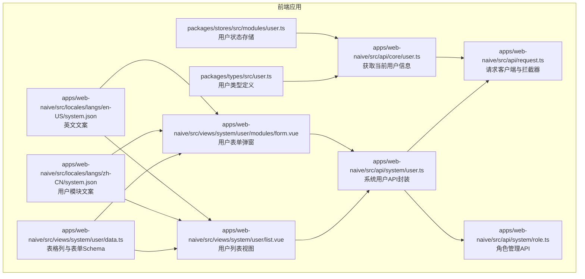
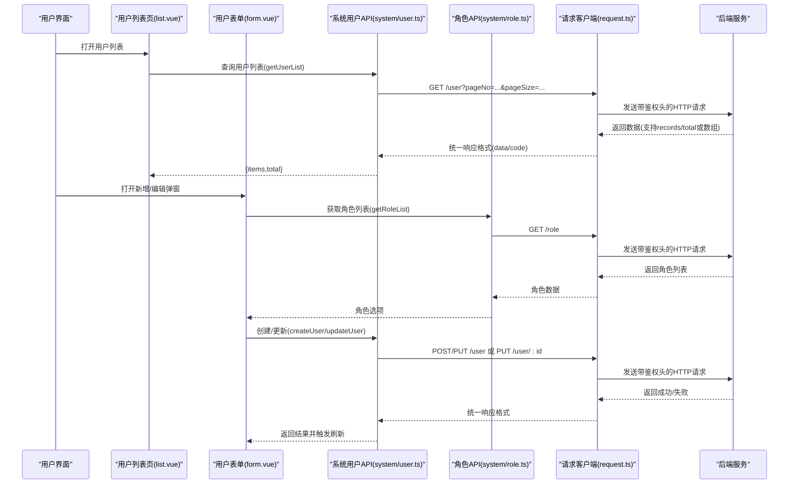
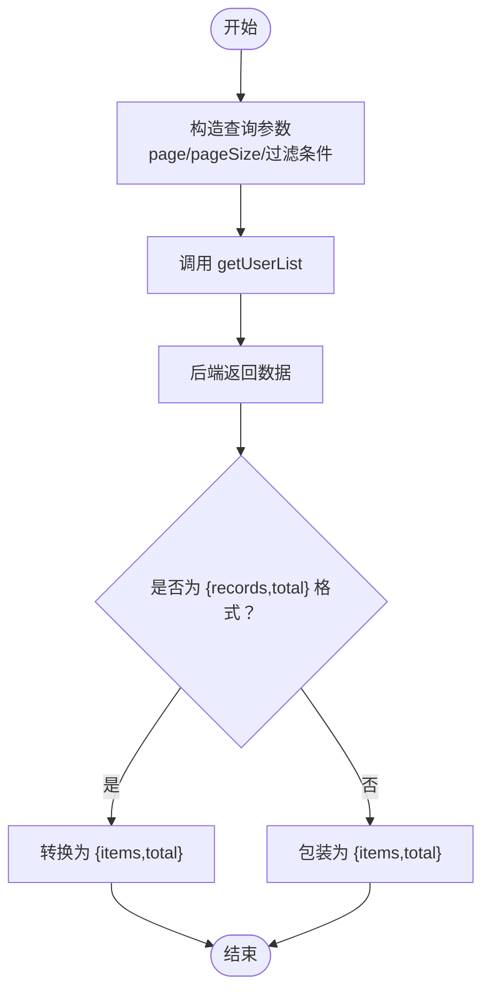
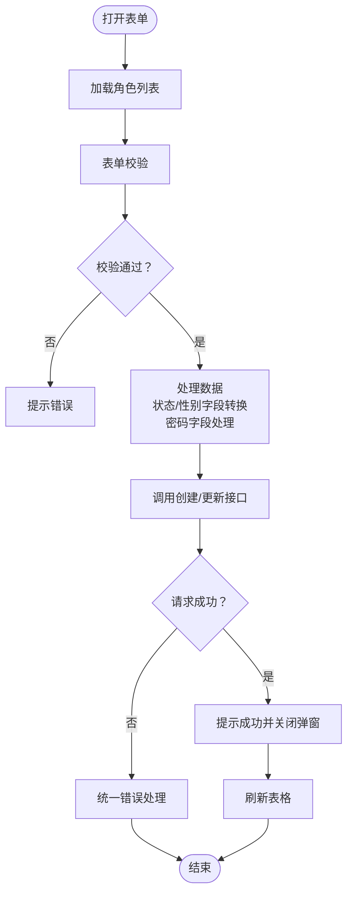
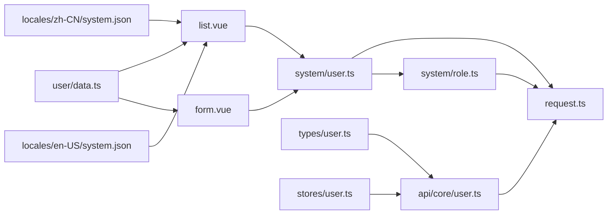

# 用户管理 API

<cite>
**本文引用的文件**
- [apps/web-naive/src/api/system/user.ts](file://apps/web-naive/src/api/system/user.ts)
- [apps/web-naive/src/views/system/user/list.vue](file://apps/web-naive/src/views/system/user/list.vue)
- [apps/web-naive/src/views/system/user/modules/form.vue](file://apps/web-naive/src/views/system/user/modules/form.vue)
- [apps/web-naive/src/views/system/user/data.ts](file://apps/web-naive/src/views/system/user/data.ts)
- [apps/web-naive/src/api/request.ts](file://apps/web-naive/src/api/request.ts)
- [apps/web-naive/src/api/core/user.ts](file://apps/web-naive/src/api/core/user.ts)
- [apps/web-naive/src/locales/langs/zh-CN/system.json](file://apps/web-naive/src/locales/langs/zh-CN/system.json)
- [packages/types/src/user.ts](file://packages/types/src/user.ts)
- [apps/web-naive/src/locales/langs/en-US/system.json](file://apps/web-naive/src/locales/langs/en-US/system.json)
- [packages/stores/src/modules/user.ts](file://packages/stores/src/modules/user.ts)
- [apps/web-naive/src/api/system/role.ts](file://apps/web-naive/src/api/system/role.ts)
</cite>

## 更新摘要

**所做更改**

- 新增密码字段支持，包括密码输入和验证规则
- 新增性别选择功能，支持男性、女性、未知三种选项
- 新增角色分配功能，支持多角色选择和分配
- 新增专用角色列表端点，提供角色数据获取
- 更新数据模型以包含新增字段
- 增强表单验证规则以支持新字段
- 完善国际化支持以涵盖新功能

## 目录

1. [简介](#简介)
2. [项目结构](#项目结构)
3. [核心组件](#核心组件)
4. [架构总览](#架构总览)
5. [详细组件分析](#详细组件分析)
6. [依赖关系分析](#依赖关系分析)
7. [性能考量](#性能考量)
8. [故障排查指南](#故障排查指南)
9. [结论](#结论)
10. [附录](#附录)

## 简介

本文件为"用户管理 API"的完整技术文档，覆盖前端对后端用户服务的 RESTful 接口调用与业务流程。文档聚焦以下能力：

- 标准 CRUD：用户列表查询、用户详情获取、用户创建、用户更新、用户删除
- 权限相关：用户状态管理、重置密码、角色分配
- 数据模型与字段约束：用户名、昵称、邮箱、手机号、性别、部门、角色、状态、备注、创建时间等
- 错误处理与鉴权：统一请求拦截器、响应格式、鉴权刷新策略
- 常见业务场景与调用示例：分页查询、表单校验、批量操作建议

## 项目结构

用户管理相关代码主要分布在以下位置：

- API 层：系统用户接口封装与请求客户端
- 视图层：用户列表页、用户表单弹窗、表格列与表单 Schema 定义
- 国际化：用户模块的文案翻译
- 类型定义：用户信息类型
- 角色管理：角色列表获取与管理

**图表来源**

- [apps/web-naive/src/api/system/user.ts:1-116](file://apps/web-naive/src/api/system/user.ts#L1-L116)
- [apps/web-naive/src/api/request.ts:1-114](file://apps/web-naive/src/api/request.ts#L1-L114)
- [apps/web-naive/src/views/system/user/list.vue:1-170](file://apps/web-naive/src/views/system/user/list.vue#L1-L170)
- [apps/web-naive/src/views/system/user/modules/form.vue:1-115](file://apps/web-naive/src/views/system/user/modules/form.vue#L1-L115)
- [apps/web-naive/src/views/system/user/data.ts:1-262](file://apps/web-naive/src/views/system/user/data.ts#L1-L262)
- [apps/web-naive/src/api/core/user.ts:1-11](file://apps/web-naive/src/api/core/user.ts#L1-L11)
- [apps/web-naive/src/locales/langs/zh-CN/system.json:60-100](file://apps/web-naive/src/locales/langs/zh-CN/system.json#L60-L100)
- [packages/types/src/user.ts:1-21](file://packages/types/src/user.ts#L1-L21)
- [apps/web-naive/src/locales/langs/en-US/system.json:60-85](file://apps/web-naive/src/locales/langs/en-US/system.json#L60-L85)
- [packages/stores/src/modules/user.ts:1-64](file://packages/stores/src/modules/user.ts#L1-L64)
- [apps/web-naive/src/api/system/role.ts:1-59](file://apps/web-naive/src/api/system/role.ts#L1-L59)

**章节来源**

- [apps/web-naive/src/api/system/user.ts:1-116](file://apps/web-naive/src/api/system/user.ts#L1-L116)
- [apps/web-naive/src/views/system/user/list.vue:1-170](file://apps/web-naive/src/views/system/user/list.vue#L1-L170)
- [apps/web-naive/src/views/system/user/modules/form.vue:1-115](file://apps/web-naive/src/views/system/user/modules/form.vue#L1-L115)
- [apps/web-naive/src/views/system/user/data.ts:1-262](file://apps/web-naive/src/views/system/user/data.ts#L1-L262)
- [apps/web-naive/src/api/request.ts:1-114](file://apps/web-naive/src/api/request.ts#L1-L114)
- [apps/web-naive/src/api/core/user.ts:1-11](file://apps/web-naive/src/api/core/user.ts#L1-L11)
- [apps/web-naive/src/locales/langs/zh-CN/system.json:60-100](file://apps/web-naive/src/locales/langs/zh-CN/system.json#L60-L100)
- [packages/types/src/user.ts:1-21](file://packages/types/src/user.ts#L1-L21)
- [apps/web-naive/src/locales/langs/en-US/system.json:60-85](file://apps/web-naive/src/locales/langs/en-US/system.json#L60-L85)
- [packages/stores/src/modules/user.ts:1-64](file://packages/stores/src/modules/user.ts#L1-L64)
- [apps/web-naive/src/api/system/role.ts:1-59](file://apps/web-naive/src/api/system/role.ts#L1-L59)

## 核心组件

- 系统用户 API 封装：提供用户列表、创建、更新、删除、重置密码、角色列表等方法，并对后端分页返回格式做兼容处理
- 请求客户端：统一添加鉴权头、语言头；标准化响应结构；处理 token 过期与刷新；统一错误提示
- 用户视图组件：用户列表页负责分页查询与操作；用户表单弹窗负责新增/编辑
- 表单与表格：定义查询条件、编辑字段、表格列与校验规则，包括新增的密码、性别、角色字段
- 国际化：用户模块的中英文文案
- 类型定义：用户信息类型
- 角色管理：提供角色列表获取功能

**章节来源**

- [apps/web-naive/src/api/system/user.ts:30-116](file://apps/web-naive/src/api/system/user.ts#L30-L116)
- [apps/web-naive/src/api/request.ts:23-114](file://apps/web-naive/src/api/request.ts#L23-L114)
- [apps/web-naive/src/views/system/user/list.vue:118-155](file://apps/web-naive/src/views/system/user/list.vue#L118-L155)
- [apps/web-naive/src/views/system/user/modules/form.vue:25-115](file://apps/web-naive/src/views/system/user/modules/form.vue#L25-L115)
- [apps/web-naive/src/views/system/user/data.ts:14-166](file://apps/web-naive/src/views/system/user/data.ts#L14-L166)
- [apps/web-naive/src/locales/langs/zh-CN/system.json:60-100](file://apps/web-naive/src/locales/langs/zh-CN/system.json#L60-L100)
- [packages/types/src/user.ts:3-18](file://packages/types/src/user.ts#L3-L18)
- [apps/web-naive/src/api/system/role.ts:18-25](file://apps/web-naive/src/api/system/role.ts#L18-L25)

## 架构总览

前端通过统一请求客户端向后端发起 RESTful 请求，系统用户 API 对具体接口进行封装，视图层负责交互与数据展示。

**图表来源**

- [apps/web-naive/src/views/system/user/list.vue:132-138](file://apps/web-naive/src/views/system/user/list.vue#L132-L138)
- [apps/web-naive/src/api/system/user.ts:33-50](file://apps/web-naive/src/api/system/user.ts#L33-L50)
- [apps/web-naive/src/api/system/user.ts:59-66](file://apps/web-naive/src/api/system/user.ts#L59-L66)
- [apps/web-naive/src/api/system/user.ts:84-89](file://apps/web-naive/src/api/system/user.ts#L84-L89)
- [apps/web-naive/src/api/system/role.ts:21-25](file://apps/web-naive/src/api/system/role.ts#L21-L25)
- [apps/web-naive/src/api/request.ts:63-104](file://apps/web-naive/src/api/request.ts#L63-L104)

## 详细组件分析

### 数据模型与字段约束

- 用户对象关键字段
  - id：数字，主键
  - username：字符串，必填
  - nickname/nickName：字符串，必填（昵称字段映射）
  - email：字符串，可选，需符合邮箱格式
  - phone：字符串，可选，需符合中国大陆手机号格式
  - password：字符串，新增字段，新增时必填，最少6位
  - sex：字符串，新增字段，枚举值：'0'（男）、'1'（女）、'2'（未知），默认'2'
  - deptId：数字，可选，来自部门接口选择
  - roleIds：数组，新增字段，可选，用户的角色ID列表
  - status：字符串，'0'/'1'，必填，默认启用
  - remark：字符串，可选，最大长度200
  - createTime：字符串，只读
  - avatar 等扩展字段存在但未在表单/列表中强制使用

- 字段约束与校验
  - 必填项：username、nickname、新增时的password
  - 密码：新增时必填且最少6位，编辑时可选
  - 邮箱：可选但需合法
  - 手机号：可选但需合法
  - 性别：可选，枚举值限制
  - 角色：可选，支持多选
  - 备注：最多200字符
  - 状态：仅允许'0'/'1'

- 业务规则
  - 用户名唯一性：由后端保证（前端未做重复校验）
  - 密码安全：新增时强制至少6位，编辑时可留空不更新
  - 性别选择：提供明确的性别选项
  - 角色分配：支持多角色分配，通过roleIds字段管理
  - 状态管理：通过status字段控制启停

**章节来源**

- [apps/web-naive/src/api/system/user.ts:6-23](file://apps/web-naive/src/api/system/user.ts#L6-L23)
- [apps/web-naive/src/views/system/user/data.ts:48-166](file://apps/web-naive/src/views/system/user/data.ts#L48-L166)
- [apps/web-naive/src/views/system/user/modules/form.vue:52-65](file://apps/web-naive/src/views/system/user/modules/form.vue#L52-L65)

### 接口清单与规范

- 获取用户列表（分页）
  - 方法与路径：GET /user
  - 请求参数
    - page：页码（默认1）
    - pageSize：每页条数（默认10）
    - 其他查询条件：username、nickName、status（由查询表单传入）
  - 响应数据
    - 支持两种格式：
      - { records: 用户数组, total: 数字 } → 统一转换为 { items: 用户数组, total: 数字 }
      - 直接返回用户数组 → 统一转换为 { items: 数组, total: 数组长度 }
  - 示例
    - 请求：GET /user?page=1&pageSize=10&status=1
    - 成功响应：包含 items 与 total 的对象
  - 注意
    - 前端内部将 page/pageSize 映射为 pageNo/pageSize 传递给后端

- 获取角色列表
  - 方法与路径：GET /role
  - 请求参数：无
  - 响应数据：角色数组，包含 id、name、code 等字段
  - 用途：用于用户表单中的角色选择组件

- 创建用户
  - 方法与路径：POST /user
  - 请求体：除 id、createTime 外的用户字段，包括新增的 password、sex、roleIds 等
  - 响应：成功/失败（由统一拦截器处理）

- 更新用户
  - 方法与路径：PUT /user/{id}
  - 路径参数：id
  - 请求体：除 id、createTime 外的用户字段，包括新增的 password、sex、roleIds 等
  - 响应：成功/失败

- 删除用户
  - 方法与路径：DELETE /user/{id}
  - 路径参数：id
  - 响应：成功/失败

- 重置用户密码
  - 方法与路径：PUT /user/{id}/password
  - 路径参数：id
  - 请求体：{ password: 新密码 }
  - 响应：成功/失败

- 获取当前用户信息
  - 方法与路径：GET /user/info
  - 响应：用户信息对象（包含 token、homePath 等）

**章节来源**

- [apps/web-naive/src/api/system/user.ts:33-116](file://apps/web-naive/src/api/system/user.ts#L33-L116)
- [apps/web-naive/src/api/system/role.ts:18-25](file://apps/web-naive/src/api/system/role.ts#L18-L25)
- [apps/web-naive/src/api/core/user.ts:8-10](file://apps/web-naive/src/api/core/user.ts#L8-L10)

### 权限相关与高级功能

- 用户状态管理
  - 列表状态以标签形式展示；当前代码未提供直接切换状态的接口封装
  - 如需状态切换，请在后端提供对应接口并在前端补充相应调用

- 用户角色分配
  - 用户模型包含 roleIds 字段，支持多角色分配
  - 表单中提供 ApiSelect 组件用于角色选择，支持多选
  - 角色列表通过 getRoleList() 接口获取
  - 如需角色分配，请在表单中增加角色选择组件，并在后端提供角色赋权接口

- 用户性别管理
  - 新增 sex 字段，支持'0'（男）、'1'（女）、'2'（未知）三种选项
  - 表单中提供 RadioGroup 组件用于性别选择
  - 列表中通过 formatter 函数显示性别中文描述

- 批量操作
  - 当前未提供批量删除/批量状态变更等接口
  - 可基于现有单条操作封装批量版本（例如：POST /user/batch-delete）

- 重置密码
  - 已提供接口封装，可在业务中调用以设置新密码

**章节来源**

- [apps/web-naive/src/api/system/user.ts:104-106](file://apps/web-naive/src/api/system/user.ts#L104-L106)
- [apps/web-naive/src/views/system/user/list.vue:72-93](file://apps/web-naive/src/views/system/user/list.vue#L72-L93)
- [apps/web-naive/src/views/system/user/data.ts:124-166](file://apps/web-naive/src/views/system/user/data.ts#L124-L166)
- [apps/web-naive/src/views/system/user/modules/form.vue:97-100](file://apps/web-naive/src/views/system/user/modules/form.vue#L97-L100)

### 请求与响应示例

- 获取用户列表
  - 请求
    - GET /user?page=1&pageSize=10&status=1
  - 成功响应
    - { "items": [用户对象数组], "total": 100 }
  - 失败响应
    - 统一由拦截器处理，错误消息通过消息组件提示

- 获取角色列表
  - 请求
    - GET /role
  - 成功响应
    - [ { id: 1, name: "管理员", code: "ADMIN" }, { id: 2, name: "普通用户", code: "USER" } ]

- 创建用户
  - 请求
    - POST /user
    - Body: { username, nickname, email, phone, password, sex, roleIds, status, remark }
  - 成功响应
    - 200 成功，返回创建后的用户对象或空对象
  - 失败响应
    - 4xx/5xx，错误消息由拦截器统一提示

- 更新用户
  - 请求
    - PUT /user/{id}
    - Body: { username, nickname, email, phone, password?, sex, roleIds, status, remark }
  - 成功响应
    - 200 成功
  - 失败响应
    - 4xx/5xx，错误消息由拦截器统一提示

- 删除用户
  - 请求
    - DELETE /user/{id}
  - 成功响应
    - 200 成功
  - 失败响应
    - 4xx/5xx，错误消息由拦截器统一提示

- 重置密码
  - 请求
    - PUT /user/{id}/password
    - Body: { password: "新密码" }
  - 成功响应
    - 200 成功
  - 失败响应
    - 4xx/5xx，错误消息由拦截器统一提示

- 获取当前用户信息
  - 请求
    - GET /user/info
  - 成功响应
    - 用户信息对象（包含 token、homePath 等）
  - 失败响应
    - 4xx/5xx，错误消息由拦截器统一提示

**章节来源**

- [apps/web-naive/src/api/system/user.ts:33-116](file://apps/web-naive/src/api/system/user.ts#L33-L116)
- [apps/web-naive/src/api/system/role.ts:18-25](file://apps/web-naive/src/api/system/role.ts#L18-L25)
- [apps/web-naive/src/api/request.ts:74-104](file://apps/web-naive/src/api/request.ts#L74-L104)

### 错误码与处理

- 统一响应结构
  - code：状态码（成功为 200）
  - data：实际数据
- 错误处理
  - 认证拦截：token 过期或无效时触发重新认证或刷新 token
  - 通用错误：从响应体提取错误信息并统一提示
- 建议
  - 后端应明确错误码与错误消息字段，便于前端精准提示

**章节来源**

- [apps/web-naive/src/api/request.ts:74-104](file://apps/web-naive/src/api/request.ts#L74-L104)

### 业务流程图

#### 用户列表查询流程

**图表来源**

- [apps/web-naive/src/api/system/user.ts:33-50](file://apps/web-naive/src/api/system/user.ts#L33-L50)
- [apps/web-naive/src/views/system/user/list.vue:132-138](file://apps/web-naive/src/views/system/user/list.vue#L132-L138)

#### 用户表单提交流程

**图表来源**

- [apps/web-naive/src/views/system/user/modules/form.vue:37-82](file://apps/web-naive/src/views/system/user/modules/form.vue#L37-L82)
- [apps/web-naive/src/views/system/user/data.ts:48-166](file://apps/web-naive/src/views/system/user/data.ts#L48-L166)
- [apps/web-naive/src/api/system/user.ts:62-66](file://apps/web-naive/src/api/system/user.ts#L62-L66)

## 依赖关系分析

**图表来源**

- [apps/web-naive/src/views/system/user/list.vue:14-19](file://apps/web-naive/src/views/system/user/list.vue#L14-L19)
- [apps/web-naive/src/views/system/user/modules/form.vue:11-13](file://apps/web-naive/src/views/system/user/modules/form.vue#L11-L13)
- [apps/web-naive/src/views/system/user/data.ts:14-19](file://apps/web-naive/src/views/system/user/data.ts#L14-L19)
- [apps/web-naive/src/api/system/user.ts:3-3](file://apps/web-naive/src/api/system/user.ts#L3-L3)
- [apps/web-naive/src/api/core/user.ts:3-3](file://apps/web-naive/src/api/core/user.ts#L3-L3)
- [apps/web-naive/src/locales/langs/zh-CN/system.json:60-100](file://apps/web-naive/src/locales/langs/zh-CN/system.json#L60-L100)
- [apps/web-naive/src/locales/langs/en-US/system.json:60-85](file://apps/web-naive/src/locales/langs/en-US/system.json#L60-L85)
- [packages/types/src/user.ts:1-2](file://packages/types/src/user.ts#L1-L2)
- [packages/stores/src/modules/user.ts:1-64](file://packages/stores/src/modules/user.ts#L1-L64)
- [apps/web-naive/src/api/system/role.ts:1-59](file://apps/web-naive/src/api/system/role.ts#L1-L59)

**章节来源**

- [apps/web-naive/src/views/system/user/list.vue:14-19](file://apps/web-naive/src/views/system/user/list.vue#L14-L19)
- [apps/web-naive/src/views/system/user/modules/form.vue:11-13](file://apps/web-naive/src/views/system/user/modules/form.vue#L11-L13)
- [apps/web-naive/src/views/system/user/data.ts:14-19](file://apps/web-naive/src/views/system/user/data.ts#L14-L19)
- [apps/web-naive/src/api/system/user.ts:3-3](file://apps/web-naive/src/api/system/user.ts#L3-L3)
- [apps/web-naive/src/api/core/user.ts:3-3](file://apps/web-naive/src/api/core/user.ts#L3-L3)
- [apps/web-naive/src/locales/langs/zh-CN/system.json:60-100](file://apps/web-naive/src/locales/langs/zh-CN/system.json#L60-L100)
- [apps/web-naive/src/locales/langs/en-US/system.json:60-85](file://apps/web-naive/src/locales/langs/en-US/system.json#L60-L85)
- [packages/types/src/user.ts:1-2](file://packages/types/src/user.ts#L1-L2)
- [packages/stores/src/modules/user.ts:1-64](file://packages/stores/src/modules/user.ts#L1-L64)
- [apps/web-naive/src/api/system/role.ts:1-59](file://apps/web-naive/src/api/system/role.ts#L1-L59)

## 性能考量

- 分页查询：合理设置 pageSize，避免一次性加载过多数据
- 表单校验：在提交前完成本地校验，减少无效请求
- 缓存与刷新：统一使用表格代理查询，避免重复渲染
- 鉴权与网络：统一请求头与拦截器，减少重复逻辑
- 角色加载：角色列表一次性加载，避免重复请求

## 故障排查指南

- 无法登录或频繁掉线
  - 检查鉴权头是否正确注入
  - 查看 token 是否过期或刷新机制是否生效
- 请求报错
  - 查看统一错误拦截器输出的消息
  - 确认后端返回的 code/data 结构是否符合预期
- 列表不刷新
  - 确认提交成功后是否调用了表格刷新方法
- 表单提交失败
  - 检查必填字段与格式校验是否通过
  - 查看后端返回的具体错误信息
- 密码验证失败
  - 确认新增时密码至少6位
  - 确认编辑时密码为空时不更新
- 性别选择异常
  - 确认 sex 字段转换为字符串类型
- 角色分配问题
  - 确认角色列表已正确加载
  - 确认 roleIds 字段为数组类型

**章节来源**

- [apps/web-naive/src/api/request.ts:63-104](file://apps/web-naive/src/api/request.ts#L63-L104)
- [apps/web-naive/src/views/system/user/list.vue:55-63](file://apps/web-naive/src/views/system/user/list.vue#L55-L63)
- [apps/web-naive/src/views/system/user/modules/form.vue:37-82](file://apps/web-naive/src/views/system/user/modules/form.vue#L37-L82)

## 结论

本文档梳理了用户管理 API 的接口规范、数据模型、权限与高级功能、错误处理与性能建议，并提供了关键流程的可视化说明。本次更新增强了用户管理功能，包括密码管理、性别选择、角色分配等特性。建议后续完善：

- 提供用户状态切换与角色分配的接口封装
- 增加批量操作接口
- 明确后端错误码与消息字段，提升前端提示精度
- 优化角色管理功能，支持更细粒度的权限控制

## 附录

### 常见业务场景调用方式

- 分页查询用户列表
  - 在列表页使用表格代理查询，传入 page、pageSize 与过滤条件
- 新增用户
  - 打开表单弹窗，填写必填字段（用户名、昵称、密码），选择性别和角色，点击确认提交
- 编辑用户
  - 在列表行点击编辑，打开弹窗并回显数据，修改后提交
- 删除用户
  - 在列表行点击删除，弹出确认对话框，确认后调用删除接口
- 重置密码
  - 在列表行点击"重置密码"，弹出确认对话框，确认后调用重置密码接口
- 角色分配
  - 在用户表单中选择一个或多个角色，保存后用户获得相应权限

**章节来源**

- [apps/web-naive/src/views/system/user/list.vue:30-116](file://apps/web-naive/src/views/system/user/list.vue#L30-L116)
- [apps/web-naive/src/views/system/user/modules/form.vue:37-82](file://apps/web-naive/src/views/system/user/modules/form.vue#L37-L82)
- [apps/web-naive/src/views/system/user/data.ts:124-166](file://apps/web-naive/src/views/system/user/data.ts#L124-L166)

### 国际化支持

用户管理模块支持中英文双语显示，所有用户相关的界面文本都通过国际化配置提供：

- 中文：zh-CN/system.json，包含用户名、昵称、邮箱、手机号、性别、密码、角色等字段的翻译
- 英文：en-US/system.json，包含相应的英文翻译

**章节来源**

- [apps/web-naive/src/locales/langs/zh-CN/system.json:60-100](file://apps/web-naive/src/locales/langs/zh-CN/system.json#L60-L100)
- [apps/web-naive/src/locales/langs/en-US/system.json:60-85](file://apps/web-naive/src/locales/langs/en-US/system.json#L60-L85)

### 用户状态存储

用户状态管理通过 Pinia store 实现，支持用户信息的持久化存储和状态同步。

**章节来源**

- [packages/stores/src/modules/user.ts:1-64](file://packages/stores/src/modules/user.ts#L1-L64)

### 数据模型更新说明

用户数据模型已更新以支持新功能：

**更新字段**

- password：新增密码字段，新增时必填，编辑时可选
- sex：新增性别字段，支持'0'（男）、'1'（女）、'2'（未知）
- roleIds：新增角色ID数组字段，支持多角色分配

**字段约束**

- password：新增时最少6位，编辑时可为空
- sex：枚举值限制，提供明确的性别选项
- roleIds：数组类型，可为空或包含多个角色ID

**章节来源**

- [apps/web-naive/src/api/system/user.ts:6-23](file://apps/web-naive/src/api/system/user.ts#L6-L23)
- [apps/web-naive/src/views/system/user/data.ts:48-166](file://apps/web-naive/src/views/system/user/data.ts#L48-L166)
- [apps/web-naive/src/views/system/user/modules/form.vue:52-65](file://apps/web-naive/src/views/system/user/modules/form.vue#L52-L65)
