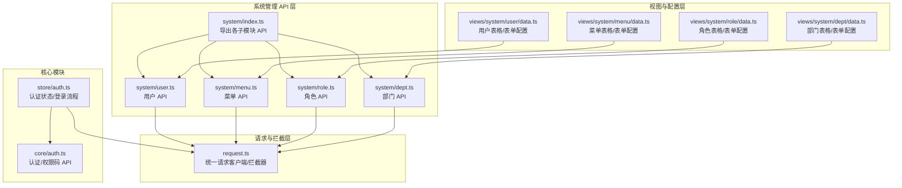
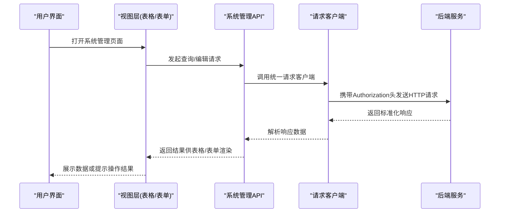
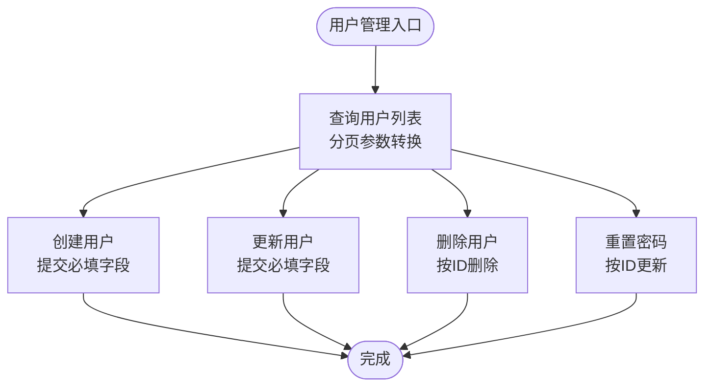
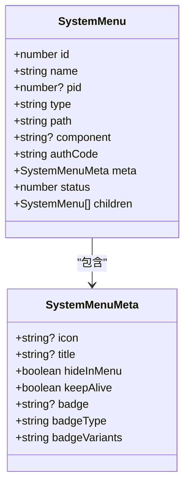
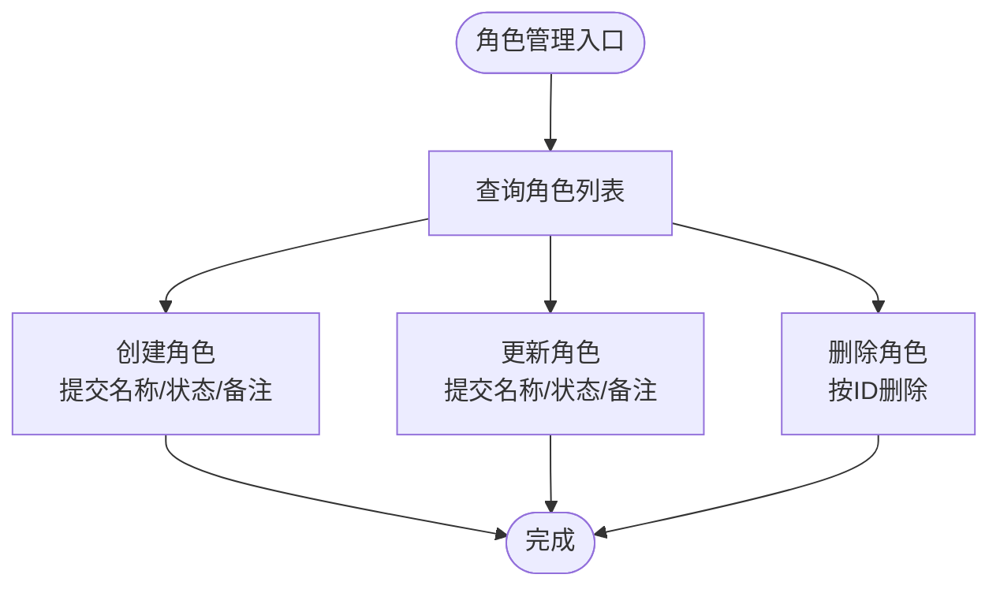
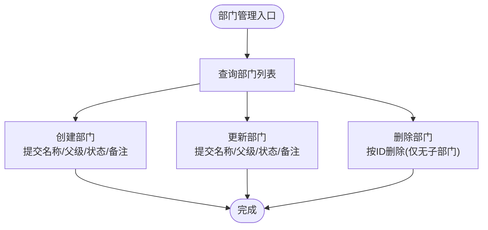
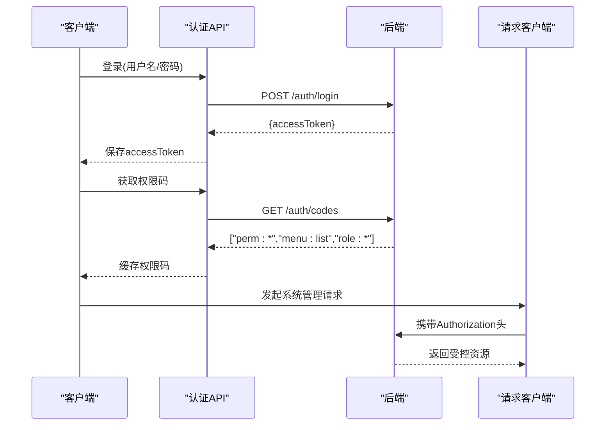
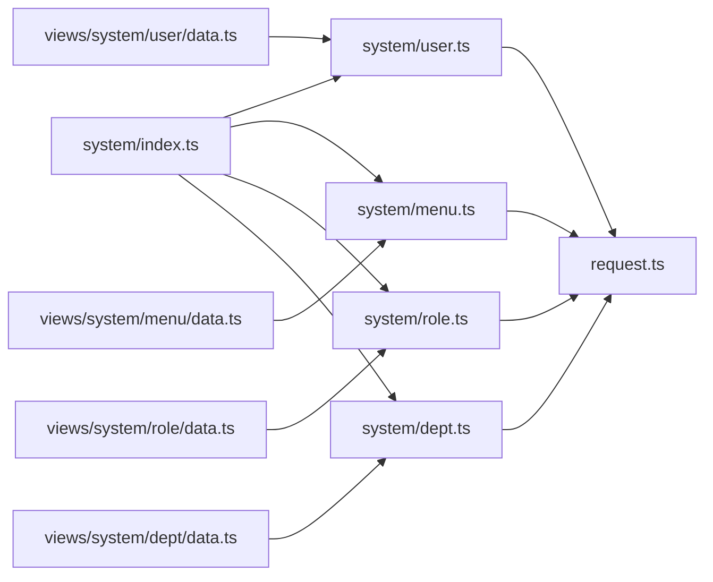

# 系统管理 API 模块

<cite>
**本文档引用的文件**
- [apps/web-naive/src/api/system/index.ts](file://apps/web-naive/src/api/system/index.ts)
- [apps/web-naive/src/api/system/user.ts](file://apps/web-naive/src/api/system/user.ts)
- [apps/web-naive/src/api/system/menu.ts](file://apps/web-naive/src/api/system/menu.ts)
- [apps/web-naive/src/api/system/role.ts](file://apps/web-naive/src/api/system/role.ts)
- [apps/web-naive/src/api/system/dept.ts](file://apps/web-naive/src/api/system/dept.ts)
- [apps/web-naive/src/api/request.ts](file://apps/web-naive/src/api/request.ts)
- [apps/web-naive/src/views/system/user/data.ts](file://apps/web-naive/src/views/system/user/data.ts)
- [apps/web-naive/src/views/system/menu/data.ts](file://apps/web-naive/src/views/system/menu/data.ts)
- [apps/web-naive/src/views/system/role/data.ts](file://apps/web-naive/src/views/system/role/data.ts)
- [apps/web-naive/src/views/system/dept/data.ts](file://apps/web-naive/src/views/system/dept/data.ts)
- [apps/web-naive/src/api/core/auth.ts](file://apps/web-naive/src/api/core/auth.ts)
- [apps/web-naive/src/store/auth.ts](file://apps/web-naive/src/store/auth.ts)
- [apps/web-naive/src/locales/langs/zh-CN/system.json](file://apps/web-naive/src/locales/langs/zh-CN/system.json)
</cite>

## 更新摘要

**变更内容**

- 完善了系统管理 API 模块的详细实现分析
- 更新了各子模块的接口能力和数据模型
- 增强了权限控制与认证集成的说明
- 补充了完整的使用示例和最佳实践

## 目录

1. [简介](#简介)
2. [项目结构](#项目结构)
3. [核心组件](#核心组件)
4. [架构总览](#架构总览)
5. [详细组件分析](#详细组件分析)
6. [依赖分析](#依赖分析)
7. [性能考虑](#性能考虑)
8. [故障排除指南](#故障排除指南)
9. [结论](#结论)
10. [附录](#附录)

## 简介

本文件面向 shiyu-ui 项目的系统管理 API 模块，系统性梳理用户管理、菜单管理、角色管理、部门管理四大核心子模块的设计架构与功能边界，覆盖增删改查、权限控制、批量操作等能力，并阐明数据模型与业务规则（用户-角色关系、菜单权限体系、部门层级结构）。同时提供与核心模块的集成方式与数据同步机制说明，以及典型业务场景的使用示例与最佳实践。

## 项目结构

系统管理 API 模块位于前端应用层，采用按功能域划分的文件组织方式：API 层负责与后端交互，视图层负责表格、表单与校验配置，本地化文件提供多语言文案支撑。

**图表来源**

- [apps/web-naive/src/api/system/index.ts:1-5](file://apps/web-naive/src/api/system/index.ts#L1-L5)
- [apps/web-naive/src/api/system/user.ts:1-96](file://apps/web-naive/src/api/system/user.ts#L1-L96)
- [apps/web-naive/src/api/system/menu.ts:1-170](file://apps/web-naive/src/api/system/menu.ts#L1-L170)
- [apps/web-naive/src/api/system/role.ts:1-58](file://apps/web-naive/src/api/system/role.ts#L1-L58)
- [apps/web-naive/src/api/system/dept.ts:1-65](file://apps/web-naive/src/api/system/dept.ts#L1-L65)
- [apps/web-naive/src/api/request.ts:1-114](file://apps/web-naive/src/api/request.ts#L1-L114)
- [apps/web-naive/src/views/system/user/data.ts:1-193](file://apps/web-naive/src/views/system/user/data.ts#L1-L193)
- [apps/web-naive/src/views/system/menu/data.ts:1-266](file://apps/web-naive/src/views/system/menu/data.ts#L1-L266)
- [apps/web-naive/src/views/system/role/data.ts:1-134](file://apps/web-naive/src/views/system/role/data.ts#L1-L134)
- [apps/web-naive/src/views/system/dept/data.ts:1-134](file://apps/web-naive/src/views/system/dept/data.ts#L1-L134)
- [apps/web-naive/src/api/core/auth.ts:1-52](file://apps/web-naive/src/api/core/auth.ts#L1-L52)
- [apps/web-naive/src/store/auth.ts:1-119](file://apps/web-naive/src/store/auth.ts#L1-L119)

**章节来源**

- [apps/web-naive/src/api/system/index.ts:1-5](file://apps/web-naive/src/api/system/index.ts#L1-L5)
- [apps/web-naive/src/api/system/user.ts:1-96](file://apps/web-naive/src/api/system/user.ts#L1-L96)
- [apps/web-naive/src/api/system/menu.ts:1-170](file://apps/web-naive/src/api/system/menu.ts#L1-L170)
- [apps/web-naive/src/api/system/role.ts:1-58](file://apps/web-naive/src/api/system/role.ts#L1-L58)
- [apps/web-naive/src/api/system/dept.ts:1-65](file://apps/web-naive/src/api/system/dept.ts#L1-L65)
- [apps/web-naive/src/api/request.ts:1-114](file://apps/web-naive/src/api/request.ts#L1-L114)
- [apps/web-naive/src/views/system/user/data.ts:1-193](file://apps/web-naive/src/views/system/user/data.ts#L1-L193)
- [apps/web-naive/src/views/system/menu/data.ts:1-266](file://apps/web-naive/src/views/system/menu/data.ts#L1-L266)
- [apps/web-naive/src/views/system/role/data.ts:1-134](file://apps/web-naive/src/views/system/role/data.ts#L1-L134)
- [apps/web-naive/src/views/system/dept/data.ts:1-134](file://apps/web-naive/src/views/system/dept/data.ts#L1-L134)
- [apps/web-naive/src/api/core/auth.ts:1-52](file://apps/web-naive/src/api/core/auth.ts#L1-L52)
- [apps/web-naive/src/store/auth.ts:1-119](file://apps/web-naive/src/store/auth.ts#L1-L119)

## 核心组件

- **用户管理 API**：提供用户分页查询、创建、更新、删除、重置密码等接口；支持分页返回兼容与数组返回兼容。
- **菜单管理 API**：提供菜单树形列表、创建、更新、删除、名称/路径唯一性校验等接口；支持 vxe-table 包装格式。
- **角色管理 API**：提供角色列表、创建、更新、删除等接口；角色模型包含权限标识数组字段。
- **部门管理 API**：提供部门树形列表、创建、更新、删除等接口；支持 vxe-table 包装格式。
- **请求与拦截**：统一请求客户端，内置响应格式化、鉴权刷新、错误提示拦截器。
- **视图配置**：围绕 vxe-table 与表单组件，定义表格列、表单项、校验规则与联动逻辑。
- **权限与认证**：登录、刷新令牌、退出登录、获取权限码；认证状态与访问码注入到请求头。

**章节来源**

- [apps/web-naive/src/api/system/user.ts:30-96](file://apps/web-naive/src/api/system/user.ts#L30-L96)
- [apps/web-naive/src/api/system/menu.ts:95-170](file://apps/web-naive/src/api/system/menu.ts#L95-L170)
- [apps/web-naive/src/api/system/role.ts:17-58](file://apps/web-naive/src/api/system/role.ts#L17-L58)
- [apps/web-naive/src/api/system/dept.ts:16-65](file://apps/web-naive/src/api/system/dept.ts#L16-L65)
- [apps/web-naive/src/api/request.ts:23-114](file://apps/web-naive/src/api/request.ts#L23-L114)
- [apps/web-naive/src/views/system/user/data.ts:14-193](file://apps/web-naive/src/views/system/user/data.ts#L14-L193)
- [apps/web-naive/src/views/system/menu/data.ts:46-266](file://apps/web-naive/src/views/system/menu/data.ts#L46-L266)
- [apps/web-naive/src/views/system/role/data.ts:13-134](file://apps/web-naive/src/views/system/role/data.ts#L13-L134)
- [apps/web-naive/src/views/system/dept/data.ts:14-134](file://apps/web-naive/src/views/system/dept/data.ts#L14-L134)
- [apps/web-naive/src/api/core/auth.ts:24-52](file://apps/web-naive/src/api/core/auth.ts#L24-L52)
- [apps/web-naive/src/store/auth.ts:28-119](file://apps/web-naive/src/store/auth.ts#L28-L119)

## 架构总览

系统管理模块通过 API 层与后端交互，视图层基于 vxe-table 与表单组件完成数据展示与编辑，请求层统一处理鉴权、刷新与错误提示。认证流程中，登录成功后获取访问令牌与权限码，随后在后续请求中自动携带 Authorization 头。

**图表来源**

- [apps/web-naive/src/views/system/user/data.ts:125-193](file://apps/web-naive/src/views/system/user/data.ts#L125-L193)
- [apps/web-naive/src/views/system/menu/data.ts:178-266](file://apps/web-naive/src/views/system/menu/data.ts#L178-L266)
- [apps/web-naive/src/views/system/role/data.ts:85-134](file://apps/web-naive/src/views/system/role/data.ts#L85-L134)
- [apps/web-naive/src/views/system/dept/data.ts:75-134](file://apps/web-naive/src/views/system/dept/data.ts#L75-L134)
- [apps/web-naive/src/api/system/user.ts:33-53](file://apps/web-naive/src/api/system/user.ts#L33-L53)
- [apps/web-naive/src/api/system/menu.ts:98-110](file://apps/web-naive/src/api/system/menu.ts#L98-L110)
- [apps/web-naive/src/api/system/role.ts:20-24](file://apps/web-naive/src/api/system/role.ts#L20-L24)
- [apps/web-naive/src/api/system/dept.ts:19-31](file://apps/web-naive/src/api/system/dept.ts#L19-L31)
- [apps/web-naive/src/api/request.ts:63-104](file://apps/web-naive/src/api/request.ts#L63-L104)

## 详细组件分析

### 用户管理模块

- **数据模型与字段**
  - 关键字段：用户名、昵称、邮箱、手机号、头像、所属部门、角色ID数组、状态、创建时间等。
  - 分页返回兼容：支持 records/total 与数组两种后端返回格式，前端统一封装为 items/total。
- **接口能力**
  - 查询：支持分页参数 pageNo/pageSize 与附加过滤条件。
  - 新增/更新：提交时剔除自动生成字段（如 id、createTime）。
  - 删除：按用户 ID 删除。
  - 密码重置：按用户 ID 与新密码进行更新。
- **视图配置**
  - 表格列：ID、用户名、昵称、邮箱、手机、状态、创建时间、操作列（编辑、删除、重置密码）。
  - 表单字段：用户名、昵称、邮箱、手机号、所属部门、状态、备注；包含必填与格式校验。
  - 查询表单：用户名、昵称、状态筛选。
- **权限与集成**
  - 通过统一请求客户端自动注入 Authorization 头。
  - 与认证模块配合，在登录后获取权限码并用于前端按钮/菜单可见性控制。

**图表来源**

- [apps/web-naive/src/api/system/user.ts:33-96](file://apps/web-naive/src/api/system/user.ts#L33-L96)
- [apps/web-naive/src/views/system/user/data.ts:14-193](file://apps/web-naive/src/views/system/user/data.ts#L14-L193)

**章节来源**

- [apps/web-naive/src/api/system/user.ts:5-28](file://apps/web-naive/src/api/system/user.ts#L5-L28)
- [apps/web-naive/src/api/system/user.ts:30-96](file://apps/web-naive/src/api/system/user.ts#L30-L96)
- [apps/web-naive/src/views/system/user/data.ts:14-193](file://apps/web-naive/src/views/system/user/data.ts#L14-L193)

### 菜单管理模块

- **数据模型与字段**
  - 关键字段：菜单名称、父级ID、类型（目录/菜单/内嵌/外链/按钮）、路由路径、组件、权限标识、元信息（图标、徽标、是否缓存、是否隐藏等）、状态。
  - 支持树形结构 children 字段，用于前端渲染父子关系。
- **接口能力**
  - 列表：获取整棵菜单树。
  - 校验：名称与路径唯一性检查（支持排除自身 ID）。
  - 新增/更新/删除：按菜单 ID 进行更新与删除。
  - vxe-table 包装：返回 items/total 结构以适配表格组件。
- **视图配置**
  - 表格列：名称（树节点）、图标、类型、权限标识、路径、组件、状态、操作列（新增下级、编辑、删除）。
  - 表单字段：名称、父级菜单、类型、路径/组件/权限标识、标题/图标、隐藏选项、缓存开关、状态；类型联动控制部分字段显隐。
- **权限与集成**
  - 通过统一请求客户端自动注入 Authorization 头。
  - 类型为按钮时，权限标识用于后端鉴权；类型为菜单时，组件与路径决定页面渲染与路由行为。

**图表来源**

- [apps/web-naive/src/api/system/menu.ts:25-93](file://apps/web-naive/src/api/system/menu.ts#L25-L93)

**章节来源**

- [apps/web-naive/src/api/system/menu.ts:5-93](file://apps/web-naive/src/api/system/menu.ts#L5-L93)
- [apps/web-naive/src/api/system/menu.ts:95-170](file://apps/web-naive/src/api/system/menu.ts#L95-L170)
- [apps/web-naive/src/views/system/menu/data.ts:46-266](file://apps/web-naive/src/views/system/menu/data.ts#L46-L266)

### 角色管理模块

- **数据模型与字段**
  - 关键字段：角色名称、状态、备注、创建时间、权限标识数组。
  - 权限标识数组用于后端鉴权与前端按钮/菜单可见性控制。
- **接口能力**
  - 列表：获取全部角色，支持附加过滤参数。
  - 新增/更新/删除：按角色 ID 进行更新与删除。
- **视图配置**
  - 表格列：ID、角色名、状态、创建时间、备注、操作列（编辑、删除）。
  - 表单字段：角色名、状态、备注；包含长度限制与必填校验。
  - 查询表单：角色名、状态筛选。
- **权限与集成**
  - 通过统一请求客户端自动注入 Authorization 头。
  - 角色与用户的关系通常通过用户模型中的 roleIds 字段建立关联。

**图表来源**

- [apps/web-naive/src/api/system/role.ts:17-58](file://apps/web-naive/src/api/system/role.ts#L17-L58)
- [apps/web-naive/src/views/system/role/data.ts:13-134](file://apps/web-naive/src/views/system/role/data.ts#L13-L134)

**章节来源**

- [apps/web-naive/src/api/system/role.ts:5-15](file://apps/web-naive/src/api/system/role.ts#L5-L15)
- [apps/web-naive/src/api/system/role.ts:17-58](file://apps/web-naive/src/api/system/role.ts#L17-L58)
- [apps/web-naive/src/views/system/role/data.ts:13-134](file://apps/web-naive/src/views/system/role/data.ts#L13-L134)

### 部门管理模块

- **数据模型与字段**
  - 关键字段：部门名称、父级ID、状态、备注、创建时间、子部门数组。
  - 支持树形结构 children 字段，用于前端渲染层级关系。
- **接口能力**
  - 列表：获取整棵部门树。
  - 新增/更新/删除：按部门 ID 进行更新与删除。
  - vxe-table 包装：返回 items/total 结构以适配表格组件。
- **视图配置**
  - 表格列：部门名称（树节点）、状态、创建时间、备注、操作列（新增下级、编辑、删除，删除按钮对有子部门的记录禁用）。
  - 表单字段：部门名、上级部门、状态、备注；包含长度限制与必填校验。
- **权限与集成**
  - 通过统一请求客户端自动注入 Authorization 头。
  - 用户模型中的 deptId 字段与部门树形成一对多关系。

**图表来源**

- [apps/web-naive/src/api/system/dept.ts:16-65](file://apps/web-naive/src/api/system/dept.ts#L16-L65)
- [apps/web-naive/src/views/system/dept/data.ts:75-134](file://apps/web-naive/src/views/system/dept/data.ts#L75-L134)

**章节来源**

- [apps/web-naive/src/api/system/dept.ts:3-14](file://apps/web-naive/src/api/system/dept.ts#L3-L14)
- [apps/web-naive/src/api/system/dept.ts:16-65](file://apps/web-naive/src/api/system/dept.ts#L16-L65)
- [apps/web-naive/src/views/system/dept/data.ts:75-134](file://apps/web-naive/src/views/system/dept/data.ts#L75-L134)

### 权限控制与认证集成

- **认证流程**
  - 登录：提交用户名/密码，获取访问令牌。
  - 获取权限码：登录后拉取用户权限码，用于前端按钮/菜单可见性控制。
  - 刷新令牌：在启用刷新模式时，过期后自动刷新。
  - 退出登录：清理状态与路由跳转至登录页。
- **请求拦截**
  - 自动注入 Authorization 头。
  - 统一响应格式化与错误提示。
- **与系统模块的集成**
  - 用户管理、菜单管理、角色管理、部门管理均通过统一请求客户端发起请求，自动携带权限信息。
  - 权限码用于控制菜单与按钮的显示，确保"最小权限"原则。

**图表来源**

- [apps/web-naive/src/api/core/auth.ts:24-52](file://apps/web-naive/src/api/core/auth.ts#L24-L52)
- [apps/web-naive/src/store/auth.ts:28-119](file://apps/web-naive/src/store/auth.ts#L28-L119)
- [apps/web-naive/src/api/request.ts:63-104](file://apps/web-naive/src/api/request.ts#L63-L104)

**章节来源**

- [apps/web-naive/src/api/core/auth.ts:1-52](file://apps/web-naive/src/api/core/auth.ts#L1-L52)
- [apps/web-naive/src/store/auth.ts:1-119](file://apps/web-naive/src/store/auth.ts#L1-L119)
- [apps/web-naive/src/api/request.ts:1-114](file://apps/web-naive/src/api/request.ts#L1-L114)

## 依赖分析

- **模块内聚与耦合**
  - system/index.ts 将四个子模块 API 聚合导出，便于上层统一引入。
  - 各子模块 API 依赖统一请求客户端，降低重复配置与提升一致性。
  - 视图层通过 data.ts 配置表单与表格，与 API 层解耦，便于扩展与复用。
- **外部依赖**
  - 请求客户端：@vben/request，提供拦截器与响应格式化。
  - 状态管理：Pinia 与 @vben/stores，用于认证状态与用户信息缓存。
  - UI 组件：@vben/plugins/vxe-table 与表单组件，用于表格渲染与表单校验。
- **潜在循环依赖**
  - API 层与视图层通过 data.ts 配置文件弱耦合，未见直接循环导入。

**图表来源**

- [apps/web-naive/src/api/system/index.ts:1-5](file://apps/web-naive/src/api/system/index.ts#L1-L5)
- [apps/web-naive/src/api/system/user.ts:3-4](file://apps/web-naive/src/api/system/user.ts#L3-L4)
- [apps/web-naive/src/api/system/menu.ts:3](file://apps/web-naive/src/api/system/menu.ts#L3)
- [apps/web-naive/src/api/system/role.ts:3](file://apps/web-naive/src/api/system/role.ts#L3)
- [apps/web-naive/src/api/system/dept.ts:1](file://apps/web-naive/src/api/system/dept.ts#L1)
- [apps/web-naive/src/api/request.ts:13-18](file://apps/web-naive/src/api/request.ts#L13-L18)
- [apps/web-naive/src/views/system/user/data.ts:5](file://apps/web-naive/src/views/system/user/data.ts#L5)
- [apps/web-naive/src/views/system/menu/data.ts:5](file://apps/web-naive/src/views/system/menu/data.ts#L5)
- [apps/web-naive/src/views/system/role/data.ts:5](file://apps/web-naive/src/views/system/role/data.ts#L5)
- [apps/web-naive/src/views/system/dept/data.ts:5](file://apps/web-naive/src/views/system/dept/data.ts#L5)

**章节来源**

- [apps/web-naive/src/api/system/index.ts:1-5](file://apps/web-naive/src/api/system/index.ts#L1-L5)
- [apps/web-naive/src/api/system/user.ts:3-4](file://apps/web-naive/src/api/system/user.ts#L3-L4)
- [apps/web-naive/src/api/system/menu.ts:3](file://apps/web-naive/src/api/system/menu.ts#L3)
- [apps/web-naive/src/api/system/role.ts:3](file://apps/web-naive/src/api/system/role.ts#L3)
- [apps/web-naive/src/api/system/dept.ts:1](file://apps/web-naive/src/api/system/dept.ts#L1)
- [apps/web-naive/src/api/request.ts:13-18](file://apps/web-naive/src/api/request.ts#L13-L18)
- [apps/web-naive/src/views/system/user/data.ts:5](file://apps/web-naive/src/views/system/user/data.ts#L5)
- [apps/web-naive/src/views/system/menu/data.ts:5](file://apps/web-naive/src/views/system/menu/data.ts#L5)
- [apps/web-naive/src/views/system/role/data.ts:5](file://apps/web-naive/src/views/system/role/data.ts#L5)
- [apps/web-naive/src/views/system/dept/data.ts:5](file://apps/web-naive/src/views/system/dept/data.ts#L5)

## 性能考虑

- **请求合并**：登录成功后并发获取用户信息与权限码，减少等待时间。
- **响应格式化**：统一 code/data/total 字段映射，避免重复解析。
- **表格懒加载**：vxe-table 支持虚拟滚动与分页，建议结合后端分页接口使用。
- **缓存策略**：权限码与用户信息在内存中缓存，避免重复请求。
- **图标与徽标**：菜单元信息中的图标与徽标在渲染时按需加载，注意控制数量与体积。

## 故障排除指南

- **登录失败或 Token 过期**
  - 现象：接口返回 401 或弹出登录框。
  - 处理：启用刷新令牌后自动刷新；否则触发重新认证流程，清空状态并跳转登录页。
- **错误提示**
  - 现象：接口异常时出现错误消息。
  - 处理：统一错误拦截器会读取后端 error/message 字段进行提示，必要时根据 code 定制化处理。
- **唯一性冲突**
  - 现象：菜单名称/路径重复导致保存失败。
  - 处理：先调用唯一性校验接口，确认无冲突后再提交。
- **删除受限**
  - 现象：存在子部门时无法删除。
  - 处理：先删除子部门，再执行删除操作。

**章节来源**

- [apps/web-naive/src/api/request.ts:29-104](file://apps/web-naive/src/api/request.ts#L29-L104)
- [apps/web-naive/src/api/system/menu.ts:112-128](file://apps/web-naive/src/api/system/menu.ts#L112-L128)
- [apps/web-naive/src/views/system/dept/data.ts:117-123](file://apps/web-naive/src/views/system/dept/data.ts#L117-L123)

## 结论

系统管理 API 模块以清晰的职责划分与统一的请求拦截机制为基础，围绕用户、菜单、角色、部门四类实体提供了完善的增删改查与权限控制能力。通过视图层的配置化设计，实现了良好的可扩展性与用户体验。与核心认证模块的深度集成确保了权限的一致性与安全性。建议在生产环境中结合后端分页与缓存策略进一步优化性能，并持续完善权限码与菜单元信息的校验与提示。

## 附录

- **使用示例（概念性流程）**
  - **用户管理流程**
    - 登录后进入系统管理-用户页面，查询用户列表。
    - 新增用户：填写表单并提交，提交时剔除自动生成字段。
    - 更新用户：选择用户后编辑并提交。
    - 删除用户：确认后按ID删除。
    - 重置密码：选择用户后提交新密码。
  - **权限分配**
    - 角色管理：创建角色并配置权限标识数组。
    - 用户管理：在用户表单中选择角色ID数组，保存后生效。
  - **组织架构维护**
    - 部门管理：通过树形选择器选择上级部门，新增/更新/删除部门。
    - 用户归属：在用户表单中选择所属部门，保存后生效。
  - **菜单权限体系**
    - 菜单管理：配置菜单类型、路径、组件、权限标识与元信息。
    - 按钮权限：类型为按钮时，权限标识用于前端按钮可见性控制。

**章节来源**

- [apps/web-naive/src/views/system/user/data.ts:14-193](file://apps/web-naive/src/views/system/user/data.ts#L14-L193)
- [apps/web-naive/src/views/system/role/data.ts:13-134](file://apps/web-naive/src/views/system/role/data.ts#L13-L134)
- [apps/web-naive/src/views/system/dept/data.ts:75-134](file://apps/web-naive/src/views/system/dept/data.ts#L75-L134)
- [apps/web-naive/src/views/system/menu/data.ts:46-266](file://apps/web-naive/src/views/system/menu/data.ts#L46-L266)
- [apps/web-naive/src/locales/langs/zh-CN/system.json:1-85](file://apps/web-naive/src/locales/langs/zh-CN/system.json#L1-L85)
