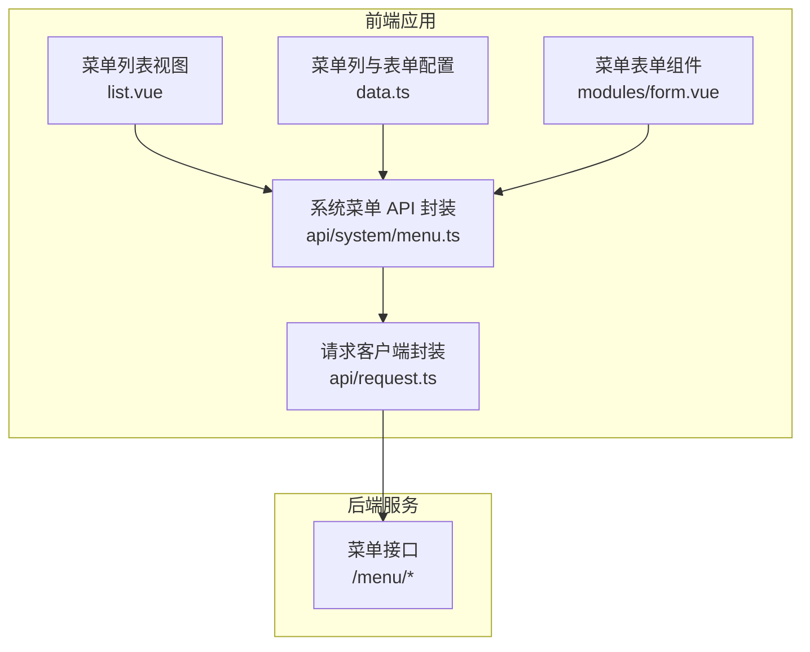
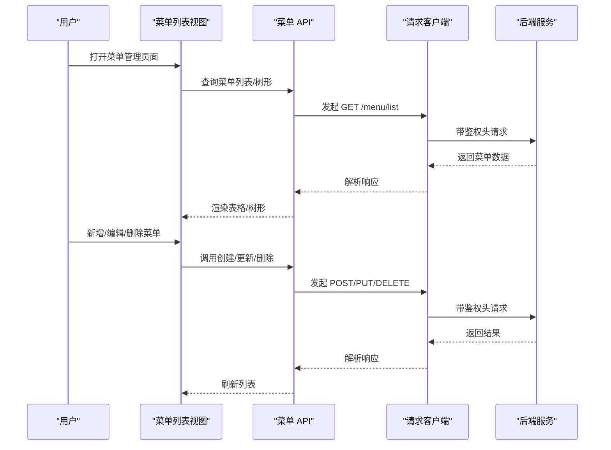
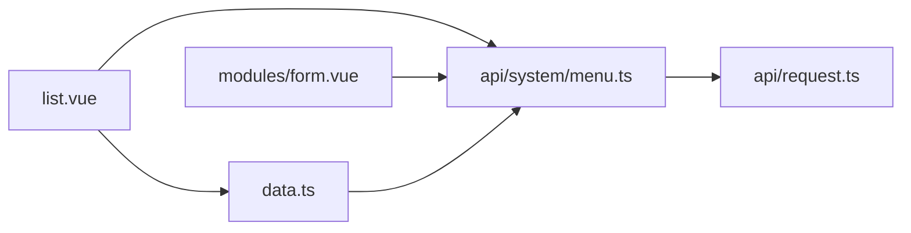

# 菜单管理 API

<cite>
**本文引用的文件**
- [apps/web-naive/src/api/system/menu.ts](file://apps/web-naive/src/api/system/menu.ts)
- [playground/src/api/system/menu.ts](file://playground/src/api/system/menu.ts)
- [apps/web-naive/src/views/system/menu/list.vue](file://apps/web-naive/src/views/system/menu/list.vue)
- [playground/src/views/system/menu/list.vue](file://playground/src/views/system/menu/list.vue)
- [apps/web-naive/src/views/system/menu/data.ts](file://apps/web-naive/src/views/system/menu/data.ts)
- [playground/src/views/system/menu/data.ts](file://playground/src/views/system/menu/data.ts)
- [playground/src/views/system/menu/modules/form.vue](file://playground/src/views/system/menu/modules/form.vue)
- [apps/web-naive/src/api/request.ts](file://apps/web-naive/src/api/request.ts)
</cite>

## 更新摘要

**变更内容**

- 新增菜单代码(code)字段用于菜单唯一标识
- 新增布局选项(layout)支持多种布局模式
- 新增HTTP方法(method)用于按钮类型菜单的请求方法配置
- 新增描述(description)字段用于菜单说明信息
- 新增可见性控制(show)字段用于菜单显示状态管理
- 新增排序机制(order)支持菜单排序功能
- 增强状态管理支持启用/禁用状态控制
- 新增徽标系统(badge)支持徽标显示功能
- 新增路由配置(activePath、linkSrc)增强导航控制

## 目录

1. [简介](#简介)
2. [项目结构](#项目结构)
3. [核心组件](#核心组件)
4. [架构总览](#架构总览)
5. [详细组件分析](#详细组件分析)
6. [依赖分析](#依赖分析)
7. [性能考虑](#性能考虑)
8. [故障排查指南](#故障排查指南)
9. [结论](#结论)
10. [附录](#附录)

## 简介

本文件为"菜单管理 API"的权威文档，覆盖菜单列表查询、树形结构获取、菜单详情、菜单创建、更新、删除等完整接口能力，并重点说明菜单层级结构管理（父子关系、排序、权限标识）与前端集成方式。同时给出菜单数据模型定义、权限控制方案、动态菜单生成与菜单权限验证思路，以及菜单导入导出与批量操作的扩展建议。

**更新** 本次更新反映了新增的菜单代码、布局选项、HTTP方法、描述、可见性控制、排序机制、状态管理增强等功能。

## 项目结构

菜单管理涉及前后端协作：前端通过统一请求客户端调用后端接口；后端返回标准结构化的菜单树或列表；前端以表格/树形控件渲染，并支持增删改查与权限校验。

**图表来源**

- [apps/web-naive/src/views/system/menu/list.vue:128-154](file://apps/web-naive/src/views/system/menu/list.vue#L128-L154)
- [apps/web-naive/src/views/system/menu/data.ts:175-265](file://apps/web-naive/src/views/system/menu/data.ts#L175-L265)
- [apps/web-naive/src/api/system/menu.ts:95-169](file://apps/web-naive/src/api/system/menu.ts#L95-L169)
- [apps/web-naive/src/api/request.ts:23-114](file://apps/web-naive/src/api/request.ts#L23-L114)

**章节来源**

- [apps/web-naive/src/views/system/menu/list.vue:1-155](file://apps/web-naive/src/views/system/menu/list.vue#L1-L155)
- [apps/web-naive/src/views/system/menu/data.ts:1-266](file://apps/web-naive/src/views/system/menu/data.ts#L1-L266)
- [apps/web-naive/src/api/system/menu.ts:1-182](file://apps/web-naive/src/api/system/menu.ts#L1-L182)
- [apps/web-naive/src/api/request.ts:1-114](file://apps/web-naive/src/api/request.ts#L1-L114)

## 核心组件

- 菜单 API 封装：提供菜单列表、树形查询、创建、更新、删除、存在性检查等方法。
- 视图层：菜单列表页负责表格/树形展示、操作按钮、刷新与交互。
- 数据配置：表格列、表单字段、类型选项、徽标配置等。
- 请求客户端：统一拦截器、鉴权头注入、错误处理与响应格式化。

**章节来源**

- [apps/web-naive/src/api/system/menu.ts:95-169](file://apps/web-naive/src/api/system/menu.ts#L95-L169)
- [apps/web-naive/src/views/system/menu/list.vue:26-89](file://apps/web-naive/src/views/system/menu/list.vue#L26-L89)
- [apps/web-naive/src/views/system/menu/data.ts:46-173](file://apps/web-naive/src/views/system/menu/data.ts#L46-L173)

## 架构总览

前端通过统一请求客户端发起菜单相关请求，后端返回标准化的菜单对象数组或树形结构。前端使用表格/树形组件渲染，支持父子关系、排序、权限标识等字段展示与编辑。

**图表来源**

- [apps/web-naive/src/views/system/menu/list.vue:91-126](file://apps/web-naive/src/views/system/menu/list.vue#L91-L126)
- [apps/web-naive/src/api/system/menu.ts:95-169](file://apps/web-naive/src/api/system/menu.ts#L95-L169)
- [apps/web-naive/src/api/request.ts:63-104](file://apps/web-naive/src/api/request.ts#L63-L104)

## 详细组件分析

### 菜单数据模型

- 字段概览
  - 基础字段：id、pid、name、path、component、redirect、type、status、authCode、code、layout、method、description、show、order
  - 元信息 meta：图标、标题、徽标、是否缓存、是否隐藏、是否固定标签、是否新窗口打开、内嵌 iframe 地址、外链地址、激活图标/路径、额外路由参数、排序等
  - 子节点 children：用于树形结构
- 菜单类型
  - 目录、菜单、内嵌、外链、按钮
- 权限标识
  - authCode：后端权限标识，用于按钮级权限控制与动态菜单过滤

**更新** 新增了菜单代码、布局选项、HTTP方法、描述、可见性控制、排序等字段。

**章节来源**

- [apps/web-naive/src/api/system/menu.ts:25-104](file://apps/web-naive/src/api/system/menu.ts#L25-L104)
- [playground/src/api/system/menu.ts:25-90](file://playground/src/api/system/menu.ts#L25-L90)

### 菜单 API 定义

- 获取菜单列表
  - 方法：GET
  - 路径：/menu/list
  - 返回：菜单数组
- 包装为表格格式的列表
  - 方法：GET
  - 路径：/menu/list
  - 返回：{ items, total }
- 名称/路径存在性检查
  - 方法：GET
  - 路径：/menu/name-exists、/menu/path-exists
  - 参数：name/id 或 path/id
  - 返回：布尔值
- 创建菜单
  - 方法：POST
  - 路径：/menu
  - 请求体：除 children、id 外的菜单字段
- 更新菜单
  - 方法：PUT
  - 路径：/menu/{id}
  - 请求体：除 children、id 外的菜单字段
- 删除菜单
  - 方法：DELETE
  - 路径：/menu/{id}

**章节来源**

- [apps/web-naive/src/api/system/menu.ts:107-182](file://apps/web-naive/src/api/system/menu.ts#L107-L182)
- [playground/src/api/system/menu.ts:93-157](file://playground/src/api/system/menu.ts#L93-L157)

### 前端集成与交互

- 列表页
  - 使用表格/树形组件展示菜单，支持展开/折叠、父子关系、排序、状态、类型等字段展示
  - 支持新增下级、编辑、删除操作
  - 刷新列表后自动更新
- 表单配置
  - 类型选择、父级选择（树形下拉）、路径/组件/权限标识等字段按类型动态显示
  - 名称/路径唯一性校验
  - 新增菜单代码、布局选项、HTTP方法、描述、可见性控制、排序等字段
- 图标与徽标
  - 按类型显示不同图标；支持徽标类型与颜色配置

**更新** 新增了徽标显示功能，在菜单标题右侧显示徽标。

**章节来源**

- [apps/web-naive/src/views/system/menu/list.vue:26-89](file://apps/web-naive/src/views/system/menu/list.vue#L26-L89)
- [apps/web-naive/src/views/system/menu/data.ts:46-252](file://apps/web-naive/src/views/system/menu/data.ts#L46-L252)
- [playground/src/views/system/menu/list.vue:26-111](file://playground/src/views/system/menu/list.vue#L26-L111)
- [playground/src/views/system/menu/data.ts:24-109](file://playground/src/views/system/menu/data.ts#L24-L109)

### 请求客户端与鉴权

- 统一请求客户端
  - 自动注入 Authorization 与语言头
  - 响应格式化、错误消息拦截
  - 支持刷新令牌与重新认证流程

**章节来源**

- [apps/web-naive/src/api/request.ts:23-114](file://apps/web-naive/src/api/request.ts#L23-L114)

### 菜单权限控制与动态菜单

- 动态菜单生成
  - 前端根据后端返回的菜单树构建路由与侧边栏
  - 过滤掉无权限的菜单项（依据 authCode）
- 菜单权限验证
  - 按钮级权限：仅在当前用户具备对应 authCode 时显示
  - 页面级权限：路由守卫结合用户权限进行访问控制

**更新** 新增了按钮级权限控制机制，通过 authCode 字段实现细粒度的权限管理。

**章节来源**

- [apps/web-naive/src/api/system/menu.ts:27-28](file://apps/web-naive/src/api/system/menu.ts#L27-L28)
- [apps/web-naive/src/views/system/menu/data.ts:121-129](file://apps/web-naive/src/views/system/menu/data.ts#L121-L129)

### 菜单层级结构管理

- 父子关系
  - 通过 pid 与 id 建立父子关系；树形组件基于 parentField/rowField 渲染
- 排序
  - meta.order 字段用于排序；表格/树形组件支持拖拽或输入排序值
- 权限绑定
  - 按钮类型菜单通过 authCode 绑定权限；目录/菜单类型通过路由与组件配置

**更新** 新增了徽标系统和路由配置增强，支持更丰富的菜单展示和导航功能。

**章节来源**

- [apps/web-naive/src/api/system/menu.ts:84-85](file://apps/web-naive/src/api/system/menu.ts#L84-L85)
- [apps/web-naive/src/views/system/menu/data.ts:74-82](file://apps/web-naive/src/views/system/menu/data.ts#L74-L82)
- [apps/web-naive/src/views/system/menu/data.ts:74-76](file://apps/web-naive/src/views/system/menu/data.ts#L74-L76)

### 导入导出与批量操作（扩展建议）

- 导入
  - 提供 Excel/CSV 模板，按菜单字段映射批量导入；校验父级 pid、路径唯一性、类型合法性
- 导出
  - 导出当前筛选条件下的菜单树/列表，包含元信息与权限标识
- 批量操作
  - 支持批量启用/禁用、批量删除、批量设置权限标识、批量排序

**章节来源**

- [apps/web-naive/src/views/system/menu/list.vue:107-113](file://apps/web-naive/src/views/system/menu/list.vue#L107-L113)

### 菜单类型管理

- 菜单类型定义
  - catalog：目录类型，用于分组管理
  - menu：菜单类型，支持路由跳转
  - embedded：内嵌类型，嵌入外部页面
  - link：外链类型，跳转到外部链接
  - button：按钮类型，用于权限控制
- 类型字段
  - type：菜单类型枚举
  - authCode：权限标识码
  - meta：元数据配置

**新增** 详细说明了五种菜单类型的用途和配置方式。

**章节来源**

- [apps/web-naive/src/api/system/menu.ts:16-23](file://apps/web-naive/src/api/system/menu.ts#L16-L23)
- [apps/web-naive/src/views/system/menu/data.ts:14-41](file://apps/web-naive/src/views/system/menu/data.ts#L14-L41)

### 徽标系统

- 徽标类型
  - dot：点状徽标
  - normal：普通徽标
- 徽标颜色
  - default、destructive、primary、success、warning
- 徽标配置
  - badge：徽标内容
  - badgeType：徽标类型
  - badgeVariants：徽标颜色

**新增** 新增了完整的徽标系统支持。

**章节来源**

- [apps/web-naive/src/api/system/menu.ts:6-15](file://apps/web-naive/src/api/system/menu.ts#L6-L15)
- [apps/web-naive/src/views/system/menu/data.ts:46-173](file://apps/web-naive/src/views/system/menu/data.ts#L46-L173)

### 路由配置增强

- activePath：路由激活路径
- linkSrc：链接源地址
- 组件配置：根据菜单类型动态配置组件路径

**新增** 新增了路由配置增强功能，支持更灵活的导航控制。

**章节来源**

- [playground/src/views/system/menu/modules/form.vue:152-239](file://playground/src/views/system/menu/modules/form.vue#L152-L239)

### 新增功能详解

#### 菜单代码(code)

- 作用：为菜单提供唯一的代码标识符
- 类型：字符串
- 必填：是
- 用途：用于程序内部识别和权限控制

#### 布局选项(layout)

- 作用：控制菜单的布局模式
- 可选值：default、full-content
- 类型：字符串
- 用途：影响菜单的显示样式和布局效果

#### HTTP方法(method)

- 作用：为按钮类型菜单指定HTTP请求方法
- 可选值：GET、POST、PUT、DELETE
- 类型：字符串
- 用途：定义按钮操作对应的HTTP方法

#### 描述(description)

- 作用：为菜单提供详细描述信息
- 类型：字符串
- 最大长度：200字符
- 用途：帮助用户理解菜单功能

#### 可见性控制(show)

- 作用：控制菜单是否在界面中显示
- 类型：布尔值
- 默认值：true
- 用途：动态控制菜单的显示状态

#### 排序机制(order)

- 作用：控制菜单的显示顺序
- 类型：数字
- 默认值：0
- 用途：影响菜单的排列顺序

**新增** 详细说明了新增字段的功能和配置方式。

**章节来源**

- [apps/web-naive/src/api/system/menu.ts:29-42](file://apps/web-naive/src/api/system/menu.ts#L29-L42)
- [apps/web-naive/src/views/system/menu/data.ts:58-212](file://apps/web-naive/src/views/system/menu/data.ts#L58-L212)

## 依赖分析

- 前端模块耦合
  - 视图层依赖数据配置与 API 封装
  - API 封装依赖请求客户端
  - 表单/表格组件依赖数据配置与 API 封装
- 后端接口契约
  - 前后端约定统一的菜单对象结构与字段语义
  - 前端通过树形组件与表格组件适配后端返回的列表/树形数据

**图表来源**

- [apps/web-naive/src/views/system/menu/list.vue:1-155](file://apps/web-naive/src/views/system/menu/list.vue#L1-L155)
- [apps/web-naive/src/views/system/menu/data.ts:1-266](file://apps/web-naive/src/views/system/menu/data.ts#L1-L266)
- [apps/web-naive/src/api/system/menu.ts:1-182](file://apps/web-naive/src/api/system/menu.ts#L1-L182)
- [apps/web-naive/src/api/request.ts:1-114](file://apps/web-naive/src/api/request.ts#L1-L114)

## 性能考虑

- 列表/树形渲染
  - 使用虚拟滚动与懒加载减少大数据量渲染压力
- 请求优化
  - 合并查询参数，避免重复请求；对频繁操作进行防抖
- 缓存策略
  - 对只读菜单数据进行本地缓存，减少网络往返
- 错误处理
  - 统一错误拦截与提示，避免阻塞用户操作

## 故障排查指南

- 无法加载菜单列表
  - 检查鉴权头是否正确注入与令牌有效性
  - 查看响应拦截器中的错误提示
- 名称/路径冲突
  - 使用存在性检查接口确认唯一性
- 删除失败
  - 确认是否存在子节点；后端可能禁止删除非叶子节点
- 权限不生效
  - 检查 authCode 是否正确配置；前端是否正确过滤按钮级权限
- 徽标显示异常
  - 检查徽标类型和颜色配置是否正确
- 路由跳转失败
  - 检查 activePath 是否存在且有效
- 新增字段配置问题
  - 检查菜单代码是否唯一
  - 确认布局选项和HTTP方法的有效性
  - 验证描述和排序字段的格式

**更新** 新增了新增字段相关的故障排查指导。

**章节来源**

- [apps/web-naive/src/api/request.ts:94-104](file://apps/web-naive/src/api/request.ts#L94-L104)
- [apps/web-naive/src/api/system/menu.ts:112-128](file://apps/web-naive/src/api/system/menu.ts#L112-L128)

## 结论

本菜单管理 API 提供了完整的菜单 CRUD 与树形结构支持，配合前端表格/树形组件与权限模型，能够满足常见的后台菜单管理需求。通过统一的请求客户端与标准化的数据模型，便于扩展导入导出、批量操作与更细粒度的权限控制。新增的菜单代码、布局选项、HTTP方法、描述、可见性控制、排序机制、状态管理增强等功能，进一步提升了系统的灵活性和用户体验。

## 附录

### API 参考（汇总）

- GET /menu/list
  - 返回：菜单数组（含 children）
- GET /menu/list（表格包装）
  - 返回：{ items, total }
- GET /menu/name-exists
  - 参数：name, id
  - 返回：布尔值
- GET /menu/path-exists
  - 参数：path, id
  - 返回：布尔值
- POST /menu
  - 请求体：除 children、id 外的菜单字段
- PUT /menu/{id}
  - 请求体：除 children、id 外的菜单字段
- DELETE /menu/{id}
  - 返回：无特定结构，由后端统一响应格式化

**章节来源**

- [apps/web-naive/src/api/system/menu.ts:107-182](file://apps/web-naive/src/api/system/menu.ts#L107-L182)
- [playground/src/api/system/menu.ts:93-157](file://playground/src/api/system/menu.ts#L93-L157)

### 菜单类型定义

- catalog：目录类型，用于分组管理
- menu：菜单类型，支持路由跳转
- embedded：内嵌类型，嵌入外部页面
- link：外链类型，跳转到外部链接
- button：按钮类型，用于权限控制

**新增** 详细说明了五种菜单类型的用途和配置方式。

**章节来源**

- [apps/web-naive/src/api/system/menu.ts:16-23](file://apps/web-naive/src/api/system/menu.ts#L16-L23)
- [apps/web-naive/src/views/system/menu/data.ts:14-41](file://apps/web-naive/src/views/system/menu/data.ts#L14-L41)

### 徽标系统配置

- 徽标类型：dot、normal
- 徽标颜色：default、destructive、primary、success、warning
- 徽标字段：badge、badgeType、badgeVariants

**新增** 新增了完整的徽标系统配置说明。

**章节来源**

- [apps/web-naive/src/api/system/menu.ts:6-15](file://apps/web-naive/src/api/system/menu.ts#L6-L15)
- [apps/web-naive/src/views/system/menu/data.ts:46-173](file://apps/web-naive/src/views/system/menu/data.ts#L46-L173)

### 新增字段配置说明

- 菜单代码(code)：唯一标识符，必填
- 布局选项(layout)：default、full-content
- HTTP方法(method)：GET、POST、PUT、DELETE
- 描述(description)：菜单说明，最多200字符
- 可见性控制(show)：布尔值，默认true
- 排序机制(order)：数字，默认0

**新增** 新增了所有新增字段的详细配置说明。

**章节来源**

- [apps/web-naive/src/api/system/menu.ts:29-42](file://apps/web-naive/src/api/system/menu.ts#L29-L42)
- [apps/web-naive/src/views/system/menu/data.ts:58-212](file://apps/web-naive/src/views/system/menu/data.ts#L58-L212)
