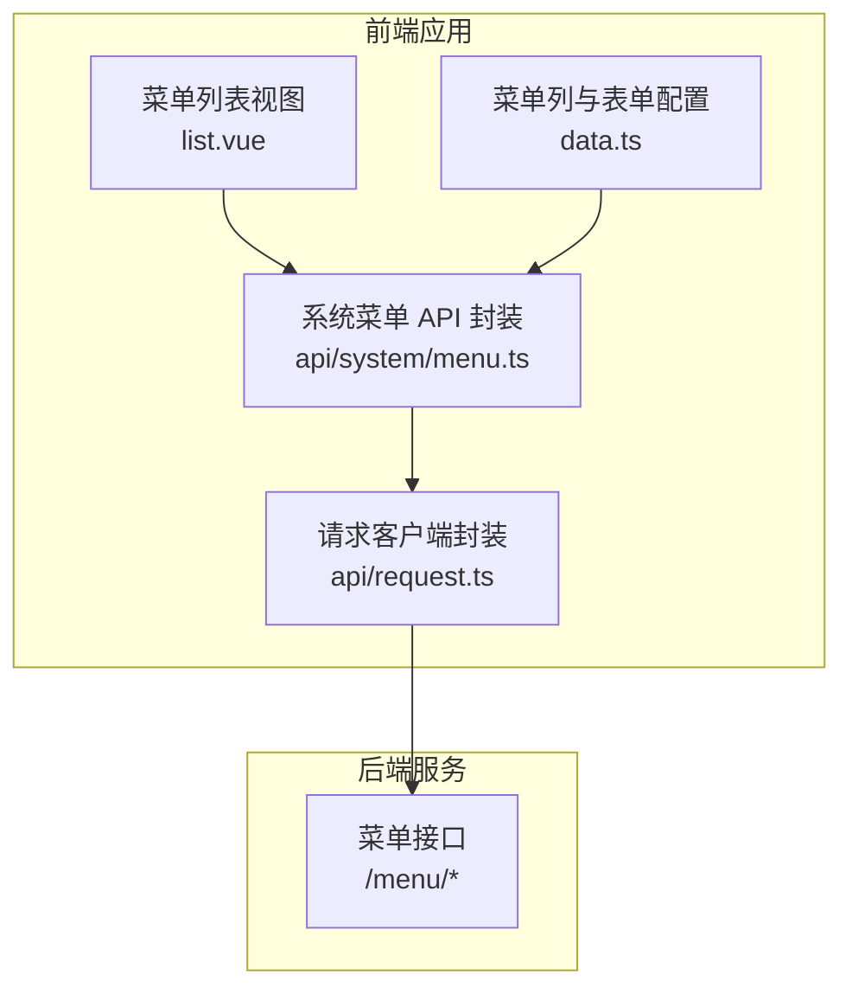
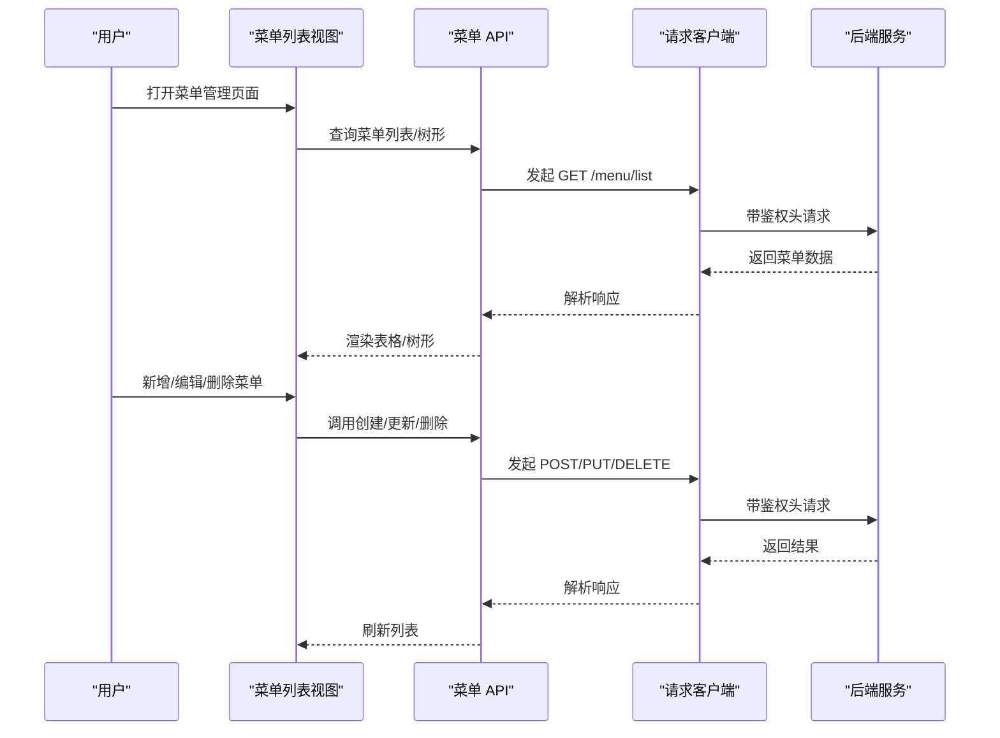
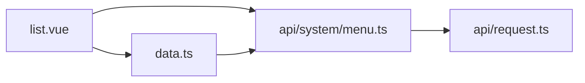

# 菜单管理 API

<cite>
**本文引用的文件**
- [apps/web-naive/src/api/system/menu.ts](file://apps/web-naive/src/api/system/menu.ts)
- [playground/src/api/system/menu.ts](file://playground/src/api/system/menu.ts)
- [apps/web-naive/src/views/system/menu/list.vue](file://apps/web-naive/src/views/system/menu/list.vue)
- [playground/src/views/system/menu/list.vue](file://playground/src/views/system/menu/list.vue)
- [apps/web-naive/src/views/system/menu/data.ts](file://apps/web-naive/src/views/system/menu/data.ts)
- [playground/src/views/system/menu/data.ts](file://playground/src/views/system/menu/data.ts)
- [apps/web-naive/src/api/request.ts](file://apps/web-naive/src/api/request.ts)
</cite>

## 目录

1. [简介](#简介)
2. [项目结构](#项目结构)
3. [核心组件](#核心组件)
4. [架构总览](#架构总览)
5. [详细组件分析](#详细组件分析)
6. [依赖分析](#依赖分析)
7. [性能考虑](#性能考虑)
8. [故障排查指南](#故障排查指南)
9. [结论](#结论)
10. [附录](#附录)

## 简介

本文件为“菜单管理 API”的权威文档，覆盖菜单列表查询、树形结构获取、菜单详情、菜单创建、更新、删除等完整接口能力，并重点说明菜单层级结构管理（父子关系、排序、权限标识）与前端集成方式。同时给出菜单数据模型定义、权限控制方案、动态菜单生成与菜单权限验证思路，以及菜单导入导出与批量操作的扩展建议。

## 项目结构

菜单管理涉及前后端协作：前端通过统一请求客户端调用后端接口；后端返回标准结构化的菜单树或列表；前端以表格/树形控件渲染，并支持增删改查与权限校验。

图表来源

- [apps/web-naive/src/views/system/menu/list.vue:91-119](file://apps/web-naive/src/views/system/menu/list.vue#L91-L119)
- [apps/web-naive/src/views/system/menu/data.ts:196-283](file://apps/web-naive/src/views/system/menu/data.ts#L196-L283)
- [apps/web-naive/src/api/system/menu.ts:98-168](file://apps/web-naive/src/api/system/menu.ts#L98-L168)
- [apps/web-naive/src/api/request.ts:23-114](file://apps/web-naive/src/api/request.ts#L23-L114)

章节来源

- [apps/web-naive/src/views/system/menu/list.vue:1-155](file://apps/web-naive/src/views/system/menu/list.vue#L1-L155)
- [apps/web-naive/src/views/system/menu/data.ts:1-284](file://apps/web-naive/src/views/system/menu/data.ts#L1-L284)
- [apps/web-naive/src/api/system/menu.ts:1-169](file://apps/web-naive/src/api/system/menu.ts#L1-L169)
- [apps/web-naive/src/api/request.ts:1-114](file://apps/web-naive/src/api/request.ts#L1-L114)

## 核心组件

- 菜单 API 封装：提供菜单列表、树形查询、创建、更新、删除、存在性检查等方法。
- 视图层：菜单列表页负责表格/树形展示、操作按钮、刷新与交互。
- 数据配置：表格列、表单字段、类型选项、徽标配置等。
- 请求客户端：统一拦截器、鉴权头注入、错误处理与响应格式化。

章节来源

- [apps/web-naive/src/api/system/menu.ts:98-168](file://apps/web-naive/src/api/system/menu.ts#L98-L168)
- [apps/web-naive/src/views/system/menu/list.vue:91-126](file://apps/web-naive/src/views/system/menu/list.vue#L91-L126)
- [apps/web-naive/src/views/system/menu/data.ts:66-191](file://apps/web-naive/src/views/system/menu/data.ts#L66-L191)

## 架构总览

前端通过统一请求客户端发起菜单相关请求，后端返回标准化的菜单对象数组或树形结构。前端使用表格/树形组件渲染，支持父子关系、排序、权限标识等字段展示与编辑。

图表来源

- [apps/web-naive/src/views/system/menu/list.vue:91-126](file://apps/web-naive/src/views/system/menu/list.vue#L91-L126)
- [apps/web-naive/src/api/system/menu.ts:98-168](file://apps/web-naive/src/api/system/menu.ts#L98-L168)
- [apps/web-naive/src/api/request.ts:63-104](file://apps/web-naive/src/api/request.ts#L63-L104)

## 详细组件分析

### 菜单数据模型

- 字段概览
  - 基础字段：id、pid、name、path、component、redirect、type、status、authCode
  - 元信息 meta：图标、标题、徽标、是否缓存、是否隐藏、是否固定标签、是否新窗口打开、内嵌 iframe 地址、外链地址、激活图标/路径、额外路由参数、排序等
  - 子节点 children：用于树形结构
- 菜单类型
  - 目录、菜单、内嵌、外链、按钮
- 权限标识
  - authCode：后端权限标识，用于按钮级权限控制与动态菜单过滤

章节来源

- [apps/web-naive/src/api/system/menu.ts:25-92](file://apps/web-naive/src/api/system/menu.ts#L25-L92)
- [playground/src/api/system/menu.ts:25-91](file://playground/src/api/system/menu.ts#L25-L91)

### 菜单 API 定义

- 获取菜单列表
  - 方法：GET
  - 路径：/menu/list
  - 返回：菜单数组
- 包装为表格格式的列表
  - 方法：GET
  - 路径：/menu/list
  - 返回：{ items, total }
- 名称/路径存在性检查
  - 方法：GET
  - 路径：/menu/name-exists、/menu/path-exists
  - 参数：name/id 或 path/id
  - 返回：布尔值
- 创建菜单
  - 方法：POST
  - 路径：/menu
  - 请求体：除 children、id 外的菜单字段
- 更新菜单
  - 方法：PUT
  - 路径：/menu/{id}
  - 请求体：除 children、id 外的菜单字段
- 删除菜单
  - 方法：DELETE
  - 路径：/menu/{id}

章节来源

- [apps/web-naive/src/api/system/menu.ts:98-168](file://apps/web-naive/src/api/system/menu.ts#L98-L168)
- [playground/src/api/system/menu.ts:96-147](file://playground/src/api/system/menu.ts#L96-L147)

### 前端集成与交互

- 列表页
  - 使用表格/树形组件展示菜单，支持展开/折叠、父子关系、排序、状态、类型等字段展示
  - 支持新增下级、编辑、删除操作
  - 刷新列表后自动更新
- 表单配置
  - 类型选择、父级选择（树形下拉）、路径/组件/权限标识等字段按类型动态显示
  - 名称/路径唯一性校验
- 图标与徽标
  - 按类型显示不同图标；支持徽标类型与颜色配置

章节来源

- [apps/web-naive/src/views/system/menu/list.vue:91-126](file://apps/web-naive/src/views/system/menu/list.vue#L91-L126)
- [apps/web-naive/src/views/system/menu/data.ts:66-191](file://apps/web-naive/src/views/system/menu/data.ts#L66-L191)
- [playground/src/views/system/menu/list.vue:26-111](file://playground/src/views/system/menu/list.vue#L26-L111)
- [playground/src/views/system/menu/data.ts:24-109](file://playground/src/views/system/menu/data.ts#L24-L109)

### 请求客户端与鉴权

- 统一请求客户端
  - 自动注入 Authorization 与语言头
  - 响应格式化、错误消息拦截
  - 支持刷新令牌与重新认证流程

章节来源

- [apps/web-naive/src/api/request.ts:23-114](file://apps/web-naive/src/api/request.ts#L23-L114)

### 菜单权限控制与动态菜单

- 动态菜单生成
  - 前端根据后端返回的菜单树构建路由与侧边栏
  - 过滤掉无权限的菜单项（依据 authCode）
- 菜单权限验证
  - 按钮级权限：仅在当前用户具备对应 authCode 时显示
  - 页面级权限：路由守卫结合用户权限进行访问控制

章节来源

- [apps/web-naive/src/api/system/menu.ts:27-28](file://apps/web-naive/src/api/system/menu.ts#L27-L28)
- [apps/web-naive/src/views/system/menu/data.ts:121-129](file://apps/web-naive/src/views/system/menu/data.ts#L121-L129)

### 菜单层级结构管理

- 父子关系
  - 通过 pid 与 id 建立父子关系；树形组件基于 parentField/rowField 渲染
- 排序
  - meta.order 字段用于排序；表格/树形组件支持拖拽或输入排序值
- 权限绑定
  - 按钮类型菜单通过 authCode 绑定权限；目录/菜单类型通过路由与组件配置

章节来源

- [apps/web-naive/src/api/system/menu.ts:84-85](file://apps/web-naive/src/api/system/menu.ts#L84-L85)
- [apps/web-naive/src/views/system/menu/data.ts:74-82](file://apps/web-naive/src/views/system/menu/data.ts#L74-L82)
- [apps/web-naive/src/views/system/menu/data.ts:74-76](file://apps/web-naive/src/views/system/menu/data.ts#L74-L76)

### 导入导出与批量操作（扩展建议）

- 导入
  - 提供 Excel/CSV 模板，按菜单字段映射批量导入；校验父级 pid、路径唯一性、类型合法性
- 导出
  - 导出当前筛选条件下的菜单树/列表，包含元信息与权限标识
- 批量操作
  - 支持批量启用/禁用、批量删除、批量设置权限标识、批量排序

章节来源

- [apps/web-naive/src/views/system/menu/list.vue:107-113](file://apps/web-naive/src/views/system/menu/list.vue#L107-L113)

## 依赖分析

- 前端模块耦合
  - 视图层依赖数据配置与 API 封装
  - API 封装依赖请求客户端
  - 表单/表格组件依赖数据配置与 API 封装
- 后端接口契约
  - 前后端约定统一的菜单对象结构与字段语义
  - 前端通过树形组件与表格组件适配后端返回的列表/树形数据

图表来源

- [apps/web-naive/src/views/system/menu/list.vue:1-155](file://apps/web-naive/src/views/system/menu/list.vue#L1-L155)
- [apps/web-naive/src/views/system/menu/data.ts:1-284](file://apps/web-naive/src/views/system/menu/data.ts#L1-L284)
- [apps/web-naive/src/api/system/menu.ts:1-169](file://apps/web-naive/src/api/system/menu.ts#L1-L169)
- [apps/web-naive/src/api/request.ts:1-114](file://apps/web-naive/src/api/request.ts#L1-L114)

## 性能考虑

- 列表/树形渲染
  - 使用虚拟滚动与懒加载减少大数据量渲染压力
- 请求优化
  - 合并查询参数，避免重复请求；对频繁操作进行防抖
- 缓存策略
  - 对只读菜单数据进行本地缓存，减少网络往返
- 错误处理
  - 统一错误拦截与提示，避免阻塞用户操作

## 故障排查指南

- 无法加载菜单列表
  - 检查鉴权头是否正确注入与令牌有效性
  - 查看响应拦截器中的错误提示
- 名称/路径冲突
  - 使用存在性检查接口确认唯一性
- 删除失败
  - 确认是否存在子节点；后端可能禁止删除非叶子节点
- 权限不生效
  - 检查 authCode 是否正确配置；前端是否正确过滤按钮级权限

章节来源

- [apps/web-naive/src/api/request.ts:94-104](file://apps/web-naive/src/api/request.ts#L94-L104)
- [apps/web-naive/src/api/system/menu.ts:111-127](file://apps/web-naive/src/api/system/menu.ts#L111-L127)

## 结论

本菜单管理 API 提供了完整的菜单 CRUD 与树形结构支持，配合前端表格/树形组件与权限模型，能够满足常见的后台菜单管理需求。通过统一的请求客户端与标准化的数据模型，便于扩展导入导出、批量操作与更细粒度的权限控制。

## 附录

### API 参考（汇总）

- GET /menu/list
  - 返回：菜单数组（含 children）
- GET /menu/list（表格包装）
  - 返回：{ items, total }
- GET /menu/name-exists
  - 参数：name, id
  - 返回：布尔值
- GET /menu/path-exists
  - 参数：path, id
  - 返回：布尔值
- POST /menu
  - 请求体：除 children、id 外的菜单字段
- PUT /menu/{id}
  - 请求体：除 children、id 外的菜单字段
- DELETE /menu/{id}
  - 返回：无特定结构，由后端统一响应格式化

章节来源

- [apps/web-naive/src/api/system/menu.ts:98-168](file://apps/web-naive/src/api/system/menu.ts#L98-L168)
- [playground/src/api/system/menu.ts:96-147](file://playground/src/api/system/menu.ts#L96-L147)
