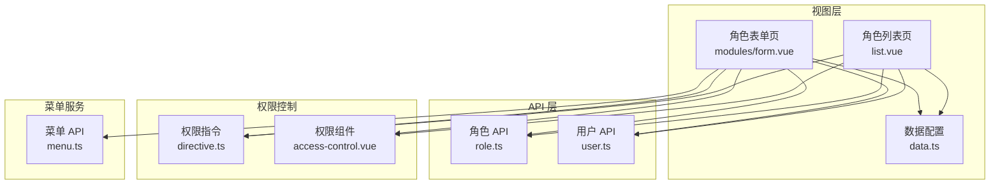
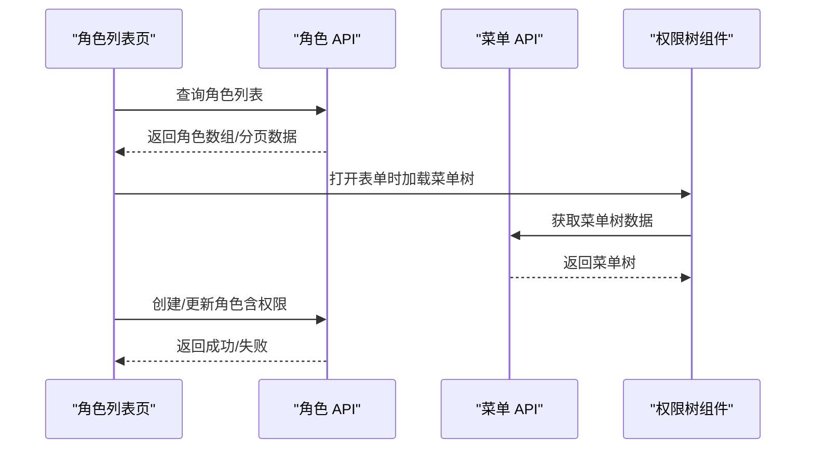
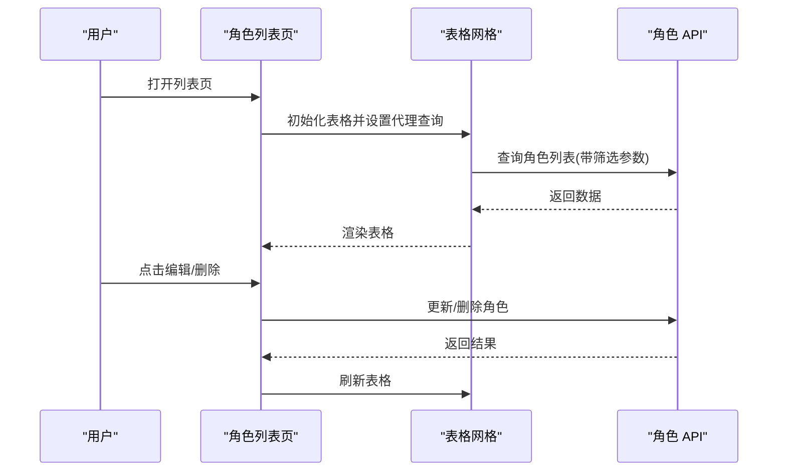
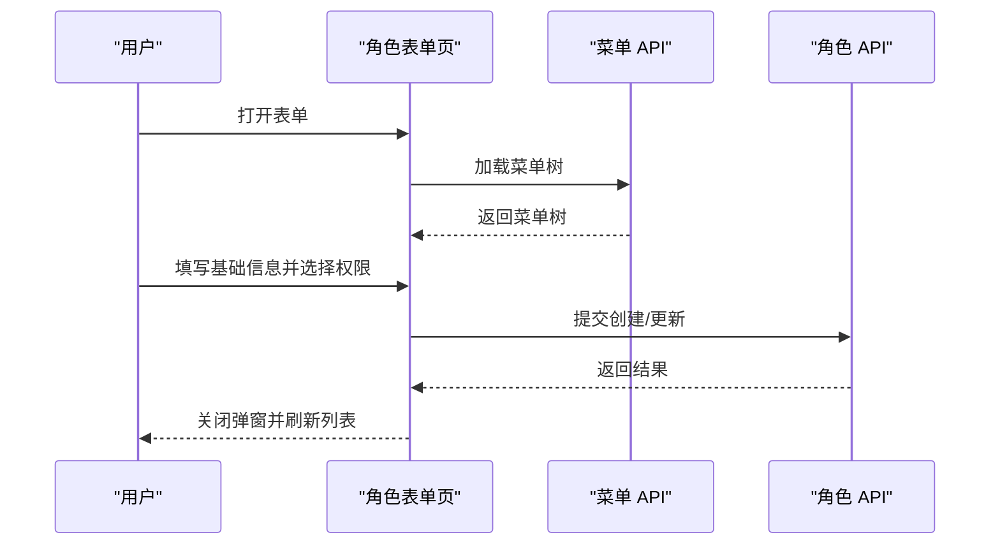
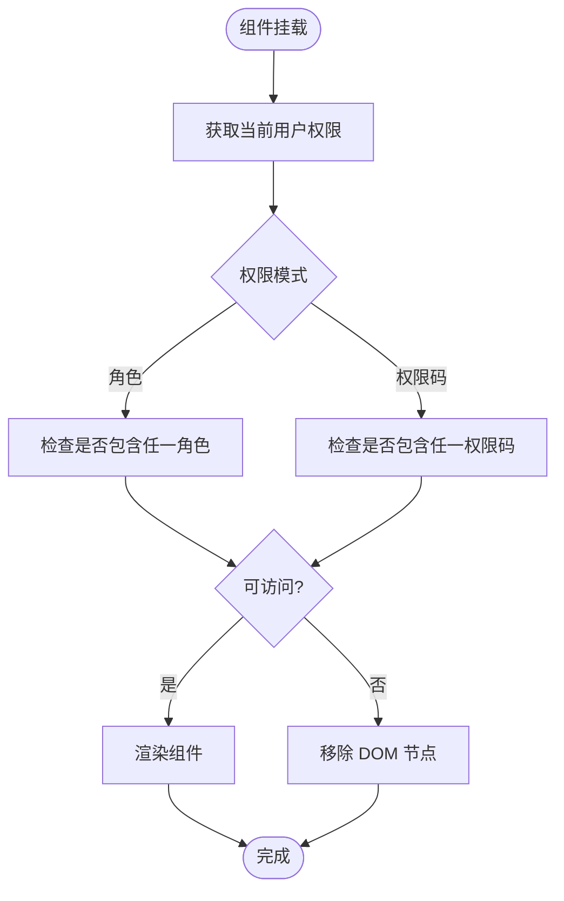
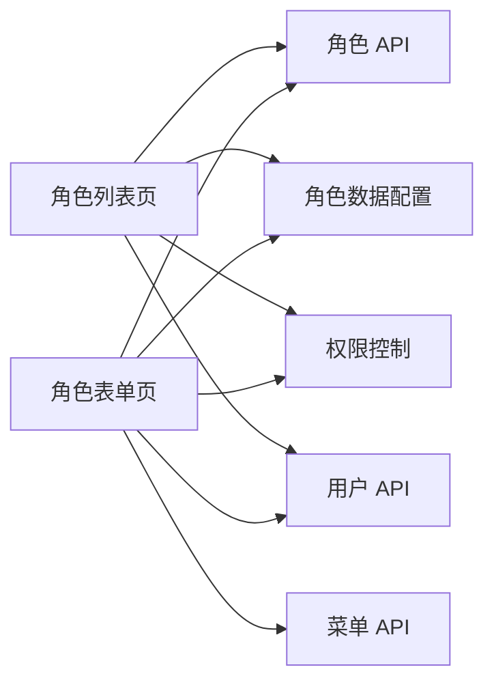

# 角色管理 API

<cite>
**本文引用的文件**
- [apps/web-naive/src/api/system/role.ts](file://apps/web-naive/src/api/system/role.ts)
- [playground/src/api/system/role.ts](file://playground/src/api/system/role.ts)
- [apps/web-naive/src/views/system/role/list.vue](file://apps/web-naive/src/views/system/role/list.vue)
- [playground/src/views/system/role/list.vue](file://playground/src/views/system/role/list.vue)
- [apps/web-naive/src/views/system/role/modules/form.vue](file://apps/web-naive/src/views/system/role/modules/form.vue)
- [playground/src/views/system/role/modules/form.vue](file://playground/src/views/system/role/modules/form.vue)
- [apps/web-naive/src/views/system/role/data.ts](file://apps/web-naive/src/views/system/role/data.ts)
- [playground/src/views/system/role/data.ts](file://playground/src/views/system/role/data.ts)
- [apps/web-naive/src/api/system/user.ts](file://apps/web-naive/src/api/system/user.ts)
- [packages/effects/access/src/directive.ts](file://packages/effects/access/src/directive.ts)
- [packages/effects/access/src/access-control.vue](file://packages/effects/access/src/access-control.vue)
- [playground/src/views/demos/access/button-control.vue](file://playground/src/views/demos/access/button-control.vue)
- [playground/src/locales/langs/zh-CN/system.json](file://playground/src/locales/langs/zh-CN/system.json)
</cite>

## 目录

1. [简介](#简介)
2. [项目结构](#项目结构)
3. [核心组件](#核心组件)
4. [架构总览](#架构总览)
5. [详细组件分析](#详细组件分析)
6. [依赖关系分析](#依赖关系分析)
7. [性能考虑](#性能考虑)
8. [故障排查指南](#故障排查指南)
9. [结论](#结论)
10. [附录](#附录)

## 简介

本文件为“角色管理 API”的详细技术文档，覆盖角色管理的完整接口能力与前端实现细节，包括：

- 标准 CRUD：角色列表查询、角色详情、角色创建、角色更新、角色删除
- 权限分配：菜单权限授权、按钮权限授权、数据权限配置（基于菜单树授权）
- 数据模型：角色编码、角色名称、权限范围、状态管理等字段定义
- 用户关联：角色与用户的关联管理（批量角色分配、角色权限继承）
- 权限验证与动态控制：前端指令与组件级权限控制

## 项目结构

角色管理模块由“API 层 + 视图层 + 数据层 + 权限控制层”构成，采用前后端分离的典型架构：

- API 层：封装系统角色与菜单相关的请求方法
- 视图层：列表页与表单页，支持分页、筛选、状态切换、权限树授权
- 数据层：表格列、表单 Schema、国际化文案
- 权限控制层：全局指令与组件式权限控制，支持按角色或权限码进行前端控制

图表来源

- [apps/web-naive/src/views/system/role/list.vue:1-132](file://apps/web-naive/src/views/system/role/list.vue#L1-L132)
- [apps/web-naive/src/views/system/role/modules/form.vue:1-84](file://apps/web-naive/src/views/system/role/modules/form.vue#L1-L84)
- [apps/web-naive/src/views/system/role/data.ts:1-132](file://apps/web-naive/src/views/system/role/data.ts#L1-L132)
- [apps/web-naive/src/api/system/role.ts:1-56](file://apps/web-naive/src/api/system/role.ts#L1-L56)
- [apps/web-naive/src/api/system/user.ts:1-99](file://apps/web-naive/src/api/system/user.ts#L1-L99)
- [packages/effects/access/src/directive.ts:1-42](file://packages/effects/access/src/directive.ts#L1-L42)
- [packages/effects/access/src/access-control.vue:1-47](file://packages/effects/access/src/access-control.vue#L1-L47)

章节来源

- [apps/web-naive/src/views/system/role/list.vue:1-132](file://apps/web-naive/src/views/system/role/list.vue#L1-L132)
- [apps/web-naive/src/views/system/role/modules/form.vue:1-84](file://apps/web-naive/src/views/system/role/modules/form.vue#L1-L84)
- [apps/web-naive/src/views/system/role/data.ts:1-132](file://apps/web-naive/src/views/system/role/data.ts#L1-L132)
- [apps/web-naive/src/api/system/role.ts:1-56](file://apps/web-naive/src/api/system/role.ts#L1-L56)
- [apps/web-naive/src/api/system/user.ts:1-99](file://apps/web-naive/src/api/system/user.ts#L1-L99)
- [packages/effects/access/src/directive.ts:1-42](file://packages/effects/access/src/directive.ts#L1-L42)
- [packages/effects/access/src/access-control.vue:1-47](file://packages/effects/access/src/access-control.vue#L1-L47)

## 核心组件

- 角色 API 模块：提供角色列表、创建、更新、删除等方法；在不同应用中存在两个实现版本（web-naive 与 playground），字段类型略有差异
- 角色列表页：集成表格、分页、筛选、状态切换、操作按钮
- 角色表单页：支持基础信息编辑与菜单权限树授权
- 数据配置：表格列、表单 Schema、国际化文案
- 权限控制：全局指令与组件式权限控制，支持角色与权限码两种模式

章节来源

- [apps/web-naive/src/api/system/role.ts:1-56](file://apps/web-naive/src/api/system/role.ts#L1-L56)
- [playground/src/api/system/role.ts:1-55](file://playground/src/api/system/role.ts#L1-L55)
- [apps/web-naive/src/views/system/role/list.vue:1-132](file://apps/web-naive/src/views/system/role/list.vue#L1-L132)
- [playground/src/views/system/role/list.vue:1-165](file://playground/src/views/system/role/list.vue#L1-L165)
- [apps/web-naive/src/views/system/role/modules/form.vue:1-84](file://apps/web-naive/src/views/system/role/modules/form.vue#L1-L84)
- [playground/src/views/system/role/modules/form.vue:1-139](file://playground/src/views/system/role/modules/form.vue#L1-L139)
- [apps/web-naive/src/views/system/role/data.ts:1-132](file://apps/web-naive/src/views/system/role/data.ts#L1-L132)
- [playground/src/views/system/role/data.ts:1-128](file://playground/src/views/system/role/data.ts#L1-L128)
- [playground/src/locales/langs/zh-CN/system.json:54-66](file://playground/src/locales/langs/zh-CN/system.json#L54-L66)

## 架构总览

角色管理的前端架构围绕“视图组件 + API 客户端 + 权限控制”展开，数据流从页面到 API，再回填到视图；权限控制贯穿于渲染阶段。

图表来源

- [apps/web-naive/src/views/system/role/list.vue:79-110](file://apps/web-naive/src/views/system/role/list.vue#L79-L110)
- [playground/src/views/system/role/list.vue:27-60](file://playground/src/views/system/role/list.vue#L27-L60)
- [apps/web-naive/src/views/system/role/modules/form.vue:35-73](file://apps/web-naive/src/views/system/role/modules/form.vue#L35-L73)
- [playground/src/views/system/role/modules/form.vue:35-83](file://playground/src/views/system/role/modules/form.vue#L35-L83)
- [playground/src/api/system/role.ts:19-23](file://playground/src/api/system/role.ts#L19-L23)
- [playground/src/api/system/role.ts:39-44](file://playground/src/api/system/role.ts#L39-L44)
- [playground/src/api/system/role.ts:49-52](file://playground/src/api/system/role.ts#L49-L52)

## 详细组件分析

### 角色 API 接口定义

- 角色列表查询：支持分页与筛选参数
- 创建角色：提交角色基础信息
- 更新角色：按 ID 更新角色信息
- 删除角色：按 ID 删除角色
- 字段差异：web-naive 版本使用数字 ID，playground 版本使用字符串 ID；权限字段在不同版本中存在差异

章节来源

- [apps/web-naive/src/api/system/role.ts:20-24](file://apps/web-naive/src/api/system/role.ts#L20-L24)
- [apps/web-naive/src/api/system/role.ts:30-32](file://apps/web-naive/src/api/system/role.ts#L30-L32)
- [apps/web-naive/src/api/system/role.ts:40-45](file://apps/web-naive/src/api/system/role.ts#L40-L45)
- [apps/web-naive/src/api/system/role.ts:51-53](file://apps/web-naive/src/api/system/role.ts#L51-L53)
- [playground/src/api/system/role.ts:19-23](file://playground/src/api/system/role.ts#L19-L23)
- [playground/src/api/system/role.ts:29-31](file://playground/src/api/system/role.ts#L29-L31)
- [playground/src/api/system/role.ts:39-44](file://playground/src/api/system/role.ts#L39-L44)
- [playground/src/api/system/role.ts:50-52](file://playground/src/api/system/role.ts#L50-L52)

### 角色列表页（表格）

- 功能点：分页查询、表单筛选、状态切换、操作按钮（编辑/删除）、刷新
- 数据绑定：通过 vxe-table 的 proxyConfig 绑定查询方法
- 交互流程：点击操作按钮触发编辑或删除，删除前有加载提示与确认流程

图表来源

- [apps/web-naive/src/views/system/role/list.vue:79-110](file://apps/web-naive/src/views/system/role/list.vue#L79-L110)
- [playground/src/views/system/role/list.vue:27-60](file://playground/src/views/system/role/list.vue#L27-L60)
- [apps/web-naive/src/views/system/role/list.vue:45-58](file://apps/web-naive/src/views/system/role/list.vue#L45-L58)
- [playground/src/views/system/role/list.vue:125-142](file://playground/src/views/system/role/list.vue#L125-L142)

章节来源

- [apps/web-naive/src/views/system/role/list.vue:1-132](file://apps/web-naive/src/views/system/role/list.vue#L1-L132)
- [playground/src/views/system/role/list.vue:1-165](file://playground/src/views/system/role/list.vue#L1-L165)

### 角色表单页（编辑/新增）

- 基础信息：角色名称、状态、备注
- 权限授权：打开表单时加载菜单树，支持多选授权；按钮节点具有特殊样式
- 提交流程：校验表单 → 提交创建或更新 → 成功后关闭弹窗并刷新列表

图表来源

- [apps/web-naive/src/views/system/role/modules/form.vue:35-69](file://apps/web-naive/src/views/system/role/modules/form.vue#L35-L69)
- [playground/src/views/system/role/modules/form.vue:35-83](file://playground/src/views/system/role/modules/form.vue#L35-L83)
- [playground/src/views/system/role/modules/form.vue:75-83](file://playground/src/views/system/role/modules/form.vue#L75-L83)
- [playground/src/views/system/role/modules/form.vue:40-48](file://playground/src/views/system/role/modules/form.vue#L40-L48)

章节来源

- [apps/web-naive/src/views/system/role/modules/form.vue:1-84](file://apps/web-naive/src/views/system/role/modules/form.vue#L1-L84)
- [playground/src/views/system/role/modules/form.vue:1-139](file://playground/src/views/system/role/modules/form.vue#L1-L139)

### 角色数据模型与 Schema

- 角色模型字段：名称、状态、备注、创建时间、权限集合（不同版本字段存在差异）
- 表单 Schema：必填校验、长度限制、默认值
- 表格列：ID、名称、状态、创建时间、备注、操作列

章节来源

- [apps/web-naive/src/views/system/role/data.ts:41-78](file://apps/web-naive/src/views/system/role/data.ts#L41-L78)
- [apps/web-naive/src/views/system/role/data.ts:83-131](file://apps/web-naive/src/views/system/role/data.ts#L83-L131)
- [playground/src/views/system/role/data.ts:7-42](file://playground/src/views/system/role/data.ts#L7-L42)
- [playground/src/views/system/role/data.ts:44-75](file://playground/src/views/system/role/data.ts#L44-L75)
- [playground/src/views/system/role/data.ts:77-127](file://playground/src/views/system/role/data.ts#L77-L127)
- [playground/src/locales/langs/zh-CN/system.json:54-66](file://playground/src/locales/langs/zh-CN/system.json#L54-L66)

### 角色与用户关联管理

- 用户模型包含角色 ID 数组，用于表达用户的角色归属
- 列表页支持分页查询与状态切换，便于管理用户角色
- 角色与用户的关联可通过用户管理界面进行批量角色分配与权限继承

章节来源

- [apps/web-naive/src/api/system/user.ts:5-28](file://apps/web-naive/src/api/system/user.ts#L5-L28)
- [apps/web-naive/src/api/system/user.ts:33-50](file://apps/web-naive/src/api/system/user.ts#L33-L50)
- [apps/web-naive/src/api/system/user.ts:68-73](file://apps/web-naive/src/api/system/user.ts#L68-L73)
- [apps/web-naive/src/api/system/user.ts:79-81](file://apps/web-naive/src/api/system/user.ts#L79-L81)

### 权限验证机制与动态权限控制

- 全局指令：支持按角色或权限码进行前端权限控制
- 组件式控制：提供可复用的权限控制组件，支持多种组合策略
- 示例演示：切换不同账号角色，观察按钮可见性变化

图表来源

- [packages/effects/access/src/directive.ts:11-30](file://packages/effects/access/src/directive.ts#L11-L30)
- [packages/effects/access/src/access-control.vue:38-41](file://packages/effects/access/src/access-control.vue#L38-L41)
- [playground/src/views/demos/access/button-control.vue:53-116](file://playground/src/views/demos/access/button-control.vue#L53-L116)

章节来源

- [packages/effects/access/src/directive.ts:1-42](file://packages/effects/access/src/directive.ts#L1-L42)
- [packages/effects/access/src/access-control.vue:1-47](file://packages/effects/access/src/access-control.vue#L1-L47)
- [playground/src/views/demos/access/button-control.vue:53-116](file://playground/src/views/demos/access/button-control.vue#L53-L116)

## 依赖关系分析

- 角色列表页依赖角色 API 与本地数据配置
- 角色表单页依赖角色 API、菜单 API 与本地数据配置
- 权限控制层独立于业务模块，通过全局指令与组件注入到任意组件
- 用户 API 与角色 API 解耦，但通过用户模型中的角色 ID 实现关联

图表来源

- [apps/web-naive/src/views/system/role/list.vue:15-18](file://apps/web-naive/src/views/system/role/list.vue#L15-L18)
- [apps/web-naive/src/views/system/role/modules/form.vue:10-11](file://apps/web-naive/src/views/system/role/modules/form.vue#L10-L11)
- [playground/src/views/system/role/modules/form.vue:15-17](file://playground/src/views/system/role/modules/form.vue#L15-L17)
- [apps/web-naive/src/views/system/role/data.ts:1-132](file://apps/web-naive/src/views/system/role/data.ts#L1-L132)
- [packages/effects/access/src/directive.ts:1-42](file://packages/effects/access/src/directive.ts#L1-L42)
- [apps/web-naive/src/api/system/user.ts:1-99](file://apps/web-naive/src/api/system/user.ts#L1-L99)

章节来源

- [apps/web-naive/src/views/system/role/list.vue:1-132](file://apps/web-naive/src/views/system/role/list.vue#L1-L132)
- [apps/web-naive/src/views/system/role/modules/form.vue:1-84](file://apps/web-naive/src/views/system/role/modules/form.vue#L1-L84)
- [apps/web-naive/src/views/system/role/data.ts:1-132](file://apps/web-naive/src/views/system/role/data.ts#L1-L132)
- [packages/effects/access/src/directive.ts:1-42](file://packages/effects/access/src/directive.ts#L1-L42)
- [apps/web-naive/src/api/system/user.ts:1-99](file://apps/web-naive/src/api/system/user.ts#L1-L99)

## 性能考虑

- 列表查询：建议合理设置分页大小与筛选条件，避免一次性加载过多数据
- 权限树加载：首次打开表单时才加载菜单树，减少初始渲染压力
- 表单校验：在提交前进行前端校验，降低无效请求
- 状态切换：状态变更采用二次确认与锁屏机制，避免重复提交

## 故障排查指南

- 列表无数据：检查筛选条件与分页参数；确认后端返回格式兼容
- 删除失败：确认网络状态与权限；查看错误日志并重试
- 权限树不显示：确认菜单 API 是否正常返回；检查表单打开时的初始化逻辑
- 权限指令无效：确认指令注册与权限模式配置；检查当前用户权限是否正确

章节来源

- [apps/web-naive/src/views/system/role/list.vue:45-58](file://apps/web-naive/src/views/system/role/list.vue#L45-L58)
- [playground/src/views/system/role/list.vue:125-142](file://playground/src/views/system/role/list.vue#L125-L142)
- [playground/src/views/system/role/modules/form.vue:75-83](file://playground/src/views/system/role/modules/form.vue#L75-L83)
- [packages/effects/access/src/directive.ts:11-30](file://packages/effects/access/src/directive.ts#L11-L30)

## 结论

本角色管理 API 提供了完整的角色 CRUD 与权限授权能力，并通过统一的数据模型与权限控制机制，实现了灵活的角色与用户关联管理。前端采用模块化设计，具备良好的可维护性与扩展性；结合菜单树授权与动态权限控制，能够满足复杂场景下的权限治理需求。

## 附录

- 国际化键值：角色相关文案集中于系统语言包，便于多语言支持与统一管理

章节来源

- [playground/src/locales/langs/zh-CN/system.json:54-66](file://playground/src/locales/langs/zh-CN/system.json#L54-L66)
