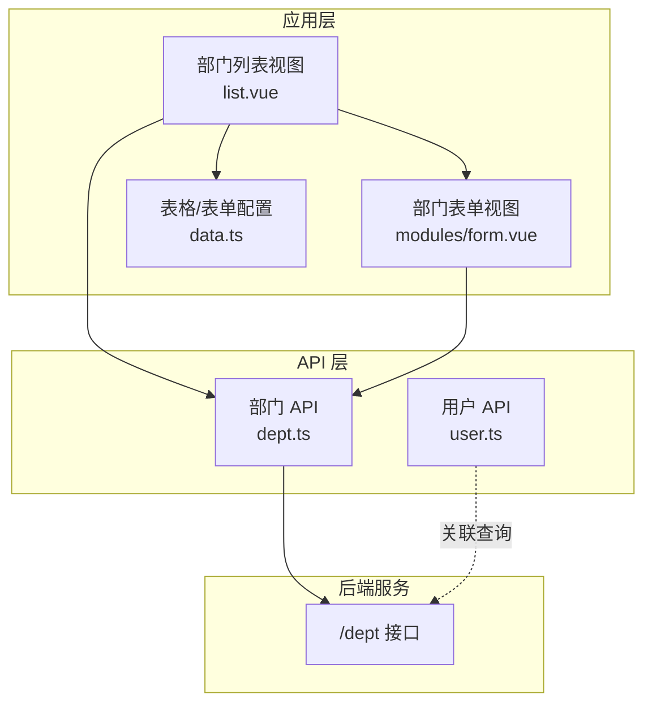
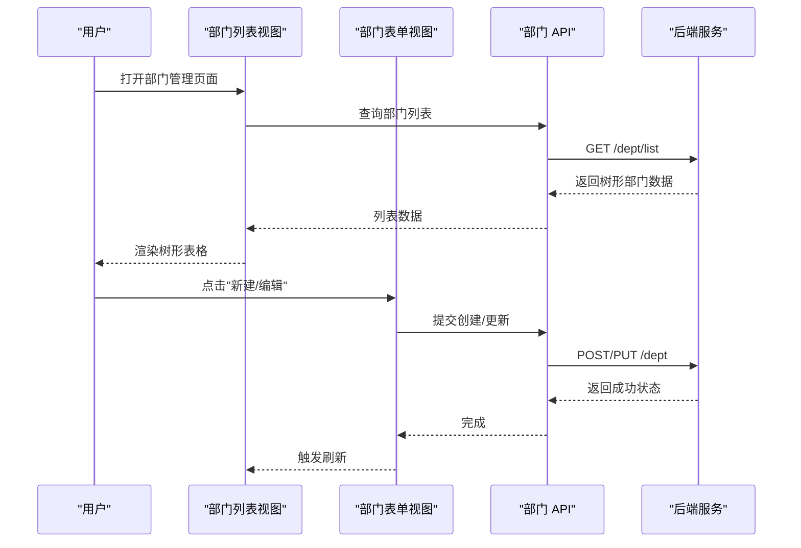
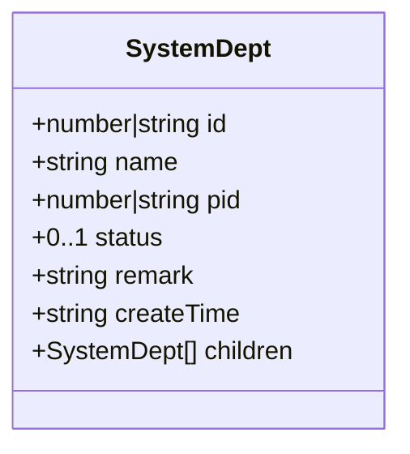
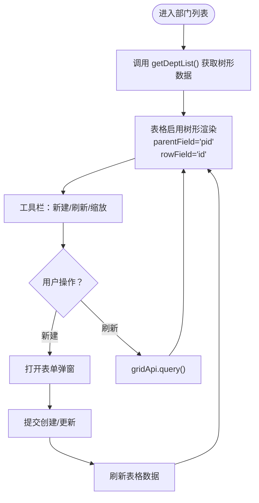
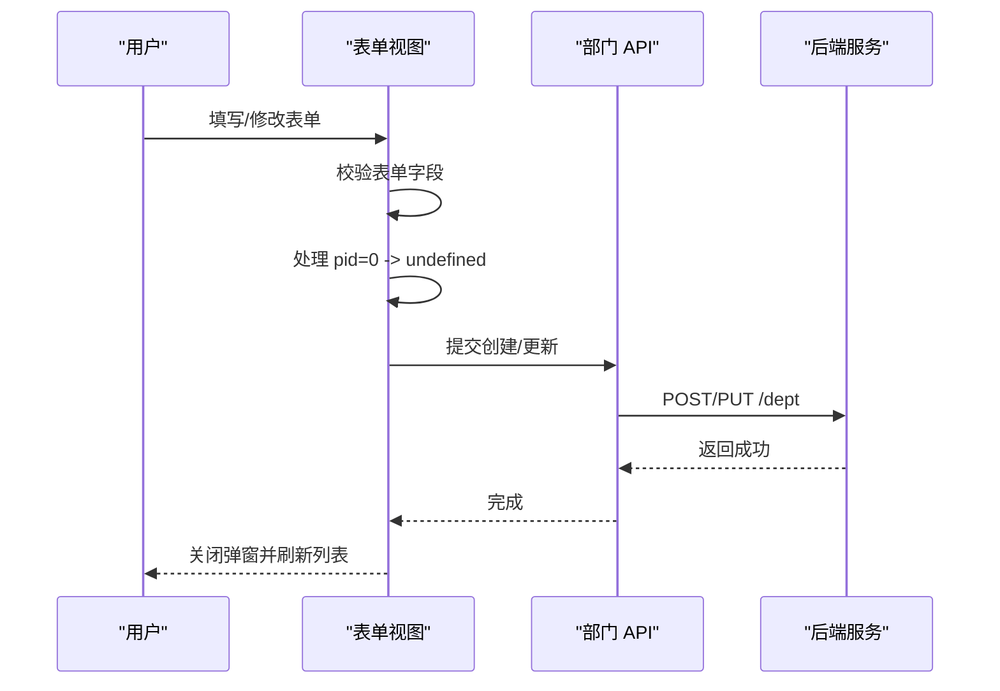
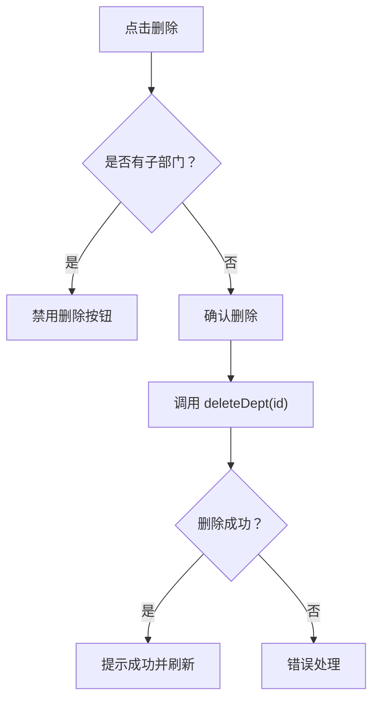
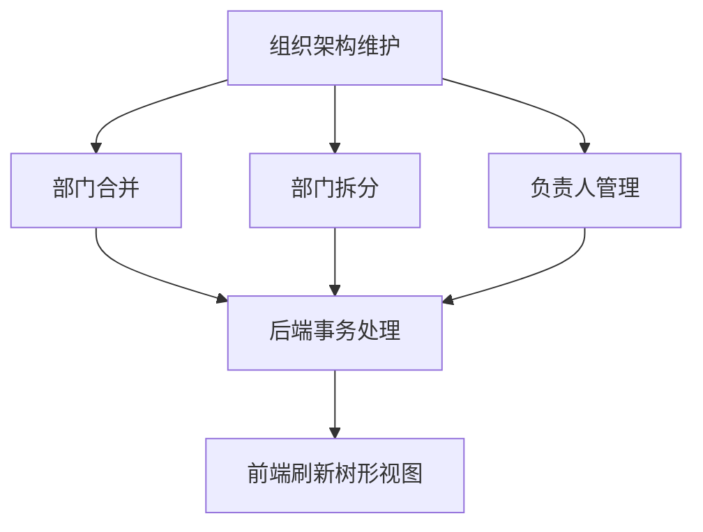
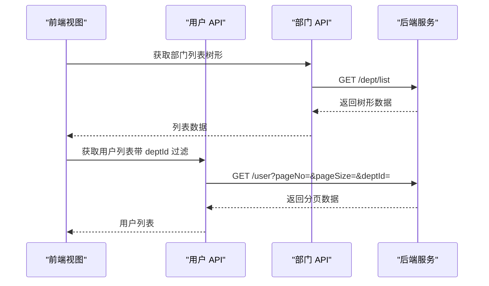
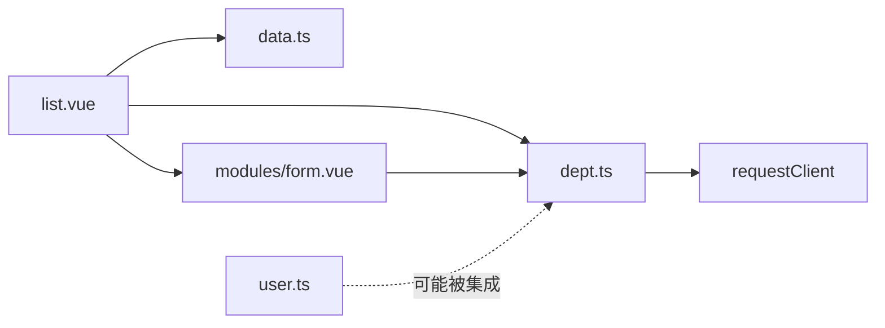

# 部门管理 API

<cite>
**本文引用的文件**
- [apps/web-naive/src/api/system/dept.ts](file://apps/web-naive/src/api/system/dept.ts)
- [apps/web-naive/src/views/system/dept/list.vue](file://apps/web-naive/src/views/system/dept/list.vue)
- [apps/web-naive/src/views/system/dept/modules/form.vue](file://apps/web-naive/src/views/system/dept/modules/form.vue)
- [apps/web-naive/src/views/system/dept/data.ts](file://apps/web-naive/src/views/system/dept/data.ts)
- [apps/web-naive/src/api/system/user.ts](file://apps/web-naive/src/api/system/user.ts)
- [playground/src/api/system/dept.ts](file://playground/src/api/system/dept.ts)
- [playground/src/views/system/dept/list.vue](file://playground/src/views/system/dept/list.vue)
- [playground/src/views/system/dept/modules/form.vue](file://playground/src/views/system/dept/modules/form.vue)
- [playground/src/views/system/dept/data.ts](file://playground/src/views/system/dept/data.ts)
</cite>

## 更新摘要

**所做更改**

- 新增部门树形结构获取与树形渲染的详细说明
- 完善部门层级管理功能的实现细节，包括父子关系维护
- 补充部门与用户关联管理的具体接口设计
- 更新数据模型说明，明确数字与字符串 ID 的差异
- 增强权限控制与数据隔离的实践建议

## 目录

1. [简介](#简介)
2. [项目结构](#项目结构)
3. [核心组件](#核心组件)
4. [架构总览](#架构总览)
5. [详细组件分析](#详细组件分析)
6. [依赖关系分析](#依赖关系分析)
7. [性能考量](#性能考量)
8. [故障排查指南](#故障排查指南)
9. [结论](#结论)
10. [附录](#附录)

## 简介

本文件为"部门管理 API"的权威技术文档，覆盖部门列表查询、树形结构获取、部门详情、创建、更新、删除等基础能力，并重点说明部门层级结构管理（组织架构维护、部门合并拆分、部门负责人管理）的接口设计思路与实现要点。同时，结合前端视图层对部门数据模型的使用，给出字段定义、表单校验、表格渲染与交互流程的完整说明；并提供部门与用户关联的管理接口说明（如部门人员统计、部门迁移等常见业务场景），以及权限控制与数据隔离的相关建议。

## 项目结构

部门管理功能由"API 层 + 视图层 + 表单与表格配置"三部分组成：

- API 层：封装对后端"/dept"接口的调用，统一暴露列表、创建、更新、删除等方法。
- 视图层：负责页面布局、表格展示、弹窗表单、操作按钮与交互逻辑。
- 配置层：定义表格列、表单字段与校验规则，支持国际化与动态刷新。

**图表来源**

- [apps/web-naive/src/views/system/dept/list.vue:91-119](file://apps/web-naive/src/views/system/dept/list.vue#L91-L119)
- [apps/web-naive/src/views/system/dept/modules/form.vue:25-34](file://apps/web-naive/src/views/system/dept/modules/form.vue#L25-L34)
- [apps/web-naive/src/views/system/dept/data.ts:75-133](file://apps/web-naive/src/views/system/dept/data.ts#L75-L133)
- [apps/web-naive/src/api/system/dept.ts:19-61](file://apps/web-naive/src/api/system/dept.ts#L19-L61)
- [apps/web-naive/src/api/system/user.ts:33-50](file://apps/web-naive/src/api/system/user.ts#L33-L50)

**章节来源**

- [apps/web-naive/src/views/system/dept/list.vue:1-141](file://apps/web-naive/src/views/system/dept/list.vue#L1-L141)
- [apps/web-naive/src/views/system/dept/modules/form.vue:1-94](file://apps/web-naive/src/views/system/dept/modules/form.vue#L1-L94)
- [apps/web-naive/src/views/system/dept/data.ts:1-134](file://apps/web-naive/src/views/system/dept/data.ts#L1-L134)
- [apps/web-naive/src/api/system/dept.ts:1-64](file://apps/web-naive/src/api/system/dept.ts#L1-L64)

## 核心组件

- 部门 API 模块：提供部门 CRUD 与列表查询能力，支持两种数据模型（数字 id 与字符串 id），用于不同运行环境或演示场景。
- 部门列表视图：基于表格组件展示部门树，支持增删改、刷新、树形渲染与工具栏操作。
- 部门表单视图：封装创建/编辑弹窗，内置表单校验与提交流程。
- 表格与表单配置：集中定义列与字段、校验规则、树选择器数据源等。

**章节来源**

- [apps/web-naive/src/api/system/dept.ts:19-61](file://apps/web-naive/src/api/system/dept.ts#L19-L61)
- [apps/web-naive/src/views/system/dept/list.vue:91-119](file://apps/web-naive/src/views/system/dept/list.vue#L91-L119)
- [apps/web-naive/src/views/system/dept/modules/form.vue:25-34](file://apps/web-naive/src/views/system/dept/modules/form.vue#L25-L34)
- [apps/web-naive/src/views/system/dept/data.ts:14-69](file://apps/web-naive/src/views/system/dept/data.ts#L14-L69)

## 架构总览

部门管理的前后端交互采用标准 REST 风格，前端通过统一请求客户端发起 GET/POST/PUT/DELETE 请求到后端"/dept"资源，后端返回标准树形结构数据，前端以表格树渲染与弹窗表单完成管理操作。

**图表来源**

- [apps/web-naive/src/views/system/dept/list.vue:100-107](file://apps/web-naive/src/views/system/dept/list.vue#L100-L107)
- [apps/web-naive/src/views/system/dept/modules/form.vue:37-51](file://apps/web-naive/src/views/system/dept/modules/form.vue#L37-L51)
- [apps/web-naive/src/api/system/dept.ts:19-61](file://apps/web-naive/src/api/system/dept.ts#L19-L61)

## 详细组件分析

### 数据模型与字段定义

部门实体在不同运行环境下采用不同的主键类型，但字段结构保持一致，便于跨环境复用与迁移。

- 数字 id 版本（web-naive 示例）
  - 字段概览：id（数字）、name（名称）、pid（父部门 id，可选）、status（状态 0/1）、remark（备注，可选）、createTime（创建时间，可选）、children（子部门，可选）。
  - 适用场景：生产环境或需要强类型约束的系统。
- 字符串 id 版本（playground 示例）
  - 字段概览：id（字符串）、name、status、remark、children。
  - 适用场景：演示环境或后端返回字符串 id 的系统。

**图表来源**

- [apps/web-naive/src/api/system/dept.ts:4-13](file://apps/web-naive/src/api/system/dept.ts#L4-L13)
- [playground/src/api/system/dept.ts:4-11](file://playground/src/api/system/dept.ts#L4-L11)

**章节来源**

- [apps/web-naive/src/api/system/dept.ts:4-13](file://apps/web-naive/src/api/system/dept.ts#L4-L13)
- [playground/src/api/system/dept.ts:4-11](file://playground/src/api/system/dept.ts#L4-L11)

### 部门列表查询与树形渲染

- 列表查询：统一通过"/dept/list"接口获取树形数据，前端以表格树模式渲染。
- 树形配置：指定父字段与行字段，关闭自动转换，确保后端返回的数据结构直接可用。
- 工具栏与刷新：支持刷新、缩放等常用工具，点击"新建"打开表单弹窗。

**图表来源**

- [apps/web-naive/src/views/system/dept/list.vue:91-119](file://apps/web-naive/src/views/system/dept/list.vue#L91-L119)
- [apps/web-naive/src/api/system/dept.ts:19-21](file://apps/web-naive/src/api/system/dept.ts#L19-L21)

**章节来源**

- [apps/web-naive/src/views/system/dept/list.vue:91-119](file://apps/web-naive/src/views/system/dept/list.vue#L91-L119)
- [apps/web-naive/src/views/system/dept/data.ts:75-133](file://apps/web-naive/src/views/system/dept/data.ts#L75-L133)

### 部门详情与表单交互

- 表单字段：名称、上级部门（树选择器）、状态（单选）、备注（文本域）。
- 校验规则：名称长度限制、备注长度限制、必填项校验。
- 提交逻辑：处理 pid 为 0 或空值的情况，提交时统一转换为 undefined，避免无效父节点。
- 成功回调：关闭弹窗并触发表格刷新。

**图表来源**

- [apps/web-naive/src/views/system/dept/modules/form.vue:37-51](file://apps/web-naive/src/views/system/dept/modules/form.vue#L37-L51)
- [apps/web-naive/src/views/system/dept/data.ts:14-69](file://apps/web-naive/src/views/system/dept/data.ts#L14-L69)
- [apps/web-naive/src/api/system/dept.ts:36-52](file://apps/web-naive/src/api/system/dept.ts#L36-L52)

**章节来源**

- [apps/web-naive/src/views/system/dept/modules/form.vue:25-79](file://apps/web-naive/src/views/system/dept/modules/form.vue#L25-L79)
- [apps/web-naive/src/views/system/dept/data.ts:14-69](file://apps/web-naive/src/views/system/dept/data.ts#L14-L69)

### 部门删除与安全控制

- 删除入口：表格操作列中的"删除"按钮，禁用条件为该部门存在子部门。
- 删除流程：弹出加载提示，调用删除接口，成功后提示并刷新列表。
- 安全控制：前端禁用非空部门的删除；后端应配合"禁止删除有子部门的节点"策略，防止破坏树形结构。

**图表来源**

- [apps/web-naive/src/views/system/dept/list.vue:119-123](file://apps/web-naive/src/views/system/dept/list.vue#L119-L123)
- [apps/web-naive/src/api/system/dept.ts:59-61](file://apps/web-naive/src/api/system/dept.ts#L59-L61)

**章节来源**

- [apps/web-naive/src/views/system/dept/list.vue:52-69](file://apps/web-naive/src/views/system/dept/list.vue#L52-L69)
- [apps/web-naive/src/views/system/dept/data.ts:119-123](file://apps/web-naive/src/views/system/dept/data.ts#L119-L123)

### 部门层级结构管理（组织架构维护）

- 组织架构维护：通过"上级部门"字段实现父子关系，支持无限层级树形结构。
- 部门合并/拆分：建议通过后端事务保证原子性，前端仅负责传递目标父节点与受影响节点集合。
- 部门负责人管理：当前 API 未暴露负责人字段，可在后端扩展"leaderId"等字段并在前端表单中增加相应字段与校验。

**图表来源**

- [apps/web-naive/src/views/system/dept/data.ts:28-40](file://apps/web-naive/src/views/system/dept/data.ts#L28-L40)
- [apps/web-naive/src/api/system/dept.ts:4-13](file://apps/web-naive/src/api/system/dept.ts#L4-L13)

**章节来源**

- [apps/web-naive/src/views/system/dept/data.ts:28-40](file://apps/web-naive/src/views/system/dept/data.ts#L28-L40)
- [apps/web-naive/src/api/system/dept.ts:4-13](file://apps/web-naive/src/api/system/dept.ts#L4-L13)

### 部门与用户关联的管理接口

- 部门人员统计：建议后端提供"GET /dept/{id}/stats"接口，返回部门人数、在职人数等指标。
- 部门迁移：建议后端提供"PUT /user/batch-move"接口，批量将用户从旧部门迁移到新部门。
- 用户列表按部门筛选：后端提供"GET /user"时支持 deptId 过滤参数，前端在表格查询时传入。

**图表来源**

- [apps/web-naive/src/api/system/user.ts:33-50](file://apps/web-naive/src/api/system/user.ts#L33-L50)
- [apps/web-naive/src/api/system/dept.ts:19-21](file://apps/web-naive/src/api/system/dept.ts#L19-L21)

**章节来源**

- [apps/web-naive/src/api/system/user.ts:33-50](file://apps/web-naive/src/api/system/user.ts#L33-L50)

### 权限控制与数据隔离

- 权限控制：建议在后端对部门 CRUD 操作进行细粒度权限校验，结合角色与部门范围控制访问。
- 数据隔离：后端应根据用户所属部门或角色，限制其可操作的部门范围，避免越权访问或误操作。
- 建议接口：登录态校验、部门范围查询、操作审计日志等。

## 依赖关系分析

- 视图层依赖配置层与 API 层，形成清晰的职责分离。
- API 层依赖统一请求客户端，屏蔽网络细节。
- 表格与表单配置集中管理，便于国际化与维护。

**图表来源**

- [apps/web-naive/src/views/system/dept/list.vue:15-19](file://apps/web-naive/src/views/system/dept/list.vue#L15-L19)
- [apps/web-naive/src/views/system/dept/modules/form.vue:10-11](file://apps/web-naive/src/views/system/dept/modules/form.vue#L10-L11)
- [apps/web-naive/src/api/system/dept.ts:1-1](file://apps/web-naive/src/api/system/dept.ts#L1-L1)
- [apps/web-naive/src/api/system/user.ts](file://apps/web-naive/src/api/system/user.ts#L3)

**章节来源**

- [apps/web-naive/src/views/system/dept/list.vue:1-141](file://apps/web-naive/src/views/system/dept/list.vue#L1-L141)
- [apps/web-naive/src/views/system/dept/modules/form.vue:1-94](file://apps/web-naive/src/views/system/dept/modules/form.vue#L1-L94)
- [apps/web-naive/src/views/system/dept/data.ts:1-134](file://apps/web-naive/src/views/system/dept/data.ts#L1-L134)
- [apps/web-naive/src/api/system/dept.ts:1-64](file://apps/web-naive/src/api/system/dept.ts#L1-L64)
- [apps/web-naive/src/api/system/user.ts:1-99](file://apps/web-naive/src/api/system/user.ts#L1-L99)

## 性能考量

- 列表查询：优先使用树形一次性拉取，减少多次请求；必要时开启本地缓存与懒加载。
- 表单提交：对大字段（如备注）进行防抖与节流，避免频繁校验。
- 删除操作：在前端禁用非空部门删除，减少无效请求与后端压力。
- 国际化：列标题与文案通过配置动态生成，避免重复渲染。

## 故障排查指南

- 删除按钮不可用：检查是否存在子部门，若存在则无法删除。
- 表单提交失败：检查必填字段与长度限制，确认 pid 是否被正确转换为 undefined。
- 列表不显示树形：检查 parentField 与 rowField 是否与后端返回字段一致。
- 用户与部门关联异常：确认后端是否支持 deptId 过滤与批量迁移接口。

**章节来源**

- [apps/web-naive/src/views/system/dept/list.vue:119-123](file://apps/web-naive/src/views/system/dept/list.vue#L119-L123)
- [apps/web-naive/src/views/system/dept/modules/form.vue:44-47](file://apps/web-naive/src/views/system/dept/modules/form.vue#L44-L47)
- [apps/web-naive/src/views/system/dept/data.ts:119-123](file://apps/web-naive/src/views/system/dept/data.ts#L119-L123)

## 结论

本文档系统梳理了部门管理 API 的数据模型、接口能力与前端实现，明确了树形结构维护、表单交互、删除安全控制与与用户关联的扩展方向。建议在后端完善负责人管理、统计与迁移等接口，并加强权限控制与数据隔离，以满足复杂组织架构场景下的管理需求。

## 附录

### API 定义与示例路径

- 获取部门列表
  - 方法与路径：GET /dept/list
  - 返回：树形部门数组
  - 示例路径：[apps/web-naive/src/api/system/dept.ts:19-21](file://apps/web-naive/src/api/system/dept.ts#L19-L21)
- 创建部门
  - 方法与路径：POST /dept
  - 请求体：除 children、createTime、id 外的部门字段
  - 示例路径：[apps/web-naive/src/api/system/dept.ts:36-40](file://apps/web-naive/src/api/system/dept.ts#L36-L40)
- 更新部门
  - 方法与路径：PUT /dept/{id}
  - 请求体：除 children、createTime、id 外的部门字段
  - 示例路径：[apps/web-naive/src/api/system/dept.ts:48-53](file://apps/web-naive/src/api/system/dept.ts#L48-L53)
- 删除部门
  - 方法与路径：DELETE /dept/{id}
  - 示例路径：[apps/web-naive/src/api/system/dept.ts:59-61](file://apps/web-naive/src/api/system/dept.ts#L59-L61)

**章节来源**

- [apps/web-naive/src/api/system/dept.ts:19-61](file://apps/web-naive/src/api/system/dept.ts#L19-L61)
