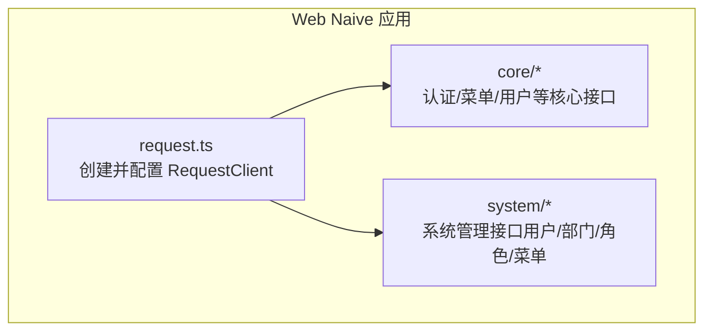
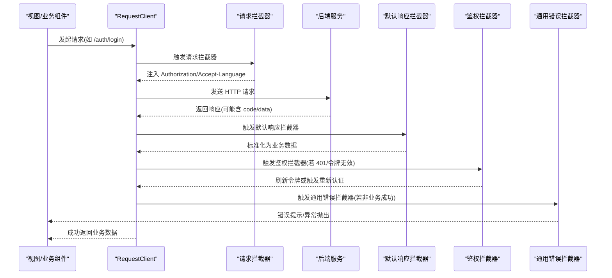
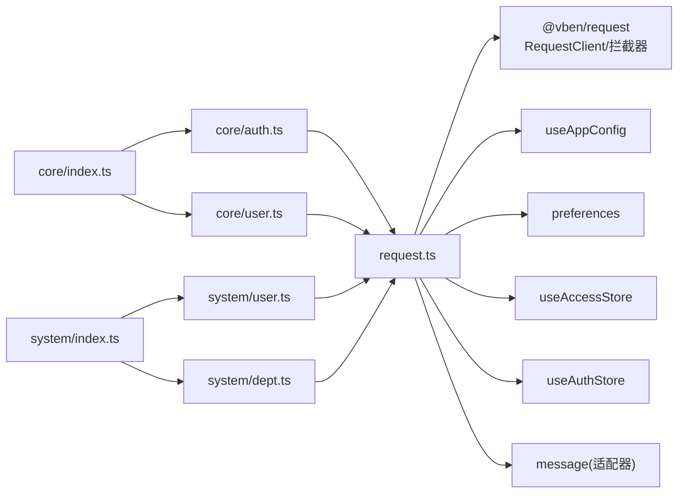

# API 通信层

<cite>
**本文引用的文件**
- [apps/web-naive/src/api/request.ts](file://apps/web-naive/src/api/request.ts)
- [apps/web-naive/src/api/index.ts](file://apps/web-naive/src/api/index.ts)
- [apps/web-naive/src/api/core/index.ts](file://apps/web-naive/src/api/core/index.ts)
- [apps/web-naive/src/api/system/index.ts](file://apps/web-naive/src/api/system/index.ts)
- [apps/web-naive/src/api/core/auth.ts](file://apps/web-naive/src/api/core/auth.ts)
- [apps/web-naive/src/api/core/user.ts](file://apps/web-naive/src/api/core/user.ts)
- [apps/web-naive/src/api/system/user.ts](file://apps/web-naive/src/api/system/user.ts)
- [apps/web-naive/src/api/system/dept.ts](file://apps/web-naive/src/api/system/dept.ts)
- [playground/src/api/request.ts](file://playground/src/api/request.ts)
</cite>

## 目录

1. [简介](#简介)
2. [项目结构](#项目结构)
3. [核心组件](#核心组件)
4. [架构总览](#架构总览)
5. [详细组件分析](#详细组件分析)
6. [依赖关系分析](#依赖关系分析)
7. [性能考量](#性能考量)
8. [故障排查指南](#故障排查指南)
9. [结论](#结论)
10. [附录](#附录)

## 简介

本文件系统性梳理 shiyu-ui 项目的 API 通信层设计与实现，重点覆盖：

- axios 封装与配置：基于 @vben/request 的 RequestClient，统一请求/响应拦截器、错误处理与 Token 管理。
- 请求与响应拦截器：请求头注入 Authorization 与 Accept-Language；响应数据标准化；鉴权失败自动刷新与重新认证。
- API 组织方式：按领域模块拆分（core/system），通过 index.ts 汇总导出，便于按需引入。
- 错误处理与重试：网络错误、业务错误、鉴权错误的处理策略与交互行为。
- 使用示例与最佳实践：如何调用接口、如何处理分页与数据格式差异。
- 测试与调试方法：拦截器调试、Mock 场景、消息提示与登录态失效处理。

## 项目结构

API 通信层位于应用层的 src/api 目录，采用“按域分包 + 统一请求客户端”的组织方式：

- request.ts：创建并配置请求客户端，注册拦截器与错误处理。
- core/ 与 system/：按功能域划分 API 模块，每个模块以 index.ts 汇总导出。
- 具体接口文件：如 auth.ts、user.ts、dept.ts 等，定义具体业务接口与数据模型。

图表来源

- [apps/web-naive/src/api/request.ts:1-114](file://apps/web-naive/src/api/request.ts#L1-L114)
- [apps/web-naive/src/api/core/index.ts:1-4](file://apps/web-naive/src/api/core/index.ts#L1-L4)
- [apps/web-naive/src/api/system/index.ts:1-5](file://apps/web-naive/src/api/system/index.ts#L1-L5)

章节来源

- [apps/web-naive/src/api/request.ts:1-114](file://apps/web-naive/src/api/request.ts#L1-L114)
- [apps/web-naive/src/api/index.ts:1-2](file://apps/web-naive/src/api/index.ts#L1-L2)
- [apps/web-naive/src/api/core/index.ts:1-4](file://apps/web-naive/src/api/core/index.ts#L1-L4)
- [apps/web-naive/src/api/system/index.ts:1-5](file://apps/web-naive/src/api/system/index.ts#L1-L5)

## 核心组件

- RequestClient：封装 axios，提供 addRequestInterceptor/addResponseInterceptor 注册拦截器，支持 baseURL、响应数据转换等配置。
- 请求拦截器：统一注入 Authorization 与 Accept-Language；支持动态获取访问令牌。
- 响应拦截器：
  - 默认响应拦截器：将后端返回的 code/data 结构标准化为业务数据。
  - 鉴权拦截器：处理 401/令牌过期，支持刷新令牌与重新认证。
  - 通用错误拦截器：兜底错误提示，从响应体提取错误信息或回退到状态码提示。
- 基础客户端 baseRequestClient：用于需要绕过默认拦截器或特殊场景（如刷新令牌、登出）。

章节来源

- [apps/web-naive/src/api/request.ts:23-107](file://apps/web-naive/src/api/request.ts#L23-L107)
- [apps/web-naive/src/api/request.ts:62-104](file://apps/web-naive/src/api/request.ts#L62-L104)

## 架构总览

下图展示请求从发起到响应处理的关键流程，以及拦截器的执行顺序与职责边界。

图表来源

- [apps/web-naive/src/api/request.ts:62-104](file://apps/web-naive/src/api/request.ts#L62-L104)

## 详细组件分析

### 请求客户端与拦截器配置

- 客户端创建：传入 baseURL，并启用 responseReturn 为 data，使调用方直接获得 data 字段内容。
- 请求头设置：在请求拦截器中从访问态中读取 accessToken 并拼接 Bearer，同时注入 Accept-Language。
- 响应数据标准化：默认响应拦截器将 { code, data } 转换为 data，successCode=200。
- 鉴权拦截器：当响应表示鉴权失败时，触发 doRefreshToken 或 doReAuthenticate，支持开启/关闭刷新令牌。
- 通用错误拦截器：兜底错误提示，优先从响应体提取 error/message 字段，否则回退到状态码提示。

章节来源

- [apps/web-naive/src/api/request.ts:23-107](file://apps/web-naive/src/api/request.ts#L23-L107)

### 认证相关接口（core/auth）

- 登录：POST /auth/login，返回 accessToken。
- 刷新令牌：POST /auth/refresh，使用 baseRequestClient 并携带凭据。
- 退出登录：POST /auth/logout，使用 baseRequestClient 并携带凭据。
- 获取权限码：GET /auth/codes，返回字符串数组。

章节来源

- [apps/web-naive/src/api/core/auth.ts:1-52](file://apps/web-naive/src/api/core/auth.ts#L1-L52)

### 用户相关接口（core/user 与 system/user）

- 获取当前用户信息：GET /user/info。
- 系统用户管理：
  - 列表查询：GET /user，支持分页参数 pageNo/pageSize，内部兼容后端返回 records/total 或数组。
  - 创建/更新/删除：POST /user、PUT /user/:id、DELETE /user/:id。
  - 重置密码：PUT /user/:id/password。

章节来源

- [apps/web-naive/src/api/core/user.ts:1-11](file://apps/web-naive/src/api/core/user.ts#L1-L11)
- [apps/web-naive/src/api/system/user.ts:1-99](file://apps/web-naive/src/api/system/user.ts#L1-L99)

### 部门相关接口（system/dept）

- 列表查询：GET /dept/list，支持两种返回形态：树形数组或包装为 items/total。
- 创建/更新/删除：POST /dept、PUT /dept/:id、DELETE /dept/:id。

章节来源

- [apps/web-naive/src/api/system/dept.ts:1-64](file://apps/web-naive/src/api/system/dept.ts#L1-L64)

### API 组织与导出

- core/index.ts 与 system/index.ts 将各模块接口集中导出，便于上层按需导入。
- apps/web-naive/src/api/index.ts 导出 core 下所有接口，形成统一入口。

章节来源

- [apps/web-naive/src/api/core/index.ts:1-4](file://apps/web-naive/src/api/core/index.ts#L1-L4)
- [apps/web-naive/src/api/system/index.ts:1-5](file://apps/web-naive/src/api/system/index.ts#L1-L5)
- [apps/web-naive/src/api/index.ts:1-2](file://apps/web-naive/src/api/index.ts#L1-L2)

### 错误处理与重试策略

- 网络错误：由通用错误拦截器兜底，优先显示后端返回的错误信息，否则依据状态码提示。
- 业务错误：默认响应拦截器以 successCode=200 作为成功判断，非 200 触发错误拦截器。
- 鉴权错误：鉴权拦截器在检测到令牌无效时，尝试刷新令牌；若仍失败则触发重新认证（清空令牌、弹窗或跳转登出）。
- 重试策略：当前实现未内置自动重试，建议在调用侧根据场景对关键请求做幂等重试或手动重试。

章节来源

- [apps/web-naive/src/api/request.ts:74-104](file://apps/web-naive/src/api/request.ts#L74-L104)

### 数据格式化与兼容

- 默认响应拦截器将 { code, data } 标准化为 data。
- 鉴权拦截器与通用错误拦截器均从 error.response?.data 中提取错误信息，增强提示友好度。

章节来源

- [apps/web-naive/src/api/request.ts:74-104](file://apps/web-naive/src/api/request.ts#L74-L104)

### Playground 特殊配置说明

- playground/src/api/request.ts 在 Web Naive 的基础上增加了 transformResponse，针对 application/json 且字符串响应体使用 JSONBigInt 解析，将 BigInt 存储为字符串，避免序列化丢失精度。
- 其他拦截器与行为与 Web Naive 一致。

章节来源

- [playground/src/api/request.ts:26-42](file://playground/src/api/request.ts#L26-L42)
- [playground/src/api/request.ts:77-120](file://playground/src/api/request.ts#L77-L120)

## 依赖关系分析

- request.ts 依赖 @vben/request 的 RequestClient 与拦截器工厂函数，依赖应用配置 useAppConfig、偏好设置 preferences、访问态 useAccessStore、鉴权态 useAuthStore，以及 UI 消息组件 message。
- 各业务模块仅依赖 request.ts 暴露的 requestClient/baseRequestClient，保持低耦合与高内聚。
- core/system 的 index.ts 作为聚合导出，避免上层直接依赖具体文件路径。

图表来源

- [apps/web-naive/src/api/request.ts:1-18](file://apps/web-naive/src/api/request.ts#L1-L18)
- [apps/web-naive/src/api/core/auth.ts:1](file://apps/web-naive/src/api/core/auth.ts#L1)
- [apps/web-naive/src/api/core/user.ts:1](file://apps/web-naive/src/api/core/user.ts#L1)
- [apps/web-naive/src/api/system/user.ts:1](file://apps/web-naive/src/api/system/user.ts#L1)
- [apps/web-naive/src/api/system/dept.ts:1](file://apps/web-naive/src/api/system/dept.ts#L1)
- [apps/web-naive/src/api/core/index.ts:1-4](file://apps/web-naive/src/api/core/index.ts#L1-L4)
- [apps/web-naive/src/api/system/index.ts:1-5](file://apps/web-naive/src/api/system/index.ts#L1-L5)

## 性能考量

- 请求头注入与拦截器链路开销极小，主要成本在网络往返。
- 建议：
  - 对高频接口启用缓存（如分页列表）与去抖/节流。
  - 合理设置 baseURL 与超时时间，避免全局阻塞。
  - 对大对象传输优先考虑压缩或分页加载。

## 故障排查指南

- 无法登录或频繁掉线
  - 检查鉴权拦截器是否正确触发刷新令牌与重新认证。
  - 确认 Access-Token 是否被正确注入到 Authorization。
- 错误提示不准确
  - 确认后端返回的错误字段为 error 或 message，通用错误拦截器会优先读取这些字段。
- 分页数据不一致
  - system/user.ts 内部对后端返回的 records/total 与数组做了兼容处理，确认后端是否遵循约定。
- BigInt 精度问题（Playground）
  - 若出现大整数精度丢失，确认 transformResponse 已生效，必要时检查 Content-Type 与响应体类型。

章节来源

- [apps/web-naive/src/api/request.ts:62-104](file://apps/web-naive/src/api/request.ts#L62-L104)
- [apps/web-naive/src/api/system/user.ts:33-50](file://apps/web-naive/src/api/system/user.ts#L33-L50)
- [playground/src/api/request.ts:26-42](file://playground/src/api/request.ts#L26-L42)

## 结论

本通信层通过统一的 RequestClient 与拦截器体系，实现了请求头标准化、响应数据规范化、鉴权失败自动处理与错误兜底提示。模块化的 API 设计提升了可维护性与可测试性。建议在调用侧结合业务场景补充幂等重试与缓存策略，并在开发与测试阶段充分利用拦截器日志与 Mock 能力快速定位问题。

## 附录

### API 调用示例与最佳实践

- 登录
  - 调用方式：调用登录接口，接收 accessToken 并保存至访问态。
  - 参考路径：[apps/web-naive/src/api/core/auth.ts:24-26](file://apps/web-naive/src/api/core/auth.ts#L24-L26)
- 获取用户信息
  - 调用方式：使用 requestClient.get('/user/info')。
  - 参考路径：[apps/web-naive/src/api/core/user.ts:8-10](file://apps/web-naive/src/api/core/user.ts#L8-L10)
- 查询系统用户列表（分页）
  - 调用方式：传入 page/pageSize 参数，内部自动映射为 pageNo/pageSize；兼容 records/total 与数组返回。
  - 参考路径：[apps/web-naive/src/api/system/user.ts:33-50](file://apps/web-naive/src/api/system/user.ts#L33-L50)
- 创建/更新/删除用户
  - 调用方式：分别调用对应接口，注意 omit createTime/id 等只读字段。
  - 参考路径：[apps/web-naive/src/api/system/user.ts:56-81](file://apps/web-naive/src/api/system/user.ts#L56-L81)
- 刷新与登出
  - 调用方式：刷新令牌使用 baseRequestClient，登出同样使用 baseRequestClient 并携带凭据。
  - 参考路径：[apps/web-naive/src/api/core/auth.ts:31-44](file://apps/web-naive/src/api/core/auth.ts#L31-L44)

### 接口文档生成与维护

- 建议在各模块文件顶部添加简要注释，说明接口用途、参数与返回结构。
- 使用统一的命名空间（如 SystemUserApi）定义请求/响应类型，便于 IDE 提示与 TS 类型校验。
- 对于复杂接口（如分页），在注释中明确后端返回格式与兼容策略。

### 测试与调试方法

- 开启浏览器网络面板，观察请求头 Authorization 与 Accept-Language 是否正确注入。
- 在鉴权拦截器处设置断点，验证 doRefreshToken/doReAuthenticate 是否按预期触发。
- 使用 Mock 接口模拟不同错误码与错误字段（error/message），验证通用错误拦截器提示逻辑。
- Playground 环境可利用 transformResponse 对 BigInt 场景进行回归测试。
