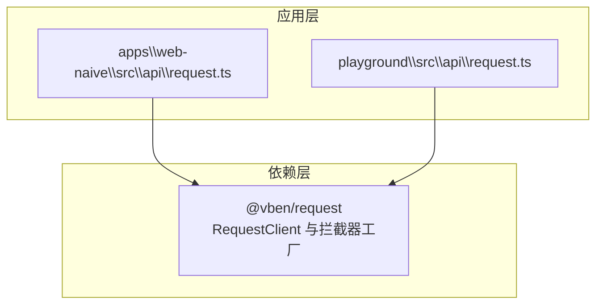
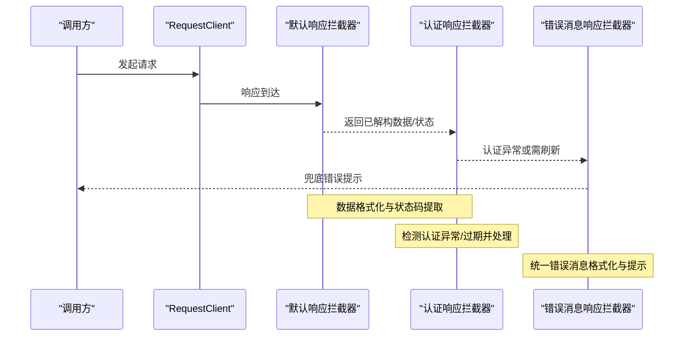
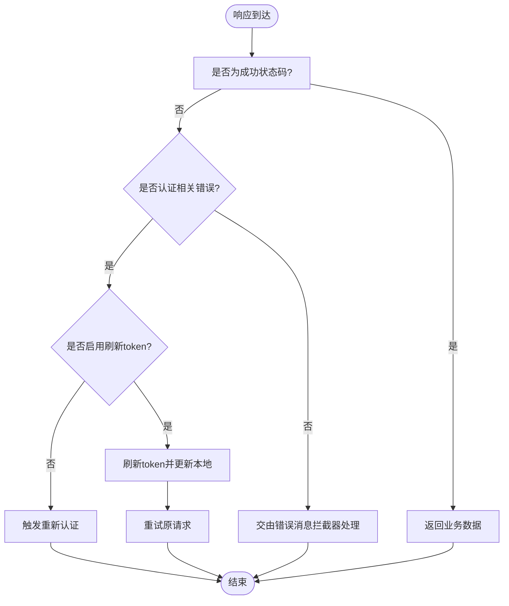
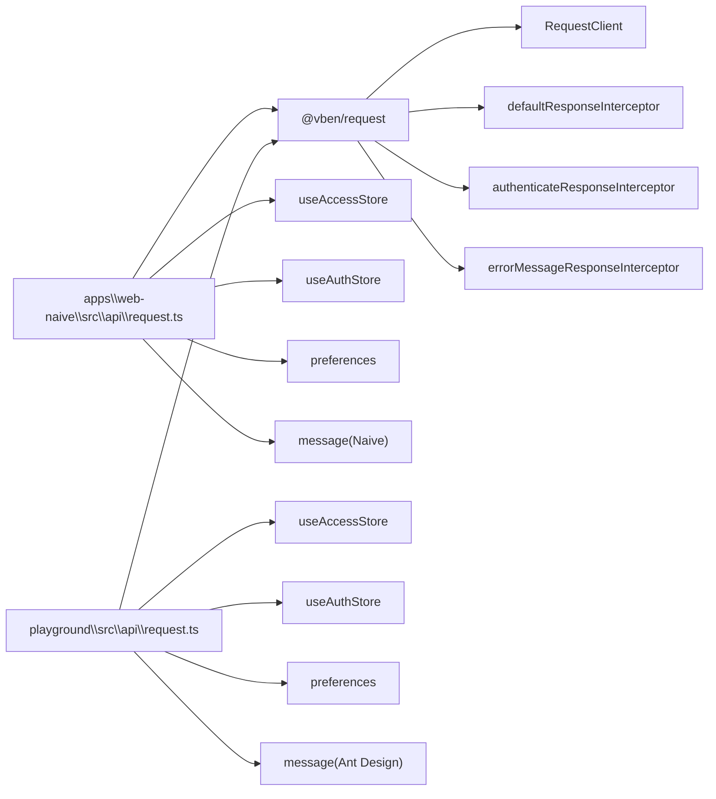

# 响应拦截器

<cite>
**本文引用的文件**
- [apps\web-naive\src\api\request.ts](file://apps\web-naive\src\api\request.ts)
- [playground\src\api\request.ts](file://playground\src\api\request.ts)
- [apps\web-naive\package.json](file://apps\web-naive\package.json)
- [playground\package.json](file://playground\package.json)
- [playground\src\api\examples\download.ts](file://playground\src\api\examples\download.ts)
</cite>

## 目录

1. [简介](#简介)
2. [项目结构](#项目结构)
3. [核心组件](#核心组件)
4. [架构总览](#架构总览)
5. [组件详解](#组件详解)
6. [依赖分析](#依赖分析)
7. [性能考量](#性能考量)
8. [故障排查指南](#故障排查指南)
9. [结论](#结论)
10. [附录](#附录)

## 简介

本章节面向 shiyu-ui 项目中的“响应拦截器”主题，系统性梳理默认响应拦截器、认证响应拦截器与错误消息响应拦截器的设计与实现要点。重点覆盖：

- 数据格式化：统一提取后端返回的数据主体与状态码
- 认证状态检查：token 过期检测、刷新与重新认证流程
- 错误处理：兜底错误消息格式化与提示策略
- 配置参数：成功状态码、数据字段映射、消息格式化回调
- 使用示例与自定义扩展指南

## 项目结构

响应拦截器位于应用层的请求客户端配置中，分别在两个环境（web-naive 与 playground）内复用同一套拦截器组合，并通过 @vben/request 提供的拦截器工厂函数接入。

图表来源

- [apps\web-naive\src\api\request.ts:1-114](file://apps\web-naive\src\api\request.ts#L1-L114)
- [playground\src\api\request.ts:1-135](file://playground\src\api\request.ts#L1-L135)

章节来源

- [apps\web-naive\src\api\request.ts:1-114](file://apps\web-naive\src\api\request.ts#L1-L114)
- [playground\src\api\request.ts:1-135](file://playground\src\api\request.ts#L1-L135)

## 核心组件

本项目在请求客户端中注册了三类响应拦截器，按顺序执行，形成“数据解构 → 认证校验 → 错误兜底”的处理链路：

- 默认响应拦截器
  - 职责：从响应体中提取业务数据主体与状态码，统一转换为前端可消费的结构
  - 关键配置：业务状态码字段名、数据主体字段名、成功状态码值
  - 应用场景：所有遵循统一返回结构的接口

- 认证响应拦截器
  - 职责：识别认证失败或 token 过期等异常状态，触发刷新 token 或重新认证流程
  - 关键配置：是否启用刷新 token、token 格式化、成功状态码、重新认证与刷新 token 的回调
  - 应用场景：登录态保护、自动续期与过期处理

- 错误消息响应拦截器
  - 职责：当上述拦截器未捕获时，统一提取并展示错误消息
  - 关键配置：错误消息格式化回调（可按业务 code 定制提示）
  - 应用场景：兜底错误提示、兼容不同后端错误字段

章节来源

- [apps\web-naive\src\api\request.ts:74-104](file://apps\web-naive\src\api\request.ts#L74-L104)
- [playground\src\api\request.ts:89-119](file://playground\src\api\request.ts#L89-L119)

## 架构总览

下图展示了请求客户端在发起网络请求后的拦截器执行顺序与职责边界。

图表来源

- [apps\web-naive\src\api\request.ts:74-104](file://apps\web-naive\src\api\request.ts#L74-L104)
- [playground\src\api\request.ts:89-119](file://playground\src\api\request.ts#L89-L119)

## 组件详解

### 默认响应拦截器

- 功能概述
  - 将后端统一返回结构中的“业务状态码字段”“数据主体字段”标准化为前端可用的数据形态
  - 仅当业务状态码等于“成功状态码”时视为成功，否则进入后续拦截器处理
- 关键配置
  - 业务状态码字段名
  - 数据主体字段名
  - 成功状态码值
- 典型应用场景
  - 后端返回统一结构（如 code/data/message），前端统一解构
  - 与认证拦截器配合，确保非成功响应进入认证或错误处理链

章节来源

- [apps\web-naive\src\api\request.ts:74-80](file://apps\web-naive\src\api\request.ts#L74-L80)
- [playground\src\api\request.ts:89-95](file://playground\src\api\request.ts#L89-L95)

### 认证响应拦截器

- 功能概述
  - 在默认拦截器判定为失败时，进一步判断是否为认证相关问题（如 token 过期）
  - 支持两种处理路径：
    - 刷新 token 并重试当前请求
    - 触发重新认证（清空本地 token，弹窗或跳转登录页）
- 关键配置
  - 是否启用刷新 token
  - token 格式化（如 Bearer 前缀）
  - 成功状态码
  - 重新认证回调（doReAuthenticate）
  - 刷新 token 回调（doRefreshToken）
- 错误处理机制
  - 刷新 token 成功：更新本地 token 并重试原请求
  - 刷新 token 失败：触发重新认证流程（弹窗或退出登录）
- 适用场景
  - 登录态保护、token 自动续期、过期弹窗提醒

图表来源

- [apps\web-naive\src\api\request.ts:82-92](file://apps\web-naive\src\api\request.ts#L82-L92)
- [playground\src\api\request.ts:97-107](file://playground\src\api\request.ts#L97-L107)

章节来源

- [apps\web-naive\src\api\request.ts:32-56](file://apps\web-naive\src\api\request.ts#L32-L56)
- [apps\web-naive\src\api\request.ts:82-92](file://apps\web-naive\src\api\request.ts#L82-L92)
- [playground\src\api\request.ts:47-71](file://playground\src\api\request.ts#L47-L71)
- [playground\src\api\request.ts:97-107](file://playground\src\api\request.ts#L97-L107)

### 错误消息响应拦截器

- 功能概述
  - 当默认与认证拦截器均未处理时，统一提取后端错误消息并进行格式化提示
  - 可根据业务自定义不同 code 的提示策略
- 关键配置
  - 错误消息格式化回调：可读取响应体中的 error 或 message 字段，或回退到状态码提示
- 典型应用场景
  - 兜底错误提示、兼容多后端错误字段命名差异

章节来源

- [apps\web-naive\src\api\request.ts:95-104](file://apps\web-naive\src\api\request.ts#L95-L104)
- [playground\src\api\request.ts:110-119](file://playground\src\api\request.ts#L110-L119)

### 请求头与基础配置

- 请求头处理
  - 自动注入 Authorization（Bearer token）与 Accept-Language
- 基础请求客户端
  - 提供不带拦截器的基础客户端实例，用于特殊场景（如下载）

章节来源

- [apps\web-naive\src\api\request.ts:63-71](file://apps\web-naive\src\api\request.ts#L63-L71)
- [apps\web-naive\src\api\request.ts:109-114](file://apps\web-naive\src\api\request.ts#L109-L114)
- [playground\src\api\request.ts:78-86](file://playground\src\api\request.ts#L78-L86)
- [playground\src\api\request.ts:124-129](file://playground\src\api\request.ts#L124-L129)

## 依赖分析

- @vben/request
  - 提供 RequestClient 与拦截器工厂函数（defaultResponseInterceptor、authenticateResponseInterceptor、errorMessageResponseInterceptor）
  - 本项目通过引入这些工厂函数并传入配置，完成拦截器注册
- 项目内依赖
  - useAccessStore：访问态与 token 管理
  - useAuthStore：认证态管理（登出、弹窗过期等）
  - preferences：应用偏好（如 enableRefreshToken、loginExpiredMode、locale）
  - message：UI 消息提示（Naive/Ant Design）

图表来源

- [apps\web-naive\src\api\request.ts:4-17](file://apps\web-naive\src\api\request.ts#L4-L17)
- [playground\src\api\request.ts:4-22](file://playground\src\api\request.ts#L4-L22)
- [apps\web-naive\package.json:39](file://apps\web-naive\package.json#L39)
- [playground\package.json:45](file://playground\package.json#L45)

章节来源

- [apps\web-naive\package.json:39](file://apps\web-naive\package.json#L39)
- [playground\package.json:45](file://playground\package.json#L45)

## 性能考量

- 拦截器链路短、无额外网络往返，对请求耗时影响极小
- 刷新 token 与重新认证仅在认证异常时触发，避免不必要的刷新
- 建议：
  - 控制错误消息格式化回调内的计算量，避免阻塞 UI
  - 对频繁调用的接口，优先使用默认拦截器的快速路径

## 故障排查指南

- 症状：接口报错但未显示具体错误信息
  - 排查点：确认错误消息拦截器回调是否正确读取后端错误字段（如 error 或 message）
  - 参考路径：[apps\web-naive\src\api\request.ts:96-104](file://apps\web-naive\src\api\request.ts#L96-L104)、[playground\src\api\request.ts:111-119](file://playground\src\api\request.ts#L111-L119)
- 症状：token 过期后未自动刷新
  - 排查点：确认 preferences.app.enableRefreshToken 是否开启；刷新回调是否返回新 token
  - 参考路径：[apps\web-naive\src\api\request.ts:88](file://apps\web-naive\src\api\request.ts#L88)、[apps\web-naive\src\api\request.ts:50-56](file://apps\web-naive\src\api\request.ts#L50-L56)
- 症状：过期弹窗未出现
  - 排查点：检查 preferences.app.loginExpiredMode 与 isAccessChecked 的组合逻辑
  - 参考路径：[apps\web-naive\src\api\request.ts:37-44](file://apps\web-naive\src\api\request.ts#L37-L44)

章节来源

- [apps\web-naive\src\api\request.ts:37-44](file://apps\web-naive\src\api\request.ts#L37-L44)
- [apps\web-naive\src\api\request.ts:50-56](file://apps\web-naive\src\api\request.ts#L50-L56)
- [apps\web-naive\src\api\request.ts:88](file://apps\web-naive\src\api\request.ts#L88)
- [apps\web-naive\src\api\request.ts:96-104](file://apps\web-naive\src\api\request.ts#L96-L104)

## 结论

本项目的响应拦截器通过“默认解构 → 认证校验 → 错误兜底”的三层设计，实现了对统一返回结构、认证异常与错误提示的完整覆盖。结合可配置的成功状态码、数据字段映射与消息格式化回调，既满足常规业务需求，又便于扩展与定制。

## 附录

### 配置参数一览

- 默认响应拦截器
  - 业务状态码字段名
  - 数据主体字段名
  - 成功状态码值
- 认证响应拦截器
  - enableRefreshToken：是否启用刷新 token
  - formatToken：token 格式化（如 Bearer 前缀）
  - successCode：成功状态码
  - doRefreshToken：刷新 token 回调
  - doReAuthenticate：重新认证回调
- 错误消息响应拦截器
  - 消息格式化回调：可读取 error/message 字段并自定义提示

章节来源

- [apps\web-naive\src\api\request.ts:74-104](file://apps\web-naive\src\api\request.ts#L74-L104)
- [playground\src\api\request.ts:89-119](file://playground\src\api\request.ts#L89-L119)

### 使用示例与最佳实践

- 基础请求客户端
  - 适用于无需拦截器的场景（如下载）
  - 参考路径：[apps\web-naive\src\api\request.ts:113](file://apps\web-naive\src\api\request.ts#L113)、[playground\src\api\request.ts:128](file://playground\src\api\request.ts#L128)
- 下载文件示例
  - 使用 download 方法获取 Blob 或完整响应对象
  - 参考路径：[playground\src\api\examples\download.ts:1-28](file://playground\src\api\examples\download.ts#L1-L28)

### 自定义拦截器开发指南

- 扩展思路
  - 在现有拦截器链路中插入自定义拦截器，实现特定业务逻辑（如埋点、鉴权扩展）
  - 保持与默认/认证/错误拦截器的职责边界清晰，避免重复处理
- 注意事项
  - 保证错误消息格式化回调的健壮性，避免因后端字段缺失导致异常
  - 对刷新 token 的幂等性与并发控制进行评估，防止重复刷新
