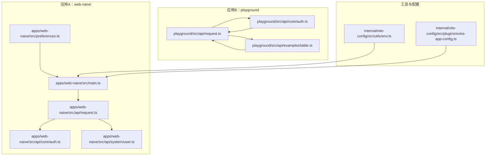
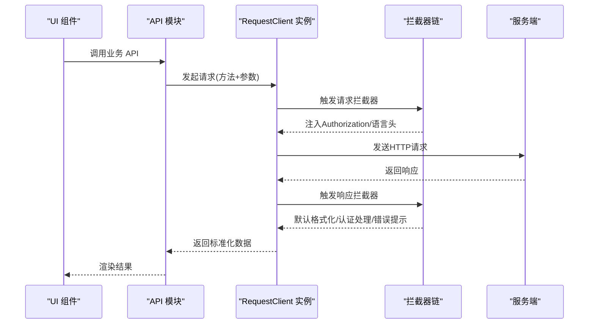
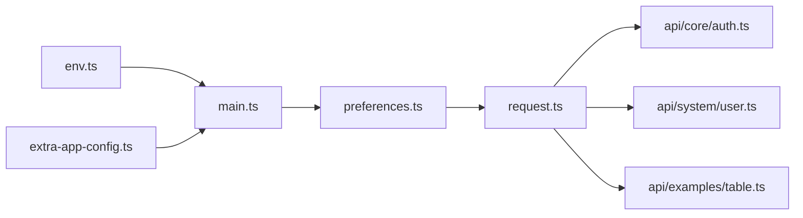

# 请求客户端

<cite>
**本文引用的文件**
- [apps/web-naive/src/api/request.ts](file://apps/web-naive/src/api/request.ts)
- [playground/src/api/request.ts](file://playground/src/api/request.ts)
- [apps/web-naive/src/api/core/auth.ts](file://apps/web-naive/src/api/core/auth.ts)
- [playground/src/api/core/auth.ts](file://playground/src/api/core/auth.ts)
- [apps/web-naive/src/api/system/user.ts](file://apps/web-naive/src/api/system/user.ts)
- [playground/src/api/examples/table.ts](file://playground/src/api/examples/table.ts)
- [apps/web-naive/src/preferences.ts](file://apps/web-naive/src/preferences.ts)
- [apps/web-naive/src/main.ts](file://apps/web-naive/src/main.ts)
- [apps/web-naive/src/store/auth.ts](file://apps/web-naive/src/store/auth.ts)
- [playground/src/store/auth.ts](file://playground/src/store/auth.ts)
- [internal/vite-config/src/utils/env.ts](file://internal/vite-config/src/utils/env.ts)
- [internal/vite-config/src/plugins/extra-app-config.ts](file://internal/vite-config/src/plugins/extra-app-config.ts)
</cite>

## 目录

1. [简介](#简介)
2. [项目结构](#项目结构)
3. [核心组件](#核心组件)
4. [架构总览](#架构总览)
5. [详细组件分析](#详细组件分析)
6. [依赖关系分析](#依赖关系分析)
7. [性能考量](#性能考量)
8. [故障排查指南](#故障排查指南)
9. [结论](#结论)
10. [附录](#附录)

## 简介

本文件面向 shiyu-ui 项目的请求客户端，聚焦于 RequestClient 类的设计与实现，涵盖：

- 客户端初始化配置、基础 URL 设置与全局选项
- 请求方法封装、参数处理与响应数据格式化
- 与应用配置的集成（环境变量、运行时偏好设置）
- 扩展性与自定义能力（拦截器、响应转换、错误处理）
- 使用示例与最佳实践（错误处理、性能优化）

## 项目结构

请求客户端在两个应用中分别实现：web-naive 与 playground。两者均通过统一的 @vben/request 包提供的 RequestClient 构建，并结合各自 UI 适配层与偏好设置。

图表来源

- [apps/web-naive/src/api/request.ts:1-114](file://apps/web-naive/src/api/request.ts#L1-L114)
- [playground/src/api/request.ts:1-135](file://playground/src/api/request.ts#L1-L135)
- [apps/web-naive/src/api/core/auth.ts:1-52](file://apps/web-naive/src/api/core/auth.ts#L1-L52)
- [playground/src/api/core/auth.ts:1-58](file://playground/src/api/core/auth.ts#L1-L58)
- [apps/web-naive/src/api/system/user.ts:1-99](file://apps/web-naive/src/api/system/user.ts#L1-L99)
- [playground/src/api/examples/table.ts:1-19](file://playground/src/api/examples/table.ts#L1-L19)
- [apps/web-naive/src/preferences.ts:1-17](file://apps/web-naive/src/preferences.ts#L1-L17)
- [apps/web-naive/src/main.ts:1-32](file://apps/web-naive/src/main.ts#L1-L32)
- [internal/vite-config/src/utils/env.ts:1-93](file://internal/vite-config/src/utils/env.ts#L1-L93)
- [internal/vite-config/src/plugins/extra-app-config.ts:63-92](file://internal/vite-config/src/plugins/extra-app-config.ts#L63-L92)

章节来源

- [apps/web-naive/src/api/request.ts:1-114](file://apps/web-naive/src/api/request.ts#L1-L114)
- [playground/src/api/request.ts:1-135](file://playground/src/api/request.ts#L1-L135)
- [apps/web-naive/src/preferences.ts:1-17](file://apps/web-naive/src/preferences.ts#L1-L17)
- [apps/web-naive/src/main.ts:1-32](file://apps/web-naive/src/main.ts#L1-L32)
- [internal/vite-config/src/utils/env.ts:1-93](file://internal/vite-config/src/utils/env.ts#L1-L93)
- [internal/vite-config/src/plugins/extra-app-config.ts:63-92](file://internal/vite-config/src/plugins/extra-app-config.ts#L63-L92)

## 核心组件

- RequestClient 实例
  - web-naive：导出 requestClient 与 baseRequestClient，前者启用统一响应格式与错误处理；后者用于无需统一格式化的场景（如刷新令牌）。
  - playground：与 web-naive 类似，但额外在响应转换中对 JSON BigInt 进行字符串化处理，便于序列化与传输。
- 拦截器链
  - 请求拦截器：注入 Authorization 与 Accept-Language 头部。
  - 响应拦截器：默认响应格式化、认证失效与刷新令牌处理、通用错误消息提示。
- 基础 URL 与全局选项
  - 基于 useAppConfig 从 import.meta.env 与生产/开发模式推导 apiURL。
  - 全局选项包含 responseReturn: 'data'，简化调用侧取数。
- 与偏好设置集成
  - preferences.app.enableRefreshToken 控制是否启用刷新令牌。
  - preferences.app.loginExpiredMode 控制过期登录弹窗或跳转策略。
  - preferences.app.locale 控制语言头。
- 与应用启动流程集成
  - main.ts 初始化偏好设置命名空间与覆盖项，随后引导应用启动。

章节来源

- [apps/web-naive/src/api/request.ts:21-114](file://apps/web-naive/src/api/request.ts#L21-L114)
- [playground/src/api/request.ts:24-129](file://playground/src/api/request.ts#L24-L129)
- [apps/web-naive/src/preferences.ts:8-16](file://apps/web-naive/src/preferences.ts#L8-L16)
- [apps/web-naive/src/main.ts:9-25](file://apps/web-naive/src/main.ts#L9-L25)

## 架构总览

下图展示请求客户端在应用中的整体交互：UI 层调用 API 模块，API 模块通过 requestClient/baseRequestClient 发起请求，拦截器负责头部注入、响应格式化与错误处理，最终返回给调用方。

图表来源

- [apps/web-naive/src/api/request.ts:63-104](file://apps/web-naive/src/api/request.ts#L63-L104)
- [playground/src/api/request.ts:77-119](file://playground/src/api/request.ts#L77-L119)
- [apps/web-naive/src/api/core/auth.ts:24-51](file://apps/web-naive/src/api/core/auth.ts#L24-L51)
- [playground/src/api/core/auth.ts:24-57](file://playground/src/api/core/auth.ts#L24-L57)

## 详细组件分析

### RequestClient 初始化与配置

- 基础 URL 与全局选项
  - 通过 useAppConfig(import.meta.env, import.meta.env.PROD) 推导 apiURL。
  - 传入 baseURL 至 RequestClient 构造函数。
  - 全局选项 responseReturn: 'data'，使 get/post/put/delete 等方法返回 data 字段，减少调用侧解构。
- 认证与刷新令牌
  - doReAuthenticate：当令牌无效或过期时，清理本地令牌并按偏好设置决定弹窗或直接登出。
  - doRefreshToken：调用刷新接口获取新令牌并写入访问态。
  - enableRefreshToken 来源于 preferences.app.enableRefreshToken。
- 请求头处理
  - Authorization: Bearer <accessToken>。
  - Accept-Language: preferences.app.locale。
- 响应拦截器
  - defaultResponseInterceptor：约定 code/data/successCode，统一提取 data 字段。
  - authenticateResponseInterceptor：处理 401/令牌过期，触发刷新或重新认证。
  - errorMessageResponseInterceptor：兜底错误提示，优先从响应体提取错误信息。

章节来源

- [apps/web-naive/src/api/request.ts:21-114](file://apps/web-naive/src/api/request.ts#L21-L114)
- [playground/src/api/request.ts:24-129](file://playground/src/api/request.ts#L24-L129)
- [apps/web-naive/src/preferences.ts:8-16](file://apps/web-naive/src/preferences.ts#L8-L16)

### 请求方法封装与参数处理

- 方法封装
  - requestClient 提供 get/post/put/delete 等方法，内部基于 axios 的 RequestClient 实现。
  - baseRequestClient 用于特殊场景（如刷新令牌），避免统一响应格式影响。
- 参数处理
  - 支持 params、data、headers 等标准 axios 参数。
  - 在具体 API 中对分页参数进行转换（如 page/pageSize -> pageNo/pageSize）。
- 响应数据格式化
  - playground 版本在 transformResponse 中对 JSON BigInt 进行字符串化，确保跨端传输安全。

章节来源

- [apps/web-naive/src/api/system/user.ts:33-50](file://apps/web-naive/src/api/system/user.ts#L33-L50)
- [playground/src/api/examples/table.ts:14-16](file://playground/src/api/examples/table.ts#L14-L16)
- [playground/src/api/request.ts:27-42](file://playground/src/api/request.ts#L27-L42)

### 与应用配置的集成

- 环境变量处理
  - 通过 internal/vite-config/utils/env.ts 加载 .env\* 文件，筛选以 VITE\_ 开头的变量。
  - extra-app-config 插件将配置注入到 window 对象，供 useAppConfig 解析。
- 运行时配置动态调整
  - preferences.app.enableRefreshToken、loginExpiredMode、locale 等在运行时生效。
  - main.ts 初始化偏好设置命名空间，确保不同版本/环境下的配置隔离。

章节来源

- [internal/vite-config/src/utils/env.ts:37-64](file://internal/vite-config/src/utils/env.ts#L37-L64)
- [internal/vite-config/src/plugins/extra-app-config.ts:73-86](file://internal/vite-config/src/plugins/extra-app-config.ts#L73-L86)
- [apps/web-naive/src/main.ts:16-20](file://apps/web-naive/src/main.ts#L16-L20)
- [apps/web-naive/src/preferences.ts:8-16](file://apps/web-naive/src/preferences.ts#L8-L16)

### 扩展性与自定义能力

- 自定义响应转换
  - playground 示例展示了 transformResponse 对 JSON BigInt 的处理，可按需扩展为其他类型转换。
- 自定义拦截器
  - 可新增请求/响应拦截器，实现如日志、埋点、重试策略等。
- 错误处理定制
  - errorMessageResponseInterceptor 可根据业务 code 映射不同提示，或接入更丰富的错误面板。
- 基础 URL 动态化
  - 若存在多集群或多域名场景，可在 useAppConfig 中扩展逻辑，动态选择 baseURL。

章节来源

- [playground/src/api/request.ts:27-42](file://playground/src/api/request.ts#L27-L42)
- [apps/web-naive/src/api/request.ts:63-104](file://apps/web-naive/src/api/request.ts#L63-L104)

### 使用示例与最佳实践

- 登录流程
  - 使用 requestClient.post 发起登录，成功后写入访问令牌并并行拉取用户信息与权限码。
  - 登出时调用 baseRequestClient.post 并清理所有状态。
- 用户管理
  - 列表查询时将 page/pageSize 转换为后端期望的 pageNo/pageSize，并统一分页返回结构。
- 最佳实践
  - 统一通过 requestClient 发起业务请求，仅在必要时使用 baseRequestClient。
  - 对于大整数场景，建议采用字符串化或二进制传输策略，避免精度丢失。
  - 错误处理遵循统一拦截器链，避免重复判断与提示逻辑。
  - 令牌刷新与过期处理由拦截器统一处理，业务层专注数据流转。

章节来源

- [apps/web-naive/src/api/core/auth.ts:24-51](file://apps/web-naive/src/api/core/auth.ts#L24-L51)
- [playground/src/api/core/auth.ts:24-57](file://playground/src/api/core/auth.ts#L24-L57)
- [apps/web-naive/src/api/system/user.ts:33-50](file://apps/web-naive/src/api/system/user.ts#L33-L50)
- [apps/web-naive/src/store/auth.ts:28-79](file://apps/web-naive/src/store/auth.ts#L28-L79)
- [playground/src/store/auth.ts:29-79](file://playground/src/store/auth.ts#L29-L79)

## 依赖关系分析

- 组件耦合
  - API 模块依赖 requestClient/baseRequestClient，二者均由 request.ts 统一创建。
  - 认证与偏好设置通过 Pinia Store 与 preferences 协同，影响拦截器行为。
- 外部依赖
  - @vben/request 提供 RequestClient 与拦截器工厂。
  - UI 适配层（Naive/Ant Design）负责错误提示与通知。
- 潜在循环依赖
  - API 与 Store 之间通过函数调用解耦，未见直接循环导入。

图表来源

- [apps/web-naive/src/api/request.ts:1-114](file://apps/web-naive/src/api/request.ts#L1-L114)
- [playground/src/api/request.ts:1-135](file://playground/src/api/request.ts#L1-L135)
- [apps/web-naive/src/api/core/auth.ts:1-52](file://apps/web-naive/src/api/core/auth.ts#L1-L52)
- [apps/web-naive/src/api/system/user.ts:1-99](file://apps/web-naive/src/api/system/user.ts#L1-L99)
- [playground/src/api/examples/table.ts:1-19](file://playground/src/api/examples/table.ts#L1-L19)
- [apps/web-naive/src/preferences.ts:1-17](file://apps/web-naive/src/preferences.ts#L1-L17)
- [apps/web-naive/src/main.ts:1-32](file://apps/web-naive/src/main.ts#L1-L32)
- [internal/vite-config/src/utils/env.ts:1-93](file://internal/vite-config/src/utils/env.ts#L1-L93)
- [internal/vite-config/src/plugins/extra-app-config.ts:63-92](file://internal/vite-config/src/plugins/extra-app-config.ts#L63-L92)

章节来源

- [apps/web-naive/src/api/request.ts:1-114](file://apps/web-naive/src/api/request.ts#L1-L114)
- [playground/src/api/request.ts:1-135](file://playground/src/api/request.ts#L1-L135)
- [apps/web-naive/src/preferences.ts:1-17](file://apps/web-naive/src/preferences.ts#L1-L17)
- [apps/web-naive/src/main.ts:1-32](file://apps/web-naive/src/main.ts#L1-L32)
- [internal/vite-config/src/utils/env.ts:1-93](file://internal/vite-config/src/utils/env.ts#L1-L93)
- [internal/vite-config/src/plugins/extra-app-config.ts:63-92](file://internal/vite-config/src/plugins/extra-app-config.ts#L63-L92)

## 性能考量

- 减少不必要的解析
  - 对非 JSON 字符串响应不做额外解析，避免性能损耗。
- 响应转换最小化
  - transformResponse 仅在必要时执行（如 JSON BigInt），避免对常规响应造成开销。
- 并行请求
  - 登录成功后并行获取用户信息与权限码，缩短首屏等待时间。
- 缓存与去重
  - 对高频查询可考虑在上层引入缓存策略（如基于查询参数的键值缓存）。

## 故障排查指南

- 令牌过期
  - 现象：出现 401 或统一拦截器触发重新认证。
  - 处理：检查 enableRefreshToken 与 doRefreshToken 流程；确认刷新接口返回结构符合预期。
- 错误提示不符合预期
  - 现象：错误信息为空或不准确。
  - 处理：检查 errorMessageResponseInterceptor 的错误字段提取逻辑，确保与后端一致。
- 语言与区域问题
  - 现象：接口返回语言不符合预期。
  - 处理：确认 Accept-Language 是否正确注入，以及后端是否支持该语言。
- 环境变量未生效
  - 现象：apiURL 与期望不符。
  - 处理：检查 .env* 文件与 loadEnv 行为，确认 VITE\_* 前缀变量是否正确加载。

章节来源

- [apps/web-naive/src/api/request.ts:32-104](file://apps/web-naive/src/api/request.ts#L32-L104)
- [playground/src/api/request.ts:47-119](file://playground/src/api/request.ts#L47-L119)
- [apps/web-naive/src/preferences.ts:8-16](file://apps/web-naive/src/preferences.ts#L8-L16)
- [internal/vite-config/src/utils/env.ts:37-64](file://internal/vite-config/src/utils/env.ts#L37-L64)

## 结论

RequestClient 在 shiyu-ui 中提供了统一、可扩展的请求抽象：通过拦截器链实现认证、格式化与错误处理，结合偏好设置与环境变量实现灵活配置。业务层仅需关注数据流转，无需重复处理通用逻辑。建议在后续迭代中进一步完善缓存策略、重试机制与可观测性指标，持续提升稳定性与性能。

## 附录

- 关键实现路径参考
  - [请求客户端创建与拦截器注册（web-naive）:23-107](file://apps/web-naive/src/api/request.ts#L23-L107)
  - [请求客户端创建与响应转换（playground）:26-122](file://playground/src/api/request.ts#L26-L122)
  - [登录/刷新/登出 API（web-naive）:24-51](file://apps/web-naive/src/api/core/auth.ts#L24-L51)
  - [登录/刷新/登出 API（playground）:24-57](file://playground/src/api/core/auth.ts#L24-L57)
  - [用户列表分页处理（web-naive）:33-50](file://apps/web-naive/src/api/system/user.ts#L33-L50)
  - [示例表格分页处理（playground）:14-16](file://playground/src/api/examples/table.ts#L14-L16)
  - [偏好设置覆盖（web-naive）:8-16](file://apps/web-naive/src/preferences.ts#L8-L16)
  - [应用启动与偏好初始化（web-naive）:16-20](file://apps/web-naive/src/main.ts#L16-L20)
  - [环境变量加载（vite-config）:37-64](file://internal/vite-config/src/utils/env.ts#L37-L64)
  - [应用配置注入（vite-config 插件）:73-86](file://internal/vite-config/src/plugins/extra-app-config.ts#L73-L86)
