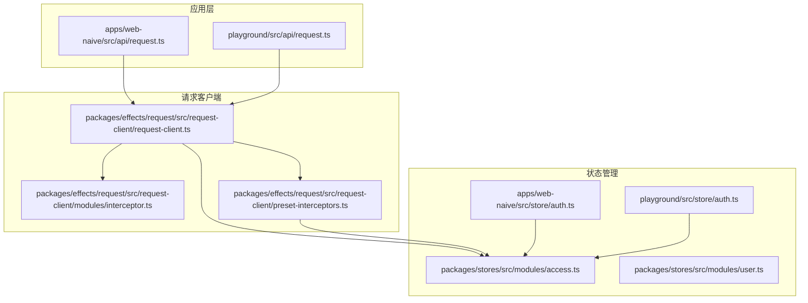
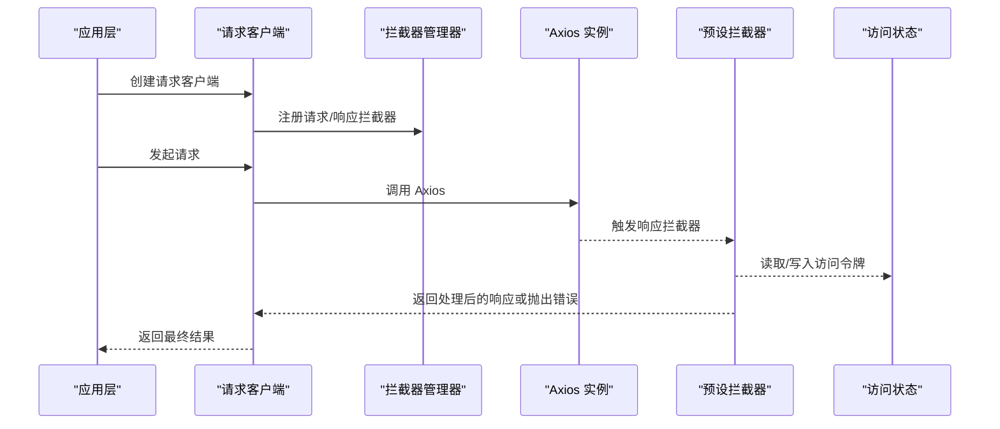
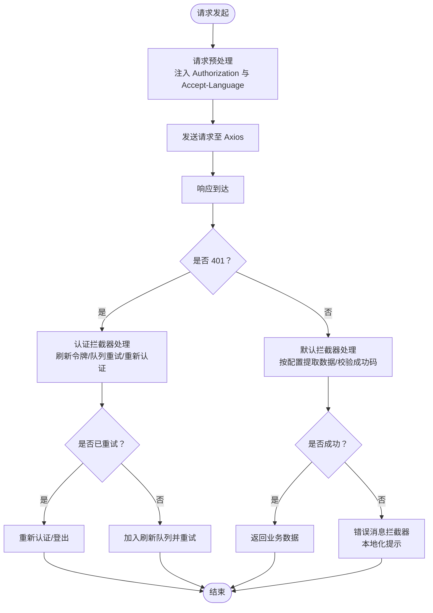
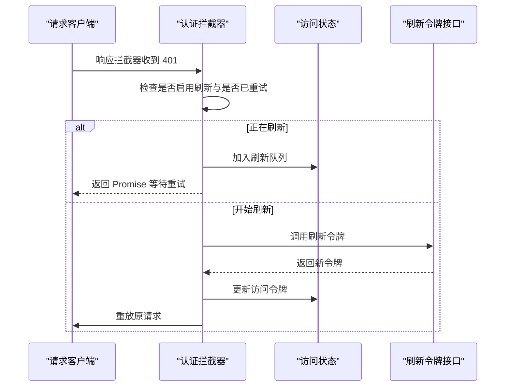
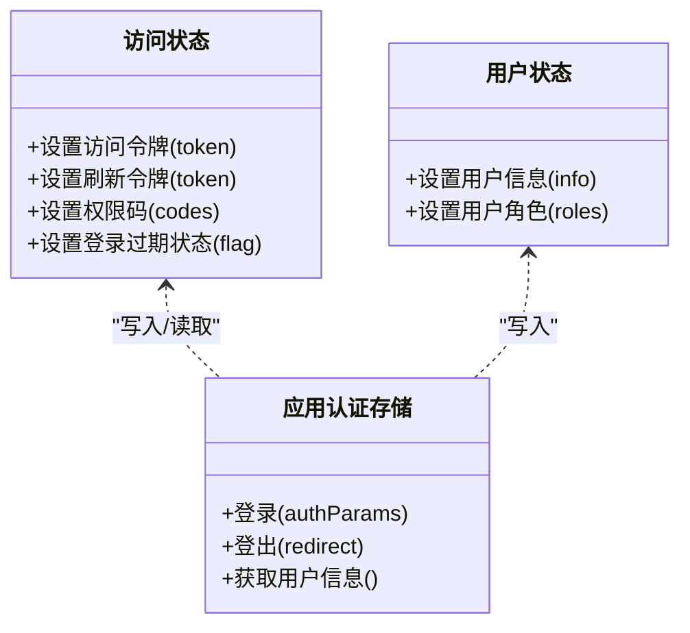
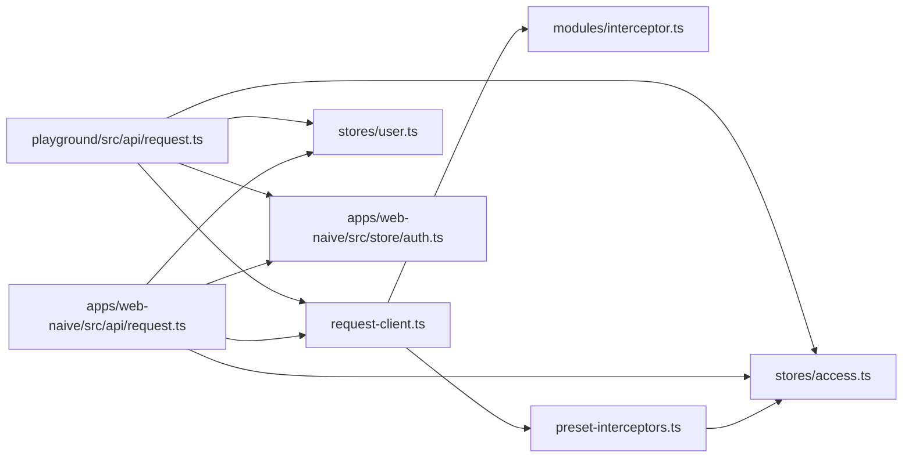

# 请求拦截器

<cite>
**本文引用的文件**
- [apps/web-naive/src/api/request.ts](file://apps/web-naive/src/api/request.ts)
- [playground/src/api/request.ts](file://playground/src/api/request.ts)
- [packages/effects/request/src/request-client/request-client.ts](file://packages/effects/request/src/request-client/request-client.ts)
- [packages/effects/request/src/request-client/modules/interceptor.ts](file://packages/effects/request/src/request-client/modules/interceptor.ts)
- [packages/effects/request/src/request-client/preset-interceptors.ts](file://packages/effects/request/src/request-client/preset-interceptors.ts)
- [packages/stores/src/modules/access.ts](file://packages/stores/src/modules/access.ts)
- [packages/stores/src/modules/user.ts](file://packages/stores/src/modules/user.ts)
- [apps/web-naive/src/store/auth.ts](file://apps/web-naive/src/store/auth.ts)
- [playground/src/store/auth.ts](file://playground/src/store/auth.ts)
- [apps/web-naive/src/router/access.ts](file://apps/web-naive/src/router/access.ts)
- [playground/src/router/access.ts](file://playground/src/router/access.ts)
</cite>

## 目录

1. [简介](#简介)
2. [项目结构](#项目结构)
3. [核心组件](#核心组件)
4. [架构总览](#架构总览)
5. [详细组件分析](#详细组件分析)
6. [依赖关系分析](#依赖关系分析)
7. [性能考量](#性能考量)
8. [故障排查指南](#故障排查指南)
9. [结论](#结论)
10. [附录](#附录)

## 简介

本文件系统性阐述 shiyu-ui 项目中请求拦截器的设计与实现，覆盖以下关键主题：

- 请求拦截器工作原理：请求头设置、认证令牌注入、语言设置
- 执行顺序与生命周期：请求预处理、中间处理、后处理阶段
- 配置选项：自定义请求头、特殊请求处理、条件拦截
- 与状态管理的集成：访问令牌管理、用户状态同步
- 使用示例与自定义拦截器开发指南

## 项目结构

请求拦截器位于应用层与底层请求库之间，通过统一的请求客户端封装，结合状态管理与偏好设置，实现跨应用的一致行为。

图表来源

- [apps/web-naive/src/api/request.ts:23-111](file://apps/web-naive/src/api/request.ts#L23-L111)
- [playground/src/api/request.ts:26-126](file://playground/src/api/request.ts#L26-L126)
- [packages/effects/request/src/request-client/request-client.ts:39-94](file://packages/effects/request/src/request-client/request-client.ts#L39-L94)
- [packages/effects/request/src/request-client/modules/interceptor.ts:18-38](file://packages/effects/request/src/request-client/modules/interceptor.ts#L18-L38)
- [packages/effects/request/src/request-client/preset-interceptors.ts:9-45](file://packages/effects/request/src/request-client/preset-interceptors.ts#L9-L45)
- [packages/stores/src/modules/access.ts:51-123](file://packages/stores/src/modules/access.ts#L51-L123)
- [packages/stores/src/modules/user.ts:41-58](file://packages/stores/src/modules/user.ts#L41-L58)
- [apps/web-naive/src/store/auth.ts:16-118](file://apps/web-naive/src/store/auth.ts#L16-L118)
- [playground/src/store/auth.ts:16-126](file://playground/src/store/auth.ts#L16-L126)

章节来源

- [apps/web-naive/src/api/request.ts:1-114](file://apps/web-naive/src/api/request.ts#L1-L114)
- [playground/src/api/request.ts:1-135](file://playground/src/api/request.ts#L1-L135)
- [packages/effects/request/src/request-client/request-client.ts:1-165](file://packages/effects/request/src/request-client/request-client.ts#L1-L165)
- [packages/effects/request/src/request-client/modules/interceptor.ts:1-41](file://packages/effects/request/src/request-client/modules/interceptor.ts#L1-L41)
- [packages/effects/request/src/request-client/preset-interceptors.ts:1-173](file://packages/effects/request/src/request-client/preset-interceptors.ts#L1-L173)
- [packages/stores/src/modules/access.ts:1-130](file://packages/stores/src/modules/access.ts#L1-L130)
- [packages/stores/src/modules/user.ts:1-65](file://packages/stores/src/modules/user.ts#L1-L65)
- [apps/web-naive/src/store/auth.ts:1-119](file://apps/web-naive/src/store/auth.ts#L1-L119)
- [playground/src/store/auth.ts:1-127](file://playground/src/store/auth.ts#L1-L127)

## 核心组件

- 请求客户端：封装 Axios 实例，提供统一的请求方法与拦截器注册能力
- 拦截器管理器：负责添加请求/响应拦截器
- 预设拦截器：默认响应拦截器、认证响应拦截器、错误消息响应拦截器
- 应用级请求客户端：在应用入口处创建，注入请求头、认证与错误处理逻辑
- 状态管理：访问令牌、用户信息、权限等状态的集中管理

章节来源

- [packages/effects/request/src/request-client/request-client.ts:39-94](file://packages/effects/request/src/request-client/request-client.ts#L39-L94)
- [packages/effects/request/src/request-client/modules/interceptor.ts:18-38](file://packages/effects/request/src/request-client/modules/interceptor.ts#L18-L38)
- [packages/effects/request/src/request-client/preset-interceptors.ts:9-173](file://packages/effects/request/src/request-client/preset-interceptors.ts#L9-L173)
- [apps/web-naive/src/api/request.ts:23-111](file://apps/web-naive/src/api/request.ts#L23-L111)
- [playground/src/api/request.ts:26-126](file://playground/src/api/request.ts#L26-L126)

## 架构总览

请求拦截器在应用层与底层请求库之间形成“横切关注点”，通过统一的客户端实例对所有 HTTP 请求进行预处理与后处理，确保：

- 统一的认证令牌注入
- 统一的语言环境传递
- 统一的成功/失败判定与错误提示
- 统一的令牌刷新与重试策略

图表来源

- [apps/web-naive/src/api/request.ts:63-104](file://apps/web-naive/src/api/request.ts#L63-L104)
- [packages/effects/request/src/request-client/request-client.ts:77-94](file://packages/effects/request/src/request-client/request-client.ts#L77-L94)
- [packages/effects/request/src/request-client/preset-interceptors.ts:47-116](file://packages/effects/request/src/request-client/preset-interceptors.ts#L47-L116)
- [packages/stores/src/modules/access.ts:85-96](file://packages/stores/src/modules/access.ts#L85-L96)

## 详细组件分析

### 请求拦截器生命周期与执行顺序

- 请求预处理阶段
  - 在请求发送前，拦截器读取访问状态中的访问令牌与语言偏好，注入到请求头
  - 支持自定义请求头扩展与条件拦截
- 中间处理阶段
  - 默认响应拦截器根据配置字段判断成功/失败，并决定返回原始响应、响应体或业务数据
  - 认证响应拦截器处理 401 场景，支持刷新令牌与队列重试
- 后处理阶段
  - 错误消息拦截器统一处理网络错误、超时与常见 HTTP 状态码，提供本地化提示

图表来源

- [apps/web-naive/src/api/request.ts:63-104](file://apps/web-naive/src/api/request.ts#L63-L104)
- [packages/effects/request/src/request-client/preset-interceptors.ts:47-116](file://packages/effects/request/src/request-client/preset-interceptors.ts#L47-L116)
- [packages/effects/request/src/request-client/preset-interceptors.ts:9-45](file://packages/effects/request/src/request-client/preset-interceptors.ts#L9-L45)
- [packages/effects/request/src/request-client/preset-interceptors.ts:118-173](file://packages/effects/request/src/request-client/preset-interceptors.ts#L118-L173)

章节来源

- [apps/web-naive/src/api/request.ts:63-104](file://apps/web-naive/src/api/request.ts#L63-L104)
- [packages/effects/request/src/request-client/preset-interceptors.ts:9-173](file://packages/effects/request/src/request-client/preset-interceptors.ts#L9-L173)

### 请求头设置与语言设置

- 认证令牌注入
  - 在请求拦截器中，从访问状态读取访问令牌，并格式化为标准的 Bearer 字符串，注入到 Authorization 请求头
- 语言设置
  - 从偏好设置读取当前语言，注入到 Accept-Language 请求头
- 自定义请求头
  - 可在请求拦截器中扩展其他头部字段，例如 X-Device-Id、X-Tenant-Id 等

章节来源

- [apps/web-naive/src/api/request.ts:63-71](file://apps/web-naive/src/api/request.ts#L63-L71)
- [playground/src/api/request.ts:77-86](file://playground/src/api/request.ts#L77-L86)

### 认证令牌注入与刷新流程

- 刷新令牌开关
  - 由偏好设置控制是否启用刷新令牌功能
- 刷新队列与重试
  - 当检测到 401 且未处于重试阶段时，若正在刷新令牌则将请求加入队列；否则触发刷新并重放请求
- 重新认证
  - 若未启用刷新或刷新失败，触发重新认证逻辑（弹窗或跳转登录）

图表来源

- [packages/effects/request/src/request-client/preset-interceptors.ts:47-116](file://packages/effects/request/src/request-client/preset-interceptors.ts#L47-L116)
- [apps/web-naive/src/api/request.ts:32-56](file://apps/web-naive/src/api/request.ts#L32-L56)
- [playground/src/api/request.ts:47-71](file://playground/src/api/request.ts#L47-L71)

章节来源

- [packages/effects/request/src/request-client/preset-interceptors.ts:47-116](file://packages/effects/request/src/request-client/preset-interceptors.ts#L47-L116)
- [apps/web-naive/src/api/request.ts:32-56](file://apps/web-naive/src/api/request.ts#L32-L56)
- [playground/src/api/request.ts:47-71](file://playground/src/api/request.ts#L47-L71)

### 默认响应拦截器与错误处理

- 默认响应拦截器
  - 支持通过配置字段选择返回原始响应、响应体或业务数据
  - 依据成功码判断请求是否成功，不成功时抛出包含响应对象的错误
- 错误消息拦截器
  - 统一处理网络错误、超时与常见 HTTP 状态码，提供本地化提示
  - 允许自定义错误消息生成函数，以便按业务定制提示内容

章节来源

- [packages/effects/request/src/request-client/preset-interceptors.ts:9-45](file://packages/effects/request/src/request-client/preset-interceptors.ts#L9-L45)
- [packages/effects/request/src/request-client/preset-interceptors.ts:118-173](file://packages/effects/request/src/request-client/preset-interceptors.ts#L118-L173)
- [apps/web-naive/src/api/request.ts:74-104](file://apps/web-naive/src/api/request.ts#L74-L104)
- [playground/src/api/request.ts:89-120](file://playground/src/api/request.ts#L89-L120)

### 与状态管理的集成

- 访问令牌管理
  - 访问状态维护访问令牌与刷新令牌，提供设置与查询方法
  - 登录成功后写入访问令牌，登出时清空并触发重新认证
- 用户状态同步
  - 登录成功后并行拉取用户信息与权限码，写入用户状态与访问状态
- 路由与菜单生成
  - 菜单与路由生成过程中读取访问状态中的权限码与菜单列表，动态构建可访问资源

图表来源

- [packages/stores/src/modules/access.ts:51-123](file://packages/stores/src/modules/access.ts#L51-L123)
- [packages/stores/src/modules/user.ts:41-58](file://packages/stores/src/modules/user.ts#L41-L58)
- [apps/web-naive/src/store/auth.ts:16-118](file://apps/web-naive/src/store/auth.ts#L16-L118)
- [playground/src/store/auth.ts:16-126](file://playground/src/store/auth.ts#L16-L126)

章节来源

- [packages/stores/src/modules/access.ts:51-123](file://packages/stores/src/modules/access.ts#L51-L123)
- [packages/stores/src/modules/user.ts:41-58](file://packages/stores/src/modules/user.ts#L41-L58)
- [apps/web-naive/src/store/auth.ts:16-118](file://apps/web-naive/src/store/auth.ts#L16-L118)
- [playground/src/store/auth.ts:16-126](file://playground/src/store/auth.ts#L16-L126)

### 配置选项与自定义拦截器

- 请求客户端配置
  - 基础 URL、超时、参数序列化方式、返回数据格式等
- 拦截器注册
  - 通过拦截器管理器注册请求/响应拦截器，支持链式调用
- 预设拦截器
  - 默认响应拦截器、认证响应拦截器、错误消息拦截器
- 自定义拦截器开发
  - 在应用层创建请求客户端时，按需添加自定义请求拦截器与响应拦截器
  - 可基于预设拦截器组合，或完全自定义处理逻辑

章节来源

- [packages/effects/request/src/request-client/request-client.ts:58-94](file://packages/effects/request/src/request-client/request-client.ts#L58-L94)
- [packages/effects/request/src/request-client/modules/interceptor.ts:25-37](file://packages/effects/request/src/request-client/modules/interceptor.ts#L25-L37)
- [packages/effects/request/src/request-client/preset-interceptors.ts:9-173](file://packages/effects/request/src/request-client/preset-interceptors.ts#L9-L173)
- [apps/web-naive/src/api/request.ts:23-111](file://apps/web-naive/src/api/request.ts#L23-L111)
- [playground/src/api/request.ts:26-126](file://playground/src/api/request.ts#L26-L126)

### 使用示例与最佳实践

- 在应用入口创建请求客户端并注册拦截器
  - 示例路径：[apps/web-naive/src/api/request.ts:23-111](file://apps/web-naive/src/api/request.ts#L23-L111)
  - 示例路径：[playground/src/api/request.ts:26-126](file://playground/src/api/request.ts#L26-L126)
- 自定义请求头
  - 在请求拦截器的 fulfilled 回调中设置额外头部
  - 示例路径：[apps/web-naive/src/api/request.ts:63-71](file://apps/web-naive/src/api/request.ts#L63-L71)
- 条件拦截
  - 根据请求 URL 或业务规则决定是否注入令牌或修改请求头
  - 示例路径：[packages/effects/request/src/request-client/modules/interceptor.ts:25-37](file://packages/effects/request/src/request-client/modules/interceptor.ts#L25-L37)
- 特殊请求处理
  - 对于上传/下载、SSE 等场景，使用请求客户端提供的专用方法
  - 示例路径：[packages/effects/request/src/request-client/request-client.ts:10-14](file://packages/effects/request/src/request-client/request-client.ts#L10-L14)

## 依赖关系分析

- 应用层依赖请求客户端与状态管理
- 请求客户端依赖拦截器管理器与预设拦截器
- 预设拦截器依赖访问状态与偏好设置
- 认证存储与用户存储依赖访问状态与用户状态

图表来源

- [apps/web-naive/src/api/request.ts:1-114](file://apps/web-naive/src/api/request.ts#L1-L114)
- [playground/src/api/request.ts:1-135](file://playground/src/api/request.ts#L1-L135)
- [packages/effects/request/src/request-client/request-client.ts:1-165](file://packages/effects/request/src/request-client/request-client.ts#L1-L165)
- [packages/effects/request/src/request-client/modules/interceptor.ts:1-41](file://packages/effects/request/src/request-client/modules/interceptor.ts#L1-L41)
- [packages/effects/request/src/request-client/preset-interceptors.ts:1-173](file://packages/effects/request/src/request-client/preset-interceptors.ts#L1-L173)
- [packages/stores/src/modules/access.ts:1-130](file://packages/stores/src/modules/access.ts#L1-L130)
- [packages/stores/src/modules/user.ts:1-65](file://packages/stores/src/modules/user.ts#L1-L65)
- [apps/web-naive/src/store/auth.ts:1-119](file://apps/web-naive/src/store/auth.ts#L1-L119)
- [playground/src/store/auth.ts:1-127](file://playground/src/store/auth.ts#L1-L127)

章节来源

- [apps/web-naive/src/api/request.ts:1-114](file://apps/web-naive/src/api/request.ts#L1-L114)
- [playground/src/api/request.ts:1-135](file://playground/src/api/request.ts#L1-L135)
- [packages/effects/request/src/request-client/request-client.ts:1-165](file://packages/effects/request/src/request-client/request-client.ts#L1-L165)
- [packages/effects/request/src/request-client/modules/interceptor.ts:1-41](file://packages/effects/request/src/request-client/modules/interceptor.ts#L1-L41)
- [packages/effects/request/src/request-client/preset-interceptors.ts:1-173](file://packages/effects/request/src/request-client/preset-interceptors.ts#L1-L173)
- [packages/stores/src/modules/access.ts:1-130](file://packages/stores/src/modules/access.ts#L1-L130)
- [packages/stores/src/modules/user.ts:1-65](file://packages/stores/src/modules/user.ts#L1-L65)
- [apps/web-naive/src/store/auth.ts:1-119](file://apps/web-naive/src/store/auth.ts#L1-L119)
- [playground/src/store/auth.ts:1-127](file://playground/src/store/auth.ts#L1-L127)

## 性能考量

- 令牌刷新队列避免并发刷新导致的重复请求
- 参数序列化方式可按需选择，减少数组参数编码开销
- 响应数据返回模式影响内存占用与解析成本，建议按需配置

## 故障排查指南

- 401 未生效
  - 检查是否启用刷新令牌与是否已在重试阶段
  - 确认认证拦截器的 401 判定逻辑与服务端返回一致
- 刷新失败后未登出
  - 确认重新认证逻辑是否被正确触发
  - 检查访问状态中的登录过期标志
- 错误提示不符合预期
  - 检查错误消息拦截器的本地化键与自定义消息生成函数
- 语言设置无效
  - 确认偏好设置中的语言值与请求拦截器中的头字段一致

章节来源

- [packages/effects/request/src/request-client/preset-interceptors.ts:47-116](file://packages/effects/request/src/request-client/preset-interceptors.ts#L47-L116)
- [packages/effects/request/src/request-client/preset-interceptors.ts:118-173](file://packages/effects/request/src/request-client/preset-interceptors.ts#L118-L173)
- [apps/web-naive/src/api/request.ts:32-56](file://apps/web-naive/src/api/request.ts#L32-L56)
- [playground/src/api/request.ts:47-71](file://playground/src/api/request.ts#L47-L71)

## 结论

请求拦截器在 shiyu-ui 中承担了统一认证、语言设置、错误处理与令牌刷新的关键职责。通过与状态管理的深度集成，实现了跨应用的一致体验与可扩展的定制能力。遵循本文档的配置与开发指南，可在保证安全与稳定性的前提下，灵活满足各类业务场景。

## 附录

- 关键实现路径参考
  - 请求客户端创建与拦截器注册：[apps/web-naive/src/api/request.ts:23-111](file://apps/web-naive/src/api/request.ts#L23-L111)，[playground/src/api/request.ts:26-126](file://playground/src/api/request.ts#L26-L126)
  - 请求/响应拦截器管理：[packages/effects/request/src/request-client/modules/interceptor.ts:25-37](file://packages/effects/request/src/request-client/modules/interceptor.ts#L25-L37)
  - 预设拦截器：[packages/effects/request/src/request-client/preset-interceptors.ts:9-173](file://packages/effects/request/src/request-client/preset-interceptors.ts#L9-L173)
  - 访问状态与用户状态：[packages/stores/src/modules/access.ts:51-123](file://packages/stores/src/modules/access.ts#L51-L123)，[packages/stores/src/modules/user.ts:41-58](file://packages/stores/src/modules/user.ts#L41-L58)
  - 登录与登出流程：[apps/web-naive/src/store/auth.ts:16-118](file://apps/web-naive/src/store/auth.ts#L16-L118)，[playground/src/store/auth.ts:16-126](file://playground/src/store/auth.ts#L16-L126)
  - 路由与菜单生成：[apps/web-naive/src/router/access.ts:16-38](file://apps/web-naive/src/router/access.ts#L16-L38)，[playground/src/router/access.ts:17-40](file://playground/src/router/access.ts#L17-L40)
