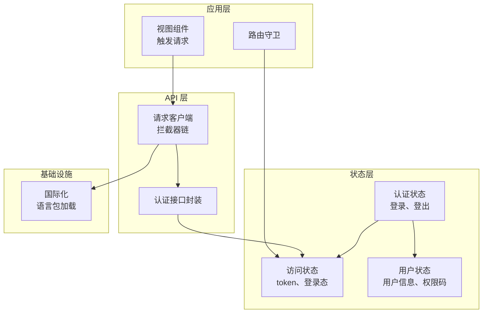
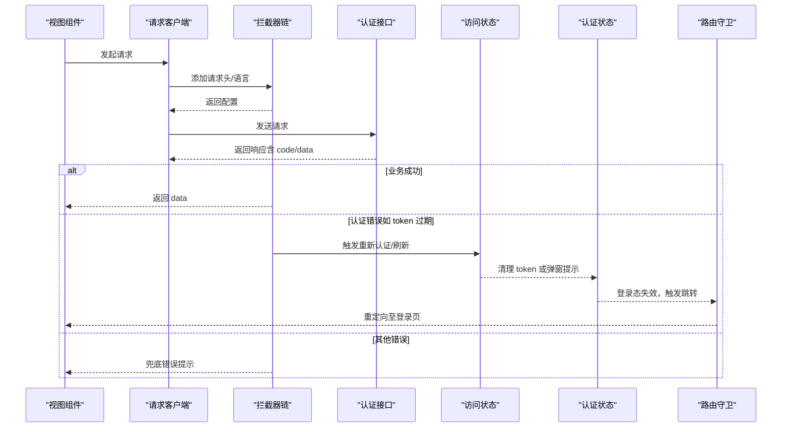
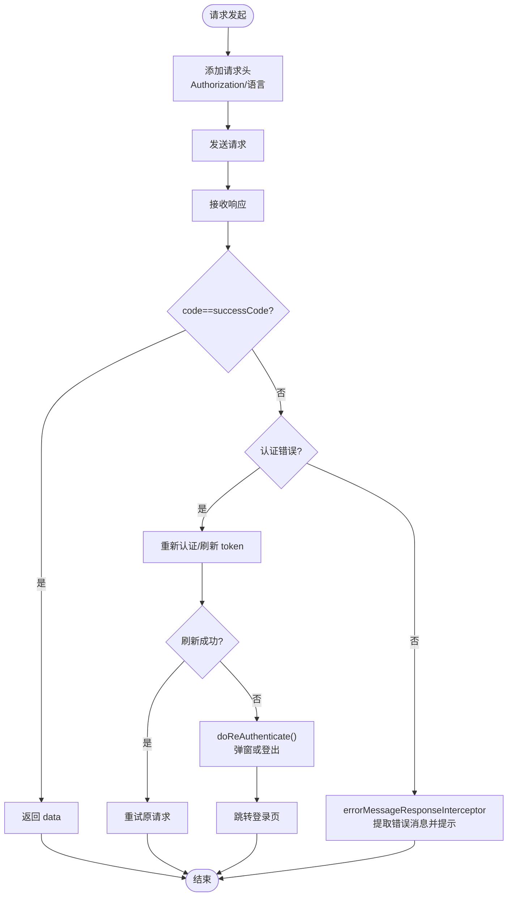
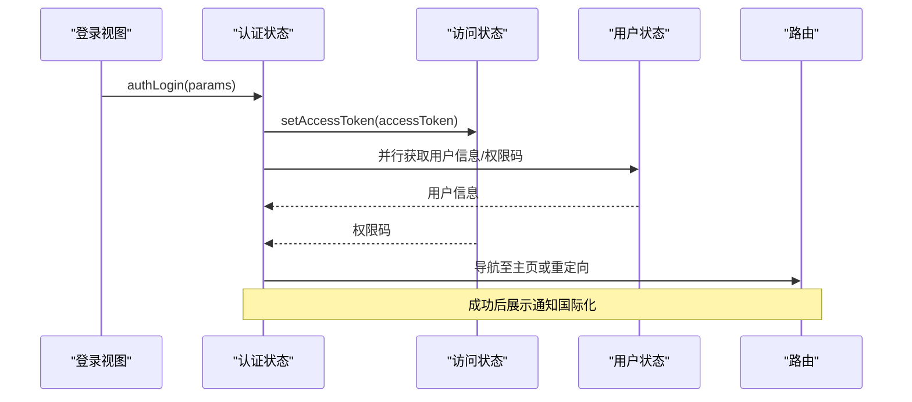
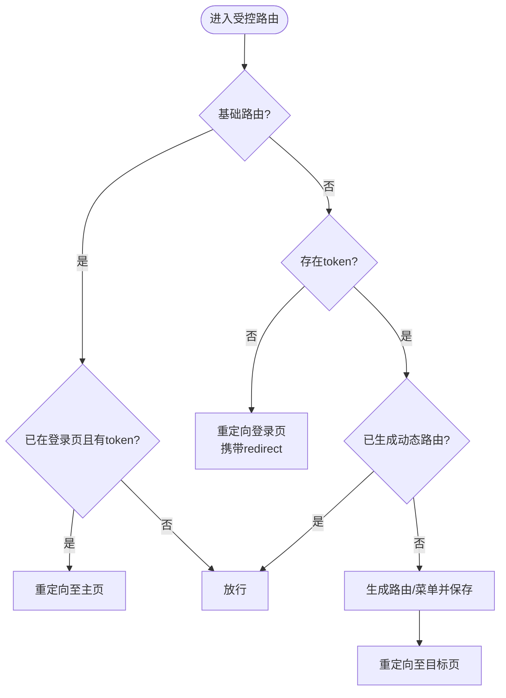
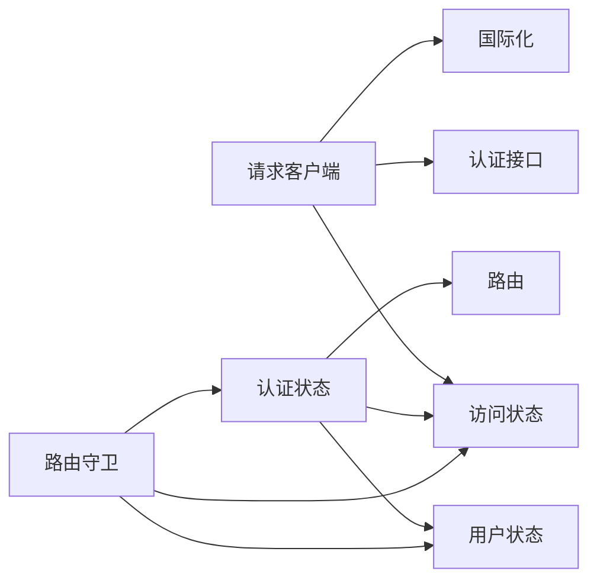

# 错误处理机制

<cite>
**本文引用的文件**
- [apps/web-naive/src/api/request.ts](file://apps/web-naive/src/api/request.ts)
- [apps/web-naive/src/api/core/auth.ts](file://apps/web-naive/src/api/core/auth.ts)
- [apps/web-naive/src/store/auth.ts](file://apps/web-naive/src/store/auth.ts)
- [apps/web-naive/src/router/guard.ts](file://apps/web-naive/src/router/guard.ts)
- [apps/web-naive/src/locales/index.ts](file://apps/web-naive/src/locales/index.ts)
</cite>

## 目录

1. [简介](#简介)
2. [项目结构](#项目结构)
3. [核心组件](#核心组件)
4. [架构总览](#架构总览)
5. [详细组件分析](#详细组件分析)
6. [依赖关系分析](#依赖关系分析)
7. [性能考量](#性能考量)
8. [故障排查指南](#故障排查指南)
9. [结论](#结论)
10. [附录](#附录)

## 简介

本文件系统性梳理 shiyu-ui 项目的错误处理机制，覆盖网络错误、业务错误与认证错误的分类处理；详解错误拦截器的工作流程（捕获、分类与提示）；阐述 token 过期与刷新失败的处理流程（重新认证与用户引导）；说明错误消息的本地化与用户友好提示策略，并提供可扩展的自定义错误处理开发指南。

## 项目结构

围绕错误处理的关键模块与职责如下：

- 请求客户端与拦截器：统一请求头注入、响应数据标准化、认证错误拦截、通用错误提示
- 认证与会话管理：登录、登出、用户信息拉取、权限码获取、token 刷新
- 路由守卫：访问控制、未授权跳转、登录态校验
- 本地化：语言包加载与国际化消息

图表来源

- [apps/web-naive/src/api/request.ts:23-114](file://apps/web-naive/src/api/request.ts#L23-L114)
- [apps/web-naive/src/api/core/auth.ts:1-52](file://apps/web-naive/src/api/core/auth.ts#L1-L52)
- [apps/web-naive/src/store/auth.ts:16-119](file://apps/web-naive/src/store/auth.ts#L16-L119)
- [apps/web-naive/src/router/guard.ts:47-119](file://apps/web-naive/src/router/guard.ts#L47-L119)
- [apps/web-naive/src/locales/index.ts:29-39](file://apps/web-naive/src/locales/index.ts#L29-L39)

章节来源

- [apps/web-naive/src/api/request.ts:23-114](file://apps/web-naive/src/api/request.ts#L23-L114)
- [apps/web-naive/src/api/core/auth.ts:1-52](file://apps/web-naive/src/api/core/auth.ts#L1-L52)
- [apps/web-naive/src/store/auth.ts:16-119](file://apps/web-naive/src/store/auth.ts#L16-L119)
- [apps/web-naive/src/router/guard.ts:47-119](file://apps/web-naive/src/router/guard.ts#L47-L119)
- [apps/web-naive/src/locales/index.ts:29-39](file://apps/web-naive/src/locales/index.ts#L29-L39)

## 核心组件

- 请求客户端与拦截器链
  - 请求头注入：自动附加 Authorization 与 Accept-Language
  - 响应数据标准化：以 code/data 字段映射成功条件
  - 认证错误拦截：识别 token 过期并触发刷新或重新认证
  - 通用错误提示：兜底错误消息展示
- 认证与会话
  - 登录：获取 accessToken 并并行拉取用户信息与权限码
  - 登出：调用后端接口并清理全部状态，重定向至登录页
  - 用户信息与权限码：存入对应 store，供路由与界面使用
- 路由守卫
  - 未登录访问受控路由时，记录目标路径并跳转登录页
  - 已登录但未生成动态路由时，按角色生成菜单与路由
- 本地化
  - 动态加载语言包，支持国际化消息渲染

章节来源

- [apps/web-naive/src/api/request.ts:63-104](file://apps/web-naive/src/api/request.ts#L63-L104)
- [apps/web-naive/src/store/auth.ts:28-79](file://apps/web-naive/src/store/auth.ts#L28-L79)
- [apps/web-naive/src/store/auth.ts:81-99](file://apps/web-naive/src/store/auth.ts#L81-L99)
- [apps/web-naive/src/router/guard.ts:48-118](file://apps/web-naive/src/router/guard.ts#L48-L118)
- [apps/web-naive/src/locales/index.ts:24-35](file://apps/web-naive/src/locales/index.ts#L24-L35)

## 架构总览

下图展示了“请求—拦截器—认证—路由—提示”的完整错误处理链路。

图表来源

- [apps/web-naive/src/api/request.ts:63-104](file://apps/web-naive/src/api/request.ts#L63-L104)
- [apps/web-naive/src/api/core/auth.ts:24-44](file://apps/web-naive/src/api/core/auth.ts#L24-L44)
- [apps/web-naive/src/store/auth.ts:81-99](file://apps/web-naive/src/store/auth.ts#L81-L99)
- [apps/web-naive/src/router/guard.ts:66-86](file://apps/web-naive/src/router/guard.ts#L66-L86)

## 详细组件分析

### 组件一：请求客户端与拦截器链

- 请求头处理
  - 自动注入 Authorization（Bearer token）与 Accept-Language
  - 语言来自全局偏好设置，确保错误提示与业务文案一致
- 响应数据标准化
  - 使用默认拦截器将后端返回映射为 code/data 成功约定
- 认证错误拦截
  - 针对 token 过期场景，提供“重新认证”与“刷新 token”两条路径
  - 刷新成功则续期并重试；刷新失败则触发重新认证（弹窗或强制登出）
- 通用错误提示
  - 兜底拦截器从响应体提取错误字段，若无则按状态码提示
  - 使用 UI 组件库的消息提示进行展示

图表来源

- [apps/web-naive/src/api/request.ts:63-104](file://apps/web-naive/src/api/request.ts#L63-L104)
- [apps/web-naive/src/api/core/auth.ts:31-35](file://apps/web-naive/src/api/core/auth.ts#L31-L35)

章节来源

- [apps/web-naive/src/api/request.ts:63-104](file://apps/web-naive/src/api/request.ts#L63-L104)

### 组件二：认证与会话管理

- 登录流程
  - 调用登录接口获取 accessToken
  - 并行拉取用户信息与权限码，写入对应 store
  - 若处于“登录过期弹窗”模式，清除标记；否则按用户主页或默认首页导航
  - 成功后展示通知，内容通过国际化渲染
- 登出流程
  - 调用登出接口（忽略异常），清理所有状态
  - 清除登录过期标记，携带当前路由地址重定向至登录页
- 用户信息与权限码
  - 登录成功后写入用户 store 与访问 store，供路由守卫与界面使用

图表来源

- [apps/web-naive/src/store/auth.ts:28-79](file://apps/web-naive/src/store/auth.ts#L28-L79)
- [apps/web-naive/src/store/auth.ts:81-99](file://apps/web-naive/src/store/auth.ts#L81-L99)

章节来源

- [apps/web-naive/src/store/auth.ts:28-79](file://apps/web-naive/src/store/auth.ts#L28-L79)
- [apps/web-naive/src/store/auth.ts:81-99](file://apps/web-naive/src/store/auth.ts#L81-L99)

### 组件三：路由守卫与访问控制

- 未登录访问受控路由
  - 若目标路由非基础路由且无 token，记录目标路径并重定向至登录页
  - 登录页在已登录时自动跳转至用户主页或默认首页
- 已登录但未生成动态路由
  - 拉取用户信息，基于角色生成可访问菜单与路由
  - 保存结果并重定向至目标页（考虑 redirect 参数）

图表来源

- [apps/web-naive/src/router/guard.ts:48-118](file://apps/web-naive/src/router/guard.ts#L48-L118)

章节来源

- [apps/web-naive/src/router/guard.ts:48-118](file://apps/web-naive/src/router/guard.ts#L48-L118)

### 组件四：本地化与错误提示

- 语言包加载
  - 通过动态导入加载语言包，支持缺失警告与默认语言
- 错误提示与通知
  - 错误拦截器从响应体提取错误消息，兜底按状态码提示
  - 成功通知使用国际化文案，结合用户真实姓名增强体验

章节来源

- [apps/web-naive/src/locales/index.ts:24-35](file://apps/web-naive/src/locales/index.ts#L24-L35)
- [apps/web-naive/src/api/request.ts:95-104](file://apps/web-naive/src/api/request.ts#L95-L104)
- [apps/web-naive/src/store/auth.ts:64-70](file://apps/web-naive/src/store/auth.ts#L64-L70)

## 依赖关系分析

- 请求客户端依赖
  - 访问状态（读取/写入 token）
  - 认证接口（刷新 token）
  - UI 组件库适配器（消息提示）
  - 全局偏好设置（语言、刷新开关）
- 认证状态依赖
  - 访问状态（写入 token、权限码）
  - 用户状态（写入用户信息）
  - 路由（登录后导航）
- 路由守卫依赖
  - 访问状态（token、登录过期标记）
  - 用户状态（用户信息、角色）
  - 认证状态（拉取用户信息）

图表来源

- [apps/web-naive/src/api/request.ts:14-17](file://apps/web-naive/src/api/request.ts#L14-L17)
- [apps/web-naive/src/store/auth.ts:17-18](file://apps/web-naive/src/store/auth.ts#L17-L18)
- [apps/web-naive/src/router/guard.ts:48-51](file://apps/web-naive/src/router/guard.ts#L48-L51)

章节来源

- [apps/web-naive/src/api/request.ts:14-17](file://apps/web-naive/src/api/request.ts#L14-L17)
- [apps/web-naive/src/store/auth.ts:17-18](file://apps/web-naive/src/store/auth.ts#L17-L18)
- [apps/web-naive/src/router/guard.ts:48-51](file://apps/web-naive/src/router/guard.ts#L48-L51)

## 性能考量

- 并行拉取：登录成功后并行获取用户信息与权限码，减少首屏等待
- 仅一次刷新：认证拦截器在一次请求内完成刷新尝试，避免重复刷新风暴
- 语言包懒加载：按需加载语言包，降低初始体积
- 路由缓存：记录已加载页面，避免重复动画与过渡开销

## 故障排查指南

- 症状：登录后仍被重定向至登录页
  - 排查点：是否正确写入 token 与权限码；是否已生成动态路由
  - 参考路径：[apps/web-naive/src/store/auth.ts:44-52](file://apps/web-naive/src/store/auth.ts#L44-L52)、[apps/web-naive/src/router/guard.ts:88-108](file://apps/web-naive/src/router/guard.ts#L88-L108)
- 症状：token 过期频繁弹窗或反复登出
  - 排查点：刷新开关与弹窗模式配置；刷新接口是否稳定
  - 参考路径：[apps/web-naive/src/api/request.ts:38-44](file://apps/web-naive/src/api/request.ts#L38-L44)、[apps/web-naive/src/api/request.ts:88](file://apps/web-naive/src/api/request.ts#L88)
- 症状：错误提示不友好或无提示
  - 排查点：响应体错误字段命名；兜底提示逻辑
  - 参考路径：[apps/web-naive/src/api/request.ts:99-102](file://apps/web-naive/src/api/request.ts#L99-L102)、[apps/web-naive/src/api/request.ts:95-104](file://apps/web-naive/src/api/request.ts#L95-L104)
- 症状：国际化文案未生效
  - 排查点：语言包加载函数与默认语言设置
  - 参考路径：[apps/web-naive/src/locales/index.ts:29-35](file://apps/web-naive/src/locales/index.ts#L29-L35)

章节来源

- [apps/web-naive/src/store/auth.ts:44-52](file://apps/web-naive/src/store/auth.ts#L44-L52)
- [apps/web-naive/src/router/guard.ts:88-108](file://apps/web-naive/src/router/guard.ts#L88-L108)
- [apps/web-naive/src/api/request.ts:38-44](file://apps/web-naive/src/api/request.ts#L38-L44)
- [apps/web-naive/src/api/request.ts:99-102](file://apps/web-naive/src/api/request.ts#L99-L102)
- [apps/web-naive/src/api/request.ts:95-104](file://apps/web-naive/src/api/request.ts#L95-L104)
- [apps/web-naive/src/locales/index.ts:29-35](file://apps/web-naive/src/locales/index.ts#L29-L35)

## 结论

本项目通过“请求拦截器链 + 认证状态 + 路由守卫 + 本地化”的组合，实现了对网络错误、业务错误与认证错误的分层处理。认证错误采用“刷新 token + 重新认证”的双保险策略，并结合登录态失效的用户引导机制；通用错误通过兜底拦截器与国际化消息提升用户体验。整体设计具备良好的可扩展性，便于按业务需求调整错误处理策略。

## 附录

### 开发指南：自定义错误处理策略

- 调整响应数据约定
  - 在请求客户端中修改默认拦截器的 code/data 字段映射
  - 参考路径：[apps/web-naive/src/api/request.ts:74-80](file://apps/web-naive/src/api/request.ts#L74-L80)
- 定制认证错误分支
  - 在重新认证回调中增加业务判断（如区分 token 过期与无效）
  - 参考路径：[apps/web-naive/src/api/request.ts:32-45](file://apps/web-naive/src/api/request.ts#L32-L45)
- 扩展错误提示维度
  - 在兜底拦截器中增加错误码映射与多语言提示
  - 参考路径：[apps/web-naive/src/api/request.ts:95-104](file://apps/web-naive/src/api/request.ts#L95-L104)
- 优化登录后行为
  - 在登录成功后根据用户信息决定跳转路径或弹窗引导
  - 参考路径：[apps/web-naive/src/store/auth.ts:54-62](file://apps/web-naive/src/store/auth.ts#L54-L62)
- 本地化扩展
  - 新增语言包键值，确保错误文案与通知文案均支持国际化
  - 参考路径：[apps/web-naive/src/locales/index.ts:24-27](file://apps/web-naive/src/locales/index.ts#L24-L27)
