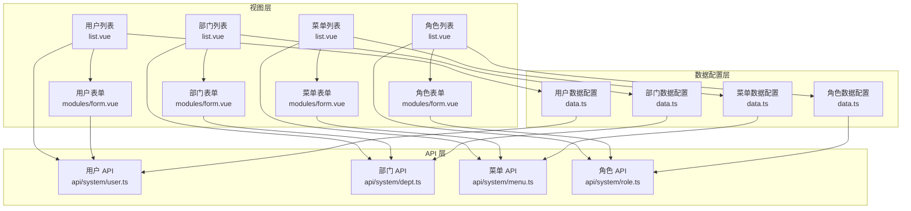
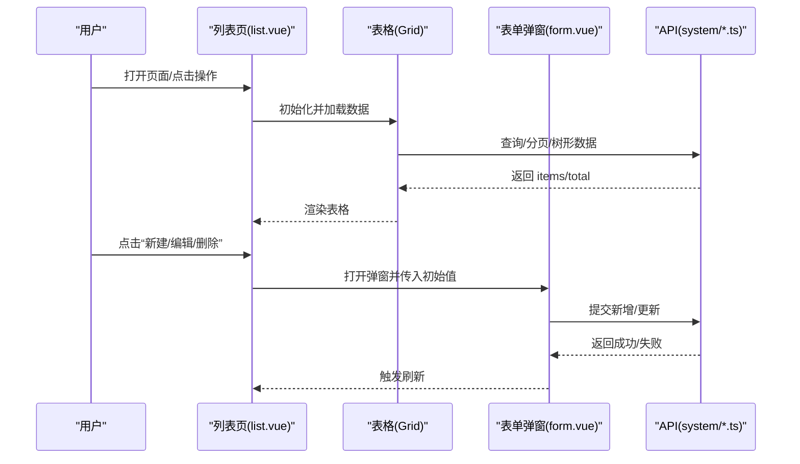
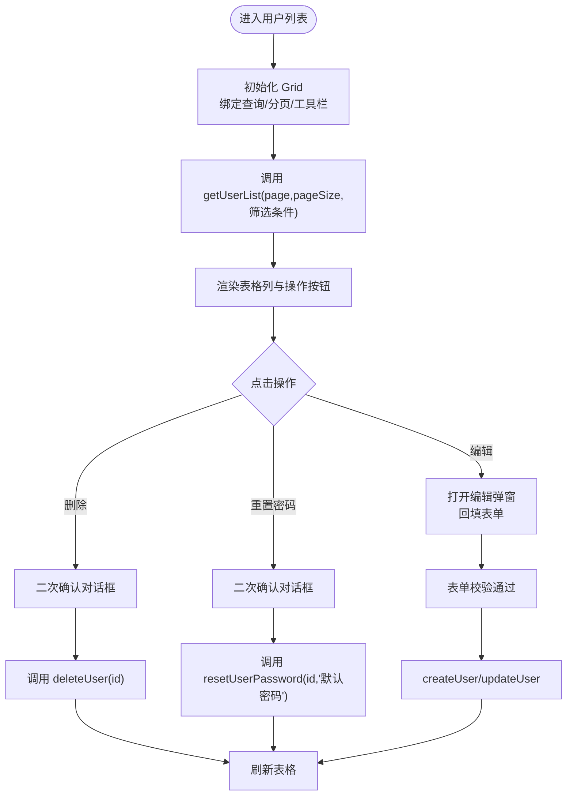
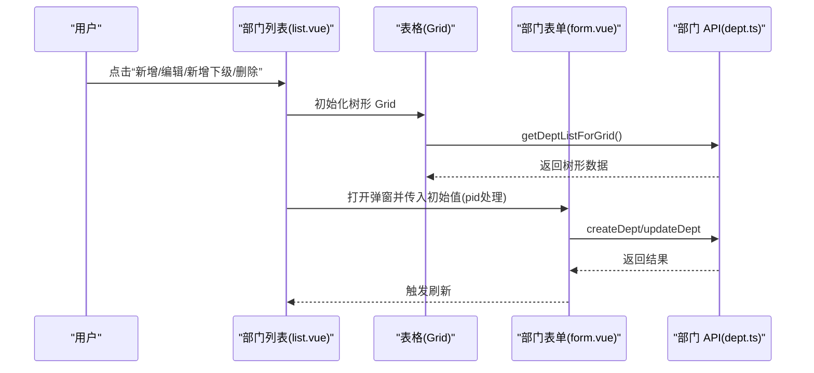
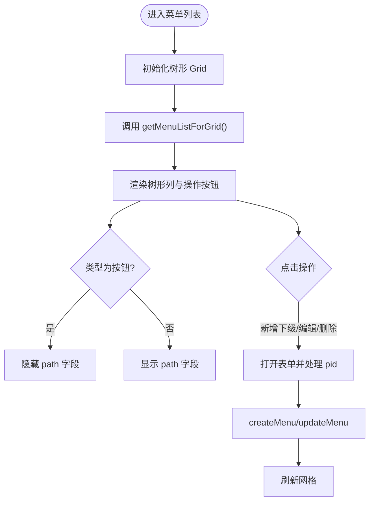
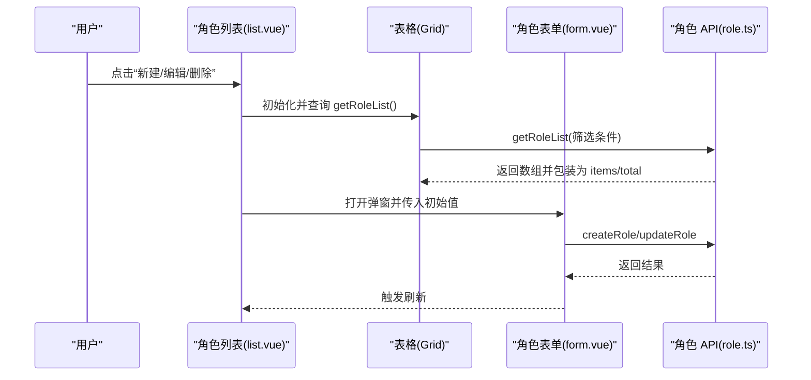
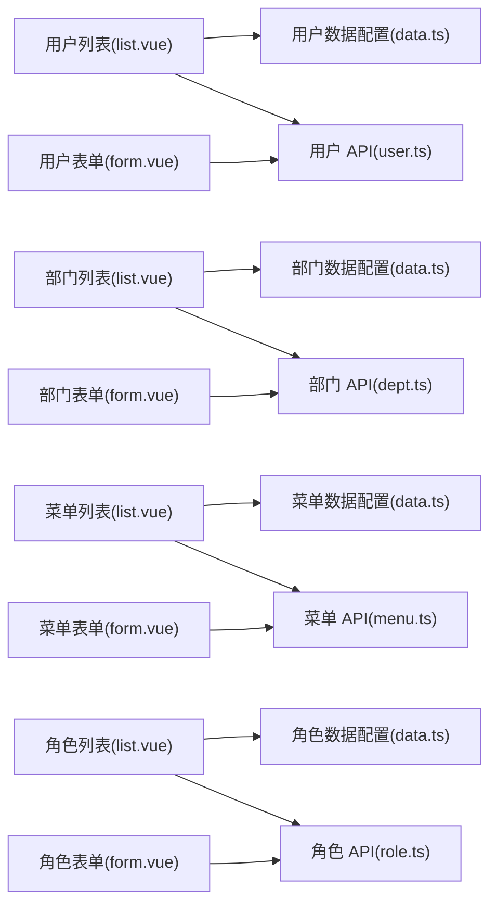

# 业务模块

<cite>
**本文引用的文件**
- [apps/web-naive/src/views/system/user/list.vue](file://apps/web-naive/src/views/system/user/list.vue)
- [apps/web-naive/src/views/system/user/data.ts](file://apps/web-naive/src/views/system/user/data.ts)
- [apps/web-naive/src/views/system/user/modules/form.vue](file://apps/web-naive/src/views/system/user/modules/form.vue)
- [apps/web-naive/src/api/system/user.ts](file://apps/web-naive/src/api/system/user.ts)
- [apps/web-naive/src/views/system/dept/list.vue](file://apps/web-naive/src/views/system/dept/list.vue)
- [apps/web-naive/src/views/system/dept/data.ts](file://apps/web-naive/src/views/system/dept/data.ts)
- [apps/web-naive/src/views/system/dept/modules/form.vue](file://apps/web-naive/src/views/system/dept/modules/form.vue)
- [apps/web-naive/src/api/system/dept.ts](file://apps/web-naive/src/api/system/dept.ts)
- [apps/web-naive/src/views/system/menu/list.vue](file://apps/web-naive/src/views/system/menu/list.vue)
- [apps/web-naive/src/views/system/menu/data.ts](file://apps/web-naive/src/views/system/menu/data.ts)
- [apps/web-naive/src/views/system/menu/modules/form.vue](file://apps/web-naive/src/views/system/menu/modules/form.vue)
- [apps/web-naive/src/api/system/menu.ts](file://apps/web-naive/src/api/system/menu.ts)
- [apps/web-naive/src/views/system/role/list.vue](file://apps/web-naive/src/views/system/role/list.vue)
- [apps/web-naive/src/views/system/role/data.ts](file://apps/web-naive/src/views/system/role/data.ts)
- [apps/web-naive/src/views/system/role/modules/form.vue](file://apps/web-naive/src/views/system/role/modules/form.vue)
- [apps/web-naive/src/api/system/role.ts](file://apps/web-naive/src/api/system/role.ts)
</cite>

## 目录

1. [引言](#引言)
2. [项目结构](#项目结构)
3. [核心组件](#核心组件)
4. [架构总览](#架构总览)
5. [详细组件分析](#详细组件分析)
6. [依赖分析](#依赖分析)
7. [性能考虑](#性能考虑)
8. [故障排查指南](#故障排查指南)
9. [结论](#结论)
10. [附录](#附录)

## 引言

本文件面向 shiyu-ui 项目的“系统管理”业务模块，系统性梳理用户管理、菜单管理、部门管理和角色管理四个子模块的设计与实现。内容涵盖数据模型、业务逻辑、界面交互、模块间关联与数据流转、CRUD 实现与校验规则，并提供扩展与定制化开发建议及最佳实践。

## 项目结构

系统管理模块位于前端应用的视图层与 API 层之间，采用“视图 + 数据配置 + 表单/表格适配 + API 请求”的分层组织方式：

- 视图层：各模块的列表页与表单弹窗，负责交互与事件编排
- 数据配置层：统一导出表格列、查询/编辑表单 Schema、校验规则等
- API 层：封装对后端接口的调用，屏蔽分页与响应差异
- 通用组件：基于 vxe-table 与表单库的 Grid/Modal/Form 组合

图表来源

- [apps/web-naive/src/views/system/user/list.vue:1-170](file://apps/web-naive/src/views/system/user/list.vue#L1-L170)
- [apps/web-naive/src/views/system/user/data.ts:1-192](file://apps/web-naive/src/views/system/user/data.ts#L1-L192)
- [apps/web-naive/src/views/system/user/modules/form.vue:1-84](file://apps/web-naive/src/views/system/user/modules/form.vue#L1-L84)
- [apps/web-naive/src/api/system/user.ts:1-99](file://apps/web-naive/src/api/system/user.ts#L1-L99)
- [apps/web-naive/src/views/system/dept/list.vue:1-141](file://apps/web-naive/src/views/system/dept/list.vue#L1-L141)
- [apps/web-naive/src/views/system/dept/data.ts:1-134](file://apps/web-naive/src/views/system/dept/data.ts#L1-L134)
- [apps/web-naive/src/views/system/dept/modules/form.vue:1-94](file://apps/web-naive/src/views/system/dept/modules/form.vue#L1-L94)
- [apps/web-naive/src/api/system/dept.ts:1-64](file://apps/web-naive/src/api/system/dept.ts#L1-L64)
- [apps/web-naive/src/views/system/menu/list.vue:1-155](file://apps/web-naive/src/views/system/menu/list.vue#L1-L155)
- [apps/web-naive/src/views/system/menu/data.ts:1-284](file://apps/web-naive/src/views/system/menu/data.ts#L1-L284)
- [apps/web-naive/src/views/system/menu/modules/form.vue:1-94](file://apps/web-naive/src/views/system/menu/modules/form.vue#L1-L94)
- [apps/web-naive/src/api/system/menu.ts:1-169](file://apps/web-naive/src/api/system/menu.ts#L1-L169)
- [apps/web-naive/src/views/system/role/list.vue:1-132](file://apps/web-naive/src/views/system/role/list.vue#L1-L132)
- [apps/web-naive/src/views/system/role/data.ts:1-132](file://apps/web-naive/src/views/system/role/data.ts#L1-L132)
- [apps/web-naive/src/views/system/role/modules/form.vue:1-84](file://apps/web-naive/src/views/system/role/modules/form.vue#L1-L84)
- [apps/web-naive/src/api/system/role.ts:1-56](file://apps/web-naive/src/api/system/role.ts#L1-L56)

章节来源

- [apps/web-naive/src/views/system/user/list.vue:1-170](file://apps/web-naive/src/views/system/user/list.vue#L1-L170)
- [apps/web-naive/src/views/system/dept/list.vue:1-141](file://apps/web-naive/src/views/system/dept/list.vue#L1-L141)
- [apps/web-naive/src/views/system/menu/list.vue:1-155](file://apps/web-naive/src/views/system/menu/list.vue#L1-L155)
- [apps/web-naive/src/views/system/role/list.vue:1-132](file://apps/web-naive/src/views/system/role/list.vue#L1-L132)

## 核心组件

- 列表页组件：统一使用 vxe-table Grid，支持树形结构（菜单、部门）、分页代理、工具栏、操作列等
- 表单弹窗组件：统一使用 Modal + Form，支持动态 Schema、条件依赖、必填与长度/格式校验
- API 层：统一请求客户端封装，屏蔽后端分页字段差异与响应格式差异
- 数据配置层：集中导出 columns/schema/rules，便于复用与扩展

章节来源

- [apps/web-naive/src/views/system/user/data.ts:1-192](file://apps/web-naive/src/views/system/user/data.ts#L1-L192)
- [apps/web-naive/src/views/system/dept/data.ts:1-134](file://apps/web-naive/src/views/system/dept/data.ts#L1-L134)
- [apps/web-naive/src/views/system/menu/data.ts:1-284](file://apps/web-naive/src/views/system/menu/data.ts#L1-L284)
- [apps/web-naive/src/views/system/role/data.ts:1-132](file://apps/web-naive/src/views/system/role/data.ts#L1-L132)
- [apps/web-naive/src/api/system/user.ts:1-99](file://apps/web-naive/src/api/system/user.ts#L1-L99)
- [apps/web-naive/src/api/system/dept.ts:1-64](file://apps/web-naive/src/api/system/dept.ts#L1-L64)
- [apps/web-naive/src/api/system/menu.ts:1-169](file://apps/web-naive/src/api/system/menu.ts#L1-L169)
- [apps/web-naive/src/api/system/role.ts:1-56](file://apps/web-naive/src/api/system/role.ts#L1-L56)

## 架构总览

系统管理模块遵循“视图-数据-API”三层解耦设计，通过统一的 Grid/Modal/Form 组件组合实现一致的 CRUD 体验；API 层对后端接口进行薄封装，保证前端对数据格式的一致性预期。

图表来源

- [apps/web-naive/src/views/system/user/list.vue:118-148](file://apps/web-naive/src/views/system/user/list.vue#L118-L148)
- [apps/web-naive/src/views/system/user/modules/form.vue:36-79](file://apps/web-naive/src/views/system/user/modules/form.vue#L36-L79)
- [apps/web-naive/src/api/system/user.ts:33-50](file://apps/web-naive/src/api/system/user.ts#L33-L50)
- [apps/web-naive/src/views/system/dept/list.vue:91-119](file://apps/web-naive/src/views/system/dept/list.vue#L91-L119)
- [apps/web-naive/src/views/system/dept/modules/form.vue:36-79](file://apps/web-naive/src/views/system/dept/modules/form.vue#L36-L79)
- [apps/web-naive/src/api/system/dept.ts:26-30](file://apps/web-naive/src/api/system/dept.ts#L26-L30)
- [apps/web-naive/src/views/system/menu/list.vue:91-119](file://apps/web-naive/src/views/system/menu/list.vue#L91-L119)
- [apps/web-naive/src/views/system/menu/modules/form.vue:36-79](file://apps/web-naive/src/views/system/menu/modules/form.vue#L36-L79)
- [apps/web-naive/src/api/system/menu.ts:105-109](file://apps/web-naive/src/api/system/menu.ts#L105-L109)
- [apps/web-naive/src/views/system/role/list.vue:79-110](file://apps/web-naive/src/views/system/role/list.vue#L79-L110)
- [apps/web-naive/src/views/system/role/modules/form.vue:36-79](file://apps/web-naive/src/views/system/role/modules/form.vue#L36-L79)
- [apps/web-naive/src/api/system/role.ts:20-24](file://apps/web-naive/src/api/system/role.ts#L20-L24)

## 详细组件分析

### 用户管理

- 数据模型：包含用户名、昵称、邮箱、手机、部门、状态、备注、创建时间等字段
- 表单校验：用户名/昵称必填，邮箱可选且需符合格式，手机号可选且需符合中国大陆手机号格式，备注最多 200 字符
- 列表功能：支持按用户名/昵称/状态筛选，展示用户基本信息与状态标签，右侧提供“重置密码/编辑/删除”操作
- CRUD 实现：列表页通过 Grid 的 proxyConfig.ajax.query 调用分页接口；表单弹窗提交时根据是否存在 id 决定新增或更新；删除前二次确认，成功后刷新表格
- 特殊逻辑：重置密码时弹出确认对话框并提示默认密码

图表来源

- [apps/web-naive/src/views/system/user/list.vue:118-148](file://apps/web-naive/src/views/system/user/list.vue#L118-L148)
- [apps/web-naive/src/views/system/user/data.ts:47-120](file://apps/web-naive/src/views/system/user/data.ts#L47-L120)
- [apps/web-naive/src/views/system/user/modules/form.vue:36-79](file://apps/web-naive/src/views/system/user/modules/form.vue#L36-L79)
- [apps/web-naive/src/api/system/user.ts:33-90](file://apps/web-naive/src/api/system/user.ts#L33-L90)

章节来源

- [apps/web-naive/src/views/system/user/list.vue:1-170](file://apps/web-naive/src/views/system/user/list.vue#L1-L170)
- [apps/web-naive/src/views/system/user/data.ts:1-192](file://apps/web-naive/src/views/system/user/data.ts#L1-L192)
- [apps/web-naive/src/views/system/user/modules/form.vue:1-84](file://apps/web-naive/src/views/system/user/modules/form.vue#L1-L84)
- [apps/web-naive/src/api/system/user.ts:1-99](file://apps/web-naive/src/api/system/user.ts#L1-L99)

### 部门管理

- 数据模型：部门名称、父级部门、状态、备注、创建时间等；支持树形结构
- 表单校验：部门名称长度 2~20；备注最多 50 字符；状态为启用/禁用
- 列表功能：树形展示，支持“新增下级/编辑/删除”，删除按钮在存在子节点时禁用
- CRUD 实现：列表页使用树形配置与 getDeptListForGrid；表单提交时将 pid=0 的情况转换为 undefined，避免后端错误

图表来源

- [apps/web-naive/src/views/system/dept/list.vue:91-119](file://apps/web-naive/src/views/system/dept/list.vue#L91-L119)
- [apps/web-naive/src/views/system/dept/data.ts:75-133](file://apps/web-naive/src/views/system/dept/data.ts#L75-L133)
- [apps/web-naive/src/views/system/dept/modules/form.vue:36-79](file://apps/web-naive/src/views/system/dept/modules/form.vue#L36-L79)
- [apps/web-naive/src/api/system/dept.ts:26-61](file://apps/web-naive/src/api/system/dept.ts#L26-L61)

章节来源

- [apps/web-naive/src/views/system/dept/list.vue:1-141](file://apps/web-naive/src/views/system/dept/list.vue#L1-L141)
- [apps/web-naive/src/views/system/dept/data.ts:1-134](file://apps/web-naive/src/views/system/dept/data.ts#L1-L134)
- [apps/web-naive/src/views/system/dept/modules/form.vue:1-94](file://apps/web-naive/src/views/system/dept/modules/form.vue#L1-L94)
- [apps/web-naive/src/api/system/dept.ts:1-64](file://apps/web-naive/src/api/system/dept.ts#L1-L64)

### 菜单管理

- 数据模型：菜单名称、父级、类型（目录/菜单/内嵌/链接/按钮）、路径、组件、权限码、元信息（图标、标题、keepAlive、hideInMenu 等）、状态等
- 表单校验：菜单名必填；根据类型动态控制部分字段可见性（如按钮类型不显示 path），并进行相应依赖校验
- 列表功能：树形展示，支持“新增下级/编辑/删除”，图标列根据类型显示不同图标
- CRUD 实现：列表页使用树形配置与 getMenuListForGrid；表单提交时将 pid=0 的情况转换为 undefined

图表来源

- [apps/web-naive/src/views/system/menu/list.vue:91-119](file://apps/web-naive/src/views/system/menu/list.vue#L91-L119)
- [apps/web-naive/src/views/system/menu/data.ts:66-191](file://apps/web-naive/src/views/system/menu/data.ts#L66-L191)
- [apps/web-naive/src/views/system/menu/modules/form.vue:36-79](file://apps/web-naive/src/views/system/menu/modules/form.vue#L36-L79)
- [apps/web-naive/src/api/system/menu.ts:105-158](file://apps/web-naive/src/api/system/menu.ts#L105-L158)

章节来源

- [apps/web-naive/src/views/system/menu/list.vue:1-155](file://apps/web-naive/src/views/system/menu/list.vue#L1-L155)
- [apps/web-naive/src/views/system/menu/data.ts:1-284](file://apps/web-naive/src/views/system/menu/data.ts#L1-L284)
- [apps/web-naive/src/views/system/menu/modules/form.vue:1-94](file://apps/web-naive/src/views/system/menu/modules/form.vue#L1-L94)
- [apps/web-naive/src/api/system/menu.ts:1-169](file://apps/web-naive/src/api/system/menu.ts#L1-L169)

### 角色管理

- 数据模型：角色名称、状态、备注、创建时间等
- 表单校验：角色名必填，备注最多 100 字符
- 列表功能：支持按名称/状态筛选，展示角色基本信息与状态标签，右侧提供“编辑/删除”操作
- CRUD 实现：列表页通过 Grid 的 proxyConfig.ajax.query 调用 getRoleList；表单提交时根据是否存在 id 决定新增或更新

图表来源

- [apps/web-naive/src/views/system/role/list.vue:79-110](file://apps/web-naive/src/views/system/role/list.vue#L79-L110)
- [apps/web-naive/src/views/system/role/data.ts:13-131](file://apps/web-naive/src/views/system/role/data.ts#L13-L131)
- [apps/web-naive/src/views/system/role/modules/form.vue:36-79](file://apps/web-naive/src/views/system/role/modules/form.vue#L36-L79)
- [apps/web-naive/src/api/system/role.ts:20-53](file://apps/web-naive/src/api/system/role.ts#L20-L53)

章节来源

- [apps/web-naive/src/views/system/role/list.vue:1-132](file://apps/web-naive/src/views/system/role/list.vue#L1-L132)
- [apps/web-naive/src/views/system/role/data.ts:1-132](file://apps/web-naive/src/views/system/role/data.ts#L1-L132)
- [apps/web-naive/src/views/system/role/modules/form.vue:1-84](file://apps/web-naive/src/views/system/role/modules/form.vue#L1-L84)
- [apps/web-naive/src/api/system/role.ts:1-56](file://apps/web-naive/src/api/system/role.ts#L1-L56)

## 依赖分析

- 视图到数据：各模块列表页依赖 data.ts 导出的 columns/schema，形成“配置驱动”的 UI 定义
- 视图到 API：列表页通过 Grid 的 proxyConfig.ajax.query 调用对应 API；表单弹窗通过 API 进行 CRUD
- 表单依赖：表单 Schema 使用条件依赖（如菜单类型影响字段可见性），并在提交前进行校验
- 树形结构：部门与菜单均使用 treeConfig，父/子字段约定为 pid/id，提交时对 pid=0 做空值处理

图表来源

- [apps/web-naive/src/views/system/user/list.vue:1-170](file://apps/web-naive/src/views/system/user/list.vue#L1-L170)
- [apps/web-naive/src/views/system/user/data.ts:1-192](file://apps/web-naive/src/views/system/user/data.ts#L1-L192)
- [apps/web-naive/src/views/system/user/modules/form.vue:1-84](file://apps/web-naive/src/views/system/user/modules/form.vue#L1-L84)
- [apps/web-naive/src/api/system/user.ts:1-99](file://apps/web-naive/src/api/system/user.ts#L1-L99)
- [apps/web-naive/src/views/system/dept/list.vue:1-141](file://apps/web-naive/src/views/system/dept/list.vue#L1-L141)
- [apps/web-naive/src/views/system/dept/data.ts:1-134](file://apps/web-naive/src/views/system/dept/data.ts#L1-L134)
- [apps/web-naive/src/views/system/dept/modules/form.vue:1-94](file://apps/web-naive/src/views/system/dept/modules/form.vue#L1-L94)
- [apps/web-naive/src/api/system/dept.ts:1-64](file://apps/web-naive/src/api/system/dept.ts#L1-L64)
- [apps/web-naive/src/views/system/menu/list.vue:1-155](file://apps/web-naive/src/views/system/menu/list.vue#L1-L155)
- [apps/web-naive/src/views/system/menu/data.ts:1-284](file://apps/web-naive/src/views/system/menu/data.ts#L1-L284)
- [apps/web-naive/src/views/system/menu/modules/form.vue:1-94](file://apps/web-naive/src/views/system/menu/modules/form.vue#L1-L94)
- [apps/web-naive/src/api/system/menu.ts:1-169](file://apps/web-naive/src/api/system/menu.ts#L1-L169)
- [apps/web-naive/src/views/system/role/list.vue:1-132](file://apps/web-naive/src/views/system/role/list.vue#L1-L132)
- [apps/web-naive/src/views/system/role/data.ts:1-132](file://apps/web-naive/src/views/system/role/data.ts#L1-L132)
- [apps/web-naive/src/views/system/role/modules/form.vue:1-84](file://apps/web-naive/src/views/system/role/modules/form.vue#L1-L84)
- [apps/web-naive/src/api/system/role.ts:1-56](file://apps/web-naive/src/api/system/role.ts#L1-L56)

章节来源

- [apps/web-naive/src/views/system/user/data.ts:1-192](file://apps/web-naive/src/views/system/user/data.ts#L1-L192)
- [apps/web-naive/src/views/system/dept/data.ts:1-134](file://apps/web-naive/src/views/system/dept/data.ts#L1-L134)
- [apps/web-naive/src/views/system/menu/data.ts:1-284](file://apps/web-naive/src/views/system/menu/data.ts#L1-L284)
- [apps/web-naive/src/views/system/role/data.ts:1-132](file://apps/web-naive/src/views/system/role/data.ts#L1-L132)

## 性能考虑

- 列表分页：用户/角色列表使用分页代理查询，减少一次性传输量；部门/菜单列表使用树形一次性加载，适合层级较浅场景
- 表单校验：在提交前进行本地校验，避免无效请求；对长文本字段设置 maxLength 并开启计数，提升输入体验
- 操作反馈：删除/重置密码等异步操作使用消息提示与加载遮罩，避免重复提交
- 扩展建议：若部门/菜单层级过深，可考虑懒加载或后端树形分页接口以优化首屏性能

## 故障排查指南

- 删除失败：检查后端是否允许删除存在子节点的部门；菜单/用户删除失败时查看网络请求状态码与后端日志
- 表单提交失败：确认表单校验是否通过；检查必填字段与格式校验（邮箱/手机号）；关注二次确认对话框触发逻辑
- 树形数据异常：确认 pid 与 id 的映射关系；提交时将 pid=0 转换为 undefined；检查后端树形构建逻辑
- 重置密码：确认后端是否支持默认密码重置接口；注意弹窗二次确认与成功提示

章节来源

- [apps/web-naive/src/views/system/user/list.vue:45-93](file://apps/web-naive/src/views/system/user/list.vue#L45-L93)
- [apps/web-naive/src/views/system/dept/list.vue:53-66](file://apps/web-naive/src/views/system/dept/list.vue#L53-L66)
- [apps/web-naive/src/views/system/menu/list.vue:53-66](file://apps/web-naive/src/views/system/menu/list.vue#L53-L66)
- [apps/web-naive/src/views/system/role/list.vue:45-58](file://apps/web-naive/src/views/system/role/list.vue#L45-L58)

## 结论

系统管理模块通过统一的 Grid/Modal/Form 与数据配置，实现了用户、部门、菜单、角色四类实体的一致化 CRUD 体验。模块间通过 API 层解耦，具备良好的可维护性与扩展性。建议在后续迭代中进一步完善权限与审计日志、引入更细粒度的校验与权限控制，并针对大数据量场景优化树形加载策略。

## 附录

- 扩展指南
  - 新增字段：在对应 data.ts 的 useSchema/useColumns 中添加字段定义与校验规则
  - 动态字段：利用表单 Schema 的 dependencies 控制字段显隐与联动
  - 树形扩展：保持 pid/id 映射一致，提交时统一处理 pid=0
  - 自定义校验：基于表单库的 zod 规则扩展复杂校验逻辑
- 最佳实践
  - 优先使用统一的 Grid/Modal/Form 组件组合
  - 对外暴露的 API 尽量保持稳定字段命名与响应格式
  - 严格区分“查询/编辑”两套 Schema，避免混用
  - 对关键操作（删除/重置密码）增加二次确认与加载提示
