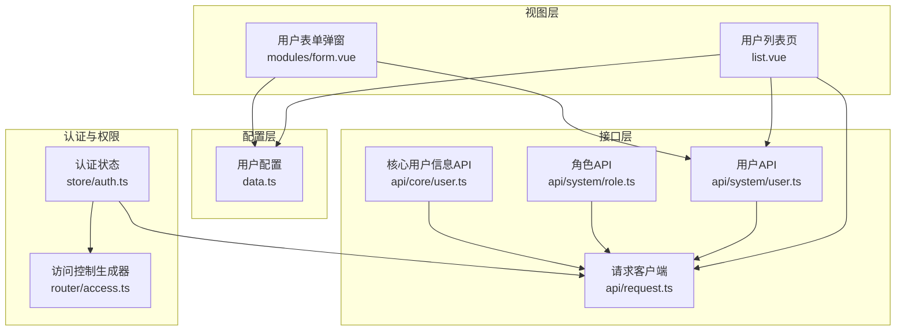
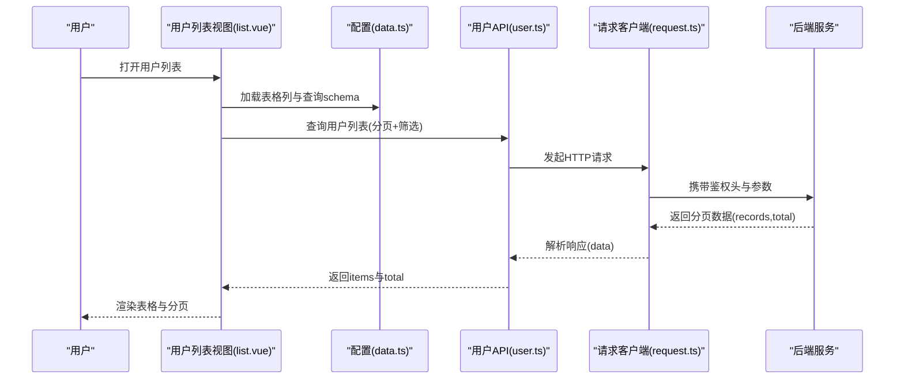
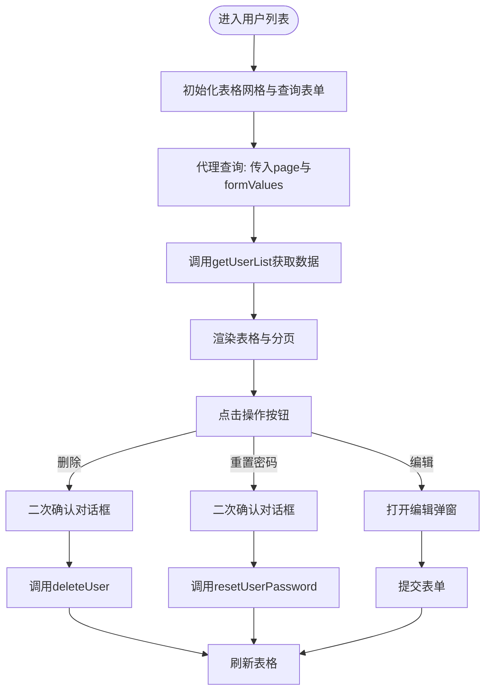
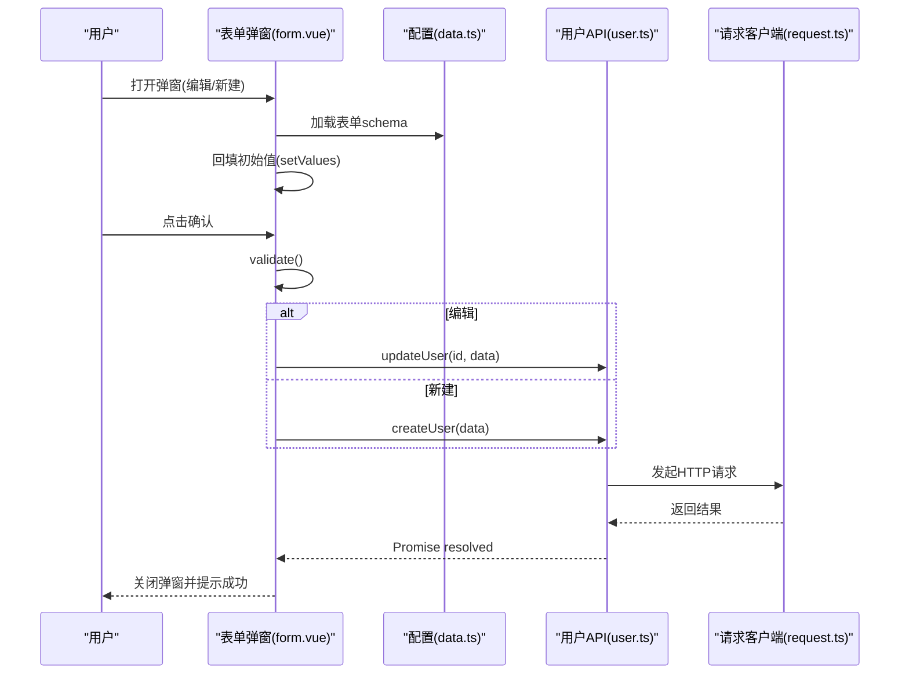
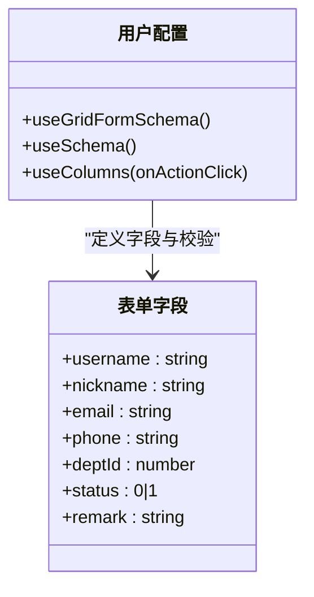
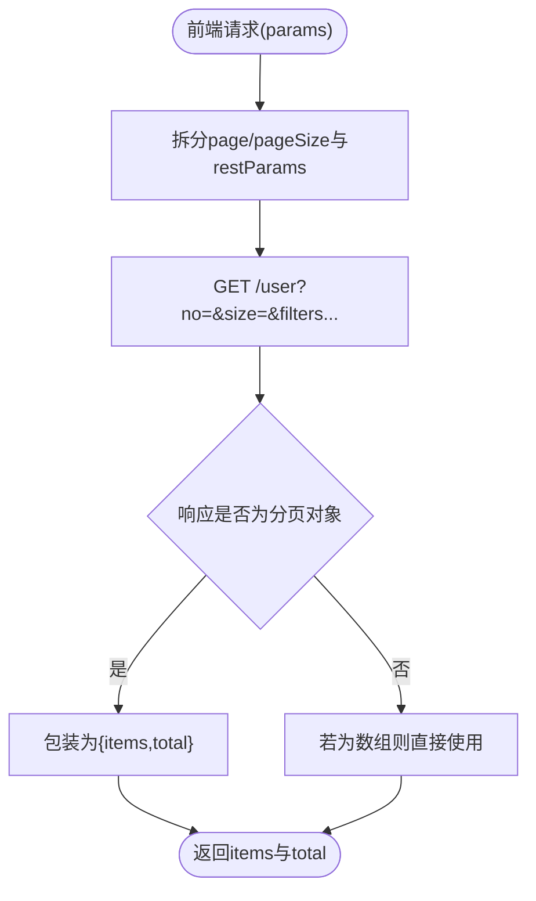
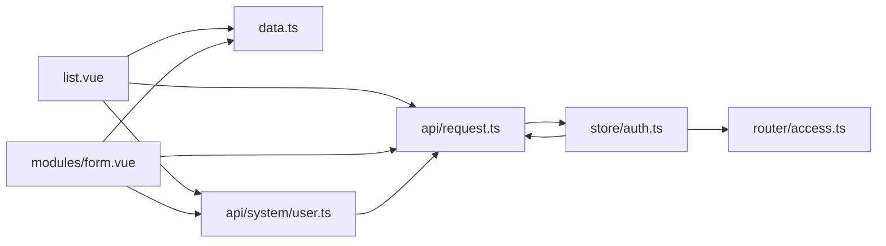

# 用户管理

<cite>
**本文引用的文件**
- [apps/web-naive/src/views/system/user/list.vue](file://apps/web-naive/src/views/system/user/list.vue)
- [apps/web-naive/src/views/system/user/modules/form.vue](file://apps/web-naive/src/views/system/user/modules/form.vue)
- [apps/web-naive/src/views/system/user/data.ts](file://apps/web-naive/src/views/system/user/data.ts)
- [apps/web-naive/src/api/system/user.ts](file://apps/web-naive/src/api/system/user.ts)
- [apps/web-naive/src/api/system/role.ts](file://apps/web-naive/src/api/system/role.ts)
- [apps/web-naive/src/api/core/user.ts](file://apps/web-naive/src/api/core/user.ts)
- [apps/web-naive/src/api/request.ts](file://apps/web-naive/src/api/request.ts)
- [apps/web-naive/src/store/auth.ts](file://apps/web-naive/src/store/auth.ts)
- [apps/web-naive/src/router/access.ts](file://apps/web-naive/src/router/access.ts)
- [apps/web-naive/src/locales/langs/zh-CN/system.json](file://apps/web-naive/src/locales/langs/zh-CN/system.json)
- [apps/web-naive/src/locales/langs/en-US/system.json](file://apps/web-naive/src/locales/langs/en-US/system.json)
</cite>

## 目录

1. [简介](#简介)
2. [项目结构](#项目结构)
3. [核心组件](#核心组件)
4. [架构总览](#架构总览)
5. [详细组件分析](#详细组件分析)
6. [依赖分析](#依赖分析)
7. [性能考量](#性能考量)
8. [故障排查指南](#故障排查指南)
9. [结论](#结论)
10. [附录](#附录)

## 简介

本文件面向开发者与维护者，系统性梳理用户管理模块的设计与实现，覆盖以下关键主题：

- 用户列表展示与分页加载
- 用户表单编辑与创建流程
- 用户删除与密码重置
- 用户数据模型、字段定义与验证规则
- 权限与角色关联（基于现有角色接口的扩展建议）
- 用户状态管理与批量操作能力现状与扩展思路
- 数据导入导出、搜索过滤与分页加载的实现细节
- 最佳实践与安全注意事项

## 项目结构

用户管理模块位于前端应用的系统管理子模块下，采用“视图 + 数据配置 + API 调用”的分层组织方式：

- 视图层：用户列表页与用户表单弹窗
- 配置层：表格列、表单字段与校验规则
- 接口层：用户与角色的后端交互封装
- 认证与权限：统一请求拦截、鉴权与菜单生成

图表来源

- [apps/web-naive/src/views/system/user/list.vue:118-148](file://apps/web-naive/src/views/system/user/list.vue#L118-L148)
- [apps/web-naive/src/views/system/user/modules/form.vue:25-69](file://apps/web-naive/src/views/system/user/modules/form.vue#L25-L69)
- [apps/web-naive/src/views/system/user/data.ts:14-120](file://apps/web-naive/src/views/system/user/data.ts#L14-L120)
- [apps/web-naive/src/api/system/user.ts:33-90](file://apps/web-naive/src/api/system/user.ts#L33-L90)
- [apps/web-naive/src/api/system/role.ts:20-53](file://apps/web-naive/src/api/system/role.ts#L20-L53)
- [apps/web-naive/src/api/core/user.ts:8-10](file://apps/web-naive/src/api/core/user.ts#L8-L10)
- [apps/web-naive/src/api/request.ts:23-111](file://apps/web-naive/src/api/request.ts#L23-L111)
- [apps/web-naive/src/store/auth.ts:16-118](file://apps/web-naive/src/store/auth.ts#L16-L118)
- [apps/web-naive/src/router/access.ts:16-38](file://apps/web-naive/src/router/access.ts#L16-L38)

章节来源

- [apps/web-naive/src/views/system/user/list.vue:1-170](file://apps/web-naive/src/views/system/user/list.vue#L1-L170)
- [apps/web-naive/src/views/system/user/modules/form.vue:1-84](file://apps/web-naive/src/views/system/user/modules/form.vue#L1-L84)
- [apps/web-naive/src/views/system/user/data.ts:1-192](file://apps/web-naive/src/views/system/user/data.ts#L1-L192)
- [apps/web-naive/src/api/system/user.ts:1-99](file://apps/web-naive/src/api/system/user.ts#L1-L99)
- [apps/web-naive/src/api/system/role.ts:1-56](file://apps/web-naive/src/api/system/role.ts#L1-L56)
- [apps/web-naive/src/api/core/user.ts:1-11](file://apps/web-naive/src/api/core/user.ts#L1-L11)
- [apps/web-naive/src/api/request.ts:1-114](file://apps/web-naive/src/api/request.ts#L1-L114)
- [apps/web-naive/src/store/auth.ts:1-119](file://apps/web-naive/src/store/auth.ts#L1-L119)
- [apps/web-naive/src/router/access.ts:1-41](file://apps/web-naive/src/router/access.ts#L1-L41)

## 核心组件

- 用户列表页：负责分页查询、搜索过滤、操作按钮（编辑、删除、重置密码）、刷新与工具栏集成。
- 用户表单弹窗：负责用户新增与编辑的表单渲染、字段校验、提交与成功回调。
- 用户配置：集中定义表格列、查询表单字段、表单字段与校验规则。
- 用户API：封装用户列表、创建、更新、删除、重置密码等接口。
- 角色API：提供角色列表等能力，用于后续扩展角色关联与权限分配。
- 请求客户端：统一封装鉴权头、响应格式、错误处理与自动刷新令牌。
- 认证与权限：提供登录、登出、获取用户信息、菜单生成与访问控制。

章节来源

- [apps/web-naive/src/views/system/user/list.vue:1-170](file://apps/web-naive/src/views/system/user/list.vue#L1-L170)
- [apps/web-naive/src/views/system/user/modules/form.vue:1-84](file://apps/web-naive/src/views/system/user/modules/form.vue#L1-L84)
- [apps/web-naive/src/views/system/user/data.ts:1-192](file://apps/web-naive/src/views/system/user/data.ts#L1-L192)
- [apps/web-naive/src/api/system/user.ts:1-99](file://apps/web-naive/src/api/system/user.ts#L1-L99)
- [apps/web-naive/src/api/system/role.ts:1-56](file://apps/web-naive/src/api/system/role.ts#L1-L56)
- [apps/web-naive/src/api/request.ts:1-114](file://apps/web-naive/src/api/request.ts#L1-L114)
- [apps/web-naive/src/store/auth.ts:1-119](file://apps/web-naive/src/store/auth.ts#L1-L119)
- [apps/web-naive/src/router/access.ts:1-41](file://apps/web-naive/src/router/access.ts#L1-L41)

## 架构总览

用户管理模块遵循“视图-配置-接口-认证”的分层设计，通过统一请求客户端完成鉴权与错误处理，结合 Pinia 状态管理与路由访问控制，形成完整的用户生命周期管理闭环。

图表来源

- [apps/web-naive/src/views/system/user/list.vue:118-148](file://apps/web-naive/src/views/system/user/list.vue#L118-L148)
- [apps/web-naive/src/views/system/user/data.ts:14-42](file://apps/web-naive/src/views/system/user/data.ts#L14-L42)
- [apps/web-naive/src/api/system/user.ts:33-50](file://apps/web-naive/src/api/system/user.ts#L33-L50)
- [apps/web-naive/src/api/request.ts:74-104](file://apps/web-naive/src/api/request.ts#L74-L104)

## 详细组件分析

### 用户列表页（list.vue）

- 功能职责
  - 初始化表格网格与查询表单
  - 定义操作列（编辑、删除、重置密码）
  - 支持分页代理查询与工具栏自定义
  - 统一消息提示与加载状态
- 关键流程
  - 表格代理查询：将分页参数与表单值传递给后端，兼容后端返回数组或分页对象
  - 操作按钮：点击后触发对应动作，包含二次确认与加载提示
  - 刷新：提交成功后主动刷新表格数据
- 交互细节
  - 工具栏新增按钮触发新建弹窗
  - 操作列通过 CellOperation 渲染，支持右对齐与固定列

图表来源

- [apps/web-naive/src/views/system/user/list.vue:118-148](file://apps/web-naive/src/views/system/user/list.vue#L118-L148)
- [apps/web-naive/src/api/system/user.ts:33-90](file://apps/web-naive/src/api/system/user.ts#L33-L90)

章节来源

- [apps/web-naive/src/views/system/user/list.vue:1-170](file://apps/web-naive/src/views/system/user/list.vue#L1-L170)

### 用户表单弹窗（modules/form.vue）

- 功能职责
  - 基于配置渲染表单字段与校验规则
  - 支持新增与编辑两种模式
  - 提交时进行表单校验，调用创建或更新接口
  - 成功后关闭弹窗并触发父级刷新
- 关键流程
  - 打开时读取传入数据并回填
  - 确认时先 validate，再根据是否存在 id 决定创建或更新
  - 成功后发出 success 事件，父组件刷新表格

图表来源

- [apps/web-naive/src/views/system/user/modules/form.vue:25-69](file://apps/web-naive/src/views/system/user/modules/form.vue#L25-L69)
- [apps/web-naive/src/views/system/user/data.ts:47-120](file://apps/web-naive/src/views/system/user/data.ts#L47-L120)
- [apps/web-naive/src/api/system/user.ts:56-73](file://apps/web-naive/src/api/system/user.ts#L56-L73)
- [apps/web-naive/src/api/request.ts:23-111](file://apps/web-naive/src/api/request.ts#L23-L111)

章节来源

- [apps/web-naive/src/views/system/user/modules/form.vue:1-84](file://apps/web-naive/src/views/system/user/modules/form.vue#L1-L84)

### 用户配置（data.ts）

- 表格列配置：包含基础字段与状态标签渲染、操作列与固定列
- 查询表单schema：用户名、昵称、状态筛选
- 表单schema：用户名、昵称、邮箱、手机、所属部门、状态、备注，并内置多项校验规则
- 校验策略：必填、邮箱格式、手机号格式、最大长度等

图表来源

- [apps/web-naive/src/views/system/user/data.ts:14-120](file://apps/web-naive/src/views/system/user/data.ts#L14-L120)

章节来源

- [apps/web-naive/src/views/system/user/data.ts:1-192](file://apps/web-naive/src/views/system/user/data.ts#L1-L192)

### 用户API（api/system/user.ts）

- 数据模型：定义 SystemUser 与 PageResult 结构
- 列表查询：兼容后端返回数组或分页对象，统一转换为 items/total
- CRUD 与密码重置：提供创建、更新、删除、重置密码接口
- 参数映射：将前端 page/pageSize 映射为后端 pageNo/pageSize

图表来源

- [apps/web-naive/src/api/system/user.ts:33-50](file://apps/web-naive/src/api/system/user.ts#L33-L50)

章节来源

- [apps/web-naive/src/api/system/user.ts:1-99](file://apps/web-naive/src/api/system/user.ts#L1-L99)

### 角色API（api/system/role.ts）

- 角色列表：提供获取角色列表的能力
- 角色CRUD：提供创建、更新、删除角色接口
- 扩展建议：用户与角色的关联可通过用户模型中的 roleIds 字段实现，配合角色列表进行选择与保存

章节来源

- [apps/web-naive/src/api/system/role.ts:1-56](file://apps/web-naive/src/api/system/role.ts#L1-L56)

### 请求客户端（api/request.ts）

- 统一请求拦截：注入 Authorization 与 Accept-Language
- 统一响应拦截：解析 code/data/total 等字段，标准化成功与失败
- 自动刷新令牌：在认证失效时尝试刷新或触发重新认证
- 错误提示：兜底错误消息提示

章节来源

- [apps/web-naive/src/api/request.ts:1-114](file://apps/web-naive/src/api/request.ts#L1-L114)

### 认证与权限（store/auth.ts、router/access.ts）

- 认证状态：登录、登出、获取用户信息、设置访问码
- 菜单与路由：通过访问控制生成器动态加载菜单与路由
- 与用户管理的衔接：登录成功后获取用户信息与访问码，支撑用户列表与操作权限

章节来源

- [apps/web-naive/src/store/auth.ts:1-119](file://apps/web-naive/src/store/auth.ts#L1-L119)
- [apps/web-naive/src/router/access.ts:1-41](file://apps/web-naive/src/router/access.ts#L1-L41)

## 依赖分析

- 视图层依赖配置层与接口层；配置层依赖国际化资源与部门API（用于部门选择）
- 接口层依赖请求客户端，统一处理鉴权与错误
- 认证与权限层贯穿登录、菜单生成与访问控制

图表来源

- [apps/web-naive/src/views/system/user/list.vue:1-170](file://apps/web-naive/src/views/system/user/list.vue#L1-L170)
- [apps/web-naive/src/views/system/user/modules/form.vue:1-84](file://apps/web-naive/src/views/system/user/modules/form.vue#L1-L84)
- [apps/web-naive/src/views/system/user/data.ts:1-192](file://apps/web-naive/src/views/system/user/data.ts#L1-L192)
- [apps/web-naive/src/api/system/user.ts:1-99](file://apps/web-naive/src/api/system/user.ts#L1-L99)
- [apps/web-naive/src/api/request.ts:1-114](file://apps/web-naive/src/api/request.ts#L1-L114)
- [apps/web-naive/src/store/auth.ts:1-119](file://apps/web-naive/src/store/auth.ts#L1-L119)
- [apps/web-naive/src/router/access.ts:1-41](file://apps/web-naive/src/router/access.ts#L1-L41)

## 性能考量

- 列表分页：使用代理查询与分页配置，避免一次性加载大量数据
- 表单校验：在提交前进行本地校验，减少无效网络请求
- 消息与加载：对删除与重置密码等耗时操作显示加载提示，提升用户体验
- 请求复用：统一请求客户端，减少重复逻辑与错误处理成本

## 故障排查指南

- 列表不刷新
  - 确认提交成功后是否调用了刷新方法
  - 检查代理查询是否正确传入 page 与 formValues
- 删除失败
  - 查看错误拦截器提示，确认后端返回的错误信息
  - 检查鉴权头是否正确注入
- 密码重置异常
  - 确认接口路径与参数是否正确
  - 检查二次确认逻辑与加载提示
- 登录态失效
  - 检查自动刷新令牌流程与重新认证逻辑
  - 确认访问码与菜单生成是否正常

章节来源

- [apps/web-naive/src/views/system/user/list.vue:45-93](file://apps/web-naive/src/views/system/user/list.vue#L45-L93)
- [apps/web-naive/src/api/request.ts:82-104](file://apps/web-naive/src/api/request.ts#L82-L104)
- [apps/web-naive/src/store/auth.ts:32-79](file://apps/web-naive/src/store/auth.ts#L32-L79)

## 结论

用户管理模块以清晰的分层设计实现了用户列表、表单编辑、创建与删除、密码重置等核心功能，并通过统一请求客户端与认证体系保障了安全性与一致性。当前版本聚焦于用户基础字段与状态管理，角色与权限分配可基于现有角色API进行扩展。建议在后续迭代中补充角色关联、批量操作、数据导入导出与更丰富的搜索过滤能力。

## 附录

### 用户数据模型与字段定义

- 字段说明（来源于用户API模型与表单配置）
  - id：用户唯一标识
  - username：用户名
  - nickname：昵称
  - email：邮箱（可选，需符合邮箱格式）
  - phone：手机号（可选，需符合手机号格式）
  - deptId：所属部门ID（通过 ApiSelect 选择）
  - status：状态（启用/禁用）
  - remark：备注（最多200字符）
  - createTime：创建时间
  - roleIds：角色ID集合（用于角色关联）

章节来源

- [apps/web-naive/src/api/system/user.ts:6-19](file://apps/web-naive/src/api/system/user.ts#L6-L19)
- [apps/web-naive/src/views/system/user/data.ts:47-120](file://apps/web-naive/src/views/system/user/data.ts#L47-L120)

### 验证规则摘要

- 必填校验：用户名、昵称
- 邮箱格式：可选，需符合邮箱格式
- 手机号格式：可选，需符合手机号格式
- 备注长度：最多200字符
- 状态默认值：启用（1）

章节来源

- [apps/web-naive/src/views/system/user/data.ts:53-118](file://apps/web-naive/src/views/system/user/data.ts#L53-L118)

### 权限与角色关联机制

- 现状：用户模型包含 roleIds 字段，角色列表可通过角色API获取
- 建议：在用户表单中增加角色多选组件，保存时将选中的角色ID写入用户模型的 roleIds 字段，并调用用户更新接口

章节来源

- [apps/web-naive/src/api/system/user.ts:16-18](file://apps/web-naive/src/api/system/user.ts#L16-L18)
- [apps/web-naive/src/api/system/role.ts:20-24](file://apps/web-naive/src/api/system/role.ts#L20-L24)

### 用户状态管理

- 状态字段：status（0/1），通过 RadioGroup 控件进行切换
- 默认值：启用（1）
- 展示：表格列使用标签渲染组件展示状态

章节来源

- [apps/web-naive/src/views/system/user/data.ts:92-104](file://apps/web-naive/src/views/system/user/data.ts#L92-L104)
- [apps/web-naive/src/views/system/user/data.ts:155-159](file://apps/web-naive/src/views/system/user/data.ts#L155-L159)

### 密码重置功能

- 实现：在操作列中提供“重置密码”按钮，点击后弹出确认对话框，调用重置密码接口
- 当前默认密码：123456（建议改为后端生成随机密码）

章节来源

- [apps/web-naive/src/views/system/user/list.vue:72-93](file://apps/web-naive/src/views/system/user/list.vue#L72-L93)
- [apps/web-naive/src/api/system/user.ts:88-90](file://apps/web-naive/src/api/system/user.ts#L88-L90)

### 批量操作实现（现状与建议）

- 现状：未提供批量勾选与批量删除/启用/禁用等操作
- 建议：
  - 在表格列中添加选择列与全选功能
  - 增加批量操作工具栏（如批量删除、批量修改状态）
  - 对批量操作增加二次确认与加载提示

章节来源

- [apps/web-naive/src/views/system/user/list.vue:118-148](file://apps/web-naive/src/views/system/user/list.vue#L118-L148)

### 数据导入导出、搜索过滤与分页加载

- 搜索过滤：查询表单提供用户名、昵称、状态筛选
- 分页加载：表格代理查询，支持分页配置与后端分页对象兼容
- 导入导出：当前未实现导入导出功能，可在工具栏中增加相应按钮，并结合后端接口实现

章节来源

- [apps/web-naive/src/views/system/user/data.ts:14-42](file://apps/web-naive/src/views/system/user/data.ts#L14-L42)
- [apps/web-naive/src/views/system/user/list.vue:127-147](file://apps/web-naive/src/views/system/user/list.vue#L127-L147)

### 最佳实践与安全考虑

- 输入校验：在前端进行基础校验，在后端进行严格校验与参数清洗
- 权限控制：结合访问码与菜单生成，确保用户仅可见与操作其具备权限的功能
- 安全传输：统一通过请求客户端注入鉴权头，避免明文传输敏感信息
- 错误处理：统一错误提示与日志记录，便于问题定位
- 密码策略：重置密码建议由后端生成强密码并安全下发

章节来源

- [apps/web-naive/src/api/request.ts:63-104](file://apps/web-naive/src/api/request.ts#L63-L104)
- [apps/web-naive/src/store/auth.ts:32-79](file://apps/web-naive/src/store/auth.ts#L32-L79)
