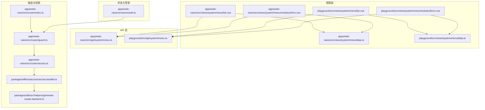
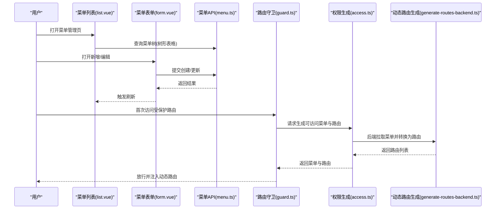
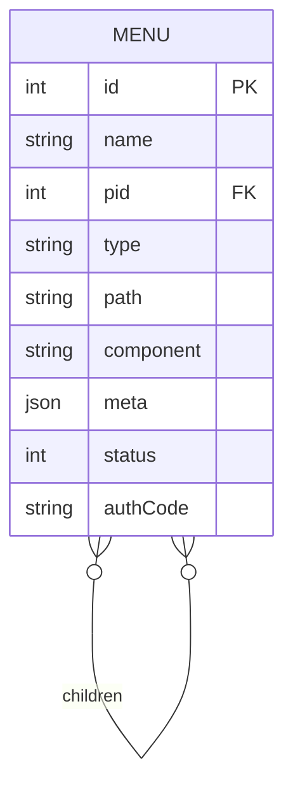
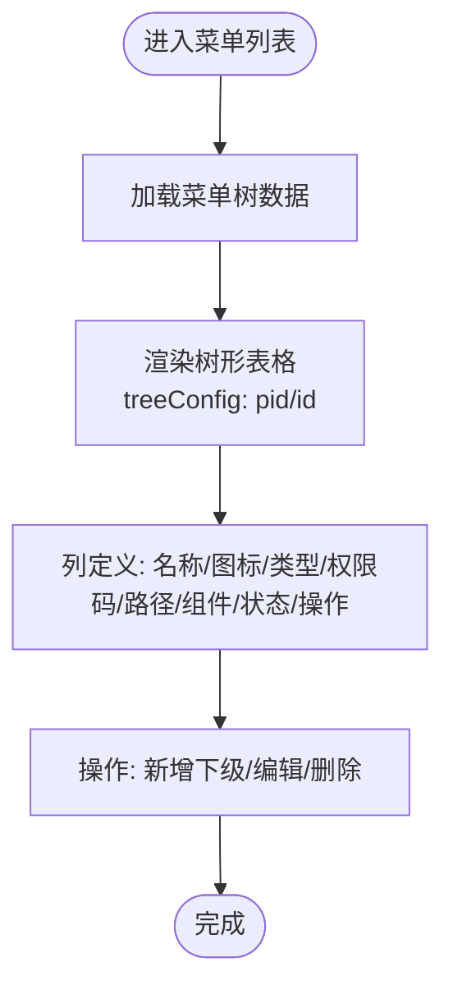
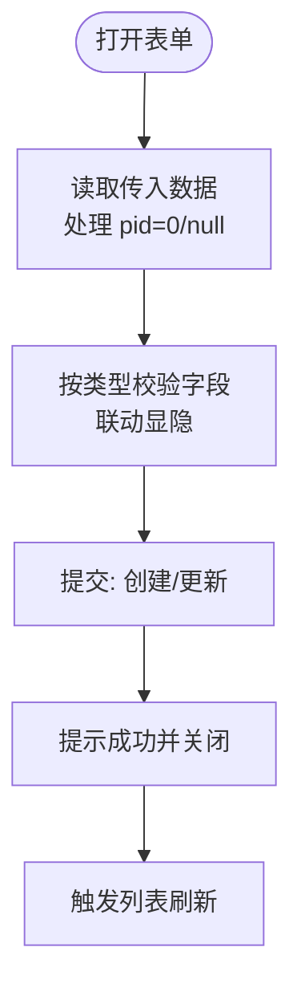
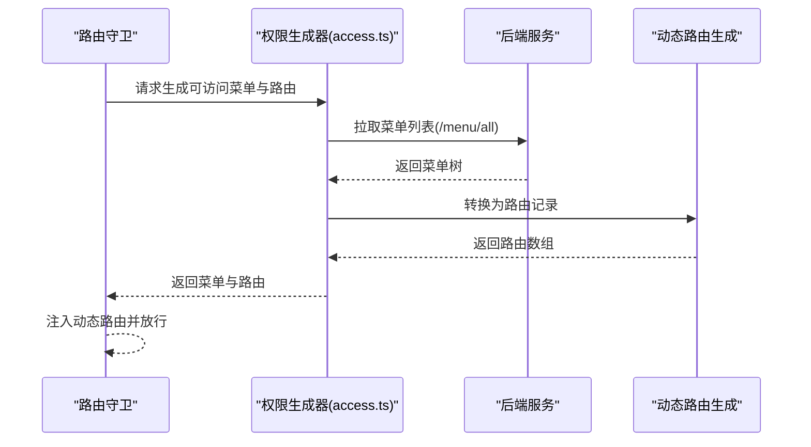
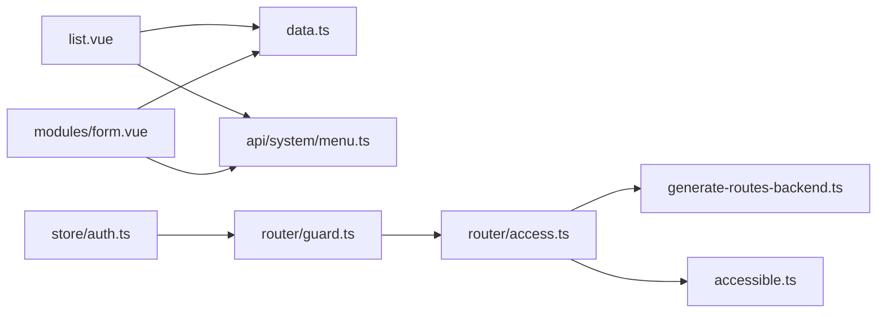

# 菜单管理

<cite>
**本文引用的文件**
- [apps/web-naive/src/views/system/menu/list.vue](file://apps/web-naive/src/views/system/menu/list.vue)
- [apps/web-naive/src/views/system/menu/modules/form.vue](file://apps/web-naive/src/views/system/menu/modules/form.vue)
- [apps/web-naive/src/views/system/menu/data.ts](file://apps/web-naive/src/views/system/menu/data.ts)
- [apps/web-naive/src/api/system/menu.ts](file://apps/web-naive/src/api/system/menu.ts)
- [playground/src/views/system/menu/list.vue](file://playground/src/views/system/menu/list.vue)
- [playground/src/views/system/menu/modules/form.vue](file://playground/src/views/system/menu/modules/form.vue)
- [playground/src/views/system/menu/data.ts](file://playground/src/views/system/menu/data.ts)
- [playground/src/api/system/menu.ts](file://playground/src/api/system/menu.ts)
- [apps/web-naive/src/router/index.ts](file://apps/web-naive/src/router/index.ts)
- [apps/web-naive/src/router/guard.ts](file://apps/web-naive/src/router/guard.ts)
- [apps/web-naive/src/router/access.ts](file://apps/web-naive/src/router/access.ts)
- [packages/utils/src/helpers/generate-routes-backend.ts](file://packages/utils/src/helpers/generate-routes-backend.ts)
- [packages/effects/access/src/accessible.ts](file://packages/effects/access/src/accessible.ts)
- [apps/web-naive/src/store/auth.ts](file://apps/web-naive/src/store/auth.ts)
</cite>

## 目录

1. [简介](#简介)
2. [项目结构](#项目结构)
3. [核心组件](#核心组件)
4. [架构总览](#架构总览)
5. [详细组件分析](#详细组件分析)
6. [依赖分析](#依赖分析)
7. [性能考虑](#性能考虑)
8. [故障排查指南](#故障排查指南)
9. [结论](#结论)
10. [附录](#附录)

## 简介

本文件系统性地阐述菜单管理模块的设计与实现，覆盖以下关键能力：

- 菜单树形结构展示与层级管理
- 菜单表单编辑与父子关系维护
- 动态菜单与路由生成机制
- 菜单数据模型、权限关联与显示控制
- 图标设置、路由配置与徽标展示
- 权限分配、按钮权限绑定与动态路由注入
- 性能优化与缓存策略
- 导入导出、排序调整与批量操作的实现思路

## 项目结构

菜单管理模块主要分布在两个应用示例中：web-naive 与 playground。两者共享相似的目录组织与职责划分：

- 视图层：list.vue（列表与树形表格）、modules/form.vue（表单弹窗/抽屉）
- 数据与表单配置：data.ts（列定义、表单 schema、类型选项）
- API 层：api/system/menu.ts（菜单 CRUD、存在性校验）
- 路由与权限：router/index.ts、router/guard.ts、router/access.ts
- 动态路由生成：packages/utils/src/helpers/generate-routes-backend.ts、packages/effects/access/src/accessible.ts
- 登录与权限初始化：store/auth.ts

**图表来源**

- [apps/web-naive/src/views/system/menu/list.vue:1-155](file://apps/web-naive/src/views/system/menu/list.vue#L1-L155)
- [apps/web-naive/src/views/system/menu/modules/form.vue:1-94](file://apps/web-naive/src/views/system/menu/modules/form.vue#L1-L94)
- [apps/web-naive/src/views/system/menu/data.ts:1-284](file://apps/web-naive/src/views/system/menu/data.ts#L1-L284)
- [apps/web-naive/src/api/system/menu.ts:1-169](file://apps/web-naive/src/api/system/menu.ts#L1-L169)
- [playground/src/views/system/menu/list.vue:1-163](file://playground/src/views/system/menu/list.vue#L1-L163)
- [playground/src/views/system/menu/modules/form.vue:1-505](file://playground/src/views/system/menu/modules/form.vue#L1-L505)
- [playground/src/views/system/menu/data.ts:1-110](file://playground/src/views/system/menu/data.ts#L1-L110)
- [playground/src/api/system/menu.ts:1-157](file://playground/src/api/system/menu.ts#L1-L157)
- [apps/web-naive/src/router/index.ts:1-38](file://apps/web-naive/src/router/index.ts#L1-L38)
- [apps/web-naive/src/router/guard.ts:1-133](file://apps/web-naive/src/router/guard.ts#L1-L133)
- [apps/web-naive/src/router/access.ts:1-40](file://apps/web-naive/src/router/access.ts#L1-L40)
- [packages/utils/src/helpers/generate-routes-backend.ts:1-53](file://packages/utils/src/helpers/generate-routes-backend.ts#L1-L53)
- [packages/effects/access/src/accessible.ts:69-111](file://packages/effects/access/src/accessible.ts#L69-L111)
- [apps/web-naive/src/store/auth.ts:1-119](file://apps/web-naive/src/store/auth.ts#L1-L119)

**章节来源**

- [apps/web-naive/src/views/system/menu/list.vue:1-155](file://apps/web-naive/src/views/system/menu/list.vue#L1-L155)
- [apps/web-naive/src/views/system/menu/modules/form.vue:1-94](file://apps/web-naive/src/views/system/menu/modules/form.vue#L1-L94)
- [apps/web-naive/src/views/system/menu/data.ts:1-284](file://apps/web-naive/src/views/system/menu/data.ts#L1-L284)
- [apps/web-naive/src/api/system/menu.ts:1-169](file://apps/web-naive/src/api/system/menu.ts#L1-L169)
- [playground/src/views/system/menu/list.vue:1-163](file://playground/src/views/system/menu/list.vue#L1-L163)
- [playground/src/views/system/menu/modules/form.vue:1-505](file://playground/src/views/system/menu/modules/form.vue#L1-L505)
- [playground/src/views/system/menu/data.ts:1-110](file://playground/src/views/system/menu/data.ts#L1-L110)
- [playground/src/api/system/menu.ts:1-157](file://playground/src/api/system/menu.ts#L1-L157)
- [apps/web-naive/src/router/index.ts:1-38](file://apps/web-naive/src/router/index.ts#L1-L38)
- [apps/web-naive/src/router/guard.ts:1-133](file://apps/web-naive/src/router/guard.ts#L1-L133)
- [apps/web-naive/src/router/access.ts:1-40](file://apps/web-naive/src/router/access.ts#L1-L40)
- [packages/utils/src/helpers/generate-routes-backend.ts:1-53](file://packages/utils/src/helpers/generate-routes-backend.ts#L1-L53)
- [packages/effects/access/src/accessible.ts:69-111](file://packages/effects/access/src/accessible.ts#L69-L111)
- [apps/web-naive/src/store/auth.ts:1-119](file://apps/web-naive/src/store/auth.ts#L1-L119)

## 核心组件

- 菜单列表页（树形表格）：负责菜单树形展示、操作按钮（新增下级、编辑、删除）、刷新与图标渲染
- 菜单表单（弹窗/抽屉）：负责菜单创建/更新、字段联动（类型驱动的显隐与规则）、提交与回写
- 数据与表单配置：统一提供列定义、表单 schema、类型选项与依赖联动
- API 层：提供菜单 CRUD、名称/路径存在性校验、后端菜单列表接口
- 路由与权限：路由守卫在首次访问时生成可访问菜单与路由，结合后端/前端/混合模式生成
- 动态路由生成：将菜单转换为路由记录，并支持“可见但403”场景

**章节来源**

- [apps/web-naive/src/views/system/menu/list.vue:1-155](file://apps/web-naive/src/views/system/menu/list.vue#L1-L155)
- [apps/web-naive/src/views/system/menu/modules/form.vue:1-94](file://apps/web-naive/src/views/system/menu/modules/form.vue#L1-L94)
- [apps/web-naive/src/views/system/menu/data.ts:66-191](file://apps/web-naive/src/views/system/menu/data.ts#L66-L191)
- [apps/web-naive/src/api/system/menu.ts:98-168](file://apps/web-naive/src/api/system/menu.ts#L98-L168)
- [apps/web-naive/src/router/guard.ts:47-118](file://apps/web-naive/src/router/guard.ts#L47-L118)
- [apps/web-naive/src/router/access.ts:16-37](file://apps/web-naive/src/router/access.ts#L16-L37)
- [packages/utils/src/helpers/generate-routes-backend.ts:22-53](file://packages/utils/src/helpers/generate-routes-backend.ts#L22-L53)
- [packages/effects/access/src/accessible.ts:80-111](file://packages/effects/access/src/accessible.ts#L80-L111)

## 架构总览

菜单管理从“数据模型”出发，通过“表单配置”完成编辑，经“API 层”持久化；同时在“路由守卫”阶段将菜单转换为“可访问路由”，最终在运行时由“菜单渲染”组件呈现。

**图表来源**

- [apps/web-naive/src/views/system/menu/list.vue:91-126](file://apps/web-naive/src/views/system/menu/list.vue#L91-L126)
- [apps/web-naive/src/views/system/menu/modules/form.vue:36-79](file://apps/web-naive/src/views/system/menu/modules/form.vue#L36-L79)
- [apps/web-naive/src/api/system/menu.ts:98-168](file://apps/web-naive/src/api/system/menu.ts#L98-L168)
- [apps/web-naive/src/router/guard.ts:88-118](file://apps/web-naive/src/router/guard.ts#L88-L118)
- [apps/web-naive/src/router/access.ts:16-37](file://apps/web-naive/src/router/access.ts#L16-L37)
- [packages/utils/src/helpers/generate-routes-backend.ts:22-53](file://packages/utils/src/helpers/generate-routes-backend.ts#L22-L53)

## 详细组件分析

### 菜单数据模型与父子关系

- 数据模型包含：标识、名称、父级、类型、路径、组件、元信息（图标、徽标、隐藏策略、缓存等）、状态、权限码等
- 父子关系通过 pid/id 字段表达，树形表格使用 parentField/rowField 进行绑定
- 元信息 meta 控制路由行为与界面展示（如 keepAlive、hideInMenu、affixTab 等）

**图表来源**

- [apps/web-naive/src/api/system/menu.ts:25-92](file://apps/web-naive/src/api/system/menu.ts#L25-L92)
- [playground/src/api/system/menu.ts:25-91](file://playground/src/api/system/menu.ts#L25-L91)

**章节来源**

- [apps/web-naive/src/api/system/menu.ts:25-92](file://apps/web-naive/src/api/system/menu.ts#L25-L92)
- [playground/src/api/system/menu.ts:25-91](file://playground/src/api/system/menu.ts#L25-L91)

### 菜单树形结构与表格列

- 列定义包含：名称（树节点）、图标、类型、权限码、路径、组件、状态、操作列
- 图标渲染根据类型与 meta.icon 决定；按钮类型使用安全图标
- 树形表格启用 treeConfig，基于 pid/id 建立父子关系

**图表来源**

- [apps/web-naive/src/views/system/menu/list.vue:91-119](file://apps/web-naive/src/views/system/menu/list.vue#L91-L119)
- [apps/web-naive/src/views/system/menu/data.ts:196-283](file://apps/web-naive/src/views/system/menu/data.ts#L196-L283)

**章节来源**

- [apps/web-naive/src/views/system/menu/list.vue:91-155](file://apps/web-naive/src/views/system/menu/list.vue#L91-L155)
- [apps/web-naive/src/views/system/menu/data.ts:196-283](file://apps/web-naive/src/views/system/menu/data.ts#L196-L283)

### 菜单表单编辑与字段联动

- 表单 schema 根据类型动态显隐与校验：路径仅对 catalog/menu/embedded/link 生效；组件仅对 menu；权限码仅对 button；keepAlive 仅对 menu；徽标仅对非 button
- 提交前处理 pid 为 0/null 的边界值，避免错误父级
- 支持 Drawer/Modal 两种交互，统一触发刷新

**图表来源**

- [apps/web-naive/src/views/system/menu/modules/form.vue:25-79](file://apps/web-naive/src/views/system/menu/modules/form.vue#L25-L79)
- [apps/web-naive/src/views/system/menu/data.ts:66-191](file://apps/web-naive/src/views/system/menu/data.ts#L66-L191)

**章节来源**

- [apps/web-naive/src/views/system/menu/modules/form.vue:1-94](file://apps/web-naive/src/views/system/menu/modules/form.vue#L1-L94)
- [apps/web-naive/src/views/system/menu/data.ts:66-191](file://apps/web-naive/src/views/system/menu/data.ts#L66-L191)

### 动态菜单与路由生成

- 首次访问受保护路由时，路由守卫会调用权限生成器
- 权限生成器根据偏好模式（前端/后端/混合）生成可访问菜单与路由
- 后端模式：从后端拉取菜单，转换为路由记录，支持“可见但403”的占位组件
- 前端/混合模式：结合角色与静态路由进行过滤或合并

**图表来源**

- [apps/web-naive/src/router/guard.ts:88-118](file://apps/web-naive/src/router/guard.ts#L88-L118)
- [apps/web-naive/src/router/access.ts:16-37](file://apps/web-naive/src/router/access.ts#L16-L37)
- [packages/utils/src/helpers/generate-routes-backend.ts:22-53](file://packages/utils/src/helpers/generate-routes-backend.ts#L22-L53)
- [packages/effects/access/src/accessible.ts:80-111](file://packages/effects/access/src/accessible.ts#L80-L111)

**章节来源**

- [apps/web-naive/src/router/guard.ts:47-118](file://apps/web-naive/src/router/guard.ts#L47-L118)
- [apps/web-naive/src/router/access.ts:1-40](file://apps/web-naive/src/router/access.ts#L1-L40)
- [packages/utils/src/helpers/generate-routes-backend.ts:1-53](file://packages/utils/src/helpers/generate-routes-backend.ts#L1-L53)
- [packages/effects/access/src/accessible.ts:69-111](file://packages/effects/access/src/accessible.ts#L69-L111)

### 权限分配与按钮权限绑定

- 菜单类型为 button 时，使用 authCode 作为后端权限标识
- 路由守卫在生成可访问路由时，依据用户角色与菜单权限进行过滤
- “可见但403”场景：菜单在前端可见，但访问时重定向至 403 页面，便于用户申请权限

**章节来源**

- [apps/web-naive/src/api/system/menu.ts:27-28](file://apps/web-naive/src/api/system/menu.ts#L27-L28)
- [apps/web-naive/src/router/access.ts:14-34](file://apps/web-naive/src/router/access.ts#L14-L34)
- [packages/utils/src/helpers/generate-routes-backend.ts:14-16](file://packages/utils/src/helpers/generate-routes-backend.ts#L14-L16)

### 路由配置、图标设置与显示控制

- 路由历史模式由环境变量决定，支持 hash/history
- 图标设置通过 meta.icon/meta.activeIcon；按钮类型使用安全图标
- 显示控制通过 meta.hideInMenu、hideChildrenInMenu、hideInBreadcrumb、hideInTab 等字段
- keepAlive 用于页面缓存；affixTab 用于固定标签页

**章节来源**

- [apps/web-naive/src/router/index.ts:15-30](file://apps/web-naive/src/router/index.ts#L15-L30)
- [apps/web-naive/src/views/system/menu/list.vue:138-151](file://apps/web-naive/src/views/system/menu/list.vue#L138-L151)
- [apps/web-naive/src/views/system/menu/data.ts:142-175](file://apps/web-naive/src/views/system/menu/data.ts#L142-L175)
- [playground/src/views/system/menu/modules/form.vue:179-205](file://playground/src/views/system/menu/modules/form.vue#L179-L205)

### 导入导出、排序与批量操作

- 列表页已启用工具栏刷新与缩放，未见内置导出/导入按钮
- 排序：表格列未提供拖拽排序；可通过后端返回顺序或在后端维护 order 字段
- 批量操作：当前未实现批量勾选与批量删除/启用禁用；可在现有 Grid 上扩展

**章节来源**

- [apps/web-naive/src/views/system/menu/list.vue:107-113](file://apps/web-naive/src/views/system/menu/list.vue#L107-L113)
- [playground/src/views/system/menu/list.vue:44-55](file://playground/src/views/system/menu/list.vue#L44-L55)

## 依赖分析

- 视图层依赖数据配置与 API 层
- 路由守卫依赖权限生成器与动态路由生成工具
- 权限生成器依赖后端菜单接口与页面/布局映射
- 登录流程在 store/auth.ts 中初始化访问令牌与用户信息，为路由守卫提供角色基础

**图表来源**

- [apps/web-naive/src/views/system/menu/list.vue:1-155](file://apps/web-naive/src/views/system/menu/list.vue#L1-L155)
- [apps/web-naive/src/views/system/menu/modules/form.vue:1-94](file://apps/web-naive/src/views/system/menu/modules/form.vue#L1-L94)
- [apps/web-naive/src/views/system/menu/data.ts:1-284](file://apps/web-naive/src/views/system/menu/data.ts#L1-L284)
- [apps/web-naive/src/api/system/menu.ts:1-169](file://apps/web-naive/src/api/system/menu.ts#L1-L169)
- [apps/web-naive/src/router/guard.ts:1-133](file://apps/web-naive/src/router/guard.ts#L1-L133)
- [apps/web-naive/src/router/access.ts:1-40](file://apps/web-naive/src/router/access.ts#L1-L40)
- [packages/utils/src/helpers/generate-routes-backend.ts:1-53](file://packages/utils/src/helpers/generate-routes-backend.ts#L1-L53)
- [packages/effects/access/src/accessible.ts:69-111](file://packages/effects/access/src/accessible.ts#L69-L111)
- [apps/web-naive/src/store/auth.ts:1-119](file://apps/web-naive/src/store/auth.ts#L1-L119)

**章节来源**

- [apps/web-naive/src/views/system/menu/list.vue:1-155](file://apps/web-naive/src/views/system/menu/list.vue#L1-L155)
- [apps/web-naive/src/views/system/menu/modules/form.vue:1-94](file://apps/web-naive/src/views/system/menu/modules/form.vue#L1-L94)
- [apps/web-naive/src/views/system/menu/data.ts:1-284](file://apps/web-naive/src/views/system/menu/data.ts#L1-L284)
- [apps/web-naive/src/api/system/menu.ts:1-169](file://apps/web-naive/src/api/system/menu.ts#L1-L169)
- [apps/web-naive/src/router/guard.ts:1-133](file://apps/web-naive/src/router/guard.ts#L1-L133)
- [apps/web-naive/src/router/access.ts:1-40](file://apps/web-naive/src/router/access.ts#L1-L40)
- [packages/utils/src/helpers/generate-routes-backend.ts:1-53](file://packages/utils/src/helpers/generate-routes-backend.ts#L1-L53)
- [packages/effects/access/src/accessible.ts:69-111](file://packages/effects/access/src/accessible.ts#L69-L111)
- [apps/web-naive/src/store/auth.ts:1-119](file://apps/web-naive/src/store/auth.ts#L1-L119)

## 性能考虑

- 列表加载：使用 vxe-table 的 proxyConfig.ajax 分页查询，建议后端分页与缓存
- 树形渲染：treeConfig.transform=false，避免额外转换开销；保持数据扁平/有序可提升渲染性能
- 表单联动：字段依赖仅在类型变化时触发，减少无效校验
- 动态路由：首次生成后缓存于 store，避免重复请求；可结合本地持久化减少白屏时间
- 图标与徽标：按需渲染，避免大列表时的过度 DOM 渲染

[本节为通用性能建议，不直接分析具体文件]

## 故障排查指南

- 提交失败：检查表单校验与 pid 处理逻辑；确认后端接口返回与错误提示
- 菜单不显示：检查类型与 meta.hideInMenu、hideChildrenInMenu 等字段；确认权限生成是否包含该菜单
- 路由无法访问：确认路由守卫是否已生成动态路由；核对 authCode 与用户角色匹配
- 图标不生效：确认 meta.icon 设置与类型匹配；按钮类型使用安全图标

**章节来源**

- [apps/web-naive/src/views/system/menu/modules/form.vue:36-79](file://apps/web-naive/src/views/system/menu/modules/form.vue#L36-L79)
- [apps/web-naive/src/views/system/menu/list.vue:138-151](file://apps/web-naive/src/views/system/menu/list.vue#L138-L151)
- [apps/web-naive/src/router/guard.ts:88-118](file://apps/web-naive/src/router/guard.ts#L88-L118)

## 结论

菜单管理模块以清晰的数据模型与表单配置为核心，配合树形表格与动态路由生成，实现了完整的菜单生命周期管理。通过权限生成器与路由守卫，系统在运行时动态注入可访问菜单与路由，满足不同权限场景需求。建议在现有基础上扩展批量操作、排序与导入导出能力，并结合缓存策略进一步优化性能。

[本节为总结性内容，不直接分析具体文件]

## 附录

- 术语说明
  - 菜单类型：catalog（目录）、menu（页面）、button（按钮）、embedded（内嵌）、link（链接）
  - 权限码：用于后端权限标识，按钮类型必填
  - 元信息：控制路由行为与界面展示的关键字段集合

[本节为概念性内容，不直接分析具体文件]
