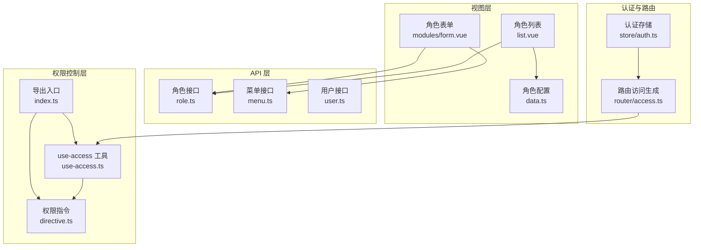
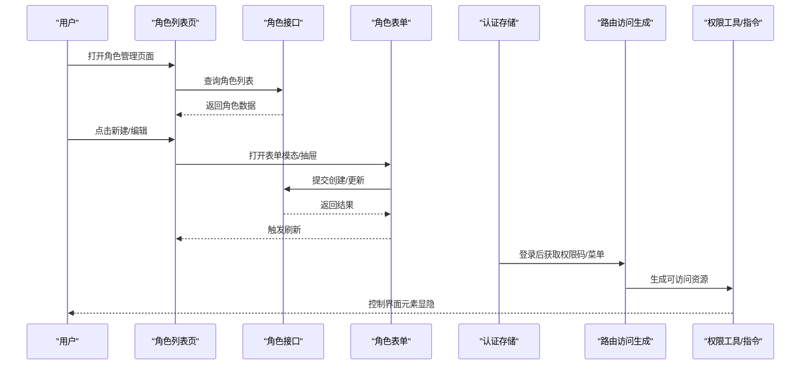
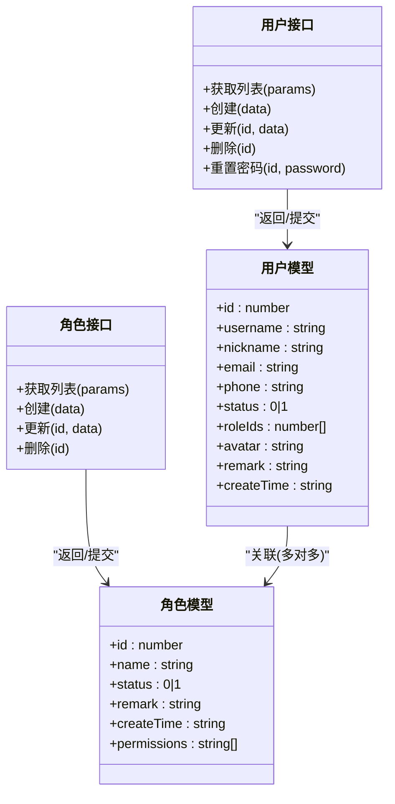
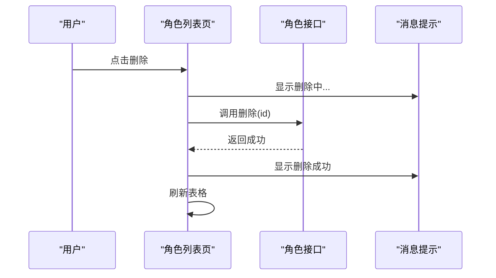
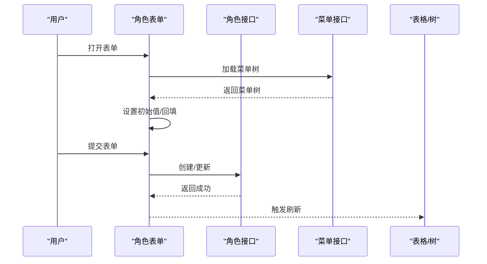
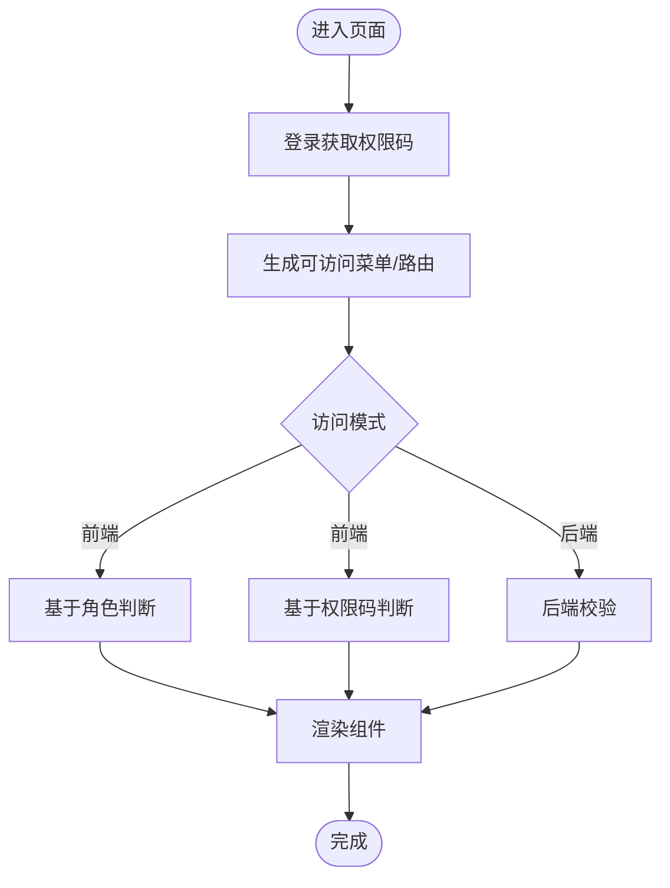
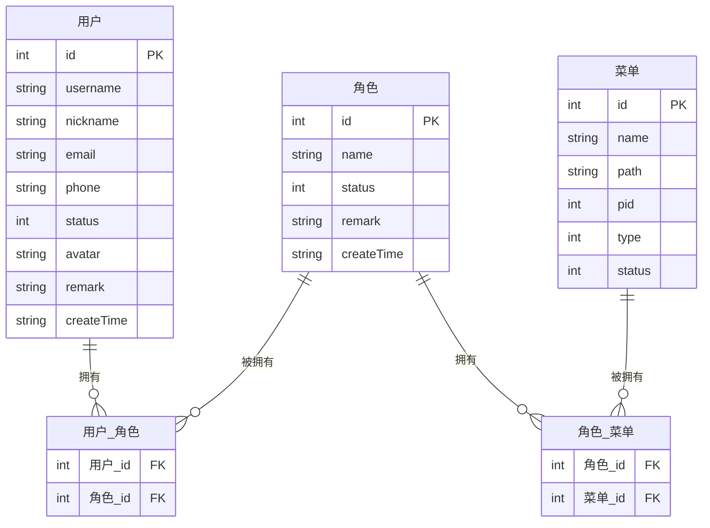
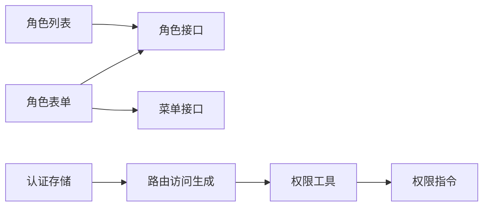

# 角色管理

<cite>
**本文引用的文件**
- [apps/web-naive/src/api/system/role.ts](file://apps/web-naive/src/api/system/role.ts)
- [apps/web-naive/src/views/system/role/list.vue](file://apps/web-naive/src/views/system/role/list.vue)
- [apps/web-naive/src/views/system/role/modules/form.vue](file://apps/web-naive/src/views/system/role/modules/form.vue)
- [apps/web-naive/src/views/system/role/data.ts](file://apps/web-naive/src/views/system/role/data.ts)
- [apps/web-naive/src/api/system/menu.ts](file://apps/web-naive/src/api/system/menu.ts)
- [apps/web-naive/src/api/system/user.ts](file://apps/web-naive/src/api/system/user.ts)
- [apps/web-naive/src/store/auth.ts](file://apps/web-naive/src/store/auth.ts)
- [apps/web-naive/src/router/access.ts](file://apps/web-naive/src/router/access.ts)
- [packages/effects/access/src/use-access.ts](file://packages/effects/access/src/use-access.ts)
- [packages/effects/access/src/directive.ts](file://packages/effects/access/src/directive.ts)
- [packages/effects/access/src/index.ts](file://packages/effects/access/src/index.ts)
- [playground/src/views/system/role/modules/form.vue](file://playground/src/views/system/role/modules/form.vue)
- [playground/src/views/system/role/list.vue](file://playground/src/views/system/role/list.vue)
</cite>

## 目录

1. [简介](#简介)
2. [项目结构](#项目结构)
3. [核心组件](#核心组件)
4. [架构总览](#架构总览)
5. [详细组件分析](#详细组件分析)
6. [依赖分析](#依赖分析)
7. [性能考量](#性能考量)
8. [故障排查指南](#故障排查指南)
9. [结论](#结论)
10. [附录](#附录)

## 简介

本文件系统化梳理角色管理模块的设计与实现，覆盖角色列表展示、角色权限分配、角色表单编辑、权限控制与访问校验等关键能力。文档从数据模型、权限矩阵、访问控制机制入手，解释角色与用户关联、角色与菜单权限绑定、动态权限验证、权限范围控制与安全审计建议，并给出权限设计最佳实践与安全考虑，帮助开发者理解并扩展角色管理功能。

## 项目结构

角色管理模块主要分布在以下位置：

- API 层：系统角色、菜单、用户相关接口定义与调用封装
- 视图层：角色列表页、角色表单页（模态/抽屉）
- 权限控制层：基于权限码/角色的访问控制工具与指令
- 认证与路由：登录流程、菜单生成与路由访问控制

图表来源

- [apps/web-naive/src/views/system/role/list.vue:1-132](file://apps/web-naive/src/views/system/role/list.vue#L1-L132)
- [apps/web-naive/src/views/system/role/modules/form.vue:1-84](file://apps/web-naive/src/views/system/role/modules/form.vue#L1-L84)
- [apps/web-naive/src/views/system/role/data.ts:1-132](file://apps/web-naive/src/views/system/role/data.ts#L1-L132)
- [apps/web-naive/src/api/system/role.ts:1-56](file://apps/web-naive/src/api/system/role.ts#L1-L56)
- [apps/web-naive/src/api/system/menu.ts:1-169](file://apps/web-naive/src/api/system/menu.ts#L1-L169)
- [apps/web-naive/src/api/system/user.ts:1-99](file://apps/web-naive/src/api/system/user.ts#L1-L99)
- [packages/effects/access/src/use-access.ts:1-53](file://packages/effects/access/src/use-access.ts#L1-L53)
- [packages/effects/access/src/directive.ts:1-42](file://packages/effects/access/src/directive.ts#L1-L42)
- [packages/effects/access/src/index.ts:1-4](file://packages/effects/access/src/index.ts#L1-L4)
- [apps/web-naive/src/store/auth.ts:1-119](file://apps/web-naive/src/store/auth.ts#L1-L119)
- [apps/web-naive/src/router/access.ts:1-41](file://apps/web-naive/src/router/access.ts#L1-L41)

章节来源

- [apps/web-naive/src/views/system/role/list.vue:1-132](file://apps/web-naive/src/views/system/role/list.vue#L1-L132)
- [apps/web-naive/src/views/system/role/modules/form.vue:1-84](file://apps/web-naive/src/views/system/role/modules/form.vue#L1-L84)
- [apps/web-naive/src/views/system/role/data.ts:1-132](file://apps/web-naive/src/views/system/role/data.ts#L1-L132)
- [apps/web-naive/src/api/system/role.ts:1-56](file://apps/web-naive/src/api/system/role.ts#L1-L56)
- [apps/web-naive/src/api/system/menu.ts:1-169](file://apps/web-naive/src/api/system/menu.ts#L1-L169)
- [apps/web-naive/src/api/system/user.ts:1-99](file://apps/web-naive/src/api/system/user.ts#L1-L99)
- [packages/effects/access/src/use-access.ts:1-53](file://packages/effects/access/src/use-access.ts#L1-L53)
- [packages/effects/access/src/directive.ts:1-42](file://packages/effects/access/src/directive.ts#L1-L42)
- [packages/effects/access/src/index.ts:1-4](file://packages/effects/access/src/index.ts#L1-L4)
- [apps/web-naive/src/store/auth.ts:1-119](file://apps/web-naive/src/store/auth.ts#L1-L119)
- [apps/web-naive/src/router/access.ts:1-41](file://apps/web-naive/src/router/access.ts#L1-L41)

## 核心组件

- 角色数据模型
  - 字段要点：唯一标识、名称、状态、备注、创建时间等；角色可关联权限码集合（接口返回）。
  - 数据来源：角色列表接口返回数组，支持分页或全量拉取。
- 角色列表页
  - 功能：查询过滤、分页、新增、编辑、删除；通过表格代理加载数据。
  - 交互：顶部工具栏触发新建；表格操作列支持编辑与删除。
- 角色表单页（模态）
  - 功能：创建/更新角色，表单校验，提交成功后刷新列表。
  - 交互：打开时根据是否携带 id 决定新建或编辑；提交前进行表单校验。
- 权限控制
  - 工具：基于权限码/角色的访问判断；支持切换访问模式（前端/后端）。
  - 指令：全局 v-access 指令，按角色或权限码细粒度控制组件渲染。
- 菜单与权限绑定
  - 菜单接口提供菜单树结构，角色表单可基于菜单树进行权限勾选（抽屉版）。
- 用户与角色关联
  - 用户接口包含角色 ID 数组字段，用于建立用户与角色的多对多关系。

章节来源

- [apps/web-naive/src/api/system/role.ts:5-15](file://apps/web-naive/src/api/system/role.ts#L5-L15)
- [apps/web-naive/src/views/system/role/list.vue:18-117](file://apps/web-naive/src/views/system/role/list.vue#L18-L117)
- [apps/web-naive/src/views/system/role/modules/form.vue:17-69](file://apps/web-naive/src/views/system/role/modules/form.vue#L17-L69)
- [apps/web-naive/src/views/system/role/data.ts:13-78](file://apps/web-naive/src/views/system/role/data.ts#L13-L78)
- [packages/effects/access/src/use-access.ts:18-34](file://packages/effects/access/src/use-access.ts#L18-L34)
- [packages/effects/access/src/directive.ts:11-30](file://packages/effects/access/src/directive.ts#L11-L30)
- [apps/web-naive/src/api/system/menu.ts:25-93](file://apps/web-naive/src/api/system/menu.ts#L25-L93)
- [apps/web-naive/src/api/system/user.ts:5-28](file://apps/web-naive/src/api/system/user.ts#L5-L28)

## 架构总览

角色管理的前端架构围绕“视图层-接口层-权限控制层”展开，配合认证与路由生成完成完整的权限闭环。

图表来源

- [apps/web-naive/src/views/system/role/list.vue:79-117](file://apps/web-naive/src/views/system/role/list.vue#L79-L117)
- [apps/web-naive/src/views/system/role/modules/form.vue:36-69](file://apps/web-naive/src/views/system/role/modules/form.vue#L36-L69)
- [apps/web-naive/src/api/system/role.ts:20-53](file://apps/web-naive/src/api/system/role.ts#L20-L53)
- [apps/web-naive/src/store/auth.ts:32-74](file://apps/web-naive/src/store/auth.ts#L32-L74)
- [apps/web-naive/src/router/access.ts:16-38](file://apps/web-naive/src/router/access.ts#L16-L38)
- [packages/effects/access/src/use-access.ts:6-51](file://packages/effects/access/src/use-access.ts#L6-L51)
- [packages/effects/access/src/directive.ts:32-38](file://packages/effects/access/src/directive.ts#L32-L38)

## 详细组件分析

### 角色数据模型与接口

- 角色数据模型
  - 关键字段：标识、名称、状态、备注、创建时间；接口返回可能包含权限码数组。
  - 列表返回：支持数组或分页对象，前端统一处理为表格所需格式。
- 接口方法
  - 获取列表、创建、更新、删除角色。
  - 与用户接口配合，用户实体包含角色 ID 数组，用于用户-角色关联。

图表来源

- [apps/web-naive/src/api/system/role.ts:5-15](file://apps/web-naive/src/api/system/role.ts#L5-L15)
- [apps/web-naive/src/api/system/role.ts:20-53](file://apps/web-naive/src/api/system/role.ts#L20-L53)
- [apps/web-naive/src/api/system/user.ts:5-28](file://apps/web-naive/src/api/system/user.ts#L5-L28)
- [apps/web-naive/src/api/system/user.ts:30-98](file://apps/web-naive/src/api/system/user.ts#L30-L98)

章节来源

- [apps/web-naive/src/api/system/role.ts:5-15](file://apps/web-naive/src/api/system/role.ts#L5-L15)
- [apps/web-naive/src/api/system/role.ts:20-53](file://apps/web-naive/src/api/system/role.ts#L20-L53)
- [apps/web-naive/src/api/system/user.ts:5-28](file://apps/web-naive/src/api/system/user.ts#L5-L28)
- [apps/web-naive/src/api/system/user.ts:30-98](file://apps/web-naive/src/api/system/user.ts#L30-L98)

### 角色列表展示与交互

- 列表页职责
  - 查询表单：按名称、状态筛选；表格代理加载数据。
  - 表格列：包含状态标签、创建时间、备注、操作列（编辑/删除）。
  - 新增：点击工具栏触发新建模态。
- 交互流程
  - 删除：异步调用删除接口，成功后提示并刷新。
  - 刷新：通过表格 API 触发重新查询。

图表来源

- [apps/web-naive/src/views/system/role/list.vue:45-58](file://apps/web-naive/src/views/system/role/list.vue#L45-L58)
- [apps/web-naive/src/views/system/role/list.vue:115-117](file://apps/web-naive/src/views/system/role/list.vue#L115-L117)
- [apps/web-naive/src/api/system/role.ts:51-53](file://apps/web-naive/src/api/system/role.ts#L51-L53)

章节来源

- [apps/web-naive/src/views/system/role/list.vue:18-117](file://apps/web-naive/src/views/system/role/list.vue#L18-L117)
- [apps/web-naive/src/views/system/role/data.ts:83-131](file://apps/web-naive/src/views/system/role/data.ts#L83-L131)

### 角色表单编辑与权限分配

- 表单页职责
  - 支持创建/更新角色；表单校验通过后提交。
  - 成功后触发父组件刷新列表。
- 权限分配（抽屉版）
  - 抽屉内集成菜单树，支持勾选按钮级权限。
  - 打开时加载菜单树，设置初始值并回填表单。

图表来源

- [apps/web-naive/src/views/system/role/modules/form.vue:36-69](file://apps/web-naive/src/views/system/role/modules/form.vue#L36-L69)
- [playground/src/views/system/role/modules/form.vue:35-83](file://playground/src/views/system/role/modules/form.vue#L35-L83)
- [apps/web-naive/src/api/system/menu.ts:98-109](file://apps/web-naive/src/api/system/menu.ts#L98-L109)
- [apps/web-naive/src/api/system/role.ts:30-45](file://apps/web-naive/src/api/system/role.ts#L30-L45)

章节来源

- [apps/web-naive/src/views/system/role/modules/form.vue:17-69](file://apps/web-naive/src/views/system/role/modules/form.vue#L17-L69)
- [playground/src/views/system/role/modules/form.vue:1-95](file://playground/src/views/system/role/modules/form.vue#L1-L95)
- [apps/web-naive/src/api/system/menu.ts:98-109](file://apps/web-naive/src/api/system/menu.ts#L98-L109)
- [apps/web-naive/src/views/system/role/data.ts:41-78](file://apps/web-naive/src/views/system/role/data.ts#L41-L78)

### 权限矩阵与访问控制机制

- 权限来源
  - 登录后获取权限码集合，存储于访问存储中。
  - 路由访问生成器根据菜单与权限码生成可访问的菜单与路由。
- 权限判断
  - 工具函数支持基于角色或权限码的判断。
  - 全局指令 v-access 支持在模板中按角色或权限码控制元素显隐。
- 访问模式
  - 支持前端/后端两种访问模式切换，影响指令与工具的判断逻辑。

图表来源

- [apps/web-naive/src/store/auth.ts:32-74](file://apps/web-naive/src/store/auth.ts#L32-L74)
- [apps/web-naive/src/router/access.ts:16-38](file://apps/web-naive/src/router/access.ts#L16-L38)
- [packages/effects/access/src/use-access.ts:18-34](file://packages/effects/access/src/use-access.ts#L18-L34)
- [packages/effects/access/src/directive.ts:11-30](file://packages/effects/access/src/directive.ts#L11-L30)

章节来源

- [apps/web-naive/src/store/auth.ts:16-79](file://apps/web-naive/src/store/auth.ts#L16-L79)
- [apps/web-naive/src/router/access.ts:16-38](file://apps/web-naive/src/router/access.ts#L16-L38)
- [packages/effects/access/src/use-access.ts:6-51](file://packages/effects/access/src/use-access.ts#L6-L51)
- [packages/effects/access/src/directive.ts:11-30](file://packages/effects/access/src/directive.ts#L11-L30)

### 角色与用户关联、角色与菜单权限绑定

- 用户与角色
  - 用户实体包含角色 ID 数组，用于建立用户与角色的多对多关系。
- 角色与菜单
  - 角色表单可基于菜单树进行权限勾选（按钮级），形成角色-菜单权限矩阵。
  - 路由访问生成器依据菜单与权限码构建可访问资源集。

图表来源

- [apps/web-naive/src/api/system/user.ts:5-28](file://apps/web-naive/src/api/system/user.ts#L5-L28)
- [apps/web-naive/src/api/system/menu.ts:25-93](file://apps/web-naive/src/api/system/menu.ts#L25-L93)
- [playground/src/views/system/role/modules/form.vue:35-83](file://playground/src/views/system/role/modules/form.vue#L35-L83)

章节来源

- [apps/web-naive/src/api/system/user.ts:5-28](file://apps/web-naive/src/api/system/user.ts#L5-L28)
- [apps/web-naive/src/api/system/menu.ts:25-93](file://apps/web-naive/src/api/system/menu.ts#L25-L93)
- [playground/src/views/system/role/modules/form.vue:35-83](file://playground/src/views/system/role/modules/form.vue#L35-L83)

### 动态权限验证与安全审计

- 动态权限验证
  - 前端：通过指令与工具在运行时判断；支持切换访问模式。
  - 后端：路由访问生成器基于权限码与菜单生成可访问资源。
- 安全审计建议
  - 记录角色变更、权限分配、菜单绑定等关键操作日志。
  - 对高危操作（如批量授权、删除角色）增加二次确认与审批流程。
  - 定期审计角色权限矩阵，避免权限冗余与越权风险。

章节来源

- [packages/effects/access/src/directive.ts:11-30](file://packages/effects/access/src/directive.ts#L11-L30)
- [packages/effects/access/src/use-access.ts:36-43](file://packages/effects/access/src/use-access.ts#L36-L43)
- [apps/web-naive/src/router/access.ts:16-38](file://apps/web-naive/src/router/access.ts#L16-L38)

## 依赖分析

- 组件耦合
  - 角色列表页依赖角色接口与表格适配器；表单页依赖角色接口与表单适配器。
  - 权限控制工具与指令独立于业务视图，通过全局注册提供跨组件能力。
- 外部依赖
  - 认证存储负责登录、获取权限码与用户信息；路由访问生成器负责菜单与路由的可访问性计算。
- 潜在循环依赖
  - 当前模块间通过清晰的导入边界组织，未见明显循环依赖迹象。

图表来源

- [apps/web-naive/src/views/system/role/list.vue:15-18](file://apps/web-naive/src/views/system/role/list.vue#L15-L18)
- [apps/web-naive/src/views/system/role/modules/form.vue:11-15](file://apps/web-naive/src/views/system/role/modules/form.vue#L11-L15)
- [apps/web-naive/src/api/system/menu.ts:98-109](file://apps/web-naive/src/api/system/menu.ts#L98-L109)
- [apps/web-naive/src/store/auth.ts:44-52](file://apps/web-naive/src/store/auth.ts#L44-L52)
- [apps/web-naive/src/router/access.ts:24-37](file://apps/web-naive/src/router/access.ts#L24-L37)
- [packages/effects/access/src/use-access.ts:6-11](file://packages/effects/access/src/use-access.ts#L6-L11)
- [packages/effects/access/src/directive.ts:9-15](file://packages/effects/access/src/directive.ts#L9-L15)

章节来源

- [apps/web-naive/src/views/system/role/list.vue:15-18](file://apps/web-naive/src/views/system/role/list.vue#L15-L18)
- [apps/web-naive/src/views/system/role/modules/form.vue:11-15](file://apps/web-naive/src/views/system/role/modules/form.vue#L11-L15)
- [apps/web-naive/src/store/auth.ts:44-52](file://apps/web-naive/src/store/auth.ts#L44-L52)
- [apps/web-naive/src/router/access.ts:24-37](file://apps/web-naive/src/router/access.ts#L24-L37)
- [packages/effects/access/src/use-access.ts:6-11](file://packages/effects/access/src/use-access.ts#L6-L11)
- [packages/effects/access/src/directive.ts:9-15](file://packages/effects/access/src/directive.ts#L9-L15)

## 性能考量

- 列表加载
  - 使用表格代理按需加载，减少一次性请求压力；支持分页参数透传。
- 表单提交
  - 提交前进行本地校验，避免无效请求；提交锁定防止重复提交。
- 权限判断
  - 基于集合的交集判断，复杂度与权限数量线性相关；建议在权限规模较大时进行缓存与去重。
- 菜单树加载
  - 抽屉表单首次打开时加载菜单树，后续复用；注意在大量菜单场景下的渲染优化。

## 故障排查指南

- 登录后无菜单/路由
  - 检查登录流程是否正确获取权限码并写入访问存储。
  - 确认路由访问生成器已正确调用并返回可访问菜单。
- 指令不生效
  - 检查访问模式是否与预期一致；确认指令参数与用户角色/权限码匹配。
- 表单提交失败
  - 查看表单校验是否通过；检查接口返回错误并定位具体字段。
- 列表不刷新
  - 确认提交成功事件是否触发；检查表格 API 的查询方法是否被调用。

章节来源

- [apps/web-naive/src/store/auth.ts:32-74](file://apps/web-naive/src/store/auth.ts#L32-L74)
- [apps/web-naive/src/router/access.ts:16-38](file://apps/web-naive/src/router/access.ts#L16-L38)
- [packages/effects/access/src/directive.ts:11-30](file://packages/effects/access/src/directive.ts#L11-L30)
- [apps/web-naive/src/views/system/role/modules/form.vue:36-69](file://apps/web-naive/src/views/system/role/modules/form.vue#L36-L69)
- [apps/web-naive/src/views/system/role/list.vue:115-117](file://apps/web-naive/src/views/system/role/list.vue#L115-L117)

## 结论

角色管理模块以清晰的数据模型与接口为基础，结合权限工具与指令实现了灵活的前端权限控制，并通过路由访问生成器与认证流程形成闭环。模块支持角色列表、表单编辑与权限分配，具备良好的扩展性。建议在生产环境中强化安全审计与权限矩阵治理，确保权限设计的最小化与可追溯性。

## 附录

- 权限设计最佳实践
  - 最小权限原则：仅授予完成任务所需的最小权限。
  - 权限矩阵可视化：维护角色-菜单-按钮的映射关系，定期评审。
  - 批量授权规范：提供批量授权工具时，必须包含冲突检测与回滚机制。
  - 安全审计：记录关键操作日志，支持追踪与复核。
- 安全考虑
  - 前端仅作体验增强，后端必须进行严格校验。
  - 对高危操作增加二次确认与审批流程。
  - 定期清理失效角色与冗余权限，降低攻击面。
