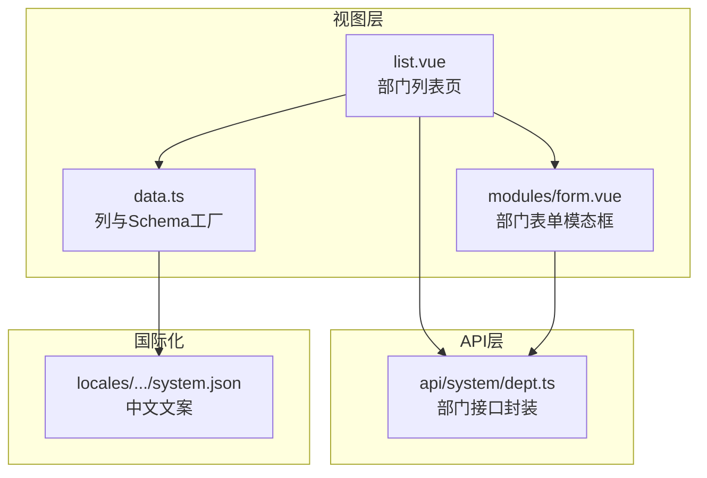
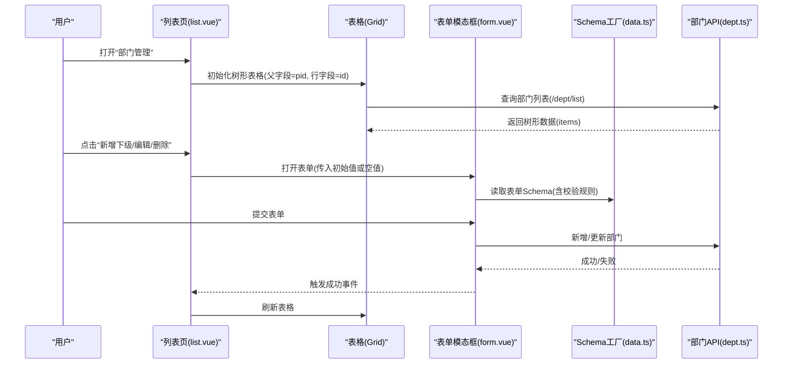
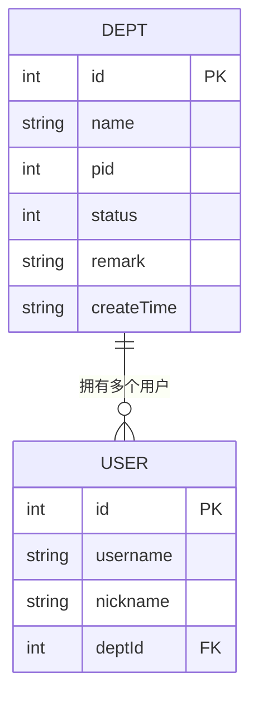
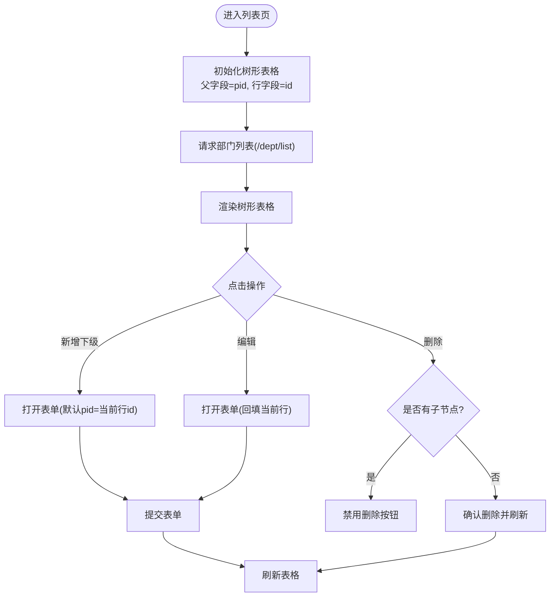
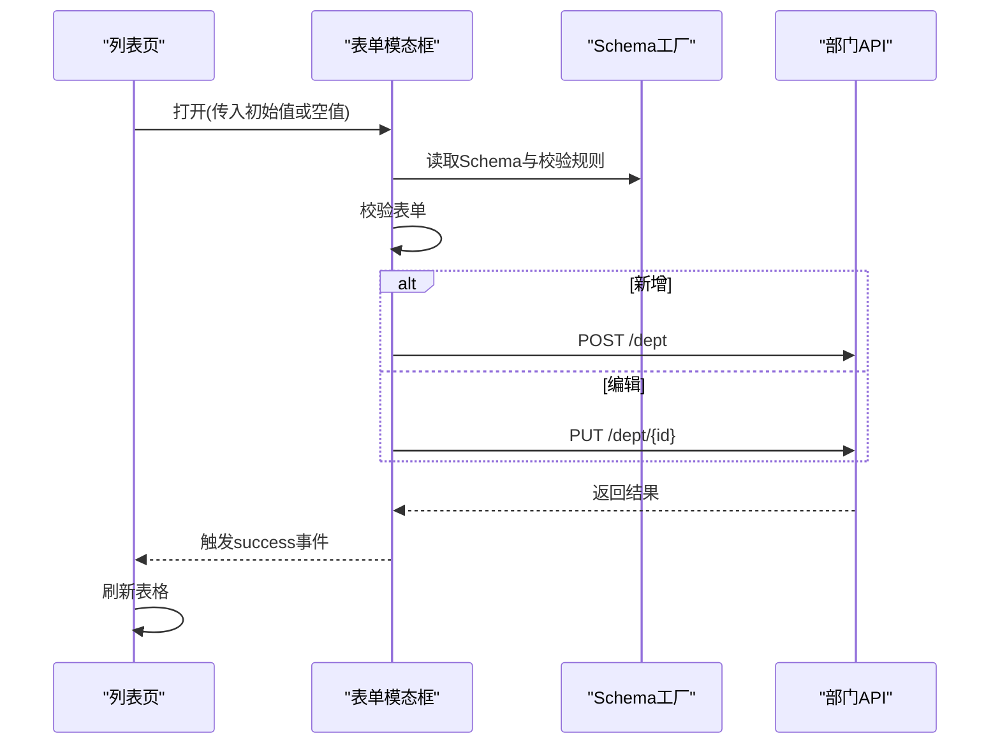
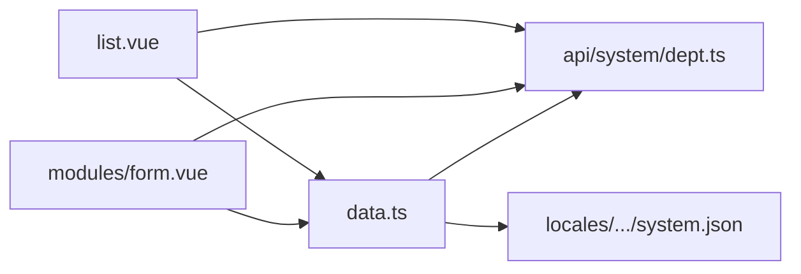

# 部门管理

<cite>
**本文引用的文件**
- [apps/web-naive/src/views/system/dept/list.vue](file://apps/web-naive/src/views/system/dept/list.vue)
- [apps/web-naive/src/views/system/dept/modules/form.vue](file://apps/web-naive/src/views/system/dept/modules/form.vue)
- [apps/web-naive/src/views/system/dept/data.ts](file://apps/web-naive/src/views/system/dept/data.ts)
- [apps/web-naive/src/api/system/dept.ts](file://apps/web-naive/src/api/system/dept.ts)
- [apps/web-naive/src/locales/langs/zh-CN/system.json](file://apps/web-naive/src/locales/langs/zh-CN/system.json)
- [playground/src/views/system/dept/list.vue](file://playground/src/views/system/dept/list.vue)
- [playground/src/views/system/dept/modules/form.vue](file://playground/src/views/system/dept/modules/form.vue)
- [playground/src/views/system/dept/data.ts](file://playground/src/views/system/dept/data.ts)
- [playground/src/api/system/dept.ts](file://playground/src/api/system/dept.ts)
- [playground/src/router/routes/modules/system.ts](file://playground/src/router/routes/modules/system.ts)
</cite>

## 目录

1. [简介](#简介)
2. [项目结构](#项目结构)
3. [核心组件](#核心组件)
4. [架构总览](#架构总览)
5. [详细组件分析](#详细组件分析)
6. [依赖分析](#依赖分析)
7. [性能考虑](#性能考虑)
8. [故障排查指南](#故障排查指南)
9. [结论](#结论)
10. [附录](#附录)

## 简介

本文件面向开发者，系统性梳理“部门管理”模块的设计与实现，覆盖以下关键主题：

- 组织架构树形展示与层级管理
- 部门表单编辑与校验
- 部门数据模型与组织关系
- 部门状态与备注等基础属性
- 基于树形表格的操作流程（新增下级、编辑、删除）
- 与用户管理的关联（用户所属部门）
- 国际化与本地化支持
- 可扩展性与最佳实践建议

说明：当前仓库同时包含两套示例应用（web-naive 与 playground），二者在功能上高度一致，差异主要体现在 UI 框架与部分细节。本文以 web-naive 为主要参考，同时标注 playground 对应文件以便对照。

## 项目结构

部门管理模块位于系统管理子模块之下，采用“视图 + 数据 + API”的分层组织方式：

- 视图层：列表页负责树形展示与操作；表单模态框负责新增/编辑
- 数据层：导出表格列与表单 Schema 的工厂函数，便于动态国际化
- API 层：封装对后端接口的调用，统一数据契约

图表来源

- [apps/web-naive/src/views/system/dept/list.vue:1-141](file://apps/web-naive/src/views/system/dept/list.vue#L1-L141)
- [apps/web-naive/src/views/system/dept/modules/form.vue:1-94](file://apps/web-naive/src/views/system/dept/modules/form.vue#L1-L94)
- [apps/web-naive/src/views/system/dept/data.ts:1-134](file://apps/web-naive/src/views/system/dept/data.ts#L1-L134)
- [apps/web-naive/src/api/system/dept.ts:1-64](file://apps/web-naive/src/api/system/dept.ts#L1-L64)
- [apps/web-naive/src/locales/langs/zh-CN/system.json:1-85](file://apps/web-naive/src/locales/langs/zh-CN/system.json#L1-L85)

章节来源

- [apps/web-naive/src/views/system/dept/list.vue:1-141](file://apps/web-naive/src/views/system/dept/list.vue#L1-L141)
- [apps/web-naive/src/views/system/dept/modules/form.vue:1-94](file://apps/web-naive/src/views/system/dept/modules/form.vue#L1-L94)
- [apps/web-naive/src/views/system/dept/data.ts:1-134](file://apps/web-naive/src/views/system/dept/data.ts#L1-L134)
- [apps/web-naive/src/api/system/dept.ts:1-64](file://apps/web-naive/src/api/system/dept.ts#L1-L64)
- [apps/web-naive/src/locales/langs/zh-CN/system.json:1-85](file://apps/web-naive/src/locales/langs/zh-CN/system.json#L1-L85)

## 核心组件

- 列表页（树形表格）：提供部门树形展示、新增下级、编辑、删除等操作入口，并通过工具栏提供“新建”入口
- 表单模态框：封装部门新增/编辑逻辑，包含名称、上级部门、状态、备注等字段
- 数据工厂：导出表格列与表单 Schema，支持动态国际化与复用
- API 封装：统一暴露获取列表、创建、更新、删除等方法

章节来源

- [apps/web-naive/src/views/system/dept/list.vue:91-126](file://apps/web-naive/src/views/system/dept/list.vue#L91-L126)
- [apps/web-naive/src/views/system/dept/modules/form.vue:25-79](file://apps/web-naive/src/views/system/dept/modules/form.vue#L25-L79)
- [apps/web-naive/src/views/system/dept/data.ts:14-70](file://apps/web-naive/src/views/system/dept/data.ts#L14-L70)
- [apps/web-naive/src/api/system/dept.ts:16-61](file://apps/web-naive/src/api/system/dept.ts#L16-L61)

## 架构总览

部门管理采用“视图-数据-接口”三层协作模式：

- 视图层通过表格组件渲染树形数据，绑定操作事件
- 数据层提供列与表单 Schema，保证 UI 与业务规则解耦
- 接口层封装 HTTP 请求，统一错误提示与刷新策略

图表来源

- [apps/web-naive/src/views/system/dept/list.vue:91-126](file://apps/web-naive/src/views/system/dept/list.vue#L91-L126)
- [apps/web-naive/src/views/system/dept/modules/form.vue:35-79](file://apps/web-naive/src/views/system/dept/modules/form.vue#L35-L79)
- [apps/web-naive/src/views/system/dept/data.ts:14-70](file://apps/web-naive/src/views/system/dept/data.ts#L14-L70)
- [apps/web-naive/src/api/system/dept.ts:16-61](file://apps/web-naive/src/api/system/dept.ts#L16-L61)

## 详细组件分析

### 数据模型与组织关系

- 数据模型包含：标识、名称、父级标识、状态、备注、创建时间等字段
- 树形关系：通过“父级标识”与“行标识”建立父子层级
- 关联关系：用户管理中存在“所属部门”字段，体现用户与部门的多对一关系

图表来源

- [apps/web-naive/src/api/system/dept.ts:3-14](file://apps/web-naive/src/api/system/dept.ts#L3-L14)
- [apps/web-naive/src/locales/langs/zh-CN/system.json:67-83](file://apps/web-naive/src/locales/langs/zh-CN/system.json#L67-L83)

章节来源

- [apps/web-naive/src/api/system/dept.ts:3-14](file://apps/web-naive/src/api/system/dept.ts#L3-L14)
- [apps/web-naive/src/locales/langs/zh-CN/system.json:67-83](file://apps/web-naive/src/locales/langs/zh-CN/system.json#L67-L83)

### 列表页（树形表格）

- 树形配置：父字段为 pid，行字段为 id，关闭数据转换
- 列定义：包含部门名称（树节点）、状态、创建时间、备注、操作列
- 操作列：支持“新增下级”“编辑”“删除”，其中删除按钮根据是否存在子节点禁用
- 工具栏：提供“新建”入口，打开表单模态框

图表来源

- [apps/web-naive/src/views/system/dept/list.vue:91-126](file://apps/web-naive/src/views/system/dept/list.vue#L91-L126)
- [apps/web-naive/src/views/system/dept/data.ts:75-133](file://apps/web-naive/src/views/system/dept/data.ts#L75-L133)

章节来源

- [apps/web-naive/src/views/system/dept/list.vue:91-126](file://apps/web-naive/src/views/system/dept/list.vue#L91-L126)
- [apps/web-naive/src/views/system/dept/data.ts:75-133](file://apps/web-naive/src/views/system/dept/data.ts#L75-L133)

### 表单模态框（新增/编辑）

- 表单 Schema：包含名称、上级部门（树选择）、状态（单选）、备注（文本域）
- 校验规则：名称长度限制、备注长度限制
- 提交逻辑：区分新增与编辑；对 pid=0 的场景进行归一化处理（设为 undefined）
- 成功回调：触发父组件刷新表格

图表来源

- [apps/web-naive/src/views/system/dept/modules/form.vue:25-79](file://apps/web-naive/src/views/system/dept/modules/form.vue#L25-L79)
- [apps/web-naive/src/views/system/dept/data.ts:14-70](file://apps/web-naive/src/views/system/dept/data.ts#L14-L70)
- [apps/web-naive/src/api/system/dept.ts:32-61](file://apps/web-naive/src/api/system/dept.ts#L32-L61)

章节来源

- [apps/web-naive/src/views/system/dept/modules/form.vue:25-79](file://apps/web-naive/src/views/system/dept/modules/form.vue#L25-L79)
- [apps/web-naive/src/views/system/dept/data.ts:14-70](file://apps/web-naive/src/views/system/dept/data.ts#L14-L70)
- [apps/web-naive/src/api/system/dept.ts:32-61](file://apps/web-naive/src/api/system/dept.ts#L32-L61)

### API 封装与数据契约

- 列表查询：统一返回树形数据；列表页还提供适配表格的数据包装
- 新增/更新/删除：分别对应 POST/PUT/DELETE 请求
- 数据契约：明确字段类型与可选字段，便于前后端协同

章节来源

- [apps/web-naive/src/api/system/dept.ts:16-61](file://apps/web-naive/src/api/system/dept.ts#L16-L61)

### 国际化与本地化

- 文案集中于系统模块的本地化文件，包括“部门名称”“上级部门”“状态”“备注”“操作”等
- 列表页与表单 Schema 动态读取翻译，支持语言切换时自动更新

章节来源

- [apps/web-naive/src/locales/langs/zh-CN/system.json:1-85](file://apps/web-naive/src/locales/langs/zh-CN/system.json#L1-L85)
- [apps/web-naive/src/views/system/dept/data.ts:14-70](file://apps/web-naive/src/views/system/dept/data.ts#L14-L70)

### 路由集成

- 系统模块路由下挂载“部门管理”子路由，便于统一导航与权限控制

章节来源

- [playground/src/router/routes/modules/system.ts:33-41](file://playground/src/router/routes/modules/system.ts#L33-L41)

## 依赖分析

- 列表页依赖：数据工厂（列与 Schema）、API 封装、消息提示、国际化
- 表单模态框依赖：表单组件、Schema 工厂、API 封装、国际化
- 数据工厂依赖：API 封装（用于上级部门树选择）、国际化
- API 封装依赖：请求客户端

图表来源

- [apps/web-naive/src/views/system/dept/list.vue:1-20](file://apps/web-naive/src/views/system/dept/list.vue#L1-L20)
- [apps/web-naive/src/views/system/dept/modules/form.vue:1-16](file://apps/web-naive/src/views/system/dept/modules/form.vue#L1-L16)
- [apps/web-naive/src/views/system/dept/data.ts:1-10](file://apps/web-naive/src/views/system/dept/data.ts#L1-L10)
- [apps/web-naive/src/api/system/dept.ts:1-1](file://apps/web-naive/src/api/system/dept.ts#L1-L1)
- [apps/web-naive/src/locales/langs/zh-CN/system.json:1-13](file://apps/web-naive/src/locales/langs/zh-CN/system.json#L1-L13)

章节来源

- [apps/web-naive/src/views/system/dept/list.vue:1-20](file://apps/web-naive/src/views/system/dept/list.vue#L1-L20)
- [apps/web-naive/src/views/system/dept/modules/form.vue:1-16](file://apps/web-naive/src/views/system/dept/modules/form.vue#L1-L16)
- [apps/web-naive/src/views/system/dept/data.ts:1-10](file://apps/web-naive/src/views/system/dept/data.ts#L1-L10)
- [apps/web-naive/src/api/system/dept.ts:1-1](file://apps/web-naive/src/api/system/dept.ts#L1-L1)
- [apps/web-naive/src/locales/langs/zh-CN/system.json:1-13](file://apps/web-naive/src/locales/langs/zh-CN/system.json#L1-L13)

## 性能考虑

- 列表加载策略：当前采用一次性加载全部树形数据，适合中小规模组织；若数据量较大，建议引入分页或懒加载（按需展开）
- 表单提交：提交前进行前端校验，减少无效请求；提交后统一刷新表格，避免局部更新复杂度
- 树形渲染：保持 transform=false，避免额外转换开销；确保后端返回标准树形结构
- 国际化：Schema 与列定义为工厂函数，语言切换时可按需重建，避免重复实例化带来的内存浪费
- 错误处理：统一使用消息提示与加载状态，提升用户体验与可维护性

## 故障排查指南

- 删除按钮不可用
  - 现象：删除按钮被禁用
  - 原因：当前节点存在子节点
  - 解决：先删除子节点，再删除父节点
- 上级部门选择异常
  - 现象：新增时上级部门显示为根或异常
  - 原因：pid=0 未正确归一化
  - 解决：表单提交前将 pid=0 归一化为 undefined
- 表单校验失败
  - 现象：提交时报错
  - 原因：名称或备注长度不满足规则
  - 解决：检查输入长度与必填项
- 列表不刷新
  - 现象：提交后表格未更新
  - 原因：未触发刷新或事件未传递
  - 解决：确保表单成功回调触发父组件刷新

章节来源

- [apps/web-naive/src/views/system/dept/data.ts:119-123](file://apps/web-naive/src/views/system/dept/data.ts#L119-L123)
- [apps/web-naive/src/views/system/dept/modules/form.vue:44-47](file://apps/web-naive/src/views/system/dept/modules/form.vue#L44-L47)
- [apps/web-naive/src/views/system/dept/modules/form.vue:37-64](file://apps/web-naive/src/views/system/dept/modules/form.vue#L37-L64)

## 结论

部门管理模块以清晰的分层设计实现了树形组织的增删改查与表单校验，具备良好的可扩展性与国际化能力。对于大规模组织，建议结合懒加载与分页策略进一步优化性能；同时可在现有基础上扩展“部门合并/拆分”“排序调整”“批量操作”等功能，以满足更复杂的组织管理需求。

## 附录

- 与用户管理的关联：用户列表中包含“所属部门”字段，体现用户与部门的多对一关系，便于后续统计与权限控制
- 路由位置：部门管理路由位于系统模块下，便于统一导航与权限控制

章节来源

- [apps/web-naive/src/locales/langs/zh-CN/system.json:67-83](file://apps/web-naive/src/locales/langs/zh-CN/system.json#L67-L83)
- [playground/src/router/routes/modules/system.ts:33-41](file://playground/src/router/routes/modules/system.ts#L33-L41)
