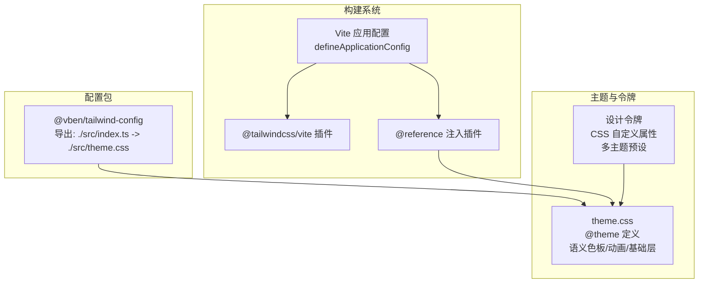
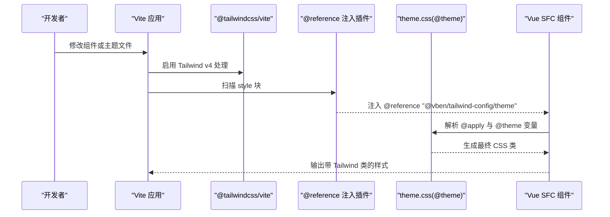
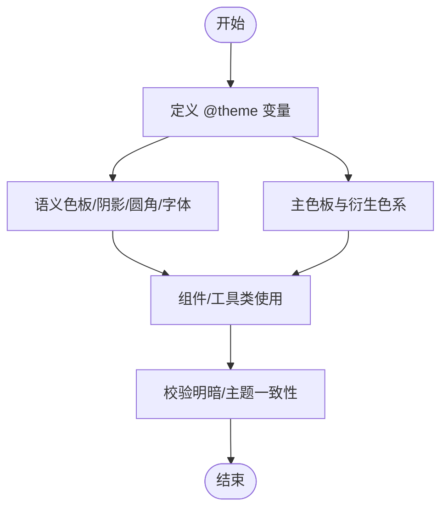
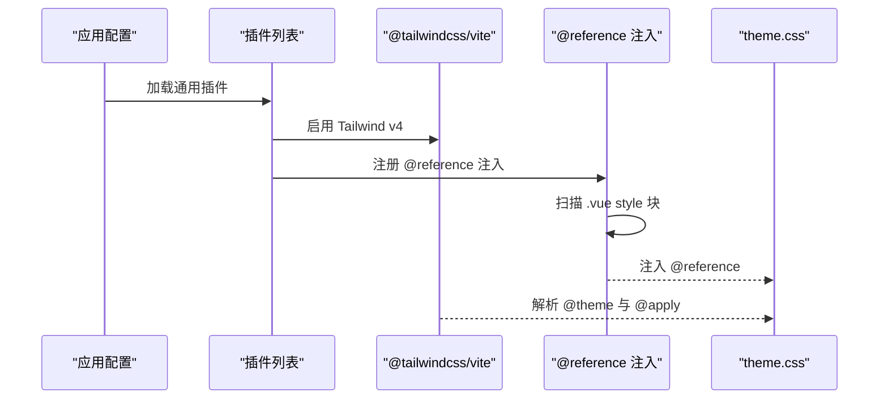
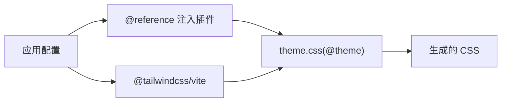

# Tailwind 定制

<cite>
**本文引用的文件**
- [internal/tailwind-config/src/index.ts](file://internal/tailwind-config/src/index.ts)
- [internal/tailwind-config/src/theme.css](file://internal/tailwind-config/src/theme.css)
- [internal/tailwind-config/package.json](file://internal/tailwind-config/package.json)
- [internal/vite-config/src/plugins/index.ts](file://internal/vite-config/src/plugins/index.ts)
- [internal/vite-config/src/plugins/tailwind-reference.ts](file://internal/vite-config/src/plugins/tailwind-reference.ts)
- [internal/vite-config/src/config/application.ts](file://internal/vite-config/src/config/application.ts)
- [internal/lint-configs/oxlint-config/src/configs/tailwindcss.ts](file://internal/lint-configs/oxlint-config/src/configs/tailwindcss.ts)
- [packages/@core/base/design/src/design-tokens/default.css](file://packages/@core/base/design/src/design-tokens/default.css)
- [packages/@core/preferences/src/constants.ts](file://packages/@core/preferences/src/constants.ts)
</cite>

## 目录

1. [简介](#简介)
2. [项目结构](#项目结构)
3. [核心组件](#核心组件)
4. [架构总览](#架构总览)
5. [详细组件分析](#详细组件分析)
6. [依赖关系分析](#依赖关系分析)
7. [性能考量](#性能考量)
8. [故障排查指南](#故障排查指南)
9. [结论](#结论)
10. [附录](#附录)

## 简介

本文件系统性梳理 shiyu-ui 项目中基于 Tailwind CSS v4 的定制化配置与最佳实践，涵盖主题变量体系（颜色、字体、间距、断点）、插件集成（官方与第三方）、样式覆盖与层叠规则、响应式与移动端适配策略，以及与 UI 组件库的协同机制。目标是帮助开发者在不破坏设计一致性的前提下，安全、可维护地扩展与定制样式。

## 项目结构

Tailwind 定制以“配置包 + 构建插件 + 主题令牌”三层结构组织：

- 配置包：集中定义主题变量、语义色板、动画与基础层样式，作为全站样式源。
- 构建插件：在 Vite 中启用 Tailwind v4 并自动注入主题引用，保证 scoped 样式块可访问 @theme 变量。
- 主题令牌：通过 CSS 自定义属性与多套预设主题，驱动明暗模式与主题切换。

**图表来源**

- [internal/tailwind-config/src/index.ts:1-2](file://internal/tailwind-config/src/index.ts#L1-L2)
- [internal/tailwind-config/src/theme.css:1-580](file://internal/tailwind-config/src/theme.css#L1-L580)
- [internal/tailwind-config/package.json:23-31](file://internal/tailwind-config/package.json#L23-L31)
- [internal/vite-config/src/plugins/index.ts:11-66](file://internal/vite-config/src/plugins/index.ts#L11-L66)
- [internal/vite-config/src/plugins/tailwind-reference.ts:14-40](file://internal/vite-config/src/plugins/tailwind-reference.ts#L14-L40)
- [internal/vite-config/src/config/application.ts:17-98](file://internal/vite-config/src/config/application.ts#L17-L98)

**章节来源**

- [internal/tailwind-config/src/index.ts:1-2](file://internal/tailwind-config/src/index.ts#L1-L2)
- [internal/tailwind-config/src/theme.css:1-580](file://internal/tailwind-config/src/theme.css#L1-L580)
- [internal/tailwind-config/package.json:1-39](file://internal/tailwind-config/package.json#L1-L39)
- [internal/vite-config/src/plugins/index.ts:11-66](file://internal/vite-config/src/plugins/index.ts#L11-L66)
- [internal/vite-config/src/plugins/tailwind-reference.ts:14-40](file://internal/vite-config/src/plugins/tailwind-reference.ts#L14-L40)
- [internal/vite-config/src/config/application.ts:17-98](file://internal/vite-config/src/config/application.ts#L17-L98)

## 核心组件

- 主题入口与导出
  - 配置包通过入口文件引入主题样式，暴露 theme.css 供外部引用。
  - 包导出包含主题文件路径，便于 Vite 插件与 Lint 工具定位。
- 主题样式（theme.css）
  - 使用 @theme 声明变量，包含字体族、圆角、阴影、动画、语义色板与自定义色板。
  - 定义暗色变体选择器、动态间距、关键帧与基础层样式。
  - 提供自定义 @utility 与组件层样式，确保与工具类层叠一致。
- 构建插件
  - 启用 @tailwindcss/vite 与自研 @reference 注入插件。
  - 在 Vue SFC 的 style 块中自动注入 @reference，使 @apply 能访问 @theme。
- 设计令牌
  - 通过 CSS 自定义属性与多主题预设，驱动明暗模式与主题切换。
  - 与 UI 组件库配合，保证组件状态与主题变量一致。

**章节来源**

- [internal/tailwind-config/src/index.ts:1-2](file://internal/tailwind-config/src/index.ts#L1-L2)
- [internal/tailwind-config/src/theme.css:13-234](file://internal/tailwind-config/src/theme.css#L13-L234)
- [internal/tailwind-config/src/theme.css:291-436](file://internal/tailwind-config/src/theme.css#L291-L436)
- [internal/tailwind-config/package.json:23-31](file://internal/tailwind-config/package.json#L23-L31)
- [internal/vite-config/src/plugins/index.ts:11-66](file://internal/vite-config/src/plugins/index.ts#L11-L66)
- [internal/vite-config/src/plugins/tailwind-reference.ts:14-40](file://internal/vite-config/src/plugins/tailwind-reference.ts#L14-L40)
- [packages/@core/base/design/src/design-tokens/default.css:286-491](file://packages/@core/base/design/src/design-tokens/default.css#L286-L491)

## 架构总览

Tailwind v4 在本项目中的工作流如下：

- 开发时由 @tailwindcss/vite 处理 CSS，扫描源码并生成所需类。
- 自动注入插件确保每个使用 @apply 的 Vue SFC 都能访问 @theme。
- theme.css 提供完整的变量与层叠规则，组件层样式位于 @layer components。
- 设计令牌通过 CSS 自定义属性与主题预设，驱动明暗与主题切换。

**图表来源**

- [internal/vite-config/src/plugins/index.ts:11-66](file://internal/vite-config/src/plugins/index.ts#L11-L66)
- [internal/vite-config/src/plugins/tailwind-reference.ts:14-40](file://internal/vite-config/src/plugins/tailwind-reference.ts#L14-L40)
- [internal/tailwind-config/src/theme.css:1-12](file://internal/tailwind-config/src/theme.css#L1-L12)

**章节来源**

- [internal/vite-config/src/plugins/index.ts:11-66](file://internal/vite-config/src/plugins/index.ts#L11-L66)
- [internal/vite-config/src/plugins/tailwind-reference.ts:14-40](file://internal/vite-config/src/plugins/tailwind-reference.ts#L14-L40)
- [internal/tailwind-config/src/theme.css:1-12](file://internal/tailwind-config/src/theme.css#L1-L12)

## 详细组件分析

### 主题变量与语义色板

- 变量结构
  - 字体族：通过 --font-sans 映射到 --font-family。
  - 圆角与阴影：--radius-_ 与 --shadow-_ 提供统一的视觉层级。
  - 动画：--animate-\* 定义折叠/展开等动画别名。
  - 语义色板：background/foreground/card/popover/muted/accent/border/input/ring/secondary 等。
  - 自定义色板：header/heavy/main/overlay/sidebar 等业务相关语义色。
  - 主色板与衍生色：primary/destructive/success/warning/green/red/yellow 系列，含 50~900 与 hover/active/text 等变体。
- 使用建议
  - 优先使用语义色板与自定义色板，避免直接硬编码颜色值。
  - 衍生色通过 hsl(var(--primary-500)) 等方式派生，保持一致性。

**图表来源**

- [internal/tailwind-config/src/theme.css:21-234](file://internal/tailwind-config/src/theme.css#L21-L234)

**章节来源**

- [internal/tailwind-config/src/theme.css:21-234](file://internal/tailwind-config/src/theme.css#L21-L234)

### 动态间距与断点

- 动态间距
  - 通过 @theme pinning 固定 v4 动态间距行为，确保如 w-150/h-55 等类稳定可用。
- 断点
  - 项目未显式声明自定义断点，遵循 Tailwind v4 默认断点；如需扩展，可在 @theme 中新增 --breakpoints 并配合 @screen 或 @apply 自定义断点工具类。

**章节来源**

- [internal/tailwind-config/src/theme.css:16-19](file://internal/tailwind-config/src/theme.css#L16-L19)

### 动画与关键帧

- 关键帧
  - 定义 accordion/collapsible/floating 等动画，配合 --animate-\* 别名使用。
- 使用建议
  - 将动画别名用于交互组件（如折叠面板），避免重复编写关键帧。

**章节来源**

- [internal/tailwind-config/src/theme.css:236-289](file://internal/tailwind-config/src/theme.css#L236-L289)

### 基础层与组件层

- 基础层（base）
  - 统一盒模型、滚动条、链接无下划线、视图过渡等全局基线。
- 组件层（components）
  - 自定义组件样式（如 outline-box、card-box、vben-link）置于该层，确保与工具类层叠一致。
- 使用建议
  - 新增组件样式一律放入 @layer components，避免被工具类覆盖。

**章节来源**

- [internal/tailwind-config/src/theme.css:291-436](file://internal/tailwind-config/src/theme.css#L291-L436)

### 自定义工具类（@utility）

- 提供 flex-center 与 flex-col-center 等常用布局工具类，减少重复代码。
- 使用建议
  - 仅在确有复用价值时新增，避免过度膨胀工具类集合。

**章节来源**

- [internal/tailwind-config/src/theme.css:392-404](file://internal/tailwind-config/src/theme.css#L392-L404)

### 暗色模式与明暗切换

- 暗色模式
  - 使用 .dark 选择器，配合设计令牌的明/暗两套变量，实现主题切换。
- 切换策略
  - 通过偏好设置与 UI 令牌联动，更新根元素或容器上的类名，驱动 CSS 变量切换。

**章节来源**

- [internal/tailwind-config/src/theme.css:13-14](file://internal/tailwind-config/src/theme.css#L13-L14)
- [packages/@core/base/design/src/design-tokens/default.css:286-491](file://packages/@core/base/design/src/design-tokens/default.css#L286-L491)

### 插件集成与配置

- 官方插件
  - @tailwindcss/typography：增强文本排版样式。
  - tw-animate-css：提供常用动画类。
- 第三方插件
  - @iconify/tailwind4：图标类支持。
- 配置方式
  - 在 theme.css 中通过 @plugin 引入，无需额外 JS 配置。
- 注意事项
  - 插件版本与 Tailwind v4 兼容性需关注官方升级说明。

**章节来源**

- [internal/tailwind-config/src/theme.css:4-5](file://internal/tailwind-config/src/theme.css#L4-L5)
- [internal/tailwind-config/package.json:32-37](file://internal/tailwind-config/package.json#L32-L37)

### 构建与注入机制

- @tailwindcss/vite
  - 在 Vite 插件列表中启用，负责扫描与生成 CSS。
- @reference 注入插件
  - 仅对 Vue SFC 的 style 块生效，自动注入 @reference "@vben/tailwind-config/theme"，使 @apply 能解析 @theme。
  - 仅在存在 @apply 且未手动包含 @reference 时注入，避免冗余。
- 应用配置
  - defineApplicationConfig 中合并通用配置与应用特定配置，确保插件顺序与作用域正确。

**图表来源**

- [internal/vite-config/src/plugins/index.ts:11-66](file://internal/vite-config/src/plugins/index.ts#L11-L66)
- [internal/vite-config/src/plugins/tailwind-reference.ts:14-40](file://internal/vite-config/src/plugins/tailwind-reference.ts#L14-L40)

**章节来源**

- [internal/vite-config/src/plugins/index.ts:11-66](file://internal/vite-config/src/plugins/index.ts#L11-L66)
- [internal/vite-config/src/plugins/tailwind-reference.ts:14-40](file://internal/vite-config/src/plugins/tailwind-reference.ts#L14-L40)
- [internal/vite-config/src/config/application.ts:17-98](file://internal/vite-config/src/config/application.ts#L17-L98)

### 与 UI 框架适配器的协作

- 组件层样式
  - 所有组件样式置于 @layer components，避免被工具类覆盖。
- 语义色板与组件状态
  - 组件内部使用 --color-\* 语义变量，确保与主题令牌一致。
- 示例
  - 布局组件使用 header/sidebar/background 等语义色，表单组件使用 destructive 等状态色。

**章节来源**

- [internal/tailwind-config/src/theme.css:408-436](file://internal/tailwind-config/src/theme.css#L408-L436)
- [packages/@core/ui-kit/layout-ui/src/components/layout-header.vue:66](file://packages/@core/ui-kit/layout-ui/src/components/layout-header.vue#L66)
- [packages/@core/ui-kit/form-ui/src/form-render/form-field.vue:407](file://packages/@core/ui-kit/form-ui/src/form-render/form-field.vue#L407)

### 响应式设计与移动端适配

- 响应式策略
  - 使用 Tailwind v4 默认断点，结合 @apply 与组件层样式实现响应式布局。
- 移动端适配
  - 基础层中针对非 macOS 平台调整滚动条样式，提升移动端体验。
  - 通过语义色板与阴影变量统一移动端交互反馈。

**章节来源**

- [internal/tailwind-config/src/theme.css:365-382](file://internal/tailwind-config/src/theme.css#L365-L382)

### 样式覆盖最佳实践

- 层叠原则
  - 组件样式置于 @layer components，工具类优先级高于基础层，确保可控覆盖。
- 变量优先
  - 使用 @theme 与设计令牌变量，避免硬编码颜色与尺寸。
- 一致性保障
  - 通过语义色板与衍生色系，统一按钮、边框、背景等视觉语言。
- 渐进增强
  - 新增动画与过渡效果时，先在 @theme 中定义别名，再在组件中使用。

**章节来源**

- [internal/tailwind-config/src/theme.css:291-436](file://internal/tailwind-config/src/theme.css#L291-L436)
- [internal/tailwind-config/src/theme.css:438-580](file://internal/tailwind-config/src/theme.css#L438-L580)

## 依赖关系分析

- 配置包依赖
  - @tailwindcss/vite：Tailwind v4 的 Vite 插件。
  - @tailwindcss/typography：文本排版增强。
  - @iconify/tailwind4：图标类支持。
  - tw-animate-css：动画类库。
- 构建链路
  - Vite 应用加载插件 → @tailwindcss/vite 扫描 → @reference 注入 → theme.css 解析 → 输出 CSS。

**图表来源**

- [internal/vite-config/src/plugins/index.ts:11-66](file://internal/vite-config/src/plugins/index.ts#L11-L66)
- [internal/vite-config/src/plugins/tailwind-reference.ts:14-40](file://internal/vite-config/src/plugins/tailwind-reference.ts#L14-L40)
- [internal/tailwind-config/src/theme.css:1-12](file://internal/tailwind-config/src/theme.css#L1-L12)

**章节来源**

- [internal/vite-config/src/plugins/index.ts:11-66](file://internal/vite-config/src/plugins/index.ts#L11-L66)
- [internal/vite-config/src/plugins/tailwind-reference.ts:14-40](file://internal/vite-config/src/plugins/tailwind-reference.ts#L14-L40)
- [internal/tailwind-config/package.json:32-37](file://internal/tailwind-config/package.json#L32-L37)

## 性能考量

- 构建优化
  - 在生产环境开启压缩与可视化分析，减少打包体积与排查性能瓶颈。
- 样式体积控制
  - 通过 @source 指向 packages/apps/docs/playground，确保仅扫描实际使用的类，避免无用样式进入产物。
- 运行时性能
  - 使用语义色板与动画别名，减少重复关键帧与复杂计算。
  - 控制自定义工具类数量，避免过度膨胀。

**章节来源**

- [internal/tailwind-config/src/theme.css:7-11](file://internal/tailwind-config/src/theme.css#L7-L11)
- [internal/vite-config/src/config/application.ts:60-76](file://internal/vite-config/src/config/application.ts#L60-L76)

## 故障排查指南

- 现象：组件内 @apply 无法解析 @theme 变量
  - 排查：确认是否为 Vue SFC 的 style 块，且未手动包含 @reference；检查 @reference 注入插件是否启用。
  - 处理：确保 @reference 注入插件在插件列表中，且未被禁用。
- 现象：明暗切换后样式异常
  - 排查：确认根元素或容器上已正确切换 .dark 类，且设计令牌已同步更新对应变量。
  - 处理：检查主题预设与切换逻辑，确保 CSS 变量映射一致。
- 现象：新增组件样式被工具类覆盖
  - 排查：确认组件样式是否置于 @layer components。
  - 处理：将样式迁移至 @layer components，或调整工具类优先级。

**章节来源**

- [internal/vite-config/src/plugins/tailwind-reference.ts:14-40](file://internal/vite-config/src/plugins/tailwind-reference.ts#L14-L40)
- [internal/tailwind-config/src/theme.css:13-14](file://internal/tailwind-config/src/theme.css#L13-L14)
- [internal/tailwind-config/src/theme.css:408-436](file://internal/tailwind-config/src/theme.css#L408-L436)

## 结论

本项目采用“配置包 + 构建插件 + 主题令牌”的三层架构，围绕 Tailwind CSS v4 的 @theme 与层叠模型，建立了完善的主题变量体系与样式治理流程。通过 @reference 注入插件与 @layer components 的约束，确保了样式覆盖的安全性与一致性；借助设计令牌与多主题预设，实现了明暗与主题切换的平滑过渡。建议在后续扩展中继续遵循“语义优先、变量优先、层叠可控”的原则，持续优化性能与可维护性。

## 附录

- 主题预设与切换
  - 通过内置主题常量与设计令牌，支持多种主题类型与自定义色值。
- Lint 配置
  - 使用 better-tailwindcss 插件进行类名一致性与未知类检测，辅助规范团队开发。

**章节来源**

- [packages/@core/preferences/src/constants.ts:10-79](file://packages/@core/preferences/src/constants.ts#L10-L79)
- [internal/lint-configs/oxlint-config/src/configs/tailwindcss.ts:26-55](file://internal/lint-configs/oxlint-config/src/configs/tailwindcss.ts#L26-L55)
