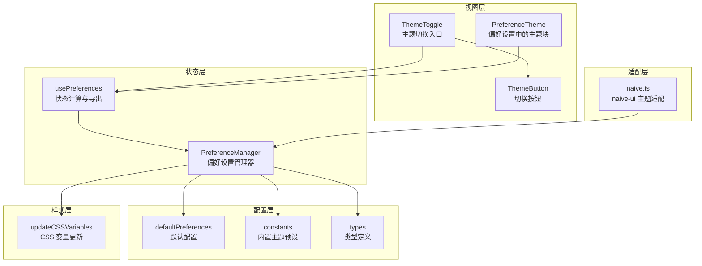
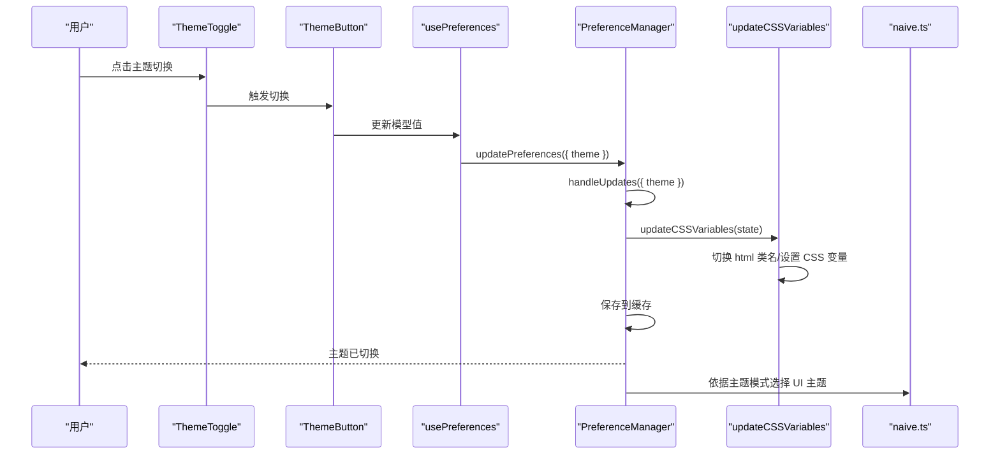
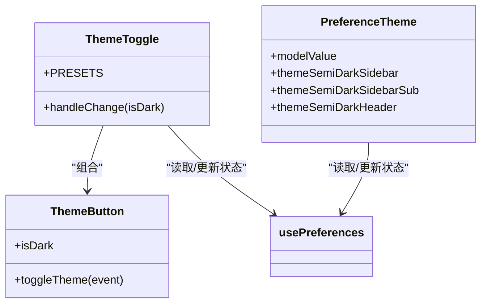
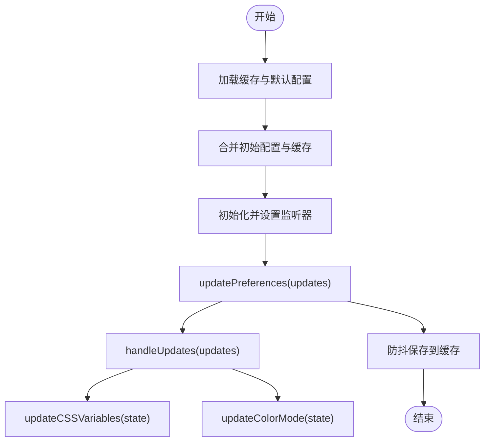
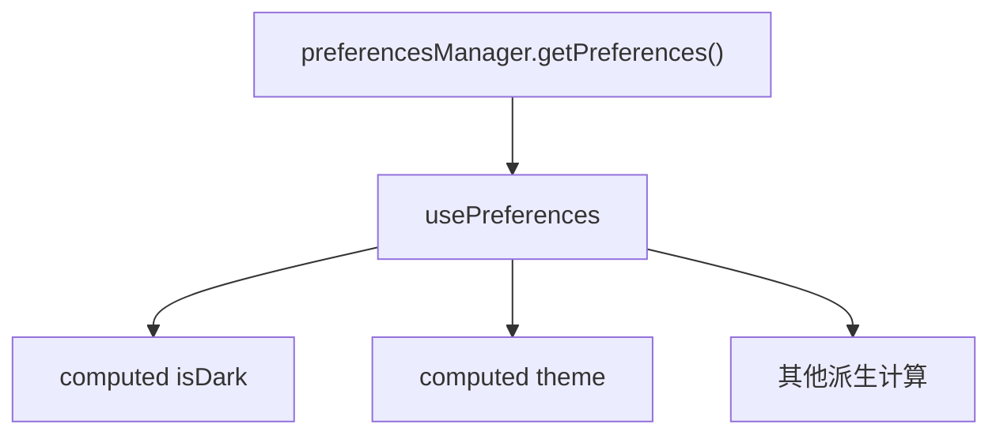
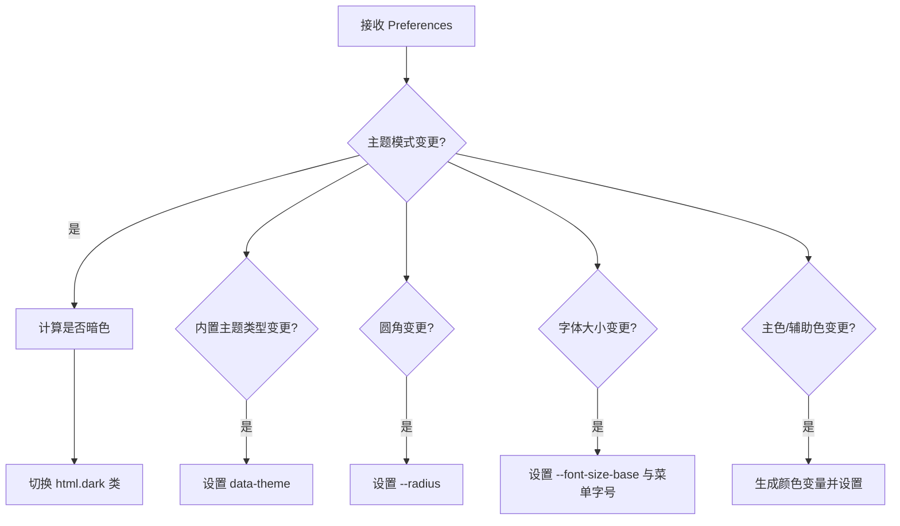
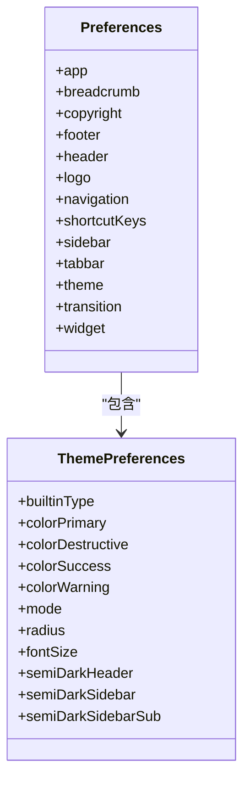
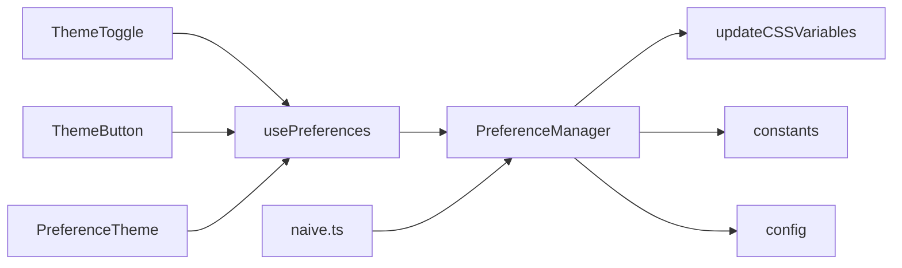

# 主题切换

<cite>
**本文引用的文件**
- [theme-toggle.vue](file://packages/effects/layouts/src/widgets/theme-toggle/theme-toggle.vue)
- [theme-button.vue](file://packages/effects/layouts/src/widgets/theme-toggle/theme-button.vue)
- [preferences.ts](file://packages/@core/preferences/src/preferences.ts)
- [use-preferences.ts](file://packages/@core/preferences/src/use-preferences.ts)
- [update-css-variables.ts](file://packages/@core/preferences/src/update-css-variables.ts)
- [config.ts](file://packages/@core/preferences/src/config.ts)
- [types.ts](file://packages/@core/preferences/src/types.ts)
- [constants.ts](file://packages/@core/preferences/src/constants.ts)
- [theme.vue](file://packages/effects/layouts/src/widgets/preferences/blocks/theme/theme.vue)
- [naive.ts](file://apps/web-naive/src/adapter/naive.ts)
- [index.ts](file://packages/effects/layouts/src/widgets/theme-toggle/index.ts)
- [preferences.ts](file://apps/web-naive/src/preferences.ts)
</cite>

## 目录

1. [简介](#简介)
2. [项目结构](#项目结构)
3. [核心组件](#核心组件)
4. [架构总览](#架构总览)
5. [详细组件分析](#详细组件分析)
6. [依赖关系分析](#依赖关系分析)
7. [性能考量](#性能考量)
8. [故障排查指南](#故障排查指南)
9. [结论](#结论)
10. [附录](#附录)

## 简介

本文件面向 shiyu-ui 的主题切换功能，系统性阐述动态主题切换的实现原理与工程实践，涵盖主题状态管理、切换触发机制、视觉反馈处理、CSS 变量动态更新、组件重新渲染、用户体验优化、主题缓存与持久化、页面刷新恢复机制、API 使用指南、性能优化与兼容性处理等。

## 项目结构

主题切换涉及以下关键模块：

- 视图层组件：主题切换按钮与切换面板
- 状态层：偏好设置管理器与响应式状态钩子
- 配置层：默认主题配置、内置主题预设与类型定义
- 样式层：CSS 变量更新与类名切换
- 适配层：UI 框架（如 naive-ui）的主题适配

**图表来源**

- [theme-toggle.vue:1-84](file://packages/effects/layouts/src/widgets/theme-toggle/theme-toggle.vue#L1-L84)
- [theme-button.vue:1-165](file://packages/effects/layouts/src/widgets/theme-toggle/theme-button.vue#L1-L165)
- [preferences.ts:1-459](file://packages/@core/preferences/src/preferences.ts#L1-L459)
- [use-preferences.ts:1-268](file://packages/@core/preferences/src/use-preferences.ts#L1-L268)
- [update-css-variables.ts:1-130](file://packages/@core/preferences/src/update-css-variables.ts#L1-L130)
- [config.ts:1-148](file://packages/@core/preferences/src/config.ts#L1-L148)
- [constants.ts:1-117](file://packages/@core/preferences/src/constants.ts#L1-L117)
- [theme.vue:1-115](file://packages/effects/layouts/src/widgets/preferences/blocks/theme/theme.vue#L1-L115)
- [naive.ts:1-25](file://apps/web-naive/src/adapter/naive.ts#L1-L25)

**章节来源**

- [theme-toggle.vue:1-84](file://packages/effects/layouts/src/widgets/theme-toggle/theme-toggle.vue#L1-L84)
- [theme-button.vue:1-165](file://packages/effects/layouts/src/widgets/theme-toggle/theme-button.vue#L1-L165)
- [preferences.ts:1-459](file://packages/@core/preferences/src/preferences.ts#L1-L459)
- [use-preferences.ts:1-268](file://packages/@core/preferences/src/use-preferences.ts#L1-L268)
- [update-css-variables.ts:1-130](file://packages/@core/preferences/src/update-css-variables.ts#L1-L130)
- [config.ts:1-148](file://packages/@core/preferences/src/config.ts#L1-L148)
- [constants.ts:1-117](file://packages/@core/preferences/src/constants.ts#L1-L117)
- [theme.vue:1-115](file://packages/effects/layouts/src/widgets/preferences/blocks/theme/theme.vue#L1-L115)
- [naive.ts:1-25](file://apps/web-naive/src/adapter/naive.ts#L1-L25)

## 核心组件

- 主题切换入口组件：负责展示与交互，触发偏好设置更新
- 切换按钮组件：支持点击切换与视图过渡动画
- 偏好设置管理器：集中管理主题状态、持久化与系统偏好监听
- 响应式状态钩子：对外暴露主题状态与派生计算
- CSS 变量更新器：根据主题配置动态更新根元素 CSS 变量与类名
- 默认配置与内置主题：提供默认主题、内置主题预设与类型约束
- UI 适配：根据当前主题模式选择 UI 框架主题

**章节来源**

- [theme-toggle.vue:1-84](file://packages/effects/layouts/src/widgets/theme-toggle/theme-toggle.vue#L1-L84)
- [theme-button.vue:1-165](file://packages/effects/layouts/src/widgets/theme-toggle/theme-button.vue#L1-L165)
- [preferences.ts:1-459](file://packages/@core/preferences/src/preferences.ts#L1-L459)
- [use-preferences.ts:1-268](file://packages/@core/preferences/src/use-preferences.ts#L1-L268)
- [update-css-variables.ts:1-130](file://packages/@core/preferences/src/update-css-variables.ts#L1-L130)
- [config.ts:1-148](file://packages/@core/preferences/src/config.ts#L1-L148)
- [constants.ts:1-117](file://packages/@core/preferences/src/constants.ts#L1-L117)
- [naive.ts:1-25](file://apps/web-naive/src/adapter/naive.ts#L1-L25)

## 架构总览

主题切换的控制流如下：

- 用户在视图层触发切换（按钮或面板）
- 视图层通过偏好设置 API 更新主题配置
- 管理器接收更新，合并状态并触发处理逻辑
- CSS 变量更新器根据主题模式与配置更新根元素类名与 CSS 变量
- UI 适配层根据当前主题模式选择对应 UI 主题
- 管理器将主题状态持久化到本地存储，支持页面刷新后恢复

**图表来源**

- [theme-toggle.vue:28-32](file://packages/effects/layouts/src/widgets/theme-toggle/theme-toggle.vue#L28-L32)
- [theme-button.vue:42-82](file://packages/effects/layouts/src/widgets/theme-toggle/theme-button.vue#L42-L82)
- [use-preferences.ts:37-51](file://packages/@core/preferences/src/use-preferences.ts#L37-L51)
- [preferences.ts:206-216](file://packages/@core/preferences/src/preferences.ts#L206-L216)
- [update-css-variables.ts:12-82](file://packages/@core/preferences/src/update-css-variables.ts#L12-L82)
- [naive.ts:5-22](file://apps/web-naive/src/adapter/naive.ts#L5-L22)

## 详细组件分析

### 视图层组件

- ThemeToggle：提供三态主题切换（亮/暗/跟随系统），支持 Tooltip 与切换组
- ThemeButton：支持点击切换与现代浏览器的视图过渡动画（View Transitions）
- PreferenceTheme：偏好设置面板中的主题选择块，支持半深色侧边栏/头部开关

**图表来源**

- [theme-toggle.vue:28-52](file://packages/effects/layouts/src/widgets/theme-toggle/theme-toggle.vue#L28-L52)
- [theme-button.vue:42-82](file://packages/effects/layouts/src/widgets/theme-toggle/theme-button.vue#L42-L82)
- [theme.vue:18-32](file://packages/effects/layouts/src/widgets/preferences/blocks/theme/theme.vue#L18-L32)

**章节来源**

- [theme-toggle.vue:1-84](file://packages/effects/layouts/src/widgets/theme-toggle/theme-toggle.vue#L1-L84)
- [theme-button.vue:1-165](file://packages/effects/layouts/src/widgets/theme-toggle/theme-button.vue#L1-L165)
- [theme.vue:1-115](file://packages/effects/layouts/src/widgets/preferences/blocks/theme/theme.vue#L1-L115)

### 状态管理层

- PreferenceManager：集中管理偏好设置，提供初始化、更新、重置、清除缓存、扩展偏好设置等功能
- 关键职责：
  - 从本地存储加载并合并默认配置
  - 监听系统主题变化（仅在自动模式下）
  - 深度合并更新并触发处理逻辑
  - 将主题状态写入缓存（含主题模式与语言）
  - 提供扩展偏好设置的校验与持久化

**图表来源**

- [preferences.ts:110-158](file://packages/@core/preferences/src/preferences.ts#L110-L158)
- [preferences.ts:206-216](file://packages/@core/preferences/src/preferences.ts#L206-L216)
- [preferences.ts:238-254](file://packages/@core/preferences/src/preferences.ts#L238-L254)
- [preferences.ts:390-401](file://packages/@core/preferences/src/preferences.ts#L390-L401)

**章节来源**

- [preferences.ts:1-459](file://packages/@core/preferences/src/preferences.ts#L1-L459)

### 响应式状态钩子

- usePreferences：对外暴露主题状态、布局、语言等派生计算
- 关键计算：
  - isDark：根据主题模式判断是否为暗色
  - theme：基于 isDark 返回字符串形式的主题
  - 布局与显示相关计算

**图表来源**

- [use-preferences.ts:8-51](file://packages/@core/preferences/src/use-preferences.ts#L8-L51)

**章节来源**

- [use-preferences.ts:1-268](file://packages/@core/preferences/src/use-preferences.ts#L1-L268)

### CSS 变量与类名更新

- updateCSSVariables：根据主题模式与配置更新根元素类名与 CSS 变量
  - 切换 html 的 dark 类
  - 设置 data-theme 属性
  - 更新主色、半深色、圆角、字体大小等变量
- isDarkTheme：解析主题模式（支持自动跟随系统）

**图表来源**

- [update-css-variables.ts:12-82](file://packages/@core/preferences/src/update-css-variables.ts#L12-L82)
- [update-css-variables.ts:88-119](file://packages/@core/preferences/src/update-css-variables.ts#L88-L119)
- [update-css-variables.ts:121-127](file://packages/@core/preferences/src/update-css-variables.ts#L121-L127)

**章节来源**

- [update-css-variables.ts:1-130](file://packages/@core/preferences/src/update-css-variables.ts#L1-L130)

### 配置与类型

- defaultPreferences：提供默认主题配置（模式、主色、半深色、圆角、字体大小等）
- constants：内置主题预设列表（含明暗主题色）
- types：主题相关类型定义（模式、内置主题类型、颜色字段等）

**图表来源**

- [config.ts:3-145](file://packages/@core/preferences/src/config.ts#L3-L145)
- [types.ts:317-340](file://packages/@core/preferences/src/types.ts#L317-L340)

**章节来源**

- [config.ts:1-148](file://packages/@core/preferences/src/config.ts#L1-L148)
- [constants.ts:1-117](file://packages/@core/preferences/src/constants.ts#L1-L117)
- [types.ts:1-441](file://packages/@core/preferences/src/types.ts#L1-L441)

### UI 适配（以 naive-ui 为例）

- 根据当前主题模式选择 lightTheme 或 darkTheme，并注入到 Provider 中
- 通过响应式属性联动主题切换

**章节来源**

- [naive.ts:5-22](file://apps/web-naive/src/adapter/naive.ts#L5-L22)

## 依赖关系分析

- 视图层依赖 usePreferences 提供的状态与更新函数
- usePreferences 依赖 PreferenceManager 管理器
- PreferenceManager 依赖 updateCSSVariables 进行样式更新
- PreferenceManager 依赖 constants 与 config 提供的默认值与预设
- UI 适配层依赖 PreferenceManager 的主题状态

**图表来源**

- [theme-toggle.vue:6-16](file://packages/effects/layouts/src/widgets/theme-toggle/theme-toggle.vue#L6-L16)
- [theme-button.vue:1-2](file://packages/effects/layouts/src/widgets/theme-toggle/theme-button.vue#L1-L2)
- [theme.vue:8-12](file://packages/effects/layouts/src/widgets/preferences/blocks/theme/theme.vue#L8-L12)
- [use-preferences.ts:5-6](file://packages/@core/preferences/src/use-preferences.ts#L5-L6)
- [preferences.ts:23-23](file://packages/@core/preferences/src/preferences.ts#L23-L23)
- [naive.ts:5-22](file://apps/web-naive/src/adapter/naive.ts#L5-L22)

**章节来源**

- [index.ts:1-2](file://packages/effects/layouts/src/widgets/theme-toggle/index.ts#L1-L2)

## 性能考量

- 防抖保存：偏好设置更新采用防抖策略，降低频繁写入本地存储的成本
- 条件更新：仅在主题相关字段变更时更新 CSS 变量，避免不必要的重绘
- 视图过渡：在支持的浏览器中使用 View Transitions 实现平滑切换，减少闪烁
- 系统主题监听：仅在自动模式下监听系统主题变化，避免无效更新
- UI 主题切换：按需切换 UI 框架主题，避免全量重渲染

**章节来源**

- [preferences.ts:47-47](file://packages/@core/preferences/src/preferences.ts#L47-L47)
- [preferences.ts:425-441](file://packages/@core/preferences/src/preferences.ts#L425-L441)
- [theme-button.vue:42-82](file://packages/effects/layouts/src/widgets/theme-toggle/theme-button.vue#L42-L82)
- [update-css-variables.ts:12-82](file://packages/@core/preferences/src/update-css-variables.ts#L12-L82)
- [naive.ts:5-22](file://apps/web-naive/src/adapter/naive.ts#L5-L22)

## 故障排查指南

- 主题未生效
  - 检查根元素是否正确添加/移除 dark 类
  - 确认 CSS 变量是否被设置（如 --primary、--radius、--font-size-base）
  - 核对主题模式是否为 auto 且系统主题变化被正确监听
- 切换无反应
  - 确认视图层是否调用了更新函数并传入正确的主题模式
  - 检查 usePreferences 是否正确导出 isDark 与 theme
- 刷新后主题丢失
  - 确认本地存储键值存在且未被清理
  - 检查初始化流程是否正确合并缓存与默认配置
- UI 主题不匹配
  - 确认 UI 适配层是否根据当前主题模式选择了对应主题

**章节来源**

- [update-css-variables.ts:24-35](file://packages/@core/preferences/src/update-css-variables.ts#L24-L35)
- [preferences.ts:390-401](file://packages/@core/preferences/src/preferences.ts#L390-L401)
- [naive.ts:5-22](file://apps/web-naive/src/adapter/naive.ts#L5-L22)

## 结论

shiyu-ui 的主题切换通过“视图层-状态层-样式层-适配层”的清晰分层，实现了可配置、可持久化、可跟随系统、可平滑过渡的主题体验。其核心在于：

- 集中式偏好管理与防抖持久化
- 条件化的 CSS 变量更新
- 响应式的状态导出与 UI 适配
- 视图过渡与系统偏好监听的用户体验增强

## 附录

### API 使用指南

- 初始化偏好设置
  - 在应用启动时调用初始化函数，传入命名空间与覆盖配置
  - 初始化会合并缓存与默认配置，并设置监听器
- 更新主题
  - 通过更新函数传入主题配置（模式、内置主题类型、主色等）
  - 管理器会自动触发 CSS 变量更新与持久化
- 查询状态
  - 使用状态钩子获取当前主题模式、是否暗色、布局等信息
- 清除缓存
  - 在需要重置偏好设置时调用清除缓存函数

**章节来源**

- [preferences.ts:110-158](file://packages/@core/preferences/src/preferences.ts#L110-L158)
- [preferences.ts:206-216](file://packages/@core/preferences/src/preferences.ts#L206-L216)
- [use-preferences.ts:37-51](file://packages/@core/preferences/src/use-preferences.ts#L37-L51)

### 主题缓存策略

- 存储键值
  - 主配置：preferences
  - 主题模式：preferences-theme
  - 语言：preferences-locale
  - 扩展偏好设置：preferences-custom
- 持久化时机
  - 更新后进行防抖保存，避免频繁写入
- 刷新恢复
  - 初始化时从本地存储加载并合并默认配置
  - 系统主题监听仅在自动模式下生效

**章节来源**

- [preferences.ts:25-30](file://packages/@core/preferences/src/preferences.ts#L25-L30)
- [preferences.ts:390-401](file://packages/@core/preferences/src/preferences.ts#L390-L401)
- [preferences.ts:132-149](file://packages/@core/preferences/src/preferences.ts#L132-L149)

### 兼容性与最佳实践

- 浏览器支持
  - 使用 View Transitions 时注意降级处理（减少动画）
  - 系统主题监听使用标准媒体查询 API
- 移动端适配
  - 响应式断点用于判断移动端场景，影响部分布局行为
- UI 框架适配
  - 根据当前主题模式选择对应 UI 主题，确保组件外观一致

**章节来源**

- [theme-button.vue:42-82](file://packages/effects/layouts/src/widgets/theme-toggle/theme-button.vue#L42-L82)
- [preferences.ts:411-423](file://packages/@core/preferences/src/preferences.ts#L411-L423)
- [naive.ts:5-22](file://apps/web-naive/src/adapter/naive.ts#L5-L22)
