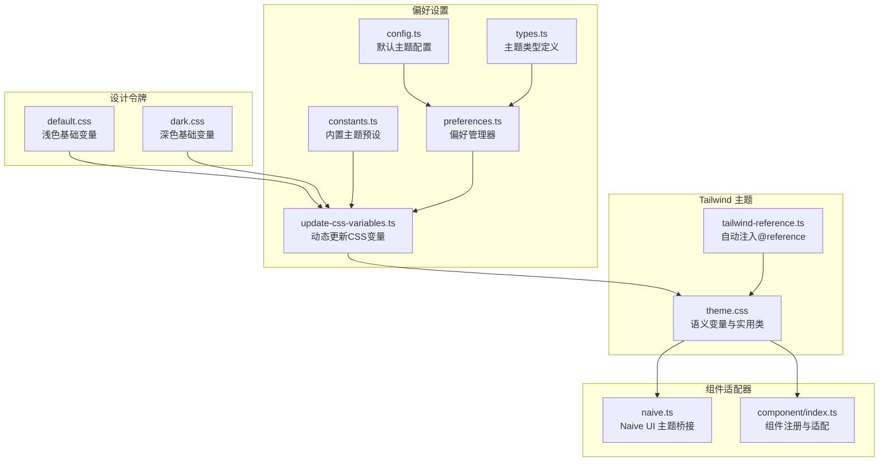
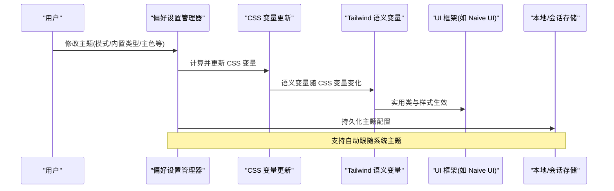
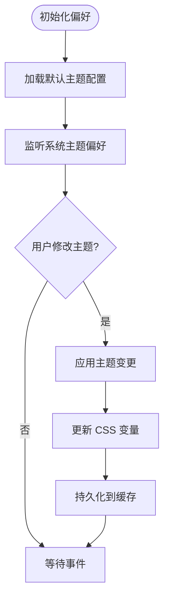
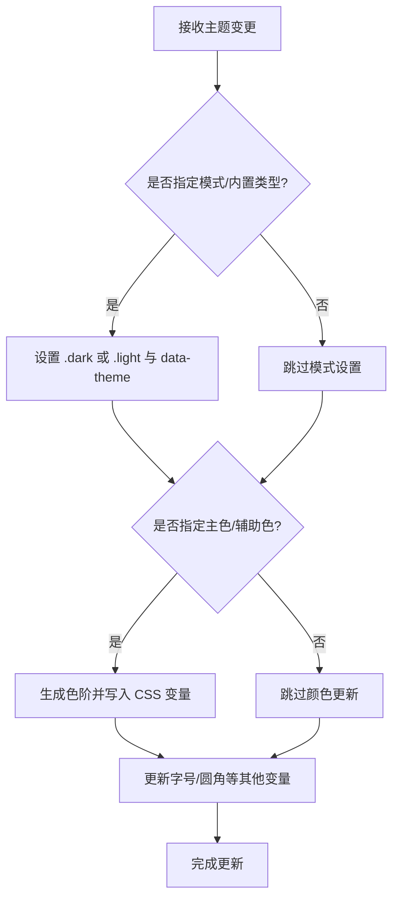
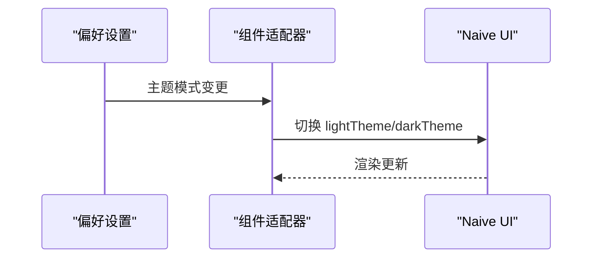
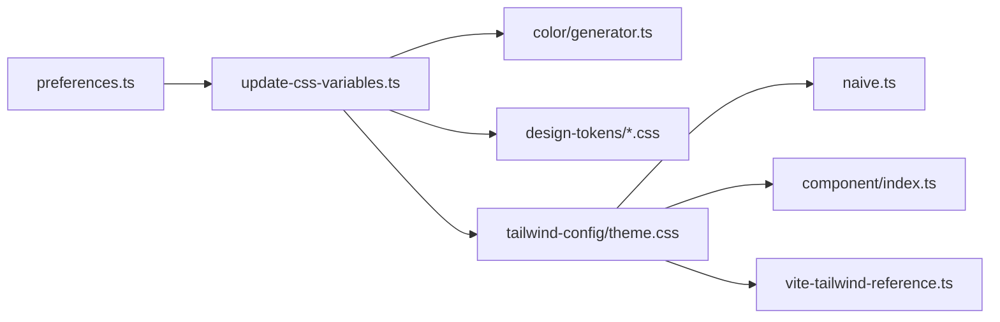

# 主题系统

<cite>
**本文引用的文件**
- [packages/@core/preferences/src/update-css-variables.ts](file://packages/@core/preferences/src/update-css-variables.ts)
- [packages/@core/preferences/src/constants.ts](file://packages/@core/preferences/src/constants.ts)
- [packages/@core/preferences/src/types.ts](file://packages/@core/preferences/src/types.ts)
- [packages/@core/preferences/src/config.ts](file://packages/@core/preferences/src/config.ts)
- [packages/@core/preferences/src/preferences.ts](file://packages/@core/preferences/src/preferences.ts)
- [packages/@core/base/design/src/design-tokens/default.css](file://packages/@core/base/design/src/design-tokens/default.css)
- [packages/@core/base/design/src/design-tokens/dark.css](file://packages/@core/base/design/src/design-tokens/dark.css)
- [packages/@core/base/shared/src/color/generator.ts](file://packages/@core/base/shared/src/color/generator.ts)
- [internal/tailwind-config/src/theme.css](file://internal/tailwind-config/src/theme.css)
- [internal/vite-config/src/plugins/tailwind-reference.ts](file://internal/vite-config/src/plugins/tailwind-reference.ts)
- [apps/web-naive/src/adapter/component/index.ts](file://apps/web-naive/src/adapter/component/index.ts)
- [apps/web-naive/src/adapter/naive.ts](file://apps/web-naive/src/adapter/naive.ts)
</cite>

## 目录

1. [简介](#简介)
2. [项目结构](#项目结构)
3. [核心组件](#核心组件)
4. [架构总览](#架构总览)
5. [详细组件分析](#详细组件分析)
6. [依赖关系分析](#依赖关系分析)
7. [性能考量](#性能考量)
8. [故障排查指南](#故障排查指南)
9. [结论](#结论)
10. [附录](#附录)

## 简介

本文件系统性梳理 shiyu-ui 项目的主题系统，覆盖以下关键目标：

- 主题配置的实现方式：颜色变量、字体设置与布局样式的统一管理
- 主题切换机制：动态主题加载、主题缓存与持久化存储
- Tailwind CSS 定制：主题变量的定义与样式类扩展
- 组件适配器：如何适配不同 UI 框架的主题
- 自定义主题开发指南：颜色体系设计与样式规范
- 性能优化与兼容性建议

## 项目结构

主题系统由“设计令牌”“偏好设置管理”“Tailwind 主题”“组件适配器”四部分协同构成：

- 设计令牌：通过 CSS 变量定义基础语义色、圆角、字号等
- 偏好设置：集中管理主题模式、内置主题类型、主色与辅助色、字号、圆角等，并负责持久化与监听
- Tailwind 主题：将 CSS 变量映射为 Tailwind v4 语义变量，提供实用类与动画
- 组件适配器：桥接 UI 框架（如 Naive UI）与主题系统，实现主题切换与样式一致



图表来源

- [packages/@core/base/design/src/design-tokens/default.css:1-110](file://packages/@core/base/design/src/design-tokens/default.css#L1-L110)
- [packages/@core/base/design/src/design-tokens/dark.css:1-108](file://packages/@core/base/design/src/design-tokens/dark.css#L1-L108)
- [packages/@core/preferences/src/config.ts:115-127](file://packages/@core/preferences/src/config.ts#L115-L127)
- [packages/@core/preferences/src/types.ts:317-340](file://packages/@core/preferences/src/types.ts#L317-L340)
- [packages/@core/preferences/src/constants.ts:10-79](file://packages/@core/preferences/src/constants.ts#L10-L79)
- [packages/@core/preferences/src/preferences.ts:238-254](file://packages/@core/preferences/src/preferences.ts#L238-L254)
- [packages/@core/preferences/src/update-css-variables.ts:12-82](file://packages/@core/preferences/src/update-css-variables.ts#L12-L82)
- [internal/tailwind-config/src/theme.css:17-234](file://internal/tailwind-config/src/theme.css#L17-L234)
- [internal/vite-config/src/plugins/tailwind-reference.ts:1-40](file://internal/vite-config/src/plugins/tailwind-reference.ts#L1-L40)
- [apps/web-naive/src/adapter/naive.ts:1-26](file://apps/web-naive/src/adapter/naive.ts#L1-L26)
- [apps/web-naive/src/adapter/component/index.ts:217-273](file://apps/web-naive/src/adapter/component/index.ts#L217-L273)

章节来源

- [packages/@core/base/design/src/design-tokens/default.css:1-110](file://packages/@core/base/design/src/design-tokens/default.css#L1-L110)
- [packages/@core/base/design/src/design-tokens/dark.css:1-108](file://packages/@core/base/design/src/design-tokens/dark.css#L1-L108)
- [packages/@core/preferences/src/config.ts:115-127](file://packages/@core/preferences/src/config.ts#L115-L127)
- [packages/@core/preferences/src/types.ts:317-340](file://packages/@core/preferences/src/types.ts#L317-L340)
- [packages/@core/preferences/src/constants.ts:10-79](file://packages/@core/preferences/src/constants.ts#L10-L79)
- [packages/@core/preferences/src/preferences.ts:238-254](file://packages/@core/preferences/src/preferences.ts#L238-L254)
- [packages/@core/preferences/src/update-css-variables.ts:12-82](file://packages/@core/preferences/src/update-css-variables.ts#L12-L82)
- [internal/tailwind-config/src/theme.css:17-234](file://internal/tailwind-config/src/theme.css#L17-L234)
- [internal/vite-config/src/plugins/tailwind-reference.ts:1-40](file://internal/vite-config/src/plugins/tailwind-reference.ts#L1-L40)
- [apps/web-naive/src/adapter/naive.ts:1-26](file://apps/web-naive/src/adapter/naive.ts#L1-L26)
- [apps/web-naive/src/adapter/component/index.ts:217-273](file://apps/web-naive/src/adapter/component/index.ts#L217-L273)

## 核心组件

- 设计令牌（CSS 变量）
  - 浅色与深色两套基础变量，覆盖背景、前景、卡片、弹出层、输入、边框、焦点环、圆角、字体大小、组件色等
  - 通过 data-theme 属性与 .dark/.light 类控制主题类型与模式
- 偏好设置管理器
  - 统一维护主题模式、内置主题类型、主色/成功/警告/破坏色、字号、圆角等
  - 监听系统主题变化，支持自动跟随；提供持久化缓存与扩展字段能力
- Tailwind 主题
  - 将 CSS 变量映射为语义变量（如 --color-primary 等），生成完整调色板与实用类
  - 提供暗色变体、动画、基础层样式与组件层样式
- 组件适配器
  - 将偏好设置与 UI 框架（如 Naive UI）主题桥接，实现主题切换与样式一致性

章节来源

- [packages/@core/base/design/src/design-tokens/default.css:1-110](file://packages/@core/base/design/src/design-tokens/default.css#L1-L110)
- [packages/@core/base/design/src/design-tokens/dark.css:1-108](file://packages/@core/base/design/src/design-tokens/dark.css#L1-L108)
- [packages/@core/preferences/src/preferences.ts:238-254](file://packages/@core/preferences/src/preferences.ts#L238-L254)
- [packages/@core/preferences/src/update-css-variables.ts:12-82](file://packages/@core/preferences/src/update-css-variables.ts#L12-L82)
- [internal/tailwind-config/src/theme.css:17-234](file://internal/tailwind-config/src/theme.css#L17-L234)
- [apps/web-naive/src/adapter/naive.ts:1-26](file://apps/web-naive/src/adapter/naive.ts#L1-L26)

## 架构总览

主题系统以“偏好设置 → CSS 变量 → Tailwind 语义 → UI 框架适配”的链路运行，形成从配置到渲染的闭环。



图表来源

- [packages/@core/preferences/src/preferences.ts:238-254](file://packages/@core/preferences/src/preferences.ts#L238-L254)
- [packages/@core/preferences/src/update-css-variables.ts:12-82](file://packages/@core/preferences/src/update-css-variables.ts#L12-L82)
- [internal/tailwind-config/src/theme.css:17-234](file://internal/tailwind-config/src/theme.css#L17-L234)
- [apps/web-naive/src/adapter/naive.ts:1-26](file://apps/web-naive/src/adapter/naive.ts#L1-L26)

## 详细组件分析

### 主题配置与持久化

- 主题类型与默认值
  - 主题类型包含内置主题类型、模式（亮/暗/自动）、主色/成功/警告/破坏色、字号、圆角等
  - 默认主题配置集中于配置文件，便于统一初始化
- 偏好设置管理器
  - 监听主题变更并触发 CSS 变量更新
  - 监听系统主题偏好变化，自动跟随
  - 将主题模式与语言等信息写入缓存，实现持久化
- 内置主题预设
  - 提供多种内置主题类型及其主色或深色主色，支持按需选择



图表来源

- [packages/@core/preferences/src/config.ts:115-127](file://packages/@core/preferences/src/config.ts#L115-L127)
- [packages/@core/preferences/src/preferences.ts:238-254](file://packages/@core/preferences/src/preferences.ts#L238-L254)
- [packages/@core/preferences/src/preferences.ts:425-441](file://packages/@core/preferences/src/preferences.ts#L425-L441)
- [packages/@core/preferences/src/preferences.ts:390-401](file://packages/@core/preferences/src/preferences.ts#L390-L401)

章节来源

- [packages/@core/preferences/src/types.ts:317-340](file://packages/@core/preferences/src/types.ts#L317-L340)
- [packages/@core/preferences/src/config.ts:115-127](file://packages/@core/preferences/src/config.ts#L115-L127)
- [packages/@core/preferences/src/preferences.ts:238-254](file://packages/@core/preferences/src/preferences.ts#L238-L254)
- [packages/@core/preferences/src/preferences.ts:425-441](file://packages/@core/preferences/src/preferences.ts#L425-L441)
- [packages/@core/preferences/src/preferences.ts:390-401](file://packages/@core/preferences/src/preferences.ts#L390-L401)
- [packages/@core/preferences/src/constants.ts:10-79](file://packages/@core/preferences/src/constants.ts#L10-L79)

### 动态主题加载与 CSS 变量更新

- 模式切换与 data-theme
  - 通过切换根元素的 class 与 dataset 控制明暗模式与内置主题类型
- 主色与辅助色映射
  - 使用颜色生成器将输入色生成完整色阶，并映射到 --primary/--success/--warning/--destructive
- 字体与圆角
  - 动态设置基础字号与菜单字号，以及圆角半径



图表来源

- [packages/@core/preferences/src/update-css-variables.ts:12-82](file://packages/@core/preferences/src/update-css-variables.ts#L12-L82)
- [packages/@core/base/shared/src/color/generator.ts:11-43](file://packages/@core/base/shared/src/color/generator.ts#L11-L43)

章节来源

- [packages/@core/preferences/src/update-css-variables.ts:12-82](file://packages/@core/preferences/src/update-css-variables.ts#L12-L82)
- [packages/@core/base/shared/src/color/generator.ts:11-43](file://packages/@core/base/shared/src/color/generator.ts#L11-L43)

### Tailwind CSS 定制与样式扩展

- 语义变量映射
  - 将 CSS 变量映射为 Tailwind 语义变量，生成主色、成功、警告、破坏色的完整色阶
- 实用类与组件层
  - 提供常用布局、边框、阴影、动画等实用类，并在组件层定义卡片、链接等通用样式
- 暗色变体与平台适配
  - 定义暗色变体选择器，适配不同平台滚动条样式差异
- 自动注入 @reference
  - 在使用 @apply 的 Vue SFC 中自动注入 @reference，确保样式块可访问 @theme

```mermaid
classDiagram
class DesignTokens {
"+CSS 变量 : --background/--foreground/--primary..."
"+data-theme 与 .dark/.light"
}
class TailwindTheme {
"+@theme 映射 CSS 变量"
"+语义变量 : --color-primary..."
"+实用类与组件层"
"+暗色变体与动画"
}
class VitePlugin {
"+自动注入 @reference"
}
DesignTokens --> TailwindTheme : "映射"
TailwindTheme --> VitePlugin : "配合使用"
```

图表来源

- [internal/tailwind-config/src/theme.css:17-234](file://internal/tailwind-config/src/theme.css#L17-L234)
- [internal/vite-config/src/plugins/tailwind-reference.ts:1-40](file://internal/vite-config/src/plugins/tailwind-reference.ts#L1-L40)

章节来源

- [internal/tailwind-config/src/theme.css:17-234](file://internal/tailwind-config/src/theme.css#L17-L234)
- [internal/vite-config/src/plugins/tailwind-reference.ts:1-40](file://internal/vite-config/src/plugins/tailwind-reference.ts#L1-L40)

### 组件适配器与 UI 框架集成

- Naive UI 适配
  - 根据主题模式动态选择 lightTheme/darkTheme，并通过离散 API 注入主题覆盖
- 组件注册与默认行为
  - 将 UI 组件注册为全局共享状态，统一处理占位符、默认插槽等



图表来源

- [apps/web-naive/src/adapter/naive.ts:1-26](file://apps/web-naive/src/adapter/naive.ts#L1-L26)
- [apps/web-naive/src/adapter/component/index.ts:217-273](file://apps/web-naive/src/adapter/component/index.ts#L217-L273)

章节来源

- [apps/web-naive/src/adapter/naive.ts:1-26](file://apps/web-naive/src/adapter/naive.ts#L1-L26)
- [apps/web-naive/src/adapter/component/index.ts:217-273](file://apps/web-naive/src/adapter/component/index.ts#L217-L273)

### 自定义主题开发指南

- 颜色体系设计
  - 基于 CSS 变量定义主色与辅助色，使用颜色生成器生成完整色阶
  - 通过内置主题预设扩展新的内置类型，或直接使用自定义主色
- 样式规范
  - 统一字号、圆角、边框、阴影等基础参数
  - 在 Tailwind 语义变量中补充自定义语义色，保证实用类与组件层样式一致
- 主题切换与持久化
  - 通过偏好设置管理器更新 CSS 变量并持久化
  - 监听系统主题变化，支持自动跟随

章节来源

- [packages/@core/base/shared/src/color/generator.ts:11-43](file://packages/@core/base/shared/src/color/generator.ts#L11-L43)
- [packages/@core/preferences/src/constants.ts:10-79](file://packages/@core/preferences/src/constants.ts#L10-L79)
- [packages/@core/preferences/src/update-css-variables.ts:12-82](file://packages/@core/preferences/src/update-css-variables.ts#L12-L82)
- [internal/tailwind-config/src/theme.css:17-234](file://internal/tailwind-config/src/theme.css#L17-L234)

## 依赖关系分析

- 偏好设置对设计令牌与颜色生成器存在直接依赖
- Tailwind 主题依赖设计令牌提供的 CSS 变量
- 组件适配器依赖偏好设置与 UI 框架主题 API
- Vite 插件为 Tailwind v4 提供自动注入支持



图表来源

- [packages/@core/preferences/src/preferences.ts:238-254](file://packages/@core/preferences/src/preferences.ts#L238-L254)
- [packages/@core/preferences/src/update-css-variables.ts:12-82](file://packages/@core/preferences/src/update-css-variables.ts#L12-L82)
- [packages/@core/base/shared/src/color/generator.ts:11-43](file://packages/@core/base/shared/src/color/generator.ts#L11-L43)
- [packages/@core/base/design/src/design-tokens/default.css:1-110](file://packages/@core/base/design/src/design-tokens/default.css#L1-L110)
- [packages/@core/base/design/src/design-tokens/dark.css:1-108](file://packages/@core/base/design/src/design-tokens/dark.css#L1-L108)
- [internal/tailwind-config/src/theme.css:17-234](file://internal/tailwind-config/src/theme.css#L17-L234)
- [apps/web-naive/src/adapter/naive.ts:1-26](file://apps/web-naive/src/adapter/naive.ts#L1-L26)
- [apps/web-naive/src/adapter/component/index.ts:217-273](file://apps/web-naive/src/adapter/component/index.ts#L217-L273)
- [internal/vite-config/src/plugins/tailwind-reference.ts:1-40](file://internal/vite-config/src/plugins/tailwind-reference.ts#L1-L40)

章节来源

- [packages/@core/preferences/src/preferences.ts:238-254](file://packages/@core/preferences/src/preferences.ts#L238-L254)
- [packages/@core/preferences/src/update-css-variables.ts:12-82](file://packages/@core/preferences/src/update-css-variables.ts#L12-L82)
- [packages/@core/base/shared/src/color/generator.ts:11-43](file://packages/@core/base/shared/src/color/generator.ts#L11-L43)
- [packages/@core/base/design/src/design-tokens/default.css:1-110](file://packages/@core/base/design/src/design-tokens/default.css#L1-L110)
- [packages/@core/base/design/src/design-tokens/dark.css:1-108](file://packages/@core/base/design/src/design-tokens/dark.css#L1-L108)
- [internal/tailwind-config/src/theme.css:17-234](file://internal/tailwind-config/src/theme.css#L17-L234)
- [apps/web-naive/src/adapter/naive.ts:1-26](file://apps/web-naive/src/adapter/naive.ts#L1-L26)
- [apps/web-naive/src/adapter/component/index.ts:217-273](file://apps/web-naive/src/adapter/component/index.ts#L217-L273)
- [internal/vite-config/src/plugins/tailwind-reference.ts:1-40](file://internal/vite-config/src/plugins/tailwind-reference.ts#L1-L40)

## 性能考量

- CSS 变量更新粒度
  - 仅在主题相关字段变更时触发更新，避免不必要的重绘
- 缓存与持久化
  - 主题模式与语言等关键信息写入缓存，减少初始化开销
- Tailwind v4
  - 使用 @theme 与语义变量，降低重复样式定义；自动注入 @reference 减少手动维护成本
- UI 框架适配
  - 通过离散 API 注入主题覆盖，避免全局污染与重复计算

## 故障排查指南

- 主题未生效
  - 检查根元素是否正确设置 .dark/.light 与 data-theme
  - 确认 CSS 变量已写入 --primary/--success/--warning/--destructive
- 字号/圆角异常
  - 核对主题配置中的 fontSize 与 radius 是否正确
- 系统主题跟随无效
  - 确认监听逻辑是否在自动模式下工作
- Tailwind 实用类不生效
  - 检查是否在 Vue SFC 中使用了 @apply 且未手动添加 @reference

章节来源

- [packages/@core/preferences/src/update-css-variables.ts:12-82](file://packages/@core/preferences/src/update-css-variables.ts#L12-L82)
- [packages/@core/preferences/src/preferences.ts:425-441](file://packages/@core/preferences/src/preferences.ts#L425-L441)
- [internal/vite-config/src/plugins/tailwind-reference.ts:1-40](file://internal/vite-config/src/plugins/tailwind-reference.ts#L1-L40)

## 结论

shiyu-ui 的主题系统通过“设计令牌 + 偏好设置 + Tailwind 语义 + 组件适配器”的组合，实现了灵活、可扩展、高性能的主题管理与切换。开发者可基于内置预设快速扩展自定义主题，同时借助 Tailwind 语义变量与颜色生成器，确保样式一致性与可维护性。

## 附录

- 关键配置项参考
  - 主题模式：light/dark/auto
  - 内置主题类型：default/violet/pink/yellow/sky-blue/deep-blue/green/deep-green/orange/rose/zinc/neutral/slate/gray/custom
  - 主色/成功/警告/破坏色：支持内置类型与自定义色
  - 字号与圆角：以 CSS 变量形式动态更新
- 推荐实践
  - 使用 Tailwind 语义变量命名约定，避免硬编码颜色
  - 在组件层尽量复用语义变量，减少重复定义
  - 对外暴露主题切换入口，结合持久化提升用户体验
