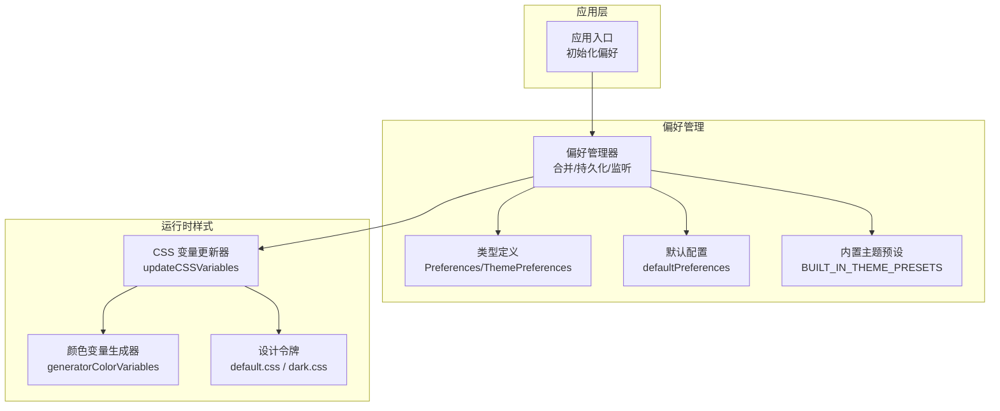
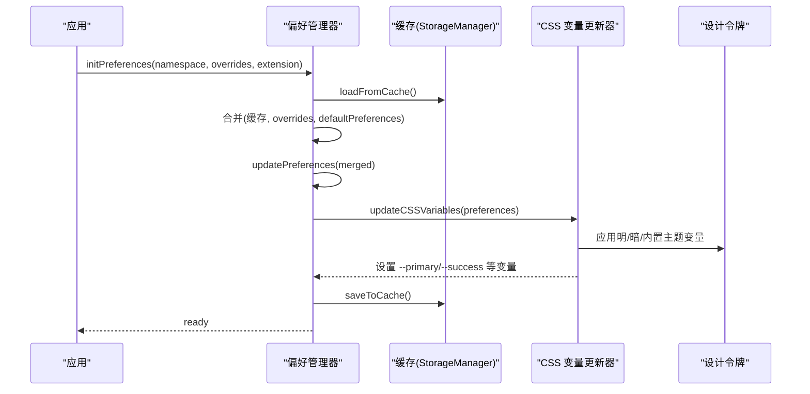
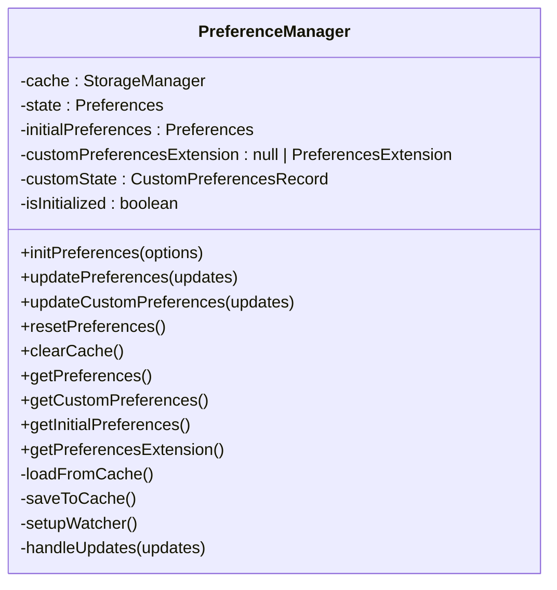
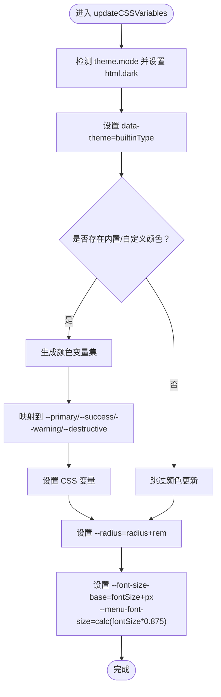
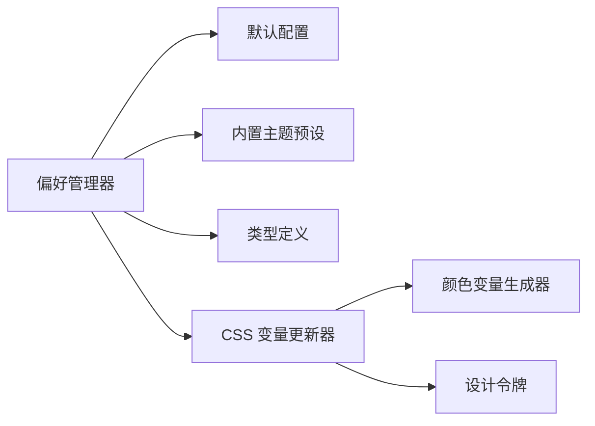

# 主题配置

<cite>
**本文引用的文件**
- [packages/@core/preferences/src/preferences.ts](file://packages/@core/preferences/src/preferences.ts)
- [packages/@core/preferences/src/config.ts](file://packages/@core/preferences/src/config.ts)
- [packages/@core/preferences/src/types.ts](file://packages/@core/preferences/src/types.ts)
- [packages/@core/preferences/src/constants.ts](file://packages/@core/preferences/src/constants.ts)
- [packages/@core/preferences/src/update-css-variables.ts](file://packages/@core/preferences/src/update-css-variables.ts)
- [packages/@core/preferences/src/use-preferences.ts](file://packages/@core/preferences/src/use-preferences.ts)
- [packages/@core/preferences/src/index.ts](file://packages/@core/preferences/src/index.ts)
- [packages/@core/base/design/src/design-tokens/default.css](file://packages/@core/base/design/src/design-tokens/default.css)
- [packages/@core/base/design/src/design-tokens/dark.css](file://packages/@core/base/design/src/design-tokens/dark.css)
- [packages/@core/base/shared/src/color/generator.ts](file://packages/@core/base/shared/src/color/generator.ts)
- [apps/web-naive/src/preferences.ts](file://apps/web-naive/src/preferences.ts)
- [playground/src/preferences.ts](file://playground/src/preferences.ts)
</cite>

## 目录

1. [简介](#简介)
2. [项目结构](#项目结构)
3. [核心组件](#核心组件)
4. [架构总览](#架构总览)
5. [详细组件分析](#详细组件分析)
6. [依赖关系分析](#依赖关系分析)
7. [性能考量](#性能考量)
8. [故障排查指南](#故障排查指南)
9. [结论](#结论)
10. [附录](#附录)

## 简介

本文件面向 shiyu-ui 的主题配置体系，系统性说明默认主题配置、覆盖配置与自定义配置的管理方式；详解主题配置数据结构（颜色变量、字体、圆角、布局参数等）及其作用与使用方法；梳理配置文件的组织结构（全局配置、应用配置、用户偏好配置）；给出配置项的完整参考（默认值、可选值范围、实际效果）；并总结配置修改的最佳实践、注意事项以及缓存与持久化机制。

## 项目结构

主题配置由“默认配置 + 覆盖配置 + 用户偏好”三层构成，并通过运行时偏好管理器统一加载、合并、持久化与实时更新。设计令牌（CSS 变量）提供明暗主题与内置主题的基线样式，颜色生成器负责将输入色值映射为 HSL 变量集合。

图表来源

- [packages/@core/preferences/src/preferences.ts:32-158](file://packages/@core/preferences/src/preferences.ts#L32-L158)
- [packages/@core/preferences/src/config.ts:3-145](file://packages/@core/preferences/src/config.ts#L3-L145)
- [packages/@core/preferences/src/constants.ts:3-79](file://packages/@core/preferences/src/constants.ts#L3-L79)
- [packages/@core/preferences/src/update-css-variables.ts:12-82](file://packages/@core/preferences/src/update-css-variables.ts#L12-L82)
- [packages/@core/base/design/src/design-tokens/default.css:1-110](file://packages/@core/base/design/src/design-tokens/default.css#L1-L110)
- [packages/@core/base/design/src/design-tokens/dark.css:1-108](file://packages/@core/base/design/src/design-tokens/dark.css#L1-L108)
- [packages/@core/base/shared/src/color/generator.ts:11-43](file://packages/@core/base/shared/src/color/generator.ts#L11-L43)

章节来源

- [packages/@core/preferences/src/preferences.ts:32-158](file://packages/@core/preferences/src/preferences.ts#L32-L158)
- [packages/@core/preferences/src/config.ts:3-145](file://packages/@core/preferences/src/config.ts#L3-L145)
- [packages/@core/preferences/src/types.ts:317-340](file://packages/@core/preferences/src/types.ts#L317-L340)
- [packages/@core/preferences/src/constants.ts:3-79](file://packages/@core/preferences/src/constants.ts#L3-L79)
- [packages/@core/preferences/src/update-css-variables.ts:12-82](file://packages/@core/preferences/src/update-css-variables.ts#L12-L82)
- [packages/@core/base/design/src/design-tokens/default.css:1-110](file://packages/@core/base/design/src/design-tokens/default.css#L1-L110)
- [packages/@core/base/design/src/design-tokens/dark.css:1-108](file://packages/@core/base/design/src/design-tokens/dark.css#L1-L108)
- [packages/@core/base/shared/src/color/generator.ts:11-43](file://packages/@core/base/shared/src/color/generator.ts#L11-L43)

## 核心组件

- 偏好管理器（PreferenceManager）
  - 负责加载缓存、合并默认与覆盖配置、监听系统/断点变化、更新 CSS 变量、持久化缓存。
  - 提供初始化、更新、重置、清除缓存、获取扩展配置等能力。
- 默认配置（defaultPreferences）
  - 定义主题、应用、布局、导航、标签页、过渡、小部件等模块的默认值。
- 类型定义（Preferences/ThemePreferences 等）
  - 规范主题配置字段、取值范围与嵌套结构。
- 内置主题预设（BUILT_IN_THEME_PRESETS）
  - 定义内置主题类型及主色、暗色主色等映射。
- CSS 变量更新器（updateCSSVariables）
  - 将主题配置映射为 CSS 变量，支持明暗模式、内置主题、圆角、字号等。
- 颜色变量生成器（generatorColorVariables）
  - 将输入色值转换为 HSL 变量集合并输出标准映射。
- 设计令牌（default.css / dark.css）
  - 提供明/暗主题的基线 CSS 变量，作为内置主题与系统样式的支撑。

章节来源

- [packages/@core/preferences/src/preferences.ts:32-158](file://packages/@core/preferences/src/preferences.ts#L32-L158)
- [packages/@core/preferences/src/config.ts:3-145](file://packages/@core/preferences/src/config.ts#L3-L145)
- [packages/@core/preferences/src/types.ts:317-340](file://packages/@core/preferences/src/types.ts#L317-L340)
- [packages/@core/preferences/src/constants.ts:3-79](file://packages/@core/preferences/src/constants.ts#L3-L79)
- [packages/@core/preferences/src/update-css-variables.ts:12-82](file://packages/@core/preferences/src/update-css-variables.ts#L12-L82)
- [packages/@core/base/shared/src/color/generator.ts:11-43](file://packages/@core/base/shared/src/color/generator.ts#L11-L43)
- [packages/@core/base/design/src/design-tokens/default.css:1-110](file://packages/@core/base/design/src/design-tokens/default.css#L1-L110)
- [packages/@core/base/design/src/design-tokens/dark.css:1-108](file://packages/@core/base/design/src/design-tokens/dark.css#L1-L108)

## 架构总览

主题配置的运行时流程如下：

图表来源

- [packages/@core/preferences/src/preferences.ts:110-158](file://packages/@core/preferences/src/preferences.ts#L110-L158)
- [packages/@core/preferences/src/preferences.ts:206-216](file://packages/@core/preferences/src/preferences.ts#L206-L216)
- [packages/@core/preferences/src/update-css-variables.ts:12-82](file://packages/@core/preferences/src/update-css-variables.ts#L12-L82)
- [packages/@core/base/design/src/design-tokens/default.css:1-110](file://packages/@core/base/design/src/design-tokens/default.css#L1-L110)
- [packages/@core/base/design/src/design-tokens/dark.css:1-108](file://packages/@core/base/design/src/design-tokens/dark.css#L1-L108)

## 详细组件分析

### 偏好管理器（PreferenceManager）

- 初始化
  - 使用命名空间隔离不同应用的缓存。
  - 合并顺序：缓存 → 覆盖配置 → 默认配置。
  - 注入扩展配置（fields、tabLabel 等），并初始化扩展默认值。
- 更新与监听
  - 监听断点变化以设置移动端标记。
  - 监听系统暗色偏好，自动跟随（仅在 theme.mode 为 auto 时生效）。
  - 对主题或应用配置变更触发 CSS 变量更新。
- 持久化
  - 使用防抖保存（150ms），分别写入主配置、语言、主题模式、扩展配置。
- 重置与清理
  - 重置到初始状态并立即触发 UI 更新。
  - 清空所有偏好缓存键。

图表来源

- [packages/@core/preferences/src/preferences.ts:32-158](file://packages/@core/preferences/src/preferences.ts#L32-L158)

章节来源

- [packages/@core/preferences/src/preferences.ts:32-158](file://packages/@core/preferences/src/preferences.ts#L32-L158)

### 默认配置（defaultPreferences）

- 主题（theme）
  - builtinType：内置主题类型，默认 default。
  - mode：主题模式，支持 dark/light/auto，默认 dark。
  - colorPrimary/colorSuccess/colorWarning/colorDestructive：HSL 字符串，用于生成颜色变量。
  - radius：圆角（rem），默认 0.5。
  - fontSize：基准字体大小（px），默认 16。
  - 半深色 header/sidebar 子项开关（semiDarkHeader/semiDarkSidebar/semiDarkSidebarSub）。
- 应用（app）
  - 布局、权限模式、国际化、z-index、水印、登录过期策略等。
- 导航/侧边栏/标签页/过渡/小部件等模块均有明确默认值。

章节来源

- [packages/@core/preferences/src/config.ts:3-145](file://packages/@core/preferences/src/config.ts#L3-L145)

### 类型定义（ThemePreferences）

- 关键字段
  - builtinType: 内置主题类型（如 default/violet/pink/yellow/sky-blue/green/zinc/deep-green/deep-blue/orange/rose/neutral/slate/gray/custom）。
  - mode: 主题模式（dark/light/auto）。
  - colorPrimary/colorSuccess/colorWarning/colorDestructive: 颜色字符串。
  - radius: 字符串（对应 rem 单位）。
  - fontSize: 数字（px）。
  - 半深色开关：semiDarkHeader/semiDarkSidebar/semiDarkSidebarSub。
- 与 CSS 变量映射
  - radius → --radius
  - fontSize → --font-size-base 与派生 --menu-font-size

章节来源

- [packages/@core/preferences/src/types.ts:317-340](file://packages/@core/preferences/src/types.ts#L317-L340)
- [packages/@core/preferences/src/update-css-variables.ts:65-81](file://packages/@core/preferences/src/update-css-variables.ts#L65-L81)

### 内置主题预设（BUILT_IN_THEME_PRESETS）

- 提供内置主题类型与其主色、暗色主色映射。
- 自动根据当前主题模式选择主色（暗色模式优先使用 darkPrimaryColor 或 primaryColor，否则使用 primaryColor）。

章节来源

- [packages/@core/preferences/src/constants.ts:3-79](file://packages/@core/preferences/src/constants.ts#L3-L79)
- [packages/@core/preferences/src/update-css-variables.ts:37-51](file://packages/@core/preferences/src/update-css-variables.ts#L37-L51)

### CSS 变量更新器（updateCSSVariables）

- 明/暗模式
  - 根据 theme.mode 设置 html 的 dark 类与 data-theme 属性。
- 内置主题
  - 依据 builtinType 设置 data-theme，配合设计令牌切换主题变量。
- 颜色变量
  - 通过 generatorColorVariables 生成 HSL 变量集，再映射到 --primary/--success/--warning/--destructive。
- 辅助变量
  - radius → --radius
  - fontSize → --font-size-base 与 --menu-font-size

图表来源

- [packages/@core/preferences/src/update-css-variables.ts:12-82](file://packages/@core/preferences/src/update-css-variables.ts#L12-L82)
- [packages/@core/base/shared/src/color/generator.ts:11-43](file://packages/@core/base/shared/src/color/generator.ts#L11-L43)

章节来源

- [packages/@core/preferences/src/update-css-variables.ts:12-82](file://packages/@core/preferences/src/update-css-variables.ts#L12-L82)
- [packages/@core/base/shared/src/color/generator.ts:11-43](file://packages/@core/base/shared/src/color/generator.ts#L11-L43)

### 颜色变量生成器（generatorColorVariables）

- 输入：颜色数组（含 name/alias/color）。
- 输出：HSL 变量映射表（如 --primary-500、--green-500 等），并为 alias 生成别名变量。
- 用途：为 --primary/--success/--warning/--destructive 等目标变量提供 HSL 值。

章节来源

- [packages/@core/base/shared/src/color/generator.ts:11-43](file://packages/@core/base/shared/src/color/generator.ts#L11-L43)

### 设计令牌（default.css / dark.css）

- 提供明/暗主题的基线变量，包括背景、前景、卡片、弹出层、输入、边框、圆角、字体大小、组件区域（侧边栏、头部）等。
- 通过 :root/.light/.dark[data-theme=...] 选择器生效，与 updateCSSVariables 的设置协同工作。

章节来源

- [packages/@core/base/design/src/design-tokens/default.css:1-110](file://packages/@core/base/design/src/design-tokens/default.css#L1-L110)
- [packages/@core/base/design/src/design-tokens/dark.css:1-108](file://packages/@core/base/design/src/design-tokens/dark.css#L1-L108)

### 扩展配置与覆盖配置

- 覆盖配置（overridesPreferences）
  - 仅需覆盖项目中需要的配置片段，未覆盖项自动使用默认配置。
  - 示例：web-naive 与 playground 中均通过 defineOverridesPreferences 定义覆盖。
- 扩展配置（preferencesExtension）
  - 定义自定义偏好字段（输入、数字、选择、开关），并提供默认值、校验规则与 UI 描述。
  - 偏好管理器会对扩展配置进行类型校验与默认值注入，并持久化到独立键。

章节来源

- [apps/web-naive/src/preferences.ts:8-16](file://apps/web-naive/src/preferences.ts#L8-L16)
- [playground/src/preferences.ts:18-87](file://playground/src/preferences.ts#L18-L87)
- [packages/@core/preferences/src/preferences.ts:125-148](file://packages/@core/preferences/src/preferences.ts#L125-L148)
- [packages/@core/preferences/src/preferences.ts:364-385](file://packages/@core/preferences/src/preferences.ts#L364-L385)

## 依赖关系分析

- 偏好管理器依赖
  - 默认配置：提供初始合并基线。
  - 内置主题预设：决定内置主题主色与暗色主色。
  - 类型定义：约束配置结构与字段类型。
  - CSS 变量更新器：将配置映射为 CSS 变量。
  - 颜色变量生成器：生成 HSL 变量集。
  - 设计令牌：提供明/暗主题基线变量。
- 运行时依赖
  - Vue 响应式系统（reactive/readonly/watch）。
  - VueUse 断点与去抖工具。
  - 浏览器媒体查询监听系统暗色偏好。

图表来源

- [packages/@core/preferences/src/preferences.ts:22-23](file://packages/@core/preferences/src/preferences.ts#L22-L23)
- [packages/@core/preferences/src/update-css-variables.ts:3-6](file://packages/@core/preferences/src/update-css-variables.ts#L3-L6)
- [packages/@core/base/shared/src/color/generator.ts:1-3](file://packages/@core/base/shared/src/color/generator.ts#L1-L3)
- [packages/@core/base/design/src/design-tokens/default.css:1-110](file://packages/@core/base/design/src/design-tokens/default.css#L1-L110)
- [packages/@core/base/design/src/design-tokens/dark.css:1-108](file://packages/@core/base/design/src/design-tokens/dark.css#L1-L108)

章节来源

- [packages/@core/preferences/src/preferences.ts:22-23](file://packages/@core/preferences/src/preferences.ts#L22-L23)
- [packages/@core/preferences/src/update-css-variables.ts:3-6](file://packages/@core/preferences/src/update-css-variables.ts#L3-L6)

## 性能考量

- 防抖保存：偏好变更采用 150ms 防抖，降低频繁写入缓存的开销。
- 条件更新：仅当主题或应用相关字段发生变更时才触发 CSS 变量更新。
- 响应式监听：断点与系统暗色偏好监听仅在初始化时绑定一次，避免重复绑定。
- 变量复用：颜色变量生成器与 CSS 变量更新器复用同一映射逻辑，减少重复计算。

## 故障排查指南

- 修改配置后不生效
  - 清空浏览器缓存或偏好缓存键（preferences、preferences-theme、preferences-locale、preferences-custom）。
  - 确认覆盖配置仅覆盖必要字段，未覆盖项将回退到默认配置。
- 主题切换异常
  - 检查 theme.mode 是否为 auto；当为 auto 时，系统暗色偏好变化会触发跟随切换。
  - 确认 data-theme 与 html.dark 类已正确设置。
- 自定义颜色无效
  - 确认颜色值格式符合 HSL 字符串规范。
  - 检查是否同时设置了内置主题主色与自定义主色，若存在内置主色则优先使用内置色。
- 扩展配置不显示
  - 确认已通过 definePreferencesExtension 定义扩展并传入 initPreferences 的 extension 参数。
  - 检查字段类型与默认值是否满足校验规则。

章节来源

- [packages/@core/preferences/src/preferences.ts:53-55](file://packages/@core/preferences/src/preferences.ts#L53-L55)
- [packages/@core/preferences/src/preferences.ts:425-440](file://packages/@core/preferences/src/preferences.ts#L425-L440)
- [packages/@core/preferences/src/update-css-variables.ts:24-35](file://packages/@core/preferences/src/update-css-variables.ts#L24-L35)
- [packages/@core/preferences/src/preferences.ts:364-385](file://packages/@core/preferences/src/preferences.ts#L364-L385)

## 结论

shiyu-ui 的主题配置体系通过“默认配置 + 覆盖配置 + 用户偏好”的分层设计，结合运行时偏好管理器与 CSS 变量更新器，实现了灵活、可扩展且高性能的主题切换与持久化。内置主题与设计令牌提供了稳定的明/暗主题基线，颜色生成器确保了色彩变量的一致性与可维护性。建议在实际项目中遵循最小覆盖原则、合理使用扩展配置，并注意缓存清理与系统偏好监听的边界。

## 附录

### 配置项完整参考（主题相关）

- 主题（theme）
  - builtinType
    - 默认值：default
    - 取值：default/violet/pink/yellow/sky-blue/green/zinc/deep-green/deep-blue/orange/rose/neutral/slate/gray/custom
    - 效果：切换内置主题类型，影响主色与部分组件变量
  - mode
    - 默认值：dark
    - 取值：dark/light/auto
    - 效果：控制明/暗主题与 data-theme 属性
  - colorPrimary
    - 默认值：hsl(212 100% 45%)
    - 效果：生成 --primary 及其变体
  - colorSuccess
    - 默认值：hsl(144 57% 58%)
    - 效果：生成 --success 及其变体
  - colorWarning
    - 默认值：hsl(42 84% 61%)
    - 效果：生成 --warning 及其变体
  - colorDestructive
    - 默认值：hsl(348 100% 61%)
    - 效果：生成 --destructive 及其变体
  - radius
    - 默认值：0.5
    - 效果：设置 --radius=radius+rem
  - fontSize
    - 默认值：16
    - 效果：设置 --font-size-base=fontSize+px 与 --menu-font-size=calc(fontSize\*0.875)
  - semiDarkHeader/semiDarkSidebar/semiDarkSidebarSub
    - 默认值：false
    - 效果：在 light 主题下启用半深色 header/sidebar/sidebar-sub

章节来源

- [packages/@core/preferences/src/config.ts:115-127](file://packages/@core/preferences/src/config.ts#L115-L127)
- [packages/@core/preferences/src/types.ts:317-340](file://packages/@core/preferences/src/types.ts#L317-L340)
- [packages/@core/preferences/src/update-css-variables.ts:65-81](file://packages/@core/preferences/src/update-css-variables.ts#L65-L81)

### 配置文件组织结构

- 全局配置
  - defaultPreferences：项目级默认主题与应用配置。
- 应用配置
  - apps/web-naive/src/preferences.ts：项目覆盖配置示例。
  - playground/src/preferences.ts：扩展配置示例（定义 fields、默认值、校验）。
- 用户偏好配置
  - 偏好管理器通过 StorageManager 持久化主配置、语言、主题模式与扩展配置。

章节来源

- [packages/@core/preferences/src/config.ts:3-145](file://packages/@core/preferences/src/config.ts#L3-L145)
- [apps/web-naive/src/preferences.ts:8-16](file://apps/web-naive/src/preferences.ts#L8-L16)
- [playground/src/preferences.ts:18-87](file://playground/src/preferences.ts#L18-L87)
- [packages/@core/preferences/src/preferences.ts:390-401](file://packages/@core/preferences/src/preferences.ts#L390-L401)

### 最佳实践与注意事项

- 覆盖配置
  - 仅覆盖必要字段，避免冗余；未覆盖字段自动回退到默认配置。
- 自定义颜色
  - 使用 HSL 字符串；若同时设置内置主题主色与自定义主色，内置主色优先。
- 主题模式
  - auto 模式下系统暗色偏好变化会触发跟随切换，无需手动干预。
- 扩展配置
  - 严格定义字段类型与默认值；数字字段需提供 min/max/step 约束。
- 缓存与持久化
  - 修改配置后清理缓存或偏好缓存键，确保新配置生效。
  - 避免频繁读写，利用防抖机制减少性能开销。

章节来源

- [packages/@core/preferences/src/preferences.ts:125-148](file://packages/@core/preferences/src/preferences.ts#L125-L148)
- [packages/@core/preferences/src/preferences.ts:364-385](file://packages/@core/preferences/src/preferences.ts#L364-L385)
- [packages/@core/preferences/src/preferences.ts:390-401](file://packages/@core/preferences/src/preferences.ts#L390-L401)
- [packages/@core/preferences/src/preferences.ts:425-440](file://packages/@core/preferences/src/preferences.ts#L425-L440)
