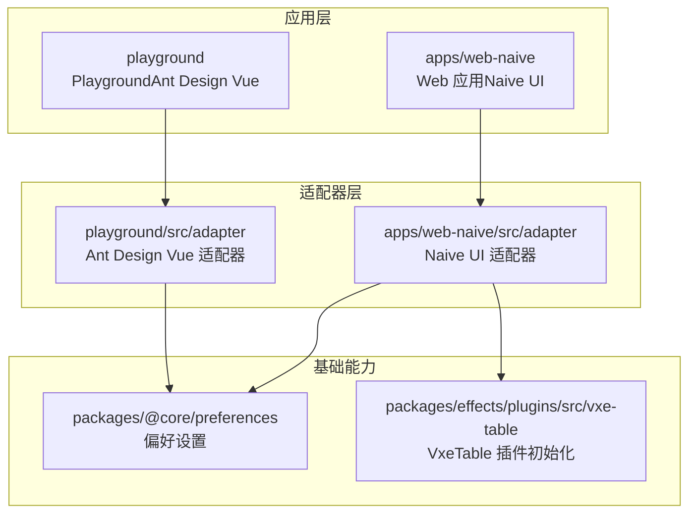
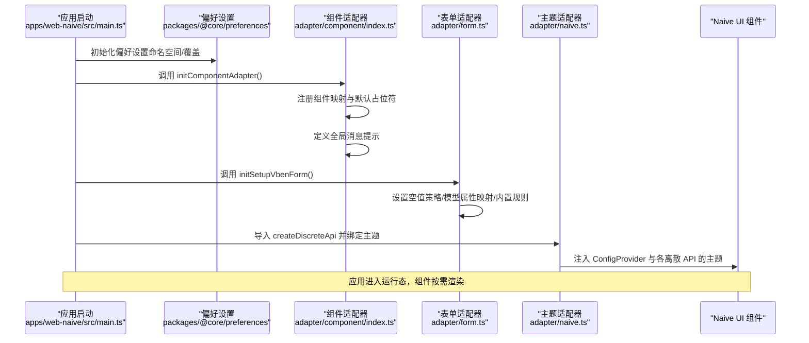
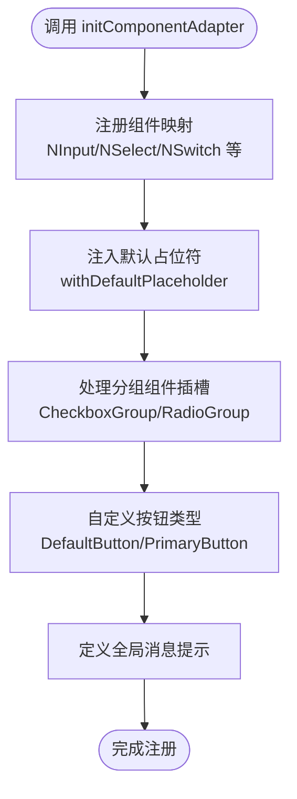
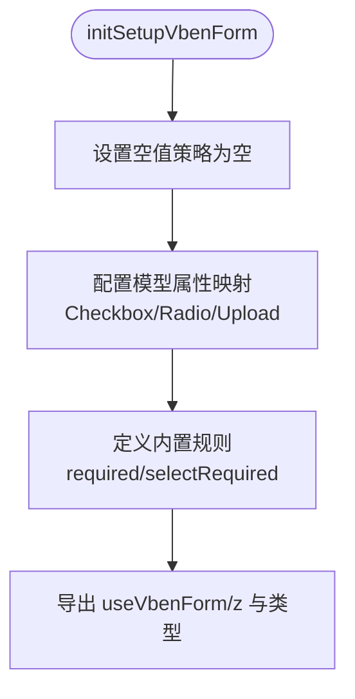
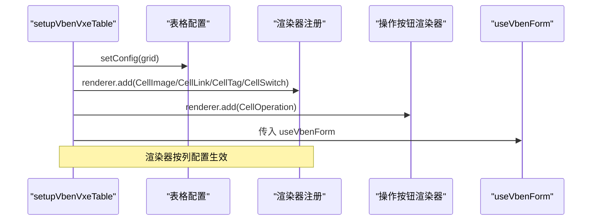
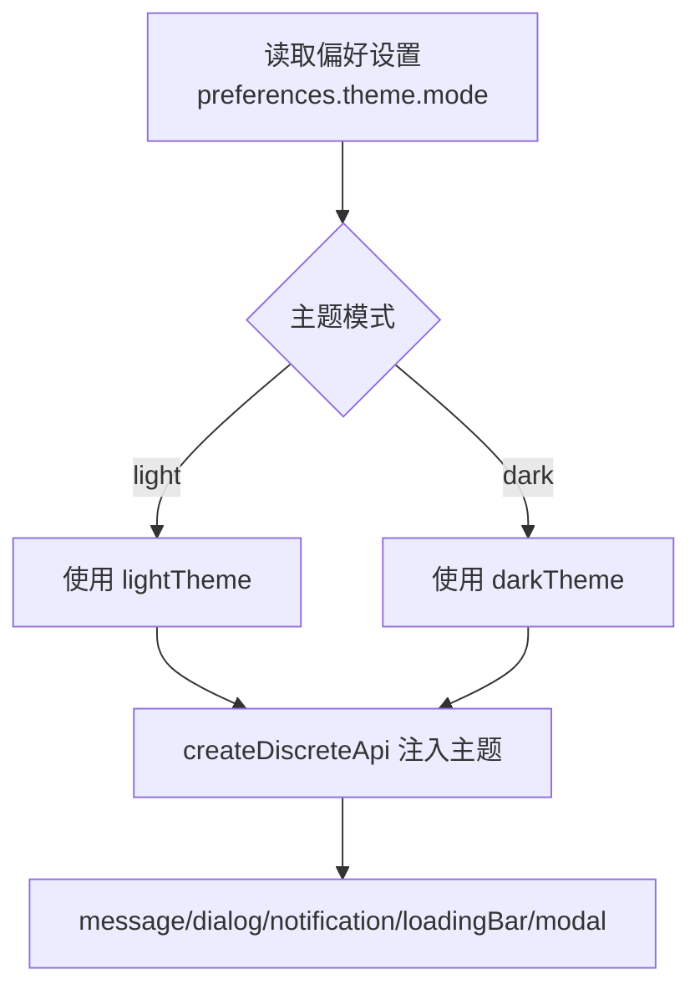
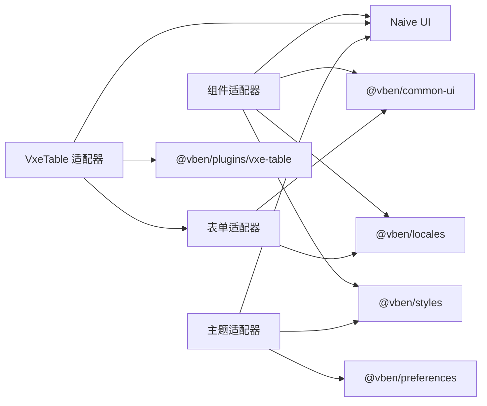

# 组件适配

<cite>
**本文引用的文件**
- [apps/web-naive/src/adapter/component/index.ts](file://apps/web-naive/src/adapter/component/index.ts)
- [apps/web-naive/src/adapter/form.ts](file://apps/web-naive/src/adapter/form.ts)
- [apps/web-naive/src/adapter/vxe-table.ts](file://apps/web-naive/src/adapter/vxe-table.ts)
- [apps/web-naive/src/adapter/naive.ts](file://apps/web-naive/src/adapter/naive.ts)
- [apps/web-naive/src/preferences.ts](file://apps/web-naive/src/preferences.ts)
- [apps/web-naive/src/main.ts](file://apps/web-naive/src/main.ts)
- [playground/src/adapter/component/index.ts](file://playground/src/adapter/component/index.ts)
- [packages/@core/preferences/src/index.ts](file://packages/@core/preferences/src/index.ts)
- [packages/effects/plugins/src/vxe-table/init.ts](file://packages/effects/plugins/src/vxe-table/init.ts)
</cite>

## 目录

1. [引言](#引言)
2. [项目结构](#项目结构)
3. [核心组件](#核心组件)
4. [架构总览](#架构总览)
5. [详细组件分析](#详细组件分析)
6. [依赖分析](#依赖分析)
7. [性能考虑](#性能考虑)
8. [故障排查指南](#故障排查指南)
9. [结论](#结论)
10. [附录](#附录)

## 引言

本文件系统性阐述 shiyu-ui 项目中的“组件适配机制”，重点围绕以下目标展开：

- 设计理念与实现原理：如何通过统一的适配层对接不同 UI 框架（如 Naive UI、Ant Design Vue），实现主题与样式的无缝适配。
- Naive UI 适配器配置：颜色映射、尺寸调整与组件样式的定制方法。
- 表单组件适配：空值策略、模型属性映射、规则与国际化、交互一致性。
- 开发指南：如何创建新适配器、属性映射与维护更新。
- 测试与质量保障：验证适配效果与稳定性的方法。
- 主题系统集成：与偏好设置联动，在主题切换时协同工作。

## 项目结构

本项目采用多应用与多适配器并行的组织方式：

- 应用层：apps/web-naive 为基于 Naive UI 的 Web 应用，适配器位于 apps/web-naive/src/adapter。
- Playground：playground/src/adapter 提供另一套适配器（以 Ant Design Vue 为例），用于对比与验证。
- 基础能力：packages/@core/preferences 提供偏好设置管理；packages/effects/plugins 提供插件初始化（如 vxe-table）。

图表来源

- [apps/web-naive/src/adapter/component/index.ts:163-271](file://apps/web-naive/src/adapter/component/index.ts#L163-L271)
- [playground/src/adapter/component/index.ts:671-750](file://playground/src/adapter/component/index.ts#L671-L750)
- [packages/@core/preferences/src/index.ts:1-24](file://packages/@core/preferences/src/index.ts#L1-L24)
- [packages/effects/plugins/src/vxe-table/init.ts:71-109](file://packages/effects/plugins/src/vxe-table/init.ts#L71-L109)

章节来源

- [apps/web-naive/src/main.ts:9-29](file://apps/web-naive/src/main.ts#L9-L29)
- [apps/web-naive/src/preferences.ts:8-16](file://apps/web-naive/src/preferences.ts#L8-L16)

## 核心组件

- 组件适配器（Naive UI）：负责将通用组件类型映射到 Naive UI 组件，统一默认占位符、模型属性、事件与插槽，同时注册全局消息提示。
- 表单适配器（Naive UI）：定义表单空值策略、模型属性映射、内置校验规则与国际化文案。
- VxeTable 适配器（Naive UI）：全局配置表格行为、单元格渲染器（图片、链接、标签、开关）、操作按钮渲染器与确认对话框。
- 主题适配器（Naive UI）：基于偏好设置的主题模式，动态注入 ConfigProvider 与各离散 API 的主题覆盖。
- 偏好设置：统一的应用配置入口，支持命名空间隔离与覆盖配置。

章节来源

- [apps/web-naive/src/adapter/component/index.ts:163-271](file://apps/web-naive/src/adapter/component/index.ts#L163-L271)
- [apps/web-naive/src/adapter/form.ts:11-42](file://apps/web-naive/src/adapter/form.ts#L11-L42)
- [apps/web-naive/src/adapter/vxe-table.ts:21-257](file://apps/web-naive/src/adapter/vxe-table.ts#L21-L257)
- [apps/web-naive/src/adapter/naive.ts:8-25](file://apps/web-naive/src/adapter/naive.ts#L8-L25)
- [apps/web-naive/src/preferences.ts:8-16](file://apps/web-naive/src/preferences.ts#L8-L16)

## 架构总览

下图展示从应用启动到组件渲染的关键流程，以及主题与表单适配器的协作关系：

图表来源

- [apps/web-naive/src/main.ts:9-29](file://apps/web-naive/src/main.ts#L9-L29)
- [apps/web-naive/src/adapter/component/index.ts:163-271](file://apps/web-naive/src/adapter/component/index.ts#L163-L271)
- [apps/web-naive/src/adapter/form.ts:11-42](file://apps/web-naive/src/adapter/form.ts#L11-L42)
- [apps/web-naive/src/adapter/naive.ts:16-25](file://apps/web-naive/src/adapter/naive.ts#L16-L25)

## 详细组件分析

### 组件适配器（Naive UI）

职责与特性：

- 统一组件类型与属性映射：将通用组件类型映射到 Naive UI 组件，确保表单 Schema 与组件渲染一致。
- 默认占位符增强：对输入类与选择类组件统一注入占位符，提升用户体验。
- 模型属性与事件桥接：针对不同组件设置 modelPropName、visibleEvent 等，保证双向绑定与事件联动。
- 插槽与默认内容：对分组类组件（复选框、单选）支持默认插槽与外部插槽的兼容。
- 全局消息提示：通过全局共享状态定义复制成功的消息提示，统一交互风格。

图表来源

- [apps/web-naive/src/adapter/component/index.ts:163-271](file://apps/web-naive/src/adapter/component/index.ts#L163-L271)

章节来源

- [apps/web-naive/src/adapter/component/index.ts:87-119](file://apps/web-naive/src/adapter/component/index.ts#L87-L119)
- [apps/web-naive/src/adapter/component/index.ts:163-271](file://apps/web-naive/src/adapter/component/index.ts#L163-L271)

### 表单适配器（Naive UI）

关键点：

- 空值策略：明确空值为 null，避免 undefined 导致重置失效。
- 模型属性映射：针对 Checkbox、Radio、Upload 等组件设置正确的模型属性名，确保 v-model 正常工作。
- 内置校验规则：提供 required 与 selectRequired 规则，并结合国际化文案输出。
- 类型导出：导出 useVbenForm、z、VbenFormSchema、VbenFormProps，便于上层使用。

图表来源

- [apps/web-naive/src/adapter/form.ts:11-42](file://apps/web-naive/src/adapter/form.ts#L11-L42)

章节来源

- [apps/web-naive/src/adapter/form.ts:11-42](file://apps/web-naive/src/adapter/form.ts#L11-L42)

### VxeTable 适配器（Naive UI）

能力概览：

- 全局表格配置：对 grid 的对齐、边框、圆角、尺寸、代理等进行统一配置。
- 渲染器扩展：提供 CellImage、CellLink、CellTag、CellSwitch、CellOperation 等渲染器，统一表格视觉与交互。
- 操作按钮：支持编辑、删除等常用操作，结合确认对话框与图标，提升一致性。
- 与表单联动：通过 setupVbenVxeTable 接入 useVbenForm，实现表格内表单控件的一致体验。

图表来源

- [apps/web-naive/src/adapter/vxe-table.ts:21-257](file://apps/web-naive/src/adapter/vxe-table.ts#L21-L257)

章节来源

- [apps/web-naive/src/adapter/vxe-table.ts:21-257](file://apps/web-naive/src/adapter/vxe-table.ts#L21-L257)

### 主题适配器（Naive UI）

要点：

- 基于偏好设置的主题模式：根据当前主题模式（明/暗）选择 lightTheme/darkTheme。
- 动态注入：通过 createDiscreteApi 为 message、dialog、notification、loadingBar、modal 注入 ConfigProvider 与主题覆盖。
- 与全局样式：引入 @vben/styles，确保主题变量与组件样式一致。

图表来源

- [apps/web-naive/src/adapter/naive.ts:8-25](file://apps/web-naive/src/adapter/naive.ts#L8-L25)

章节来源

- [apps/web-naive/src/adapter/naive.ts:1-26](file://apps/web-naive/src/adapter/naive.ts#L1-L26)

### 偏好设置与应用启动

- 命名空间与版本隔离：通过环境变量与版本号生成命名空间，避免多实例或跨版本数据冲突。
- 覆盖配置：仅覆盖必要配置项，其余使用默认值，降低维护成本。
- 插件初始化：在 bootstrap 之前完成偏好设置初始化，确保后续模块可读取主题与语言等配置。

章节来源

- [apps/web-naive/src/main.ts:9-29](file://apps/web-naive/src/main.ts#L9-L29)
- [apps/web-naive/src/preferences.ts:8-16](file://apps/web-naive/src/preferences.ts#L8-L16)
- [packages/@core/preferences/src/index.ts:1-24](file://packages/@core/preferences/src/index.ts#L1-L24)

## 依赖分析

- 组件适配器依赖：
  - @vben/common-ui：提供通用组件与全局共享状态。
  - Naive UI：作为底层 UI 组件库，提供具体组件与主题能力。
  - 国际化与样式：@vben/locales、@vben/styles。
- 表单适配器依赖：
  - @vben/common-ui：提供 setupVbenForm/useVbenForm 与 zod。
  - 本地国际化：$t。
- VxeTable 适配器依赖：
  - @vben/plugins/vxe-table：提供 setupVbenVxeTable/useVbenVxeGrid。
  - Naive UI：用于渲染单元格按钮、标签、确认对话框等。
  - 表单适配器：复用 useVbenForm。
- 主题适配器依赖：
  - @vben/preferences：读取主题模式。
  - Naive UI：提供 lightTheme/darkTheme 与 createDiscreteApi。

图表来源

- [apps/web-naive/src/adapter/component/index.ts:31-36](file://apps/web-naive/src/adapter/component/index.ts#L31-L36)
- [apps/web-naive/src/adapter/form.ts:8-9](file://apps/web-naive/src/adapter/form.ts#L8-L9)
- [apps/web-naive/src/adapter/vxe-table.ts:9-12](file://apps/web-naive/src/adapter/vxe-table.ts#L9-L12)
- [apps/web-naive/src/adapter/naive.ts:3-6](file://apps/web-naive/src/adapter/naive.ts#L3-L6)

章节来源

- [apps/web-naive/src/adapter/component/index.ts:31-36](file://apps/web-naive/src/adapter/component/index.ts#L31-L36)
- [apps/web-naive/src/adapter/form.ts:8-9](file://apps/web-naive/src/adapter/form.ts#L8-L9)
- [apps/web-naive/src/adapter/vxe-table.ts:9-12](file://apps/web-naive/src/adapter/vxe-table.ts#L9-L12)
- [apps/web-naive/src/adapter/naive.ts:3-6](file://apps/web-naive/src/adapter/naive.ts#L3-L6)

## 性能考虑

- 组件懒加载：对体积较大的组件采用 defineAsyncComponent 异步加载，减少首屏开销。
- 渲染器去重：在 vxe-table 初始化时清理潜在的重复渲染器，避免热更新问题。
- 事件与状态最小化：通过 computed 与 ref 管理主题与列表状态，避免不必要的响应式计算。
- 上传与预览优化：图片预览与裁剪采用惰性渲染与资源释放，降低内存占用。

章节来源

- [apps/web-naive/src/adapter/component/index.ts:38-85](file://apps/web-naive/src/adapter/component/index.ts#L38-L85)
- [apps/web-naive/src/adapter/vxe-table.ts:54-58](file://apps/web-naive/src/adapter/vxe-table.ts#L54-L58)
- [playground/src/adapter/component/index.ts:241-315](file://playground/src/adapter/component/index.ts#L241-L315)
- [playground/src/adapter/component/index.ts:320-412](file://playground/src/adapter/component/index.ts#L320-L412)

## 故障排查指南

- 表单重置无效：确认空值策略设置为 null，避免 undefined 导致重置失败。
- 模型属性不生效：核对 modelPropName 映射（如 Checkbox/Radio/Upload），确保与组件实际模型属性一致。
- 主题不生效：检查偏好设置是否正确初始化，确认主题模式与 ConfigProvider 注入路径。
- VxeTable 渲染异常：确认渲染器注册顺序与列配置一致，避免热更新导致的重复注册。
- 上传预览失败：检查文件类型判断与预览容器挂载，确保资源释放与 DOM 生命周期正确。

章节来源

- [apps/web-naive/src/adapter/form.ts:14-22](file://apps/web-naive/src/adapter/form.ts#L14-L22)
- [apps/web-naive/src/adapter/component/index.ts:175-194](file://apps/web-naive/src/adapter/component/index.ts#L175-L194)
- [apps/web-naive/src/adapter/naive.ts:8-25](file://apps/web-naive/src/adapter/naive.ts#L8-L25)
- [apps/web-naive/src/adapter/vxe-table.ts:61-67](file://apps/web-naive/src/adapter/vxe-table.ts#L61-L67)
- [playground/src/adapter/component/index.ts:241-315](file://playground/src/adapter/component/index.ts#L241-L315)

## 结论

本项目通过“组件适配器 + 表单适配器 + 主题适配器”的分层设计，实现了对 Naive UI 的深度适配与统一管理。配合偏好设置与插件初始化，能够在主题切换、表单交互、表格渲染等多个维度提供一致、稳定且可扩展的用户体验。对于 Ant Design Vue 的适配器亦可参考 Playground 中的实现，形成跨框架的适配范式。

## 附录

### 开发指南：创建新的适配器

- 组件适配器
  - 定义 ComponentType 与 ComponentPropsMap，确保与通用组件类型一致。
  - 使用 withDefaultPlaceholder 为输入/选择类组件注入默认占位符。
  - 对分组类组件支持默认插槽与外部插槽，保证灵活性。
  - 通过 globalShareState.setComponents 注册组件映射。
  - 通过 globalShareState.defineMessage 定义全局消息提示。
- 表单适配器
  - 在 setupVbenForm 中设置空值策略、模型属性映射与内置规则。
  - 导出 useVbenForm、z 与类型，便于上层使用。
- 主题适配器
  - 基于 preferences.theme.mode 切换 lightTheme/darkTheme。
  - 使用 createDiscreteApi 注入 ConfigProvider 与主题覆盖。
- VxeTable 适配器
  - 通过 setupVbenVxeTable 注入 useVbenForm。
  - 注册渲染器（CellImage/CellLink/CellTag/CellSwitch/CellOperation）。
  - 统一表格配置与代理响应结构。

章节来源

- [apps/web-naive/src/adapter/component/index.ts:122-161](file://apps/web-naive/src/adapter/component/index.ts#L122-L161)
- [apps/web-naive/src/adapter/component/index.ts:163-271](file://apps/web-naive/src/adapter/component/index.ts#L163-L271)
- [apps/web-naive/src/adapter/form.ts:11-42](file://apps/web-naive/src/adapter/form.ts#L11-L42)
- [apps/web-naive/src/adapter/naive.ts:8-25](file://apps/web-naive/src/adapter/naive.ts#L8-L25)
- [apps/web-naive/src/adapter/vxe-table.ts:21-257](file://apps/web-naive/src/adapter/vxe-table.ts#L21-L257)

### 组件属性映射与维护

- 属性映射
  - Checkbox/Radio/Upload：通过 modelPropNameMap 指定模型属性名。
  - ApiSelect/ApiTreeSelect：通过 component/modelPropName/visibleEvent 等属性桥接。
- 维护建议
  - 新增组件时同步更新 ComponentType 与 ComponentPropsMap。
  - 若组件有默认插槽需求，优先使用默认插槽与外部插槽的兼容逻辑。
  - 对复杂交互（如开关切换）提供统一的回调封装与状态管理。

章节来源

- [apps/web-naive/src/adapter/form.ts:17-22](file://apps/web-naive/src/adapter/form.ts#L17-L22)
- [apps/web-naive/src/adapter/component/index.ts:169-195](file://apps/web-naive/src/adapter/component/index.ts#L169-L195)
- [apps/web-naive/src/adapter/component/index.ts:197-250](file://apps/web-naive/src/adapter/component/index.ts#L197-L250)

### 测试与质量保证

- 单元测试
  - 组件适配器：验证组件映射、默认占位符、消息提示是否正确注册。
  - 表单适配器：验证空值策略、模型属性映射、规则返回值与国际化文案。
  - 主题适配器：验证主题模式切换后 ConfigProvider 与离散 API 的主题覆盖生效。
- E2E 测试
  - 表单场景：必填、选择类、日期类、上传类等控件的交互与校验。
  - 表格场景：单元格渲染器、操作按钮、确认对话框、分页与代理响应。
- 回归测试
  - 主题切换：验证明/暗主题下组件外观与交互一致性。
  - 热更新：确保渲染器与组件在热更新后仍正常工作。

章节来源

- [apps/web-naive/src/adapter/component/index.ts:263-270](file://apps/web-naive/src/adapter/component/index.ts#L263-L270)
- [apps/web-naive/src/adapter/form.ts:23-36](file://apps/web-naive/src/adapter/form.ts#L23-L36)
- [apps/web-naive/src/adapter/vxe-table.ts:21-49](file://apps/web-naive/src/adapter/vxe-table.ts#L21-L49)

### 主题系统集成与协同

- 偏好设置初始化：在应用启动阶段完成，确保后续模块可读取主题与语言配置。
- 主题切换：通过 preferences.theme.mode 切换 lightTheme/darkTheme，动态影响 ConfigProvider 与离散 API。
- 插件初始化：VxeTable 插件初始化在适配器之前完成，避免未注册组件导致的报错。

章节来源

- [apps/web-naive/src/main.ts:17-20](file://apps/web-naive/src/main.ts#L17-L20)
- [apps/web-naive/src/adapter/naive.ts:8-25](file://apps/web-naive/src/adapter/naive.ts#L8-L25)
- [packages/effects/plugins/src/vxe-table/init.ts:71-109](file://packages/effects/plugins/src/vxe-table/init.ts#L71-L109)
