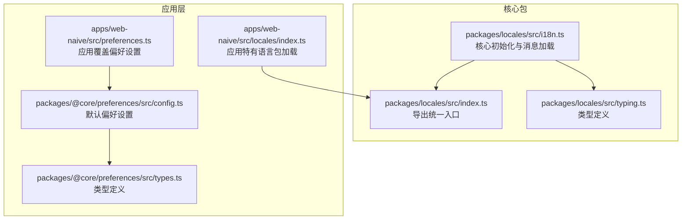
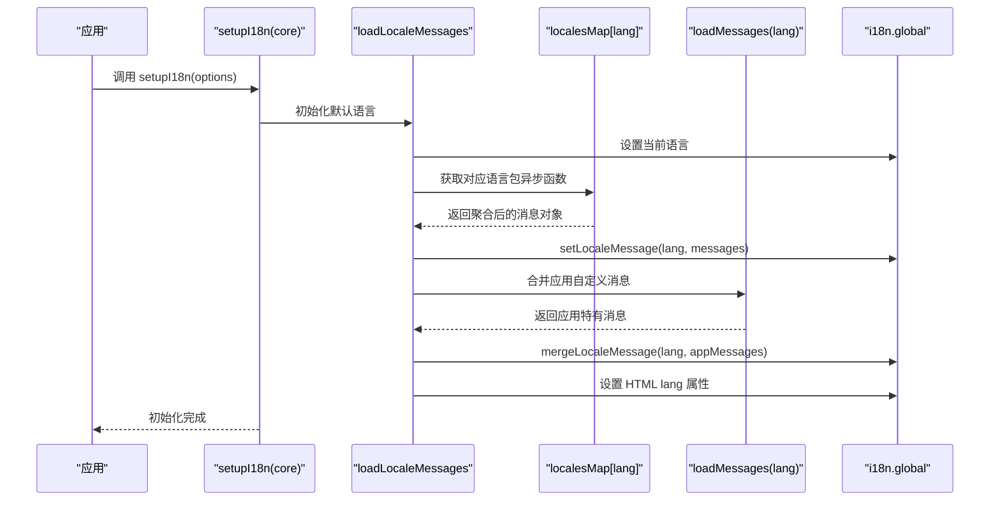
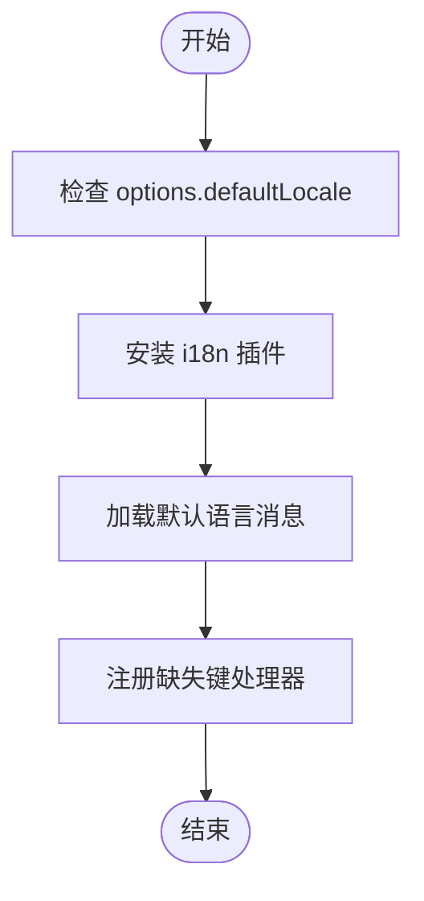
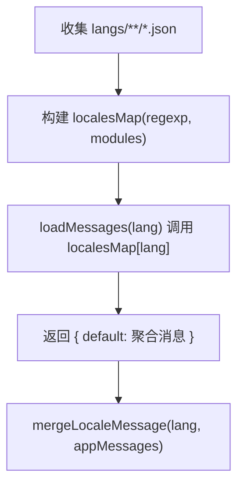
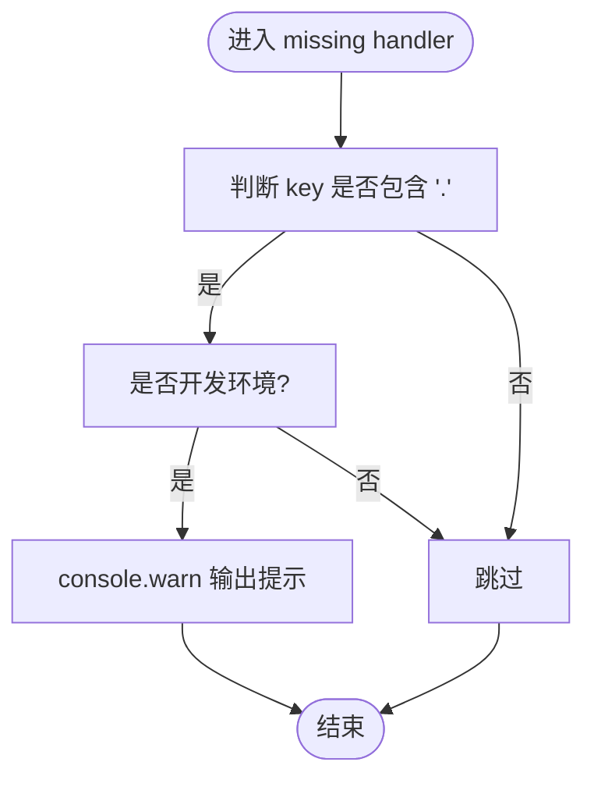
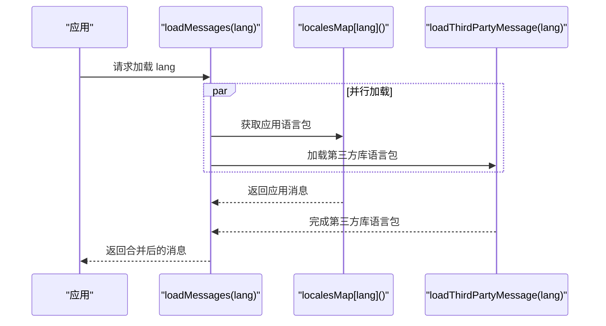
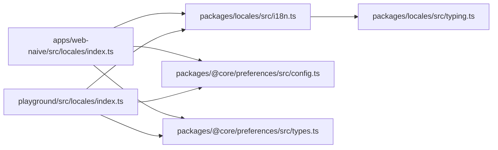

# Vue I18n 集成配置

<cite>
**本文引用的文件**
- [packages/locales/src/i18n.ts](file://packages/locales/src/i18n.ts)
- [packages/locales/src/index.ts](file://packages/locales/src/index.ts)
- [packages/locales/src/typing.ts](file://packages/locales/src/typing.ts)
- [apps/web-naive/src/locales/index.ts](file://apps/web-naive/src/locales/index.ts)
- [playground/src/locales/index.ts](file://playground/src/locales/index.ts)
- [packages/@core/preferences/src/config.ts](file://packages/@core/preferences/src/config.ts)
- [packages/@core/preferences/src/types.ts](file://packages/@core/preferences/src/types.ts)
- [apps/web-naive/src/preferences.ts](file://apps/web-naive/src/preferences.ts)
</cite>

## 目录

1. [简介](#简介)
2. [项目结构](#项目结构)
3. [核心组件](#核心组件)
4. [架构总览](#架构总览)
5. [详细组件分析](#详细组件分析)
6. [依赖关系分析](#依赖关系分析)
7. [性能考量](#性能考量)
8. [故障排查指南](#故障排查指南)
9. [结论](#结论)
10. [附录](#附录)

## 简介

本文件面向 shiyu-ui 项目中的 Vue I18n 集成配置，系统性阐述 i18n 初始化流程、setupI18n 的实现原理与参数配置、默认语言设置、消息加载机制、缺失键警告策略，以及 loadMessages 的动态加载逻辑。同时给出最佳实践（性能优化与错误处理）、自定义配置示例与常见问题解决方案，帮助开发者快速理解并高效维护国际化能力。

## 项目结构

- 核心 i18n 实现位于 packages/locales 包，提供通用的初始化、消息加载与语言切换能力。
- 应用层（如 apps/web-naive 与 playground）通过各自 locales/index.ts 扩展应用特有语言包，并调用核心 setupI18n 完成初始化。
- 默认语言来源于偏好设置（preferences），默认值由 @vben-core/preferences 提供。

图表来源

- [packages/locales/src/i18n.ts:102-117](file://packages/locales/src/i18n.ts#L102-L117)
- [packages/locales/src/index.ts:1-31](file://packages/locales/src/index.ts#L1-L31)
- [packages/locales/src/typing.ts:1-26](file://packages/locales/src/typing.ts#L1-L26)
- [apps/web-naive/src/locales/index.ts:29-36](file://apps/web-naive/src/locales/index.ts#L29-L36)
- [packages/@core/preferences/src/config.ts:29](file://packages/@core/preferences/src/config.ts#L29)
- [packages/@core/preferences/src/types.ts:150](file://packages/@core/preferences/src/types.ts#L150)
- [apps/web-naive/src/preferences.ts:8-16](file://apps/web-naive/src/preferences.ts#L8-L16)

章节来源

- [packages/locales/src/i18n.ts:102-117](file://packages/locales/src/i18n.ts#L102-L117)
- [apps/web-naive/src/locales/index.ts:29-36](file://apps/web-naive/src/locales/index.ts#L29-L36)
- [packages/@core/preferences/src/config.ts:29](file://packages/@core/preferences/src/config.ts#L29)
- [packages/@core/preferences/src/types.ts:150](file://packages/@core/preferences/src/types.ts#L150)
- [apps/web-naive/src/preferences.ts:8-16](file://apps/web-naive/src/preferences.ts#L8-L16)

## 核心组件

- 核心初始化与消息加载：packages/locales/src/i18n.ts
  - 提供 setupI18n、loadLocaleMessages、loadLocalesMapFromDir 等能力
  - 支持动态构建 localesMap 并按需加载语言包
  - 支持合并应用层自定义消息 loadMessages
- 应用层扩展：apps/web-naive/src/locales/index.ts
  - 使用 import.meta.glob 收集本地语言包
  - 通过 loadLocalesMapFromDir 构建 localesMap
  - 将 loadMessages 注入到核心 setupI18n
- 统一导出：packages/locales/src/index.ts
  - 导出 $t、setupI18n、loadLocaleMessages 等常用工具
- 类型定义：packages/locales/src/typing.ts
  - 明确 SupportedLanguagesType、LoadMessageFn、LocaleSetupOptions 等接口

章节来源

- [packages/locales/src/i18n.ts:102-117](file://packages/locales/src/i18n.ts#L102-L117)
- [packages/locales/src/i18n.ts:123-139](file://packages/locales/src/i18n.ts#L123-L139)
- [packages/locales/src/i18n.ts:55-90](file://packages/locales/src/i18n.ts#L55-L90)
- [apps/web-naive/src/locales/index.ts:12-27](file://apps/web-naive/src/locales/index.ts#L12-L27)
- [packages/locales/src/index.ts:1-31](file://packages/locales/src/index.ts#L1-L31)
- [packages/locales/src/typing.ts:1-26](file://packages/locales/src/typing.ts#L1-L26)

## 架构总览

下图展示从应用启动到 i18n 初始化、消息加载与语言切换的关键交互：

图表来源

- [packages/locales/src/i18n.ts:102-117](file://packages/locales/src/i18n.ts#L102-L117)
- [packages/locales/src/i18n.ts:123-139](file://packages/locales/src/i18n.ts#L123-L139)
- [apps/web-naive/src/locales/index.ts:24-27](file://apps/web-naive/src/locales/index.ts#L24-L27)

## 详细组件分析

### setupI18n 初始化流程

- 默认语言：若未显式传入 defaultLocale，则使用 zh-CN；应用层通常从 preferences.app.locale 读取。
- 消息加载：优先加载核心 localesMap 中的语言包，再合并应用层 loadMessages 返回的消息。
- 缺失键警告：通过 setMissingHandler 注册处理函数，在开发环境（非生产）且键名包含点号时输出警告。

图表来源

- [packages/locales/src/i18n.ts:102-117](file://packages/locales/src/i18n.ts#L102-L117)

章节来源

- [packages/locales/src/i18n.ts:102-117](file://packages/locales/src/i18n.ts#L102-L117)
- [packages/@core/preferences/src/config.ts:29](file://packages/@core/preferences/src/config.ts#L29)
- [apps/web-naive/src/preferences.ts:8-16](file://apps/web-naive/src/preferences.ts#L8-L16)

### loadMessages 动态加载机制

- 通过 import.meta.glob 收集应用语言包目录下的 JSON 文件。
- 使用 loadLocalesMapFromDir 将路径解析为 locale -> 文件名 -> 异步导入函数 的映射。
- loadMessages(lang) 调用 localesMap[lang] 返回聚合后的消息对象，随后合并至 i18n.global。

图表来源

- [apps/web-naive/src/locales/index.ts:12-17](file://apps/web-naive/src/locales/index.ts#L12-L17)
- [apps/web-naive/src/locales/index.ts:24-27](file://apps/web-naive/src/locales/index.ts#L24-L27)
- [packages/locales/src/i18n.ts:55-90](file://packages/locales/src/i18n.ts#L55-L90)

章节来源

- [apps/web-naive/src/locales/index.ts:12-27](file://apps/web-naive/src/locales/index.ts#L12-L27)
- [packages/locales/src/i18n.ts:55-90](file://packages/locales/src/i18n.ts#L55-L90)

### 缺失键警告策略（missingWarn）

- 行为差异：在开发环境（!import.meta.env.PROD）启用，生产环境关闭。
- 触发条件：当键名包含点号（表示嵌套键）时，控制台输出警告信息，提示找不到对应键。
- 配置入口：通过 setupI18n 的 options.missingWarn 传入。

图表来源

- [packages/locales/src/i18n.ts:110-116](file://packages/locales/src/i18n.ts#L110-L116)
- [apps/web-naive/src/locales/index.ts:33](file://apps/web-naive/src/locales/index.ts#L33)

章节来源

- [packages/locales/src/i18n.ts:110-116](file://packages/locales/src/i18n.ts#L110-L116)
- [apps/web-naive/src/locales/index.ts:33](file://apps/web-naive/src/locales/index.ts#L33)

### 多语言包构建与合并

- 核心包：内置 import.meta.glob 与 loadLocalesMapFromDir，支持按目录结构生成 localesMap。
- 应用层：可扩展第三方库语言包（如 dayjs、antd）与应用特有消息，通过 Promise.all 并行加载，提升性能。

图表来源

- [playground/src/locales/index.ts:33-39](file://playground/src/locales/index.ts#L33-L39)
- [playground/src/locales/index.ts:45-47](file://playground/src/locales/index.ts#L45-L47)
- [playground/src/locales/index.ts:53-74](file://playground/src/locales/index.ts#L53-L74)
- [playground/src/locales/index.ts:80-91](file://playground/src/locales/index.ts#L80-L91)

章节来源

- [playground/src/locales/index.ts:33-39](file://playground/src/locales/index.ts#L33-L39)
- [playground/src/locales/index.ts:45-47](file://playground/src/locales/index.ts#L45-L47)
- [playground/src/locales/index.ts:53-74](file://playground/src/locales/index.ts#L53-L74)
- [playground/src/locales/index.ts:80-91](file://playground/src/locales/index.ts#L80-L91)

## 依赖关系分析

- 应用层依赖核心包提供的 setupI18n 与工具函数。
- 默认语言依赖 preferences.app.locale，其默认值来自 @vben-core/preferences。
- 第三方库语言包（dayjs、antd）在 playground 示例中演示了并发加载策略。

图表来源

- [apps/web-naive/src/locales/index.ts:5-9](file://apps/web-naive/src/locales/index.ts#L5-L9)
- [playground/src/locales/index.ts:9-13](file://playground/src/locales/index.ts#L9-L13)
- [packages/locales/src/i18n.ts:1-15](file://packages/locales/src/i18n.ts#L1-L15)
- [packages/locales/src/typing.ts:1-26](file://packages/locales/src/typing.ts#L1-L26)
- [packages/@core/preferences/src/config.ts:29](file://packages/@core/preferences/src/config.ts#L29)
- [packages/@core/preferences/src/types.ts:150](file://packages/@core/preferences/src/types.ts#L150)

章节来源

- [apps/web-naive/src/locales/index.ts:5-9](file://apps/web-naive/src/locales/index.ts#L5-L9)
- [playground/src/locales/index.ts:9-13](file://playground/src/locales/index.ts#L9-L13)
- [packages/locales/src/i18n.ts:1-15](file://packages/locales/src/i18n.ts#L1-L15)
- [packages/locales/src/typing.ts:1-26](file://packages/locales/src/typing.ts#L1-L26)
- [packages/@core/preferences/src/config.ts:29](file://packages/@core/preferences/src/config.ts#L29)
- [packages/@core/preferences/src/types.ts:150](file://packages/@core/preferences/src/types.ts#L150)

## 性能考量

- 并行加载：应用层可使用 Promise.all 并行加载应用语言包与第三方库语言包，减少等待时间。
- 懒加载：通过 import.meta.glob 仅收集目标文件，避免一次性引入所有语言包。
- 合理使用 missingWarn：仅在开发环境开启，避免生产环境产生额外日志开销。
- 合并策略：先 setLocaleMessage 再 mergeLocaleMessage，确保应用特有消息覆盖基础消息，降低重复合并成本。

章节来源

- [playground/src/locales/index.ts:33-39](file://playground/src/locales/index.ts#L33-L39)
- [apps/web-naive/src/locales/index.ts:12](file://apps/web-naive/src/locales/index.ts#L12)
- [packages/locales/src/i18n.ts:110-116](file://packages/locales/src/i18n.ts#L110-L116)
- [packages/locales/src/i18n.ts:129-136](file://packages/locales/src/i18n.ts#L129-L136)

## 故障排查指南

- 语言包未生效
  - 检查 import.meta.glob 是否正确匹配 langs/\*_/_.json。
  - 确认 loadLocalesMapFromDir 的正则表达式与目录结构一致。
  - 确认 loadMessages 返回的消息对象结构符合预期。
- 缺失键警告过多
  - 在生产环境关闭 missingWarn，或在开发环境修复缺失键。
  - 确保键名包含点号才会触发警告，避免对简单键名误报。
- 第三方库语言包未切换
  - 确认 loadThirdPartyMessage 已在 loadMessages 中调用。
  - 检查 dayjs 与 antd 的语言包导入路径与版本兼容性。
- 默认语言不正确
  - 检查 preferences.app.locale 的覆盖设置与默认值。
  - 确认 setupI18n 传入的 defaultLocale 是否被正确使用。

章节来源

- [apps/web-naive/src/locales/index.ts:12-17](file://apps/web-naive/src/locales/index.ts#L12-L17)
- [apps/web-naive/src/locales/index.ts:24-27](file://apps/web-naive/src/locales/index.ts#L24-L27)
- [packages/locales/src/i18n.ts:55-90](file://packages/locales/src/i18n.ts#L55-L90)
- [packages/locales/src/i18n.ts:110-116](file://packages/locales/src/i18n.ts#L110-L116)
- [playground/src/locales/index.ts:33-39](file://playground/src/locales/index.ts#L33-L39)
- [packages/@core/preferences/src/config.ts:29](file://packages/@core/preferences/src/config.ts#L29)

## 结论

本方案通过核心包与应用层的清晰分工，实现了灵活、可扩展的国际化能力。核心包负责 i18n 初始化与消息加载，应用层负责注入特有语言包与第三方库语言包。借助并行加载与合理的缺失键警告策略，既保证了性能，又提升了开发体验。建议在生产环境谨慎使用缺失键警告，并通过偏好设置统一管理默认语言。

## 附录

### 自定义配置选项与使用示例

- defaultLocale：从 preferences.app.locale 读取默认语言，若未设置则回退至 zh-CN。
- loadMessages：应用层实现，返回应用特有消息，将与核心语言包合并。
- missingWarn：开发环境默认开启，生产环境默认关闭。

章节来源

- [packages/locales/src/typing.ts:9-25](file://packages/locales/src/typing.ts#L9-L25)
- [packages/locales/src/i18n.ts:102-117](file://packages/locales/src/i18n.ts#L102-L117)
- [apps/web-naive/src/locales/index.ts:29-36](file://apps/web-naive/src/locales/index.ts#L29-L36)
- [packages/@core/preferences/src/config.ts:29](file://packages/@core/preferences/src/config.ts#L29)
