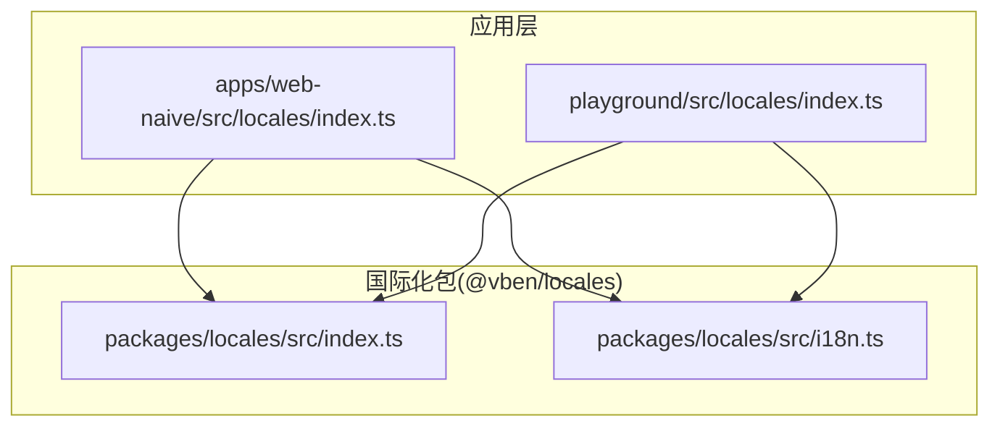
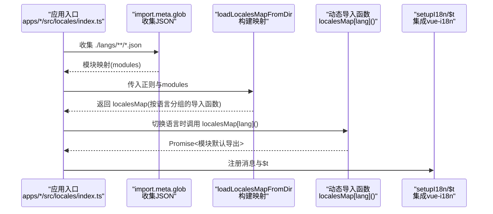
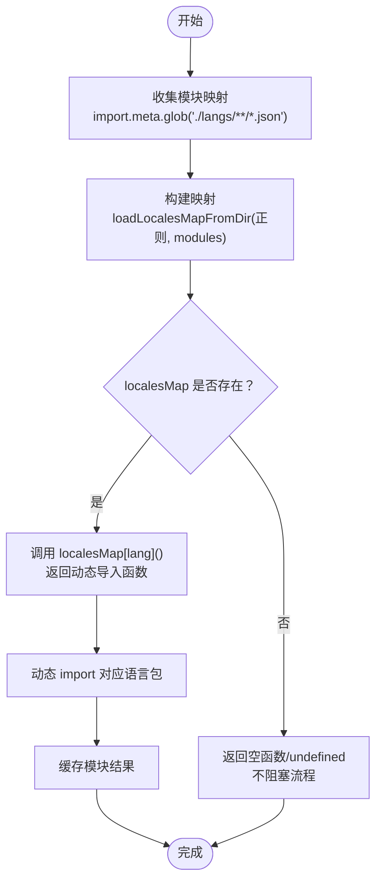
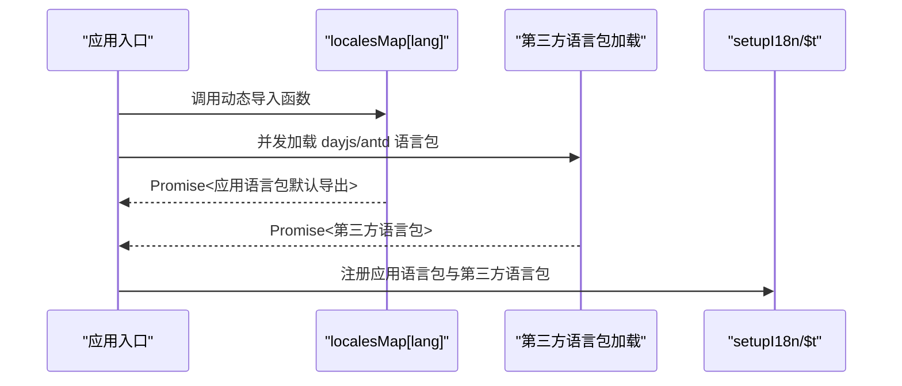
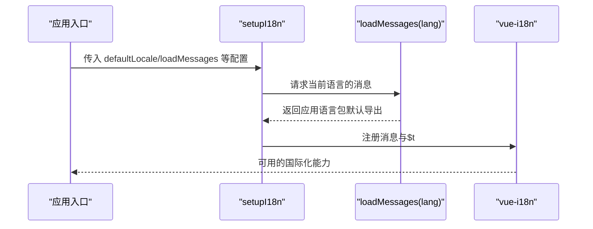
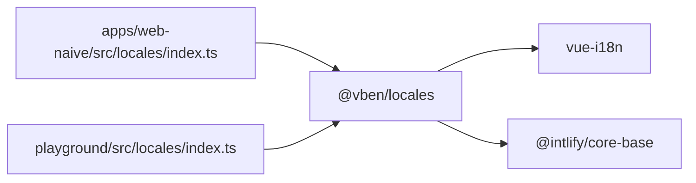

# 动态语言包加载

<cite>
**本文引用的文件**
- [apps/web-naive/src/locales/index.ts](file://apps/web-naive/src/locales/index.ts)
- [playground/src/locales/index.ts](file://playground/src/locales/index.ts)
- [packages/locales/src/index.ts](file://packages/locales/src/index.ts)
- [packages/locales/src/i18n.ts](file://packages/locales/src/i18n.ts)
</cite>

## 目录

1. [简介](#简介)
2. [项目结构](#项目结构)
3. [核心组件](#核心组件)
4. [架构总览](#架构总览)
5. [详细组件分析](#详细组件分析)
6. [依赖关系分析](#依赖关系分析)
7. [性能考量](#性能考量)
8. [故障排查指南](#故障排查指南)
9. [结论](#结论)
10. [附录](#附录)

## 简介

本技术文档围绕 shiyu-ui 项目的动态语言包加载机制展开，重点解析 loadLocalesMapFromDir 函数的实现原理与使用方式，涵盖以下主题：

- 正则表达式匹配与模块动态导入的工作流
- localesMap 的构建过程与缓存策略
- 异步加载流程与错误处理机制
- 按需加载与内存管理的性能优化
- 配置选项与可定制化扩展方案
- 监控与可观测性建议

## 项目结构

本项目在多个应用中复用统一的国际化能力，核心逻辑位于 @vben/locales 包，并在具体应用中通过 import.meta.glob 收集本地语言包资源，再交由 loadLocalesMapFromDir 构建按语言分组的动态导入映射。

图表来源

- [apps/web-naive/src/locales/index.ts:1-39](file://apps/web-naive/src/locales/index.ts#L1-L39)
- [playground/src/locales/index.ts:1-103](file://playground/src/locales/index.ts#L1-L103)
- [packages/locales/src/index.ts:1-31](file://packages/locales/src/index.ts#L1-L31)
- [packages/locales/src/i18n.ts:144-160](file://packages/locales/src/i18n.ts#L144-L160)

章节来源

- [apps/web-naive/src/locales/index.ts:1-39](file://apps/web-naive/src/locales/index.ts#L1-L39)
- [playground/src/locales/index.ts:1-103](file://playground/src/locales/index.ts#L1-L103)
- [packages/locales/src/index.ts:1-31](file://packages/locales/src/index.ts#L1-L31)

## 核心组件

- 应用侧入口：在各应用的 locales/index.ts 中，通过 import.meta.glob 收集语言包 JSON 文件，并调用 loadLocalesMapFromDir 构建 localesMap。
- 国际化核心：@vben/locales 提供 loadLocalesMapFromDir、setupI18n、$t 等能力，负责将收集到的模块映射转换为按语言分组的动态导入函数，并与 vue-i18n 集成。
- 动态加载器：loadLocalesMapFromDir 基于正则匹配路径，提取语言与模块名，返回一个以语言为键的函数映射；该函数返回 Promise，内部执行动态 import，实现按需加载与缓存。

章节来源

- [apps/web-naive/src/locales/index.ts:12-17](file://apps/web-naive/src/locales/index.ts#L12-L17)
- [playground/src/locales/index.ts:22-27](file://playground/src/locales/index.ts#L22-L27)
- [packages/locales/src/index.ts:12-20](file://packages/locales/src/index.ts#L12-L20)

## 架构总览

动态语言包加载的整体流程如下：

- 资源收集：import.meta.glob 收集 ./langs/\*_/_.json 路径下的所有语言包文件，生成模块映射。
- 映射构建：loadLocalesMapFromDir 使用正则对模块键进行解析，按语言分组生成动态导入函数。
- 运行时加载：应用在切换语言时，调用 localesMap[lang] 返回的函数，触发动态 import 并缓存结果。
- 多源合并：应用侧可将应用语言包与第三方组件库（如 dayjs、ant-design-vue）语言包并行加载，提升整体体验。

图表来源

- [apps/web-naive/src/locales/index.ts:12-17](file://apps/web-naive/src/locales/index.ts#L12-L17)
- [apps/web-naive/src/locales/index.ts:24-27](file://apps/web-naive/src/locales/index.ts#L24-L27)
- [playground/src/locales/index.ts:22-27](file://playground/src/locales/index.ts#L22-L27)
- [playground/src/locales/index.ts:33-39](file://playground/src/locales/index.ts#L33-L39)
- [packages/locales/src/i18n.ts:144-160](file://packages/locales/src/i18n.ts#L144-L160)

## 详细组件分析

### 组件一：loadLocalesMapFromDir 实现与工作流

- 输入参数
  - 正则表达式：用于从模块键中提取语言与模块名，典型为匹配 ./langs/<语言>/<模块>.json 的路径。
  - 模块映射：import.meta.glob 产出的键值对，键为绝对或相对路径，值为模块工厂。
- 输出结果
  - localesMap：以语言为键的对象，值为函数，调用后返回对应语言模块的动态导入 Promise。
- 关键行为
  - 解析模块键：使用正则捕获语言与模块名，构造语言到模块列表的映射。
  - 动态导入：为每种语言返回一个函数，内部执行 import，实现按需加载与缓存。
  - 错误兜底：当语言不存在或模块缺失时，返回 undefined，避免阻塞主流程。

图表来源

- [apps/web-naive/src/locales/index.ts:12-17](file://apps/web-naive/src/locales/index.ts#L12-L17)
- [playground/src/locales/index.ts:22-27](file://playground/src/locales/index.ts#L22-L27)
- [packages/locales/src/i18n.ts:144-160](file://packages/locales/src/i18n.ts#L144-L160)

章节来源

- [apps/web-naive/src/locales/index.ts:12-17](file://apps/web-naive/src/locales/index.ts#L12-L17)
- [playground/src/locales/index.ts:22-27](file://playground/src/locales/index.ts#L22-L27)
- [packages/locales/src/i18n.ts:144-160](file://packages/locales/src/i18n.ts#L144-L160)

### 组件二：应用侧加载与并发策略

- 单语言加载：直接调用 localesMap[lang]，等待 Promise 完成后得到模块默认导出。
- 多源并发：在 playground 示例中，同时加载应用语言包与第三方库（dayjs、ant-design-vue）语言包，使用 Promise.all 提升加载效率。
- 第三方库适配：根据语言选择对应的 dayjs/locale 与 antd locale，并更新全局状态。

图表来源

- [playground/src/locales/index.ts:33-39](file://playground/src/locales/index.ts#L33-L39)
- [playground/src/locales/index.ts:45-47](file://playground/src/locales/index.ts#L45-L47)
- [playground/src/locales/index.ts:53-74](file://playground/src/locales/index.ts#L53-L74)
- [playground/src/locales/index.ts:80-91](file://playground/src/locales/index.ts#L80-L91)

章节来源

- [playground/src/locales/index.ts:33-39](file://playground/src/locales/index.ts#L33-L39)
- [playground/src/locales/index.ts:45-47](file://playground/src/locales/index.ts#L45-L47)
- [playground/src/locales/index.ts:53-74](file://playground/src/locales/index.ts#L53-L74)
- [playground/src/locales/index.ts:80-91](file://playground/src/locales/index.ts#L80-L91)

### 组件三：国际化初始化与消息注册

- 初始化入口：应用侧调用 setupI18n，传入默认语言、消息加载函数、缺失警告等配置。
- 消息注册：loadMessages 返回的应用语言包默认导出作为当前语言的消息源，配合 $t 进行文本解析。

图表来源

- [apps/web-naive/src/locales/index.ts:29-36](file://apps/web-naive/src/locales/index.ts#L29-L36)
- [playground/src/locales/index.ts:93-100](file://playground/src/locales/index.ts#L93-L100)

章节来源

- [apps/web-naive/src/locales/index.ts:29-36](file://apps/web-naive/src/locales/index.ts#L29-L36)
- [playground/src/locales/index.ts:93-100](file://playground/src/locales/index.ts#L93-L100)

## 依赖关系分析

- 应用层依赖 @vben/locales 导出的能力，包括 $t、setupI18n、loadLocalesMapFromDir 等。
- @vben/locales 内部依赖 vue-i18n 与 @intlify/core-base，负责国际化核心能力与编译错误类型。
- 应用层通过 import.meta.glob 收集本地资源，形成与 @vben/locales 的协作闭环。

图表来源

- [packages/locales/src/index.ts:12-20](file://packages/locales/src/index.ts#L12-L20)
- [packages/locales/src/index.ts:22-27](file://packages/locales/src/index.ts#L22-L27)
- [apps/web-naive/src/locales/index.ts:5-9](file://apps/web-naive/src/locales/index.ts#L5-L9)
- [playground/src/locales/index.ts:9-13](file://playground/src/locales/index.ts#L9-L13)

章节来源

- [packages/locales/src/index.ts:12-20](file://packages/locales/src/index.ts#L12-L20)
- [packages/locales/src/index.ts:22-27](file://packages/locales/src/index.ts#L22-L27)
- [apps/web-naive/src/locales/index.ts:5-9](file://apps/web-naive/src/locales/index.ts#L5-L9)
- [playground/src/locales/index.ts:9-13](file://playground/src/locales/index.ts#L9-L13)

## 性能考量

- 按需加载
  - 仅在切换语言时触发动态 import，避免一次性加载全部语言包，降低首屏体积与时间成本。
- 缓存策略
  - 动态 import 返回的模块会被浏览器与打包器缓存；@vben/locales 内部对同一语言的多次调用共享缓存结果，减少重复请求。
- 并发加载
  - 将应用语言包与第三方库语言包并行加载，缩短整体等待时间，提升用户体验。
- 内存管理
  - 语言包为静态 JSON，默认导出对象体积可控；切换语言时建议及时清理不再使用的资源引用，避免内存泄漏。
- 预加载与预热
  - 在用户可能切换的语言集合上进行预加载，结合路由守卫或页面进入时机，提前触发动态 import，进一步降低感知延迟。
- 监控与观测
  - 记录动态 import 的耗时、失败率与缓存命中情况；在生产环境开启缺失警告开关，便于发现缺失键值与加载异常。

## 故障排查指南

- 语言包未生效
  - 检查 import.meta.glob 的路径是否正确，确认 ./langs/\*_/_ 与实际目录一致。
  - 确认正则是否能正确从模块键中提取语言与模块名。
- 动态 import 报错
  - 检查目标语言是否存在对应模块；若不存在，localesMap[lang] 将返回 undefined，需在调用前做存在性判断。
- 第三方库语言包加载失败
  - 核对 dayjs 与 antd 的语言包名称与版本；在 playground 示例中提供了按语言分支的加载逻辑，可参考其错误处理与日志输出。
- 性能问题
  - 观察网络面板与性能面板，确认是否存在重复加载或缓存未命中；必要时引入预加载策略与缓存控制头。

章节来源

- [playground/src/locales/index.ts:53-74](file://playground/src/locales/index.ts#L53-L74)
- [playground/src/locales/index.ts:80-91](file://playground/src/locales/index.ts#L80-L91)

## 结论

loadLocalesMapFromDir 将静态收集与动态导入有机结合，实现了按语言分组的高效加载与缓存。通过与应用侧的并发加载策略配合，可在保证用户体验的同时显著降低初始开销。建议在实际项目中结合预加载、监控与可观测性手段，持续优化语言包加载的稳定性与性能表现。

## 附录

- 配置选项与扩展点
  - defaultLocale：默认语言，通常来自用户偏好设置。
  - loadMessages：自定义消息加载函数，支持应用语言包与第三方库语言包的组合加载。
  - missingWarn：是否在开发环境打印缺失键值警告。
  - 自定义实现：可在 loadMessages 中加入服务端拉取、本地缓存、降级策略等逻辑，满足复杂场景需求。

章节来源

- [apps/web-naive/src/locales/index.ts:29-36](file://apps/web-naive/src/locales/index.ts#L29-L36)
- [playground/src/locales/index.ts:93-100](file://playground/src/locales/index.ts#L93-L100)
