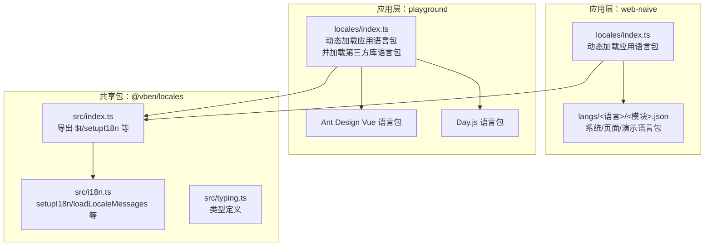
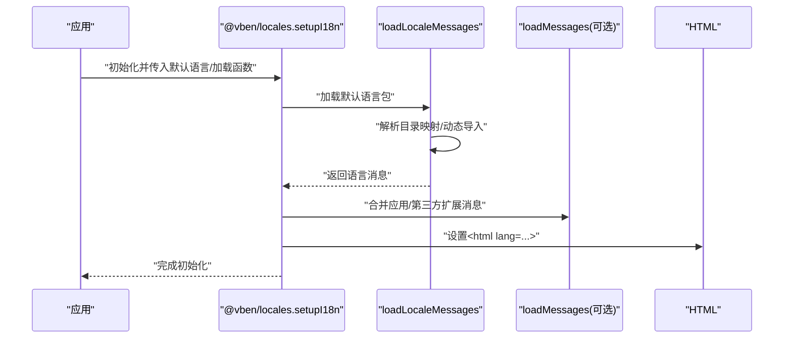
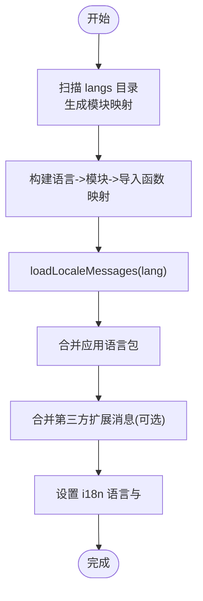
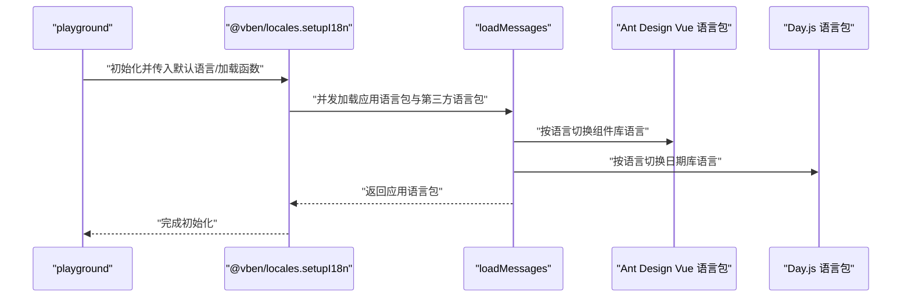
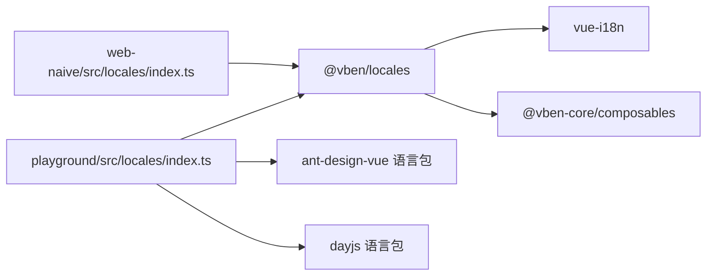

# 国际化系统

<cite>
**本文引用的文件**   
- [apps/web-naive/src/locales/index.ts](file://apps/web-naive/src/locales/index.ts)
- [apps/web-naive/src/locales/README.md](file://apps/web-naive/src/locales/README.md)
- [apps/web-naive/src/locales/langs/zh-CN/system.json](file://apps/web-naive/src/locales/langs/zh-CN/system.json)
- [apps/web-naive/src/locales/langs/zh-CN/page.json](file://apps/web-naive/src/locales/langs/zh-CN/page.json)
- [apps/web-naive/src/locales/langs/zh-CN/demos.json](file://apps/web-naive/src/locales/langs/zh-CN/demos.json)
- [playground/src/locales/index.ts](file://playground/src/locales/index.ts)
- [playground/src/locales/README.md](file://playground/src/locales/README.md)
- [packages/locales/src/index.ts](file://packages/locales/src/index.ts)
- [packages/locales/src/i18n.ts](file://packages/locales/src/i18n.ts)
- [packages/locales/src/typing.ts](file://packages/locales/src/typing.ts)
- [packages/locales/package.json](file://packages/locales/package.json)
- [packages/preferences/src/index.ts](file://packages/preferences/src/index.ts)
- [apps/web-naive/src/preferences.ts](file://apps/web-naive/src/preferences.ts)
</cite>

## 目录

1. [简介](#简介)
2. [项目结构](#项目结构)
3. [核心组件](#核心组件)
4. [架构总览](#架构总览)
5. [详细组件分析](#详细组件分析)
6. [依赖关系分析](#依赖关系分析)
7. [性能考量](#性能考量)
8. [故障排查指南](#故障排查指南)
9. [结论](#结论)
10. [附录](#附录)

## 简介

本文件面向 shiyu-ui 项目的国际化系统，系统基于 Vue I18n，并通过统一的 @vben/locales 包进行封装与扩展。文档涵盖以下主题：

- Vue I18n 的集成与配置方式
- 语言包的组织结构与加载机制
- 多语言配置：语言切换、默认语言设置、语言检测
- 语言包分类：系统语言包、页面语言包、演示语言包
- 动态语言包加载与性能优化策略
- 国际化开发最佳实践：文本提取、翻译管理、本地化测试
- 新增语言支持的步骤与注意事项

## 项目结构

国际化相关代码主要分布在两个应用与一个共享包中：

- 应用层（web-naive）：负责自身语言包的加载与导出，使用 @vben/locales 完成 I18n 初始化与语言切换
- 应用层（playground）：在基础 I18n 能力之上，额外加载第三方组件库（Ant Design Vue、Day.js）的语言包
- 共享包（@vben/locales）：封装 Vue I18n 初始化、语言包映射、动态加载、缺失键告警等通用能力

图表来源

- [apps/web-naive/src/locales/index.ts:1-39](file://apps/web-naive/src/locales/index.ts#L1-L39)
- [playground/src/locales/index.ts:1-103](file://playground/src/locales/index.ts#L1-L103)
- [packages/locales/src/index.ts:1-31](file://packages/locales/src/index.ts#L1-L31)
- [packages/locales/src/i18n.ts:1-148](file://packages/locales/src/i18n.ts#L1-L148)
- [packages/locales/src/typing.ts:1-26](file://packages/locales/src/typing.ts#L1-L26)

章节来源

- [apps/web-naive/src/locales/index.ts:1-39](file://apps/web-naive/src/locales/index.ts#L1-L39)
- [playground/src/locales/index.ts:1-103](file://playground/src/locales/index.ts#L1-L103)
- [packages/locales/src/index.ts:1-31](file://packages/locales/src/index.ts#L1-L31)
- [packages/locales/src/i18n.ts:1-148](file://packages/locales/src/i18n.ts#L1-L148)
- [packages/locales/src/typing.ts:1-26](file://packages/locales/src/typing.ts#L1-L26)

## 核心组件

- 统一入口与导出
  - @vben/locales 提供 $t、setupI18n、loadLocalesMapFromDir 等能力，供各应用复用
- 应用层 I18n 配置
  - web-naive：仅加载自身语言包，结合偏好设置确定默认语言
  - playground：在加载自身语言包的同时，异步加载 Ant Design Vue 与 Day.js 的语言包，保证 UI 组件与日期格式一致
- 类型与约束
  - SupportedLanguagesType 限定受支持的语言集合；LoadMessageFn 为可选的扩展消息加载函数

章节来源

- [packages/locales/src/index.ts:1-31](file://packages/locales/src/index.ts#L1-L31)
- [packages/locales/src/i18n.ts:102-139](file://packages/locales/src/i18n.ts#L102-L139)
- [packages/locales/src/typing.ts:1-26](file://packages/locales/src/typing.ts#L1-L26)
- [apps/web-naive/src/locales/index.ts:29-36](file://apps/web-naive/src/locales/index.ts#L29-L36)
- [playground/src/locales/index.ts:93-100](file://playground/src/locales/index.ts#L93-L100)

## 架构总览

整体流程：应用启动时调用 setupI18n，内部根据默认语言加载对应语言包；当切换语言时，先设置 HTML lang 属性，再合并应用与第三方扩展的消息，最后完成语言切换。

图表来源

- [packages/locales/src/i18n.ts:102-139](file://packages/locales/src/i18n.ts#L102-L139)

## 详细组件分析

### 语言包组织与命名规范

- 目录结构
  - apps/web-naive/src/locales/langs/<语言>/<模块>.json
  - apps/playground/src/locales/langs/<语言>/<模块>.json
- 模块分类
  - system.json：系统级模块（如菜单、部门、角色、用户）
  - page.json：页面级模块（如认证、仪表盘）
  - demos.json 或 examples.json：演示/示例模块
- 命名规范
  - 语言代码采用 BCP47 风格，如 zh-CN、en-US
  - 模块文件名简洁明确，便于按功能域拆分与维护

章节来源

- [apps/web-naive/src/locales/README.md:1-4](file://apps/web-naive/src/locales/README.md#L1-L4)
- [apps/web-naive/src/locales/langs/zh-CN/system.json:1-85](file://apps/web-naive/src/locales/langs/zh-CN/system.json#L1-L85)
- [apps/web-naive/src/locales/langs/zh-CN/page.json:1-16](file://apps/web-naive/src/locales/langs/zh-CN/page.json#L1-L16)
- [apps/web-naive/src/locales/langs/zh-CN/demos.json:1-17](file://apps/web-naive/src/locales/langs/zh-CN/demos.json#L1-L17)

### 动态语言包加载机制

- 目录扫描与映射
  - 使用 import.meta.glob 收集所有语言包 JSON 文件
  - 通过 loadLocalesMapFromDir 将路径匹配为“语言 -> 模块名 -> 导入函数”的映射
- 动态导入与合并
  - loadLocaleMessages 会先设置当前语言，再动态导入对应语言的所有模块并合并为 messages
  - 若存在应用自定义的 loadMessages，则在合并阶段将第三方扩展消息与应用语言包合并
- 语言切换
  - setI18nLanguage 设置 i18n.global.locale 并同步 HTML lang 属性，确保 SEO 与辅助技术友好

图表来源

- [packages/locales/src/i18n.ts:55-90](file://packages/locales/src/i18n.ts#L55-L90)
- [packages/locales/src/i18n.ts:123-139](file://packages/locales/src/i18n.ts#L123-L139)

章节来源

- [packages/locales/src/i18n.ts:23-90](file://packages/locales/src/i18n.ts#L23-L90)
- [packages/locales/src/i18n.ts:123-139](file://packages/locales/src/i18n.ts#L123-L139)

### 应用层 I18n 集成（web-naive）

- 默认语言来源
  - 从 @vben/preferences 获取 app.locale 作为默认语言
- 加载函数
  - 仅加载应用自身的语言包，不涉及第三方库语言包
- 初始化
  - setupI18n 调用 @vben/locales 的 setupI18n，并传入默认语言与 loadMessages

章节来源

- [apps/web-naive/src/locales/index.ts:29-36](file://apps/web-naive/src/locales/index.ts#L29-L36)
- [apps/web-naive/src/locales/index.ts:24-27](file://apps/web-naive/src/locales/index.ts#L24-L27)
- [packages/preferences/src/index.ts:1-28](file://packages/preferences/src/index.ts#L1-L28)
- [apps/web-naive/src/preferences.ts:1-17](file://apps/web-naive/src/preferences.ts#L1-L17)

### 应用层 I18n 集成（playground）

- 默认语言来源
  - 同样来自 @vben/preferences 的 app.locale
- 加载函数
  - 在加载应用语言包的同时，异步加载 Ant Design Vue 与 Day.js 的语言包
  - 通过 ref 管理 antd 语言包的切换状态
- 初始化
  - setupI18n 调用 @vben/locales 的 setupI18n，并传入默认语言与 loadMessages

图表来源

- [playground/src/locales/index.ts:33-39](file://playground/src/locales/index.ts#L33-L39)
- [playground/src/locales/index.ts:45-47](file://playground/src/locales/index.ts#L45-L47)
- [playground/src/locales/index.ts:80-91](file://playground/src/locales/index.ts#L80-L91)
- [playground/src/locales/index.ts:53-74](file://playground/src/locales/index.ts#L53-L74)

章节来源

- [playground/src/locales/index.ts:1-103](file://playground/src/locales/index.ts#L1-L103)

### 类型与配置

- SupportedLanguagesType
  - 限定受支持的语言集合，避免运行期出现未定义语言
- LocaleSetupOptions
  - defaultLocale：默认语言
  - loadMessages：可选的扩展消息加载函数
  - missingWarn：未命中键时是否输出控制台警告
- 导出能力
  - $t、setupI18n、loadLocalesMapFromDir 等由 @vben/locales 统一导出

章节来源

- [packages/locales/src/typing.ts:1-26](file://packages/locales/src/typing.ts#L1-L26)
- [packages/locales/src/index.ts:12-20](file://packages/locales/src/index.ts#L12-L20)

## 依赖关系分析

- 应用层依赖
  - web-naive 与 playground 均依赖 @vben/locales 提供的 I18n 能力
  - playground 额外依赖 Ant Design Vue 与 Day.js 的语言包
- 共享包依赖
  - @vben/locales 内部依赖 vue-i18n 与 @vben-core/composables
  - package.json 中声明了对 vue 与 vue-i18n 的版本约束

图表来源

- [packages/locales/package.json:22-27](file://packages/locales/package.json#L22-L27)
- [playground/src/locales/index.ts:16-18](file://playground/src/locales/index.ts#L16-L18)

章节来源

- [packages/locales/package.json:1-29](file://packages/locales/package.json#L1-L29)
- [playground/src/locales/index.ts:1-103](file://playground/src/locales/index.ts#L1-L103)

## 性能考量

- 动态导入与并发加载
  - 应用层可在 loadMessages 中并发加载第三方语言包，减少等待时间
- 语言包拆分
  - 将系统、页面、演示等模块拆分为独立 JSON 文件，按需加载，降低初始体积
- 缺失键告警
  - 开发环境启用 missingWarn，有助于快速发现未翻译键位，避免生产问题
- 语言切换
  - 切换语言时先设置 HTML lang，再合并消息，避免闪烁或不一致

章节来源

- [packages/locales/src/i18n.ts:110-116](file://packages/locales/src/i18n.ts#L110-L116)
- [playground/src/locales/index.ts:34-39](file://playground/src/locales/index.ts#L34-L39)

## 故障排查指南

- 未命中键告警
  - 若开启 missingWarn，控制台会提示未找到的键位与语言，便于定位问题
- 语言包未生效
  - 检查语言包路径与命名是否符合约定（语言目录与模块文件）
  - 确认 loadMessages 返回的消息结构正确
- 第三方库语言包未切换
  - playground 中需确认 antd 与 dayjs 的语言包已正确导入与设置
- 默认语言不生效
  - 检查 @vben/preferences 中 app.locale 的值与 SupportedLanguagesType 是否一致

章节来源

- [packages/locales/src/i18n.ts:110-116](file://packages/locales/src/i18n.ts#L110-L116)
- [packages/locales/src/typing.ts:1-26](file://packages/locales/src/typing.ts#L1-L26)
- [playground/src/locales/index.ts:80-91](file://playground/src/locales/index.ts#L80-L91)
- [playground/src/locales/index.ts:53-74](file://playground/src/locales/index.ts#L53-L74)

## 结论

shiyu-ui 的国际化系统以 @vben/locales 为核心，实现了统一的 Vue I18n 集成、动态语言包加载与扩展能力。应用层（web-naive 与 playground）在此基础上分别按需加载自身语言包与第三方库语言包，既保证了灵活性，又维持了良好的可维护性。通过模块化语言包、并发加载与缺失键告警等策略，系统在易用性与性能之间取得了平衡。

## 附录

### 新增语言支持步骤

- 在 apps/web-naive/src/locales/langs 下新增语言目录（如 fr-FR），并在其中创建所需的模块 JSON 文件（system.json、page.json、demos.json 等）
- 在 playground 对应目录下重复上述步骤
- 若需要第三方库语言包，补充对应导入与切换逻辑（参考 playground 的实现）
- 如需调整默认语言，请在 @vben/preferences 中设置 app.locale，并确保其属于 SupportedLanguagesType

章节来源

- [apps/web-naive/src/locales/README.md:1-4](file://apps/web-naive/src/locales/README.md#L1-L4)
- [playground/src/locales/README.md:1-4](file://playground/src/locales/README.md#L1-L4)
- [packages/locales/src/typing.ts:1-26](file://packages/locales/src/typing.ts#L1-L26)
- [packages/preferences/src/index.ts:1-28](file://packages/preferences/src/index.ts#L1-L28)
