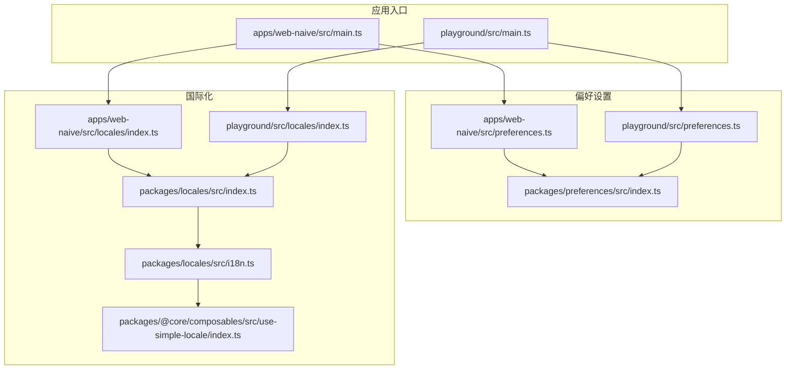
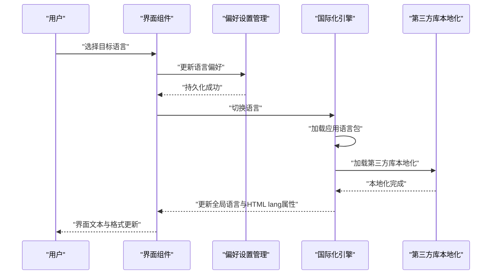
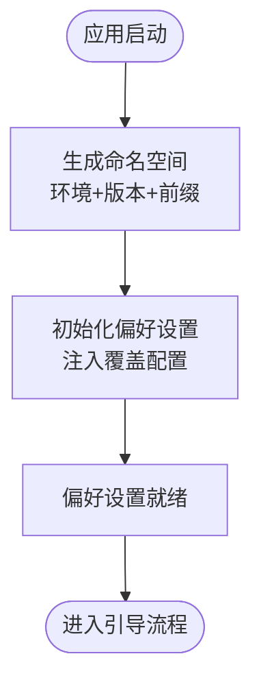
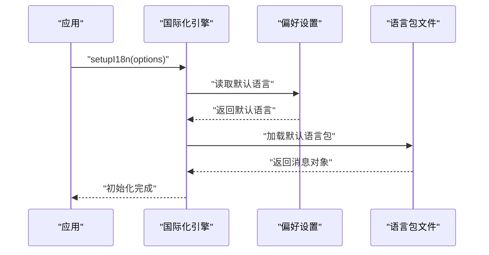
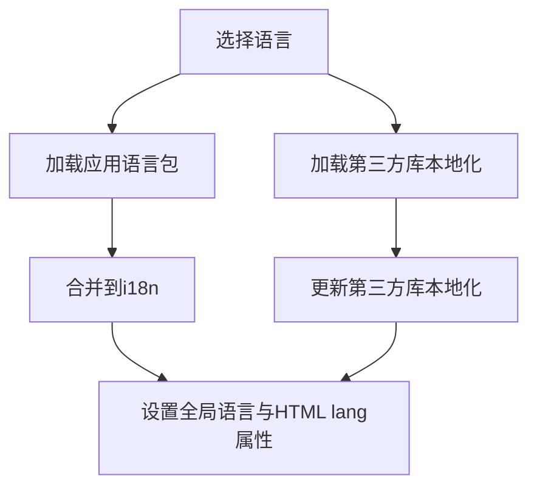
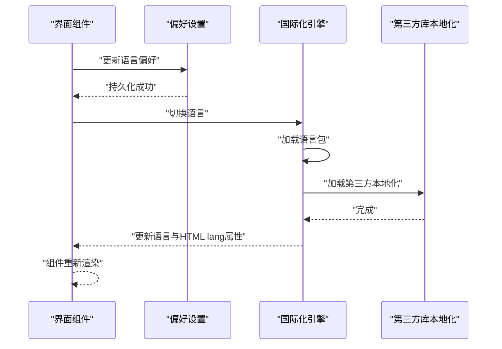
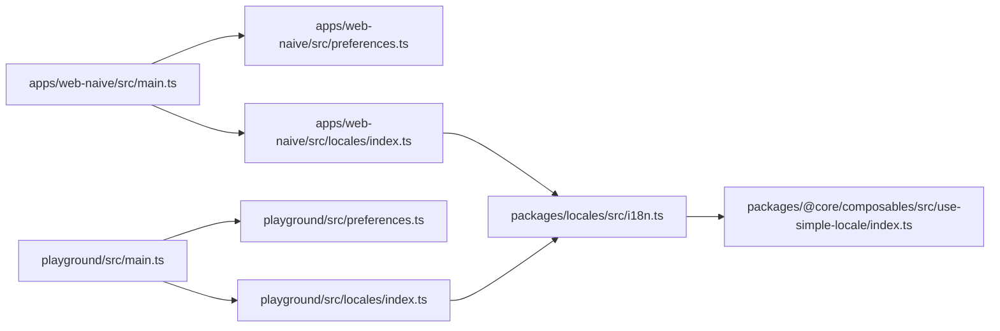

# 语言切换功能

<cite>
**本文引用的文件**
- [apps/web-naive/src/main.ts](file://apps/web-naive/src/main.ts)
- [playground/src/main.ts](file://playground/src/main.ts)
- [apps/web-naive/src/preferences.ts](file://apps/web-naive/src/preferences.ts)
- [playground/src/preferences.ts](file://playground/src/preferences.ts)
- [packages/preferences/src/index.ts](file://packages/preferences/src/index.ts)
- [packages/locales/src/index.ts](file://packages/locales/src/index.ts)
- [packages/locales/src/i18n.ts](file://packages/locales/src/i18n.ts)
- [apps/web-naive/src/locales/index.ts](file://apps/web-naive/src/locales/index.ts)
- [playground/src/locales/index.ts](file://playground/src/locales/index.ts)
- [packages/@core/composables/src/use-simple-locale/index.ts](file://packages/@core/composables/src/use-simple-locale/index.ts)
- [packages/@core/preferences/__tests__/preferences.test.ts](file://packages/@core/preferences/__tests__/preferences.test.ts)
- [apps/web-naive/src/locales/README.md](file://apps/web-naive/src/locales/README.md)
- [playground/src/locales/README.md](file://playground/src/locales/README.md)
</cite>

## 目录

1. [简介](#简介)
2. [项目结构](#项目结构)
3. [核心组件](#核心组件)
4. [架构总览](#架构总览)
5. [详细组件分析](#详细组件分析)
6. [依赖关系分析](#依赖关系分析)
7. [性能考量](#性能考量)
8. [故障排查指南](#故障排查指南)
9. [结论](#结论)
10. [附录](#附录)

## 简介

本文件系统性阐述 shiyu-ui 项目的语言切换（国际化）实现机制与最佳实践，涵盖以下方面：

- 用户偏好设置的存储与读取
- 语言切换的触发方式与响应流程（界面交互与状态更新）
- 对日期格式、数字格式与文本方向等全局功能的影响
- 用户体验设计原则与最佳实践
- 语言检测与自动切换的实现方案
- 持久化存储与跨会话保持机制

## 项目结构

语言切换能力由“偏好设置”与“国际化”两大模块协同实现：

- 偏好设置：负责默认语言、命名空间、扩展字段等配置的初始化与持久化
- 国际化：负责语言包加载、第三方库本地化（如 dayjs、Ant Design）、语言切换与消息合并

**图表来源**

- [apps/web-naive/src/main.ts:1-32](file://apps/web-naive/src/main.ts#L1-L32)
- [playground/src/main.ts:1-33](file://playground/src/main.ts#L1-L33)
- [apps/web-naive/src/preferences.ts:1-17](file://apps/web-naive/src/preferences.ts#L1-L17)
- [playground/src/preferences.ts:1-88](file://playground/src/preferences.ts#L1-L88)
- [packages/preferences/src/index.ts:1-28](file://packages/preferences/src/index.ts#L1-L28)
- [packages/locales/src/index.ts:1-31](file://packages/locales/src/index.ts#L1-L31)
- [packages/locales/src/i18n.ts:1-148](file://packages/locales/src/i18n.ts#L1-L148)
- [apps/web-naive/src/locales/index.ts:1-39](file://apps/web-naive/src/locales/index.ts#L1-L39)
- [playground/src/locales/index.ts:1-103](file://playground/src/locales/index.ts#L1-L103)
- [packages/@core/composables/src/use-simple-locale/index.ts:1-27](file://packages/@core/composables/src/use-simple-locale/index.ts#L1-L27)

**章节来源**

- [apps/web-naive/src/main.ts:1-32](file://apps/web-naive/src/main.ts#L1-L32)
- [playground/src/main.ts:1-33](file://playground/src/main.ts#L1-L33)
- [apps/web-naive/src/preferences.ts:1-17](file://apps/web-naive/src/preferences.ts#L1-L17)
- [playground/src/preferences.ts:1-88](file://playground/src/preferences.ts#L1-L88)
- [packages/preferences/src/index.ts:1-28](file://packages/preferences/src/index.ts#L1-L28)
- [packages/locales/src/index.ts:1-31](file://packages/locales/src/index.ts#L1-L31)
- [packages/locales/src/i18n.ts:1-148](file://packages/locales/src/i18n.ts#L1-L148)
- [apps/web-naive/src/locales/index.ts:1-39](file://apps/web-naive/src/locales/index.ts#L1-L39)
- [playground/src/locales/index.ts:1-103](file://playground/src/locales/index.ts#L1-L103)
- [packages/@core/composables/src/use-simple-locale/index.ts:1-27](file://packages/@core/composables/src/use-simple-locale/index.ts#L1-L27)

## 核心组件

- 偏好设置初始化与命名空间
  - 应用启动时通过入口文件调用偏好设置初始化函数，传入命名空间与覆盖配置，确保不同环境与版本的偏好数据隔离
- 语言偏好与默认语言
  - 语言偏好来自偏好设置中的 app.locale 字段；国际化初始化时以该值作为默认语言
- 语言包加载与合并
  - 应用自定义语言包与第三方库语言包（dayjs、Ant Design）按需异步加载并合并到全局 i18n 实例
- 语言切换执行
  - 切换时更新 i18n 全局语言、HTML lang 属性，并同步更新第三方库本地化

**章节来源**

- [apps/web-naive/src/main.ts:9-25](file://apps/web-naive/src/main.ts#L9-L25)
- [playground/src/main.ts:9-26](file://playground/src/main.ts#L9-L26)
- [apps/web-naive/src/preferences.ts:8-16](file://apps/web-naive/src/preferences.ts#L8-L16)
- [playground/src/preferences.ts:18-26](file://playground/src/preferences.ts#L18-L26)
- [packages/locales/src/i18n.ts:102-117](file://packages/locales/src/i18n.ts#L102-L117)
- [apps/web-naive/src/locales/index.ts:29-36](file://apps/web-naive/src/locales/index.ts#L29-L36)
- [playground/src/locales/index.ts:93-100](file://playground/src/locales/index.ts#L93-L100)

## 架构总览

语言切换的整体流程如下：

- 初始化阶段：入口文件调用偏好设置初始化，确定命名空间与覆盖配置；随后初始化国际化，使用偏好设置中的默认语言
- 运行阶段：用户触发语言切换，应用加载对应语言包与第三方库本地化，更新全局语言与 HTML lang 属性
- 持久化阶段：语言偏好写入持久化存储，跨会话保持

**图表来源**

- [apps/web-naive/src/main.ts:16-25](file://apps/web-naive/src/main.ts#L16-L25)
- [playground/src/main.ts:16-26](file://playground/src/main.ts#L16-L26)
- [packages/locales/src/i18n.ts:123-139](file://packages/locales/src/i18n.ts#L123-L139)
- [playground/src/locales/index.ts:33-47](file://playground/src/locales/index.ts#L33-L47)

## 详细组件分析

### 偏好设置初始化与命名空间

- 命名空间生成规则：基于环境、应用版本与命名空间前缀组合，确保不同项目、版本与环境的偏好数据隔离
- 覆盖配置：应用可覆盖默认偏好（如默认语言），并在初始化时注入
- 扩展配置：支持扩展自定义偏好字段（示例中 playground 展示了扩展字段的定义）

**图表来源**

- [apps/web-naive/src/main.ts:12-20](file://apps/web-naive/src/main.ts#L12-L20)
- [playground/src/main.ts:12-21](file://playground/src/main.ts#L12-L21)
- [apps/web-naive/src/preferences.ts:8-16](file://apps/web-naive/src/preferences.ts#L8-L16)
- [playground/src/preferences.ts:18-26](file://playground/src/preferences.ts#L18-L26)

**章节来源**

- [apps/web-naive/src/main.ts:12-20](file://apps/web-naive/src/main.ts#L12-L20)
- [playground/src/main.ts:12-21](file://playground/src/main.ts#L12-L21)
- [apps/web-naive/src/preferences.ts:8-16](file://apps/web-naive/src/preferences.ts#L8-L16)
- [playground/src/preferences.ts:18-26](file://playground/src/preferences.ts#L18-L26)

### 国际化初始化与默认语言

- 默认语言来源：从偏好设置的 app.locale 获取
- 初始化流程：注册 i18n 插件、加载默认语言消息、设置缺失键提示策略
- 应用语言包：通过目录扫描构建语言包映射，按需异步加载

**图表来源**

- [packages/locales/src/i18n.ts:102-117](file://packages/locales/src/i18n.ts#L102-L117)
- [apps/web-naive/src/locales/index.ts:29-36](file://apps/web-naive/src/locales/index.ts#L29-L36)
- [playground/src/locales/index.ts:93-100](file://playground/src/locales/index.ts#L93-L100)

**章节来源**

- [packages/locales/src/i18n.ts:102-117](file://packages/locales/src/i18n.ts#L102-L117)
- [apps/web-naive/src/locales/index.ts:29-36](file://apps/web-naive/src/locales/index.ts#L29-L36)
- [playground/src/locales/index.ts:93-100](file://playground/src/locales/index.ts#L93-L100)

### 语言包加载与第三方库本地化

- 应用语言包：按语言目录结构动态构建映射，异步加载 JSON 消息并合并到 i18n
- 第三方库本地化（playground）：同时加载 dayjs 与 Ant Design 的语言包，保证日期与组件文案一致
- 加载策略：应用语言包与第三方库本地化并行加载，提升切换效率

**图表来源**

- [packages/locales/src/i18n.ts:123-139](file://packages/locales/src/i18n.ts#L123-L139)
- [playground/src/locales/index.ts:33-47](file://playground/src/locales/index.ts#L33-L47)
- [playground/src/locales/index.ts:53-74](file://playground/src/locales/index.ts#L53-L74)
- [playground/src/locales/index.ts:80-91](file://playground/src/locales/index.ts#L80-L91)

**章节来源**

- [packages/locales/src/i18n.ts:123-139](file://packages/locales/src/i18n.ts#L123-L139)
- [playground/src/locales/index.ts:33-47](file://playground/src/locales/index.ts#L33-L47)
- [playground/src/locales/index.ts:53-74](file://playground/src/locales/index.ts#L53-L74)
- [playground/src/locales/index.ts:80-91](file://playground/src/locales/index.ts#L80-L91)

### 语言切换触发与响应流程

- 触发方式：界面元素（如下拉框、按钮）触发语言切换事件
- 响应流程：更新偏好设置中的语言项 → 异步加载目标语言包与第三方库本地化 → 更新全局语言与 HTML lang 属性 → 组件自动响应语言变化
- 状态更新：全局 i18n 语言变更会驱动依赖语言的组件重新渲染

**图表来源**

- [packages/locales/src/i18n.ts:96-100](file://packages/locales/src/i18n.ts#L96-L100)
- [packages/locales/src/i18n.ts:123-139](file://packages/locales/src/i18n.ts#L123-L139)

**章节来源**

- [packages/locales/src/i18n.ts:96-100](file://packages/locales/src/i18n.ts#L96-L100)
- [packages/locales/src/i18n.ts:123-139](file://packages/locales/src/i18n.ts#L123-L139)

### 对日期格式、数字格式与文本方向的影响

- 日期格式：playground 示例通过 dayjs 动态加载对应语言包，确保日期解析与显示符合目标语言习惯
- 数字格式：可通过 i18n 或浏览器 Intl 接口在组件层按需处理（仓库未直接展示数字格式化代码）
- 文本方向：HTML lang 属性随语言切换更新，有助于浏览器与组件库正确识别文本方向

**章节来源**

- [playground/src/locales/index.ts:53-74](file://playground/src/locales/index.ts#L53-L74)
- [packages/locales/src/i18n.ts:99](file://packages/locales/src/i18n.ts#L99)

### 用户体验设计原则与最佳实践

- 一致性：语言切换后，所有文案、日期与组件状态保持一致
- 可发现性：在设置或头部区域提供清晰的语言切换入口
- 即时反馈：切换时显示加载状态或过渡动画，避免闪烁
- 可回退：提供默认语言回退策略，确保极端情况下仍可正常显示
- 无障碍：确保切换后的文本方向与阅读顺序符合目标语言习惯

### 语言检测与自动切换

- 自动检测：可结合浏览器语言首选项与用户历史偏好，自动选择最合适的语言
- 自动切换：在检测到语言变化时，触发与手动切换一致的流程（加载语言包、更新第三方库本地化、更新全局语言）

### 持久化存储与跨会话保持

- 存储介质：偏好设置通过统一的偏好管理器持久化（localStorage/sessionStorage），命名空间隔离不同项目/版本
- 跨会话保持：应用启动时读取持久化偏好，恢复默认语言与其他偏好项

**章节来源**

- [packages/@core/preferences/**tests**/preferences.test.ts:45-94](file://packages/@core/preferences/__tests__/preferences.test.ts#L45-L94)

## 依赖关系分析

- 应用入口依赖偏好设置初始化与国际化初始化
- 应用语言包与第三方库本地化均依赖国际化引擎
- 偏好设置覆盖配置影响默认语言来源

**图表来源**

- [apps/web-naive/src/main.ts:16-25](file://apps/web-naive/src/main.ts#L16-L25)
- [apps/web-naive/src/preferences.ts:8-16](file://apps/web-naive/src/preferences.ts#L8-L16)
- [apps/web-naive/src/locales/index.ts:29-36](file://apps/web-naive/src/locales/index.ts#L29-L36)
- [packages/locales/src/i18n.ts:102-117](file://packages/locales/src/i18n.ts#L102-L117)
- [packages/@core/composables/src/use-simple-locale/index.ts:1-27](file://packages/@core/composables/src/use-simple-locale/index.ts#L1-L27)
- [playground/src/main.ts:16-26](file://playground/src/main.ts#L16-L26)
- [playground/src/preferences.ts:18-26](file://playground/src/preferences.ts#L18-L26)
- [playground/src/locales/index.ts:93-100](file://playground/src/locales/index.ts#L93-L100)

**章节来源**

- [apps/web-naive/src/main.ts:16-25](file://apps/web-naive/src/main.ts#L16-L25)
- [apps/web-naive/src/preferences.ts:8-16](file://apps/web-naive/src/preferences.ts#L8-L16)
- [apps/web-naive/src/locales/index.ts:29-36](file://apps/web-naive/src/locales/index.ts#L29-L36)
- [packages/locales/src/i18n.ts:102-117](file://packages/locales/src/i18n.ts#L102-L117)
- [packages/@core/composables/src/use-simple-locale/index.ts:1-27](file://packages/@core/composables/src/use-simple-locale/index.ts#L1-L27)
- [playground/src/main.ts:16-26](file://playground/src/main.ts#L16-L26)
- [playground/src/preferences.ts:18-26](file://playground/src/preferences.ts#L18-L26)
- [playground/src/locales/index.ts:93-100](file://playground/src/locales/index.ts#L93-L100)

## 性能考量

- 并行加载：应用语言包与第三方库本地化采用并行加载策略，减少切换等待时间
- 惰性加载：仅在切换时加载目标语言包，避免一次性加载全部语言包造成首屏负担
- 缓存策略：建议在浏览器端对已加载的语言包进行缓存，降低重复切换成本

## 故障排查指南

- 语言包缺失：检查语言包目录与文件命名是否符合约定，确认国际化初始化时的默认语言是否正确
- 第三方库本地化失败：确认 dayjs 与 Ant Design 的语言包导入路径与版本兼容性
- HTML lang 属性未更新：检查语言切换流程中是否调用了设置全局语言与更新 HTML lang 属性的步骤
- 偏好设置未持久化：确认命名空间与覆盖配置是否正确，查看测试用例中的偏好初始化与读取行为

**章节来源**

- [packages/locales/src/i18n.ts:110-116](file://packages/locales/src/i18n.ts#L110-L116)
- [playground/src/locales/index.ts:69-73](file://playground/src/locales/index.ts#L69-L73)
- [packages/@core/preferences/**tests**/preferences.test.ts:45-94](file://packages/@core/preferences/__tests__/preferences.test.ts#L45-L94)

## 结论

shiyu-ui 的语言切换功能通过“偏好设置 + 国际化引擎”的解耦设计，实现了默认语言的灵活配置、第三方库本地化的无缝集成以及高效的切换性能。配合命名空间隔离与持久化机制，可在多项目、多版本场景下稳定地保持用户的语言偏好。

## 附录

- 语言包目录说明：应用语言包位于各自应用的 locales 目录下，遵循“语言/模块.json”的结构
- 第三方库本地化：playground 示例展示了 dayjs 与 Ant Design 的语言包加载方式，可作为其他第三方库的参考模板

**章节来源**

- [apps/web-naive/src/locales/README.md:1-4](file://apps/web-naive/src/locales/README.md#L1-L4)
- [playground/src/locales/README.md:1-4](file://playground/src/locales/README.md#L1-L4)
