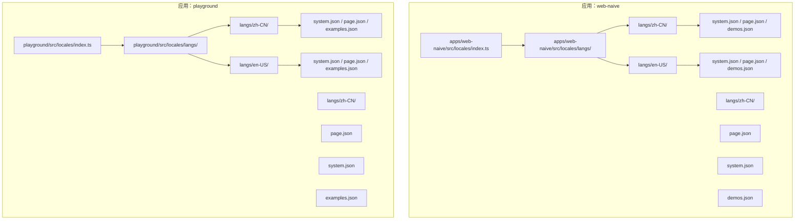
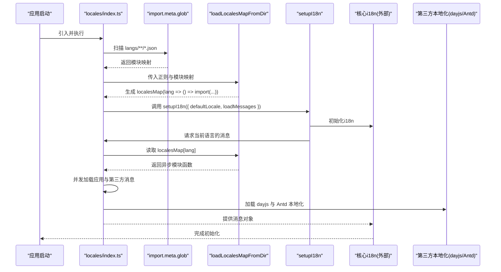
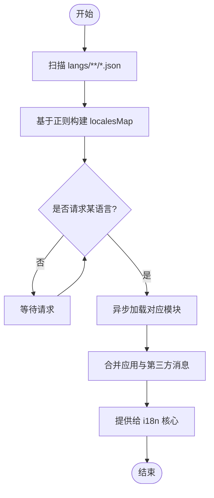
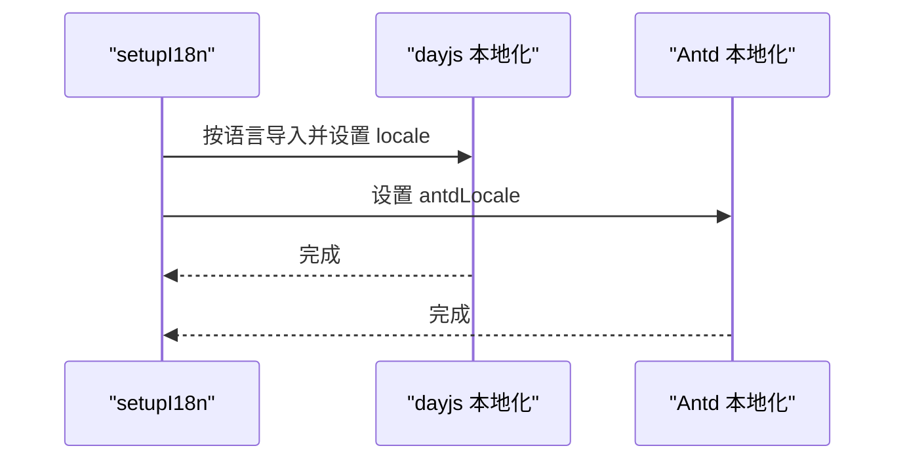
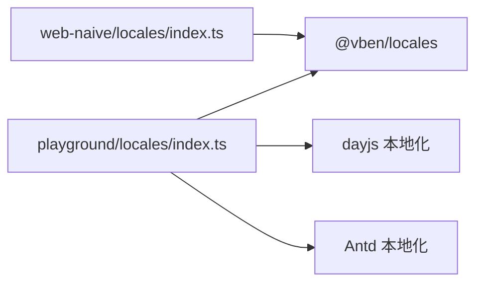

# 语言包管理

<cite>
**本文引用的文件**
- [apps/web-naive/src/locales/index.ts](file://apps/web-naive/src/locales/index.ts)
- [apps/web-naive/src/locales/README.md](file://apps/web-naive/src/locales/README.md)
- [apps/web-naive/src/locales/langs/zh-CN/system.json](file://apps/web-naive/src/locales/langs/zh-CN/system.json)
- [apps/web-naive/src/locales/langs/zh-CN/page.json](file://apps/web-naive/src/locales/langs/zh-CN/page.json)
- [apps/web-naive/src/locales/langs/zh-CN/demos.json](file://apps/web-naive/src/locales/langs/zh-CN/demos.json)
- [apps/web-naive/src/locales/langs/en-US/system.json](file://apps/web-naive/src/locales/langs/en-US/system.json)
- [apps/web-naive/src/locales/langs/en-US/page.json](file://apps/web-naive/src/locales/langs/en-US/page.json)
- [apps/web-naive/src/locales/langs/en-US/demos.json](file://apps/web-naive/src/locales/langs/en-US/demos.json)
- [playground/src/locales/index.ts](file://playground/src/locales/index.ts)
- [playground/src/locales/README.md](file://playground/src/locales/README.md)
- [playground/src/locales/langs/zh-CN/system.json](file://playground/src/locales/langs/zh-CN/system.json)
- [playground/src/locales/langs/zh-CN/page.json](file://playground/src/locales/langs/zh-CN/page.json)
- [playground/src/locales/langs/zh-CN/examples.json](file://playground/src/locales/langs/zh-CN/examples.json)
- [playground/src/locales/langs/en-US/system.json](file://playground/src/locales/langs/en-US/system.json)
- [playground/src/locales/langs/en-US/page.json](file://playground/src/locales/langs/en-US/page.json)
- [playground/src/locales/langs/en-US/examples.json](file://playground/src/locales/langs/en-US/examples.json)
</cite>

## 目录

1. [简介](#简介)
2. [项目结构](#项目结构)
3. [核心组件](#核心组件)
4. [架构总览](#架构总览)
5. [详细组件分析](#详细组件分析)
6. [依赖分析](#依赖分析)
7. [性能考虑](#性能考虑)
8. [故障排查指南](#故障排查指南)
9. [结论](#结论)
10. [附录](#附录)

## 简介

本文件系统性阐述 shiyu-ui 项目的语言包管理体系，覆盖语言包的组织结构与命名规范、文件格式与层级约定、动态加载机制（含 import.meta.glob 与 localesMap 构建）、最佳实践与维护策略，并提供新增与修改语言包的操作步骤。目标是帮助开发者快速理解并高效维护多语言资源。

## 项目结构

语言包位于两个应用中：

- 应用一：apps/web-naive
- 应用二：playground

两者均采用统一的目录结构：

- 顶层目录：langs/<语言代码>/<文件名>.json
- 典型文件名：system.json（系统级）、page.json（页面级）、demos.json 或 examples.json（演示/示例）

图表来源

- [apps/web-naive/src/locales/index.ts:1-39](file://apps/web-naive/src/locales/index.ts#L1-L39)
- [playground/src/locales/index.ts:1-103](file://playground/src/locales/index.ts#L1-L103)

章节来源

- [apps/web-naive/src/locales/README.md:1-4](file://apps/web-naive/src/locales/README.md#L1-L4)
- [playground/src/locales/README.md:1-4](file://playground/src/locales/README.md#L1-L4)

## 核心组件

- 动态加载入口：各应用 locales 目录下的 index.ts 负责扫描并构建 localesMap，按需异步加载对应语言包。
- 语言包分类：
  - system.json：系统级配置与实体文案（如菜单、部门、角色、用户等）
  - page.json：页面级通用文案（如认证、仪表盘等）
  - demos.json 或 examples.json：演示/示例模块的标题与子项说明
- 加载流程：
  - 使用 import.meta.glob 收集所有 JSON 文件
  - 通过 loadLocalesMapFromDir 基于正则生成 localesMap
  - 在 setupI18n 时调用 loadMessages(lang) 按语言异步加载消息

章节来源

- [apps/web-naive/src/locales/index.ts:12-36](file://apps/web-naive/src/locales/index.ts#L12-L36)
- [playground/src/locales/index.ts:22-47](file://playground/src/locales/index.ts#L22-L47)

## 架构总览

下图展示了语言包的动态加载与初始化流程，涵盖 import.meta.glob、localesMap 构建、第三方库本地化（dayjs、Ant Design Vue）以及 i18n 初始化。

图表来源

- [apps/web-naive/src/locales/index.ts:12-36](file://apps/web-naive/src/locales/index.ts#L12-L36)
- [playground/src/locales/index.ts:22-47](file://playground/src/locales/index.ts#L22-L47)
- [playground/src/locales/index.ts:45-91](file://playground/src/locales/index.ts#L45-L91)

## 详细组件分析

### 组件A：动态加载与 localesMap 构建

- 关键点
  - 使用 import.meta.glob('./langs/\*_/_.json') 收集所有语言包 JSON
  - 正则匹配提取语言代码与相对路径，形成 localesMap
  - loadMessages(lang) 返回对应语言包默认导出
- 复杂度
  - 构建阶段 O(N)（N 为 JSON 数量），运行时按需加载 O(1) 模块解析 + 网络/磁盘 IO
- 错误处理
  - 生产环境关闭缺失警告；开发环境开启以辅助定位缺失键
- 性能建议
  - 合理拆分 JSON，避免单文件过大
  - 利用浏览器缓存与打包器的代码分割

图表来源

- [apps/web-naive/src/locales/index.ts:12-36](file://apps/web-naive/src/locales/index.ts#L12-L36)
- [playground/src/locales/index.ts:22-47](file://playground/src/locales/index.ts#L22-L47)

章节来源

- [apps/web-naive/src/locales/index.ts:12-36](file://apps/web-naive/src/locales/index.ts#L12-L36)
- [playground/src/locales/index.ts:22-47](file://playground/src/locales/index.ts#L22-L47)

### 组件B：第三方本地化（dayjs、Ant Design Vue）

- 目的：确保日期格式与组件库文案随语言切换
- 实现要点
  - 按语言动态 import 对应 dayjs 本地化模块并设置全局 locale
  - 根据语言切换 Ant Design Vue 的 locale 引用
- 注意事项
  - 未覆盖的语言回退到英文，避免运行时错误
  - 与应用语言包加载并发执行，提升初始化效率

图表来源

- [playground/src/locales/index.ts:53-91](file://playground/src/locales/index.ts#L53-L91)

章节来源

- [playground/src/locales/index.ts:45-91](file://playground/src/locales/index.ts#L45-L91)

### 组件C：语言包文件结构与命名规范

- 目录规范
  - apps/web-naive：langs/<语言>/system.json、page.json、demos.json
  - playground：langs/<语言>/system.json、page.json、examples.json
- 键值组织
  - 采用层级化命名，便于检索与复用
  - 建议使用语义化键名，避免纯中文或纯英文直译，优先“领域.子域.具体文案”
- 示例参考
  - 系统级：菜单、部门、角色、用户等实体的标题与字段
  - 页面级：认证、仪表盘等页面标题与常用短语
  - 演示/示例：模块标题与子项说明

章节来源

- [apps/web-naive/src/locales/langs/zh-CN/system.json:1-85](file://apps/web-naive/src/locales/langs/zh-CN/system.json#L1-L85)
- [apps/web-naive/src/locales/langs/zh-CN/page.json:1-16](file://apps/web-naive/src/locales/langs/zh-CN/page.json#L1-L16)
- [apps/web-naive/src/locales/langs/zh-CN/demos.json:1-17](file://apps/web-naive/src/locales/langs/zh-CN/demos.json#L1-L17)
- [apps/web-naive/src/locales/langs/en-US/system.json:1-85](file://apps/web-naive/src/locales/langs/en-US/system.json#L1-L85)
- [apps/web-naive/src/locales/langs/en-US/page.json:1-16](file://apps/web-naive/src/locales/langs/en-US/page.json#L1-L16)
- [apps/web-naive/src/locales/langs/en-US/demos.json:1-17](file://apps/web-naive/src/locales/langs/en-US/demos.json#L1-L17)
- [playground/src/locales/langs/zh-CN/system.json:1-68](file://playground/src/locales/langs/zh-CN/system.json#L1-L68)
- [playground/src/locales/langs/zh-CN/page.json:1-18](file://playground/src/locales/langs/zh-CN/page.json#L1-L18)
- [playground/src/locales/langs/zh-CN/examples.json:1-89](file://playground/src/locales/langs/zh-CN/examples.json#L1-L89)
- [playground/src/locales/langs/en-US/system.json:1-66](file://playground/src/locales/langs/en-US/system.json#L1-L66)
- [playground/src/locales/langs/en-US/page.json:1-18](file://playground/src/locales/langs/en-US/page.json#L1-L18)
- [playground/src/locales/langs/en-US/examples.json:1-89](file://playground/src/locales/langs/en-US/examples.json#L1-L89)

## 依赖分析

- 内部依赖
  - apps/web-naive 与 playground 的 locales/index.ts 分别依赖 @vben/locales 的 setupI18n 与 loadLocalesMapFromDir
  - playground 额外依赖 dayjs 与 ant-design-vue 的本地化模块
- 外部依赖
  - Vite 的 import.meta.glob 提供静态资源扫描能力
- 耦合与内聚
  - 语言包加载逻辑与业务代码解耦，通过统一接口注入消息
  - 第三方本地化与应用语言包并行加载，降低初始化延迟

图表来源

- [apps/web-naive/src/locales/index.ts:1-10](file://apps/web-naive/src/locales/index.ts#L1-L10)
- [playground/src/locales/index.ts:1-14](file://playground/src/locales/index.ts#L1-L14)

章节来源

- [apps/web-naive/src/locales/index.ts:1-10](file://apps/web-naive/src/locales/index.ts#L1-L10)
- [playground/src/locales/index.ts:1-14](file://playground/src/locales/index.ts#L1-L14)

## 性能考虑

- 模块化加载
  - 通过 import.meta.glob 与动态 import，实现按需加载，减少初始包体
- 并发加载
  - 应用语言包与第三方本地化并行加载，缩短初始化时间
- 缓存与复用
  - 浏览器与打包器可缓存已加载模块，重复切换语言时命中缓存
- 文件拆分
  - 将大文件拆分为多个小 JSON，避免单文件过大导致的解析与传输开销

## 故障排查指南

- 常见问题
  - 语言包缺失：检查 langs/<语言>/ 是否存在对应 JSON 文件
  - 键名不一致：同一键在不同语言包中缺失会导致回退或报错，需保持键集合一致
  - 第三方本地化失败：确认 dayjs 与 ant-design-vue 的本地化模块是否正确导入
- 排查步骤
  - 开启开发环境的缺失警告，定位缺失键
  - 校验 localesMap 构建正则是否与目录结构匹配
  - 确认 loadMessages 返回的是默认导出的对象
- 参考实现
  - 缺失警告开关与默认语言设置
  - 并发加载第三方与应用语言包

章节来源

- [apps/web-naive/src/locales/index.ts:29-36](file://apps/web-naive/src/locales/index.ts#L29-L36)
- [playground/src/locales/index.ts:93-100](file://playground/src/locales/index.ts#L93-L100)

## 结论

shiyu-ui 的语言包体系以模块化、可扩展为核心设计原则：通过 import.meta.glob 与 loadLocalesMapFromDir 实现动态加载，结合第三方本地化增强用户体验；以清晰的目录与键值命名规范保障可维护性。遵循本文最佳实践与操作步骤，可高效地新增与维护多语言资源。

## 附录

### 新增语言包步骤

- 选择应用
  - apps/web-naive 或 playground
- 创建目录
  - 在 langs 下新增语言代码目录（如 zh-TW、ja-JP）
- 添加文件
  - 复制 system.json、page.json、demos.json 或 examples.json 至新语言目录
  - 逐项翻译并保持键名与层级一致
- 验证加载
  - 启动应用，切换到新增语言，确认文案正常显示
  - 如需第三方本地化，补充 dayjs 与 ant-design-vue 的本地化导入

章节来源

- [apps/web-naive/src/locales/index.ts:12-17](file://apps/web-naive/src/locales/index.ts#L12-L17)
- [playground/src/locales/index.ts:22-27](file://playground/src/locales/index.ts#L22-L27)

### 修改现有语言包步骤

- 定位文件
  - apps/web-naive 或 playground 下 langs/<语言>/<文件名>.json
- 更新键值
  - 保持键名不变，仅更新文本内容
  - 若新增键，需同步到其他语言包
- 校验一致性
  - 确保所有语言包的键集合一致
  - 在开发环境观察缺失警告，及时补齐
- 验证效果
  - 切换语言，核对页面文案与第三方本地化是否同步更新

章节来源

- [apps/web-naive/src/locales/langs/zh-CN/system.json:1-85](file://apps/web-naive/src/locales/langs/zh-CN/system.json#L1-L85)
- [apps/web-naive/src/locales/langs/zh-CN/page.json:1-16](file://apps/web-naive/src/locales/langs/zh-CN/page.json#L1-L16)
- [apps/web-naive/src/locales/langs/zh-CN/demos.json:1-17](file://apps/web-naive/src/locales/langs/zh-CN/demos.json#L1-L17)
- [playground/src/locales/langs/zh-CN/system.json:1-68](file://playground/src/locales/langs/zh-CN/system.json#L1-L68)
- [playground/src/locales/langs/zh-CN/page.json:1-18](file://playground/src/locales/langs/zh-CN/page.json#L1-L18)
- [playground/src/locales/langs/zh-CN/examples.json:1-89](file://playground/src/locales/langs/zh-CN/examples.json#L1-L89)
