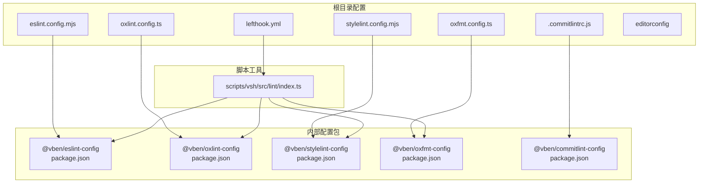
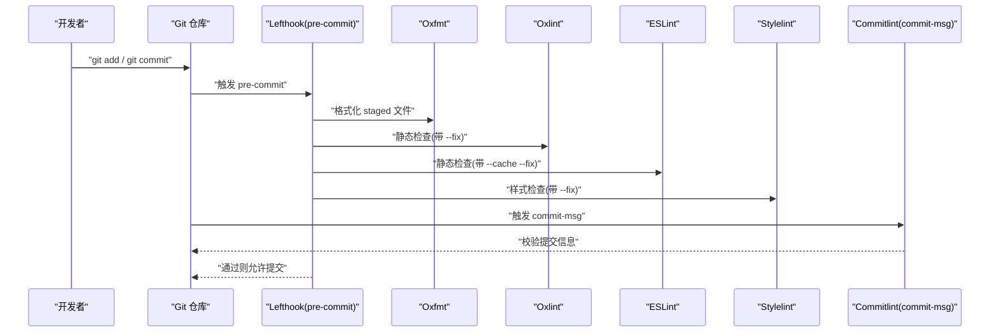
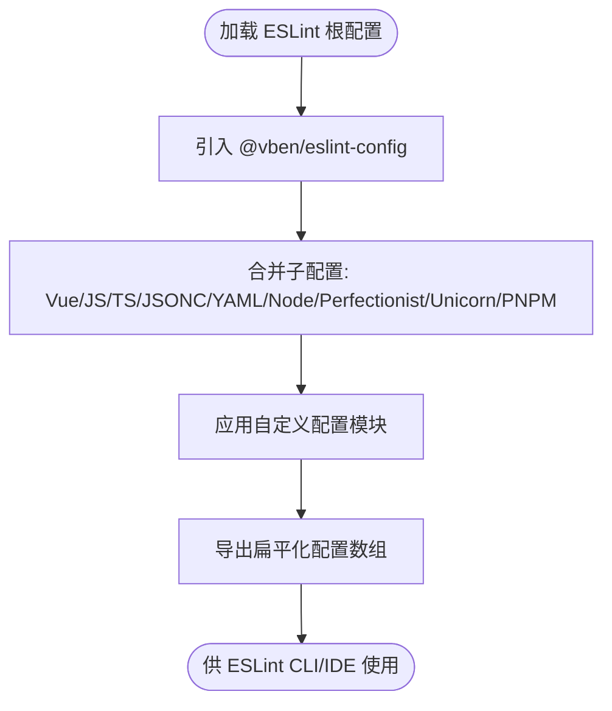
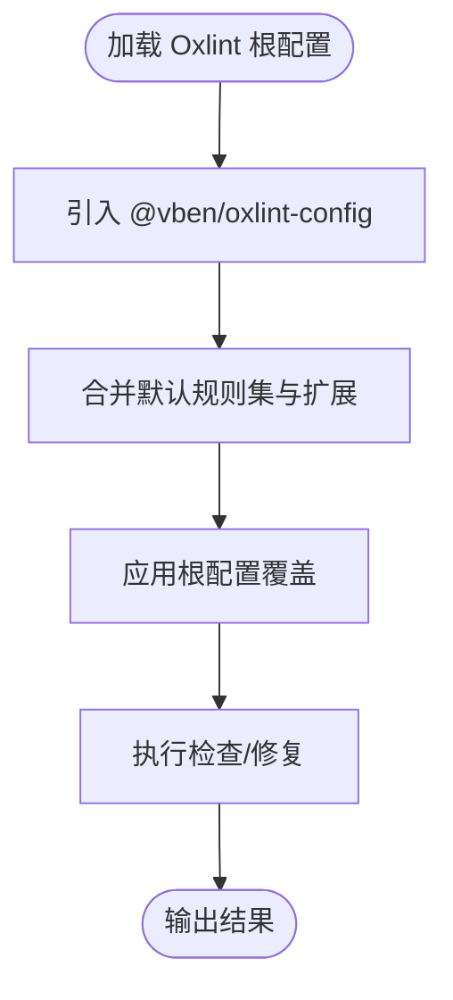
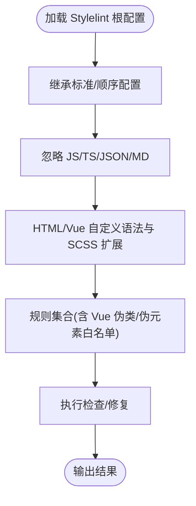
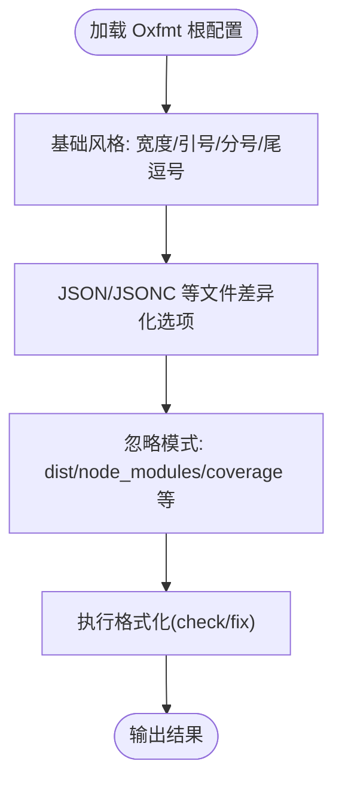
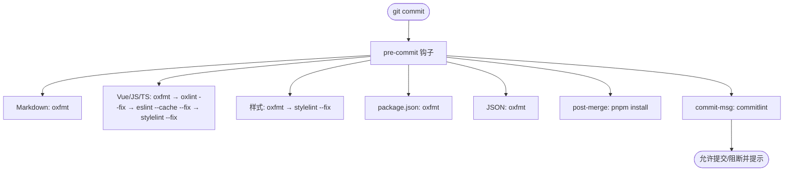
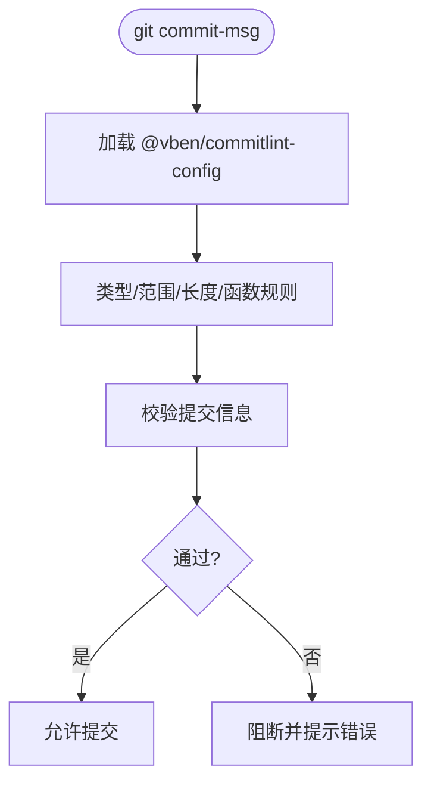
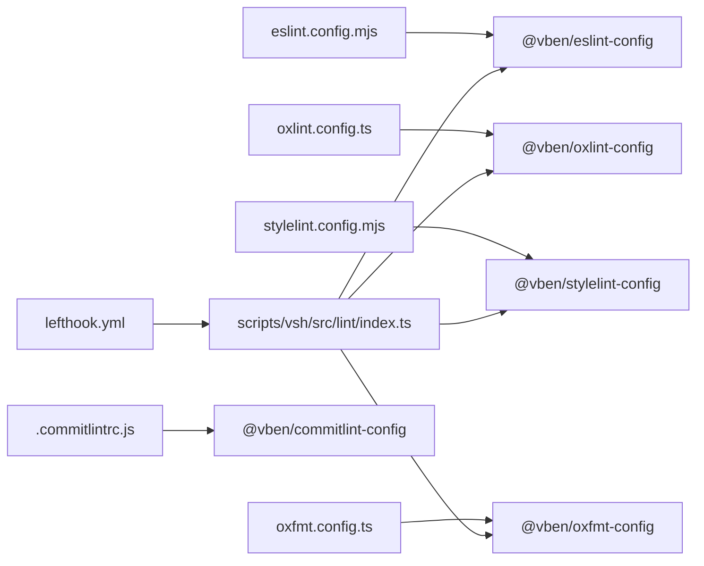

# 代码质量工具

<cite>
**本文引用的文件**
- [eslint.config.mjs](file://eslint.config.mjs)
- [oxlint.config.ts](file://oxlint.config.ts)
- [stylelint.config.mjs](file://stylelint.config.mjs)
- [oxfmt.config.ts](file://oxfmt.config.ts)
- [lefthook.yml](file://lefthook.yml)
- [.commitlintrc.js](file://.commitlintrc.js)
- [.editorconfig](file://.editorconfig)
- [internal/lint-configs/eslint-config/package.json](file://internal/lint-configs/eslint-config/package.json)
- [internal/lint-configs/oxlint-config/package.json](file://internal/lint-configs/oxlint-config/package.json)
- [internal/lint-configs/stylelint-config/package.json](file://internal/lint-configs/stylelint-config/package.json)
- [internal/lint-configs/oxfmt-config/package.json](file://internal/lint-configs/oxfmt-config/package.json)
- [internal/lint-configs/commitlint-config/package.json](file://internal/lint-configs/commitlint-config/package.json)
- [internal/lint-configs/eslint-config/src/index.ts](file://internal/lint-configs/eslint-config/src/index.ts)
- [internal/lint-configs/oxlint-config/src/index.ts](file://internal/lint-configs/oxlint-config/src/index.ts)
- [internal/lint-configs/stylelint-config/index.mjs](file://internal/lint-configs/stylelint-config/index.mjs)
- [internal/lint-configs/oxfmt-config/src/index.ts](file://internal/lint-configs/oxfmt-config/src/index.ts)
- [internal/lint-configs/commitlint-config/index.mjs](file://internal/lint-configs/commitlint-config/index.mjs)
- [scripts/vsh/src/lint/index.ts](file://scripts/vsh/src/lint/index.ts)
</cite>

## 目录

1. [简介](#简介)
2. [项目结构](#项目结构)
3. [核心组件](#核心组件)
4. [架构总览](#架构总览)
5. [详细组件分析](#详细组件分析)
6. [依赖关系分析](#依赖关系分析)
7. [性能与优化](#性能与优化)
8. [故障排查指南](#故障排查指南)
9. [结论](#结论)
10. [附录](#附录)

## 简介

本文件系统性梳理 shiyu-ui 项目的代码质量工具链，覆盖 ESLint、Oxlint、Stylelint、Prettier（通过 Oxfmt）、Git hooks（Lefthook）以及 IDE 集成与自动修复策略，并提供团队协作中的规范统一方案与常见冲突处理建议。目标是帮助开发者快速理解并正确使用这些工具，提升整体代码质量与协作效率。

## 项目结构

项目采用“集中式配置包 + 根目录工具配置”的组织方式：

- 根目录提供各工具的入口配置文件，用于声明使用内部 lint-configs 包提供的默认配置。
- internal/lint-configs 下的子包封装了 ESLint、Oxlint、Stylelint、Oxfmt、Commitlint 的具体规则与扩展，便于复用与升级。
- scripts/vsh 提供命令行工具，支持批量执行 lint/format/check 流程，便于本地与 CI 使用。
- lefthook.yml 定义 Git hooks，确保在提交前进行多语言的格式化与静态检查。

图表来源

- [eslint.config.mjs](file://eslint.config.mjs)
- [oxlint.config.ts](file://oxlint.config.ts)
- [stylelint.config.mjs](file://stylelint.config.mjs)
- [oxfmt.config.ts](file://oxfmt.config.ts)
- [lefthook.yml](file://lefthook.yml)
- [.commitlintrc.js](file://.commitlintrc.js)
- [internal/lint-configs/eslint-config/package.json](file://internal/lint-configs/eslint-config/package.json)
- [internal/lint-configs/oxlint-config/package.json](file://internal/lint-configs/oxlint-config/package.json)
- [internal/lint-configs/stylelint-config/package.json](file://internal/lint-configs/stylelint-config/package.json)
- [internal/lint-configs/oxfmt-config/package.json](file://internal/lint-configs/oxfmt-config/package.json)
- [internal/lint-configs/commitlint-config/package.json](file://internal/lint-configs/commitlint-config/package.json)
- [scripts/vsh/src/lint/index.ts](file://scripts/vsh/src/lint/index.ts)

章节来源

- [eslint.config.mjs](file://eslint.config.mjs)
- [oxlint.config.ts](file://oxlint.config.ts)
- [stylelint.config.mjs](file://stylelint.config.mjs)
- [oxfmt.config.ts](file://oxfmt.config.ts)
- [lefthook.yml](file://lefthook.yml)
- [.commitlintrc.js](file://.commitlintrc.js)
- [.editorconfig](file://.editorconfig)
- [internal/lint-configs/eslint-config/package.json](file://internal/lint-configs/eslint-config/package.json)
- [internal/lint-configs/oxlint-config/package.json](file://internal/lint-configs/oxlint-config/package.json)
- [internal/lint-configs/stylelint-config/package.json](file://internal/lint-configs/stylelint-config/package.json)
- [internal/lint-configs/oxfmt-config/package.json](file://internal/lint-configs/oxfmt-config/package.json)
- [internal/lint-configs/commitlint-config/package.json](file://internal/lint-configs/commitlint-config/package.json)
- [scripts/vsh/src/lint/index.ts](file://scripts/vsh/src/lint/index.ts)

## 核心组件

- ESLint：统一的 JavaScript/TypeScript/Vue/JSON/YAML 等多语言静态检查，根配置通过 @vben/eslint-config 组合多个子配置模块。
- Oxlint：高性能 Rust 实现的 ESLint 兼容规则集，作为 ESLint 的补充或替代，根配置通过 @vben/oxlint-config 组合默认规则。
- Stylelint：CSS/SCSS/HTML/Vue 模板样式检查，基于 @vben/stylelint-config 扩展，内置对 Vue 作用域伪类/元素的适配。
- Oxfmt：统一的格式化器，覆盖 JS/TS/JSON/Markdown 等文本格式，根配置通过 @vben/oxfmt-config 统一风格。
- Lefthook：Git hooks 管道，按文件类型分组执行格式化与检查，保障提交前质量。
- Commitlint：提交信息规范化，基于 @vben/commitlint-config，限定类型、范围与长度。
- EditorConfig：基础编辑器统一换行、缩进、行尾等约定。

章节来源

- [eslint.config.mjs](file://eslint.config.mjs)
- [oxlint.config.ts](file://oxlint.config.ts)
- [stylelint.config.mjs](file://stylelint.config.mjs)
- [oxfmt.config.ts](file://oxfmt.config.ts)
- [lefthook.yml](file://lefthook.yml)
- [.commitlintrc.js](file://.commitlintrc.js)
- [.editorconfig](file://.editorconfig)
- [internal/lint-configs/eslint-config/src/index.ts](file://internal/lint-configs/eslint-config/src/index.ts)
- [internal/lint-configs/oxlint-config/src/index.ts](file://internal/lint-configs/oxlint-config/src/index.ts)
- [internal/lint-configs/stylelint-config/index.mjs](file://internal/lint-configs/stylelint-config/index.mjs)
- [internal/lint-configs/oxfmt-config/src/index.ts](file://internal/lint-configs/oxfmt-config/src/index.ts)
- [internal/lint-configs/commitlint-config/index.mjs](file://internal/lint-configs/commitlint-config/index.mjs)

## 架构总览

下图展示从开发者提交到质量门禁的整体流程，以及各工具之间的调用关系与数据流。

图表来源

- [lefthook.yml](file://lefthook.yml)
- [oxfmt.config.ts](file://oxfmt.config.ts)
- [oxlint.config.ts](file://oxlint.config.ts)
- [eslint.config.mjs](file://eslint.config.mjs)
- [stylelint.config.mjs](file://stylelint.config.mjs)
- [.commitlintrc.js](file://.commitlintrc.js)

## 详细组件分析

### ESLint 配置与使用

- 根配置通过 @vben/eslint-config 聚合多个子配置（Vue、JavaScript、TypeScript、JSONC、YAML、Node、Perfectionist、Unicorn、PNPM 等），最终导出扁平化配置数组。
- 建议在本地与 CI 中均启用缓存与自动修复，以减少重复工作量并保持一致性。
- 如需定制规则，可在 @vben/eslint-config 的自定义配置模块中扩展，避免直接修改根配置文件。

图表来源

- [eslint.config.mjs](file://eslint.config.mjs)
- [internal/lint-configs/eslint-config/src/index.ts](file://internal/lint-configs/eslint-config/src/index.ts)
- [internal/lint-configs/eslint-config/package.json](file://internal/lint-configs/eslint-config/package.json)

章节来源

- [eslint.config.mjs](file://eslint.config.mjs)
- [internal/lint-configs/eslint-config/src/index.ts](file://internal/lint-configs/eslint-config/src/index.ts)
- [internal/lint-configs/eslint-config/package.json](file://internal/lint-configs/eslint-config/package.json)

### Oxlint 配置与使用

- 根配置通过 @vben/oxlint-config 合并默认规则集，并支持扩展与覆盖。
- 建议在 pre-commit 中与 ESLint 并行运行，或在需要时使用 --fix 进行自动修复；CI 可单独运行以获得更快反馈。
- 若发现规则冲突，优先在 @vben/oxlint-config 内部调整默认集，再通过根配置覆盖。

图表来源

- [oxlint.config.ts](file://oxlint.config.ts)
- [internal/lint-configs/oxlint-config/src/index.ts](file://internal/lint-configs/oxlint-config/src/index.ts)
- [internal/lint-configs/oxlint-config/package.json](file://internal/lint-configs/oxlint-config/package.json)

章节来源

- [oxlint.config.ts](file://oxlint.config.ts)
- [internal/lint-configs/oxlint-config/src/index.ts](file://internal/lint-configs/oxlint-config/src/index.ts)
- [internal/lint-configs/oxlint-config/package.json](file://internal/lint-configs/oxlint-config/package.json)

### Stylelint 配置与使用

- 根配置基于 @vben/stylelint-config，扩展标准与顺序插件，并针对 HTML/Vue 模板语法与 SCSS 语法分别配置自定义解析器与忽略文件。
- 针对 Vue 的全局/深度选择器伪类/伪元素做了白名单处理，避免误报。
- 建议在 pre-commit 中与 Oxfmt/Stylelint 协同，先格式化再检查，提高通过率。

图表来源

- [stylelint.config.mjs](file://stylelint.config.mjs)
- [internal/lint-configs/stylelint-config/index.mjs](file://internal/lint-configs/stylelint-config/index.mjs)
- [internal/lint-configs/stylelint-config/package.json](file://internal/lint-configs/stylelint-config/package.json)

章节来源

- [stylelint.config.mjs](file://stylelint.config.mjs)
- [internal/lint-configs/stylelint-config/index.mjs](file://internal/lint-configs/stylelint-config/index.mjs)
- [internal/lint-configs/stylelint-config/package.json](file://internal/lint-configs/stylelint-config/package.json)

### Oxfmt（格式化）配置与使用

- 根配置通过 @vben/oxfmt-config 统一打印宽度、引号、分号、尾逗号等风格，并对 JSON/JSONC 等文件类型做差异化处理。
- 支持忽略模式，便于排除构建产物、锁文件、覆盖率报告等目录与文件。
- 建议在 pre-commit 中优先执行格式化，降低后续检查失败概率。

图表来源

- [oxfmt.config.ts](file://oxfmt.config.ts)
- [internal/lint-configs/oxfmt-config/src/index.ts](file://internal/lint-configs/oxfmt-config/src/index.ts)
- [internal/lint-configs/oxfmt-config/package.json](file://internal/lint-configs/oxfmt-config/package.json)

章节来源

- [oxfmt.config.ts](file://oxfmt.config.ts)
- [internal/lint-configs/oxfmt-config/src/index.ts](file://internal/lint-configs/oxfmt-config/src/index.ts)
- [internal/lint-configs/oxfmt-config/package.json](file://internal/lint-configs/oxfmt-config/package.json)

### Git hooks（Lefthook）配置与使用

- pre-commit 分组执行：
  - Markdown：仅格式化
  - Vue/JS/TS：格式化 → 静态检查 → ESLint 自动修复 → Stylelint 自动修复
  - 样式：格式化 → Stylelint 自动修复
  - package.json：格式化
  - JSON：格式化（排除部分特殊文件）
- post-merge：安装依赖，确保环境一致
- commit-msg：执行 commitlint 校验提交信息

图表来源

- [lefthook.yml](file://lefthook.yml)

章节来源

- [lefthook.yml](file://lefthook.yml)

### 提交信息规范（Commitlint）

- 基于 @vben/commitlint-config，默认遵循 Conventional Commits，限制类型、范围与标题长度。
- 支持函数规则对 scope 进行动态校验，结合当前变更自动推断 scope 候选值。
- 建议在团队内统一类型与范围枚举，减少沟通成本。

图表来源

- [.commitlintrc.js](file://.commitlintrc.js)
- [internal/lint-configs/commitlint-config/index.mjs](file://internal/lint-configs/commitlint-config/index.mjs)
- [internal/lint-configs/commitlint-config/package.json](file://internal/lint-configs/commitlint-config/package.json)

章节来源

- [.commitlintrc.js](file://.commitlintrc.js)
- [internal/lint-configs/commitlint-config/index.mjs](file://internal/lint-configs/commitlint-config/index.mjs)
- [internal/lint-configs/commitlint-config/package.json](file://internal/lint-configs/commitlint-config/package.json)

### IDE 集成与自动修复

- 推荐在 IDE 中启用 ESLint、Stylelint、Oxfmt 的实时检查与自动修复能力，结合 EditorConfig 保证团队统一的编辑器行为。
- 对于 Vue/TS/JS 文件，建议开启缓存与增量检查，减少等待时间。
- 若 IDE 报告与工具链不一致，优先以根配置为准，检查是否正确加载了 @vben/\*-config 包。

章节来源

- [.editorconfig](file://.editorconfig)
- [eslint.config.mjs](file://eslint.config.mjs)
- [stylelint.config.mjs](file://stylelint.config.mjs)
- [oxlint.config.ts](file://oxlint.config.ts)
- [oxfmt.config.ts](file://oxfmt.config.ts)

### 团队协作中的规范统一方案

- 统一使用 @vben/\*-config 包，避免各自维护私有规则，降低维护成本。
- 在 lefthook.yml 中固化检查顺序与修复策略，确保本地与 CI 行为一致。
- 将 EditorConfig 与提交模板纳入版本控制，新成员入职即刻生效。
- 对于新增语言或场景，优先在内部配置包中扩展，再在根配置中引用。

章节来源

- [lefthook.yml](file://lefthook.yml)
- [.editorconfig](file://.editorconfig)
- [internal/lint-configs/eslint-config/package.json](file://internal/lint-configs/eslint-config/package.json)
- [internal/lint-configs/oxlint-config/package.json](file://internal/lint-configs/oxlint-config/package.json)
- [internal/lint-configs/stylelint-config/package.json](file://internal/lint-configs/stylelint-config/package.json)
- [internal/lint-configs/oxfmt-config/package.json](file://internal/lint-configs/oxfmt-config/package.json)
- [internal/lint-configs/commitlint-config/package.json](file://internal/lint-configs/commitlint-config/package.json)

## 依赖关系分析

- 工具链依赖关系清晰：根配置文件仅负责组合内部配置包，内部包再聚合第三方插件与规则。
- Lefthook 与 vsh 脚本共同承担本地批量检查/修复职责，CI 可直接复用相同命令。

图表来源

- [eslint.config.mjs](file://eslint.config.mjs)
- [oxlint.config.ts](file://oxlint.config.ts)
- [stylelint.config.mjs](file://stylelint.config.mjs)
- [oxfmt.config.ts](file://oxfmt.config.ts)
- [.commitlintrc.js](file://.commitlintrc.js)
- [scripts/vsh/src/lint/index.ts](file://scripts/vsh/src/lint/index.ts)
- [internal/lint-configs/eslint-config/package.json](file://internal/lint-configs/eslint-config/package.json)
- [internal/lint-configs/oxlint-config/package.json](file://internal/lint-configs/oxlint-config/package.json)
- [internal/lint-configs/stylelint-config/package.json](file://internal/lint-configs/stylelint-config/package.json)
- [internal/lint-configs/oxfmt-config/package.json](file://internal/lint-configs/oxfmt-config/package.json)
- [internal/lint-configs/commitlint-config/package.json](file://internal/lint-configs/commitlint-config/package.json)

章节来源

- [eslint.config.mjs](file://eslint.config.mjs)
- [oxlint.config.ts](file://oxlint.config.ts)
- [stylelint.config.mjs](file://stylelint.config.mjs)
- [oxfmt.config.ts](file://oxfmt.config.ts)
- [.commitlintrc.js](file://.commitlintrc.js)
- [scripts/vsh/src/lint/index.ts](file://scripts/vsh/src/lint/index.ts)
- [internal/lint-configs/eslint-config/package.json](file://internal/lint-configs/eslint-config/package.json)
- [internal/lint-configs/oxlint-config/package.json](file://internal/lint-configs/oxlint-config/package.json)
- [internal/lint-configs/stylelint-config/package.json](file://internal/lint-configs/stylelint-config/package.json)
- [internal/lint-configs/oxfmt-config/package.json](file://internal/lint-configs/oxfmt-config/package.json)
- [internal/lint-configs/commitlint-config/package.json](file://internal/lint-configs/commitlint-config/package.json)

## 性能与优化

- 缓存与增量检查：ESLint 与 Stylelint 均启用缓存，建议在本地与 CI 中保持一致的缓存策略。
- 并行执行：Lefthook 中对不同类型的文件分组执行，尽量减少串行等待。
- 忽略模式：Oxfmt 的忽略列表应覆盖构建产物、覆盖率、锁文件等，避免无意义扫描。
- 规则粒度：在 @vben/\*-config 内部按需裁剪规则，减少不必要的检查开销。
- IDE 侧：关闭重复检查（如同时启用 ESLint 与 Oxlint），以避免双重计算。

[本节为通用建议，无需特定文件引用]

## 故障排查指南

- 提交被阻断
  - 检查 commit-msg 钩子是否正确执行 commitlint，确认提交信息符合 Conventional Commits。
  - 若 scope 校验失败，参考 @vben/commitlint-config 的动态 scope 推断逻辑。
- 格式化失败
  - 确认 Oxfmt 忽略模式未误伤目标文件；必要时在根配置中追加覆盖。
  - 检查 IDE 是否与根配置一致，避免本地与工具链不一致。
- 静态检查频繁失败
  - 在本地使用 vsh 脚本批量执行检查与修复，定位问题后再提交。
  - 对于 ESLint/Stylelint 的缓存问题，清理缓存后重试。
- 规则冲突
  - 优先在 @vben/\*-config 内部调整默认规则，再通过根配置覆盖。
  - 对于 Oxlint 与 ESLint 的差异，建议统一使用一种工具，或在根配置中收敛冲突规则。

章节来源

- [lefthook.yml](file://lefthook.yml)
- [.commitlintrc.js](file://.commitlintrc.js)
- [internal/lint-configs/commitlint-config/index.mjs](file://internal/lint-configs/commitlint-config/index.mjs)
- [scripts/vsh/src/lint/index.ts](file://scripts/vsh/src/lint/index.ts)

## 结论

通过集中式配置包与 Git hooks 的协同，shiyu-ui 的代码质量工具链实现了“统一规范、自动修复、提交门禁”的闭环。团队只需关注业务开发，其余质量保障由工具链自动完成。建议持续在内部配置包中沉淀最佳实践，并在根配置中最小化定制，以降低维护成本并提升一致性。

[本节为总结性内容，无需特定文件引用]

## 附录

### 常用命令速查

- 本地批量检查与修复：使用 vsh 脚本的 lint 子命令，支持 --format 一键修复。
- 单独执行某类检查：根据文件类型选择对应工具（ESLint/Oxlint/Stylelint/Oxfmt）。
- 清理缓存：删除相关缓存目录后重新执行检查。

章节来源

- [scripts/vsh/src/lint/index.ts](file://scripts/vsh/src/lint/index.ts)
