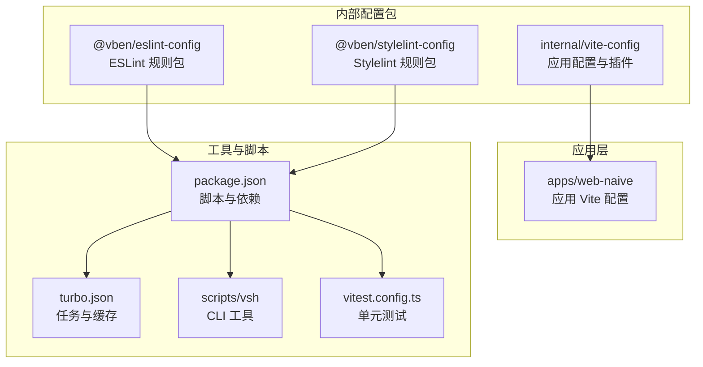
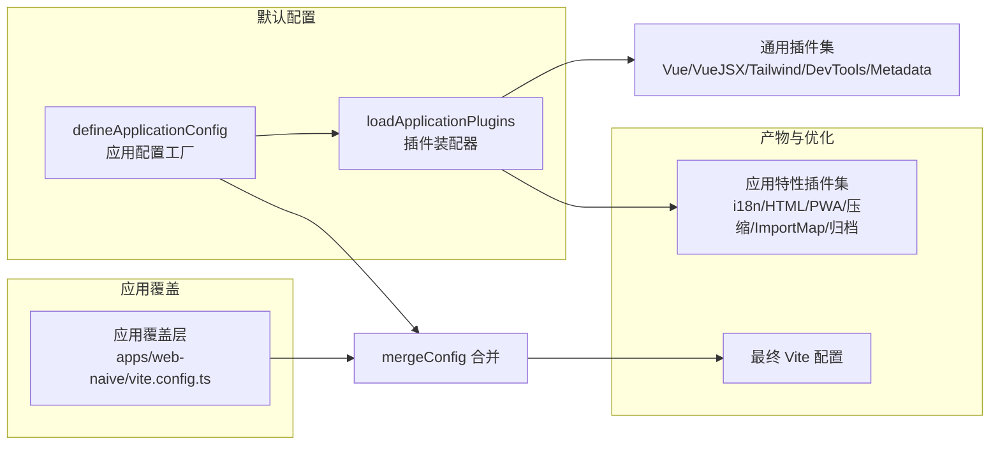
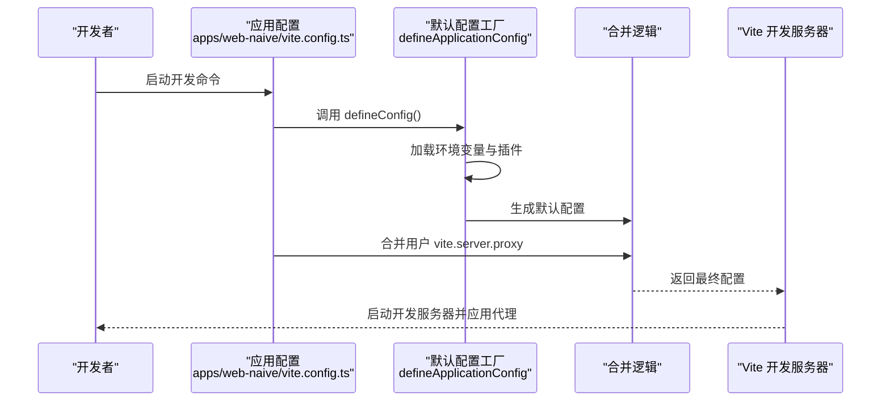
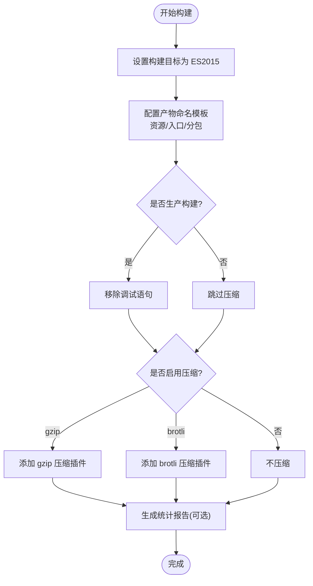
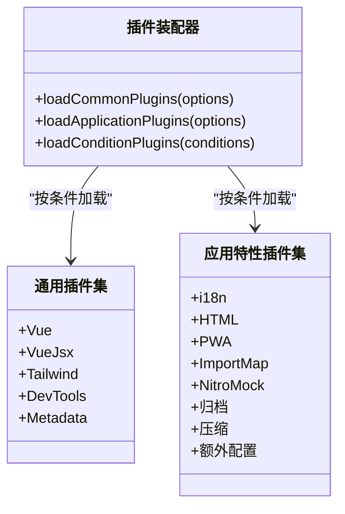
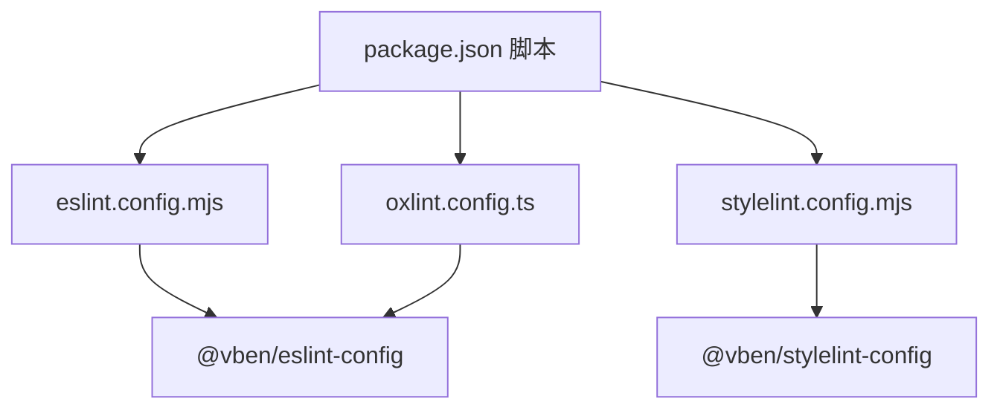
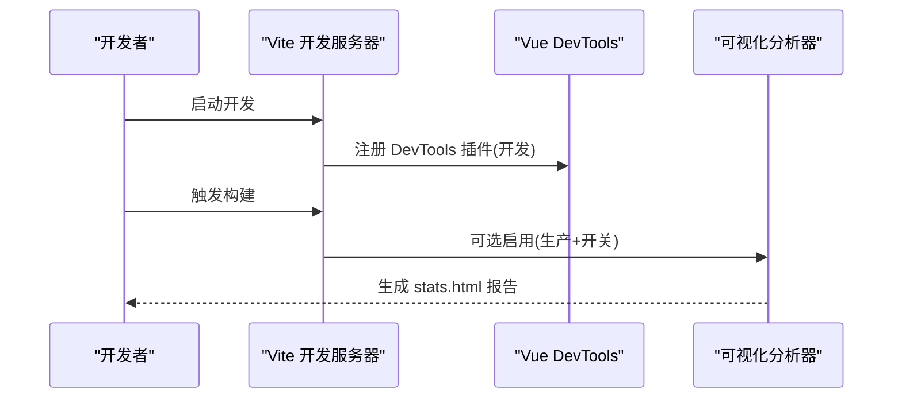
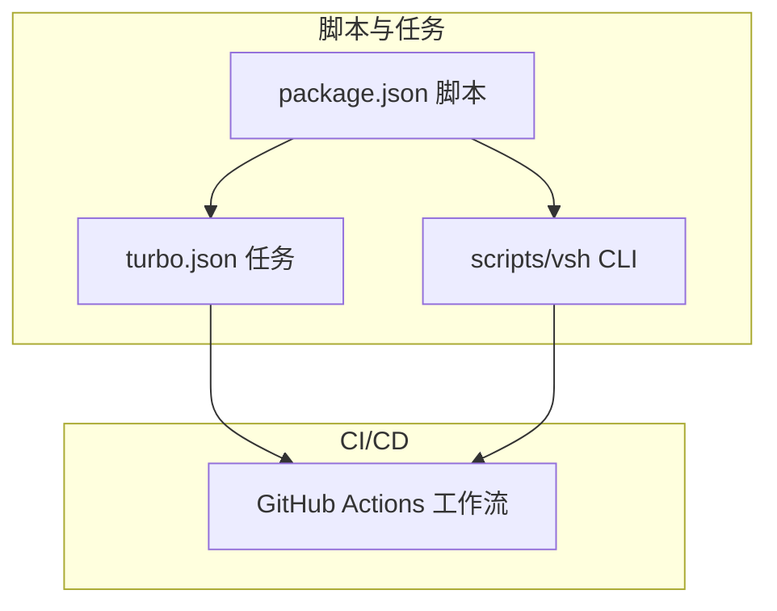
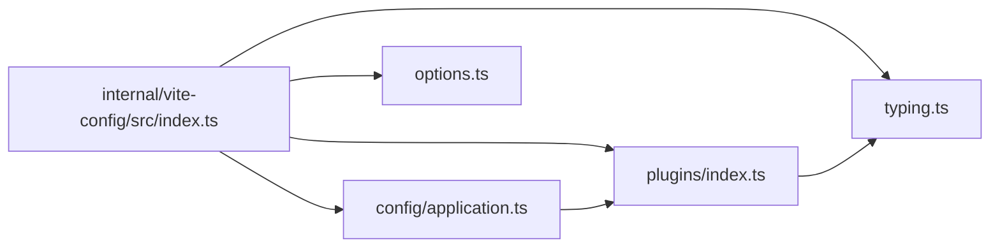

# 开发工具

<cite>
**本文引用的文件**
- [apps/web-naive/vite.config.ts](file://apps/web-naive/vite.config.ts)
- [internal/vite-config/src/index.ts](file://internal/vite-config/src/index.ts)
- [internal/vite-config/src/config/application.ts](file://internal/vite-config/src/config/application.ts)
- [internal/vite-config/src/config/common.ts](file://internal/vite-config/src/config/common.ts)
- [internal/vite-config/src/plugins/index.ts](file://internal/vite-config/src/plugins/index.ts)
- [internal/vite-config/src/options.ts](file://internal/vite-config/src/options.ts)
- [internal/vite-config/src/typing.ts](file://internal/vite-config/src/typing.ts)
- [eslint.config.mjs](file://eslint.config.mjs)
- [oxlint.config.ts](file://oxlint.config.ts)
- [stylelint.config.mjs](file://stylelint.config.mjs)
- [internal/lint-configs/eslint-config/package.json](file://internal/lint-configs/eslint-config/package.json)
- [internal/lint-configs/stylelint-config/package.json](file://internal/lint-configs/stylelint-config/package.json)
- [scripts/vsh/src/index.ts](file://scripts/vsh/src/index.ts)
- [package.json](file://package.json)
- [turbo.json](file://turbo.json)
- [vitest.config.ts](file://vitest.config.ts)
</cite>

## 目录

1. [简介](#简介)
2. [项目结构](#项目结构)
3. [核心组件](#核心组件)
4. [架构总览](#架构总览)
5. [详细组件分析](#详细组件分析)
6. [依赖分析](#依赖分析)
7. [性能考虑](#性能考虑)
8. [故障排查指南](#故障排查指南)
9. [结论](#结论)
10. [附录](#附录)

## 简介

本文件面向 shiyu-ui 项目的开发与调试工具，聚焦于以下方面：

- Vite 构建配置的定制与优化：开发服务器、构建输出、插件体系
- 代码规范工具：ESLint、Stylelint、Prettier 的集成与使用
- 开发调试工具：浏览器调试、Vue DevTools、性能分析
- 构建优化策略：代码分割、资源压缩、缓存与产物组织
- 开发环境配置与性能调优
- 自动化与 CI/CD 集成思路

## 项目结构

本仓库采用 monorepo 结构，核心开发工具由内部可复用的配置包与各应用的覆盖层共同组成：

- 内部配置包：统一提供 Vite 应用配置、插件集合、样式与脚本规范
- 应用层：在各自 vite.config.ts 中以 defineConfig 覆盖默认配置（如开发代理）
- 工具链：通过 package.json 脚本与 turbo 统一调度

**图表来源**

- [internal/vite-config/src/index.ts:1-6](file://internal/vite-config/src/index.ts#L1-L6)
- [apps/web-naive/vite.config.ts:1-21](file://apps/web-naive/vite.config.ts#L1-L21)
- [package.json:27-103](file://package.json#L27-L103)
- [turbo.json:1-49](file://turbo.json#L1-L49)
- [scripts/vsh/src/index.ts:1-78](file://scripts/vsh/src/index.ts#L1-L78)

**章节来源**

- [package.json:1-110](file://package.json#L1-L110)
- [turbo.json:1-49](file://turbo.json#L1-L49)

## 核心组件

- Vite 应用配置与插件体系：通过 defineApplicationConfig 提供统一的开发服务器、构建参数、CSS 处理、插件开关与默认 PWA/ImportMap 等能力，并允许应用层 vite 字段二次合并
- 代码规范工具：ESLint、Stylelint、Prettier 通过各自的配置文件与规则包集成；oxlint 作为快速静态检查工具
- 开发调试工具：Vue DevTools 在开发模式下按需启用；可视化分析器在构建时可选启用
- 构建优化：按需压缩（gzip/brotli）、产物命名策略、预热启动、PWA 清单与图标
- 自动化与 CI/CD：通过 package.json 脚本与 turbo 任务编排，结合 vsh CLI 辅助检查与格式化

**章节来源**

- [internal/vite-config/src/config/application.ts:17-99](file://internal/vite-config/src/config/application.ts#L17-L99)
- [internal/vite-config/src/plugins/index.ts:94-223](file://internal/vite-config/src/plugins/index.ts#L94-L223)
- [eslint.config.mjs:1-4](file://eslint.config.mjs#L1-L4)
- [oxlint.config.ts:1-6](file://oxlint.config.ts#L1-L6)
- [stylelint.config.mjs:1-5](file://stylelint.config.mjs#L1-L5)

## 架构总览

Vite 配置分层设计：内部配置包提供“默认 + 可选功能”的组合拳，应用层仅需少量覆盖即可获得一致的开发体验与构建质量。

**图表来源**

- [internal/vite-config/src/config/application.ts:17-99](file://internal/vite-config/src/config/application.ts#L17-L99)
- [internal/vite-config/src/plugins/index.ts:94-223](file://internal/vite-config/src/plugins/index.ts#L94-L223)
- [apps/web-naive/vite.config.ts:3-20](file://apps/web-naive/vite.config.ts#L3-L20)

## 详细组件分析

### Vite 应用配置与开发服务器

- 默认开发服务器：host 开放访问、端口来自环境、预热关键入口文件，提升首次启动速度
- 应用覆盖：在应用层 vite.server.proxy 中添加 /api 代理到本地 mock 服务，支持 WebSocket
- 环境变量：通过 loadAndConvertEnv 注入基础路径与端口等

**图表来源**

- [apps/web-naive/vite.config.ts:3-20](file://apps/web-naive/vite.config.ts#L3-L20)
- [internal/vite-config/src/config/application.ts:17-99](file://internal/vite-config/src/config/application.ts#L17-L99)

**章节来源**

- [apps/web-naive/vite.config.ts:1-21](file://apps/web-naive/vite.config.ts#L1-L21)
- [internal/vite-config/src/config/application.ts:77-91](file://internal/vite-config/src/config/application.ts#L77-L91)

### 构建优化与产物组织

- 产物命名：资源、入口、分包分别设置命名模板，便于缓存与追踪
- 压缩：按需启用 gzip/brotli 压缩，保留源码映射关闭以减少体积
- 目标：构建目标为 ES2015，兼顾现代浏览器与兼容性
- 预热：warmup 预热关键入口，缩短冷启动时间

**图表来源**

- [internal/vite-config/src/config/application.ts:60-76](file://internal/vite-config/src/config/application.ts#L60-L76)

**章节来源**

- [internal/vite-config/src/config/application.ts:60-76](file://internal/vite-config/src/config/application.ts#L60-L76)
- [internal/vite-config/src/config/common.ts:3-11](file://internal/vite-config/src/config/common.ts#L3-L11)

### 插件系统与可选功能

- 通用插件：Vue、Vue JSX、Tailwind、I18n（按需）、DevTools（开发）、元数据注入（按需）
- 应用特性：HTML 压缩、PWA（清单与图标）、ImportMap CDN、Nitro Mock、归档、压缩、额外配置抽取
- 条件加载：通过 ConditionPlugin 与 loadConditionPlugins 实现按环境与开关启用

**图表来源**

- [internal/vite-config/src/plugins/index.ts:50-223](file://internal/vite-config/src/plugins/index.ts#L50-L223)

**章节来源**

- [internal/vite-config/src/plugins/index.ts:94-223](file://internal/vite-config/src/plugins/index.ts#L94-L223)
- [internal/vite-config/src/options.ts:7-43](file://internal/vite-config/src/options.ts#L7-L43)
- [internal/vite-config/src/typing.ts:193-302](file://internal/vite-config/src/typing.ts#L193-L302)

### 代码规范工具集成

- ESLint：通过 @vben/eslint-config 提供统一规则，根配置文件导出默认配置
- Stylelint：扩展 @vben/stylelint-config，保持样式规范一致性
- Prettier：项目未直接提供独立配置文件，但可通过规则包与编辑器集成实现格式化
- oxlint：作为快速静态检查工具，配合 ESLint 提升检查效率

**图表来源**

- [eslint.config.mjs:1-4](file://eslint.config.mjs#L1-L4)
- [oxlint.config.ts:1-6](file://oxlint.config.ts#L1-L6)
- [stylelint.config.mjs:1-5](file://stylelint.config.mjs#L1-L5)
- [internal/lint-configs/eslint-config/package.json:29-46](file://internal/lint-configs/eslint-config/package.json#L29-L46)
- [internal/lint-configs/stylelint-config/package.json:25-41](file://internal/lint-configs/stylelint-config/package.json#L25-L41)
- [package.json:27-103](file://package.json#L27-L103)

**章节来源**

- [eslint.config.mjs:1-4](file://eslint.config.mjs#L1-L4)
- [oxlint.config.ts:1-6](file://oxlint.config.ts#L1-L6)
- [stylelint.config.mjs:1-5](file://stylelint.config.mjs#L1-L5)
- [internal/lint-configs/eslint-config/package.json:29-46](file://internal/lint-configs/eslint-config/package.json#L29-L46)
- [internal/lint-configs/stylelint-config/package.json:25-41](file://internal/lint-configs/stylelint-config/package.json#L25-L41)

### 开发调试工具

- 浏览器调试：默认启用 Vue DevTools（开发模式），便于组件与状态调试
- 性能分析：构建时可选启用可视化分析器，生成依赖大小统计报告
- 单元测试：Vitest 配置使用 happy-dom 环境，排除 e2e 与配置文件目录

**图表来源**

- [internal/vite-config/src/plugins/index.ts:70-87](file://internal/vite-config/src/plugins/index.ts#L70-L87)
- [internal/vite-config/src/plugins/index.ts:184-199](file://internal/vite-config/src/plugins/index.ts#L184-L199)
- [vitest.config.ts:1-29](file://vitest.config.ts#L1-L29)

**章节来源**

- [internal/vite-config/src/plugins/index.ts:70-87](file://internal/vite-config/src/plugins/index.ts#L70-L87)
- [internal/vite-config/src/plugins/index.ts:184-199](file://internal/vite-config/src/plugins/index.ts#L184-L199)
- [vitest.config.ts:1-29](file://vitest.config.ts#L1-L29)

### 自动化与 CI/CD 集成

- 脚本编排：通过 package.json 脚本统一入口，如 dev、build、lint、check 等
- 任务编排：turbo.json 定义任务依赖、缓存与输出，支持多应用并行构建
- CLI 辅助：vsh 提供 lint、publint、循环依赖检测、依赖未使用检测等子命令

**图表来源**

- [package.json:27-103](file://package.json#L27-L103)
- [turbo.json:15-48](file://turbo.json#L15-L48)
- [scripts/vsh/src/index.ts:24-78](file://scripts/vsh/src/index.ts#L24-L78)

**章节来源**

- [package.json:27-103](file://package.json#L27-L103)
- [turbo.json:1-49](file://turbo.json#L1-L49)
- [scripts/vsh/src/index.ts:1-78](file://scripts/vsh/src/index.ts#L1-L78)

## 依赖分析

- 内部配置包导出：应用配置、选项、插件与类型，供各应用层按需使用
- 应用层依赖：通过 defineConfig 引入内部配置并覆盖局部配置
- 工具链依赖：ESLint/Stylelint/Oxlint/Prettier 规则包与 CLI 工具

**图表来源**

- [internal/vite-config/src/index.ts:1-6](file://internal/vite-config/src/index.ts#L1-L6)
- [internal/vite-config/src/config/application.ts:1-16](file://internal/vite-config/src/config/application.ts#L1-L16)
- [internal/vite-config/src/plugins/index.ts:1-31](file://internal/vite-config/src/plugins/index.ts#L1-L31)
- [internal/vite-config/src/options.ts:1-46](file://internal/vite-config/src/options.ts#L1-L46)
- [internal/vite-config/src/typing.ts:1-360](file://internal/vite-config/src/typing.ts#L1-L360)

**章节来源**

- [internal/vite-config/src/index.ts:1-6](file://internal/vite-config/src/index.ts#L1-L6)
- [internal/vite-config/src/typing.ts:318-342](file://internal/vite-config/src/typing.ts#L318-L342)

## 性能考虑

- 构建目标与产物命名：ES2015 与清晰的命名模板有利于缓存命中与 CDN 分发
- 压缩策略：按需启用 gzip/brotli，平衡体积与 CPU 开销
- 预热启动：warmup 预热关键入口，显著降低首屏等待
- 源码映射：默认关闭，减少产物体积；必要时可在开发阶段开启
- 依赖分析：可视化分析器帮助识别大体积依赖，指导拆分与替换

[本节为通用性能建议，无需具体文件分析]

## 故障排查指南

- 开发代理无效
  - 检查应用层 vite.server.proxy 配置是否正确，确认 target 与重写规则
  - 确认本地 mock 服务已启动且端口正确
- DevTools 未出现
  - 确认 isBuild 为 false 且 devtools 开关为 true
  - 确认浏览器已安装 Vue DevTools 并启用
- 构建体积过大
  - 使用可视化分析器查看依赖占比，优先拆分第三方库或替换更小替代品
  - 检查是否误启压缩或未启用压缩
- 单测失败或环境异常
  - 检查 vitest 环境配置与排除列表，确保测试环境与 DOM 设置正确

**章节来源**

- [apps/web-naive/vite.config.ts:7-17](file://apps/web-naive/vite.config.ts#L7-L17)
- [internal/vite-config/src/plugins/index.ts:70-87](file://internal/vite-config/src/plugins/index.ts#L70-L87)
- [internal/vite-config/src/plugins/index.ts:184-199](file://internal/vite-config/src/plugins/index.ts#L184-L199)
- [vitest.config.ts:5-28](file://vitest.config.ts#L5-L28)

## 结论

本项目通过内部可复用的 Vite 配置包与应用层轻量覆盖，实现了统一的开发体验与高质量的构建产物。配合完善的代码规范工具与自动化脚本，开发者可以高效地进行开发、调试与发布。建议在团队内统一遵循这些工具链约定，并根据业务场景按需启用插件与优化策略。

[本节为总结性内容，无需具体文件分析]

## 附录

### 开发环境配置与性能调优建议

- 环境变量与端口：通过 loadAndConvertEnv 注入基础路径与端口，避免硬编码
- 预热策略：根据实际入口文件调整 warmup.clientFiles，提升冷启动速度
- 压缩策略：在生产构建中启用 gzip/brotli，结合 CDN 缓存策略
- PWA 与 ImportMap：按需启用 PWA 清单与图标，ImportMap CDN 受网络影响较大，建议谨慎启用

**章节来源**

- [internal/vite-config/src/config/application.ts:82-89](file://internal/vite-config/src/config/application.ts#L82-L89)
- [internal/vite-config/src/options.ts:7-43](file://internal/vite-config/src/options.ts#L7-L43)

### 自动化与 CI/CD 集成要点

- 使用 package.json 脚本统一入口，结合 turbo.json 任务编排
- 在 CI 中执行 lint、check、build、test 等任务，确保质量门禁
- 使用 vsh CLI 进行循环依赖与未使用依赖检测，保障包健康度

**章节来源**

- [package.json:27-103](file://package.json#L27-L103)
- [turbo.json:15-48](file://turbo.json#L15-L48)
- [scripts/vsh/src/index.ts:24-78](file://scripts/vsh/src/index.ts#L24-L78)
