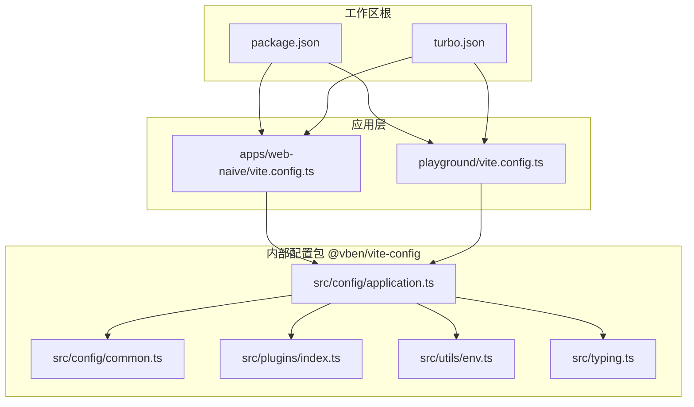
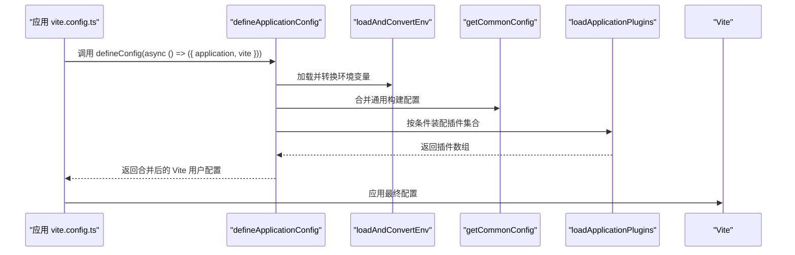
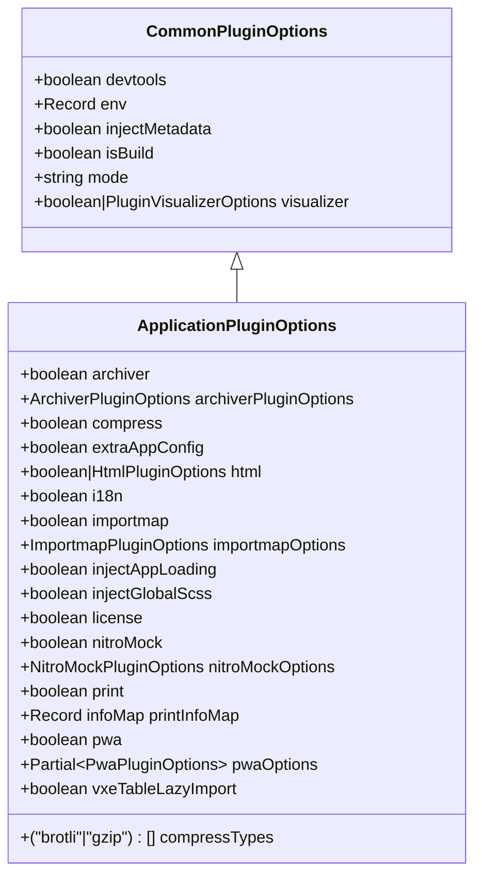
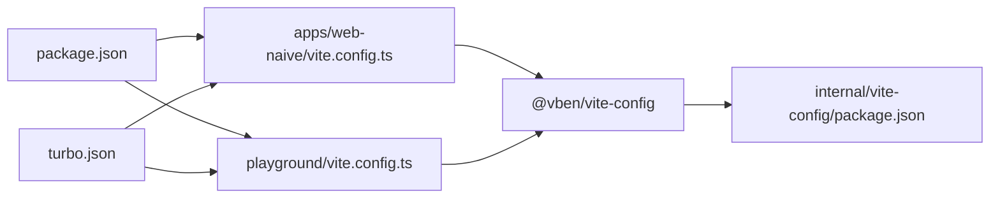

# 构建配置

<cite>
**本文引用的文件**
- [apps/web-naive/vite.config.ts](file://apps/web-naive/vite.config.ts)
- [playground/vite.config.ts](file://playground/vite.config.ts)
- [internal/vite-config/src/index.ts](file://internal/vite-config/src/index.ts)
- [internal/vite-config/package.json](file://internal/vite-config/package.json)
- [internal/vite-config/src/config/application.ts](file://internal/vite-config/src/config/application.ts)
- [internal/vite-config/src/config/common.ts](file://internal/vite-config/src/config/common.ts)
- [internal/vite-config/src/plugins/index.ts](file://internal/vite-config/src/plugins/index.ts)
- [internal/vite-config/src/plugins/inject-app-loading/index.ts](file://internal/vite-config/src/plugins/inject-app-loading/index.ts)
- [internal/vite-config/src/plugins/html.ts](file://internal/vite-config/src/plugins/html.ts)
- [internal/vite-config/src/utils/env.ts](file://internal/vite-config/src/utils/env.ts)
- [internal/vite-config/src/typing.ts](file://internal/vite-config/src/typing.ts)
- [package.json](file://package.json)
- [turbo.json](file://turbo.json)
</cite>

## 目录

1. [简介](#简介)
2. [项目结构](#项目结构)
3. [核心组件](#核心组件)
4. [架构总览](#架构总览)
5. [详细组件分析](#详细组件分析)
6. [依赖分析](#依赖分析)
7. [性能考虑](#性能考虑)
8. [故障排除指南](#故障排除指南)
9. [结论](#结论)
10. [附录](#附录)

## 简介

本文件面向 shiyu-ui 项目的构建配置，系统化阐述 Vite 配置的定制与优化，覆盖开发服务器、代理与热重载、构建优化（代码分割、资源压缩、缓存与打包）、插件体系（内置与第三方）、环境差异与最佳实践，并提供性能调优与故障排除建议。文档以仓库中的实际实现为依据，避免凭空假设，所有技术细节均来自源码。

## 项目结构

- 顶层通过 monorepo 工作区管理多个应用与内部工具包。应用层（如 web-naive、playground）使用统一的 @vben/vite-config 提供的 defineConfig 宏来生成 Vite 配置。
- @vben/vite-config 内部封装了通用配置、插件加载器、环境变量转换等能力，形成可复用的“应用级” Vite 配置工厂。
- Turbo 作为任务编排工具，统一管理构建、预览、分析等任务的依赖与输出。

图表来源

- [apps/web-naive/vite.config.ts:1-21](file://apps/web-naive/vite.config.ts#L1-L21)
- [playground/vite.config.ts:1-21](file://playground/vite.config.ts#L1-L21)
- [internal/vite-config/src/config/application.ts:17-99](file://internal/vite-config/src/config/application.ts#L17-L99)
- [internal/vite-config/src/config/common.ts:1-14](file://internal/vite-config/src/config/common.ts#L1-L14)
- [internal/vite-config/src/plugins/index.ts:94-223](file://internal/vite-config/src/plugins/index.ts#L94-L223)
- [internal/vite-config/src/utils/env.ts:66-108](file://internal/vite-config/src/utils/env.ts#L66-L108)
- [package.json:27-67](file://package.json#L27-L67)
- [turbo.json:15-48](file://turbo.json#L15-L48)

章节来源

- [apps/web-naive/vite.config.ts:1-21](file://apps/web-naive/vite.config.ts#L1-L21)
- [playground/vite.config.ts:1-21](file://playground/vite.config.ts#L1-L21)
- [internal/vite-config/src/index.ts:1-6](file://internal/vite-config/src/index.ts#L1-L6)
- [internal/vite-config/package.json:1-61](file://internal/vite-config/package.json#L1-L61)
- [package.json:27-67](file://package.json#L27-L67)
- [turbo.json:15-48](file://turbo.json#L15-L48)

## 核心组件

- 应用配置工厂：defineApplicationConfig 负责加载环境变量、合并通用配置、按条件装配插件、生成最终 Vite 用户配置。
- 插件系统：集中于 plugins/index.ts，按“通用插件 + 应用插件”的分层设计，支持 i18n、PWA、压缩、HTML 压缩、ImportMap、Nitro Mock、注入加载动画、许可证等。
- 环境变量适配：loadAndConvertEnv 将 .env.\* 模式文件中以 VITE\_ 前缀的变量转换为配置项，支持布尔、字符串、数字解析与默认值。
- 通用构建参数：common.ts 统一设置 chunkSizeWarningLimit、是否生成 sourcemap、是否报告压缩体积等。
- 应用层入口：apps/web-naive 与 playground 的 vite.config.ts 通过 defineConfig 包装，仅注入少量应用级 vite 配置（如 server.proxy），其余由 @vben/vite-config 统一处理。

章节来源

- [internal/vite-config/src/config/application.ts:17-99](file://internal/vite-config/src/config/application.ts#L17-L99)
- [internal/vite-config/src/plugins/index.ts:94-223](file://internal/vite-config/src/plugins/index.ts#L94-L223)
- [internal/vite-config/src/utils/env.ts:66-108](file://internal/vite-config/src/utils/env.ts#L66-L108)
- [internal/vite-config/src/config/common.ts:1-14](file://internal/vite-config/src/config/common.ts#L1-L14)
- [apps/web-naive/vite.config.ts:3-20](file://apps/web-naive/vite.config.ts#L3-L20)
- [playground/vite.config.ts:3-20](file://playground/vite.config.ts#L3-L20)

## 架构总览

下图展示应用层如何通过 defineConfig 与 @vben/vite-config 的关系，以及关键配置与插件的装配流程。

图表来源

- [apps/web-naive/vite.config.ts:3-20](file://apps/web-naive/vite.config.ts#L3-L20)
- [internal/vite-config/src/config/application.ts:17-99](file://internal/vite-config/src/config/application.ts#L17-L99)
- [internal/vite-config/src/utils/env.ts:66-108](file://internal/vite-config/src/utils/env.ts#L66-L108)
- [internal/vite-config/src/config/common.ts:1-14](file://internal/vite-config/src/config/common.ts#L1-L14)
- [internal/vite-config/src/plugins/index.ts:94-223](file://internal/vite-config/src/plugins/index.ts#L94-L223)

## 详细组件分析

### 开发服务器与代理

- 应用层通过 server.proxy 注入 API 代理规则，将 /api 请求转发至本地后端或 Mock 服务，并启用 WebSocket 支持。
- 代理规则包含 changeOrigin、rewrite、target 与 ws 字段，确保跨域与路径重写符合预期。
- 该配置在两个应用中保持一致，体现统一的开发体验。

章节来源

- [apps/web-naive/vite.config.ts:6-18](file://apps/web-naive/vite.config.ts#L6-L18)
- [playground/vite.config.ts:6-18](file://playground/vite.config.ts#L6-L18)

### 热重载与开发体验

- defineApplicationConfig 中启用 server.host 与 port，并配置 warmup.clientFiles，加速首次启动时的资源预热。
- 在非构建模式下，自动启用 vite-plugin-vue-devtools，提升调试效率。
- transformIndexHtml 钩子用于在开发阶段注入加载动画与主题缓存逻辑，改善首屏体验。

章节来源

- [internal/vite-config/src/config/application.ts:79-91](file://internal/vite-config/src/config/application.ts#L79-L91)
- [internal/vite-config/src/plugins/index.ts:70-73](file://internal/vite-config/src/plugins/index.ts#L70-L73)
- [internal/vite-config/src/plugins/inject-app-loading/index.ts:14-49](file://internal/vite-config/src/plugins/inject-app-loading/index.ts#L14-L49)

### 构建优化策略

- 代码分割与命名规范：通过 rolldownOptions.output 配置 assetFileNames、chunkFileNames、entryFileNames，便于缓存与定位。
- 生产压缩：构建时启用压缩（可选 gzip/brotli），并在构建完成后生成可视化分析报告（可选）。
- 源码映射与体积告警：默认关闭 sourcemap，设置较大的 chunkSizeWarningLimit，降低体积告警噪音。
- 目标与最小化：target 设为 es2015，生产构建启用 dropDebugger 压缩选项。

章节来源

- [internal/vite-config/src/config/application.ts:60-76](file://internal/vite-config/src/config/application.ts#L60-L76)
- [internal/vite-config/src/config/common.ts:4-11](file://internal/vite-config/src/config/common.ts#L4-L11)
- [internal/vite-config/src/plugins/index.ts:184-199](file://internal/vite-config/src/plugins/index.ts#L184-L199)

### 插件系统与扩展点

- 通用插件层：始终启用 @vitejs/plugin-vue、@vitejs/plugin-vue-jsx、@tailwindcss/vite 与 vite-tailwind-reference，确保框架与样式基础设施就绪。
- 条件插件层：根据 isBuild、devtools、injectMetadata、visualizer 等开关动态启用对应插件。
- 应用插件层：i18n、print、vxeTableLazyImport、nitroMock、injectAppLoading、license、pwa、compress、html、importmap、archiver 等，均可通过 application 或 env 控制。
- 插件类型与选项：通过 typing.ts 明确定义插件选项接口，确保类型安全与可维护性。

图表来源

- [internal/vite-config/src/typing.ts:155-187](file://internal/vite-config/src/typing.ts#L155-L187)
- [internal/vite-config/src/typing.ts:193-289](file://internal/vite-config/src/typing.ts#L193-L289)

章节来源

- [internal/vite-config/src/plugins/index.ts:50-89](file://internal/vite-config/src/plugins/index.ts#L50-L89)
- [internal/vite-config/src/plugins/index.ts:94-223](file://internal/vite-config/src/plugins/index.ts#L94-L223)
- [internal/vite-config/src/typing.ts:155-289](file://internal/vite-config/src/typing.ts#L155-L289)

### HTML 压缩与注入

- HTML 压缩：通过 viteHtmlPlugin 对最终 HTML 进行压缩（折叠空白、移除注释、压缩内联 JS/CSS 等），仅在构建阶段生效。
- 加载动画注入：viteInjectAppLoadingPlugin 在 transformIndexHtml 阶段向 body 注入加载模板与主题缓存脚本，保证暗色主题刷新一致性。

章节来源

- [internal/vite-config/src/plugins/html.ts:17-36](file://internal/vite-config/src/plugins/html.ts#L17-L36)
- [internal/vite-config/src/plugins/inject-app-loading/index.ts:14-49](file://internal/vite-config/src/plugins/inject-app-loading/index.ts#L14-L49)

### 环境变量与模式差异

- 环境变量加载：loadAndConvertEnv 支持 .env、.env.local、.env.{mode}、.env.{mode}.local 多文件叠加，仅提取以 VITE\_ 前缀的键。
- 模式推断：从 npm lifecycle script 中解析 --mode 参数，决定加载的 .env.\* 文件集。
- 关键开关：VITE_APP_TITLE、VITE_BASE、VITE_PORT、VITE_COMPRESS（逗号分隔）、VITE_DEVTOOLS、VITE_INJECT_APP_LOADING、VITE_NITRO_MOCK、VITE_PWA、VITE_VISUALIZER 等影响最终配置。

章节来源

- [internal/vite-config/src/utils/env.ts:21-64](file://internal/vite-config/src/utils/env.ts#L21-L64)
- [internal/vite-config/src/utils/env.ts:66-108](file://internal/vite-config/src/utils/env.ts#L66-L108)

### PWA、ImportMap、Nitro Mock 等高级特性

- PWA：默认启用，提供 manifest 与 Workbox 配置，支持 standalone 显示模式与主题色。
- ImportMap：默认提供 esm.sh 供应商与若干核心依赖的 CDN 映射，当前未在构建阶段启用（保留扩展空间）。
- Nitro Mock：开发阶段可启用，提供本地 Mock 服务，便于前后端并行开发。

章节来源

- [internal/vite-config/src/plugins/index.ts:167-182](file://internal/vite-config/src/plugins/index.ts#L167-L182)
- [internal/vite-config/src/options.ts:28-46](file://internal/vite-config/src/options.ts#L28-L46)
- [internal/vite-config/src/plugins/index.ts:152-156](file://internal/vite-config/src/plugins/index.ts#L152-L156)

## 依赖分析

- 应用层依赖 @vben/vite-config，后者导出 defineConfig、插件与类型，形成统一的配置入口。
- @vben/vite-config 依赖大量 Vite 生态插件与工具库，涵盖 PWA、压缩、可视化、DTS、Tailwind、Vue DevTools 等。
- 工作区通过 package.json 与 turbo.json 统一管理脚本与任务缓存/输出，确保构建一致性与可重复性。

图表来源

- [apps/web-naive/vite.config.ts:1-21](file://apps/web-naive/vite.config.ts#L1-L21)
- [playground/vite.config.ts:1-21](file://playground/vite.config.ts#L1-L21)
- [internal/vite-config/package.json:23-60](file://internal/vite-config/package.json#L23-L60)
- [package.json:27-67](file://package.json#L27-L67)
- [turbo.json:15-48](file://turbo.json#L15-L48)

章节来源

- [internal/vite-config/package.json:23-60](file://internal/vite-config/package.json#L23-L60)
- [package.json:27-67](file://package.json#L27-L67)
- [turbo.json:15-48](file://turbo.json#L15-L48)

## 性能考虑

- 代码分割与缓存：通过 rolldownOptions.output 的命名策略，结合浏览器缓存与 CDN，最大化长效缓存收益。
- 压缩策略：按需启用 gzip/brotli，优先选择更优压缩比；在构建阶段生成可视化报告，识别大体积依赖与重复模块。
- 预热与开发体验：warmup.clientFiles 预热关键入口与引导文件，缩短冷启动时间。
- 源码映射：生产关闭 sourcemap，减少产物体积与解析开销；必要时在 CI 中保留独立映射文件。
- 体积监控：合理设置 chunkSizeWarningLimit，避免噪声告警干扰；对异常体积模块进行专项优化。

## 故障排除指南

- 代理无效或跨域失败
  - 检查 server.proxy.target 与 rewrite 规则是否匹配后端路径。
  - 确认 changeOrigin 与 ws 设置正确。
- 环境变量未生效
  - 确认变量以 VITE\_ 前缀命名，且位于正确的 .env.\* 文件中。
  - 检查 --mode 参数与 .env.{mode} 文件是否匹配。
- 插件未加载
  - 确认 application 或 env 对应开关已启用（如 compress、pwa、i18n 等）。
  - 检查 isBuild 与 devtools 等条件是否满足插件启用条件。
- 构建体积过大
  - 使用可视化报告定位大模块；评估拆分策略与懒加载。
  - 检查是否误启 sourcemap 或未启用压缩。
- 首屏加载慢
  - 检查 warmup.clientFiles 是否包含关键入口。
  - 确认注入的加载动画与主题缓存脚本未被移除。

章节来源

- [apps/web-naive/vite.config.ts:6-18](file://apps/web-naive/vite.config.ts#L6-L18)
- [internal/vite-config/src/utils/env.ts:66-108](file://internal/vite-config/src/utils/env.ts#L66-L108)
- [internal/vite-config/src/plugins/index.ts:94-223](file://internal/vite-config/src/plugins/index.ts#L94-L223)
- [internal/vite-config/src/config/application.ts:60-76](file://internal/vite-config/src/config/application.ts#L60-L76)

## 结论

shiyu-ui 的构建配置以 @vben/vite-config 为核心，实现了“统一工厂 + 条件插件 + 环境变量适配”的工程化方案。通过合理的开发服务器与代理、构建优化策略、完善的插件体系与环境差异处理，既保证了开发效率，也兼顾了生产性能与可维护性。建议在团队内统一遵循该配置范式，并结合业务场景按需启用或调整插件与优化策略。

## 附录

- 实际配置示例与路径
  - 应用层 Vite 配置入口：[apps/web-naive/vite.config.ts:1-21](file://apps/web-naive/vite.config.ts#L1-L21)、[playground/vite.config.ts:1-21](file://playground/vite.config.ts#L1-L21)
  - 应用配置工厂与合并逻辑：[internal/vite-config/src/config/application.ts:17-99](file://internal/vite-config/src/config/application.ts#L17-L99)
  - 通用构建配置：[internal/vite-config/src/config/common.ts:1-14](file://internal/vite-config/src/config/common.ts#L1-L14)
  - 插件装配与类型定义：[internal/vite-config/src/plugins/index.ts:94-223](file://internal/vite-config/src/plugins/index.ts#L94-L223)、[internal/vite-config/src/typing.ts:155-289](file://internal/vite-config/src/typing.ts#L155-L289)
  - 环境变量加载与转换：[internal/vite-config/src/utils/env.ts:66-108](file://internal/vite-config/src/utils/env.ts#L66-L108)
  - 工作区与任务编排：[package.json:27-67](file://package.json#L27-L67)、[turbo.json:15-48](file://turbo.json#L15-L48)
