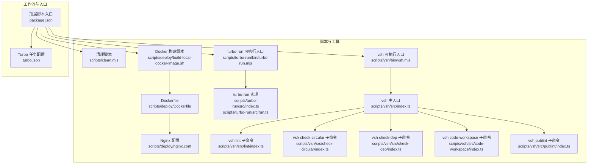
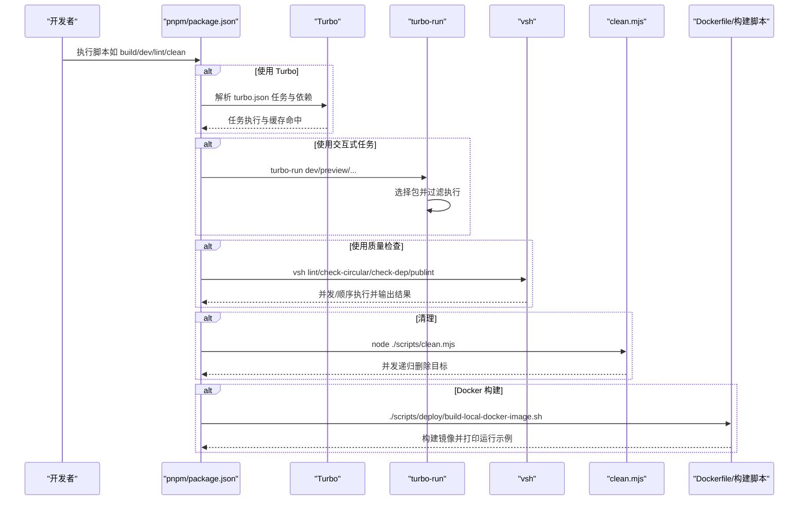
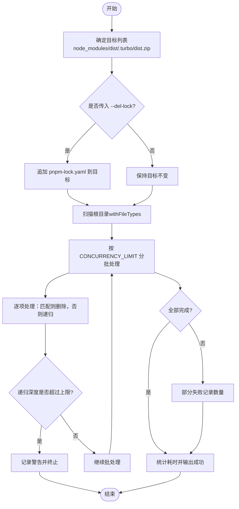
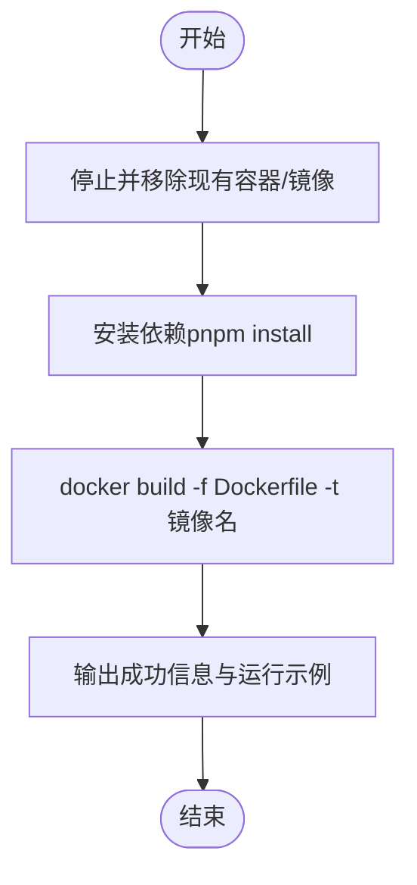
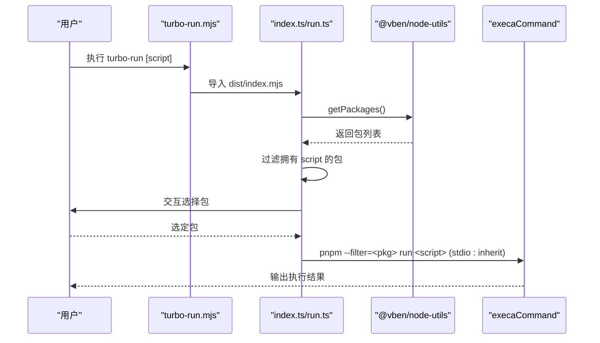
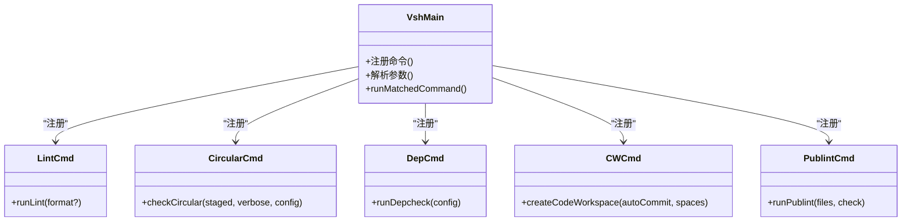
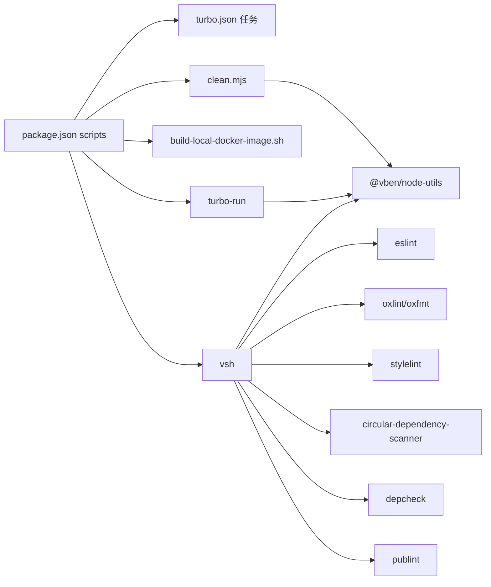

# 自动化脚本

<cite>
**本文引用的文件**
- [scripts/clean.mjs](file://scripts/clean.mjs)
- [scripts/deploy/build-local-docker-image.sh](file://scripts/deploy/build-local-docker-image.sh)
- [scripts/deploy/Dockerfile](file://scripts/deploy/Dockerfile)
- [scripts/deploy/nginx.conf](file://scripts/deploy/nginx.conf)
- [scripts/turbo-run/bin/turbo-run.mjs](file://scripts/turbo-run/bin/turbo-run.mjs)
- [scripts/turbo-run/src/index.ts](file://scripts/turbo-run/src/index.ts)
- [scripts/turbo-run/src/run.ts](file://scripts/turbo-run/src/run.ts)
- [scripts/vsh/bin/vsh.mjs](file://scripts/vsh/bin/vsh.mjs)
- [scripts/vsh/src/index.ts](file://scripts/vsh/src/index.ts)
- [scripts/vsh/src/lint/index.ts](file://scripts/vsh/src/lint/index.ts)
- [scripts/vsh/src/check-circular/index.ts](file://scripts/vsh/src/check-circular/index.ts)
- [scripts/vsh/src/check-dep/index.ts](file://scripts/vsh/src/check-dep/index.ts)
- [scripts/vsh/src/code-workspace/index.ts](file://scripts/vsh/src/code-workspace/index.ts)
- [scripts/vsh/src/publint/index.ts](file://scripts/vsh/src/publint/index.ts)
- [turbo.json](file://turbo.json)
- [package.json](file://package.json)
</cite>

## 目录

1. [简介](#简介)
2. [项目结构](#项目结构)
3. [核心组件](#核心组件)
4. [架构总览](#架构总览)
5. [详细组件分析](#详细组件分析)
6. [依赖关系分析](#依赖关系分析)
7. [性能考量](#性能考量)
8. [故障排查指南](#故障排查指南)
9. [结论](#结论)
10. [附录](#附录)

## 简介

本文件面向 shiyu-ui 项目的开发者，系统性梳理并说明仓库内自动化脚本与工作流，涵盖以下主题：

- Monorepo 工作流与任务编排：基于 Turbo 的任务定义、缓存与依赖拓扑，以及交互式任务选择器 turbo-run 的使用。
- Docker 部署脚本：本地镜像构建、容器运行示例与 Nginx 静态服务配置。
- 代码检查与质量保证：统一的多工具批量检查、格式化与发布规范校验。
- 清理脚本：安全、并发、递归的清理策略与使用场景。
- 自定义脚本开发指南与最佳实践：如何扩展 vsh 命令体系与脚本工程化。
- CI/CD 集成与自动化测试：结合脚本与工作流在 CI 中的落地建议。

## 项目结构

自动化相关的核心位置如下：

- 脚本与工具
  - 清理脚本：scripts/clean.mjs
  - Docker 部署：scripts/deploy/Dockerfile、scripts/deploy/build-local-docker-image.sh、scripts/deploy/nginx.conf
  - 交互式任务选择器：scripts/turbo-run（bin/index + src）
  - 质量与检查工具集合：scripts/vsh（bin/index + src 子命令）
- 工作流与任务编排
  - Turbo 配置：turbo.json
  - 顶层脚本入口：package.json 中的 scripts 字段
- 内部工具库
  - @vben/node-utils 提供包扫描、执行命令、Git 操作等能力，被上述脚本广泛使用

图表来源

- [package.json:27-66](file://package.json#L27-L66)
- [turbo.json:1-49](file://turbo.json#L1-L49)
- [scripts/clean.mjs:1-142](file://scripts/clean.mjs#L1-L142)
- [scripts/deploy/build-local-docker-image.sh:1-56](file://scripts/deploy/build-local-docker-image.sh#L1-L56)
- [scripts/deploy/Dockerfile:1-39](file://scripts/deploy/Dockerfile#L1-L39)
- [scripts/deploy/nginx.conf](file://scripts/deploy/nginx.conf)
- [scripts/turbo-run/bin/turbo-run.mjs:1-4](file://scripts/turbo-run/bin/turbo-run.mjs#L1-L4)
- [scripts/turbo-run/src/index.ts:1-24](file://scripts/turbo-run/src/index.ts#L1-L24)
- [scripts/turbo-run/src/run.ts:1-68](file://scripts/turbo-run/src/run.ts#L1-L68)
- [scripts/vsh/bin/vsh.mjs:1-4](file://scripts/vsh/bin/vsh.mjs#L1-L4)
- [scripts/vsh/src/index.ts:1-78](file://scripts/vsh/src/index.ts#L1-L78)
- [scripts/vsh/src/lint/index.ts:1-55](file://scripts/vsh/src/lint/index.ts#L1-L55)
- [scripts/vsh/src/check-circular/index.ts:1-218](file://scripts/vsh/src/check-circular/index.ts#L1-L218)
- [scripts/vsh/src/check-dep/index.ts:1-195](file://scripts/vsh/src/check-dep/index.ts#L1-L195)
- [scripts/vsh/src/code-workspace/index.ts:1-79](file://scripts/vsh/src/code-workspace/index.ts#L1-L79)
- [scripts/vsh/src/publint/index.ts:1-186](file://scripts/vsh/src/publint/index.ts#L1-L186)

章节来源

- [package.json:27-66](file://package.json#L27-L66)
- [turbo.json:1-49](file://turbo.json#L1-L49)

## 核心组件

- 清理脚本（scripts/clean.mjs）
  - 功能：递归扫描根目录，按目标名称批量删除 node_modules、dist、.turbo、dist.zip 等；支持可选删除 pnpm-lock.yaml；内置并发与错误处理。
  - 关键点：withFileTypes 读取、CONCURRENCY_LIMIT 批处理、最大递归深度限制、权限与不存在文件的容错。
- Docker 部署（scripts/deploy）
  - Dockerfile：分阶段构建，使用 pnpm 缓存安装依赖并构建产物，最终以 Nginx 提供静态服务。
  - 构建脚本：一键安装依赖、构建镜像、打印运行示例与日志。
  - Nginx 配置：补充 mjs MIME 类型、移除默认站点、暴露 8080 端口。
- 交互式任务选择器（scripts/turbo-run）
  - 功能：根据命令名筛选具备该 script 的包，通过交互选择后以过滤方式执行 pnpm run。
  - 关键点：基于 @vben/node-utils 获取包列表、@clack/prompts 交互、execaCommand 继承标准输入输出。
- 质量与检查工具集（scripts/vsh）
  - 统一 CLI：vsh 主入口注册多个子命令，支持 lint、publint、check-circular、check-dep、code-workspace。
  - lint：并发执行格式化与检查（oxfmt、oxlint、eslint、stylelint），支持 --format 顺序修复。
  - check-circular：调用 circular-dependency-scanner，支持暂存区扫描、忽略目录与扩展名、缓存命中。
  - check-dep：对各包执行 depcheck，支持忽略包、匹配规则与文件模式。
  - code-workspace：自动生成/更新 .code-workspace 并可自动提交。
  - publint：对 package.json 进行发布规范检查，带内容哈希缓存与严格模式。
- 工作流与任务编排（turbo.json + package.json）
  - Turbo：定义 build/preview/build:analyze 等任务的依赖与输出缓存；全局依赖与环境变量；dev 任务禁用缓存并持久化。
  - 顶层脚本：通过 pnpm run 或 turbo-run/preview 触达具体应用；集成 changeset、格式化、检查、测试、预览等常用流程。

章节来源

- [scripts/clean.mjs:1-142](file://scripts/clean.mjs#L1-L142)
- [scripts/deploy/build-local-docker-image.sh:1-56](file://scripts/deploy/build-local-docker-image.sh#L1-L56)
- [scripts/deploy/Dockerfile:1-39](file://scripts/deploy/Dockerfile#L1-L39)
- [scripts/turbo-run/src/index.ts:1-24](file://scripts/turbo-run/src/index.ts#L1-L24)
- [scripts/turbo-run/src/run.ts:1-68](file://scripts/turbo-run/src/run.ts#L1-L68)
- [scripts/vsh/src/index.ts:1-78](file://scripts/vsh/src/index.ts#L1-L78)
- [scripts/vsh/src/lint/index.ts:1-55](file://scripts/vsh/src/lint/index.ts#L1-L55)
- [scripts/vsh/src/check-circular/index.ts:1-218](file://scripts/vsh/src/check-circular/index.ts#L1-L218)
- [scripts/vsh/src/check-dep/index.ts:1-195](file://scripts/vsh/src/check-dep/index.ts#L1-L195)
- [scripts/vsh/src/code-workspace/index.ts:1-79](file://scripts/vsh/src/code-workspace/index.ts#L1-L79)
- [scripts/vsh/src/publint/index.ts:1-186](file://scripts/vsh/src/publint/index.ts#L1-L186)
- [turbo.json:1-49](file://turbo.json#L1-L49)
- [package.json:27-66](file://package.json#L27-L66)

## 架构总览

下图展示从用户命令到具体执行的端到端流程，覆盖清理、Docker 构建、交互式任务与质量检查。

图表来源

- [package.json:27-66](file://package.json#L27-L66)
- [turbo.json:15-47](file://turbo.json#L15-L47)
- [scripts/turbo-run/src/run.ts:9-51](file://scripts/turbo-run/src/run.ts#L9-L51)
- [scripts/vsh/src/index.ts:24-58](file://scripts/vsh/src/index.ts#L24-L58)
- [scripts/clean.mjs:60-129](file://scripts/clean.mjs#L60-L129)
- [scripts/deploy/build-local-docker-image.sh:19-53](file://scripts/deploy/build-local-docker-image.sh#L19-L53)

## 详细组件分析

### 清理脚本（scripts/clean.mjs）

- 设计要点
  - 并发批处理：每批最多 CONCURRENCY_LIMIT 个任务，提升 IO 效率。
  - 递归扫描：withFileTypes 一次性获取文件类型，避免额外 stat 调用。
  - 安全与容错：跳过 .DS_Store/.git/.idea/.vscode；捕获 ENOENT/EPERM/EACCES 等错误；限制最大递归深度。
  - 目标管理：默认删除 node_modules、dist、.turbo、dist.zip；支持 --del-lock 删除锁文件。
- 使用场景
  - 彻底清理缓存与构建产物，释放磁盘空间。
  - 在升级依赖或切换分支后重置状态。
  - CI 场景中清理工作区，确保一致性。

图表来源

- [scripts/clean.mjs:60-129](file://scripts/clean.mjs#L60-L129)

章节来源

- [scripts/clean.mjs:1-142](file://scripts/clean.mjs#L1-L142)

### Docker 部署脚本（scripts/deploy）

- Dockerfile
  - 分阶段构建：builder 阶段安装依赖并构建，production 阶段基于 nginx:stable-alpine。
  - 缓存优化：使用 pnpm store 缓存；构建排除 docs 包。
  - Nginx 配置：新增 mjs MIME 类型、移除默认站点、暴露 8080。
- 构建脚本
  - 停止并移除同名容器与旧镜像，安装依赖，构建镜像，打印运行示例与日志。
- 使用建议
  - 本地快速验证构建产物与静态服务可用性。
  - CI 中可复用相同 Dockerfile 与构建流程，实现一致的制品交付。

图表来源

- [scripts/deploy/build-local-docker-image.sh:8-53](file://scripts/deploy/build-local-docker-image.sh#L8-L53)
- [scripts/deploy/Dockerfile:1-39](file://scripts/deploy/Dockerfile#L1-L39)
- [scripts/deploy/nginx.conf](file://scripts/deploy/nginx.conf)

章节来源

- [scripts/deploy/build-local-docker-image.sh:1-56](file://scripts/deploy/build-local-docker-image.sh#L1-L56)
- [scripts/deploy/Dockerfile:1-39](file://scripts/deploy/Dockerfile#L1-L39)

### 交互式任务选择器（scripts/turbo-run）

- 功能概述
  - 通过命令行参数指定脚本名，自动筛选具备该脚本的包，交互选择后以 --filter 方式执行 pnpm run。
- 关键流程
  - 获取包列表 -> 过滤拥有目标脚本的包 -> 交互选择 -> 执行命令（继承标准输入输出）。

图表来源

- [scripts/turbo-run/bin/turbo-run.mjs:1-4](file://scripts/turbo-run/bin/turbo-run.mjs#L1-L4)
- [scripts/turbo-run/src/index.ts:7-19](file://scripts/turbo-run/src/index.ts#L7-L19)
- [scripts/turbo-run/src/run.ts:15-51](file://scripts/turbo-run/src/run.ts#L15-L51)

章节来源

- [scripts/turbo-run/src/index.ts:1-24](file://scripts/turbo-run/src/index.ts#L1-L24)
- [scripts/turbo-run/src/run.ts:1-68](file://scripts/turbo-run/src/run.ts#L1-L68)

### 质量与检查工具集（scripts/vsh）

- vsh 主入口
  - 注册多个子命令：lint、publint、check-circular、check-dep、code-workspace。
  - 对未知命令输出帮助与可用命令列表。
- lint 子命令
  - 并发执行：oxfmt、oxlint、eslint、stylelint（带缓存）。
  - 支持 --format 顺序修复：先 stylelint，再 oxfmt、oxlint、eslint。
- check-circular 子命令
  - 调用 circular-dependency-scanner CLI，支持：
    - staged：仅检查暂存文件；
    - verbose：详细输出；
    - threshold/ignore-dirs/allowedExtensions 自定义；
    - 临时文件输出与缓存命中。
- check-dep 子命令
  - 对每个包执行 depcheck，支持忽略包、匹配规则与文件模式，并格式化输出。
- code-workspace 子命令
  - 自动生成/更新 .code-workspace，支持缩进与自动提交。
- publint 子命令
  - 对 package.json 执行发布规范检查，严格模式与内容哈希缓存，输出统计并在非 --check 模式下失败退出。

图表来源

- [scripts/vsh/src/index.ts:24-58](file://scripts/vsh/src/index.ts#L24-L58)
- [scripts/vsh/src/lint/index.ts:12-43](file://scripts/vsh/src/lint/index.ts#L12-L43)
- [scripts/vsh/src/check-circular/index.ts:112-186](file://scripts/vsh/src/check-circular/index.ts#L112-L186)
- [scripts/vsh/src/check-dep/index.ts:115-161](file://scripts/vsh/src/check-dep/index.ts#L115-L161)
- [scripts/vsh/src/code-workspace/index.ts:23-63](file://scripts/vsh/src/code-workspace/index.ts#L23-L63)
- [scripts/vsh/src/publint/index.ts:68-113](file://scripts/vsh/src/publint/index.ts#L68-L113)

章节来源

- [scripts/vsh/src/index.ts:1-78](file://scripts/vsh/src/index.ts#L1-L78)
- [scripts/vsh/src/lint/index.ts:1-55](file://scripts/vsh/src/lint/index.ts#L1-L55)
- [scripts/vsh/src/check-circular/index.ts:1-218](file://scripts/vsh/src/check-circular/index.ts#L1-L218)
- [scripts/vsh/src/check-dep/index.ts:1-195](file://scripts/vsh/src/check-dep/index.ts#L1-L195)
- [scripts/vsh/src/code-workspace/index.ts:1-79](file://scripts/vsh/src/code-workspace/index.ts#L1-L79)
- [scripts/vsh/src/publint/index.ts:1-186](file://scripts/vsh/src/publint/index.ts#L1-L186)

## 依赖关系分析

- 脚本到工具库
  - @vben/node-utils 提供包扫描、执行命令、Git 操作、文件格式化等能力，被 vsh、turbo-run、clean 等广泛使用。
- 脚本到外部工具
  - vsh lint：oxfmt、oxlint、eslint、stylelint。
  - vsh check-circular：circular-dependency-scanner。
  - vsh check-dep：depcheck。
  - vsh publint：publint。
- 顶层脚本到具体工具
  - package.json scripts 将高频操作映射到上述脚本与 Turbo。

图表来源

- [package.json:27-66](file://package.json#L27-L66)
- [turbo.json:15-47](file://turbo.json#L15-L47)
- [scripts/clean.mjs:1](file://scripts/clean.mjs#L1)
- [scripts/deploy/build-local-docker-image.sh:1](file://scripts/deploy/build-local-docker-image.sh#L1)
- [scripts/turbo-run/src/run.ts:1](file://scripts/turbo-run/src/run.ts#L1)
- [scripts/vsh/src/index.ts:1](file://scripts/vsh/src/index.ts#L1)

章节来源

- [package.json:27-66](file://package.json#L27-L66)
- [turbo.json:1-49](file://turbo.json#L1-L49)

## 性能考量

- 清理脚本
  - 并发批处理与 withFileTypes 减少 IO 开销；合理设置 CONCURRENCY_LIMIT 以平衡吞吐与资源占用。
  - 递归深度限制避免深层目录导致的性能问题。
- Docker 构建
  - pnpm store 缓存显著缩短依赖安装时间；分阶段构建减少镜像体积。
  - Nginx 静态服务简单高效，适合前端产物部署。
- 质量检查
  - lint 子命令并发执行多工具，缩短整体耗时；--format 顺序修复避免重复检查。
  - check-circular 与 publint 使用缓存，避免重复计算。
- 任务编排
  - Turbo 依据 dependsOn 与 outputs 精准缓存，避免不必要的重建；dev 任务禁用缓存并持久化，便于开发体验。

[本节为通用指导，不涉及具体文件分析]

## 故障排查指南

- 清理脚本
  - 权限问题：EPERM/EACCES 会输出错误并跳过；确认目录权限与进程权限。
  - 目录不存在：ENOENT 为预期情况，脚本会跳过并继续。
  - 递归过深：超过最大深度会警告并终止，检查目标路径与 SKIP_DIRS 设置。
- Docker 构建
  - 依赖安装失败：检查网络与 pnpm 缓存；确认 Dockerfile 中的 COPY 与安装命令。
  - 构建镜像失败：查看构建脚本日志，确认镜像标签与容器名称冲突。
- 交互式任务选择器
  - 未找到包：确认目标脚本存在于包的 scripts 中；检查包过滤逻辑。
  - 执行失败：查看 pnpm run 输出与返回码。
- 质量检查
  - lint 并发失败：逐个工具定位问题；优先修复严重错误。
  - check-circular：若结果异常，调整 ignoreDirs/allowedExtensions 或检查暂存区文件。
  - check-dep：注意忽略包与匹配规则，避免误报。
  - publint：严格模式下失败需修正 package.json；查看缓存文件位置以便清理。

章节来源

- [scripts/clean.mjs:38-51](file://scripts/clean.mjs#L38-L51)
- [scripts/deploy/build-local-docker-image.sh:30-41](file://scripts/deploy/build-local-docker-image.sh#L30-L41)
- [scripts/turbo-run/src/run.ts:44-47](file://scripts/turbo-run/src/run.ts#L44-L47)
- [scripts/vsh/src/lint/index.ts:30-43](file://scripts/vsh/src/lint/index.ts#L30-L43)
- [scripts/vsh/src/check-circular/index.ts:176-186](file://scripts/vsh/src/check-circular/index.ts#L176-L186)
- [scripts/vsh/src/check-dep/index.ts:155-160](file://scripts/vsh/src/check-dep/index.ts#L155-L160)
- [scripts/vsh/src/publint/index.ts:164-174](file://scripts/vsh/src/publint/index.ts#L164-L174)

## 结论

本项目通过一组高内聚、低耦合的自动化脚本与工具，实现了：

- 高效的 Monorepo 任务编排与缓存复用（Turbo）。
- 便捷的交互式任务选择与执行（turbo-run）。
- 全面的质量与检查能力（vsh lint/circular/dep/publint/code-workspace）。
- 快速的本地 Docker 部署与静态服务验证。
- 安全可靠的清理流程，保障开发与 CI 环境的一致性。

建议在团队内推广使用这些脚本，配合 CI/CD 流水线，持续提升开发效率与交付质量。

[本节为总结，不涉及具体文件分析]

## 附录

- 自定义脚本开发指南与最佳实践
  - 命令注册：参考 vsh 主入口的命令注册模式，统一 help/version/usage。
  - 交互与日志：使用 @vben/node-utils 的 consola/colors 与 @clack/prompts 提升 UX。
  - 并发与缓存：对 I/O 密集任务采用批处理与缓存，减少重复计算。
  - 错误处理：区分可恢复与不可恢复错误，提供明确的错误信息与回退策略。
  - 文档与测试：为新脚本编写 README 与最小可运行示例，必要时增加单元/集成测试。
- CI/CD 集成与自动化测试
  - 使用 package.json 中的脚本作为流水线步骤，例如：pnpm install、pnpm run build、pnpm run lint、pnpm run test:e2e。
  - 在 CI 中启用 Turbo 缓存（根据项目配置），结合 Docker 构建产物进行部署验证。
  - 将 vsh 的检查命令纳入 PR 校验，确保质量门槛。

[本节为通用指导，不涉及具体文件分析]
