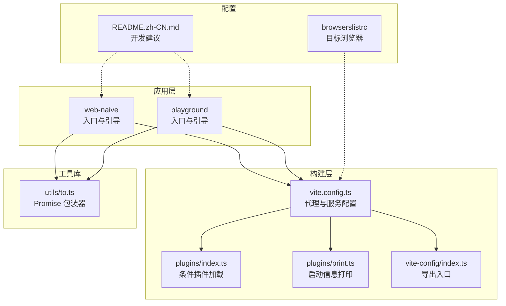
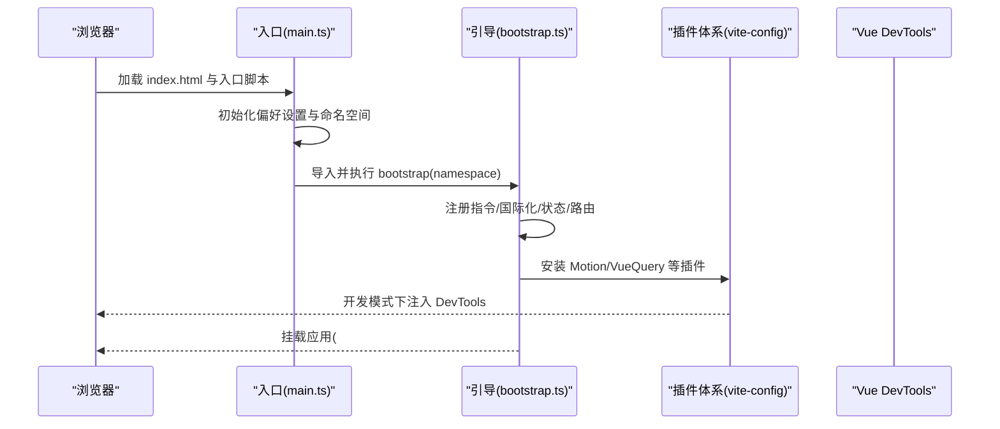
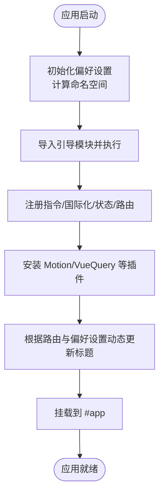
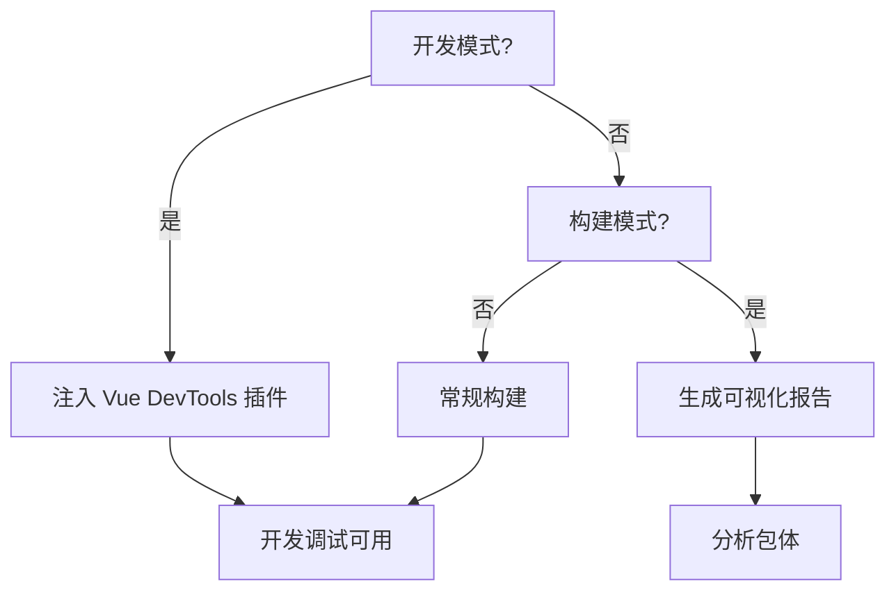
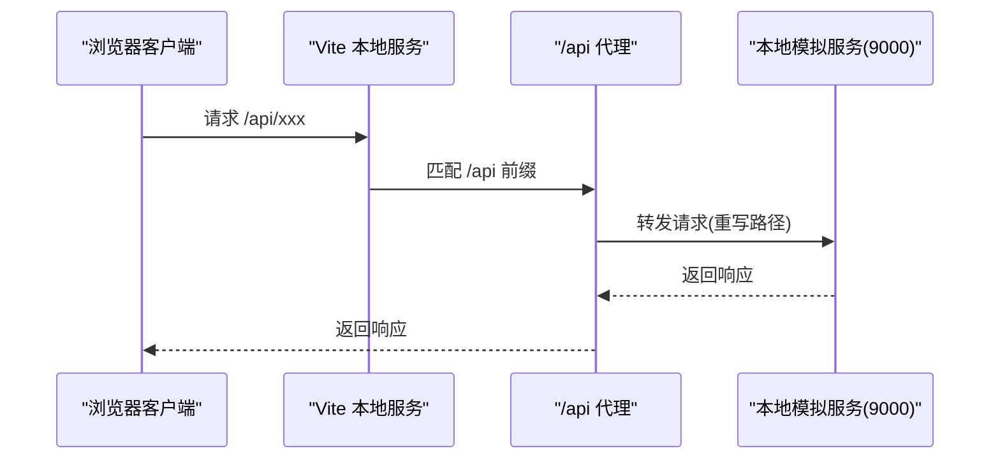
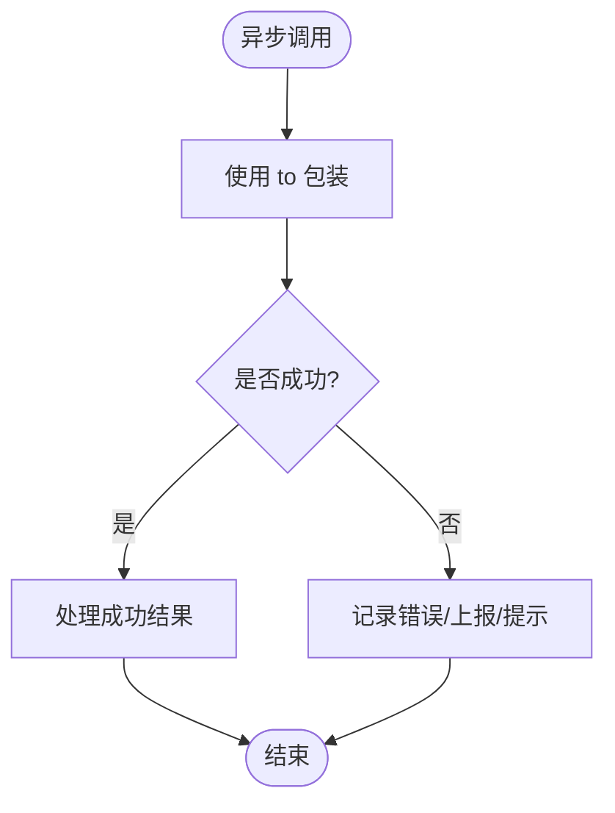
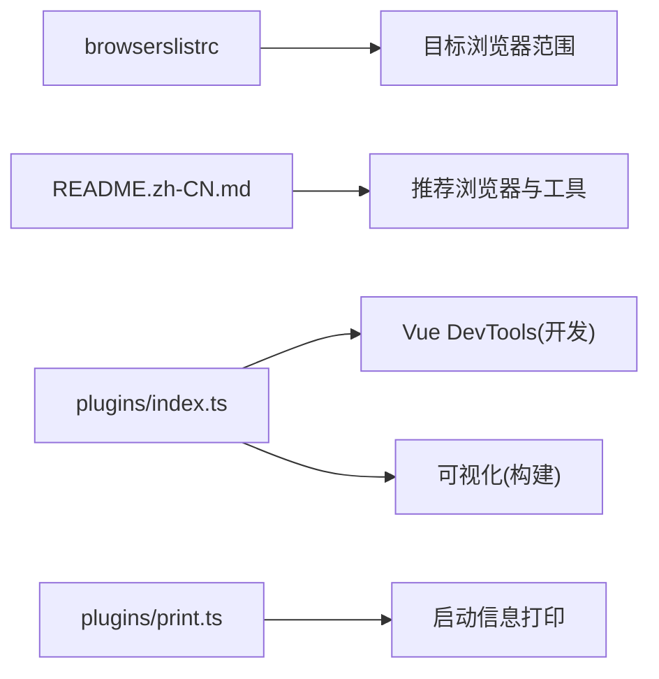

# 调试工具

<cite>
**本文引用的文件**
- [apps/web-naive/package.json](file://apps/web-naive/package.json)
- [playground/package.json](file://playground/package.json)
- [apps/web-naive/vite.config.ts](file://apps/web-naive/vite.config.ts)
- [playground/vite.config.ts](file://playground/vite.config.ts)
- [apps/web-naive/src/main.ts](file://apps/web-naive/src/main.ts)
- [playground/src/main.ts](file://playground/src/main.ts)
- [apps/web-naive/src/bootstrap.ts](file://apps/web-naive/src/bootstrap.ts)
- [playground/src/bootstrap.ts](file://playground/src/bootstrap.ts)
- [apps/web-naive/src/preferences.ts](file://apps/web-naive/src/preferences.ts)
- [playground/src/preferences.ts](file://playground/src/preferences.ts)
- [internal/vite-config/src/plugins/index.ts](file://internal/vite-config/src/plugins/index.ts)
- [internal/vite-config/src/plugins/print.ts](file://internal/vite-config/src/plugins/print.ts)
- [internal/vite-config/src/index.ts](file://internal/vite-config/src/index.ts)
- [packages/@core/base/shared/src/utils/to.ts](file://packages/@core/base/shared/src/utils/to.ts)
- [.browserslistrc](file://.browserslistrc)
- [README.zh-CN.md](file://README.zh-CN.md)
</cite>

## 目录

1. [简介](#简介)
2. [项目结构](#项目结构)
3. [核心组件](#核心组件)
4. [架构总览](#架构总览)
5. [详细组件分析](#详细组件分析)
6. [依赖分析](#依赖分析)
7. [性能考虑](#性能考虑)
8. [故障排查指南](#故障排查指南)
9. [结论](#结论)
10. [附录](#附录)

## 简介

本篇“调试工具”文档面向 shiyu-ui 项目的前端开发者，聚焦于浏览器开发者工具与构建期调试能力的使用方法，涵盖以下主题：

- 浏览器开发者工具：Vue DevTools、网络面板、性能分析
- 断点调试与变量监控
- 日志系统配置（开发/生产）
- 错误追踪与异常处理
- 性能分析与内存泄漏检测
- 常见调试场景与解决方案

文档结合仓库中的 Vite 配置、应用启动流程、偏好设置与工具链插件，给出可操作的调试步骤与最佳实践。

## 项目结构

本项目采用多包工作区结构，调试相关的关键位置如下：

- 应用层（web-naive 与 playground）：入口、引导、路由、状态、国际化、插件等
- 构建层（internal/vite-config）：Vite 插件体系、可视化与打印信息
- 工具库（@core/base/shared/utils）：通用工具函数（如 to 包装器）

图表来源

- [apps/web-naive/vite.config.ts:1-21](file://apps/web-naive/vite.config.ts#L1-L21)
- [playground/vite.config.ts:1-21](file://playground/vite.config.ts#L1-L21)
- [internal/vite-config/src/plugins/index.ts:32-89](file://internal/vite-config/src/plugins/index.ts#L32-L89)
- [internal/vite-config/src/plugins/print.ts:1-28](file://internal/vite-config/src/plugins/print.ts#L1-L28)
- [internal/vite-config/src/index.ts:1-6](file://internal/vite-config/src/index.ts#L1-L6)
- [packages/@core/base/shared/src/utils/to.ts:1-21](file://packages/@core/base/shared/src/utils/to.ts#L1-L21)
- [.browserslistrc:1-4](file://.browserslistrc#L1-L4)
- [README.zh-CN.md:115-127](file://README.zh-CN.md#L115-L127)

章节来源

- [apps/web-naive/vite.config.ts:1-21](file://apps/web-naive/vite.config.ts#L1-L21)
- [playground/vite.config.ts:1-21](file://playground/vite.config.ts#L1-L21)
- [internal/vite-config/src/plugins/index.ts:32-89](file://internal/vite-config/src/plugins/index.ts#L32-L89)
- [internal/vite-config/src/plugins/print.ts:1-28](file://internal/vite-config/src/plugins/print.ts#L1-L28)
- [internal/vite-config/src/index.ts:1-6](file://internal/vite-config/src/index.ts#L1-L6)
- [.browserslistrc:1-4](file://.browserslistrc#L1-L4)
- [README.zh-CN.md:115-127](file://README.zh-CN.md#L115-L127)

## 核心组件

- 应用入口与引导
  - web-naive 与 playground 的入口文件负责初始化偏好设置、命名空间、加载引导模块并挂载应用。
  - 引导模块负责注册指令、国际化、状态、路由、插件（如 Motion、VueQuery）、动态标题等。
- 构建与调试插件
  - 条件加载 Vue DevTools 插件（开发模式下启用），以及构建期可视化插件（分析打包体积）。
  - 启动时打印额外信息，便于定位开发服务器地址与附加信息。
- 工具函数
  - to 包装器用于统一捕获异步错误，简化 try/catch 与错误合并逻辑。

章节来源

- [apps/web-naive/src/main.ts:1-32](file://apps/web-naive/src/main.ts#L1-L32)
- [playground/src/main.ts:1-33](file://playground/src/main.ts#L1-L33)
- [apps/web-naive/src/bootstrap.ts:1-77](file://apps/web-naive/src/bootstrap.ts#L1-L77)
- [playground/src/bootstrap.ts:1-91](file://playground/src/bootstrap.ts#L1-L91)
- [internal/vite-config/src/plugins/index.ts:32-89](file://internal/vite-config/src/plugins/index.ts#L32-L89)
- [internal/vite-config/src/plugins/print.ts:1-28](file://internal/vite-config/src/plugins/print.ts#L1-L28)
- [packages/@core/base/shared/src/utils/to.ts:1-21](file://packages/@core/base/shared/src/utils/to.ts#L1-L21)

## 架构总览

下图展示从浏览器到应用引导再到插件安装的整体流程，以及与 Vite 插件的关系。

图表来源

- [apps/web-naive/src/main.ts:9-31](file://apps/web-naive/src/main.ts#L9-L31)
- [apps/web-naive/src/bootstrap.ts:19-74](file://apps/web-naive/src/bootstrap.ts#L19-L74)
- [playground/src/main.ts:9-31](file://playground/src/main.ts#L9-L31)
- [playground/src/bootstrap.ts:21-87](file://playground/src/bootstrap.ts#L21-L87)
- [internal/vite-config/src/plugins/index.ts:70-73](file://internal/vite-config/src/plugins/index.ts#L70-L73)

## 详细组件分析

### 组件一：入口与引导（main.ts 与 bootstrap.ts）

- 入口职责
  - 计算命名空间（结合版本号与环境），初始化偏好设置，加载引导模块并挂载。
- 引导职责
  - 初始化组件适配器、表单适配器、国际化、状态、权限指令、Tippy、路由与插件。
  - 动态更新页面标题（基于路由元信息与偏好设置）。

图表来源

- [apps/web-naive/src/main.ts:9-31](file://apps/web-naive/src/main.ts#L9-L31)
- [apps/web-naive/src/bootstrap.ts:19-74](file://apps/web-naive/src/bootstrap.ts#L19-L74)
- [playground/src/main.ts:9-31](file://playground/src/main.ts#L9-L31)
- [playground/src/bootstrap.ts:21-87](file://playground/src/bootstrap.ts#L21-L87)

章节来源

- [apps/web-naive/src/main.ts:1-32](file://apps/web-naive/src/main.ts#L1-L32)
- [playground/src/main.ts:1-33](file://playground/src/main.ts#L1-L33)
- [apps/web-naive/src/bootstrap.ts:1-77](file://apps/web-naive/src/bootstrap.ts#L1-L77)
- [playground/src/bootstrap.ts:1-91](file://playground/src/bootstrap.ts#L1-L91)

### 组件二：Vite 调试插件与启动信息

- 条件加载 Vue DevTools 插件：仅在开发且开启 devtools 条件时注入。
- 构建期可视化：在生产构建时可生成可视化报告，辅助分析包体构成。
- 启动信息打印：在本地开发服务器启动后，额外打印自定义信息键值对，便于快速定位服务地址与附加信息。

图表来源

- [internal/vite-config/src/plugins/index.ts:70-89](file://internal/vite-config/src/plugins/index.ts#L70-L89)
- [internal/vite-config/src/plugins/print.ts:13-27](file://internal/vite-config/src/plugins/print.ts#L13-L27)

章节来源

- [internal/vite-config/src/plugins/index.ts:32-89](file://internal/vite-config/src/plugins/index.ts#L32-L89)
- [internal/vite-config/src/plugins/print.ts:1-28](file://internal/vite-config/src/plugins/print.ts#L1-L28)

### 组件三：代理与网络调试（/api）

- 两个应用均配置了 /api 代理，将请求转发至本地模拟服务端，便于前后端联调与接口调试。
- 支持 WebSocket 代理，满足实时通信场景。

图表来源

- [apps/web-naive/vite.config.ts:8-16](file://apps/web-naive/vite.config.ts#L8-L16)
- [playground/vite.config.ts:8-16](file://playground/vite.config.ts#L8-L16)

章节来源

- [apps/web-naive/vite.config.ts:1-21](file://apps/web-naive/vite.config.ts#L1-L21)
- [playground/vite.config.ts:1-21](file://playground/vite.config.ts#L1-L21)

### 组件四：日志系统与错误处理

- 日志策略
  - 开发环境：允许使用 console.warn 与 console.error；生产环境建议通过统一上报通道或错误边界收集。
  - 业务侧：建议在关键流程（登录、查询、提交）前后记录上下文日志，便于回溯。
- 错误处理
  - 使用 to 包装器统一捕获异步错误，避免分散的 try/catch。
  - 结合路由守卫与全局错误边界，实现未处理异常的兜底提示与上报。

图表来源

- [packages/@core/base/shared/src/utils/to.ts:6-21](file://packages/@core/base/shared/src/utils/to.ts#L6-L21)

章节来源

- [packages/@core/base/shared/src/utils/to.ts:1-21](file://packages/@core/base/shared/src/utils/to.ts#L1-L21)

### 组件五：偏好设置与调试开关

- 偏好设置覆盖项可用于控制登录过期行为、访问模式、刷新令牌等，这些配置直接影响调试体验（例如登录态、权限校验）。
- playground 提供扩展偏好字段，便于演示与调试特定交互。

章节来源

- [apps/web-naive/src/preferences.ts:8-16](file://apps/web-naive/src/preferences.ts#L8-L16)
- [playground/src/preferences.ts:18-26](file://playground/src/preferences.ts#L18-L26)
- [playground/src/preferences.ts:30-87](file://playground/src/preferences.ts#L30-L87)

## 依赖分析

- 浏览器支持与目标
  - 项目声明支持现代浏览器，不支持 IE，开发推荐 Chrome 80+，有助于使用最新版开发者工具。
- 构建与调试依赖
  - Vite 插件按环境条件加载，开发模式注入 DevTools，生产构建可生成可视化报告。
  - 启动信息打印插件增强本地开发可见性。

图表来源

- [.browserslistrc:1-4](file://.browserslistrc#L1-L4)
- [README.zh-CN.md:115-127](file://README.zh-CN.md#L115-L127)
- [internal/vite-config/src/plugins/index.ts:70-89](file://internal/vite-config/src/plugins/index.ts#L70-L89)
- [internal/vite-config/src/plugins/print.ts:13-27](file://internal/vite-config/src/plugins/print.ts#L13-L27)

章节来源

- [.browserslistrc:1-4](file://.browserslistrc#L1-L4)
- [README.zh-CN.md:115-127](file://README.zh-CN.md#L115-L127)
- [internal/vite-config/src/plugins/index.ts:32-89](file://internal/vite-config/src/plugins/index.ts#L32-L89)
- [internal/vite-config/src/plugins/print.ts:1-28](file://internal/vite-config/src/plugins/print.ts#L1-L28)

## 性能考虑

- 使用构建期可视化分析包体构成，识别大体积依赖与重复模块，指导拆分与去重。
- 在开发阶段启用 Vue DevTools，观察组件树、状态变化与渲染次数，定位过度渲染与不必要订阅。
- 利用浏览器性能面板记录长任务、布局抖动与内存增长，配合源码映射定位热点函数。
- 对高频异步调用使用 to 包装器，减少异常分支导致的性能退化与 UI 卡顿。

## 故障排查指南

- 无法连接后端接口
  - 检查 /api 代理配置与本地服务端是否启动。
  - 确认代理 rewrite 与目标地址正确。
- 开发工具不可用
  - 确认开发模式已注入 Vue DevTools 插件。
  - 查看启动信息打印，确认本地服务地址与附加信息。
- 登录态或权限异常
  - 检查偏好设置中的登录过期模式与访问模式。
  - 结合 to 包装器定位鉴权失败的异步调用。
- 性能问题
  - 使用性能面板录制并分析长任务与内存增长。
  - 通过可视化报告识别大模块与重复依赖。

章节来源

- [apps/web-naive/vite.config.ts:8-16](file://apps/web-naive/vite.config.ts#L8-L16)
- [playground/vite.config.ts:8-16](file://playground/vite.config.ts#L8-L16)
- [internal/vite-config/src/plugins/index.ts:70-73](file://internal/vite-config/src/plugins/index.ts#L70-L73)
- [internal/vite-config/src/plugins/print.ts:13-27](file://internal/vite-config/src/plugins/print.ts#L13-L27)
- [apps/web-naive/src/preferences.ts:10-16](file://apps/web-naive/src/preferences.ts#L10-L16)
- [playground/src/preferences.ts:20-26](file://playground/src/preferences.ts#L20-L26)
- [packages/@core/base/shared/src/utils/to.ts:6-21](file://packages/@core/base/shared/src/utils/to.ts#L6-L21)

## 结论

通过合理利用浏览器开发者工具、Vite 条件插件与统一错误处理机制，开发者可以在 shiyu-ui 中高效定位问题、优化性能并稳定交付。建议在日常开发中：

- 始终保持对 Vue DevTools 的关注与使用
- 在关键路径加入日志与错误上报
- 定期使用构建可视化与性能面板进行体检
- 遇到复杂问题时，结合代理与网络面板进行端到端复现

## 附录

- 推荐浏览器版本与支持范围
  - 现代浏览器，不支持 IE
  - 本地开发推荐 Chrome 80+

章节来源

- [README.zh-CN.md:115-127](file://README.zh-CN.md#L115-L127)
- [.browserslistrc:1-4](file://.browserslistrc#L1-L4)
