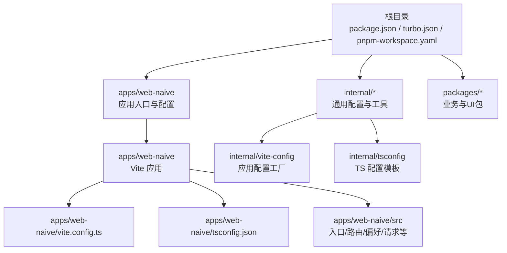
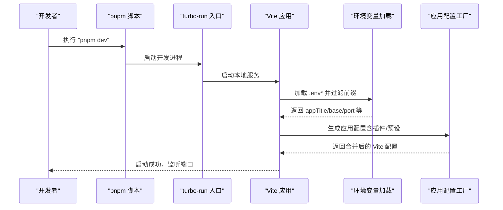
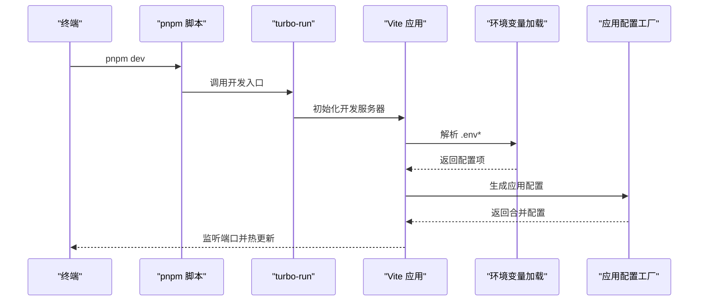
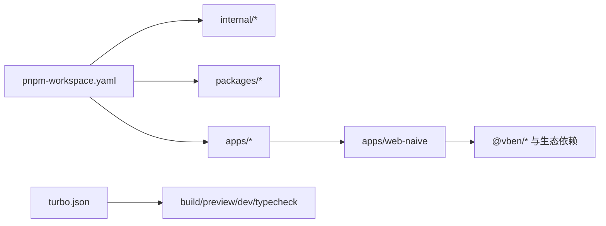

# 快速开始

<cite>
**本文引用的文件**
- [package.json](file://package.json)
- [pnpm-workspace.yaml](file://pnpm-workspace.yaml)
- [turbo.json](file://turbo.json)
- [README.md](file://README.md)
- [.browserslistrc](file://.browserslistrc)
- [apps/web-naive/package.json](file://apps/web-naive/package.json)
- [apps/web-naive/vite.config.ts](file://apps/web-naive/vite.config.ts)
- [apps/web-naive/tsconfig.json](file://apps/web-naive/tsconfig.json)
- [apps/web-naive/src/main.ts](file://apps/web-naive/src/main.ts)
- [apps/web-naive/src/preferences.ts](file://apps/web-naive/src/preferences.ts)
- [apps/web-naive/src/router/index.ts](file://apps/web-naive/src/router/index.ts)
- [apps/web-naive/src/api/request.ts](file://apps/web-naive/src/api/request.ts)
- [internal/vite-config/src/config/application.ts](file://internal/vite-config/src/config/application.ts)
- [internal/vite-config/src/utils/env.ts](file://internal/vite-config/src/utils/env.ts)
- [internal/tsconfig/web-app.json](file://internal/tsconfig/web-app.json)
- [scripts/turbo-run/bin/turbo-run.mjs](file://scripts/turbo-run/bin/turbo-run.mjs)
- [scripts/vsh/bin/vsh.mjs](file://scripts/vsh/bin/vsh.mjs)
</cite>

## 目录

1. [简介](#简介)
2. [项目结构](#项目结构)
3. [核心组件](#核心组件)
4. [架构总览](#架构总览)
5. [详细组件分析](#详细组件分析)
6. [依赖分析](#依赖分析)
7. [性能考虑](#性能考虑)
8. [故障排查指南](#故障排查指南)
9. [结论](#结论)
10. [附录](#附录)

## 简介

本指南面向首次接触 shiyu-ui（基于 Vben Admin 的多包工程）的新用户，帮助你在最短时间内完成环境准备、安装依赖、启动开发服务器与构建产物，并了解项目的基本目录结构与关键配置文件的作用。你将学会如何创建第一个页面并掌握基本的开发工作流。

## 项目结构

该仓库采用 pnpm workspaces + Turbo 的 monorepo 架构，核心应用位于 apps/web-naive，同时提供内部可复用的工具与配置包（internal/_ 与 packages/_）。根目录的 package.json 提供统一的脚本与引擎约束；turbo.json 定义了缓存与任务依赖；pnpm-workspace.yaml 声明了工作区范围与 catalog 依赖版本。

图表来源

- [package.json:1-110](file://package.json#L1-L110)
- [pnpm-workspace.yaml:1-192](file://pnpm-workspace.yaml#L1-L192)
- [turbo.json:1-49](file://turbo.json#L1-L49)
- [apps/web-naive/vite.config.ts:1-21](file://apps/web-naive/vite.config.ts#L1-L21)
- [apps/web-naive/tsconfig.json:1-12](file://apps/web-naive/tsconfig.json#L1-L12)
- [internal/vite-config/src/config/application.ts:1-124](file://internal/vite-config/src/config/application.ts#L1-L124)
- [internal/tsconfig/web-app.json:1-9](file://internal/tsconfig/web-app.json#L1-L9)

章节来源

- [package.json:1-110](file://package.json#L1-L110)
- [pnpm-workspace.yaml:1-192](file://pnpm-workspace.yaml#L1-L192)
- [turbo.json:1-49](file://turbo.json#L1-L49)

## 核心组件

- 包管理器与脚本
  - 推荐使用 pnpm（版本要求见 engines），根脚本通过 Turbo 管理多包构建与开发。
- 开发服务器与构建
  - 应用层使用 Vite，通过 internal/vite-config 提供统一的配置工厂与插件集。
- 环境变量加载
  - 支持 .env、.env.local、.env.{mode}、.env.{mode}.local，自动过滤前缀并转换为应用可用参数。
- 浏览器支持
  - 基于 browserslist 的现代浏览器策略，不支持 IE。

章节来源

- [package.json:27-67](file://package.json#L27-L67)
- [package.json:104-108](file://package.json#L104-L108)
- [apps/web-naive/vite.config.ts:1-21](file://apps/web-naive/vite.config.ts#L1-L21)
- [internal/vite-config/src/config/application.ts:17-99](file://internal/vite-config/src/config/application.ts#L17-L99)
- [internal/vite-config/src/utils/env.ts:37-108](file://internal/vite-config/src/utils/env.ts#L37-L108)
- [.browserslistrc:1-5](file://.browserslistrc#L1-L5)

## 架构总览

下图展示了从命令到应用启动的关键路径，以及环境变量与 Vite 配置的装配过程。

图表来源

- [package.json:46](file://package.json#L46)
- [scripts/turbo-run/bin/turbo-run.mjs:1-4](file://scripts/turbo-run/bin/turbo-run.mjs#L1-L4)
- [internal/vite-config/src/utils/env.ts:66-108](file://internal/vite-config/src/utils/env.ts#L66-L108)
- [internal/vite-config/src/config/application.ts:17-99](file://internal/vite-config/src/config/application.ts#L17-L99)

## 详细组件分析

### 环境要求与安装

- Node.js 版本
  - 引擎要求：^20.19.0 或 ^22.18.0 或 ^24.0.0，请按需选择 LTS 版本。
- 包管理器
  - 强制使用 pnpm，版本 >= 10。安装后会自动校验。
- 浏览器支持
  - 现代浏览器，不支持 IE。开发建议 Chrome 80+。
- 安装步骤
  - 克隆仓库后进入目录，执行 pnpm install 完成依赖安装。
  - 如需在线环境，可参考 README 中的“使用 Gitpod”入口快速体验。

章节来源

- [package.json:104-108](file://package.json#L104-L108)
- [README.md:55-82](file://README.md#L55-L82)
- [.browserslistrc:1-5](file://.browserslistrc#L1-L5)

### 开发服务器与构建

- 启动开发服务器
  - 在根目录执行 pnpm dev，将通过 turbo-run 启动应用开发服务。
  - 应用默认端口来自环境变量（未设置时为 5173），可通过 .env 或 .env.local 覆盖。
- 生产构建
  - 执行 pnpm build，Turbo 将并行构建所有包并生成 dist 输出。
  - 应用层也可单独构建（如 pnpm run build），具体以各应用 package.json 脚本为准。

章节来源

- [package.json:46](file://package.json#L46)
- [package.json:29](file://package.json#L29)
- [apps/web-naive/package.json:18-24](file://apps/web-naive/package.json#L18-L24)
- [turbo.json:15-47](file://turbo.json#L15-L47)

### 关键配置文件与作用

- 根级配置
  - package.json：统一脚本、引擎与包管理器版本声明。
  - pnpm-workspace.yaml：声明工作区与 catalog 依赖版本。
  - turbo.json：定义任务依赖、缓存与输出目录。
- 应用配置
  - apps/web-naive/vite.config.ts：基于 @vben/vite-config 的应用配置工厂，内置代理、PWA、插件等。
  - apps/web-naive/tsconfig.json：继承 internal/tsconfig/web-app.json，启用 Vite/自定义类型。
- 环境变量
  - internal/vite-config/src/utils/env.ts：按模式加载 .env\*，过滤前缀并转换布尔/数字值。
- TypeScript 模板
  - internal/tsconfig/web-app.json：为 Web 应用提供基础 TS 配置与类型。

章节来源

- [package.json:1-110](file://package.json#L1-L110)
- [pnpm-workspace.yaml:1-192](file://pnpm-workspace.yaml#L1-L192)
- [turbo.json:1-49](file://turbo.json#L1-L49)
- [apps/web-naive/vite.config.ts:1-21](file://apps/web-naive/vite.config.ts#L1-L21)
- [apps/web-naive/tsconfig.json:1-12](file://apps/web-naive/tsconfig.json#L1-L12)
- [internal/vite-config/src/utils/env.ts:37-108](file://internal/vite-config/src/utils/env.ts#L37-L108)
- [internal/tsconfig/web-app.json:1-9](file://internal/tsconfig/web-app.json#L1-L9)

### 第一个页面的创建与开发工作流

- 创建页面
  - 在 apps/web-naive/src/views 下新增一个 .vue 文件作为你的页面组件。
  - 在 apps/web-naive/src/router/routes/modules 下添加路由模块或在现有模块中扩展路由项。
- 运行与调试
  - 在根目录执行 pnpm dev 启动开发服务器，访问对应路由即可查看页面。
- 请求与国际化
  - 使用 apps/web-naive/src/api/request.ts 发起请求，遵循 VITE*APP*\* 前缀的环境变量配置。
  - 国际化资源位于 apps/web-naive/src/locales，按语言目录维护 JSON。

章节来源

- [apps/web-naive/src/router/index.ts:16-18](file://apps/web-naive/src/router/index.ts#L16-L18)
- [apps/web-naive/src/api/request.ts:20](file://apps/web-naive/src/api/request.ts#L20)
- [apps/web-naive/src/locales/index.ts:32](file://apps/web-naive/src/locales/index.ts#L32)

### 开发服务器启动流程（代码级）

图表来源

- [package.json:46](file://package.json#L46)
- [scripts/turbo-run/bin/turbo-run.mjs:1-4](file://scripts/turbo-run/bin/turbo-run.mjs#L1-L4)
- [internal/vite-config/src/utils/env.ts:66-108](file://internal/vite-config/src/utils/env.ts#L66-L108)
- [internal/vite-config/src/config/application.ts:17-99](file://internal/vite-config/src/config/application.ts#L17-L99)

## 依赖分析

- 工作区与版本管理
  - pnpm-workspace.yaml 声明了 internal/_、packages/_、apps/\* 等工作区范围，并通过 catalog 统一版本。
- 任务与缓存
  - turbo.json 定义了 build/preview/dev/typecheck 等任务的依赖与输出，提升缓存命中率。
- 应用层依赖
  - apps/web-naive/package.json 声明了对 @vben/\* 内部包与外部生态（naive-ui、vue、pinia、vue-router）的依赖。

图表来源

- [pnpm-workspace.yaml:1-192](file://pnpm-workspace.yaml#L1-L192)
- [turbo.json:15-47](file://turbo.json#L15-L47)
- [apps/web-naive/package.json:28-49](file://apps/web-naive/package.json#L28-L49)

章节来源

- [pnpm-workspace.yaml:1-192](file://pnpm-workspace.yaml#L1-L192)
- [turbo.json:15-47](file://turbo.json#L15-L47)
- [apps/web-naive/package.json:28-49](file://apps/web-naive/package.json#L28-L49)

## 性能考虑

- 构建优化
  - Vite 应用配置中启用了 rolldown 的压缩与文件命名策略，生产构建会移除 debugger。
- 预热与缓存
  - Vite server.warmup 预热常用文件，提升首开速度；Turbo 任务缓存减少重复构建时间。
- 插件与特性
  - PWA、可视化分析、压缩等插件按需开启，避免不必要的开销。

章节来源

- [internal/vite-config/src/config/application.ts:60-91](file://internal/vite-config/src/config/application.ts#L60-L91)
- [turbo.json:15-47](file://turbo.json#L15-L47)

## 故障排查指南

- Node 版本不匹配
  - 症状：安装或运行时报引擎不满足。
  - 处理：升级至符合 engines 的 Node 版本。
- pnpm 强制校验失败
  - 症状：安装时报错提示仅允许 pnpm。
  - 处理：确保使用 pnpm 安装依赖。
- 端口占用
  - 症状：开发服务器无法启动或端口冲突。
  - 处理：在 .env 或 .env.local 设置 VITE_PORT 或关闭占用端口。
- 环境变量未生效
  - 症状：路由历史模式或基础路径异常。
  - 处理：检查 .env\* 是否存在且包含 VITE_ROUTER_HISTORY/VITE_BASE 等变量。
- 代理请求失败
  - 症状：前端调用 /api 前缀接口报错。
  - 处理：确认 apps/web-naive/vite.config.ts 中代理 target 地址与端口正确。

章节来源

- [package.json:104-108](file://package.json#L104-L108)
- [package.json:57](file://package.json#L57)
- [apps/web-naive/vite.config.ts:8-16](file://apps/web-naive/vite.config.ts#L8-L16)
- [apps/web-naive/src/router/index.ts:16-18](file://apps/web-naive/src/router/index.ts#L16-L18)
- [internal/vite-config/src/utils/env.ts:66-108](file://internal/vite-config/src/utils/env.ts#L66-L108)

## 结论

通过本指南，你已了解 shiyu-ui 的环境要求、安装与启动流程、关键配置文件的作用，以及如何创建第一个页面并开展日常开发。建议在开发过程中结合 .env\* 与 internal/vite-config 的能力，逐步掌握代理、PWA、国际化与路由等特性。

## 附录

- 常用命令
  - 安装：pnpm install
  - 开发：pnpm dev
  - 构建：pnpm build
  - 类型检查：pnpm run typecheck
- 浏览器支持
  - 现代浏览器，不支持 IE。

章节来源

- [README.md:115-124](file://README.md#L115-L124)
- [package.json:27-67](file://package.json#L27-L67)
