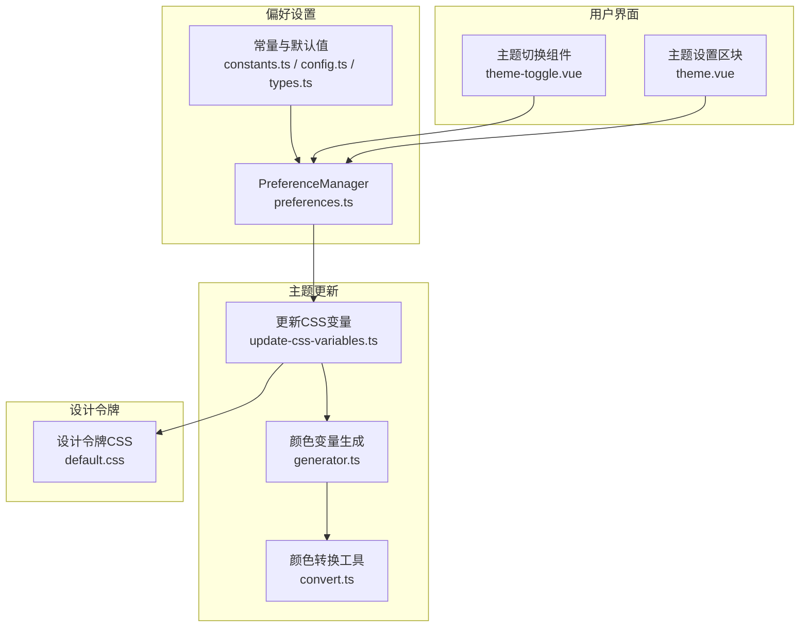
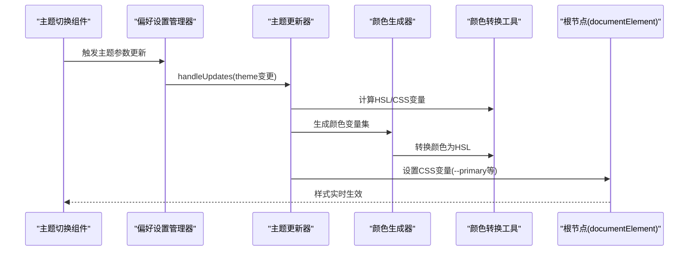
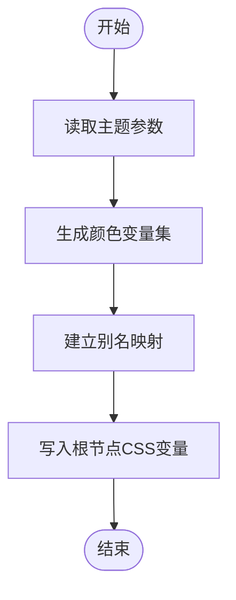
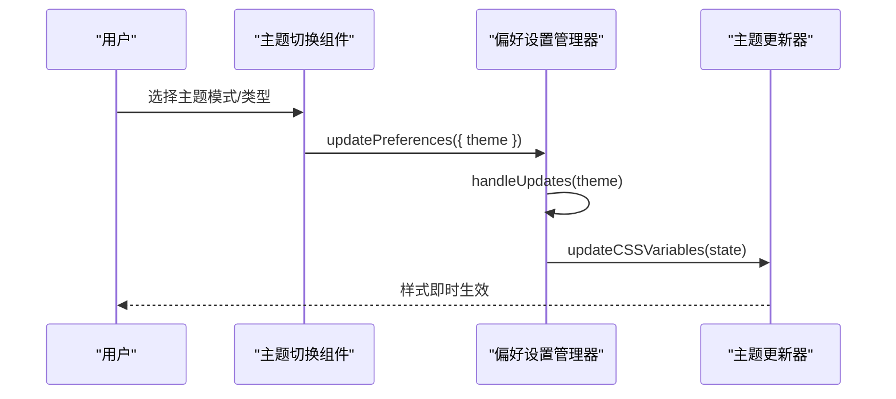
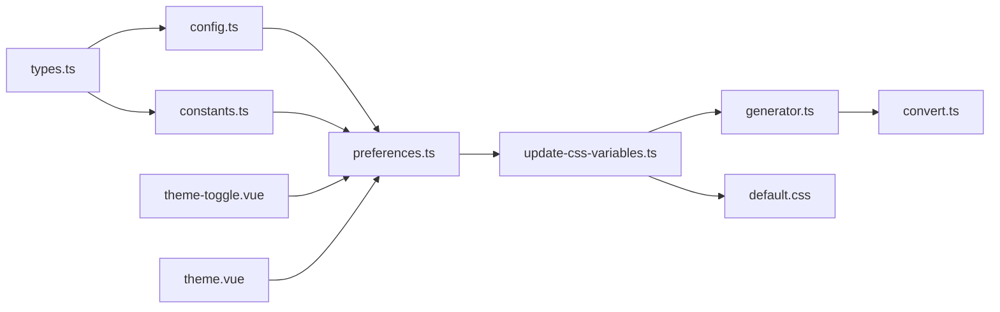

# 主题定制开发

<cite>
**本文引用的文件**
- [packages/@core/preferences/src/update-css-variables.ts](file://packages/@core/preferences/src/update-css-variables.ts)
- [packages/@core/preferences/src/preferences.ts](file://packages/@core/preferences/src/preferences.ts)
- [packages/@core/preferences/src/constants.ts](file://packages/@core/preferences/src/constants.ts)
- [packages/@core/preferences/src/config.ts](file://packages/@core/preferences/src/config.ts)
- [packages/@core/preferences/src/types.ts](file://packages/@core/preferences/src/types.ts)
- [packages/@core/base/design/src/design-tokens/default.css](file://packages/@core/base/design/src/design-tokens/default.css)
- [packages/@core/base/shared/src/color/generator.ts](file://packages/@core/base/shared/src/color/generator.ts)
- [packages/@core/base/shared/src/color/convert.ts](file://packages/@core/base/shared/src/color/convert.ts)
- [packages/effects/layouts/src/widgets/theme-toggle/theme-toggle.vue](file://packages/effects/layouts/src/widgets/theme-toggle/theme-toggle.vue)
- [packages/effects/layouts/src/widgets/preferences/blocks/theme/theme.vue](file://packages/effects/layouts/src/widgets/preferences/blocks/theme/theme.vue)
</cite>

## 目录

1. [简介](#简介)
2. [项目结构](#项目结构)
3. [核心组件](#核心组件)
4. [架构总览](#架构总览)
5. [详细组件分析](#详细组件分析)
6. [依赖关系分析](#依赖关系分析)
7. [性能考量](#性能考量)
8. [故障排查指南](#故障排查指南)
9. [结论](#结论)
10. [附录](#附录)

## 简介

本文件面向 shiyu-ui 的主题定制开发，系统性阐述主题系统的架构与实现机制，涵盖：

- 主题配置结构与参数说明（颜色系统、字体设置、布局相关主题开关）
- 样式变量的来源与映射（HSL CSS 变量、设计令牌、内置主题预设）
- 主题切换与动态更新流程（偏好设置变更到 DOM 实时生效）
- 自定义主题创建流程（变量定义、CSS 变量映射、组件样式覆盖）
- 实战案例（从简单颜色调整到复杂布局主题）
- 兼容性与性能优化建议

## 项目结构

主题系统围绕“偏好设置”“设计令牌”“颜色生成器”“主题切换组件”四个维度协同工作：

- 偏好设置模块负责持久化与响应式更新主题参数
- 设计令牌提供基础 HSL 变量与分主题样式
- 颜色生成器将输入色板转换为 HSL CSS 变量并映射到系统变量
- 主题切换组件提供用户交互入口，驱动偏好设置变更

图示来源

- [packages/@core/preferences/src/preferences.ts:1-459](file://packages/@core/preferences/src/preferences.ts#L1-L459)
- [packages/@core/preferences/src/update-css-variables.ts:1-130](file://packages/@core/preferences/src/update-css-variables.ts#L1-L130)
- [packages/@core/base/design/src/design-tokens/default.css:1-492](file://packages/@core/base/design/src/design-tokens/default.css#L1-L492)
- [packages/@core/base/shared/src/color/generator.ts:1-45](file://packages/@core/base/shared/src/color/generator.ts#L1-L45)
- [packages/@core/base/shared/src/color/convert.ts:1-63](file://packages/@core/base/shared/src/color/convert.ts#L1-L63)
- [packages/effects/layouts/src/widgets/theme-toggle/theme-toggle.vue:1-84](file://packages/effects/layouts/src/widgets/theme-toggle/theme-toggle.vue#L1-L84)
- [packages/effects/layouts/src/widgets/preferences/blocks/theme/theme.vue:1-115](file://packages/effects/layouts/src/widgets/preferences/blocks/theme/theme.vue#L1-L115)

章节来源

- [packages/@core/preferences/src/preferences.ts:1-459](file://packages/@core/preferences/src/preferences.ts#L1-L459)
- [packages/@core/preferences/src/update-css-variables.ts:1-130](file://packages/@core/preferences/src/update-css-variables.ts#L1-L130)
- [packages/@core/base/design/src/design-tokens/default.css:1-492](file://packages/@core/base/design/src/design-tokens/default.css#L1-L492)
- [packages/@core/base/shared/src/color/generator.ts:1-45](file://packages/@core/base/shared/src/color/generator.ts#L1-L45)
- [packages/@core/base/shared/src/color/convert.ts:1-63](file://packages/@core/base/shared/src/color/convert.ts#L1-L63)
- [packages/effects/layouts/src/widgets/theme-toggle/theme-toggle.vue:1-84](file://packages/effects/layouts/src/widgets/theme-toggle/theme-toggle.vue#L1-L84)
- [packages/effects/layouts/src/widgets/preferences/blocks/theme/theme.vue:1-115](file://packages/effects/layouts/src/widgets/preferences/blocks/theme/theme.vue#L1-L115)

## 核心组件

- 偏好设置管理器（PreferenceManager）
  - 负责初始化、合并、持久化与响应式更新偏好设置
  - 监听主题相关字段变更，触发 CSS 变量更新
- 主题更新器（updateCSSVariables）
  - 根据主题模式、内置类型、圆角、字体大小等参数更新根节点 CSS 变量
  - 将颜色变量映射到系统级 CSS 变量，支持明/暗/自动模式
- 颜色生成器（generatorColorVariables）
  - 将输入主色与辅助色转换为 HSL CSS 变量集，并建立别名映射
- 设计令牌（default.css）
  - 提供基础 HSL 变量与按主题分组的样式块，支持多内置主题
- 主题切换组件（theme-toggle.vue / theme.vue）
  - 提供明/暗/自动三态切换与半深色主题开关等 UI

章节来源

- [packages/@core/preferences/src/preferences.ts:206-254](file://packages/@core/preferences/src/preferences.ts#L206-L254)
- [packages/@core/preferences/src/update-css-variables.ts:12-82](file://packages/@core/preferences/src/update-css-variables.ts#L12-L82)
- [packages/@core/base/shared/src/color/generator.ts:11-43](file://packages/@core/base/shared/src/color/generator.ts#L11-L43)
- [packages/@core/base/design/src/design-tokens/default.css:1-492](file://packages/@core/base/design/src/design-tokens/default.css#L1-L492)
- [packages/effects/layouts/src/widgets/theme-toggle/theme-toggle.vue:28-34](file://packages/effects/layouts/src/widgets/theme-toggle/theme-toggle.vue#L28-L34)
- [packages/effects/layouts/src/widgets/preferences/blocks/theme/theme.vue:25-32](file://packages/effects/layouts/src/widgets/preferences/blocks/theme/theme.vue#L25-L32)

## 架构总览

主题系统通过“偏好设置 → 主题更新 → 设计令牌/HSL 变量”的链路实现动态主题切换。

图示来源

- [packages/effects/layouts/src/widgets/theme-toggle/theme-toggle.vue:28-34](file://packages/effects/layouts/src/widgets/theme-toggle/theme-toggle.vue#L28-L34)
- [packages/@core/preferences/src/preferences.ts:238-254](file://packages/@core/preferences/src/preferences.ts#L238-L254)
- [packages/@core/preferences/src/update-css-variables.ts:12-82](file://packages/@core/preferences/src/update-css-variables.ts#L12-L82)
- [packages/@core/base/shared/src/color/generator.ts:11-43](file://packages/@core/base/shared/src/color/generator.ts#L11-L43)
- [packages/@core/base/shared/src/color/convert.ts:26-30](file://packages/@core/base/shared/src/color/convert.ts#L26-L30)

## 详细组件分析

### 偏好设置与主题参数

- 主题参数（ThemePreferences）
  - builtinType：内置主题类型（如 default/violet/pink/yellow/sky-blue/green/zinc/deep-green/deep-blue/orange/rose/neutral/slate/gray/custom）
  - mode：主题模式（light/dark/auto）
  - colorPrimary/colorSuccess/colorWarning/colorDestructive：主题主色与语义色
  - fontSize：基础字号（px）
  - radius：圆角半径（rem）
  - 半深色开关：semiDarkHeader/semiDarkSidebar/semiDarkSidebarSub（仅在 light 模式生效）
- 默认值与常量
  - 默认主题参数位于默认配置文件
  - 内置主题预设包含各主题的主色、明暗主色等

章节来源

- [packages/@core/preferences/src/types.ts:317-340](file://packages/@core/preferences/src/types.ts#L317-L340)
- [packages/@core/preferences/src/config.ts:115-127](file://packages/@core/preferences/src/config.ts#L115-L127)
- [packages/@core/preferences/src/constants.ts:3-79](file://packages/@core/preferences/src/constants.ts#L3-L79)

### 设计令牌与内置主题

- 设计令牌（default.css）
  - 定义基础 HSL 变量（如 --primary/--secondary/--accent/--destructive/--success/--warning 等）
  - 提供按主题分组的样式块（如 violet/pink/rose/sky-blue/green/deep-green/orange/yellow/zinc/neutral/slate/gray），通过 data-theme 属性切换
  - 提供字体家族、背景、边框、输入、焦点环等通用变量
- 内置主题预设
  - constants 中定义了各内置主题的主色、明/暗主色与类型标识

章节来源

- [packages/@core/base/design/src/design-tokens/default.css:1-492](file://packages/@core/base/design/src/design-tokens/default.css#L1-L492)
- [packages/@core/preferences/src/constants.ts:10-79](file://packages/@core/preferences/src/constants.ts#L10-L79)

### 颜色生成与映射

- 颜色生成器
  - 接收颜色数组，基于第三方库生成 HSL 色阶变量，并建立别名映射
- 颜色转换工具
  - 提供 HSL/HSL(CSS)/RGB 转换与有效性校验
- 主题更新器
  - 将颜色变量写入根节点 CSS 变量，同时维护 --primary/--success/--warning/--destructive 别名
  - 根据主题模式设置根节点类名与 data-theme

图示来源

- [packages/@core/base/shared/src/color/generator.ts:11-43](file://packages/@core/base/shared/src/color/generator.ts#L11-L43)
- [packages/@core/base/shared/src/color/convert.ts:11-30](file://packages/@core/base/shared/src/color/convert.ts#L11-L30)
- [packages/@core/preferences/src/update-css-variables.ts:88-119](file://packages/@core/preferences/src/update-css-variables.ts#L88-L119)

章节来源

- [packages/@core/base/shared/src/color/generator.ts:11-43](file://packages/@core/base/shared/src/color/generator.ts#L11-L43)
- [packages/@core/base/shared/src/color/convert.ts:11-30](file://packages/@core/base/shared/src/color/convert.ts#L11-L30)
- [packages/@core/preferences/src/update-css-variables.ts:88-119](file://packages/@core/preferences/src/update-css-variables.ts#L88-L119)

### 主题切换与动态更新

- 用户交互
  - 主题切换组件提供明/暗/自动三态切换
  - 主题设置区块提供半深色开关与主题类型选择
- 响应式更新
  - 偏好设置管理器监听主题字段变更，调用主题更新器
  - 主题更新器根据模式设置根节点类名与 data-theme，更新圆角与字体大小，并刷新颜色变量

图示来源

- [packages/effects/layouts/src/widgets/theme-toggle/theme-toggle.vue:28-34](file://packages/effects/layouts/src/widgets/theme-toggle/theme-toggle.vue#L28-L34)
- [packages/effects/layouts/src/widgets/preferences/blocks/theme/theme.vue:25-32](file://packages/effects/layouts/src/widgets/preferences/blocks/theme/theme.vue#L25-L32)
- [packages/@core/preferences/src/preferences.ts:238-254](file://packages/@core/preferences/src/preferences.ts#L238-L254)
- [packages/@core/preferences/src/update-css-variables.ts:12-82](file://packages/@core/preferences/src/update-css-variables.ts#L12-L82)

章节来源

- [packages/effects/layouts/src/widgets/theme-toggle/theme-toggle.vue:28-34](file://packages/effects/layouts/src/widgets/theme-toggle/theme-toggle.vue#L28-L34)
- [packages/effects/layouts/src/widgets/preferences/blocks/theme/theme.vue:25-32](file://packages/effects/layouts/src/widgets/preferences/blocks/theme/theme.vue#L25-L32)
- [packages/@core/preferences/src/preferences.ts:238-254](file://packages/@core/preferences/src/preferences.ts#L238-L254)
- [packages/@core/preferences/src/update-css-variables.ts:12-82](file://packages/@core/preferences/src/update-css-variables.ts#L12-L82)

### 自定义主题创建流程

- 步骤一：定义样式变量
  - 在设计令牌中新增或复用 HSL 变量，或通过主题更新器写入根节点 CSS 变量
- 步骤二：建立 CSS 变量映射
  - 使用颜色生成器将输入色板转换为 HSL 变量集，并建立别名映射（如 --primary-500 → --primary）
- 步骤三：组件样式覆盖
  - 在组件样式中引用系统变量（如 var(--primary)），确保随主题变量联动
- 步骤四：主题切换与持久化
  - 通过偏好设置更新主题参数，触发主题更新器，实现动态切换与持久化

章节来源

- [packages/@core/base/design/src/design-tokens/default.css:1-492](file://packages/@core/base/design/src/design-tokens/default.css#L1-L492)
- [packages/@core/preferences/src/update-css-variables.ts:88-119](file://packages/@core/preferences/src/update-css-variables.ts#L88-L119)
- [packages/@core/base/shared/src/color/generator.ts:11-43](file://packages/@core/base/shared/src/color/generator.ts#L11-L43)

### 实战案例

- 案例一：调整主色与成功色
  - 在偏好设置中更新 colorPrimary 与 colorSuccess，主题更新器会生成对应 HSL 变量并映射到系统变量，组件即刻生效
- 案例二：切换内置主题
  - 将 builtinType 切换为 violet/pink/rose 等，根节点 data-theme 与样式块随之切换
- 案例三：启用半深色主题
  - 在 light 模式下开启 semiDarkHeader/semiDarkSidebar/semiDarkSidebarSub，实现局部暗色风格
- 案例四：调整圆角与字体大小
  - 更新 radius（rem）与 fontSize（px），影响全局圆角与字体体系

章节来源

- [packages/@core/preferences/src/update-css-variables.ts:65-81](file://packages/@core/preferences/src/update-css-variables.ts#L65-L81)
- [packages/@core/preferences/src/config.ts:115-127](file://packages/@core/preferences/src/config.ts#L115-L127)
- [packages/@core/base/design/src/design-tokens/default.css:85-110](file://packages/@core/base/design/src/design-tokens/default.css#L85-L110)

## 依赖关系分析

- 偏好设置管理器依赖常量与默认配置，负责合并与持久化
- 主题更新器依赖颜色生成器与转换工具，负责将颜色映射到 CSS 变量
- 设计令牌提供基础变量与内置主题样式块
- 主题切换组件与设置区块驱动偏好设置变更

图示来源

- [packages/@core/preferences/src/types.ts:317-340](file://packages/@core/preferences/src/types.ts#L317-L340)
- [packages/@core/preferences/src/config.ts:115-127](file://packages/@core/preferences/src/config.ts#L115-L127)
- [packages/@core/preferences/src/constants.ts:3-79](file://packages/@core/preferences/src/constants.ts#L3-L79)
- [packages/@core/preferences/src/preferences.ts:110-158](file://packages/@core/preferences/src/preferences.ts#L110-L158)
- [packages/@core/preferences/src/update-css-variables.ts:12-82](file://packages/@core/preferences/src/update-css-variables.ts#L12-L82)
- [packages/@core/base/shared/src/color/generator.ts:11-43](file://packages/@core/base/shared/src/color/generator.ts#L11-L43)
- [packages/@core/base/shared/src/color/convert.ts:11-30](file://packages/@core/base/shared/src/color/convert.ts#L11-L30)
- [packages/@core/base/design/src/design-tokens/default.css:1-492](file://packages/@core/base/design/src/design-tokens/default.css#L1-L492)
- [packages/effects/layouts/src/widgets/theme-toggle/theme-toggle.vue:28-34](file://packages/effects/layouts/src/widgets/theme-toggle/theme-toggle.vue#L28-L34)
- [packages/effects/layouts/src/widgets/preferences/blocks/theme/theme.vue:25-32](file://packages/effects/layouts/src/widgets/preferences/blocks/theme/theme.vue#L25-L32)

章节来源

- [packages/@core/preferences/src/types.ts:317-340](file://packages/@core/preferences/src/types.ts#L317-L340)
- [packages/@core/preferences/src/config.ts:115-127](file://packages/@core/preferences/src/config.ts#L115-L127)
- [packages/@core/preferences/src/constants.ts:3-79](file://packages/@core/preferences/src/constants.ts#L3-L79)
- [packages/@core/preferences/src/preferences.ts:110-158](file://packages/@core/preferences/src/preferences.ts#L110-L158)
- [packages/@core/preferences/src/update-css-variables.ts:12-82](file://packages/@core/preferences/src/update-css-variables.ts#L12-L82)
- [packages/@core/base/shared/src/color/generator.ts:11-43](file://packages/@core/base/shared/src/color/generator.ts#L11-L43)
- [packages/@core/base/shared/src/color/convert.ts:11-30](file://packages/@core/base/shared/src/color/convert.ts#L11-L30)
- [packages/@core/base/design/src/design-tokens/default.css:1-492](file://packages/@core/base/design/src/design-tokens/default.css#L1-L492)
- [packages/effects/layouts/src/widgets/theme-toggle/theme-toggle.vue:28-34](file://packages/effects/layouts/src/widgets/theme-toggle/theme-toggle.vue#L28-L34)
- [packages/effects/layouts/src/widgets/preferences/blocks/theme/theme.vue:25-32](file://packages/effects/layouts/src/widgets/preferences/blocks/theme/theme.vue#L25-L32)

## 性能考量

- 变更节流
  - 偏好设置保存采用防抖策略，减少频繁写入缓存与样式更新
- 最小化 DOM 操作
  - 通过一次性设置 CSS 变量与类名，避免多次重排/重绘
- 按需更新
  - 仅当主题相关字段发生变更时才触发样式更新
- 内置主题预设
  - 使用 data-theme 与分主题样式块，避免逐元素样式覆盖

章节来源

- [packages/@core/preferences/src/preferences.ts:47](file://packages/@core/preferences/src/preferences.ts#L47)
- [packages/@core/preferences/src/preferences.ts:238-254](file://packages/@core/preferences/src/preferences.ts#L238-L254)
- [packages/@core/preferences/src/update-css-variables.ts:12-82](file://packages/@core/preferences/src/update-css-variables.ts#L12-L82)

## 故障排查指南

- 主题未生效
  - 检查根节点是否正确设置 data-theme 与类名（dark/light）
  - 确认颜色变量已写入根节点 CSS 变量
- 切换自动模式无效
  - 确认系统主题监听事件已绑定，且当前模式为 auto
- 半深色开关不可用
  - 仅在 light 模式下可用；确认布局类型与开关依赖条件满足
- 字体大小/圆角未变化
  - 确认 fontSize 与 radius 已更新，且根节点 CSS 变量已写入

章节来源

- [packages/@core/preferences/src/update-css-variables.ts:23-35](file://packages/@core/preferences/src/update-css-variables.ts#L23-L35)
- [packages/@core/preferences/src/update-css-variables.ts:121-127](file://packages/@core/preferences/src/update-css-variables.ts#L121-L127)
- [packages/effects/layouts/src/widgets/preferences/blocks/theme/theme.vue:87-112](file://packages/effects/layouts/src/widgets/preferences/blocks/theme/theme.vue#L87-L112)
- [packages/@core/preferences/src/update-css-variables.ts:65-81](file://packages/@core/preferences/src/update-css-variables.ts#L65-L81)

## 结论

shiyu-ui 的主题系统以“偏好设置 + 设计令牌 + 颜色生成器 + 主题更新器 + UI 组件”为核心闭环，具备：

- 参数化配置（颜色、字体、圆角、模式、内置主题）
- 动态更新（HSL 变量映射、data-theme 切换、明/暗/自动）
- 可扩展性（自定义主题、组件样式覆盖）
- 性能友好（防抖、最小化 DOM 操作）

开发者可据此快速创建符合业务需求的定制主题，并在复杂布局场景中灵活组合主题能力。

## 附录

- 关键变量参考
  - 主题主色：--primary
  - 成功色：--success
  - 警告色：--warning
  - 错误色：--destructive
  - 基础字号：--font-size-base
  - 圆角：--radius
  - 数据主题：data-theme
- 常用路径
  - 偏好设置初始化与更新：[packages/@core/preferences/src/preferences.ts:110-158](file://packages/@core/preferences/src/preferences.ts#L110-L158)
  - 主题更新逻辑：[packages/@core/preferences/src/update-css-variables.ts:12-82](file://packages/@core/preferences/src/update-css-variables.ts#L12-L82)
  - 设计令牌与内置主题：[packages/@core/base/design/src/design-tokens/default.css:1-492](file://packages/@core/base/design/src/design-tokens/default.css#L1-L492)
  - 颜色生成与映射：[packages/@core/base/shared/src/color/generator.ts:11-43](file://packages/@core/base/shared/src/color/generator.ts#L11-L43)
  - 主题切换组件：[packages/effects/layouts/src/widgets/theme-toggle/theme-toggle.vue:28-34](file://packages/effects/layouts/src/widgets/theme-toggle/theme-toggle.vue#L28-L34)
  - 主题设置区块：[packages/effects/layouts/src/widgets/preferences/blocks/theme/theme.vue:25-32](file://packages/effects/layouts/src/widgets/preferences/blocks/theme/theme.vue#L25-L32)
