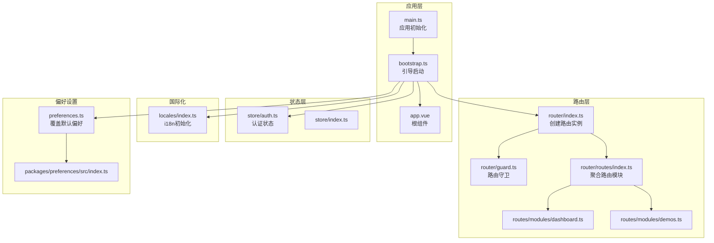
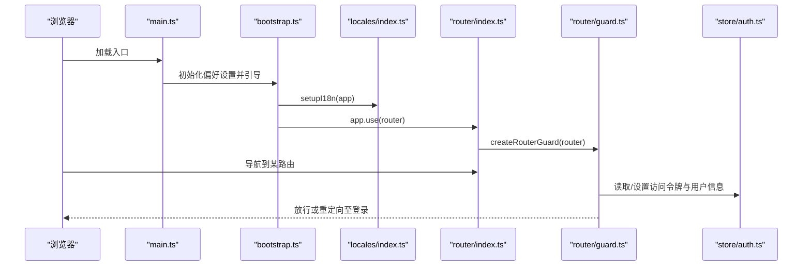
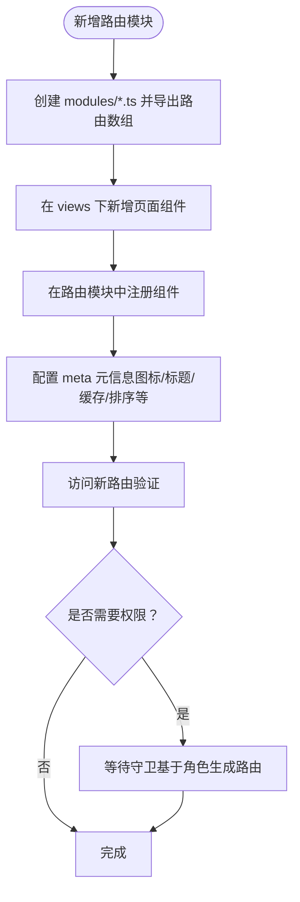
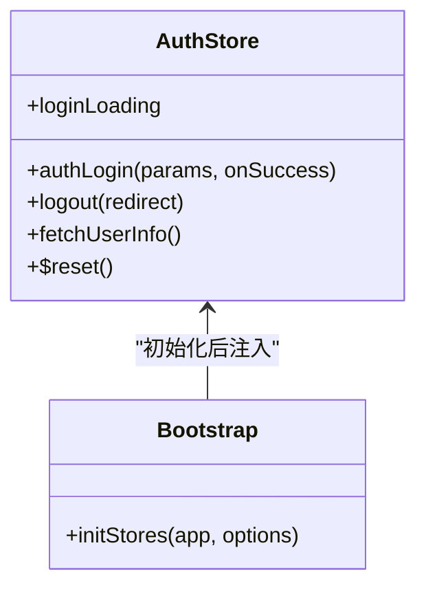
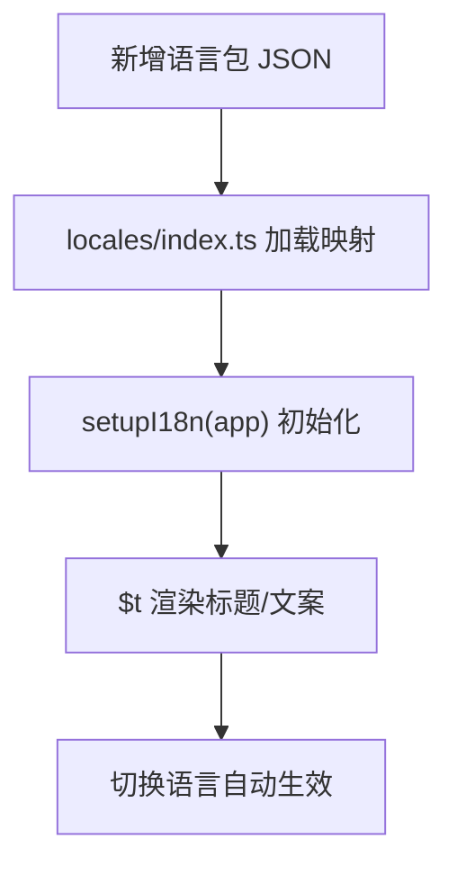
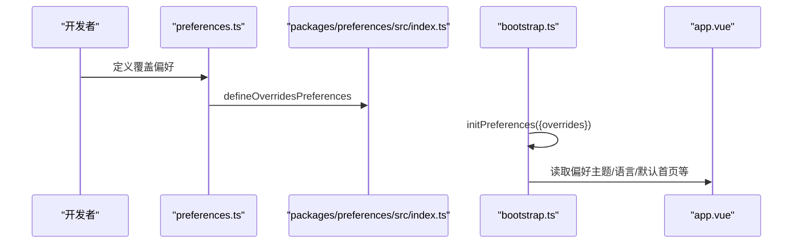
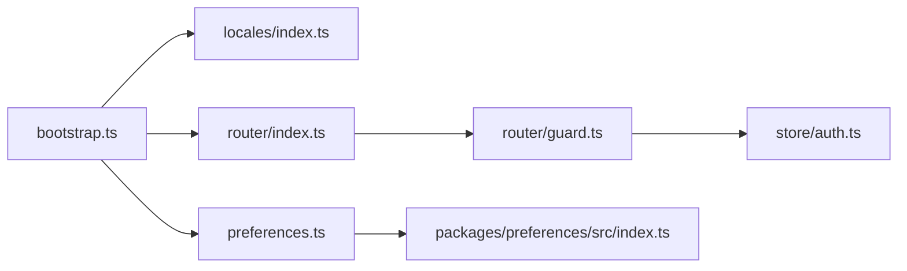

# 功能扩展实现

<cite>
**本文引用的文件**
- [apps/web-naive/src/main.ts](file://apps/web-naive/src/main.ts)
- [apps/web-naive/src/bootstrap.ts](file://apps/web-naive/src/bootstrap.ts)
- [apps/web-naive/src/preferences.ts](file://apps/web-naive/src/preferences.ts)
- [apps/web-naive/src/app.vue](file://apps/web-naive/src/app.vue)
- [apps/web-naive/src/router/index.ts](file://apps/web-naive/src/router/index.ts)
- [apps/web-naive/src/router/guard.ts](file://apps/web-naive/src/router/guard.ts)
- [apps/web-naive/src/router/routes/index.ts](file://apps/web-naive/src/router/routes/index.ts)
- [apps/web-naive/src/router/routes/modules/dashboard.ts](file://apps/web-naive/src/router/routes/modules/dashboard.ts)
- [apps/web-naive/src/router/routes/modules/demos.ts](file://apps/web-naive/src/router/routes/modules/demos.ts)
- [apps/web-naive/src/store/auth.ts](file://apps/web-naive/src/store/auth.ts)
- [apps/web-naive/src/store/index.ts](file://apps/web-naive/src/store/index.ts)
- [apps/web-naive/src/locales/index.ts](file://apps/web-naive/src/locales/index.ts)
- [packages/preferences/src/index.ts](file://packages/preferences/src/index.ts)
- [packages/stores/src/index.ts](file://packages/stores/src/index.ts)
</cite>

## 目录

1. [简介](#简介)
2. [项目结构](#项目结构)
3. [核心组件](#核心组件)
4. [架构总览](#架构总览)
5. [详细组件分析](#详细组件分析)
6. [依赖关系分析](#依赖关系分析)
7. [性能考虑](#性能考虑)
8. [故障排查指南](#故障排查指南)
9. [结论](#结论)
10. [附录](#附录)

## 简介

本文件面向希望在 shiyu-ui 项目上进行功能扩展的开发者，系统性说明三类扩展能力：路由扩展、状态扩展与 API 扩展；并给出国际化扩展与偏好设置扩展的实现路径。文档以代码为依据，结合可视化图示，帮助开发者从零开始安全高效地集成新功能模块，覆盖从简单页面到复杂业务模块的全生命周期。

## 项目结构

该项目采用多应用与多包的组织方式，核心运行时位于 apps/web-naive，基础能力通过 packages 提供。关键目录职责如下：

- apps/web-naive/src：应用入口、引导、路由、状态、国际化、偏好设置、视图与适配层
- apps/web-naive/src/router：路由定义与守卫
- apps/web-naive/src/store：状态管理（Pinia）
- apps/web-naive/src/locales：国际化资源与初始化
- apps/web-naive/src/preferences.ts：应用偏好设置覆盖
- packages：核心能力封装（如偏好设置、状态管理等）

图表来源

- [apps/web-naive/src/main.ts:1-32](file://apps/web-naive/src/main.ts#L1-L32)
- [apps/web-naive/src/bootstrap.ts:1-77](file://apps/web-naive/src/bootstrap.ts#L1-L77)
- [apps/web-naive/src/app.vue:1-57](file://apps/web-naive/src/app.vue#L1-L57)
- [apps/web-naive/src/router/index.ts:1-38](file://apps/web-naive/src/router/index.ts#L1-L38)
- [apps/web-naive/src/router/guard.ts:1-133](file://apps/web-naive/src/router/guard.ts#L1-L133)
- [apps/web-naive/src/router/routes/index.ts:1-38](file://apps/web-naive/src/router/routes/index.ts#L1-L38)
- [apps/web-naive/src/router/routes/modules/dashboard.ts:1-39](file://apps/web-naive/src/router/routes/modules/dashboard.ts#L1-L39)
- [apps/web-naive/src/router/routes/modules/demos.ts:1-45](file://apps/web-naive/src/router/routes/modules/demos.ts#L1-L45)
- [apps/web-naive/src/store/auth.ts:1-119](file://apps/web-naive/src/store/auth.ts#L1-L119)
- [apps/web-naive/src/store/index.ts:1-2](file://apps/web-naive/src/store/index.ts#L1-L2)
- [apps/web-naive/src/locales/index.ts:1-39](file://apps/web-naive/src/locales/index.ts#L1-L39)
- [apps/web-naive/src/preferences.ts:1-17](file://apps/web-naive/src/preferences.ts#L1-L17)
- [packages/preferences/src/index.ts:1-28](file://packages/preferences/src/index.ts#L1-L28)

章节来源

- [apps/web-naive/src/main.ts:1-32](file://apps/web-naive/src/main.ts#L1-L32)
- [apps/web-naive/src/bootstrap.ts:1-77](file://apps/web-naive/src/bootstrap.ts#L1-L77)
- [apps/web-naive/src/router/index.ts:1-38](file://apps/web-naive/src/router/index.ts#L1-L38)
- [apps/web-naive/src/router/routes/index.ts:1-38](file://apps/web-naive/src/router/routes/index.ts#L1-L38)

## 核心组件

- 应用初始化与引导
  - 应用入口负责初始化偏好设置、引导启动、挂载应用与移除全局 loading。参考 [apps/web-naive/src/main.ts:1-32](file://apps/web-naive/src/main.ts#L1-L32)、[apps/web-naive/src/bootstrap.ts:19-77](file://apps/web-naive/src/bootstrap.ts#L19-L77)。
- 路由系统
  - 路由实例创建、滚动行为与守卫注册；动态路由模块通过 glob 自动合并；权限守卫根据用户角色生成可访问菜单与路由。参考 [apps/web-naive/src/router/index.ts:15-38](file://apps/web-naive/src/router/index.ts#L15-L38)、[apps/web-naive/src/router/guard.ts:47-119](file://apps/web-naive/src/router/guard.ts#L47-L119)、[apps/web-naive/src/router/routes/index.ts:7-38](file://apps/web-naive/src/router/routes/index.ts#L7-L38)。
- 状态管理
  - 使用 Pinia，认证相关状态集中在 auth store，提供登录、登出、获取用户信息等方法。参考 [apps/web-naive/src/store/auth.ts:16-119](file://apps/web-naive/src/store/auth.ts#L16-L119)、[packages/stores/src/index.ts:1-4](file://packages/stores/src/index.ts#L1-L4)。
- 国际化
  - 通过 locales 包加载本地 JSON 语言包，按需动态导入，支持缺失警告与默认语言配置。参考 [apps/web-naive/src/locales/index.ts:24-36](file://apps/web-naive/src/locales/index.ts#L24-L36)。
- 偏好设置
  - 通过覆盖函数定义应用级偏好，如标题、登录过期模式、访问模式等；支持扩展自定义字段。参考 [apps/web-naive/src/preferences.ts:8-17](file://apps/web-naive/src/preferences.ts#L8-L17)、[packages/preferences/src/index.ts:15-25](file://packages/preferences/src/index.ts#L15-L25)。

章节来源

- [apps/web-naive/src/main.ts:1-32](file://apps/web-naive/src/main.ts#L1-L32)
- [apps/web-naive/src/bootstrap.ts:19-77](file://apps/web-naive/src/bootstrap.ts#L19-L77)
- [apps/web-naive/src/router/index.ts:15-38](file://apps/web-naive/src/router/index.ts#L15-L38)
- [apps/web-naive/src/router/guard.ts:47-119](file://apps/web-naive/src/router/guard.ts#L47-L119)
- [apps/web-naive/src/router/routes/index.ts:7-38](file://apps/web-naive/src/router/routes/index.ts#L7-L38)
- [apps/web-naive/src/store/auth.ts:16-119](file://apps/web-naive/src/store/auth.ts#L16-L119)
- [apps/web-naive/src/locales/index.ts:24-36](file://apps/web-naive/src/locales/index.ts#L24-L36)
- [apps/web-naive/src/preferences.ts:8-17](file://apps/web-naive/src/preferences.ts#L8-L17)
- [packages/preferences/src/index.ts:15-25](file://packages/preferences/src/index.ts#L15-L25)

## 架构总览

下图展示从应用启动到路由守卫、状态管理与国际化的关键交互：

图表来源

- [apps/web-naive/src/main.ts:9-32](file://apps/web-naive/src/main.ts#L9-L32)
- [apps/web-naive/src/bootstrap.ts:43-57](file://apps/web-naive/src/bootstrap.ts#L43-L57)
- [apps/web-naive/src/router/index.ts:35-36](file://apps/web-naive/src/router/index.ts#L35-L36)
- [apps/web-naive/src/router/guard.ts:47-119](file://apps/web-naive/src/router/guard.ts#L47-L119)
- [apps/web-naive/src/store/auth.ts:28-79](file://apps/web-naive/src/store/auth.ts#L28-L79)

## 详细组件分析

### 路由扩展

- 扩展方式
  - 新增路由模块文件于 apps/web-naive/src/router/routes/modules 下，导出 RouteRecordRaw 数组；系统会通过 glob 自动合并。参考 [apps/web-naive/src/router/routes/index.ts:7-16](file://apps/web-naive/src/router/routes/index.ts#L7-L16)。
  - 路由元信息支持图标、排序、标题、是否缓存、是否固定标签页等，便于菜单与标签页联动。参考 [apps/web-naive/src/router/routes/modules/dashboard.ts:7-35](file://apps/web-naive/src/router/routes/modules/dashboard.ts#L7-L35)、[apps/web-naive/src/router/routes/modules/demos.ts:7-42](file://apps/web-naive/src/router/routes/modules/demos.ts#L7-L42)。
  - 路由历史模式与基础路径由环境变量控制，滚动行为支持平滑定位与返回位置恢复。参考 [apps/web-naive/src/router/index.ts:15-30](file://apps/web-naive/src/router/index.ts#L15-L30)。
- 集成流程
  - 创建模块文件并导出路由数组 → 在对应视图目录新增页面组件 → 在路由模块中注册组件 → 如需权限控制，在 meta 中设置 ignoreAccess 或配合角色生成策略。
- 权限与导航
  - 未登录且非核心路由将被重定向至登录页，并携带 redirect 参数；已登录但未生成动态路由时，守卫会基于用户角色生成可访问菜单与路由。参考 [apps/web-naive/src/router/guard.ts:47-119](file://apps/web-naive/src/router/guard.ts#L47-L119)。

图表来源

- [apps/web-naive/src/router/routes/index.ts:7-16](file://apps/web-naive/src/router/routes/index.ts#L7-L16)
- [apps/web-naive/src/router/routes/modules/dashboard.ts:1-39](file://apps/web-naive/src/router/routes/modules/dashboard.ts#L1-L39)
- [apps/web-naive/src/router/guard.ts:47-119](file://apps/web-naive/src/router/guard.ts#L47-L119)

章节来源

- [apps/web-naive/src/router/routes/index.ts:7-38](file://apps/web-naive/src/router/routes/index.ts#L7-L38)
- [apps/web-naive/src/router/routes/modules/dashboard.ts:1-39](file://apps/web-naive/src/router/routes/modules/dashboard.ts#L1-L39)
- [apps/web-naive/src/router/routes/modules/demos.ts:1-45](file://apps/web-naive/src/router/routes/modules/demos.ts#L1-L45)
- [apps/web-naive/src/router/index.ts:15-38](file://apps/web-naive/src/router/index.ts#L15-L38)
- [apps/web-naive/src/router/guard.ts:47-119](file://apps/web-naive/src/router/guard.ts#L47-L119)

### 状态扩展

- 扩展方式
  - 在 apps/web-naive/src/store 下新增模块文件，使用 defineStore 定义状态与方法；通过 initStores(app, { namespace }) 注入命名空间隔离。参考 [apps/web-naive/src/bootstrap.ts:47](file://apps/web-naive/src/bootstrap.ts#L47)、[packages/stores/src/index.ts:1-4](file://packages/stores/src/index.ts#L1-L4)。
  - 认证状态示例：登录、登出、获取用户信息、设置访问码与令牌等。参考 [apps/web-naive/src/store/auth.ts:16-119](file://apps/web-naive/src/store/auth.ts#L16-L119)。
- 集成流程
  - 新建 store 文件 → 在 bootstrap 中初始化 → 在组件中通过 storeToRefs/useStore 访问状态与方法。
- 注意事项
  - 使用命名空间避免多应用/多版本冲突；Pinia 默认响应式，注意避免深层对象的非响应式写法导致的更新问题。

图表来源

- [apps/web-naive/src/store/auth.ts:16-119](file://apps/web-naive/src/store/auth.ts#L16-L119)
- [apps/web-naive/src/bootstrap.ts:47](file://apps/web-naive/src/bootstrap.ts#L47)

章节来源

- [apps/web-naive/src/store/auth.ts:16-119](file://apps/web-naive/src/store/auth.ts#L16-L119)
- [apps/web-naive/src/bootstrap.ts:47](file://apps/web-naive/src/bootstrap.ts#L47)
- [packages/stores/src/index.ts:1-4](file://packages/stores/src/index.ts#L1-L4)

### API 扩展

- 扩展方式
  - 在 apps/web-naive/src/api 下新增模块文件，集中导出接口方法；在业务组件中调用，统一错误处理与通知提示。参考 [apps/web-naive/src/store/auth.ts:13](file://apps/web-naive/src/store/auth.ts#L13)。
  - 请求封装与拦截器建议在 request.ts 中统一处理（如鉴权头、错误转换、重试策略等），并在各模块 API 中复用。
- 集成流程
  - 新建 API 模块 → 实现具体请求方法 → 在 store 或组件中调用 → 统一处理响应与异常。
- 最佳实践
  - 对外暴露稳定的方法签名，内部统一错误提示与日志记录；对敏感接口增加权限校验与降级策略。

章节来源

- [apps/web-naive/src/store/auth.ts:13](file://apps/web-naive/src/store/auth.ts#L13)

### 国际化扩展

- 实现方法
  - 在 apps/web-naive/src/locales/langs 下新增语言目录与 JSON 文件，系统通过 glob 自动加载；支持从服务端动态拉取语言包。参考 [apps/web-naive/src/locales/index.ts:12-27](file://apps/web-naive/src/locales/index.ts#L12-L27)。
  - 标题与菜单文案通过 $t 函数解析，支持多语言切换。参考 [apps/web-naive/src/app.vue:25-33](file://apps/web-naive/src/app.vue#L25-L33)。
- 集成流程
  - 新增语言包 → 在 locales/index.ts 中确认加载映射 → 在路由模块与视图中使用 $t 渲染标题与文案 → 切换语言时自动生效。
- 注意事项
  - 保持键名一致性与层级清晰；生产环境建议关闭缺失警告以减少冗余日志。

图表来源

- [apps/web-naive/src/locales/index.ts:12-36](file://apps/web-naive/src/locales/index.ts#L12-L36)
- [apps/web-naive/src/app.vue:25-33](file://apps/web-naive/src/app.vue#L25-L33)

章节来源

- [apps/web-naive/src/locales/index.ts:12-36](file://apps/web-naive/src/locales/index.ts#L12-L36)
- [apps/web-naive/src/app.vue:25-33](file://apps/web-naive/src/app.vue#L25-L33)

### 偏好设置扩展

- 实现方法
  - 通过 defineOverridesPreferences 覆盖默认偏好，如应用名称、登录过期模式、访问模式等。参考 [apps/web-naive/src/preferences.ts:8-17](file://apps/web-naive/src/preferences.ts#L8-L17)。
  - 通过 definePreferencesExtension 定义自定义偏好字段类型与默认值，实现配置项的类型安全与扩展性。参考 [packages/preferences/src/index.ts:19-23](file://packages/preferences/src/index.ts#L19-L23)。
- 集成流程
  - 在 preferences.ts 中定义覆盖项 → 在 bootstrap 中传入 overrides → 在组件中通过 preferences 读取配置 → 如需持久化，确保清理缓存后生效。
- 注意事项
  - 更改配置后需清理浏览器缓存，避免旧配置影响；自定义字段需与现有主题/国际化逻辑协同。

图表来源

- [apps/web-naive/src/preferences.ts:8-17](file://apps/web-naive/src/preferences.ts#L8-L17)
- [packages/preferences/src/index.ts:15-25](file://packages/preferences/src/index.ts#L15-L25)
- [apps/web-naive/src/bootstrap.ts:43-44](file://apps/web-naive/src/bootstrap.ts#L43-L44)
- [apps/web-naive/src/app.vue:25-39](file://apps/web-naive/src/app.vue#L25-L39)

章节来源

- [apps/web-naive/src/preferences.ts:8-17](file://apps/web-naive/src/preferences.ts#L8-L17)
- [packages/preferences/src/index.ts:15-25](file://packages/preferences/src/index.ts#L15-L25)
- [apps/web-naive/src/bootstrap.ts:43-44](file://apps/web-naive/src/bootstrap.ts#L43-L44)
- [apps/web-naive/src/app.vue:25-39](file://apps/web-naive/src/app.vue#L25-L39)

### 完整示例：从简单页面到复杂模块

- 示例目标：新增一个“统计看板”页面，支持权限控制与标签页固定。
- 步骤
  1. 路由扩展：在 modules 下新增 dashboard/statistics.ts，导出路由数组，设置图标、标题、排序与 affixTab。参考 [apps/web-naive/src/router/routes/modules/dashboard.ts:1-39](file://apps/web-naive/src/router/routes/modules/dashboard.ts#L1-L39)。
  2. 视图扩展：在 views/dashboard 下新增 index.vue，编写页面逻辑与组件。
  3. 状态扩展：如需全局状态，新建 store 模块并在 bootstrap 中初始化。参考 [apps/web-naive/src/bootstrap.ts:47](file://apps/web-naive/src/bootstrap.ts#L47)、[apps/web-naive/src/store/auth.ts:16-119](file://apps/web-naive/src/store/auth.ts#L16-L119)。
  4. 国际化扩展：在 locales/langs/\*/page.json 中新增键值，使用 $t 渲染标题与文案。参考 [apps/web-naive/src/locales/index.ts:24-36](file://apps/web-naive/src/locales/index.ts#L24-L36)。
  5. 偏好设置扩展：如需默认打开该页面，可在偏好设置中配置默认首页或标签页策略。参考 [apps/web-naive/src/preferences.ts:8-17](file://apps/web-naive/src/preferences.ts#L8-L17)。
  6. 测试与验证：访问新路由，检查权限守卫、标题国际化与标签页固定效果；必要时在 guard 中调整角色生成逻辑。参考 [apps/web-naive/src/router/guard.ts:47-119](file://apps/web-naive/src/router/guard.ts#L47-L119)。

章节来源

- [apps/web-naive/src/router/routes/modules/dashboard.ts:1-39](file://apps/web-naive/src/router/routes/modules/dashboard.ts#L1-L39)
- [apps/web-naive/src/store/auth.ts:16-119](file://apps/web-naive/src/store/auth.ts#L16-L119)
- [apps/web-naive/src/locales/index.ts:24-36](file://apps/web-naive/src/locales/index.ts#L24-L36)
- [apps/web-naive/src/preferences.ts:8-17](file://apps/web-naive/src/preferences.ts#L8-L17)
- [apps/web-naive/src/router/guard.ts:47-119](file://apps/web-naive/src/router/guard.ts#L47-L119)

## 依赖关系分析

- 组件耦合
  - bootstrap.ts 作为中枢，串联 i18n、路由、状态、指令与插件初始化，耦合度高但职责清晰。
  - 路由守卫依赖 store 与偏好设置，形成“权限—状态—配置”的闭环。
- 外部依赖
  - Vue Router、Pinia、Naive UI、@vben/\* 生态包；通过 packages 封装统一对外接口。
- 循环依赖
  - 未见明显循环依赖；路由模块通过 index.ts 聚合，避免直接互相引用。

图表来源

- [apps/web-naive/src/bootstrap.ts:43-57](file://apps/web-naive/src/bootstrap.ts#L43-L57)
- [apps/web-naive/src/router/index.ts:35-36](file://apps/web-naive/src/router/index.ts#L35-L36)
- [apps/web-naive/src/router/guard.ts:47-119](file://apps/web-naive/src/router/guard.ts#L47-L119)
- [apps/web-naive/src/store/auth.ts:16-119](file://apps/web-naive/src/store/auth.ts#L16-L119)
- [apps/web-naive/src/preferences.ts:8-17](file://apps/web-naive/src/preferences.ts#L8-L17)
- [packages/preferences/src/index.ts:15-25](file://packages/preferences/src/index.ts#L15-L25)

章节来源

- [apps/web-naive/src/bootstrap.ts:43-57](file://apps/web-naive/src/bootstrap.ts#L43-L57)
- [apps/web-naive/src/router/guard.ts:47-119](file://apps/web-naive/src/router/guard.ts#L47-L119)
- [apps/web-naive/src/store/auth.ts:16-119](file://apps/web-naive/src/store/auth.ts#L16-L119)
- [apps/web-naive/src/preferences.ts:8-17](file://apps/web-naive/src/preferences.ts#L8-L17)
- [packages/preferences/src/index.ts:15-25](file://packages/preferences/src/index.ts#L15-L25)

## 性能考虑

- 路由懒加载
  - 路由组件采用异步加载，减少首屏体积；建议将大组件拆分，避免一次性加载过多模块。参考 [apps/web-naive/src/router/routes/modules/dashboard.ts:18](file://apps/web-naive/src/router/routes/modules/dashboard.ts#L18)、[apps/web-naive/src/router/routes/modules/demos.ts:22-31](file://apps/web-naive/src/router/routes/modules/demos.ts#L22-L31)。
- 进度条与滚动优化
  - 守卫中启用/关闭进度条，滚动行为支持平滑定位与历史位置恢复，提升用户体验。参考 [apps/web-naive/src/router/index.ts:22-27](file://apps/web-naive/src/router/index.ts#L22-L27)、[apps/web-naive/src/router/guard.ts:21-40](file://apps/web-naive/src/router/guard.ts#L21-L40)。
- 状态与缓存
  - 使用 keepAlive 与 affixTab 控制标签页缓存与固定，降低重复渲染成本。参考 [apps/web-naive/src/router/routes/modules/demos.ts:9](file://apps/web-naive/src/router/routes/modules/demos.ts#L9)、[apps/web-naive/src/router/routes/modules/dashboard.ts:20](file://apps/web-naive/src/router/routes/modules/dashboard.ts#L20)。

## 故障排查指南

- 登录后无法跳转或反复重定向
  - 检查登录成功后的路由跳转逻辑与 homePath/defaultHomePath 配置；确认守卫中的 redirect 参数传递。参考 [apps/web-naive/src/store/auth.ts:59-62](file://apps/web-naive/src/store/auth.ts#L59-L62)、[apps/web-naive/src/router/guard.ts:109-117](file://apps/web-naive/src/router/guard.ts#L109-L117)。
- 未登录访问受保护路由
  - 确认 ignoreAccess 与 accessToken 的判断逻辑；检查登录页路径常量。参考 [apps/web-naive/src/router/guard.ts:66-86](file://apps/web-naive/src/router/guard.ts#L66-L86)。
- 国际化文案不生效
  - 检查 locales 映射与 JSON 键名一致性；确认 setupI18n 的默认语言与缺失警告配置。参考 [apps/web-naive/src/locales/index.ts:14-27](file://apps/web-naive/src/locales/index.ts#L14-L27)。
- 偏好设置不生效
  - 更改配置后清理浏览器缓存；确认命名空间与 overrides 传入正确。参考 [apps/web-naive/src/main.ts:17-20](file://apps/web-naive/src/main.ts#L17-L20)、[apps/web-naive/src/preferences.ts:8-17](file://apps/web-naive/src/preferences.ts#L8-L17)。

章节来源

- [apps/web-naive/src/store/auth.ts:59-62](file://apps/web-naive/src/store/auth.ts#L59-L62)
- [apps/web-naive/src/router/guard.ts:66-117](file://apps/web-naive/src/router/guard.ts#L66-L117)
- [apps/web-naive/src/locales/index.ts:14-27](file://apps/web-naive/src/locales/index.ts#L14-L27)
- [apps/web-naive/src/main.ts:17-20](file://apps/web-naive/src/main.ts#L17-L20)
- [apps/web-naive/src/preferences.ts:8-17](file://apps/web-naive/src/preferences.ts#L8-L17)

## 结论

通过路由模块化、状态模块化与 API 模块化，shiyu-ui 提供了清晰的功能扩展路径。结合国际化与偏好设置扩展，开发者可以在不破坏现有架构的前提下快速集成新功能。建议遵循“先路由、后视图、再状态与 API、最后国际化与偏好”的顺序，配合守卫与命名空间隔离，确保扩展的安全与可维护性。

## 附录

- 快速清单
  - 路由：在 modules 下新增文件并导出路由数组 → 在 views 下新增组件 → 配置 meta → 访问验证
  - 状态：新建 store 文件 → 在 bootstrap 初始化 → 在组件中使用
  - API：在 api 下新增模块 → 统一请求封装 → 在 store/组件中调用
  - 国际化：新增语言包 → 在 locales/index.ts 加载 → 使用 $t 渲染
  - 偏好设置：在 preferences.ts 覆盖默认值 → 通过 definePreferencesExtension 定义自定义字段 → 清理缓存生效
