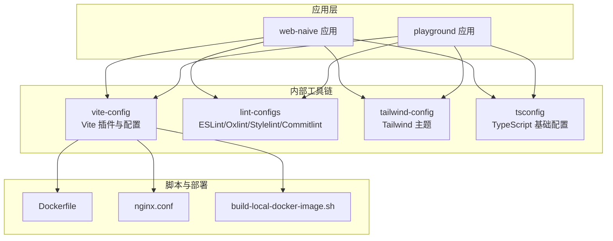
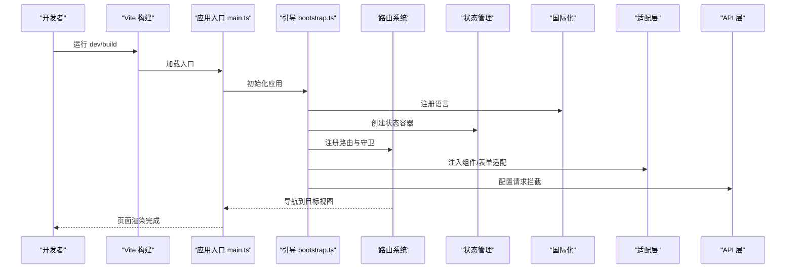
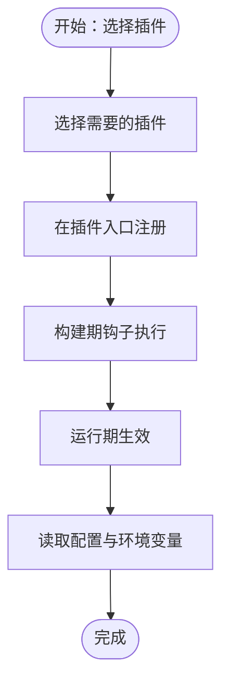
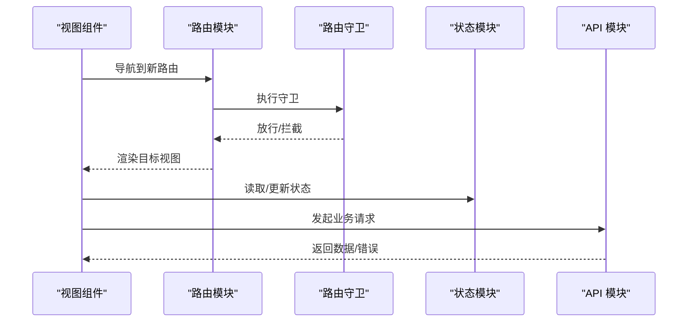
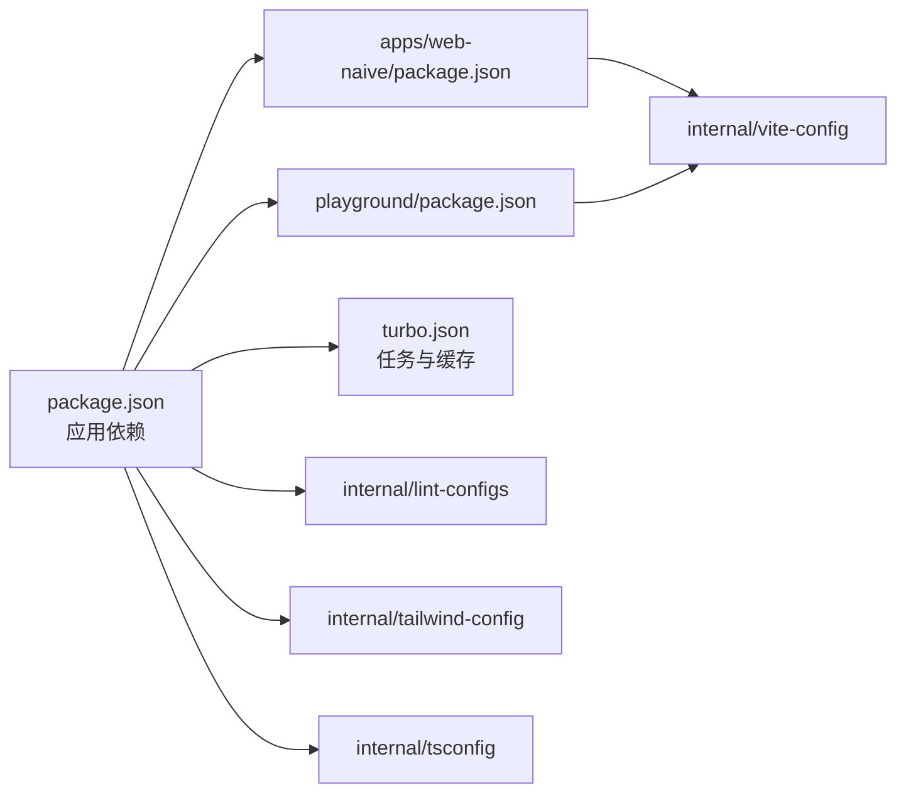

# 扩展开发

<cite>
**本文引用的文件**
- [apps/web-naive/package.json](file://apps/web-naive/package.json)
- [playground/package.json](file://playground/package.json)
- [package.json](file://package.json)
- [turbo.json](file://turbo.json)
- [README.md](file://README.md)
- [apps/web-naive/src/main.ts](file://apps/web-naive/src/main.ts)
- [apps/web-naive/src/bootstrap.ts](file://apps/web-naive/src/bootstrap.ts)
- [apps/web-naive/src/app.vue](file://apps/web-naive/src/app.vue)
- [apps/web-naive/src/router/index.ts](file://apps/web-naive/src/router/index.ts)
- [apps/web-naive/src/router/guard.ts](file://apps/web-naive/src/router/guard.ts)
- [apps/web-naive/src/store/index.ts](file://apps/web-naive/src/store/index.ts)
- [apps/web-naive/src/store/auth.ts](file://apps/web-naive/src/store/auth.ts)
- [apps/web-naive/src/layouts/basic.vue](file://apps/web-naive/src/layouts/basic.vue)
- [apps/web-naive/src/locales/index.ts](file://apps/web-naive/src/locales/index.ts)
- [apps/web-naive/src/preferences.ts](file://apps/web-naive/src/preferences.ts)
- [apps/web-naive/src/views/_core/authentication/login.vue](file://apps/web-naive/src/views/_core/authentication/login.vue)
- [apps/web-naive/src/views/fallback/not-found.vue](file://apps/web-naive/src/views/fallback/not-found.vue)
- [apps/web-naive/src/views/system/user/list.vue](file://apps/web-naive/src/views/system/user/list.vue)
- [apps/web-naive/src/views/system/user/modules/form.vue](file://apps/web-naive/src/views/system/user/modules/form.vue)
- [apps/web-naive/src/adapter/component/index.ts](file://apps/web-naive/src/adapter/component/index.ts)
- [apps/web-naive/src/adapter/form.ts](file://apps/web-naive/src/adapter/form.ts)
- [apps/web-naive/src/adapter/naive.ts](file://apps/web-naive/src/adapter/naive.ts)
- [apps/web-naive/src/adapter/vxe-table.ts](file://apps/web-naive/src/adapter/vxe-table.ts)
- [apps/web-naive/src/api/core/auth.ts](file://apps/web-naive/src/api/core/auth.ts)
- [apps/web-naive/src/api/core/index.ts](file://apps/web-naive/src/api/core/index.ts)
- [apps/web-naive/src/api/system/user.ts](file://apps/web-naive/src/api/system/user.ts)
- [apps/web-naive/src/api/request.ts](file://apps/web-naive/src/api/request.ts)
- [apps/web-naive/src/router/routes/core.ts](file://apps/web-naive/src/router/routes/core.ts)
- [apps/web-naive/src/router/routes/modules/dashboard.ts](file://apps/web-naive/src/router/routes/modules/dashboard.ts)
- [apps/web-naive/src/router/routes/modules/demos.ts](file://apps/web-naive/src/router/routes/modules/demos.ts)
- [apps/web-naive/src/router/routes/modules/vben.ts](file://apps/web-naive/src/router/routes/modules/vben.ts)
- [apps/web-naive/src/router/access.ts](file://apps/web-naive/src/router/access.ts)
- [playground/src/main.ts](file://playground/src/main.ts)
- [playground/src/bootstrap.ts](file://playground/src/bootstrap.ts)
- [playground/src/app.vue](file://playground/src/app.vue)
- [playground/src/router/index.ts](file://playground/src/router/index.ts)
- [playground/src/router/guard.ts](file://playground/src/router/guard.ts)
- [playground/src/store/index.ts](file://playground/src/store/index.ts)
- [playground/src/store/auth.ts](file://playground/src/store/auth.ts)
- [playground/src/layouts/basic.vue](file://playground/src/layouts/basic.vue)
- [playground/src/locales/index.ts](file://playground/src/locales/index.ts)
- [playground/src/preferences.ts](file://playground/src/preferences.ts)
- [playground/src/views/_core/authentication/login.vue](file://playground/src/views/_core/authentication/login.vue)
- [playground/src/views/fallback/not-found.vue](file://playground/src/views/fallback/not-found.vue)
- [playground/src/views/system/user/list.vue](file://playground/src/views/system/user/list.vue)
- [playground/src/views/system/user/modules/form.vue](file://playground/src/views/system/user/modules/form.vue)
- [playground/src/adapter/component/index.ts](file://playground/src/adapter/component/index.ts)
- [playground/src/adapter/form.ts](file://playground/src/adapter/form.ts)
- [playground/src/adapter/naive.ts](file://playground/src/adapter/naive.ts)
- [playground/src/adapter/vxe-table.ts](file://playground/src/adapter/vxe-table.ts)
- [playground/src/api/core/auth.ts](file://playground/src/api/core/auth.ts)
- [playground/src/api/core/index.ts](file://playground/src/api/core/index.ts)
- [playground/src/api/system/user.ts](file://playground/src/api/system/user.ts)
- [playground/src/api/request.ts](file://playground/src/api/request.ts)
- [playground/src/router/routes/core.ts](file://playground/src/router/routes/core.ts)
- [playground/src/router/routes/modules/dashboard.ts](file://playground/src/router/routes/modules/dashboard.ts)
- [playground/src/router/routes/modules/demos.ts](file://playground/src/router/routes/modules/demos.ts)
- [playground/src/router/routes/modules/examples.ts](file://playground/src/router/routes/modules/examples.ts)
- [playground/src/router/routes/modules/system.ts](file://playground/src/router/routes/modules/system.ts)
- [playground/src/router/routes/modules/vben.ts](file://playground/src/router/routes/modules/vben.ts)
- [playground/src/router/access.ts](file://playground/src/router/access.ts)
- [internal/vite-config/src/plugins/index.ts](file://internal/vite-config/src/plugins/index.ts)
- [internal/vite-config/src/plugins/html.ts](file://internal/vite-config/src/plugins/html.ts)
- [internal/vite-config/src/plugins/inject-metadata.ts](file://internal/vite-config/src/plugins/inject-metadata.ts)
- [internal/vite-config/src/plugins/inject-app-loading/index.ts](file://internal/vite-config/src/plugins/inject-app-loading/index.ts)
- [internal/vite-config/src/plugins/importmap.ts](file://internal/vite-config/src/plugins/importmap.ts)
- [internal/vite-config/src/plugins/nitro-mock.ts](file://internal/vite-config/src/plugins/nitro-mock.ts)
- [internal/vite-config/src/plugins/print.ts](file://internal/vite-config/src/plugins/print.ts)
- [internal/vite-config/src/plugins/tailwind-reference.ts](file://internal/vite-config/src/plugins/tailwind-reference.ts)
- [internal/vite-config/src/plugins/vxe-table.ts](file://internal/vite-config/src/plugins/vxe-table.ts)
- [internal/vite-config/src/config/application.ts](file://internal/vite-config/src/config/application.ts)
- [internal/vite-config/src/config/common.ts](file://internal/vite-config/src/config/common.ts)
- [internal/vite-config/src/config/library.ts](file://internal/vite-config/src/config/library.ts)
- [internal/vite-config/src/config/index.ts](file://internal/vite-config/src/config/index.ts)
- [internal/lint-configs/eslint-config/src/index.ts](file://internal/lint-configs/eslint-config/src/index.ts)
- [internal/lint-configs/oxlint-config/src/index.ts](file://internal/lint-configs/oxlint-config/src/index.ts)
- [internal/lint-configs/commitlint-config/index.mjs](file://internal/lint-configs/commitlint-config/index.mjs)
- [internal/lint-configs/stylelint-config/index.mjs](file://internal/lint-configs/stylelint-config/index.mjs)
- [internal/tailwind-config/src/index.ts](file://internal/tailwind-config/src/index.ts)
- [internal/tailwind-config/src/theme.css](file://internal/tailwind-config/src/theme.css)
- [internal/tsconfig/base.json](file://internal/tsconfig/base.json)
- [internal/tsconfig/web.json](file://internal/tsconfig/web.json)
- [internal/tsconfig/web-app.json](file://internal/tsconfig/web-app.json)
- [internal/tsconfig/library.json](file://internal/tsconfig/library.json)
- [internal/tsconfig/node.json](file://internal/tsconfig/node.json)
- [scripts/deploy/Dockerfile](file://scripts/deploy/Dockerfile)
- [scripts/deploy/nginx.conf](file://scripts/deploy/nginx.conf)
- [scripts/deploy/build-local-docker-image.sh](file://scripts/deploy/build-local-docker-image.sh)
- [playground/playwright.config.ts](file://playground/playwright.config.ts)
- [playground/__tests__/auth-login.spec.ts](file://playground/__tests__/auth-login.spec.ts)
</cite>

## 目录

1. [简介](#简介)
2. [项目结构](#项目结构)
3. [核心组件](#核心组件)
4. [架构总览](#架构总览)
5. [详细组件分析](#详细组件分析)
6. [依赖关系分析](#依赖关系分析)
7. [性能考虑](#性能考虑)
8. [故障排查指南](#故障排查指南)
9. [结论](#结论)
10. [附录](#附录)

## 简介

本文件面向 shiyu-ui 的扩展开发者，系统性阐述如何在现有应用中进行自定义组件开发、插件系统扩展、主题定制、功能扩展（路由、状态、API），并提供最佳实践与发布维护指南。文档以 apps/web-naive 与 playground 两个应用为蓝本，结合 internal 内部工具链与脚手架能力，帮助你在不破坏主干的前提下灵活扩展与定制。

## 项目结构

该项目采用多包（monorepo）结构，通过 Turbo 管理构建与缓存，内部提供统一的 Vite 配置、ESLint/Oxlint/Stylelint 规则、Tailwind 主题与 TS 配置。核心应用包括 web-naive 与 playground，二者共享大量基础设施与适配层。

图表来源

- [package.json:27-66](file://package.json#L27-L66)
- [turbo.json:15-47](file://turbo.json#L15-L47)
- [internal/vite-config/src/config/index.ts](file://internal/vite-config/src/config/index.ts)
- [internal/lint-configs/eslint-config/src/index.ts](file://internal/lint-configs/eslint-config/src/index.ts)
- [internal/tailwind-config/src/index.ts](file://internal/tailwind-config/src/index.ts)
- [internal/tsconfig/base.json](file://internal/tsconfig/base.json)
- [scripts/deploy/Dockerfile](file://scripts/deploy/Dockerfile)
- [scripts/deploy/nginx.conf](file://scripts/deploy/nginx.conf)
- [scripts/deploy/build-local-docker-image.sh](file://scripts/deploy/build-local-docker-image.sh)

章节来源

- [package.json:1-110](file://package.json#L1-L110)
- [turbo.json:1-49](file://turbo.json#L1-L49)
- [README.md:17-32](file://README.md#L17-L32)

## 核心组件

- 应用入口与引导：应用通过 main.ts 初始化，调用 bootstrap.ts 完成全局依赖注入、国际化、主题、路由守卫等初始化工作。
- 路由系统：基于 vue-router，支持动态路由、权限守卫、路由模块化组织。
- 状态管理：基于 Pinia，提供认证状态与全局状态容器。
- 国际化：多语言资源按模块组织，支持运行时切换。
- 适配层：提供组件、表单、Naive UI、VXE Table 等适配器，便于替换或扩展 UI 框架。
- API 层：统一请求封装与业务模块 API 组织，支持拦截器与错误处理。
- 主题与样式：通过 Tailwind 主题变量与 CSS 变量实现主题定制。
- 插件系统：Vite 插件体系提供 HTML 注入、元数据注入、Nitro Mock、导入映射、打印、Tailwind 引用等能力。

章节来源

- [apps/web-naive/src/main.ts](file://apps/web-naive/src/main.ts)
- [apps/web-naive/src/bootstrap.ts](file://apps/web-naive/src/bootstrap.ts)
- [apps/web-naive/src/router/index.ts](file://apps/web-naive/src/router/index.ts)
- [apps/web-naive/src/store/index.ts](file://apps/web-naive/src/store/index.ts)
- [apps/web-naive/src/store/auth.ts](file://apps/web-naive/src/store/auth.ts)
- [apps/web-naive/src/locales/index.ts](file://apps/web-naive/src/locales/index.ts)
- [apps/web-naive/src/adapter/component/index.ts](file://apps/web-naive/src/adapter/component/index.ts)
- [apps/web-naive/src/adapter/form.ts](file://apps/web-naive/src/adapter/form.ts)
- [apps/web-naive/src/adapter/naive.ts](file://apps/web-naive/src/adapter/naive.ts)
- [apps/web-naive/src/adapter/vxe-table.ts](file://apps/web-naive/src/adapter/vxe-table.ts)
- [apps/web-naive/src/api/request.ts](file://apps/web-naive/src/api/request.ts)
- [apps/web-naive/src/api/core/index.ts](file://apps/web-naive/src/api/core/index.ts)
- [apps/web-naive/src/api/system/user.ts](file://apps/web-naive/src/api/system/user.ts)
- [internal/vite-config/src/plugins/index.ts](file://internal/vite-config/src/plugins/index.ts)
- [internal/vite-config/src/config/application.ts](file://internal/vite-config/src/config/application.ts)
- [internal/tailwind-config/src/index.ts](file://internal/tailwind-config/src/index.ts)

## 架构总览

下图展示应用启动到页面渲染的关键路径，以及插件系统在构建期的作用。

图表来源

- [apps/web-naive/src/main.ts](file://apps/web-naive/src/main.ts)
- [apps/web-naive/src/bootstrap.ts](file://apps/web-naive/src/bootstrap.ts)
- [apps/web-naive/src/router/index.ts](file://apps/web-naive/src/router/index.ts)
- [apps/web-naive/src/store/index.ts](file://apps/web-naive/src/store/index.ts)
- [apps/web-naive/src/locales/index.ts](file://apps/web-naive/src/locales/index.ts)
- [apps/web-naive/src/adapter/component/index.ts](file://apps/web-naive/src/adapter/component/index.ts)
- [apps/web-naive/src/api/request.ts](file://apps/web-naive/src/api/request.ts)

## 详细组件分析

### 自定义组件开发流程

- 设计原则
  - 单一职责：组件聚焦一个功能域，避免过度耦合。
  - 可复用性：通过 props/events/slots 提供可配置接口；尽量无副作用。
  - 可测试性：保持纯函数式逻辑，必要时暴露受控属性。
  - 可访问性：遵循语义化标签与键盘导航。
- API 规范
  - 输入参数：使用明确的类型与默认值；对必填项进行校验。
  - 输出事件：命名清晰，避免传递过重对象；必要时拆分事件。
  - 插槽：按需开放，避免过度开放导致维护成本上升。
- 使用示例
  - 在业务视图中引入组件，传入所需参数，监听事件并处理返回结果。
  - 对于复杂场景，建议先在 playground 中验证组件行为，再迁移至 web-naive。
- 最佳实践
  - 组件命名与目录结构保持一致，便于查找与复用。
  - 将样式与逻辑分离，优先使用外部主题变量与工具类。
  - 对异步操作提供加载态与错误态，提升用户体验。

章节来源

- [apps/web-naive/src/views/system/user/modules/form.vue](file://apps/web-naive/src/views/system/user/modules/form.vue)
- [apps/web-naive/src/views/system/user/list.vue](file://apps/web-naive/src/views/system/user/list.vue)
- [playground/src/views/system/user/modules/form.vue](file://playground/src/views/system/user/modules/form.vue)
- [playground/src/views/system/user/list.vue](file://playground/src/views/system/user/list.vue)

### 插件系统扩展机制

- 插件注册
  - Vite 插件集中注册于 internal/vite-config/src/plugins/index.ts，按需启用/禁用。
  - 常用插件：HTML 注入、元数据注入、Nitro Mock、导入映射、打印、Tailwind 引用、VXE Table 适配等。
- 生命周期管理
  - 构建期：插件在 Vite 钩子中参与构建流程，如注入 HTML 片段、生成元数据、处理导入映射等。
  - 运行期：插件通过环境变量与配置项影响应用行为（如是否启用 Nitro Mock）。
- 配置选项
  - 通过 internal/vite-config/src/config/\*.ts 提供应用/库/通用配置模板，开发者可在各自应用中覆写。
  - 通过 internal/tsconfig/_ 与 internal/lint-configs/_ 统一类型检查与代码风格。
- 示例路径
  - 插件入口与具体插件实现：[internal/vite-config/src/plugins/index.ts](file://internal/vite-config/src/plugins/index.ts)，[internal/vite-config/src/plugins/html.ts](file://internal/vite-config/src/plugins/html.ts)，[internal/vite-config/src/plugins/inject-metadata.ts](file://internal/vite-config/src/plugins/inject-metadata.ts)，[internal/vite-config/src/plugins/inject-app-loading/index.ts](file://internal/vite-config/src/plugins/inject-app-loading/index.ts)，[internal/vite-config/src/plugins/importmap.ts](file://internal/vite-config/src/plugins/importmap.ts)，[internal/vite-config/src/plugins/nitro-mock.ts](file://internal/vite-config/src/plugins/nitro-mock.ts)，[internal/vite-config/src/plugins/print.ts](file://internal/vite-config/src/plugins/print.ts)，[internal/vite-config/src/plugins/tailwind-reference.ts](file://internal/vite-config/src/plugins/tailwind-reference.ts)，[internal/vite-config/src/plugins/vxe-table.ts](file://internal/vite-config/src/plugins/vxe-table.ts)。
  - 配置模板：[internal/vite-config/src/config/application.ts](file://internal/vite-config/src/config/application.ts)，[internal/vite-config/src/config/common.ts](file://internal/vite-config/src/config/common.ts)，[internal/vite-config/src/config/library.ts](file://internal/vite-config/src/config/library.ts)，[internal/vite-config/src/config/index.ts](file://internal/vite-config/src/config/index.ts)。

图表来源

- [internal/vite-config/src/plugins/index.ts](file://internal/vite-config/src/plugins/index.ts)
- [internal/vite-config/src/config/index.ts](file://internal/vite-config/src/config/index.ts)

章节来源

- [internal/vite-config/src/plugins/index.ts](file://internal/vite-config/src/plugins/index.ts)
- [internal/vite-config/src/plugins/html.ts](file://internal/vite-config/src/plugins/html.ts)
- [internal/vite-config/src/plugins/inject-metadata.ts](file://internal/vite-config/src/plugins/inject-metadata.ts)
- [internal/vite-config/src/plugins/inject-app-loading/index.ts](file://internal/vite-config/src/plugins/inject-app-loading/index.ts)
- [internal/vite-config/src/plugins/importmap.ts](file://internal/vite-config/src/plugins/importmap.ts)
- [internal/vite-config/src/plugins/nitro-mock.ts](file://internal/vite-config/src/plugins/nitro-mock.ts)
- [internal/vite-config/src/plugins/print.ts](file://internal/vite-config/src/plugins/print.ts)
- [internal/vite-config/src/plugins/tailwind-reference.ts](file://internal/vite-config/src/plugins/tailwind-reference.ts)
- [internal/vite-config/src/plugins/vxe-table.ts](file://internal/vite-config/src/plugins/vxe-table.ts)
- [internal/vite-config/src/config/application.ts](file://internal/vite-config/src/config/application.ts)
- [internal/vite-config/src/config/common.ts](file://internal/vite-config/src/config/common.ts)
- [internal/vite-config/src/config/library.ts](file://internal/vite-config/src/config/library.ts)
- [internal/vite-config/src/config/index.ts](file://internal/vite-config/src/config/index.ts)

### 主题定制开发方法

- 样式变量修改
  - 通过 internal/tailwind-config/src/theme.css 定义主题变量，配合 internal/tailwind-config/src/index.ts 生效。
  - 在组件中使用 Tailwind 工具类或 CSS 变量，避免硬编码颜色与尺寸。
- 组件样式覆盖
  - 使用作用域样式或深度选择器覆盖第三方组件样式。
  - 优先通过主题变量统一调整，减少散落的覆盖规则。
- 最佳实践
  - 保持主题变量集中管理，避免重复定义。
  - 为暗色模式提供对应变量，确保对比度与可读性。

章节来源

- [internal/tailwind-config/src/theme.css](file://internal/tailwind-config/src/theme.css)
- [internal/tailwind-config/src/index.ts](file://internal/tailwind-config/src/index.ts)

### 功能扩展实现方式

- 路由扩展
  - 新增路由模块：在 apps/web-naive/src/router/routes/modules 下新增模块文件，导出路由配置。
  - 权限控制：在 apps/web-naive/src/router/access.ts 中配置访问策略。
  - 路由守卫：在 apps/web-naive/src/router/guard.ts 中实现全局/前置/后置守卫。
  - 示例路径：[apps/web-naive/src/router/routes/modules/dashboard.ts](file://apps/web-naive/src/router/routes/modules/dashboard.ts)，[apps/web-naive/src/router/routes/modules/demos.ts](file://apps/web-naive/src/router/routes/modules/demos.ts)，[apps/web-naive/src/router/routes/modules/vben.ts](file://apps/web-naive/src/router/routes/modules/vben.ts)，[apps/web-naive/src/router/access.ts](file://apps/web-naive/src/router/access.ts)，[apps/web-naive/src/router/guard.ts](file://apps/web-naive/src/router/guard.ts)。
- 状态扩展
  - 新增 Store：在 apps/web-naive/src/store 下新增模块，导出状态与方法。
  - 认证状态：参考 apps/web-naive/src/store/auth.ts 的模式，提供登录、登出、权限判断等方法。
  - 示例路径：[apps/web-naive/src/store/index.ts](file://apps/web-naive/src/store/index.ts)，[apps/web-naive/src/store/auth.ts](file://apps/web-naive/src/store/auth.ts)。
- API 扩展
  - 新增业务 API：在 apps/web-naive/src/api/system 下新增模块文件，封装请求方法。
  - 请求拦截：在 apps/web-naive/src/api/request.ts 中配置拦截器与错误处理。
  - 示例路径：[apps/web-naive/src/api/system/user.ts](file://apps/web-naive/src/api/system/user.ts)，[apps/web-naive/src/api/request.ts](file://apps/web-naive/src/api/request.ts)。

图表来源

- [apps/web-naive/src/router/routes/modules/dashboard.ts](file://apps/web-naive/src/router/routes/modules/dashboard.ts)
- [apps/web-naive/src/router/guard.ts](file://apps/web-naive/src/router/guard.ts)
- [apps/web-naive/src/store/auth.ts](file://apps/web-naive/src/store/auth.ts)
- [apps/web-naive/src/api/system/user.ts](file://apps/web-naive/src/api/system/user.ts)

章节来源

- [apps/web-naive/src/router/routes/modules/dashboard.ts](file://apps/web-naive/src/router/routes/modules/dashboard.ts)
- [apps/web-naive/src/router/routes/modules/demos.ts](file://apps/web-naive/src/router/routes/modules/demos.ts)
- [apps/web-naive/src/router/routes/modules/vben.ts](file://apps/web-naive/src/router/routes/modules/vben.ts)
- [apps/web-naive/src/router/access.ts](file://apps/web-naive/src/router/access.ts)
- [apps/web-naive/src/router/guard.ts](file://apps/web-naive/src/router/guard.ts)
- [apps/web-naive/src/store/index.ts](file://apps/web-naive/src/store/index.ts)
- [apps/web-naive/src/store/auth.ts](file://apps/web-naive/src/store/auth.ts)
- [apps/web-naive/src/api/system/user.ts](file://apps/web-naive/src/api/system/user.ts)
- [apps/web-naive/src/api/request.ts](file://apps/web-naive/src/api/request.ts)

### 适配层与 UI 框架扩展

- 组件适配：apps/web-naive/src/adapter/component/index.ts 提供组件层适配，便于替换底层 UI 框架。
- 表单适配：apps/web-naive/src/adapter/form.ts 提供表单层适配，统一表单行为。
- Naive UI 适配：apps/web-naive/src/adapter/naive.ts 提供 Naive UI 特定适配。
- VXE Table 适配：apps/web-naive/src/adapter/vxe-table.ts 提供表格适配。
- 最佳实践
  - 保持适配层薄而清晰，避免在业务代码中直接耦合底层 UI。
  - 通过适配层抽象差异，统一对外接口。

章节来源

- [apps/web-naive/src/adapter/component/index.ts](file://apps/web-naive/src/adapter/component/index.ts)
- [apps/web-naive/src/adapter/form.ts](file://apps/web-naive/src/adapter/form.ts)
- [apps/web-naive/src/adapter/naive.ts](file://apps/web-naive/src/adapter/naive.ts)
- [apps/web-naive/src/adapter/vxe-table.ts](file://apps/web-naive/src/adapter/vxe-table.ts)

### 国际化与布局扩展

- 国际化：apps/web-naive/src/locales/index.ts 注册语言资源，按模块组织语言包。
- 布局：apps/web-naive/src/layouts/basic.vue 提供基础布局，可在此基础上扩展侧边栏、头部、面包屑等。
- 最佳实践
  - 语言包按功能模块划分，避免大而全的单一文件。
  - 布局组件保持可配置性，通过 props 控制显示/隐藏与样式。

章节来源

- [apps/web-naive/src/locales/index.ts](file://apps/web-naive/src/locales/index.ts)
- [apps/web-naive/src/layouts/basic.vue](file://apps/web-naive/src/layouts/basic.vue)

### 应用偏好设置与主题偏好

- 偏好设置：apps/web-naive/src/preferences.ts 提供主题、语言、布局等偏好设置的读写与持久化。
- 最佳实践
  - 将用户偏好与系统偏好分离，提供默认值与回退策略。
  - 在引导阶段读取偏好并应用到全局样式与路由。

章节来源

- [apps/web-naive/src/preferences.ts](file://apps/web-naive/src/preferences.ts)

## 依赖关系分析

- 应用依赖
  - apps/web-naive 与 playground 均通过 imports 映射到 src/\*，简化路径书写。
  - 两者均依赖 @vben/\* 内部包与 Vue/Vite/Pinia 等生态库。
- 构建与缓存
  - Turbo 管理全局依赖与任务输出，确保增量构建与缓存命中。
- 内部工具链
  - Vite 配置与插件、ESLint/Oxlint/Stylelint/Commitlint 规则、Tailwind 主题、TS 配置集中管理，保证一致性。

图表来源

- [package.json:27-66](file://package.json#L27-L66)
- [apps/web-naive/package.json:25-49](file://apps/web-naive/package.json#L25-L49)
- [playground/package.json:28-61](file://playground/package.json#L28-L61)
- [turbo.json:15-47](file://turbo.json#L15-L47)
- [internal/vite-config/src/config/index.ts](file://internal/vite-config/src/config/index.ts)
- [internal/lint-configs/eslint-config/src/index.ts](file://internal/lint-configs/eslint-config/src/index.ts)
- [internal/tailwind-config/src/index.ts](file://internal/tailwind-config/src/index.ts)
- [internal/tsconfig/base.json](file://internal/tsconfig/base.json)

章节来源

- [apps/web-naive/package.json:1-51](file://apps/web-naive/package.json#L1-L51)
- [playground/package.json:1-63](file://playground/package.json#L1-L63)
- [package.json:1-110](file://package.json#L1-L110)
- [turbo.json:1-49](file://turbo.json#L1-L49)

## 性能考虑

- 构建优化
  - 利用 Turbo 的增量构建与缓存，减少重复编译时间。
  - 合理拆分应用与库，避免不必要的依赖循环。
- 运行时优化
  - 按需加载路由与组件，减少首屏体积。
  - 使用 Pinia 的模块化状态，避免全局状态臃肿。
  - 通过 Tailwind 工具类与主题变量减少重复样式计算。
- 开发体验
  - 使用内部 ESLint/Oxlint/Stylelint 规则，统一风格，降低重构成本。
  - 在 playground 中先行验证复杂功能，降低回归风险。

## 故障排查指南

- 路由问题
  - 检查路由模块是否正确导出配置，并在 core 路由中注册。
  - 确认路由守卫逻辑与权限配置一致。
- 状态问题
  - 确认 Store 模块已注册到根 Store，并在组件中正确使用。
  - 检查状态更新是否响应式触发视图刷新。
- API 问题
  - 检查请求拦截器与错误处理是否按预期工作。
  - 确认接口地址与鉴权头是否正确。
- 插件问题
  - 确认插件已在入口注册且顺序合理。
  - 检查环境变量与配置项是否生效。
- 国际化问题
  - 确认语言包已注册，键名拼写正确，fallback 语言存在。
- 布局与主题问题
  - 检查 Tailwind 主题变量是否正确加载，CSS 作用域是否正确。

章节来源

- [apps/web-naive/src/router/routes/core.ts](file://apps/web-naive/src/router/routes/core.ts)
- [apps/web-naive/src/router/guard.ts](file://apps/web-naive/src/router/guard.ts)
- [apps/web-naive/src/store/index.ts](file://apps/web-naive/src/store/index.ts)
- [apps/web-naive/src/store/auth.ts](file://apps/web-naive/src/store/auth.ts)
- [apps/web-naive/src/api/request.ts](file://apps/web-naive/src/api/request.ts)
- [internal/vite-config/src/plugins/index.ts](file://internal/vite-config/src/plugins/index.ts)
- [apps/web-naive/src/locales/index.ts](file://apps/web-naive/src/locales/index.ts)
- [internal/tailwind-config/src/theme.css](file://internal/tailwind-config/src/theme.css)

## 结论

通过以上架构与工具链，shiyu-ui 为扩展开发提供了清晰的边界与强大的可塑性。开发者可以在不破坏主干的前提下，通过组件、插件、主题、路由、状态与 API 的多维扩展，快速实现定制化需求。建议在扩展前先在 playground 验证可行性，再迁移至目标应用，并严格遵循内部规范与最佳实践。

## 附录

- 快速开始
  - 在 apps/web-naive 或 playground 中新增模块文件，按需引入适配层与 API。
  - 通过 internal/vite-config 与 internal/lint-configs 保持一致的构建与风格。
- 发布与维护
  - 使用 Turbo 管理构建与缓存，确保增量构建效率。
  - 通过内部脚本与配置统一格式化、类型检查与风格检查。
  - 部署可参考 scripts/deploy 下的 Docker 与 Nginx 配置。

章节来源

- [README.md:51-82](file://README.md#L51-L82)
- [scripts/deploy/Dockerfile](file://scripts/deploy/Dockerfile)
- [scripts/deploy/nginx.conf](file://scripts/deploy/nginx.conf)
- [scripts/deploy/build-local-docker-image.sh](file://scripts/deploy/build-local-docker-image.sh)
- [turbo.json:15-47](file://turbo.json#L15-L47)
- [internal/lint-configs/eslint-config/src/index.ts](file://internal/lint-configs/eslint-config/src/index.ts)
- [internal/lint-configs/oxlint-config/src/index.ts](file://internal/lint-configs/oxlint-config/src/index.ts)
- [internal/lint-configs/stylelint-config/index.mjs](file://internal/lint-configs/stylelint-config/index.mjs)
- [internal/lint-configs/commitlint-config/index.mjs](file://internal/lint-configs/commitlint-config/index.mjs)
