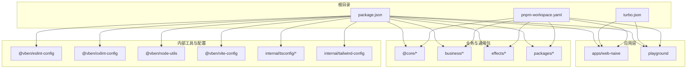
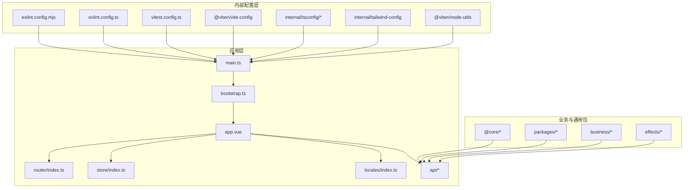
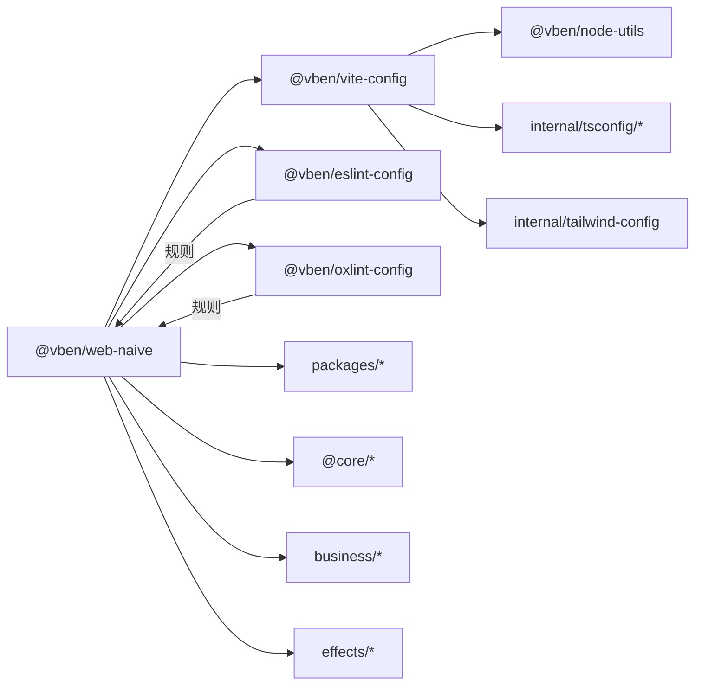
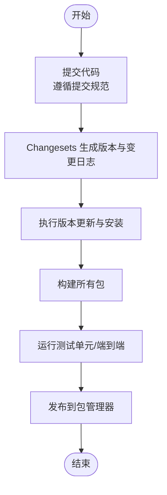
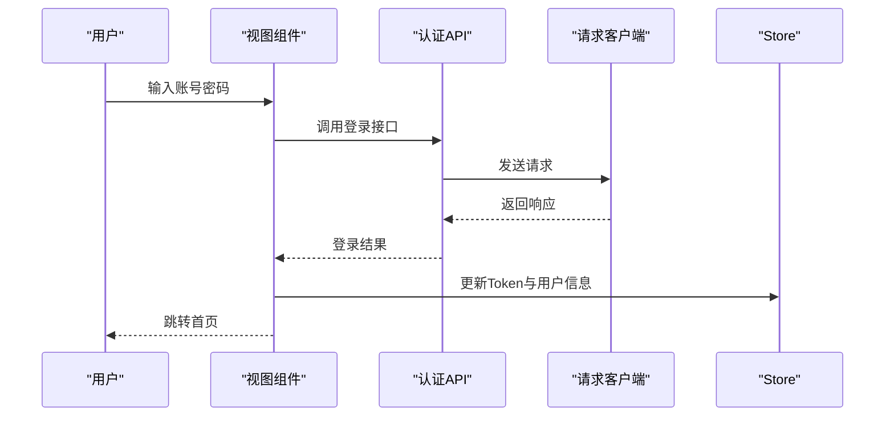

# 扩展开发最佳实践

<cite>
**本文引用的文件**
- [README.md](file://README.md)
- [package.json](file://package.json)
- [turbo.json](file://turbo.json)
- [pnpm-workspace.yaml](file://pnpm-workspace.yaml)
- [eslint.config.mjs](file://eslint.config.mjs)
- [oxlint.config.ts](file://oxlint.config.ts)
- [vitest.config.ts](file://vitest.config.ts)
- [internal/lint-configs/eslint-config/package.json](file://internal/lint-configs/eslint-config/package.json)
- [internal/lint-configs/oxlint-config/package.json](file://internal/lint-configs/oxlint-config/package.json)
- [internal/node-utils/package.json](file://internal/node-utils/package.json)
- [internal/vite-config/package.json](file://internal/vite-config/package.json)
- [apps/web-naive/package.json](file://apps/web-naive/package.json)
- [playground/package.json](file://playground/package.json)
- [internal/lint-configs/commitlint-config/index.mjs](file://internal/lint-configs/commitlint-config/index.mjs)
- [.github/commit-convention.md](file://.github/commit-convention.md)
- [playground/playwright.config.ts](file://playground/playwright.config.ts)
- [playground/__tests__/auth-login.spec.ts](file://playground/__tests__/auth-login.spec.ts)
- [playground/__tests__/common/auth.ts](file://playground/__tests__/common/auth.ts)
- [apps/web-naive/src/main.ts](file://apps/web-naive/src/main.ts)
- [apps/web-naive/src/app.vue](file://apps/web-naive/src/app.vue)
- [apps/web-naive/src/bootstrap.ts](file://apps/web-naive/src/bootstrap.ts)
- [apps/web-naive/src/router/index.ts](file://apps/web-naive/src/router/index.ts)
- [apps/web-naive/src/store/index.ts](file://apps/web-naive/src/store/index.ts)
- [apps/web-naive/src/layouts/basic.vue](file://apps/web-naive/src/layouts/basic.vue)
- [apps/web-naive/src/locales/index.ts](file://apps/web-naive/src/locales/index.ts)
- [apps/web-naive/src/views/demos/access/index.vue](file://apps/web-naive/src/views/demos/access/index.vue)
- [apps/web-naive/src/views/demos/form/modal.vue](file://apps/web-naive/src/views/demos/form/modal.vue)
- [apps/web-naive/src/views/demos/table/index.vue](file://apps/web-naive/src/views/demos/table/index.vue)
- [apps/web-naive/src/views/system/user/list.vue](file://apps/web-naive/src/views/system/user/list.vue)
- [apps/web-naive/src/views/system/user/modules/form.vue](file://apps/web-naive/src/views/system/user/modules/form.vue)
- [apps/web-naive/src/api/system/user.ts](file://apps/web-naive/src/api/system/user.ts)
- [apps/web-naive/src/api/core/auth.ts](file://apps/web-naive/src/api/core/auth.ts)
- [apps/web-naive/src/api/request.ts](file://apps/web-naive/src/api/request.ts)
- [apps/web-naive/src/locales/langs/zh-CN/system.json](file://apps/web-naive/src/locales/langs/zh-CN/system.json)
- [apps/web-naive/src/locales/langs/en-US/system.json](file://apps/web-naive/src/locales/langs/en-US/system.json)
- [packages/@core/base/package.json](file://packages/@core/base/package.json)
- [packages/@core/ui-kit/package.json](file://packages/@core/ui-kit/package.json)
- [packages/@core/forward/package.json](file://packages/@core/forward/package.json)
- [packages/effects/package.json](file://packages/effects/package.json)
- [packages/business/package.json](file://packages/business/package.json)
- [packages/constants/package.json](file://packages/constants/package.json)
- [packages/icons/package.json](file://packages/icons/package.json)
- [packages/locales/package.json](file://packages/locales/package.json)
- [packages/preferences/package.json](file://packages/preferences/package.json)
- [packages/stores/package.json](file://packages/stores/package.json)
- [packages/styles/package.json](file://packages/styles/package.json)
- [packages/types/package.json](file://packages/types/package.json)
- [packages/utils/package.json](file://packages/utils/package.json)
- [scripts/deploy/Dockerfile](file://scripts/deploy/Dockerfile)
- [scripts/deploy/nginx.conf](file://scripts/deploy/nginx.conf)
- [scripts/deploy/build-local-docker-image.sh](file://scripts/deploy/build-local-docker-image.sh)
- [scripts/vsh/bin/vsh.mjs](file://scripts/vsh/bin/vsh.mjs)
- [scripts/vsh/src/index.ts](file://scripts/vsh/src/index.ts)
- [scripts/vsh/src/run.ts](file://scripts/vsh/src/run.ts)
- [scripts/vsh/src/check-circular/index.ts](file://scripts/vsh/src/check-circular/index.ts)
- [scripts/vsh/src/check-dep/index.ts](file://scripts/vsh/src/check-dep/index.ts)
- [scripts/vsh/src/code-workspace/index.ts](file://scripts/vsh/src/code-workspace/index.ts)
- [scripts/vsh/src/lint/index.ts](file://scripts/vsh/src/lint/index.ts)
- [scripts/vsh/src/publint/index.ts](file://scripts/vsh/src/publint/index.ts)
- [internal/vite-config/src/config/application.ts](file://internal/vite-config/src/config/application.ts)
- [internal/vite-config/src/config/library.ts](file://internal/vite-config/src/config/library.ts)
- [internal/vite-config/src/plugins/index.ts](file://internal/vite-config/src/plugins/index.ts)
- [internal/vite-config/src/plugins/inject-metadata.ts](file://internal/vite-config/src/plugins/inject-metadata.ts)
- [internal/vite-config/src/plugins/inject-app-loading/index.ts](file://internal/vite-config/src/plugins/inject-app-loading/index.ts)
- [internal/vite-config/src/plugins/vxe-table.ts](file://internal/vite-config/src/plugins/vxe-table.ts)
- [internal/vite-config/src/plugins/print.ts](file://internal/vite-config/src/plugins/print.ts)
- [internal/vite-config/src/plugins/tailwind-reference.ts](file://internal/vite-config/src/plugins/tailwind-reference.ts)
- [internal/vite-config/src/plugins/archiver.ts](file://internal/vite-config/src/plugins/archiver.ts)
- [internal/vite-config/src/plugins/importmap.ts](file://internal/vite-config/src/plugins/importmap.ts)
- [internal/vite-config/src/plugins/nitro-mock.ts](file://internal/vite-config/src/plugins/nitro-mock.ts)
- [internal/vite-config/src/plugins/license.ts](file://internal/vite-config/src/plugins/license.ts)
- [internal/vite-config/src/utils/env.ts](file://internal/vite-config/src/utils/env.ts)
- [internal/tsconfig/base.json](file://internal/tsconfig/base.json)
- [internal/tsconfig/library.json](file://internal/tsconfig/library.json)
- [internal/tsconfig/web.json](file://internal/tsconfig/web.json)
- [internal/tsconfig/web-app.json](file://internal/tsconfig/web-app.json)
- [internal/tsconfig/node.json](file://internal/tsconfig/node.json)
- [internal/tailwind-config/src/index.ts](file://internal/tailwind-config/src/index.ts)
- [internal/tailwind-config/src/theme.css](file://internal/tailwind-config/src/theme.css)
- [internal/lint-configs/stylelint-config/index.mjs](file://internal/lint-configs/stylelint-config/index.mjs)
- [internal/lint-configs/oxfmt-config/package.json](file://internal/lint-configs/oxfmt-config/package.json)
- [internal/lint-configs/oxfmt-config/src/index.ts](file://internal/lint-configs/oxfmt-config/src/index.ts)
- [internal/node-utils/src/index.ts](file://internal/node-utils/src/index.ts)
- [internal/node-utils/src/constants.ts](file://internal/node-utils/src/constants.ts)
- [internal/node-utils/src/fs.ts](file://internal/node-utils/src/fs.ts)
- [internal/node-utils/src/git.ts](file://internal/node-utils/src/git.ts)
- [internal/node-utils/src/hash.ts](file://internal/node-utils/src/hash.ts)
- [internal/node-utils/src/monorepo.ts](file://internal/node-utils/src/monorepo.ts)
- [internal/node-utils/src/path.ts](file://internal/node-utils/src/path.ts)
- [internal/node-utils/src/spinner.ts](file://internal/node-utils/src/spinner.ts)
- [internal/node-utils/src/date.ts](file://internal/node-utils/src/date.ts)
- [internal/node-utils/src/formatter.ts](file://internal/node-utils/src/formatter.ts)
- [internal/node-utils/src/index.ts](file://internal/node-utils/src/index.ts)
- [internal/node-utils/src/__tests__/hash.test.ts](file://internal/node-utils/src/__tests__/hash.test.ts)
- [internal/node-utils/src/__tests__/path.test.ts](file://internal/node-utils/src/__tests__/path.test.ts)
- [internal/lint-configs/eslint-config/src/index.ts](file://internal/lint-configs/eslint-config/src/index.ts)
- [internal/lint-configs/eslint-config/src/custom-config.ts](file://internal/lint-configs/eslint-config/src/custom-config.ts)
- [internal/lint-configs/eslint-config/src/util.ts](file://internal/lint-configs/eslint-config/src/util.ts)
- [internal/lint-configs/eslint-config/src/configs/index.ts](file://internal/lint-configs/eslint-config/src/configs/index.ts)
- [internal/lint-configs/eslint-config/src/configs/javascript.ts](file://internal/lint-configs/eslint-config/src/configs/javascript.ts)
- [internal/lint-configs/eslint-config/src/configs/typescript.ts](file://internal/lint-configs/eslint-config/src/configs/typescript.ts)
- [internal/lint-configs/eslint-config/src/configs/vue.ts](file://internal/lint-configs/eslint-config/src/configs/vue.ts)
- [internal/lint-configs/eslint-config/src/configs/node.ts](file://internal/lint-configs/eslint-config/src/configs/node.ts)
- [internal/lint-configs/eslint-config/src/configs/ignores.ts](file://internal/lint-configs/eslint-config/src/configs/ignores.ts)
- [internal/lint-configs/eslint-config/src/configs/yaml.ts](file://internal/lint-configs/eslint-config/src/configs/yaml.ts)
- [internal/lint-configs/eslint-config/src/configs/jsonc.ts](file://internal/lint-configs/eslint-config/src/configs/jsonc.ts)
- [internal/lint-configs/eslint-config/src/configs/unicorn.ts](file://internal/lint-configs/eslint-config/src/configs/unicorn.ts)
- [internal/lint-configs/eslint-config/src/configs/perfectionist.ts](file://internal/lint-configs/eslint-config/src/configs/perfectionist.ts)
- [internal/lint-configs/eslint-config/src/configs/pnpm.ts](file://internal/lint-configs/eslint-config/src/configs/pnpm.ts)
- [internal/lint-configs/eslint-config/src/configs/test.ts](file://internal/lint-configs/eslint-config/src/configs/test.ts)
- [internal/lint-configs/eslint-config/src/configs/command.ts](file://internal/lint-configs/eslint-config/src/configs/command.ts)
- [internal/lint-configs/eslint-config/src/configs/comments.ts](file://internal/lint-configs/eslint-config/src/configs/comments.ts)
- [internal/lint-configs/eslint-config/src/configs/overrides.ts](file://internal/lint-configs/eslint-config/src/configs/overrides.ts)
- [internal/lint-configs/eslint-config/src/configs/plugins.ts](file://internal/lint-configs/eslint-config/src/configs/plugins.ts)
- [internal/lint-configs/eslint-config/src/configs/tailwindcss.ts](file://internal/lint-configs/eslint-config/src/configs/tailwindcss.ts)
- [internal/lint-configs/oxlint-config/src/index.ts](file://internal/lint-configs/oxlint-config/src/index.ts)
- [internal/lint-configs/oxlint-config/src/configs/index.ts](file://internal/lint-configs/oxlint-config/src/configs/index.ts)
- [internal/lint-configs/oxlint-config/src/configs/command.ts](file://internal/lint-configs/oxlint-config/src/configs/command.ts)
- [internal/lint-configs/oxlint-config/src/configs/comments.ts](file://internal/lint-configs/oxlint-config/src/configs/comments.ts)
- [internal/lint-configs/oxlint-config/src/configs/ignores.ts](file://internal/lint-configs/oxlint-config/src/configs/ignores.ts)
- [internal/lint-configs/oxlint-config/src/configs/import.ts](file://internal/lint-configs/oxlint-config/src/configs/import.ts)
- [internal/lint-configs/oxlint-config/src/configs/javascript.ts](file://internal/lint-configs/oxlint-config/src/configs/javascript.ts)
- [internal/lint-configs/oxlint-config/src/configs/node.ts](file://internal/lint-configs/oxlint-config/src/configs/node.ts)
- [internal/lint-configs/oxlint-config/src/configs/overrides.ts](file://internal/lint-configs/oxlint-config/src/configs/overrides.ts)
- [internal/lint-configs/oxlint-config/src/configs/plugins.ts](file://internal/lint-configs/oxlint-config/src/configs/plugins.ts)
- [internal/lint-configs/oxlint-config/src/configs/tailwindcss.ts](file://internal/lint-configs/oxlint-config/src/configs/tailwindcss.ts)
- [internal/lint-configs/oxlint-config/src/configs/test.ts](file://internal/lint-configs/oxlint-config/src/configs/test.ts)
- [internal/lint-configs/oxlint-config/src/configs/typescript.ts](file://internal/lint-configs/oxlint-config/src/configs/typescript.ts)
- [internal/lint-configs/oxlint-config/src/configs/unicorn.ts](file://internal/lint-configs/oxlint-config/src/configs/unicorn.ts)
- [internal/lint-configs/oxlint-config/src/configs/vue.ts](file://internal/lint-configs/oxlint-config/src/configs/vue.ts)
- [internal/lint-configs/oxfmt-config/src/index.ts](file://internal/lint-configs/oxfmt-config/src/index.ts)
- [internal/vite-config/src/index.ts](file://internal/vite-config/src/index.ts)
- [internal/vite-config/src/options.ts](file://internal/vite-config/src/options.ts)
- [internal/vite-config/src/typing.ts](file://internal/vite-config/src/typing.ts)
- [internal/vite-config/src/config/common.ts](file://internal/vite-config/src/config/common.ts)
- [internal/vite-config/src/config/application.ts](file://internal/vite-config/src/config/application.ts)
- [internal/vite-config/src/config/library.ts](file://internal/vite-config/src/config/library.ts)
- [internal/vite-config/src/plugins/index.ts](file://internal/vite-config/src/plugins/index.ts)
- [internal/vite-config/src/plugins/inject-metadata.ts](file://internal/vite-config/src/plugins/inject-metadata.ts)
- [internal/vite-config/src/plugins/inject-app-loading/index.ts](file://internal/vite-config/src/plugins/inject-app-loading/index.ts)
- [internal/vite-config/src/plugins/vxe-table.ts](file://internal/vite-config/src/plugins/vxe-table.ts)
- [internal/vite-config/src/plugins/print.ts](file://internal/vite-config/src/plugins/print.ts)
- [internal/vite-config/src/plugins/tailwind-reference.ts](file://internal/vite-config/src/plugins/tailwind-reference.ts)
- [internal/vite-config/src/plugins/archiver.ts](file://internal/vite-config/src/plugins/archiver.ts)
- [internal/vite-config/src/plugins/importmap.ts](file://internal/vite-config/src/plugins/importmap.ts)
- [internal/vite-config/src/plugins/nitro-mock.ts](file://internal/vite-config/src/plugins/nitro-mock.ts)
- [internal/vite-config/src/plugins/license.ts](file://internal/vite-config/src/plugins/license.ts)
- [internal/vite-config/src/utils/env.ts](file://internal/vite-config/src/utils/env.ts)
- [internal/tsconfig/base.json](file://internal/tsconfig/base.json)
- [internal/tsconfig/library.json](file://internal/tsconfig/library.json)
- [internal/tsconfig/web.json](file://internal/tsconfig/web.json)
- [internal/tsconfig/web-app.json](file://internal/tsconfig/web-app.json)
- [internal/tsconfig/node.json](file://internal/tsconfig/node.json)
- [internal/tailwind-config/src/index.ts](file://internal/tailwind-config/src/index.ts)
- [internal/tailwind-config/src/theme.css](file://internal/tailwind-config/src/theme.css)
- [internal/lint-configs/stylelint-config/index.mjs](file://internal/lint-configs/stylelint-config/index.mjs)
- [internal/lint-configs/oxfmt-config/src/index.ts](file://internal/lint-configs/oxfmt-config/src/index.ts)
- [internal/node-utils/src/index.ts](file://internal/node-utils/src/index.ts)
- [internal/node-utils/src/constants.ts](file://internal/node-utils/src/constants.ts)
- [internal/node-utils/src/fs.ts](file://internal/node-utils/src/fs.ts)
- [internal/node-utils/src/git.ts](file://internal/node-utils/src/git.ts)
- [internal/node-utils/src/hash.ts](file://internal/node-utils/src/hash.ts)
- [internal/node-utils/src/monorepo.ts](file://internal/node-utils/src/monorepo.ts)
- [internal/node-utils/src/path.ts](file://internal/node-utils/src/path.ts)
- [internal/node-utils/src/spinner.ts](file://internal/node-utils/src/spinner.ts)
- [internal/node-utils/src/date.ts](file://internal/node-utils/src/date.ts)
- [internal/node-utils/src/formatter.ts](file://internal/node-utils/src/formatter.ts)
- [internal/node-utils/src/index.ts](file://internal/node-utils/src/index.ts)
- [internal/node-utils/src/__tests__/hash.test.ts](file://internal/node-utils/src/__tests__/hash.test.ts)
- [internal/node-utils/src/__tests__/path.test.ts](file://internal/node-utils/src/__tests__/path.test.ts)
- [internal/lint-configs/eslint-config/src/index.ts](file://internal/lint-configs/eslint-config/src/index.ts)
- [internal/lint-configs/eslint-config/src/custom-config.ts](file://internal/lint-configs/eslint-config/src/custom-config.ts)
- [internal/lint-configs/eslint-config/src/util.ts](file://internal/lint-configs/eslint-config/src/util.ts)
- [internal/lint-configs/eslint-config/src/configs/index.ts](file://internal/lint-configs/eslint-config/src/configs/index.ts)
- [internal/lint-configs/eslint-config/src/configs/javascript.ts](file://internal/lint-configs/eslint-config/src/configs/javascript.ts)
- [internal/lint-configs/eslint-config/src/configs/typescript.ts](file://internal/lint-configs/eslint-config/src/configs/typescript.ts)
- [internal/lint-configs/eslint-config/src/configs/vue.ts](file://internal/lint-configs/eslint-config/src/configs/vue.ts)
- [internal/lint-configs/eslint-config/src/configs/node.ts](file://internal/lint-configs/eslint-config/src/configs/node.ts)
- [internal/lint-configs/eslint-config/src/configs/ignores.ts](file://internal/lint-configs/eslint-config/src/configs/ignores.ts)
- [internal/lint-configs/eslint-config/src/configs/yaml.ts](file://internal/lint-configs/eslint-config/src/configs/yaml.ts)
- [internal/lint-configs/eslint-config/src/configs/jsonc.ts](file://internal/lint-configs/eslint-config/src/configs/jsonc.ts)
- [internal/lint-configs/eslint-config/src/configs/unicorn.ts](file://internal/lint-configs/eslint-config/src/configs/unicorn.ts)
- [internal/lint-configs/eslint-config/src/configs/perfectionist.ts](file://internal/lint-configs/eslint-config/src/configs/perfectionist.ts)
- [internal/lint-configs/eslint-config/src/configs/pnpm.ts](file://internal/lint-configs/eslint-config/src/configs/pnpm.ts)
- [internal/lint-configs/eslint-config/src/configs/test.ts](file://internal/lint-configs/eslint-config/src/configs/test.ts)
- [internal/lint-configs/eslint-config/src/configs/command.ts](file://internal/lint-configs/eslint-config/src/configs/command.ts)
- [internal/lint-configs/eslint-config/src/configs/comments.ts](file://internal/lint-configs/eslint-config/src/configs/comments.ts)
- [internal/lint-configs/eslint-config/src/configs/overrides.ts](file://internal/lint-configs/eslint-config/src/configs/overrides.ts)
- [internal/lint-configs/eslint-config/src/configs/plugins.ts](file://internal/lint-configs/eslint-config/src/configs/plugins.ts)
- [internal/lint-configs/eslint-config/src/configs/tailwindcss.ts](file://internal/lint-configs/eslint-config/src/configs/tailwindcss.ts)
- [internal/lint-configs/oxlint-config/src/index.ts](file://internal/lint-configs/oxlint-config/src/index.ts)
- [internal/lint-configs/oxlint-config/src/configs/index.ts](file://internal/lint-configs/oxlint-config/src/configs/index.ts)
- [internal/lint-configs/oxlint-config/src/configs/command.ts](file://internal/lint-configs/oxlint-config/src/configs/command.ts)
- [internal/lint-configs/oxlint-config/src/configs/comments.ts](file://internal/lint-configs/oxlint-config/src/configs/comments.ts)
- [internal/lint-configs/oxlint-config/src/configs/ignores.ts](file://internal/lint-configs/oxlint-config/src/configs/ignores.ts)
- [internal/lint-configs/oxlint-config/src/configs/import.ts](file://internal/lint-configs/oxlint-config/src/configs/import.ts)
- [internal/lint-configs/oxlint-config/src/configs/javascript.ts](file://internal/lint-configs/oxlint-config/src/configs/javascript.ts)
- [internal/lint-configs/oxlint-config/src/configs/node.ts](file://internal/lint-configs/oxlint-config/src/configs/node.ts)
- [internal/lint-configs/oxlint-config/src/configs/overrides.ts](file://internal/lint-configs/oxlint-config/src/configs/overrides.ts)
- [internal/lint-configs/oxlint-config/src/configs/plugins.ts](file://internal/lint-configs/oxlint-config/src/configs/plugins.ts)
- [internal/lint-configs/oxlint-config/src/configs/tailwindcss.ts](file://internal/lint-configs/oxlint-config/src/configs/tailwindcss.ts)
- [internal/lint-configs/oxlint-config/src/configs/test.ts](file://internal/lint-configs/oxlint-config/src/configs/test.ts)
- [internal/lint-configs/oxlint-config/src/configs/typescript.ts](file://internal/lint-configs/oxlint-config/src/configs/typescript.ts)
- [internal/lint-configs/oxlint-config/src/configs/unicorn.ts](file://internal/lint-configs/oxlint-config/src/configs/unicorn.ts)
- [internal/lint-configs/oxlint-config/src/configs/vue.ts](file://internal/lint-configs/oxlint-config/src/configs/vue.ts)
- [internal/lint-configs/oxfmt-config/src/index.ts](file://internal/lint-configs/oxfmt-config/src/index.ts)
</cite>

## 目录

1. [简介](#简介)
2. [项目结构](#项目结构)
3. [核心组件](#核心组件)
4. [架构总览](#架构总览)
5. [详细组件分析](#详细组件分析)
6. [依赖分析](#依赖分析)
7. [性能考量](#性能考量)
8. [故障排查指南](#故障排查指南)
9. [结论](#结论)
10. [附录](#附录)

## 简介

本文件面向 shiyu-ui（Vue Vben Admin）的扩展开发者，系统化总结扩展开发的设计原则、编码规范、测试策略、质量保障、文档与注释标准、版本管理与发布流程、工具链与开发环境配置，并提供常见问题与调试技巧、性能优化与安全建议，帮助团队以一致的方式高质量交付扩展模块。

## 项目结构

该项目采用多包（monorepo）结构，通过工作区统一管理多个应用与内部工具包，核心组成如下：

- 应用层：apps/web-naive（基于 Naive UI 的 Web 应用示例）
- 内部工具与配置：internal 下的各类配置包（lint、vite、node-utils、tsconfig、tailwind 等）
- 业务与通用包：packages 下的 @core、business、effects、stores、styles、utils 等
- 演示与端到端测试：playground（包含 Playwright 测试）
- 根级脚本与工作区：package.json、turbo.json、pnpm-workspace.yaml

图表来源

- [package.json:1-110](file://package.json#L1-L110)
- [turbo.json:1-49](file://turbo.json#L1-L49)
- [pnpm-workspace.yaml:1-192](file://pnpm-workspace.yaml#L1-L192)

章节来源

- [package.json:1-110](file://package.json#L1-L110)
- [turbo.json:1-49](file://turbo.json#L1-L49)
- [pnpm-workspace.yaml:1-192](file://pnpm-workspace.yaml#L1-L192)

## 核心组件

围绕扩展开发的关键组件与职责：

- 应用入口与引导：应用入口、引导与主组件负责初始化运行时、路由、状态与国际化等
- 路由与权限：路由配置、访问控制与守卫，支撑扩展页面与菜单的动态加载
- 状态管理：Pinia Store 组织与扩展数据域
- API 层：请求封装、鉴权与系统接口适配
- 国际化：语言包与按需加载
- 工具与配置：ESLint/Oxlint/Vitest/Turbo/PNPM 等工具链与配置
- 演示与测试：Playwright 端到端测试与 Vitest 单元测试

章节来源

- [apps/web-naive/src/main.ts:1-200](file://apps/web-naive/src/main.ts)
- [apps/web-naive/src/bootstrap.ts:1-200](file://apps/web-naive/src/bootstrap.ts)
- [apps/web-naive/src/app.vue:1-200](file://apps/web-naive/src/app.vue)
- [apps/web-naive/src/router/index.ts:1-200](file://apps/web-naive/src/router/index.ts)
- [apps/web-naive/src/store/index.ts:1-200](file://apps/web-naive/src/store/index.ts)
- [apps/web-naive/src/locales/index.ts:1-200](file://apps/web-naive/src/locales/index.ts)
- [apps/web-naive/src/api/request.ts:1-200](file://apps/web-naive/src/api/request.ts)
- [apps/web-naive/src/api/core/auth.ts:1-200](file://apps/web-naive/src/api/core/auth.ts)
- [apps/web-naive/src/api/system/user.ts:1-200](file://apps/web-naive/src/api/system/user.ts)
- [eslint.config.mjs:1-4](file://eslint.config.mjs#L1-L4)
- [oxlint.config.ts:1-6](file://oxlint.config.ts#L1-L6)
- [vitest.config.ts:1-29](file://vitest.config.ts#L1-L29)
- [turbo.json:1-49](file://turbo.json#L1-L49)
- [pnpm-workspace.yaml:1-192](file://pnpm-workspace.yaml#L1-L192)

## 架构总览

扩展开发遵循“应用层 + 内部配置层 + 业务/通用包”的分层架构。应用层通过依赖注入与插件机制接入内部配置；业务与通用包提供可复用能力；测试与质量工具贯穿全生命周期。

图表来源

- [apps/web-naive/src/main.ts:1-200](file://apps/web-naive/src/main.ts)
- [apps/web-naive/src/bootstrap.ts:1-200](file://apps/web-naive/src/bootstrap.ts)
- [apps/web-naive/src/app.vue:1-200](file://apps/web-naive/src/app.vue)
- [apps/web-naive/src/router/index.ts:1-200](file://apps/web-naive/src/router/index.ts)
- [apps/web-naive/src/store/index.ts:1-200](file://apps/web-naive/src/store/index.ts)
- [apps/web-naive/src/locales/index.ts:1-200](file://apps/web-naive/src/locales/index.ts)
- [apps/web-naive/src/api/request.ts:1-200](file://apps/web-naive/src/api/request.ts)
- [eslint.config.mjs:1-4](file://eslint.config.mjs#L1-L4)
- [oxlint.config.ts:1-6](file://oxlint.config.ts#L1-L6)
- [vitest.config.ts:1-29](file://vitest.config.ts#L1-L29)
- [internal/vite-config/package.json:1-61](file://internal/vite-config/package.json#L1-L61)
- [internal/tsconfig/base.json:1-200](file://internal/tsconfig/base.json)
- [internal/tailwind-config/src/index.ts:1-200](file://internal/tailwind-config/src/index.ts)
- [internal/node-utils/package.json:1-43](file://internal/node-utils/package.json#L1-L43)
- [packages/@core/base/package.json:1-200](file://packages/@core/base/package.json)
- [packages/@core/ui-kit/package.json:1-200](file://packages/@core/ui-kit/package.json)
- [packages/@core/forward/package.json:1-200](file://packages/@core/forward/package.json)
- [packages/business/package.json:1-200](file://packages/business/package.json)
- [packages/effects/package.json:1-200](file://packages/effects/package.json)

## 详细组件分析

### 应用入口与引导（设计原则与实现要点）

- 设计原则
  - 渐进式引导：先挂载容器，再初始化路由、状态、国际化与插件
  - 可插拔架构：通过插件注册扩展能力（如请求、UI 组件、国际化等）
  - 明确职责边界：入口只做装配，具体逻辑下沉至子模块
- 关键实现
  - 入口与引导：应用入口负责创建根实例与挂载；引导模块负责初始化运行时配置
  - 主组件：承载布局、主题与全局状态
  - 路由与状态：集中初始化，避免在组件内重复初始化
  - 国际化：按需加载语言包，支持动态切换
- 编码规范
  - 文件命名：入口文件 main.ts、引导文件 bootstrap.ts、根组件 app.vue
  - 导入顺序：标准库 → 第三方 → 本地模块 → 类型声明
  - 异步初始化：对网络或异步资源使用 await，避免竞态
  - 错误处理：兜底错误提示与日志记录，便于定位问题

章节来源

- [apps/web-naive/src/main.ts:1-200](file://apps/web-naive/src/main.ts)
- [apps/web-naive/src/bootstrap.ts:1-200](file://apps/web-naive/src/bootstrap.ts)
- [apps/web-naive/src/app.vue:1-200](file://apps/web-naive/src/app.vue)
- [apps/web-naive/src/locales/index.ts:1-200](file://apps/web-naive/src/locales/index.ts)

### 路由与权限（扩展页面与菜单接入）

- 设计原则
  - 动态路由：菜单与页面通过后端返回或静态配置生成
  - 权限守卫：在进入路由前校验角色与权限
  - 懒加载：按需加载页面组件，降低首屏体积
- 实现要点
  - 路由配置：模块化组织路由，支持嵌套路由与动态参数
  - 访问控制：基于角色与菜单项控制可见性与可访问性
  - 守卫：前置守卫处理登录态与权限校验
- 扩展建议
  - 将扩展页面纳入统一的路由模块，保持命名空间清晰
  - 使用统一的菜单数据结构，便于权限与导航联动

章节来源

- [apps/web-naive/src/router/index.ts:1-200](file://apps/web-naive/src/router/index.ts)
- [apps/web-naive/src/layouts/basic.vue:1-200](file://apps/web-naive/src/layouts/basic.vue)

### 状态管理（Pinia Store）

- 设计原则
  - 域划分：按功能域拆分 Store，避免单体 Store
  - 数据不可变：通过派生状态与计算属性管理视图状态
  - 可序列化：持久化仅用于必要场景，注意安全性
- 实现要点
  - Store 组织：按领域（用户、系统、偏好）拆分
  - 插件：可选持久化插件，按需启用
- 扩展建议
  - 为扩展新增 Store 时，提供清晰的命名与导出路径
  - 在 Store 中暴露最小必要的 API，避免耦合

章节来源

- [apps/web-naive/src/store/index.ts:1-200](file://apps/web-naive/src/store/index.ts)
- [apps/web-naive/package.json:18-51](file://apps/web-naive/package.json#L18-L51)

### API 层（请求封装与鉴权）

- 设计原则
  - 统一请求：封装请求客户端，集中处理拦截器、超时与重试
  - 鉴权：统一处理 Token 注入与刷新
  - 接口分组：按业务域拆分 API 模块，便于维护
- 实现要点
  - 请求客户端：统一基地址、超时、错误处理
  - 鉴权：登录、刷新 Token、登出流程
  - 系统接口：用户、菜单、部门等基础能力
- 扩展建议
  - 为扩展新增接口时，遵循现有命名与目录结构
  - 对外暴露简洁的 API 方法，隐藏实现细节

章节来源

- [apps/web-naive/src/api/request.ts:1-200](file://apps/web-naive/src/api/request.ts)
- [apps/web-naive/src/api/core/auth.ts:1-200](file://apps/web-naive/src/api/core/auth.ts)
- [apps/web-naive/src/api/system/user.ts:1-200](file://apps/web-naive/src/api/system/user.ts)

### 国际化（语言包与切换）

- 设计原则
  - 按模块拆分语言包，减少热更新体积
  - 支持动态加载与回退机制
- 实现要点
  - 语言包目录：按模块（系统、演示等）组织 JSON
  - 加载策略：按需加载当前语言包
- 扩展建议
  - 扩展新增文案时，同步添加到对应语言包
  - 使用统一的键名前缀，避免冲突

章节来源

- [apps/web-naive/src/locales/index.ts:1-200](file://apps/web-naive/src/locales/index.ts)
- [apps/web-naive/src/locales/langs/zh-CN/system.json:1-200](file://apps/web-naive/src/locales/langs/zh-CN/system.json)
- [apps/web-naive/src/locales/langs/en-US/system.json:1-200](file://apps/web-naive/src/locales/langs/en-US/system.json)

### 扩展页面与组件（示例与规范）

- 示例页面
  - 演示页：权限控制、表单、表格等
  - 系统页：用户、菜单、角色列表与表单
- 规范
  - 页面组件：按模块组织，表单与列表分离
  - 表单：支持校验、动态布局与远程校验
  - 列表：支持分页、筛选、排序与远程数据

章节来源

- [apps/web-naive/src/views/demos/access/index.vue:1-200](file://apps/web-naive/src/views/demos/access/index.vue)
- [apps/web-naive/src/views/demos/form/modal.vue:1-200](file://apps/web-naive/src/views/demos/form/modal.vue)
- [apps/web-naive/src/views/demos/table/index.vue:1-200](file://apps/web-naive/src/views/demos/table/index.vue)
- [apps/web-naive/src/views/system/user/list.vue:1-200](file://apps/web-naive/src/views/system/user/list.vue)
- [apps/web-naive/src/views/system/user/modules/form.vue:1-200](file://apps/web-naive/src/views/system/user/modules/form.vue)

### 工具链与配置（ESLint/Oxlint/Vitest/Turbo/PNPM）

- ESLint 配置：通过 @vben/eslint-config 统一规则
- Oxlint 配置：通过 @vben/oxlint-config 提供高性能检查
- Vitest：DOM 环境下的单元测试配置
- Turbo：多包构建缓存与任务编排
- PNPM：工作区与 catalog 版本管理

章节来源

- [eslint.config.mjs:1-4](file://eslint.config.mjs#L1-L4)
- [oxlint.config.ts:1-6](file://oxlint.config.ts#L1-L6)
- [vitest.config.ts:1-29](file://vitest.config.ts#L1-L29)
- [turbo.json:1-49](file://turbo.json#L1-L49)
- [pnpm-workspace.yaml:1-192](file://pnpm-workspace.yaml#L1-L192)
- [internal/lint-configs/eslint-config/package.json:1-48](file://internal/lint-configs/eslint-config/package.json#L1-L48)
- [internal/lint-configs/oxlint-config/package.json:1-36](file://internal/lint-configs/oxlint-config/package.json#L1-L36)

### 测试策略与质量保证

- 单元测试（Vitest）
  - DOM 环境：使用 happy-dom，支持脚本加载成功处理
  - 排除规则：忽略 e2e、dist、node_modules 等目录
- 端到端测试（Playwright）
  - 在 playground 中提供测试脚本与配置
  - 支持 UI 模式与代码生成
- 质量检查
  - 循环依赖检测、依赖一致性检查、类型检查、拼写检查
  - 发布前检查：publint

章节来源

- [vitest.config.ts:1-29](file://vitest.config.ts#L1-L29)
- [playground/package.json:18-63](file://playground/package.json#L18-L63)
- [playground/playwright.config.ts:1-200](file://playground/playwright.config.ts)
- [playground/**tests**/auth-login.spec.ts:1-200](file://playground/__tests__/auth-login.spec.ts)
- [playground/**tests**/common/auth.ts:1-200](file://playground/__tests__/common/auth.ts)
- [package.json:39-66](file://package.json#L39-L66)

### 版本管理与发布流程

- 提交信息规范
  - Angular 风格的提交类型与作用域
  - 支持中文与英文提示，约束长度与格式
- Changesets
  - 使用 Changesets 进行版本与变更日志管理
  - 通过脚本执行 version 与安装，保持 lockfile 一致
- 工作流
  - 通过 Lefthook 与提交钩子保障规范执行

章节来源

- [.github/commit-convention.md:1-90](file://.github/commit-convention.md#L1-L90)
- [internal/lint-configs/commitlint-config/index.mjs:1-154](file://internal/lint-configs/commitlint-config/index.mjs#L1-L154)
- [package.json:38-66](file://package.json#L38-L66)

### 开发环境设置与工具链配置

- Node 与 PNPM 版本要求
  - Node 与 PNPM 版本约束，确保跨平台一致性
- 开发命令
  - dev、build、test、lint、check 等常用脚本
- 应用与 Playground
  - 分别提供独立的构建与预览脚本
- 内部工具
  - vsh 提供循环依赖、依赖检查、格式化、发布检查等工具

章节来源

- [package.json:104-109](file://package.json#L104-L109)
- [apps/web-naive/package.json:18-24](file://apps/web-naive/package.json#L18-L24)
- [playground/package.json:18-27](file://playground/package.json#L18-L27)
- [scripts/vsh/bin/vsh.mjs:1-200](file://scripts/vsh/bin/vsh.mjs)
- [scripts/vsh/src/index.ts:1-200](file://scripts/vsh/src/index.ts)
- [scripts/vsh/src/run.ts:1-200](file://scripts/vsh/src/run.ts)

## 依赖分析

- 包依赖关系
  - 应用依赖内部配置与通用包
  - 内部配置依赖工具与第三方库
  - 工作区通过 pnpm-workspace.yaml 统一管理
- 任务依赖
  - Turbo 任务定义构建顺序与输出缓存

图表来源

- [apps/web-naive/package.json:28-51](file://apps/web-naive/package.json#L28-L51)
- [internal/vite-config/package.json:29-61](file://internal/vite-config/package.json#L29-L61)
- [internal/lint-configs/eslint-config/package.json:29-46](file://internal/lint-configs/eslint-config/package.json#L29-L46)
- [internal/lint-configs/oxlint-config/package.json:29-35](file://internal/lint-configs/oxlint-config/package.json#L29-L35)
- [pnpm-workspace.yaml:1-192](file://pnpm-workspace.yaml#L1-L192)

章节来源

- [apps/web-naive/package.json:28-51](file://apps/web-naive/package.json#L28-L51)
- [internal/vite-config/package.json:29-61](file://internal/vite-config/package.json#L29-L61)
- [internal/lint-configs/eslint-config/package.json:29-46](file://internal/lint-configs/eslint-config/package.json#L29-L46)
- [internal/lint-configs/oxlint-config/package.json:29-35](file://internal/lint-configs/oxlint-config/package.json#L29-L35)
- [pnpm-workspace.yaml:1-192](file://pnpm-workspace.yaml#L1-L192)

## 性能考量

- 构建与缓存
  - Turbo 多包构建与缓存，减少重复编译
  - 应用与库分别配置构建策略，优化产物
- 运行时优化
  - 按需加载组件与页面，减少首屏体积
  - 合理使用 Pinia 持久化，避免不必要的存储
- 开发体验
  - 快速启动与热更新，结合类型检查与格式化

章节来源

- [turbo.json:15-49](file://turbo.json#L15-L49)
- [internal/vite-config/src/config/application.ts:1-200](file://internal/vite-config/src/config/application.ts)
- [internal/vite-config/src/config/library.ts:1-200](file://internal/vite-config/src/config/library.ts)

## 故障排查指南

- 常见问题
  - 构建失败：检查 Turbo 任务依赖与输出配置
  - 类型错误：执行类型检查任务，定位问题文件
  - 循环依赖：使用 vsh check-circular 检测
  - 依赖不一致：使用 vsh check-dep 修复
  - 单测失败：确认环境与排除规则，确保 DOM 环境正确
  - E2E 失败：检查 Playwright 配置与浏览器驱动
- 调试技巧
  - 使用 vsh lint --format 自动修复格式问题
  - 使用 publint 检查包发布前的合规性
  - 在应用入口开启严格模式与错误边界

章节来源

- [package.json:39-66](file://package.json#L39-L66)
- [vitest.config.ts:7-28](file://vitest.config.ts#L7-L28)
- [playground/playwright.config.ts:1-200](file://playground/playwright.config.ts)
- [scripts/vsh/src/lint/index.ts:1-200](file://scripts/vsh/src/lint/index.ts)
- [scripts/vsh/src/publint/index.ts:1-200](file://scripts/vsh/src/publint/index.ts)

## 结论

通过统一的工具链、清晰的分层架构与严格的测试与质量保障流程，shiyu-ui 为扩展开发提供了稳定可靠的基础设施。遵循本文的设计原则、编码规范与最佳实践，可显著提升扩展的可维护性、可测试性与可扩展性。

## 附录

### A. 编码规范与命名约定

- 文件与目录
  - 页面：views/模块/页面.vue
  - 组件：components/模块/组件.vue
  - API：api/模块/接口.ts
  - Store：store/模块.ts
  - 国际化：locales/langs/语言/模块.json
- 命名
  - 组件：PascalCase
  - 文件：kebab-case 或 PascalCase（组件）
  - 变量与函数：camelCase
  - 常量：UPPER_SNAKE_CASE
- 导入
  - 优先使用相对路径，避免深层相对导入
  - 本地模块使用别名（如 #/\*）

章节来源

- [apps/web-naive/src/views/demos/access/index.vue:1-200](file://apps/web-naive/src/views/demos/access/index.vue)
- [apps/web-naive/src/views/system/user/list.vue:1-200](file://apps/web-naive/src/views/system/user/list.vue)
- [apps/web-naive/src/api/system/user.ts:1-200](file://apps/web-naive/src/api/system/user.ts)
- [apps/web-naive/src/store/index.ts:1-200](file://apps/web-naive/src/store/index.ts)
- [apps/web-naive/src/locales/langs/zh-CN/system.json:1-200](file://apps/web-naive/src/locales/langs/zh-CN/system.json)

### B. 文档编写规范与注释标准

- 文档
  - README 与变更日志：使用 Changesets 自动生成
  - 提交信息：遵循 Angular 风格，明确类型与作用域
- 注释
  - 函数与类：使用 JSDoc 风格，说明用途、参数、返回值与异常
  - 复杂逻辑：在关键步骤添加注释，便于他人理解
  - TODO/NOTE：使用统一标记，配合 Issue 追踪

章节来源

- [.github/commit-convention.md:1-90](file://.github/commit-convention.md#L1-L90)
- [internal/lint-configs/commitlint-config/index.mjs:106-150](file://internal/lint-configs/commitlint-config/index.mjs#L106-L150)

### C. 版本管理与发布流程（流程图）

图表来源

- [package.json:38-66](file://package.json#L38-L66)
- [.github/commit-convention.md:1-90](file://.github/commit-convention.md#L1-L90)

### D. API 调用时序（登录流程）

图表来源

- [apps/web-naive/src/views/authentication/login.vue:1-200](file://apps/web-naive/src/views/authentication/login.vue)
- [apps/web-naive/src/api/core/auth.ts:1-200](file://apps/web-naive/src/api/core/auth.ts)
- [apps/web-naive/src/api/request.ts:1-200](file://apps/web-naive/src/api/request.ts)
- [apps/web-naive/src/store/auth.ts:1-200](file://apps/web-naive/src/store/auth.ts)

### E. 开发环境与工具链配置清单

- Node 与 PNPM 版本约束
- ESLint 与 Oxlint 配置
- Vitest 与 Playwright 配置
- Turbo 任务与输出
- 工作区与 catalog 依赖

章节来源

- [package.json:104-109](file://package.json#L104-L109)
- [eslint.config.mjs:1-4](file://eslint.config.mjs#L1-L4)
- [oxlint.config.ts:1-6](file://oxlint.config.ts#L1-L6)
- [vitest.config.ts:1-29](file://vitest.config.ts#L1-L29)
- [turbo.json:1-49](file://turbo.json#L1-L49)
- [pnpm-workspace.yaml:1-192](file://pnpm-workspace.yaml#L1-L192)
