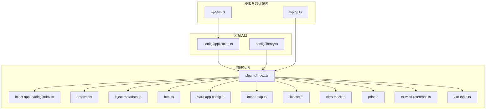
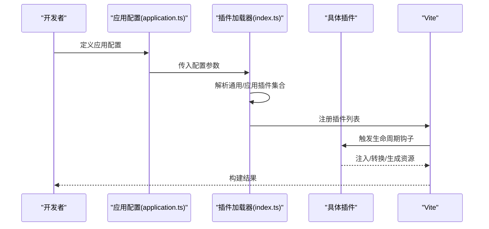
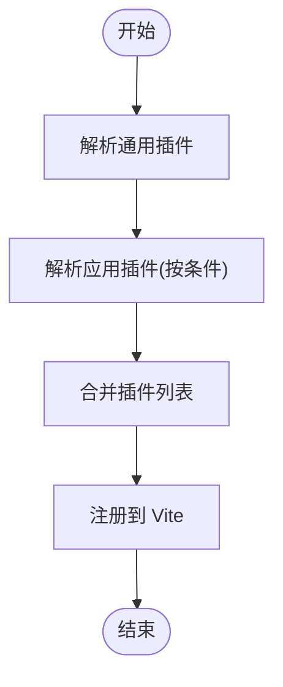
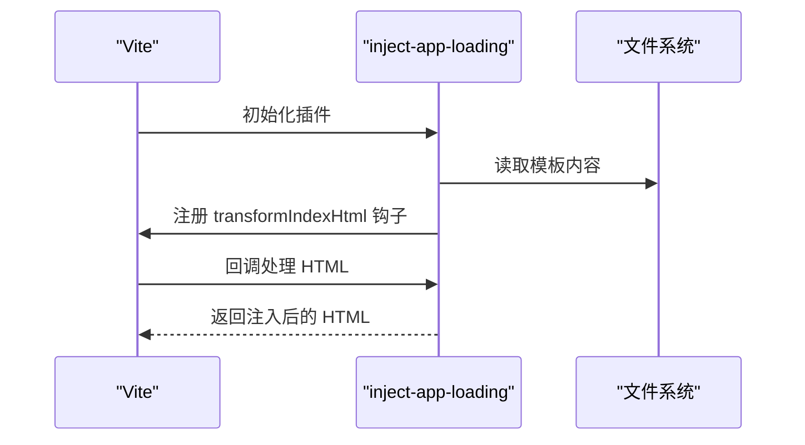
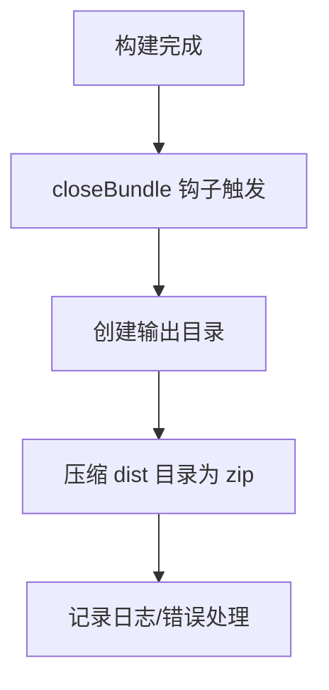
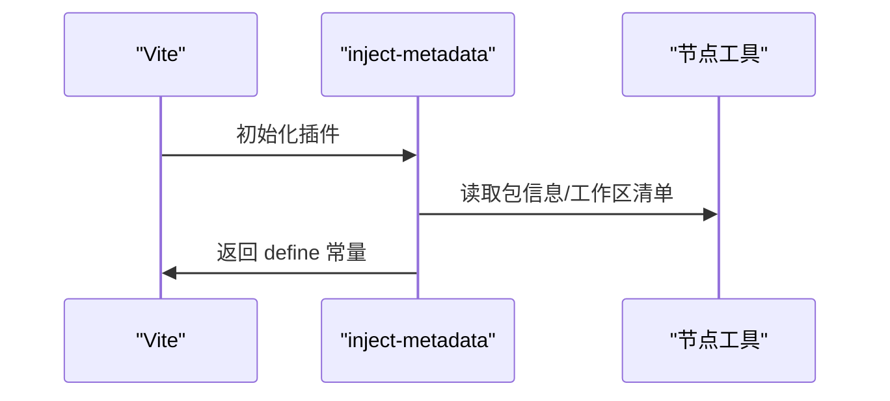
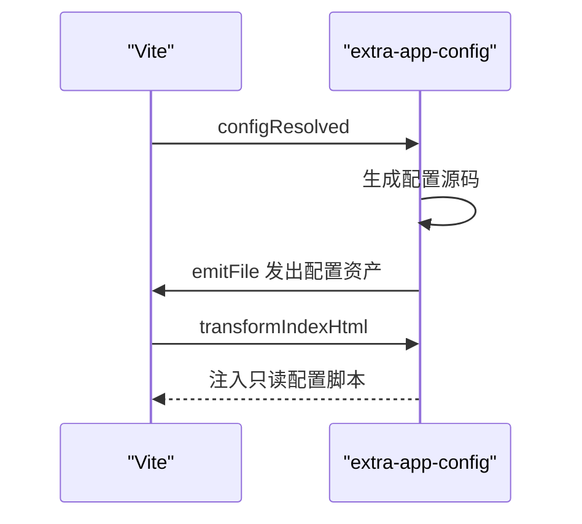
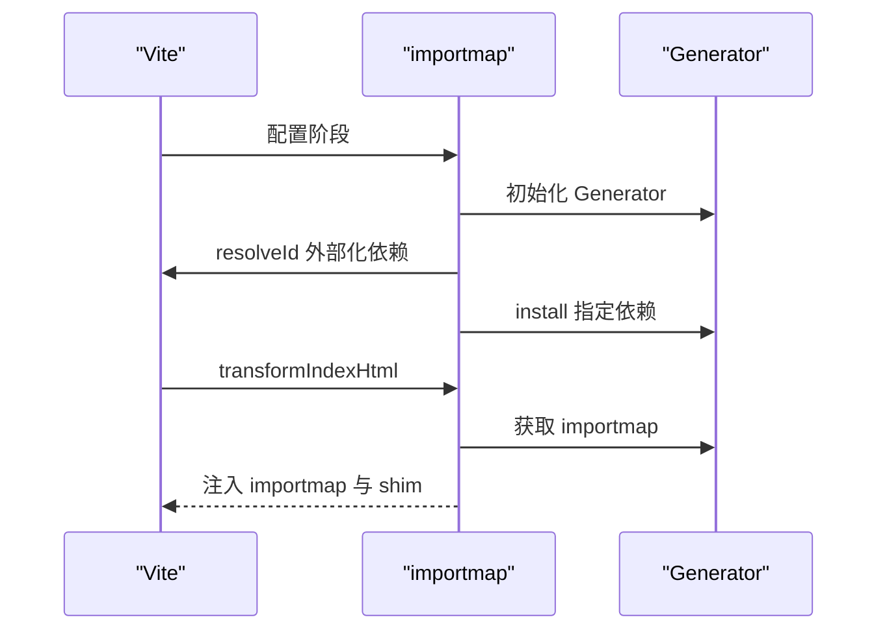
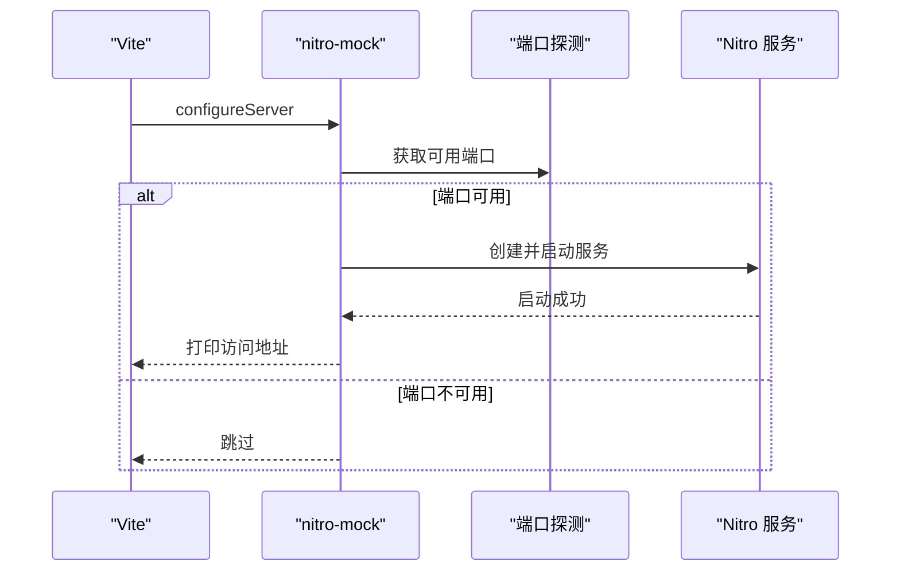
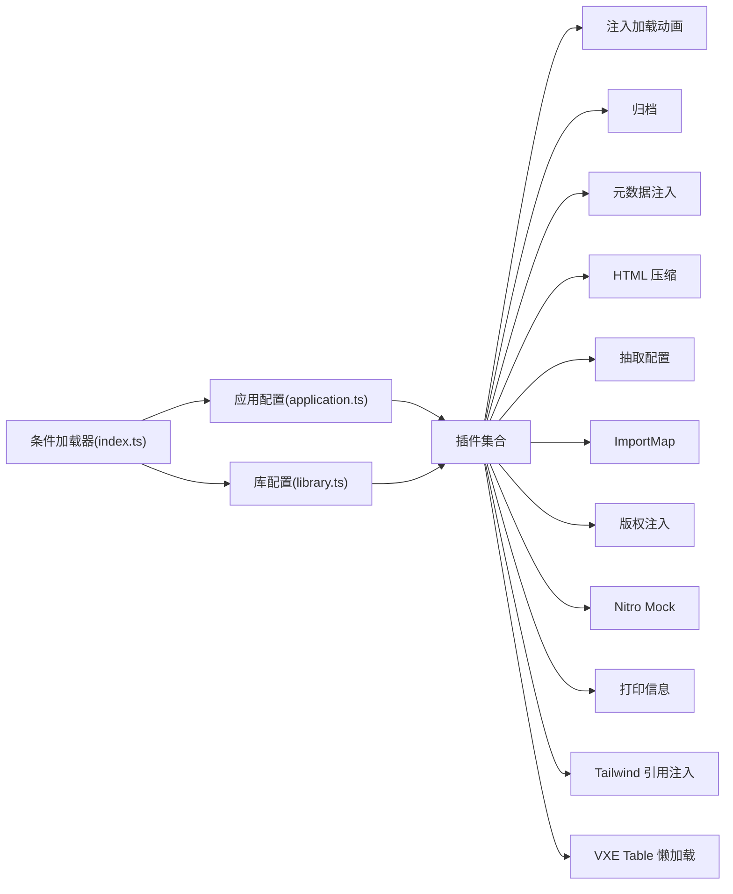

# 插件系统扩展

<cite>
**本文引用的文件**
- [internal/vite-config/src/plugins/index.ts](file://internal/vite-config/src/plugins/index.ts)
- [internal/vite-config/src/plugins/inject-app-loading/index.ts](file://internal/vite-config/src/plugins/inject-app-loading/index.ts)
- [internal/vite-config/src/plugins/archiver.ts](file://internal/vite-config/src/plugins/archiver.ts)
- [internal/vite-config/src/plugins/inject-metadata.ts](file://internal/vite-config/src/plugins/inject-metadata.ts)
- [internal/vite-config/src/plugins/html.ts](file://internal/vite-config/src/plugins/html.ts)
- [internal/vite-config/src/plugins/extra-app-config.ts](file://internal/vite-config/src/plugins/extra-app-config.ts)
- [internal/vite-config/src/plugins/importmap.ts](file://internal/vite-config/src/plugins/importmap.ts)
- [internal/vite-config/src/plugins/license.ts](file://internal/vite-config/src/plugins/license.ts)
- [internal/vite-config/src/plugins/nitro-mock.ts](file://internal/vite-config/src/plugins/nitro-mock.ts)
- [internal/vite-config/src/plugins/print.ts](file://internal/vite-config/src/plugins/print.ts)
- [internal/vite-config/src/plugins/tailwind-reference.ts](file://internal/vite-config/src/plugins/tailwind-reference.ts)
- [internal/vite-config/src/plugins/vxe-table.ts](file://internal/vite-config/src/plugins/vxe-table.ts)
- [internal/vite-config/src/typing.ts](file://internal/vite-config/src/typing.ts)
- [internal/vite-config/src/options.ts](file://internal/vite-config/src/options.ts)
- [internal/vite-config/src/config/application.ts](file://internal/vite-config/src/config/application.ts)
- [internal/vite-config/src/config/library.ts](file://internal/vite-config/src/config/library.ts)
</cite>

## 目录

1. [简介](#简介)
2. [项目结构](#项目结构)
3. [核心组件](#核心组件)
4. [架构总览](#架构总览)
5. [详细组件分析](#详细组件分析)
6. [依赖分析](#依赖分析)
7. [性能考量](#性能考量)
8. [故障排查指南](#故障排查指南)
9. [结论](#结论)
10. [附录](#附录)

## 简介

本文件面向 shiyu-ui 项目的“插件系统扩展”，系统化阐述基于 Vite 的插件架构与扩展机制，覆盖插件注册流程、生命周期管理、配置选项、内置插件能力与使用方式、开发标准流程（接口定义、钩子使用、错误处理）、插件间依赖与冲突处理策略，并提供从简单到复杂的开发示例与测试调试方法，帮助开发者理解并高效扩展插件体系。

## 项目结构

插件系统集中位于内部配置包 internal/vite-config 中，采用“按功能分层 + 条件加载”的组织方式：

- plugins：各内置插件实现与导出入口
- typing.ts：插件配置接口与类型定义
- options.ts：默认配置与常量
- config/application.ts 与 config/library.ts：应用/库两类构建场景的插件装配入口

图表来源

- [internal/vite-config/src/plugins/index.ts:1-255](file://internal/vite-config/src/plugins/index.ts#L1-L255)
- [internal/vite-config/src/plugins/inject-app-loading/index.ts:1-67](file://internal/vite-config/src/plugins/inject-app-loading/index.ts#L1-L67)
- [internal/vite-config/src/plugins/archiver.ts:1-76](file://internal/vite-config/src/plugins/archiver.ts#L1-L76)
- [internal/vite-config/src/plugins/inject-metadata.ts:1-112](file://internal/vite-config/src/plugins/inject-metadata.ts#L1-L112)
- [internal/vite-config/src/plugins/html.ts:1-36](file://internal/vite-config/src/plugins/html.ts#L1-L36)
- [internal/vite-config/src/plugins/extra-app-config.ts:1-93](file://internal/vite-config/src/plugins/extra-app-config.ts#L1-L93)
- [internal/vite-config/src/plugins/importmap.ts:1-246](file://internal/vite-config/src/plugins/importmap.ts#L1-L246)
- [internal/vite-config/src/plugins/license.ts:1-64](file://internal/vite-config/src/plugins/license.ts#L1-L64)
- [internal/vite-config/src/plugins/nitro-mock.ts:1-99](file://internal/vite-config/src/plugins/nitro-mock.ts#L1-L99)
- [internal/vite-config/src/plugins/print.ts:1-29](file://internal/vite-config/src/plugins/print.ts#L1-L29)
- [internal/vite-config/src/plugins/tailwind-reference.ts:1-41](file://internal/vite-config/src/plugins/tailwind-reference.ts#L1-L41)
- [internal/vite-config/src/plugins/vxe-table.ts:1-21](file://internal/vite-config/src/plugins/vxe-table.ts#L1-L21)
- [internal/vite-config/src/typing.ts:1-360](file://internal/vite-config/src/typing.ts#L1-L360)
- [internal/vite-config/src/options.ts:1-46](file://internal/vite-config/src/options.ts#L1-L46)
- [internal/vite-config/src/config/application.ts:1-124](file://internal/vite-config/src/config/application.ts#L1-L124)
- [internal/vite-config/src/config/library.ts:1-60](file://internal/vite-config/src/config/library.ts#L1-L60)

章节来源

- [internal/vite-config/src/plugins/index.ts:1-255](file://internal/vite-config/src/plugins/index.ts#L1-L255)
- [internal/vite-config/src/typing.ts:1-360](file://internal/vite-config/src/typing.ts#L1-L360)
- [internal/vite-config/src/options.ts:1-46](file://internal/vite-config/src/options.ts#L1-L46)
- [internal/vite-config/src/config/application.ts:1-124](file://internal/vite-config/src/config/application.ts#L1-L124)
- [internal/vite-config/src/config/library.ts:1-60](file://internal/vite-config/src/config/library.ts#L1-L60)

## 核心组件

- 条件插件加载器：根据运行时条件动态组装插件集合，避免不必要的开销与副作用。
- 通用插件集：在开发/生产环境下统一启用的基础插件（Vue/Vue JSX、Tailwind、DevTools 等）。
- 应用插件集：面向应用构建的扩展插件（i18n、HTML 压缩、ImportMap、PWA、压缩归档、Nitro Mock、版权注入、打印信息等）。
- 库插件集：面向库构建的扩展插件（DTS 生成等）。
- 类型与默认配置：统一约束插件配置项，提供默认值与最佳实践。

章节来源

- [internal/vite-config/src/plugins/index.ts:32-243](file://internal/vite-config/src/plugins/index.ts#L32-L243)
- [internal/vite-config/src/typing.ts:134-302](file://internal/vite-config/src/typing.ts#L134-L302)
- [internal/vite-config/src/options.ts:28-45](file://internal/vite-config/src/options.ts#L28-L45)
- [internal/vite-config/src/config/application.ts:17-99](file://internal/vite-config/src/config/application.ts#L17-L99)
- [internal/vite-config/src/config/library.ts:12-57](file://internal/vite-config/src/config/library.ts#L12-L57)

## 架构总览

插件系统围绕“条件装配 + 生命周期钩子”展开，核心流程如下：

- 装配阶段：根据命令（开发/构建）、模式、用户配置与默认配置，组合通用与应用/库插件。
- 生命周期钩子：利用 Vite 插件钩子（如 config、configResolved、transformIndexHtml、generateBundle、closeBundle 等）在不同阶段执行逻辑。
- 内置插件：涵盖注入应用加载动画、归档打包、元数据注入、HTML 压缩、抽取应用配置、ImportMap、PWA、Nitro Mock、版权注入、打印信息、Tailwind 引用注入、VXE Table 懒加载等。

图表来源

- [internal/vite-config/src/config/application.ts:17-99](file://internal/vite-config/src/config/application.ts#L17-L99)
- [internal/vite-config/src/plugins/index.ts:47-223](file://internal/vite-config/src/plugins/index.ts#L47-L223)

## 详细组件分析

### 条件插件与装配机制

- 条件插件接口：通过 condition 字段判断是否加载；plugins 返回插件数组或 Promise。
- 通用插件：在所有场景下启用的基础能力（Vue、JSX、Tailwind、DevTools 等）。
- 应用插件：按需启用 i18n、HTML 压缩、ImportMap、PWA、压缩归档、Nitro Mock、注入应用加载动画、版权注入、打印信息等。
- 库插件：按需启用 DTS 生成等。

图表来源

- [internal/vite-config/src/plugins/index.ts:32-89](file://internal/vite-config/src/plugins/index.ts#L32-L89)
- [internal/vite-config/src/plugins/index.ts:94-223](file://internal/vite-config/src/plugins/index.ts#L94-L223)

章节来源

- [internal/vite-config/src/plugins/index.ts:32-243](file://internal/vite-config/src/plugins/index.ts#L32-L243)
- [internal/vite-config/src/typing.ts:134-187](file://internal/vite-config/src/typing.ts#L134-L187)

### 注入应用加载动画（inject-app-loading）

- 功能：在 HTML 的 body 中注入加载动画与主题初始化脚本，保证暗色主题刷新一致性。
- 关键点：读取模板（优先应用内自定义模板，否则回退内置模板），在 transformIndexHtml 阶段注入。

图表来源

- [internal/vite-config/src/plugins/inject-app-loading/index.ts:14-49](file://internal/vite-config/src/plugins/inject-app-loading/index.ts#L14-L49)

章节来源

- [internal/vite-config/src/plugins/inject-app-loading/index.ts:1-67](file://internal/vite-config/src/plugins/inject-app-loading/index.ts#L1-L67)

### 归档处理（archiver）

- 功能：在构建完成后将 dist 目录打包为 zip 文件，支持自定义输出名与目录。
- 关键点：使用 closeBundle 钩子异步执行压缩，避免阻塞主流程。

图表来源

- [internal/vite-config/src/plugins/archiver.ts:11-44](file://internal/vite-config/src/plugins/archiver.ts#L11-L44)

章节来源

- [internal/vite-config/src/plugins/archiver.ts:1-76](file://internal/vite-config/src/plugins/archiver.ts#L1-L76)

### 元数据注入（inject-metadata）

- 功能：收集项目与工作区元数据（版本、作者、主页、许可证、依赖版本等），注入到构建配置中。
- 关键点：在 config 钩子中读取包信息与工作区清单，生成只读元数据常量。

图表来源

- [internal/vite-config/src/plugins/inject-metadata.ts:70-109](file://internal/vite-config/src/plugins/inject-metadata.ts#L70-L109)

章节来源

- [internal/vite-config/src/plugins/inject-metadata.ts:1-112](file://internal/vite-config/src/plugins/inject-metadata.ts#L1-L112)

### HTML 压缩（html）

- 功能：在生成阶段对 index.html 进行压缩，移除空白、注释、冗余属性等。
- 关键点：仅在 bundle 存在时生效，避免开发环境误处理。

章节来源

- [internal/vite-config/src/plugins/html.ts:1-36](file://internal/vite-config/src/plugins/html.ts#L1-L36)

### 抽取应用配置（extra-app-config）

- 功能：在构建时将环境配置抽取为独立 JS 文件，并在 HTML 中注入只读脚本。
- 关键点：生成资产文件、注入 script 标签、冻结全局变量，防止被篡改。

图表来源

- [internal/vite-config/src/plugins/extra-app-config.ts:24-71](file://internal/vite-config/src/plugins/extra-app-config.ts#L24-L71)

章节来源

- [internal/vite-config/src/plugins/extra-app-config.ts:1-93](file://internal/vite-config/src/plugins/extra-app-config.ts#L1-L93)

### ImportMap 与 CDN 引入（importmap）

- 功能：在构建时生成 importmap 并注入 shim，支持从 CDN 加载指定依赖。
- 关键点：预外部化依赖、安装依赖、注入 importmap 与 shim、最小化 HTML。

图表来源

- [internal/vite-config/src/plugins/importmap.ts:44-192](file://internal/vite-config/src/plugins/importmap.ts#L44-L192)

章节来源

- [internal/vite-config/src/plugins/importmap.ts:1-246](file://internal/vite-config/src/plugins/importmap.ts#L1-L246)

### 版权注入（license）

- 功能：在构建产物的入口 chunk 顶部添加版权信息。
- 关键点：遍历输出包，定位入口 chunk，前置版权注释。

章节来源

- [internal/vite-config/src/plugins/license.ts:1-64](file://internal/vite-config/src/plugins/license.ts#L1-L64)

### Nitro Mock 服务器（nitro-mock）

- 功能：在开发时启动 Nitro Mock 服务，提供 API 模拟与热更新。
- 关键点：检测可用端口、查找包目录、创建 DevServer、监听端口、打印访问地址。

图表来源

- [internal/vite-config/src/plugins/nitro-mock.ts:12-46](file://internal/vite-config/src/plugins/nitro-mock.ts#L12-L46)

章节来源

- [internal/vite-config/src/plugins/nitro-mock.ts:1-99](file://internal/vite-config/src/plugins/nitro-mock.ts#L1-L99)

### 控制台打印（print）

- 功能：在开发时打印自定义信息映射，便于快速查看环境与配置。
- 关键点：重写 printUrls，追加自定义信息输出。

章节来源

- [internal/vite-config/src/plugins/print.ts:1-29](file://internal/vite-config/src/plugins/print.ts#L1-L29)

### Tailwind 引用注入（tailwind-reference）

- 功能：自动为使用 @apply 的 Vue SFC 样式块注入 @reference，简化主题访问。
- 关键点：仅在 Vue SFC 的样式块中处理，避免重复注入。

章节来源

- [internal/vite-config/src/plugins/tailwind-reference.ts:1-41](file://internal/vite-config/src/plugins/tailwind-reference.ts#L1-L41)

### VXE Table 懒加载（vxe-table）

- 功能：通过懒加载插件按需解析 vxe-table 与 vxe-pc-ui 组件导入。
- 关键点：结合 lazyImport 与 VxeResolver 实现按需导入。

章节来源

- [internal/vite-config/src/plugins/vxe-table.ts:1-21](file://internal/vite-config/src/plugins/vxe-table.ts#L1-L21)

## 依赖分析

- 插件耦合度：插件彼此独立，通过条件开关与生命周期钩子协作；核心耦合在“条件插件加载器”与“装配入口”。
- 外部依赖：各插件依赖第三方库（如 archiver、nitropack、@jspm/generator 等），需注意版本兼容与网络稳定性。
- 冲突与顺序：部分插件对执行顺序敏感（如 transformIndexHtml 的 order），应遵循“pre/post”约定；ImportMap 与外部化存在潜在冲突，需确保 resolveId 与 transformIndexHtml 的配合。

图表来源

- [internal/vite-config/src/plugins/index.ts:32-243](file://internal/vite-config/src/plugins/index.ts#L32-L243)
- [internal/vite-config/src/config/application.ts:17-99](file://internal/vite-config/src/config/application.ts#L17-L99)
- [internal/vite-config/src/config/library.ts:12-57](file://internal/vite-config/src/config/library.ts#L12-L57)

章节来源

- [internal/vite-config/src/plugins/index.ts:32-243](file://internal/vite-config/src/plugins/index.ts#L32-L243)
- [internal/vite-config/src/config/application.ts:17-99](file://internal/vite-config/src/config/application.ts#L17-L99)
- [internal/vite-config/src/config/library.ts:12-57](file://internal/vite-config/src/config/library.ts#L12-L57)

## 性能考量

- 构建阶段优化：启用压缩归档与 HTML 压缩，合理选择压缩算法（gzip/brotli）。
- 依赖外置与 CDN：ImportMap 将大体积依赖交由 CDN 加载，降低本地打包体积与首包时间。
- 懒加载：VXE Table 懒加载减少初始包体。
- 环境区分：开发与生产分别启用/禁用插件，避免不必要的处理。

## 故障排查指南

- ImportMap 安装失败：检查网络与 CDN 提供商可用性，确认依赖名称与版本范围正确；查看安装错误日志并重试。
- Nitro Mock 端口占用：更换端口或释放占用端口；确认包存在与可读权限。
- 归档失败：检查 dist 目录是否存在与权限；确认输出目录可写。
- HTML 压缩异常：确认 bundle 已生成后再进行压缩；检查自定义选项与默认选项冲突。
- 版权注入未生效：确认入口 chunk 存在且 generateBundle 钩子执行顺序正确。
- 元数据缺失：检查包信息与工作区清单读取是否成功；确认 define 常量注入位置。

章节来源

- [internal/vite-config/src/plugins/importmap.ts:138-144](file://internal/vite-config/src/plugins/importmap.ts#L138-L144)
- [internal/vite-config/src/plugins/nitro-mock.ts:18-32](file://internal/vite-config/src/plugins/nitro-mock.ts#L18-L32)
- [internal/vite-config/src/plugins/archiver.ts:16-42](file://internal/vite-config/src/plugins/archiver.ts#L16-L42)
- [internal/vite-config/src/plugins/html.ts:20-32](file://internal/vite-config/src/plugins/html.ts#L20-L32)
- [internal/vite-config/src/plugins/license.ts:27-60](file://internal/vite-config/src/plugins/license.ts#L27-L60)
- [internal/vite-config/src/plugins/inject-metadata.ts:78-105](file://internal/vite-config/src/plugins/inject-metadata.ts#L78-L105)

## 结论

该插件系统以“条件装配 + 生命周期钩子”为核心，提供了从基础能力到高级特性的完整覆盖。通过统一的类型定义与默认配置，开发者可以快速启用/禁用插件并定制行为。建议在扩展新插件时遵循现有模式：明确生命周期钩子、提供可配置项、做好错误处理与日志输出，并在应用/库两类场景下分别验证。

## 附录

### 插件开发标准流程

- 接口定义：参考 typing.ts 中的插件配置接口，提供清晰的默认值与校验。
- 生命周期钩子：在合适阶段（如 config、transformIndexHtml、generateBundle、closeBundle）实现逻辑。
- 错误处理：捕获并记录错误，必要时中断流程或降级处理。
- 配置合并：与应用/库配置入口协同，支持用户覆盖默认行为。

章节来源

- [internal/vite-config/src/typing.ts:134-302](file://internal/vite-config/src/typing.ts#L134-L302)
- [internal/vite-config/src/plugins/index.ts:32-243](file://internal/vite-config/src/plugins/index.ts#L32-L243)

### 插件间依赖与冲突解决

- 依赖关系：ImportMap 与外部化存在关联，需确保 resolveId 与 transformIndexHtml 的顺序与条件一致。
- 冲突处理：当多个插件同时修改 HTML 时，通过 order 与 enforce 控制执行顺序；若涉及相同资源，应避免重复注入。

章节来源

- [internal/vite-config/src/plugins/importmap.ts:100-192](file://internal/vite-config/src/plugins/importmap.ts#L100-L192)
- [internal/vite-config/src/plugins/html.ts:17-36](file://internal/vite-config/src/plugins/html.ts#L17-L36)

### 开发示例（路径指引）

- 简单功能插件：参考 print 插件，仅在开发时打印信息，展示最小化插件结构与钩子使用。
  - [internal/vite-config/src/plugins/print.ts:7-29](file://internal/vite-config/src/plugins/print.ts#L7-L29)
- 复杂业务插件：参考 nitro-mock 插件，包含服务启动、端口探测、日志输出与热更新集成。
  - [internal/vite-config/src/plugins/nitro-mock.ts:12-99](file://internal/vite-config/src/plugins/nitro-mock.ts#L12-L99)

### 测试与调试方法

- 单元测试：针对插件逻辑（如归档、HTML 压缩、ImportMap 注入）编写单元测试，模拟钩子调用与文件系统交互。
- 集成测试：在应用/库配置中启用目标插件，验证构建产物与控制台输出。
- 调试技巧：利用 Vite 的日志与钩子回调，逐步断点验证；对网络相关插件（ImportMap/Nitro Mock）关注网络与权限问题。
