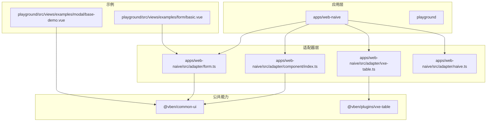
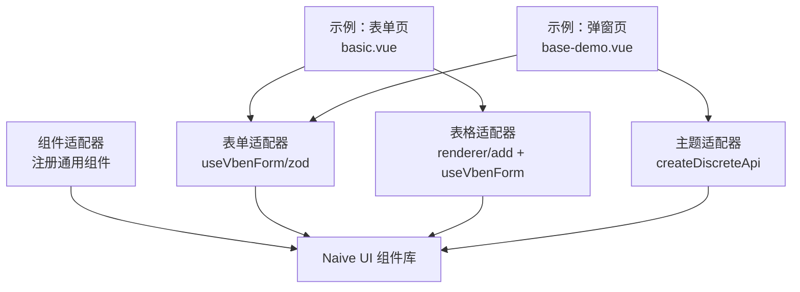
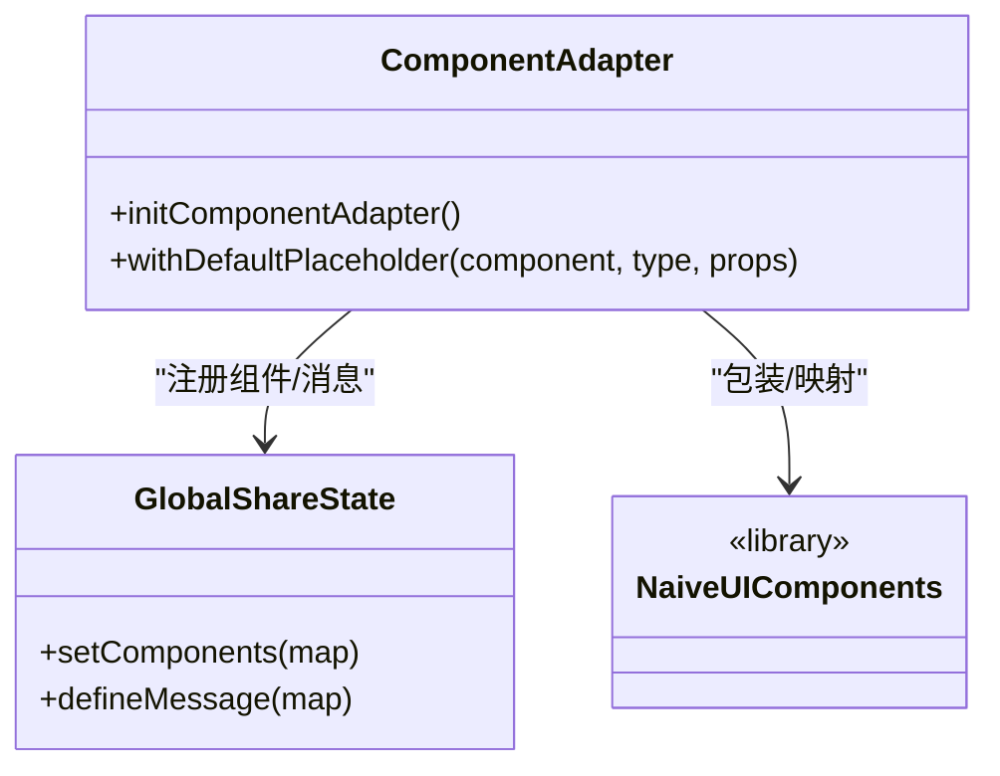
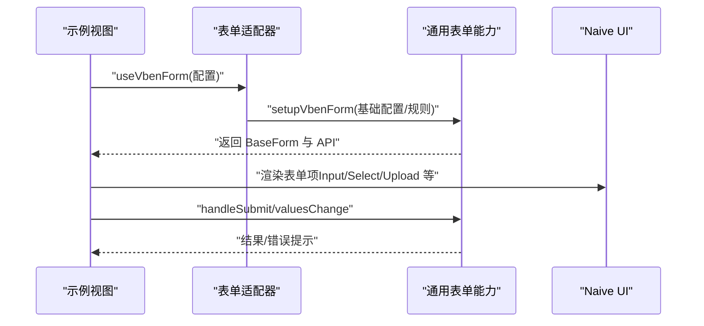
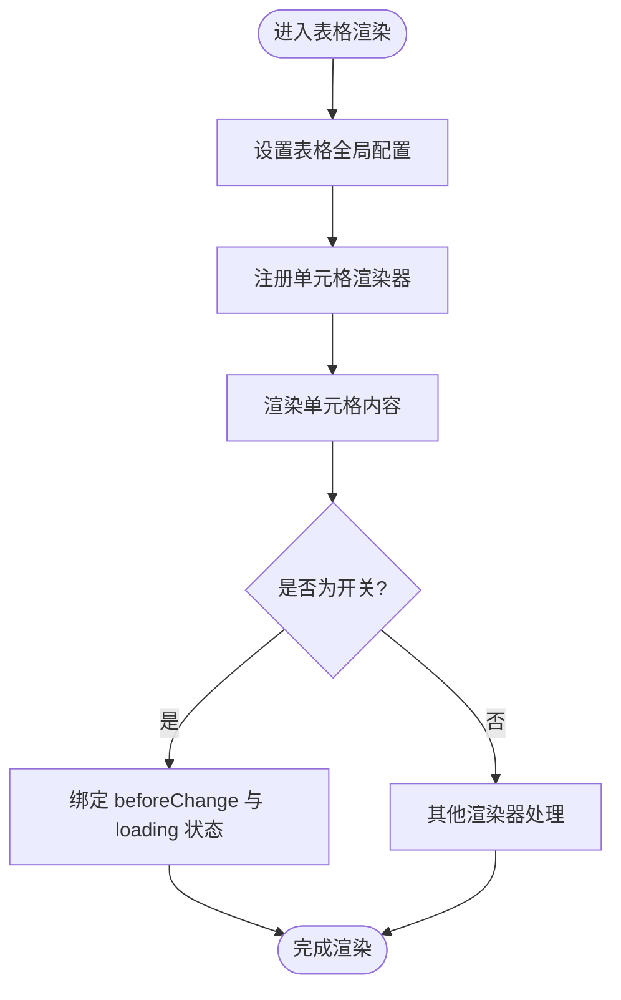
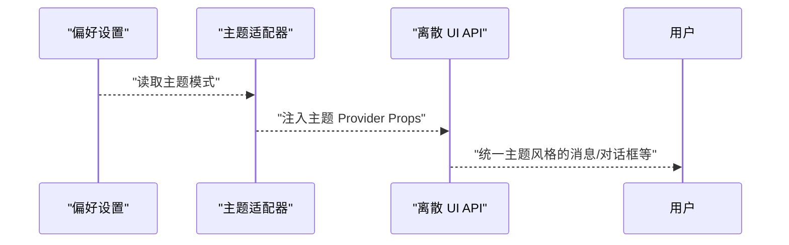
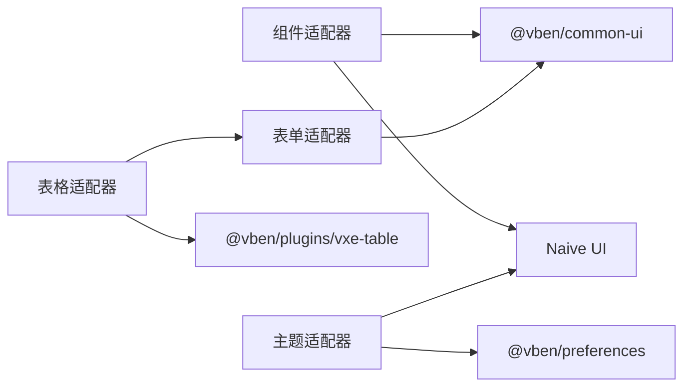

# 自定义组件开发

<cite>
**本文引用的文件**
- [apps/web-naive/src/adapter/component/index.ts](file://apps/web-naive/src/adapter/component/index.ts)
- [apps/web-naive/src/adapter/form.ts](file://apps/web-naive/src/adapter/form.ts)
- [apps/web-naive/src/adapter/vxe-table.ts](file://apps/web-naive/src/adapter/vxe-table.ts)
- [apps/web-naive/src/adapter/naive.ts](file://apps/web-naive/src/adapter/naive.ts)
- [playground/src/views/examples/form/basic.vue](file://playground/src/views/examples/form/basic.vue)
- [playground/src/views/examples/modal/base-demo.vue](file://playground/src/views/examples/modal/base-demo.vue)
- [README.md](file://README.md)
</cite>

## 目录

1. [引言](#引言)
2. [项目结构](#项目结构)
3. [核心组件](#核心组件)
4. [架构总览](#架构总览)
5. [详细组件分析](#详细组件分析)
6. [依赖关系分析](#依赖关系分析)
7. [性能考量](#性能考量)
8. [故障排查指南](#故障排查指南)
9. [结论](#结论)
10. [附录](#附录)

## 引言

本文件面向 shiyu-ui 项目的自定义组件开发，系统阐述组件设计原则、API 设计标准、生命周期与事件处理、状态管理、可复用性与组合模式，并结合仓库中的适配器模式实现（Naive UI 适配），给出从需求分析到测试部署的完整流程与实践建议。读者无需深入源码即可理解并应用这些方法论。

## 项目结构

本项目采用多应用与多包的 Monorepo 结构，核心与示例分别位于 apps 与 playground 目录。与自定义组件开发密切相关的目录与文件如下：

- apps/web-naive/src/adapter：适配器层，负责将通用 UI 能力（表单、表格、主题等）与具体 UI 库（Naive UI）对接
- playground/src/views/examples：示例视图，展示组件的实际使用方式与交互流程
- packages：公共能力包（如 common-ui、plugins 等），为适配器与业务组件提供抽象与工具

图表来源

- [apps/web-naive/src/adapter/component/index.ts:1-274](file://apps/web-naive/src/adapter/component/index.ts#L1-L274)
- [apps/web-naive/src/adapter/form.ts:1-49](file://apps/web-naive/src/adapter/form.ts#L1-L49)
- [apps/web-naive/src/adapter/vxe-table.ts:1-271](file://apps/web-naive/src/adapter/vxe-table.ts#L1-L271)
- [apps/web-naive/src/adapter/naive.ts:1-26](file://apps/web-naive/src/adapter/naive.ts#L1-L26)
- [playground/src/views/examples/form/basic.vue:1-531](file://playground/src/views/examples/form/basic.vue#L1-L531)
- [playground/src/views/examples/modal/base-demo.vue:1-35](file://playground/src/views/examples/modal/base-demo.vue#L1-L35)

章节来源

- [README.md:1-158](file://README.md#L1-L158)

## 核心组件

本节聚焦于与自定义组件开发直接相关的核心模块：组件适配器、表单适配器、表格适配器与主题适配器。

- 组件适配器（Component Adapter）
  - 职责：统一注册与暴露可用组件，提供默认占位符增强、异步按需加载、默认按钮类型等能力；将通用组件类型与 Naive UI 组件建立映射关系
  - 关键点：通过全局共享状态注册组件，统一默认占位符逻辑，简化表单 Schema 配置
  - 参考路径：[apps/web-naive/src/adapter/component/index.ts:163-271](file://apps/web-naive/src/adapter/component/index.ts#L163-L271)

- 表单适配器（Form Adapter）
  - 职责：初始化通用表单能力，定义 v-model 映射规则、国际化校验规则、基础配置等；对外导出 useVbenForm 与 zod 校验器
  - 关键点：baseModelPropName、modelPropNameMap、defineRules 的配置，保证跨组件库一致性
  - 参考路径：[apps/web-naive/src/adapter/form.ts:11-41](file://apps/web-naive/src/adapter/form.ts#L11-L41)

- 表格适配器（Vxe Table Adapter）
  - 职责：基于 @vben/plugins/vxe-table 初始化表格全局配置，注册单元格渲染器（图片、链接、标签、开关）、操作按钮渲染器与确认气泡；桥接 useVbenForm 以支持表格内的表单联动
  - 关键点：renderer.add 注册多种 Cell 渲染器；CellSwitch 支持 beforeChange 回调与 loading 状态；CellOperation 支持预设与动态按钮
  - 参考路径：[apps/web-naive/src/adapter/vxe-table.ts:21-257](file://apps/web-naive/src/adapter/vxe-table.ts#L21-L257)

- 主题适配器（Theme Adapter）
  - 职责：基于偏好设置动态切换 Naive UI 主题，提供 message、dialog、notification、modal、loadingBar 等离散 API 的主题上下文
  - 关键点：computed 计算主题与覆盖配置；createDiscreteApi 绑定 Provider Props
  - 参考路径：[apps/web-naive/src/adapter/naive.ts:8-25](file://apps/web-naive/src/adapter/naive.ts#L8-L25)

章节来源

- [apps/web-naive/src/adapter/component/index.ts:1-274](file://apps/web-naive/src/adapter/component/index.ts#L1-L274)
- [apps/web-naive/src/adapter/form.ts:1-49](file://apps/web-naive/src/adapter/form.ts#L1-L49)
- [apps/web-naive/src/adapter/vxe-table.ts:1-271](file://apps/web-naive/src/adapter/vxe-table.ts#L1-L271)
- [apps/web-naive/src/adapter/naive.ts:1-26](file://apps/web-naive/src/adapter/naive.ts#L1-L26)

## 架构总览

下图展示了自定义组件开发在本项目中的整体架构：适配器层将通用 UI 能力与具体 UI 库解耦；业务视图通过 useVbenForm/useVbenModal/useVbenVxeGrid 等 API 以声明式方式组合组件；主题与离散 UI 服务由主题适配器统一注入。

图表来源

- [apps/web-naive/src/adapter/component/index.ts:163-271](file://apps/web-naive/src/adapter/component/index.ts#L163-L271)
- [apps/web-naive/src/adapter/form.ts:11-41](file://apps/web-naive/src/adapter/form.ts#L11-L41)
- [apps/web-naive/src/adapter/vxe-table.ts:21-257](file://apps/web-naive/src/adapter/vxe-table.ts#L21-L257)
- [apps/web-naive/src/adapter/naive.ts:8-25](file://apps/web-naive/src/adapter/naive.ts#L8-L25)
- [playground/src/views/examples/form/basic.vue:1-531](file://playground/src/views/examples/form/basic.vue#L1-L531)
- [playground/src/views/examples/modal/base-demo.vue:1-35](file://playground/src/views/examples/modal/base-demo.vue#L1-L35)

## 详细组件分析

### 组件适配器（Component Adapter）

- 设计要点
  - 统一组件注册：通过 globalShareState.setComponents 将组件映射注册到全局，供表单、抽屉、模态框等场景复用
  - 默认占位符增强：withDefaultPlaceholder 为输入类与选择类组件自动注入国际化占位符，减少重复配置
  - 异步按需加载：对体积较大的组件采用 defineAsyncComponent 实现懒加载，优化首屏性能
  - 组合渲染：针对 CheckboxGroup/RadioGroup 等容器型组件，支持默认插槽与外部插槽的兼容渲染
  - 默认按钮类型：提供 DefaultButton/PrimaryButton 等便捷别名，统一按钮风格
- 生命周期与事件
  - 组件初始化：initComponentAdapter 在应用启动阶段完成注册与消息提示定义
  - 插槽与属性透传：通过 expose 代理内部实例方法，确保外部可调用底层组件能力
- API 设计
  - 组件类型与属性映射：ComponentType 与 ComponentPropsMap 明确约束，Schema 中的 component 与 componentProps 获得类型提示
  - 消息提示桥接：globalShareState.defineMessage 将复制成功等业务提示映射到 Naive UI 的 message
- 可复用性与组合
  - 通过全局共享状态实现跨组件复用；容器组件（RadioGroup/CheckboxGroup）内部组合基础控件，提升可组合性

图表来源

- [apps/web-naive/src/adapter/component/index.ts:163-271](file://apps/web-naive/src/adapter/component/index.ts#L163-L271)

章节来源

- [apps/web-naive/src/adapter/component/index.ts:1-274](file://apps/web-naive/src/adapter/component/index.ts#L1-L274)

### 表单适配器（Form Adapter）

- 设计要点
  - 初始化：initSetupVbenForm 统一配置 baseModelPropName 与 modelPropNameMap，解决不同组件库 v-model 命名差异
  - 校验规则：defineRules 提供国际化错误文案，覆盖“输入必填”“选择必填”等常见场景
  - 类型导出：useVbenForm、VbenFormSchema、VbenFormProps 与 zod 校验器对外暴露
- 使用示例
  - 示例页面 basic.vue 展示了多种组件（输入、选择、日期、上传、富文本等）在表单中的组合使用，以及提交、值变更监听、时间字段映射等典型流程
- 事件与状态
  - 表单值变更回调、提交函数、布局与栅格配置均可在 useVbenForm 的配置中集中管理

图表来源

- [apps/web-naive/src/adapter/form.ts:11-41](file://apps/web-naive/src/adapter/form.ts#L11-L41)
- [playground/src/views/examples/form/basic.vue:36-421](file://playground/src/views/examples/form/basic.vue#L36-L421)

章节来源

- [apps/web-naive/src/adapter/form.ts:1-49](file://apps/web-naive/src/adapter/form.ts#L1-L49)
- [playground/src/views/examples/form/basic.vue:1-531](file://playground/src/views/examples/form/basic.vue#L1-L531)

### 表格适配器（Vxe Table Adapter）

- 设计要点
  - 全局配置：setupVbenVxeTable 设置 grid 默认行为（边框、圆角、尺寸、代理响应结构等）
  - 渲染器注册：renderer.add 注册多种 Cell 渲染器（图片、链接、标签、开关），并支持 options 与 attrs 的灵活配置
  - 操作列：CellOperation 支持预设（编辑/删除）与自定义按钮，结合 NPopconfirm 实现删除确认
  - 表单联动：useVbenForm 注入表格，使单元格内可直接使用表单组件
- 事件与状态
  - CellSwitch 支持 beforeChange 回调与行级 loading 状态，保障交互一致性
  - 操作列按钮点击事件通过 attrs.onClick 回传 row 与 code，便于业务处理

图表来源

- [apps/web-naive/src/adapter/vxe-table.ts:21-131](file://apps/web-naive/src/adapter/vxe-table.ts#L21-L131)

章节来源

- [apps/web-naive/src/adapter/vxe-table.ts:1-271](file://apps/web-naive/src/adapter/vxe-table.ts#L1-L271)

### 主题适配器（Theme Adapter）

- 设计要点
  - 动态主题：基于偏好设置计算 light/dark 主题，注入 ConfigProvider 与各离散 API 的 Provider Props
  - 离散 UI：message/dialog/notification/modal/loadingBar 通过 createDiscreteApi 获取，统一主题风格
- 适用场景
  - 业务组件在不同 UI 库间切换时，仅需调整适配器即可保持一致的主题体验

图表来源

- [apps/web-naive/src/adapter/naive.ts:8-25](file://apps/web-naive/src/adapter/naive.ts#L8-L25)

章节来源

- [apps/web-naive/src/adapter/naive.ts:1-26](file://apps/web-naive/src/adapter/naive.ts#L1-L26)

## 依赖关系分析

- 组件适配器依赖 Naive UI 组件与 @vben/common-ui 的全局共享状态
- 表单适配器依赖 @vben/common-ui 的 setupVbenForm/useVbenForm 与 zod 校验器
- 表格适配器依赖 @vben/plugins/vxe-table 与 useVbenForm
- 主题适配器依赖 @vben/preferences 与 Naive UI 的 createDiscreteApi

图表来源

- [apps/web-naive/src/adapter/component/index.ts:163-271](file://apps/web-naive/src/adapter/component/index.ts#L163-L271)
- [apps/web-naive/src/adapter/form.ts:11-41](file://apps/web-naive/src/adapter/form.ts#L11-L41)
- [apps/web-naive/src/adapter/vxe-table.ts:21-257](file://apps/web-naive/src/adapter/vxe-table.ts#L21-L257)
- [apps/web-naive/src/adapter/naive.ts:8-25](file://apps/web-naive/src/adapter/naive.ts#L8-L25)

章节来源

- [apps/web-naive/src/adapter/component/index.ts:1-274](file://apps/web-naive/src/adapter/component/index.ts#L1-L274)
- [apps/web-naive/src/adapter/form.ts:1-49](file://apps/web-naive/src/adapter/form.ts#L1-L49)
- [apps/web-naive/src/adapter/vxe-table.ts:1-271](file://apps/web-naive/src/adapter/vxe-table.ts#L1-L271)
- [apps/web-naive/src/adapter/naive.ts:1-26](file://apps/web-naive/src/adapter/naive.ts#L1-L26)

## 性能考量

- 按需加载：组件适配器对大组件采用异步加载，降低首屏体积
- 渲染器缓存：表格适配器在热更新场景清理 renderer，避免重复注册导致的异常
- 事件节流：表单示例中使用防抖函数处理远程搜索参数，减少请求频率
- 离散 UI 复用：主题适配器统一注入 Provider Props，避免重复创建上下文

## 故障排查指南

- 表单校验失败
  - 检查 defineRules 的国际化文案是否正确，确认 required/selectRequired 规则是否满足
  - 参考路径：[apps/web-naive/src/adapter/form.ts:24-38](file://apps/web-naive/src/adapter/form.ts#L24-L38)
- 表格渲染异常
  - 确认 renderer.add 的名称与 Schema 中 cellRender 的 name 一致；检查 options/attrs 配置
  - 参考路径：[apps/web-naive/src/adapter/vxe-table.ts:61-131](file://apps/web-naive/src/adapter/vxe-table.ts#L61-L131)
- 主题不生效
  - 检查偏好设置是否正确，确认 createDiscreteApi 的 Provider Props 是否被注入
  - 参考路径：[apps/web-naive/src/adapter/naive.ts:16-25](file://apps/web-naive/src/adapter/naive.ts#L16-L25)
- 组件未注册
  - 确认 initComponentAdapter 已执行，且 globalShareState.setComponents 中包含目标组件
  - 参考路径：[apps/web-naive/src/adapter/component/index.ts:259-260](file://apps/web-naive/src/adapter/component/index.ts#L259-L260)

章节来源

- [apps/web-naive/src/adapter/form.ts:24-38](file://apps/web-naive/src/adapter/form.ts#L24-L38)
- [apps/web-naive/src/adapter/vxe-table.ts:61-131](file://apps/web-naive/src/adapter/vxe-table.ts#L61-L131)
- [apps/web-naive/src/adapter/naive.ts:16-25](file://apps/web-naive/src/adapter/naive.ts#L16-L25)
- [apps/web-naive/src/adapter/component/index.ts:259-260](file://apps/web-naive/src/adapter/component/index.ts#L259-L260)

## 结论

本项目通过适配器模式实现了通用 UI 能力与具体 UI 库的解耦，显著提升了组件的可复用性与可移植性。组件适配器、表单适配器、表格适配器与主题适配器共同构成了自定义组件开发的基础设施。遵循本文的设计原则与最佳实践，开发者可以在不改变业务逻辑的前提下快速适配不同 UI 库，构建高质量、可维护的自定义组件体系。

## 附录

### 组件命名规范与 API 设计标准

- 组件命名
  - 使用语义化名称，如 Input、Select、ApiSelect、CellImage、CellOperation 等
  - 保持与 UI 库组件的直观映射，必要时增加前缀或后缀区分（如 DefaultButton/PrimaryButton）
- API 设计
  - 统一 v-model 命名：通过 modelPropNameMap 映射不同组件库的 v-model 差异
  - Schema 类型：ComponentType 与 ComponentPropsMap 明确约束，确保类型安全与智能提示
  - 默认值与占位符：使用 withDefaultPlaceholder 自动注入国际化占位符
- 事件与状态
  - 事件回调统一通过配置对象传递（如 onConfirm/onCancel/onOpened/onClosed）
  - 行级状态（如 loading）通过行对象属性标记，避免全局状态污染

章节来源

- [apps/web-naive/src/adapter/component/index.ts:122-161](file://apps/web-naive/src/adapter/component/index.ts#L122-L161)
- [apps/web-naive/src/adapter/form.ts:17-22](file://apps/web-naive/src/adapter/form.ts#L17-L22)

### 生命周期管理与事件处理

- 初始化阶段
  - 组件适配器：initComponentAdapter 注册组件与消息提示
  - 表单适配器：initSetupVbenForm 配置基础模型与校验规则
  - 表格适配器：setupVbenVxeTable 注册渲染器与全局配置
- 运行时阶段
  - 表单：handleSubmit、handleValuesChange、fieldMappingTime 等配置集中管理
  - 表格：CellSwitch 的 beforeChange 与 loading 状态、CellOperation 的点击事件
  - 主题：偏好设置变化时重新计算主题并注入 Provider Props

章节来源

- [apps/web-naive/src/adapter/component/index.ts:163-271](file://apps/web-naive/src/adapter/component/index.ts#L163-L271)
- [apps/web-naive/src/adapter/form.ts:11-41](file://apps/web-naive/src/adapter/form.ts#L11-L41)
- [apps/web-naive/src/adapter/vxe-table.ts:21-257](file://apps/web-naive/src/adapter/vxe-table.ts#L21-L257)
- [apps/web-naive/src/adapter/naive.ts:8-25](file://apps/web-naive/src/adapter/naive.ts#L8-L25)

### 可复用性设计与组合模式

- 可复用性
  - 通过全局共享状态与适配器注册，实现跨视图、跨组件的统一能力复用
  - 容器组件（RadioGroup/CheckboxGroup）内部组合基础控件，提升组合灵活性
- 组合模式
  - 表单 Schema 以声明式方式组合多种组件，配合 renderComponentContent 自定义插槽内容
  - 表格单元格渲染器以组合方式扩展，支持图片、链接、标签、开关与操作按钮

章节来源

- [apps/web-naive/src/adapter/component/index.ts:196-256](file://apps/web-naive/src/adapter/component/index.ts#L196-L256)
- [playground/src/views/examples/form/basic.vue:56-421](file://playground/src/views/examples/form/basic.vue#L56-L421)
- [apps/web-naive/src/adapter/vxe-table.ts:61-251](file://apps/web-naive/src/adapter/vxe-table.ts#L61-L251)

### 开发流程（从需求分析到测试部署）

- 需求分析
  - 明确组件功能边界、输入输出、交互行为与可复用场景
- 设计阶段
  - 定义组件类型与属性映射（ComponentType/ComponentPropsMap）
  - 设计 Schema 与默认配置，确定 v-model 命名与校验规则
- 实现阶段
  - 在组件适配器中注册组件，必要时实现默认占位符增强与异步加载
  - 在表单/表格适配器中完善渲染器与全局配置
  - 在主题适配器中注入 Provider Props，确保主题一致性
- 测试阶段
  - 编写示例视图验证组件在真实场景中的表现（参考 basic.vue 与 base-demo.vue）
  - 验证事件回调、状态变更、远程数据加载与错误处理
- 部署阶段
  - 通过 CI/CD 流水线进行构建与发布，确保主题与离散 UI 的上下文正确注入

章节来源

- [playground/src/views/examples/form/basic.vue:1-531](file://playground/src/views/examples/form/basic.vue#L1-L531)
- [playground/src/views/examples/modal/base-demo.vue:1-35](file://playground/src/views/examples/modal/base-demo.vue#L1-L35)
- [apps/web-naive/src/adapter/naive.ts:16-25](file://apps/web-naive/src/adapter/naive.ts#L16-L25)
