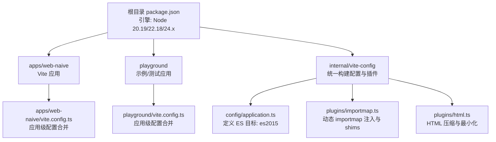
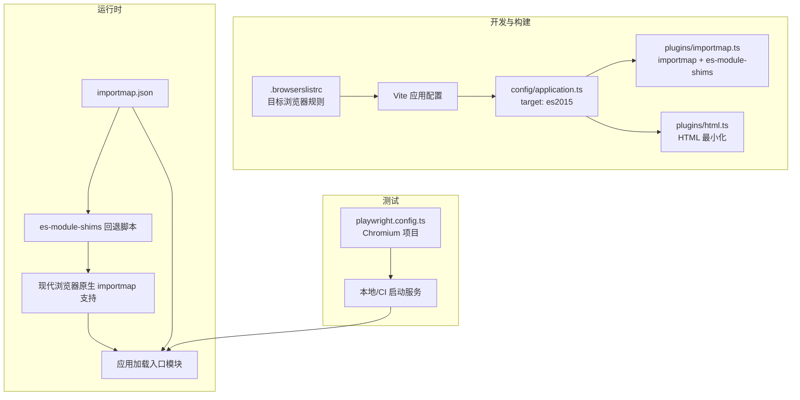
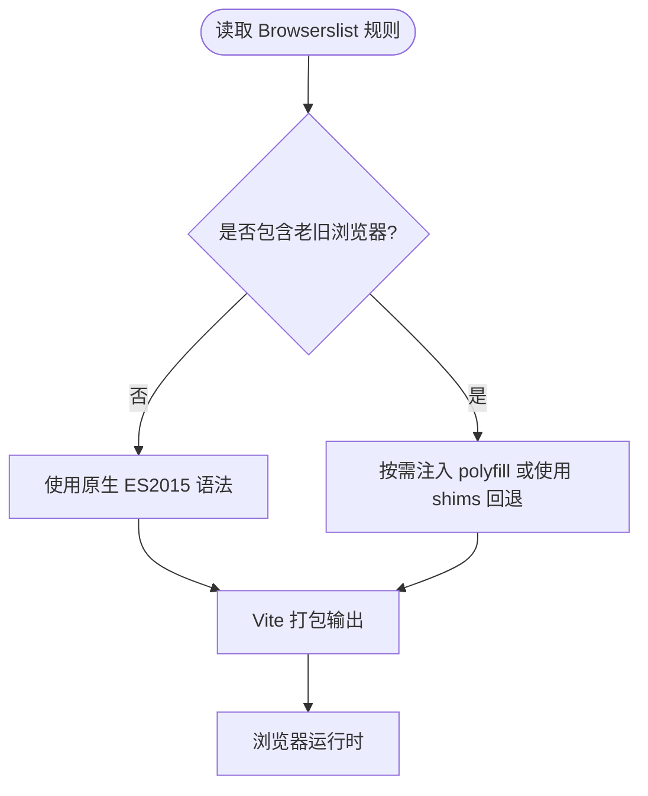
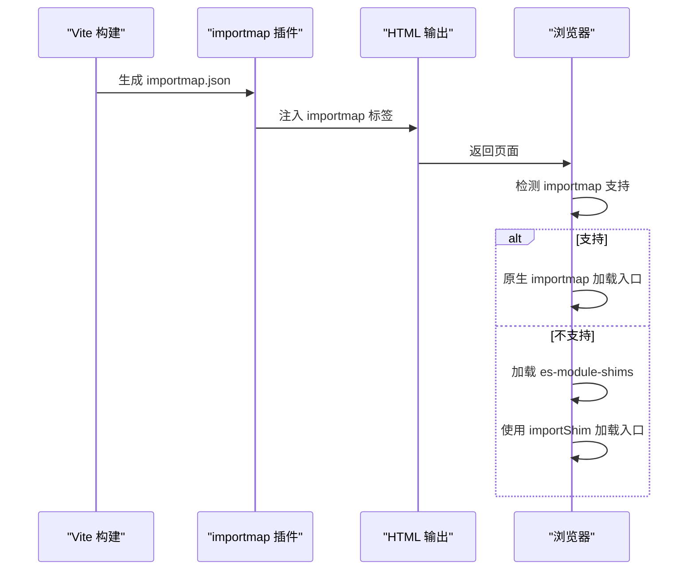
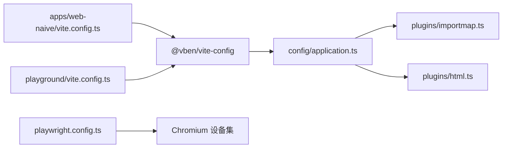

# 兼容性问题

<cite>
**本文引用的文件**
- [.browserslistrc](file://.browserslistrc)
- [package.json](file://package.json)
- [apps/web-naive/package.json](file://apps/web-naive/package.json)
- [playground/package.json](file://playground/package.json)
- [apps/web-naive/vite.config.ts](file://apps/web-naive/vite.config.ts)
- [playground/vite.config.ts](file://playground/vite.config.ts)
- [internal/vite-config/src/config/application.ts](file://internal/vite-config/src/config/application.ts)
- [internal/vite-config/src/options.ts](file://internal/vite-config/src/options.ts)
- [internal/vite-config/src/plugins/importmap.ts](file://internal/vite-config/src/plugins/importmap.ts)
- [internal/vite-config/src/plugins/html.ts](file://internal/vite-config/src/plugins/html.ts)
- [playground/playwright.config.ts](file://playground/playwright.config.ts)
</cite>

## 目录

1. [简介](#简介)
2. [项目结构](#项目结构)
3. [核心组件](#核心组件)
4. [架构总览](#架构总览)
5. [详细组件分析](#详细组件分析)
6. [依赖分析](#依赖分析)
7. [性能考虑](#性能考虑)
8. [故障排查指南](#故障排查指南)
9. [结论](#结论)
10. [附录](#附录)

## 简介

本指南面向 shiyu-ui（基于 Vite 的多包管理仓库）在浏览器与 Node.js 环境中的兼容性问题排查，覆盖以下方面：

- 浏览器与 Node.js 版本范围、ES 目标与 API 兼容策略
- Polyfill 与运行时补丁使用建议
- 浏览器测试策略与自动化兼容性检查方法
- 移动端适配、触摸事件与响应式布局的兼容性要点
- 第三方库版本兼容性、CSS 前缀处理与渐进增强实践
- 兼容性矩阵与测试清单，帮助快速定位与修复问题

## 项目结构

本项目采用 pnpm 工作区 + Turbo 构建，前端应用位于 apps/web-naive 与 playground，内部工具链集中在 internal 目录，核心构建配置由 @vben/vite-config 提供。

图表来源

- [package.json:104-107](file://package.json#L104-L107)
- [apps/web-naive/vite.config.ts:1-21](file://apps/web-naive/vite.config.ts#L1-L21)
- [playground/vite.config.ts:1-21](file://playground/vite.config.ts#L1-L21)
- [internal/vite-config/src/config/application.ts:75](file://internal/vite-config/src/config/application.ts#L75)
- [internal/vite-config/src/plugins/importmap.ts:44-192](file://internal/vite-config/src/plugins/importmap.ts#L44-L192)
- [internal/vite-config/src/plugins/html.ts:17-36](file://internal/vite-config/src/plugins/html.ts#L17-L36)

章节来源

- [package.json:104-107](file://package.json#L104-L107)
- [apps/web-naive/vite.config.ts:1-21](file://apps/web-naive/vite.config.ts#L1-L21)
- [playground/vite.config.ts:1-21](file://playground/vite.config.ts#L1-L21)
- [internal/vite-config/src/config/application.ts:75](file://internal/vite-config/src/config/application.ts#L75)
- [internal/vite-config/src/plugins/importmap.ts:44-192](file://internal/vite-config/src/plugins/importmap.ts#L44-L192)
- [internal/vite-config/src/plugins/html.ts:17-36](file://internal/vite-config/src/plugins/html.ts#L17-L36)

## 核心组件

- 浏览器目标与 Node 引擎
  - 浏览器目标：Browserslist 规则与构建 ES 目标共同决定浏览器兼容范围
  - Node 引擎：严格限定于 20.19、22.18、24.0 三个大版本
- 构建与打包
  - ES 目标：es2015，确保现代浏览器原生支持
  - 插件体系：importmap 动态导入映射与 shims 回退、HTML 压缩、PWA 清单等
- 自动化测试
  - Playwright 配置包含 Chromium 项目，支持本地与 CI 环境

章节来源

- [.browserslistrc:1-5](file://.browserslistrc#L1-L5)
- [package.json:104-107](file://package.json#L104-L107)
- [internal/vite-config/src/config/application.ts:75](file://internal/vite-config/src/config/application.ts#L75)
- [internal/vite-config/src/options.ts:28-43](file://internal/vite-config/src/options.ts#L28-L43)
- [internal/vite-config/src/plugins/importmap.ts:194-243](file://internal/vite-config/src/plugins/importmap.ts#L194-L243)
- [playground/playwright.config.ts:26-74](file://playground/playwright.config.ts#L26-L74)

## 架构总览

下图展示从开发到构建再到运行时的兼容性相关路径：Browserslist 与 ES 目标影响打包输出；importmap 插件在生产构建中注入 importmap 并回退到 es-module-shims；HTML 插件负责最小化；Playwright 负责端到端测试。

图表来源

- [.browserslistrc:1-5](file://.browserslistrc#L1-L5)
- [internal/vite-config/src/config/application.ts:75](file://internal/vite-config/src/config/application.ts#L75)
- [internal/vite-config/src/plugins/importmap.ts:153-187](file://internal/vite-config/src/plugins/importmap.ts#L153-L187)
- [internal/vite-config/src/plugins/importmap.ts:194-243](file://internal/vite-config/src/plugins/importmap.ts#L194-L243)
- [internal/vite-config/src/plugins/html.ts:17-36](file://internal/vite-config/src/plugins/html.ts#L17-L36)
- [playground/playwright.config.ts:97-106](file://playwright.config.ts#L97-L106)

## 详细组件分析

### 浏览器目标与 ES 目标

- Browserslist 规则
  - 覆盖全球份额较大与最近两个版本的主流浏览器，排除 IE11
  - 影响打包时的语法降级与 polyfill 注入策略
- ES 目标
  - 构建配置中显式设置 target: es2015，确保现代浏览器原生支持
  - 对于更老的浏览器，需结合 importmap 的 shims 回退机制

图表来源

- [.browserslistrc:1-5](file://.browserslistrc#L1-L5)
- [internal/vite-config/src/config/application.ts:75](file://internal/vite-config/src/config/application.ts#L75)
- [internal/vite-config/src/plugins/importmap.ts:194-243](file://internal/vite-config/src/plugins/importmap.ts#L194-L243)

章节来源

- [.browserslistrc:1-5](file://.browserslistrc#L1-L5)
- [internal/vite-config/src/config/application.ts:75](file://internal/vite-config/src/config/application.ts#L75)

### importmap 插件与运行时回退

- importmap 注入
  - 生产构建阶段生成 importmap.json，并注入到 HTML 的 script 标签
- es-module-shims 回退
  - 当浏览器不支持 importmap 时，动态加载 es-module-shims 并重写入口模块加载逻辑
- CDN 提供商
  - 默认提供多个 CDN 源，便于在不同网络环境下选择稳定源

图表来源

- [internal/vite-config/src/plugins/importmap.ts:153-187](file://internal/vite-config/src/plugins/importmap.ts#L153-L187)
- [internal/vite-config/src/plugins/importmap.ts:194-243](file://internal/vite-config/src/plugins/importmap.ts#L194-L243)

章节来源

- [internal/vite-config/src/plugins/importmap.ts:44-192](file://internal/vite-config/src/plugins/importmap.ts#L44-L192)
- [internal/vite-config/src/plugins/importmap.ts:194-243](file://internal/vite-config/src/plugins/importmap.ts#L194-L243)
- [internal/vite-config/src/options.ts:31-43](file://internal/vite-config/src/options.ts#L31-L43)

### HTML 最小化与 PWA 清单

- HTML 最小化
  - 在构建完成后对 index.html 进行压缩，减少体积并提升加载速度
- PWA 清单
  - 自动生成 PWA 清单与图标，提升离线体验与安装能力

章节来源

- [internal/vite-config/src/plugins/html.ts:17-36](file://internal/vite-config/src/plugins/html.ts#L17-L36)
- [internal/vite-config/src/options.ts:7-26](file://internal/vite-config/src/options.ts#L7-L26)

### Node.js 引擎与应用依赖

- Node 引擎
  - 严格限定版本范围，避免在不同 Node 版本上出现不可复现问题
- 应用依赖
  - web-naive 与 playground 均依赖 @vben/\* 工作区包与 catalog: 列表中的外部依赖
  - 关键依赖如 vue、vue-router、pinia、naive-ui 等版本需与构建目标匹配

章节来源

- [package.json:104-107](file://package.json#L104-L107)
- [apps/web-naive/package.json:28-49](file://apps/web-naive/package.json#L28-L49)
- [playground/package.json:31-57](file://playground/package.json#L31-L57)

## 依赖分析

- 组件耦合
  - 应用层通过 @vben/vite-config 统一加载插件与通用配置，降低重复配置成本
  - importmap 插件与 HTML 插件在构建期协作，确保运行时兼容性
- 外部依赖
  - 浏览器兼容性依赖于 Browserslist 与 ES 目标；运行时兼容性依赖 importmap 与 es-module-shims
  - 测试依赖 Playwright，支持 Chromium 项目，便于在 CI 中执行端到端验证

图表来源

- [apps/web-naive/vite.config.ts:1-21](file://apps/web-naive/vite.config.ts#L1-L21)
- [playground/vite.config.ts:1-21](file://playground/vite.config.ts#L1-L21)
- [internal/vite-config/src/config/application.ts:17-98](file://internal/vite-config/src/config/application.ts#L17-L98)
- [internal/vite-config/src/plugins/importmap.ts:44-192](file://internal/vite-config/src/plugins/importmap.ts#L44-L192)
- [internal/vite-config/src/plugins/html.ts:17-36](file://internal/vite-config/src/plugins/html.ts#L17-L36)
- [playground/playwright.config.ts:26-74](file://playground/playwright.config.ts#L26-L74)

章节来源

- [apps/web-naive/vite.config.ts:1-21](file://apps/web-naive/vite.config.ts#L1-L21)
- [playground/vite.config.ts:1-21](file://playground/vite.config.ts#L1-L21)
- [internal/vite-config/src/config/application.ts:17-98](file://internal/vite-config/src/config/application.ts#L17-L98)
- [internal/vite-config/src/plugins/importmap.ts:44-192](file://internal/vite-config/src/plugins/importmap.ts#L44-L192)
- [internal/vite-config/src/plugins/html.ts:17-36](file://internal/vite-config/src/plugins/html.ts#L17-L36)
- [playground/playwright.config.ts:26-74](file://playground/playwright.config.ts#L26-L74)

## 性能考虑

- 构建优化
  - ES2015 目标与现代浏览器特性配合，减少不必要的降级与 polyfill 注入
  - HTML 压缩与资源分包策略有助于减小首屏体积
- 运行时性能
  - importmap 与 es-module-shims 的组合在不支持 importmap 的浏览器中仍可工作，但会增加一次脚本加载与初始化开销
- 测试性能
  - Playwright 在 CI 中启用 headless，减少资源消耗；仅在 CI 上启用重试，平衡稳定性与速度

## 故障排查指南

### 浏览器兼容性问题

- 症状
  - 页面白屏或报错，提示 importmap 或动态导入相关错误
- 排查步骤
  - 确认浏览器是否支持原生 importmap；若不支持，检查 es-module-shims 是否成功加载
  - 检查 importmap.json 是否正确注入到 HTML
  - 核对 Browserslist 与 ES 目标是否导致某些语法未被转换
- 解决方案
  - 在 importmap 插件中切换默认 CDN 提供商，提高稳定性
  - 如确需支持更老浏览器，考虑在构建配置中引入必要的 polyfill 或降级策略

章节来源

- [internal/vite-config/src/plugins/importmap.ts:153-187](file://internal/vite-config/src/plugins/importmap.ts#L153-L187)
- [internal/vite-config/src/plugins/importmap.ts:194-243](file://internal/vite-config/src/plugins/importmap.ts#L194-L243)
- [.browserslistrc:1-5](file://.browserslistrc#L1-L5)
- [internal/vite-config/src/config/application.ts:75](file://internal/vite-config/src/config/application.ts#L75)

### Node.js 版本问题

- 症状
  - 构建失败或行为异常，尤其在 CI 环境
- 排查步骤
  - 检查本地与 CI 的 Node 版本是否满足 engines 要求
- 解决方案
  - 使用与 engines 匹配的 Node 版本；必要时在 CI 中固定 Node 版本

章节来源

- [package.json:104-107](file://package.json#L104-L107)

### 第三方库版本冲突

- 症状
  - 运行时报错或功能异常，尤其是 UI 组件库或状态管理库
- 排查步骤
  - 对比 apps/web-naive 与 playground 的依赖版本，确认是否一致
  - 检查依赖树中是否存在重复或不兼容的子依赖
- 解决方案
  - 使用 pnpm 锁定版本，保持工作区内依赖一致性
  - 避免直接在应用内覆盖工作区包版本

章节来源

- [apps/web-naive/package.json:28-49](file://apps/web-naive/package.json#L28-L49)
- [playground/package.json:31-57](file://playground/package.json#L31-L57)

### 移动端适配与触摸事件

- 症状
  - 移动端点击无反馈、滚动卡顿、布局错乱
- 排查步骤
  - 检查 CSS 媒体查询与视口配置
  - 确认触摸事件绑定与防抖策略
- 解决方案
  - 使用 CSS 响应式单位与媒体查询
  - 在交互组件中统一处理触摸与鼠标事件，避免重复绑定

### 自动化兼容性检查

- 端到端测试
  - 使用 Playwright 的 Chromium 项目进行回归测试
  - 在 CI 中启用 headless 与重试策略
- 测试清单
  - 桌面端：Chrome 最新两个版本
  - 移动端：模拟 Pixel 5/iPhone 12
  - 特殊场景：禁用 JavaScript、弱网环境

章节来源

- [playground/playwright.config.ts:26-74](file://playground/playwright.config.ts#L26-L74)
- [playground/playwright.config.ts:97-106](file://playground/playwright.config.ts#L97-L106)

## 结论

本项目通过明确的浏览器目标、ES2015 目标与 importmap + es-module-shims 的运行时回退机制，在保证现代浏览器体验的同时兼顾了兼容性。结合 Playwright 的端到端测试与严格的 Node 引擎约束，能够有效降低跨浏览器与跨版本的不确定性。建议在新增功能时遵循现有构建与测试策略，避免引入破坏兼容性的变更。

## 附录

### 兼容性矩阵（示例）

- 浏览器目标
  - 全球份额 >1% 且最近两个版本，排除 IE11
- Node.js 引擎
  - 20.19.x、22.18.x、24.0.x
- ES 目标
  - es2015
- 运行时回退
  - 不支持 importmap 的浏览器自动加载 es-module-shims

章节来源

- [.browserslistrc:1-5](file://.browserslistrc#L1-L5)
- [package.json:104-107](file://package.json#L104-L107)
- [internal/vite-config/src/config/application.ts:75](file://internal/vite-config/src/config/application.ts#L75)
- [internal/vite-config/src/plugins/importmap.ts:194-243](file://internal/vite-config/src/plugins/importmap.ts#L194-L243)
