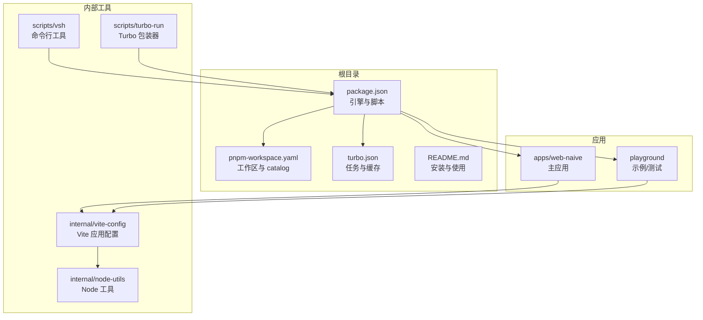
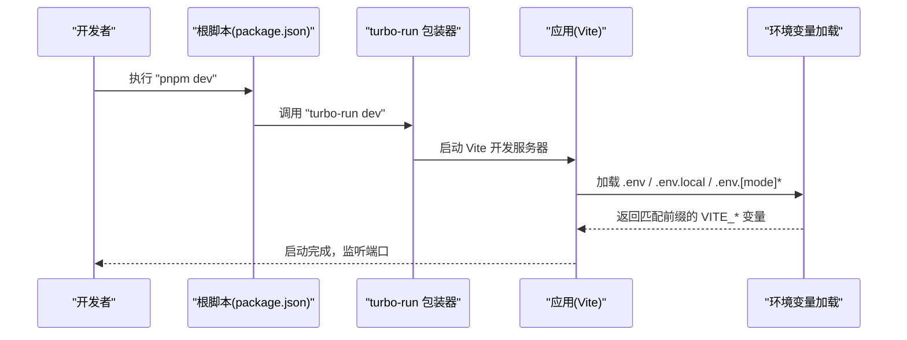
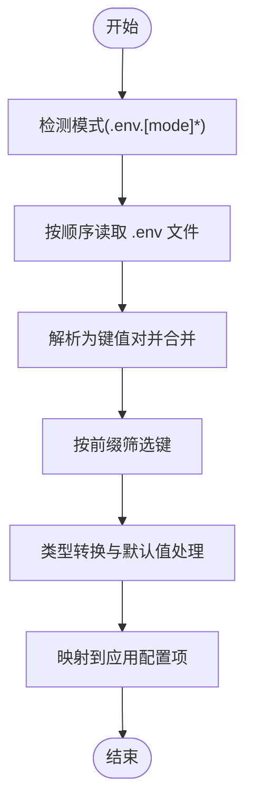
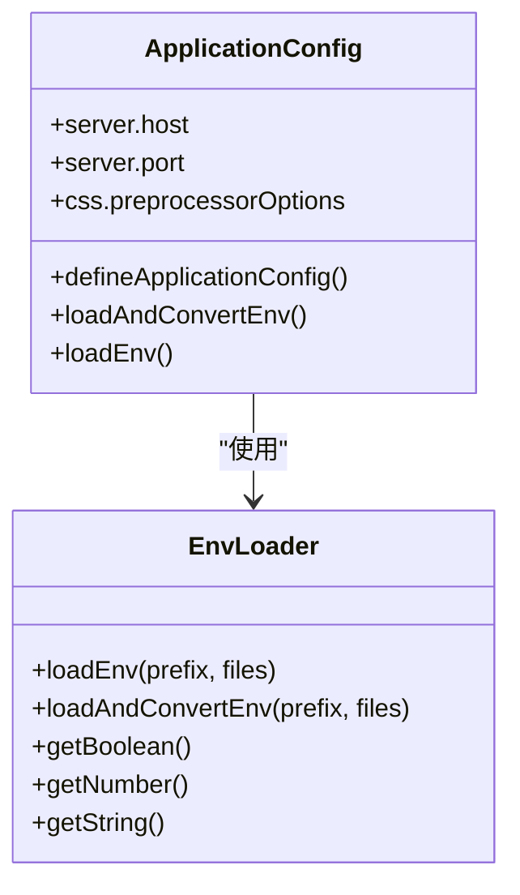
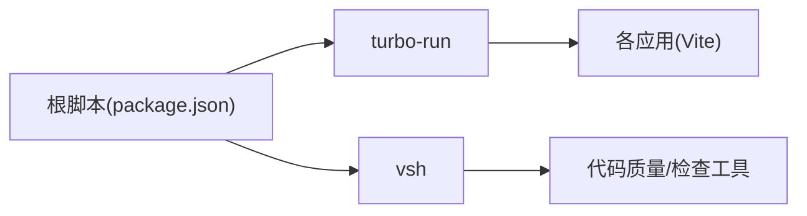
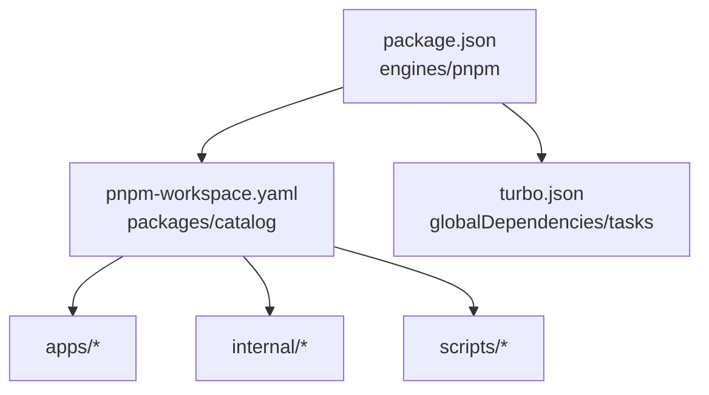

# 开发环境问题排查指南

<cite>
**本文档引用的文件**
- [package.json](file://package.json)
- [pnpm-workspace.yaml](file://pnpm-workspace.yaml)
- [turbo.json](file://turbo.json)
- [README.md](file://README.md)
- [apps/web-naive/package.json](file://apps/web-naive/package.json)
- [playground/package.json](file://playground/package.json)
- [.gitpod.yml](file://.gitpod.yml)
- [internal/vite-config/src/utils/env.ts](file://internal/vite-config/src/utils/env.ts)
- [internal/vite-config/src/config/application.ts](file://internal/vite-config/src/config/application.ts)
- [eslint.config.mjs](file://eslint.config.mjs)
- [scripts/vsh/bin/vsh.mjs](file://scripts/vsh/bin/vsh.mjs)
- [scripts/turbo-run/bin/turbo-run.mjs](file://scripts/turbo-run/bin/turbo-run.mjs)
</cite>

## 目录

1. [简介](#简介)
2. [项目结构](#项目结构)
3. [核心组件](#核心组件)
4. [架构概览](#架构概览)
5. [详细组件分析](#详细组件分析)
6. [依赖关系分析](#依赖关系分析)
7. [性能考虑](#性能考虑)
8. [故障排除指南](#故障排除指南)
9. [结论](#结论)
10. [附录](#附录)

## 简介

本指南面向 shiyu-ui（基于 Vue Vben Admin）项目的开发者，聚焦于开发环境配置与运行中的常见问题排查。内容涵盖 Node.js 版本不兼容、pnpm 安装失败、依赖冲突、环境变量配置错误等，并提供 IDE 配置、调试设置、开发服务器启动问题的排查步骤与快速修复方法。

## 项目结构

该项目采用 monorepo 架构，使用 pnpm workspace 管理多包依赖，通过 Turbo 进行任务编排，Vite 提供开发服务器与构建能力。核心应用位于 apps/web-naive，示例与测试在 playground，内部工具与配置位于 internal 与 scripts。

**图表来源**

- [package.json:1-110](file://package.json#L1-L110)
- [pnpm-workspace.yaml:1-192](file://pnpm-workspace.yaml#L1-L192)
- [turbo.json:1-49](file://turbo.json#L1-L49)
- [apps/web-naive/package.json:1-51](file://apps/web-naive/package.json#L1-L51)
- [playground/package.json:1-63](file://playground/package.json#L1-L63)

**章节来源**

- [package.json:1-110](file://package.json#L1-L110)
- [pnpm-workspace.yaml:1-192](file://pnpm-workspace.yaml#L1-L192)
- [turbo.json:1-49](file://turbo.json#L1-L49)
- [README.md:55-82](file://README.md#L55-L82)

## 核心组件

- 引擎与包管理器：根 package.json 声明 Node 与 pnpm 版本范围，确保开发环境满足最低版本要求。
- 工作区与 catalog：pnpm-workspace.yaml 定义工作区包集合与统一依赖版本 catalog，减少重复与冲突。
- 任务编排：turbo.json 配置全局依赖、环境变量与任务缓存策略，支持并行与增量构建。
- 应用配置：internal/vite-config 提供应用级 Vite 配置加载与环境变量转换逻辑。
- 脚本入口：scripts/turbo-run 与 scripts/vsh 提供统一的开发与工具命令入口。

**章节来源**

- [package.json:104-109](file://package.json#L104-L109)
- [pnpm-workspace.yaml:1-192](file://pnpm-workspace.yaml#L1-L192)
- [turbo.json:14-47](file://turbo.json#L14-L47)
- [internal/vite-config/src/utils/env.ts:37-111](file://internal/vite-config/src/utils/env.ts#L37-L111)
- [scripts/turbo-run/bin/turbo-run.mjs:1-4](file://scripts/turbo-run/bin/turbo-run.mjs#L1-L4)
- [scripts/vsh/bin/vsh.mjs:1-4](file://scripts/vsh/bin/vsh.mjs#L1-L4)

## 架构概览

开发流程从根脚本触发，经由 turbo-run 进入各应用或内部工具，再由 Vite 加载环境变量与插件，最终启动开发服务器。

**图表来源**

- [package.json:46](file://package.json#L46)
- [scripts/turbo-run/bin/turbo-run.mjs:1-4](file://scripts/turbo-run/bin/turbo-run.mjs#L1-L4)
- [internal/vite-config/src/config/application.ts:17-99](file://internal/vite-config/src/config/application.ts#L17-L99)
- [internal/vite-config/src/utils/env.ts:37-111](file://internal/vite-config/src/utils/env.ts#L37-L111)

## 详细组件分析

### 环境变量系统

- 文件解析顺序：按 .env → .env.local → .env.[mode] → .env.[mode].local 的优先级合并。
- 变量筛选：仅保留以指定前缀开头的键；默认前缀为 VITE*GLOB*。
- 类型转换：布尔、数字、字符串的自动解析与回退值处理。
- 应用映射：将 VITE\_\* 变量转换为应用配置项（如端口、压缩类型、PWA 开关等）。

**图表来源**

- [internal/vite-config/src/utils/env.ts:21-111](file://internal/vite-config/src/utils/env.ts#L21-L111)

**章节来源**

- [internal/vite-config/src/utils/env.ts:37-111](file://internal/vite-config/src/utils/env.ts#L37-L111)

### Vite 应用配置

- 插件加载：根据命令（开发/构建）与模式动态启用/禁用插件（如 PWA、可视化、Nitro Mock 等）。
- 服务器配置：host 公网可访问、默认端口、预热资源列表。
- CSS 处理：针对 apps 下的应用注入全局样式，使用 NodePackageImporter 支持现代 Sass 导入。
- 任务集成：与 Turbo 任务配合，支持持久化开发进程与缓存控制。

**图表来源**

- [internal/vite-config/src/config/application.ts:17-124](file://internal/vite-config/src/config/application.ts#L17-L124)
- [internal/vite-config/src/utils/env.ts:37-111](file://internal/vite-config/src/utils/env.ts#L37-L111)

**章节来源**

- [internal/vite-config/src/config/application.ts:58-99](file://internal/vite-config/src/config/application.ts#L58-L99)
- [internal/vite-config/src/utils/env.ts:66-108](file://internal/vite-config/src/utils/env.ts#L66-L108)

### 脚本与工具链

- 根脚本：提供 bootstrap、dev、build、lint、test 等常用命令。
- turbo-run：统一入口，便于扩展与跨平台执行。
- vsh：内部命令行工具包装，提供检查、格式化、发布等子命令。

**图表来源**

- [package.json:27-67](file://package.json#L27-L67)
- [scripts/turbo-run/bin/turbo-run.mjs:1-4](file://scripts/turbo-run/bin/turbo-run.mjs#L1-L4)
- [scripts/vsh/bin/vsh.mjs:1-4](file://scripts/vsh/bin/vsh.mjs#L1-L4)

**章节来源**

- [package.json:27-67](file://package.json#L27-L67)
- [scripts/turbo-run/bin/turbo-run.mjs:1-4](file://scripts/turbo-run/bin/turbo-run.mjs#L1-L4)
- [scripts/vsh/bin/vsh.mjs:1-4](file://scripts/vsh/bin/vsh.mjs#L1-L4)

## 依赖关系分析

- 工作区与 catalog：pnpm-workspace.yaml 将内部包与外部依赖统一纳入 catalog，避免版本漂移与冲突。
- 引擎约束：根 package.json 对 Node 与 pnpm 版本进行严格约束，确保一致的开发体验。
- 任务依赖：turbo.json 声明全局依赖与任务输出，提升缓存命中率与增量构建效率。

**图表来源**

- [package.json:104-109](file://package.json#L104-L109)
- [pnpm-workspace.yaml:1-192](file://pnpm-workspace.yaml#L1-L192)
- [turbo.json:3-47](file://turbo.json#L3-L47)

**章节来源**

- [pnpm-workspace.yaml:1-192](file://pnpm-workspace.yaml#L1-L192)
- [turbo.json:3-47](file://turbo.json#L3-L47)

## 性能考虑

- 开发服务器预热：通过 warmup.clientFiles 列表预热关键文件，缩短首屏等待时间。
- 构建目标：ES2015 目标与最小化配置，平衡兼容性与体积。
- 缓存策略：Turbo 的 globalDependencies 与任务输出配置，结合持久化开发进程，显著提升迭代速度。

**章节来源**

- [internal/vite-config/src/config/application.ts:79-90](file://internal/vite-config/src/config/application.ts#L79-L90)
- [turbo.json:14-47](file://turbo.json#L14-L47)

## 故障排除指南

### 1. Node.js 版本不兼容

- 症状
  - 安装阶段报错，提示 Node 版本过低或过高
  - 运行时出现语法错误或功能缺失
- 识别方法
  - 查看根 package.json 中 engines 字段
  - 使用 node -v 检查当前版本
- 解决方案
  - 升级/降级到受支持的版本范围
  - 使用版本管理器（如 nvm 或 asdf）切换 Node 版本
  - 确保 pnpm 与 Node 版本满足 packageManager 与 engines 要求

**章节来源**

- [package.json:104-109](file://package.json#L104-L109)

### 2. pnpm 安装失败

- 症状
  - 安装卡住、超时或部分包下载失败
  - 报告“仅允许 pnpm”或权限问题
- 识别方法
  - 检查是否通过 npx only-allow pnpm 触发的限制
  - 查看网络代理与 registry 配置
- 解决方案
  - 使用官方推荐的 pnpm 版本（packageManager）
  - 清理锁文件后重装：删除 pnpm-lock.yaml 并重新安装
  - 确认 pnpm 版本满足工作区要求（>=10）

**章节来源**

- [package.json:57](file://package.json#L57)
- [package.json:108](file://package.json#L108)
- [pnpm-workspace.yaml:1-192](file://pnpm-workspace.yaml#L1-L192)

### 3. 依赖冲突与版本漂移

- 症状
  - 不同包使用相同依赖的不同版本
  - 构建或运行时报模块找不到
- 识别方法
  - 使用 pnpm 入侵式检查（如 vsh check-dep）或依赖图分析
  - 关注 overrides 与 catalog 中的版本锁定
- 解决方案
  - 统一使用 catalog 版本，避免各自声明不同版本
  - 在 overrides 中显式固定关键依赖版本
  - 保持 pnpm-lock.yaml 与 pnpm-workspace.yaml 同步

**章节来源**

- [pnpm-workspace.yaml:16-23](file://pnpm-workspace.yaml#L16-L23)
- [pnpm-workspace.yaml:23-192](file://pnpm-workspace.yaml#L23-L192)

### 4. 环境变量配置错误

- 症状
  - 开发服务器端口异常、功能未按预期开启
  - Vite 插件行为不符合预期
- 识别方法
  - 检查 .env、.env.local、.env.[mode]、.env.[mode].local 是否存在
  - 确认变量前缀是否符合加载规则（默认 VITE*GLOB*）
- 解决方案
  - 按优先级顺序放置配置文件
  - 使用正确的前缀（默认 VITE*GLOB*），必要时调整加载前缀
  - 重启开发服务器以使新变量生效

**章节来源**

- [internal/vite-config/src/utils/env.ts:21-64](file://internal/vite-config/src/utils/env.ts#L21-L64)
- [internal/vite-config/src/utils/env.ts:66-108](file://internal/vite-config/src/utils/env.ts#L66-L108)

### 5. 开发服务器启动问题

- 症状
  - 端口被占用、无法启动或频繁重启
  - 预热资源导致冷启动缓慢
- 识别方法
  - 查看 Vite server.port 与 host 配置
  - 检查持久化任务与缓存状态
- 解决方案
  - 修改 .env 中的 VITE_PORT 或在命令行传参
  - 清理 Turbo 缓存或临时禁用持久化开发进程
  - 调整 warmup.clientFiles 列表，仅包含必要文件

**章节来源**

- [internal/vite-config/src/config/application.ts:79-90](file://internal/vite-config/src/config/application.ts#L79-L90)
- [turbo.json:38-43](file://turbo.json#L38-L43)

### 6. IDE 配置与调试设置

- 推荐配置
  - 使用 TypeScript 与 ESLint 插件，启用自动修复
  - 在编辑器中设置 TypeScript 项目引用与路径映射
  - 配置调试任务以附加到 Vite 进程
- 常见问题
  - 路径别名不生效、类型检查失败
  - ESLint 与 Prettier 冲突
- 解决方案
  - 确保 tsconfig 引用与路径映射正确
  - 使用根 ESLint 配置（eslint.config.mjs）统一规则
  - 在 IDE 中选择正确的 Node 解释器与工作目录

**章节来源**

- [eslint.config.mjs:1-4](file://eslint.config.mjs#L1-L4)

### 7. 快速修复清单

- 环境检查
  - Node 版本是否在 engines 范围内
  - pnpm 版本是否满足 packageManager 与工作区要求
  - 是否使用 pnpm 作为唯一包管理器
- 依赖与工作区
  - pnpm-lock.yaml 是否与 pnpm-workspace.yaml 一致
  - overrides 与 catalog 是否覆盖关键依赖
- 开发与构建
  - .env\* 文件是否存在且前缀正确
  - Vite server.port 是否被占用
  - Turbo 缓存是否需要清理

**章节来源**

- [package.json:104-109](file://package.json#L104-L109)
- [pnpm-workspace.yaml:16-23](file://pnpm-workspace.yaml#L16-L23)
- [internal/vite-config/src/utils/env.ts:21-64](file://internal/vite-config/src/utils/env.ts#L21-L64)

## 结论

通过遵循本指南的检查清单与分步排查方法，可以高效定位并解决 shiyu-ui 开发环境中的常见问题。建议在团队内统一 Node/pnpm 版本、严格使用 catalog 锁定依赖、规范 .env\* 文件命名与前缀，并利用 Turbo 与 Vite 的缓存与预热机制提升开发效率。

## 附录

### A. 常用命令速查

- 安装依赖：pnpm install
- 启动开发：pnpm dev
- 构建产物：pnpm build
- 类型检查：pnpm run check:type
- 代码检查：pnpm run lint
- 清理缓存：pnpm clean

**章节来源**

- [package.json:27-67](file://package.json#L27-L67)

### B. 环境变量前缀与用途

- 默认前缀：VITE*GLOB*（可通过加载函数调整）
- 常用键：VITE_APP_TITLE、VITE_PORT、VITE_BASE、VITE_COMPRESS、VITE_PWA、VITE_DEVTOOLS 等
- 转换规则：布尔/数字/字符串自动解析与回退值

**章节来源**

- [internal/vite-config/src/utils/env.ts:37-111](file://internal/vite-config/src/utils/env.ts#L37-L111)
