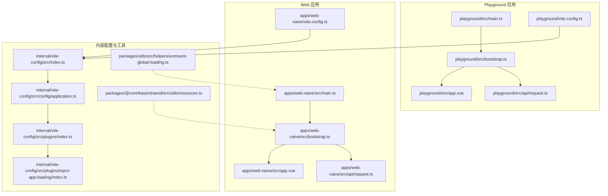
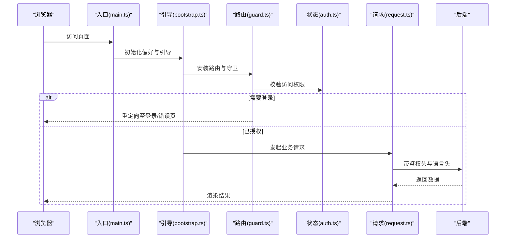
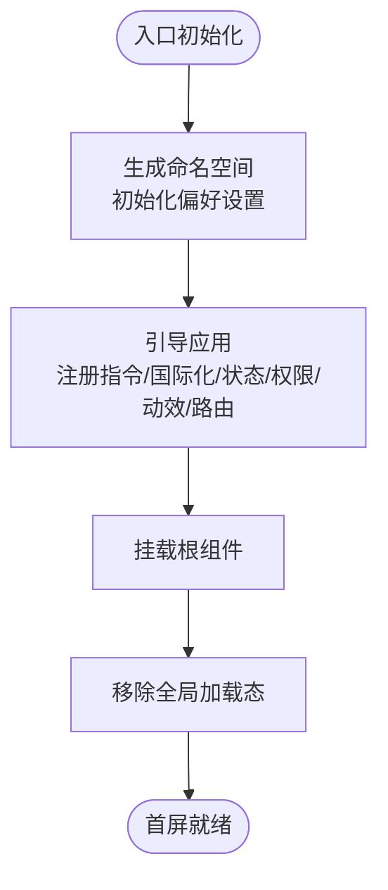
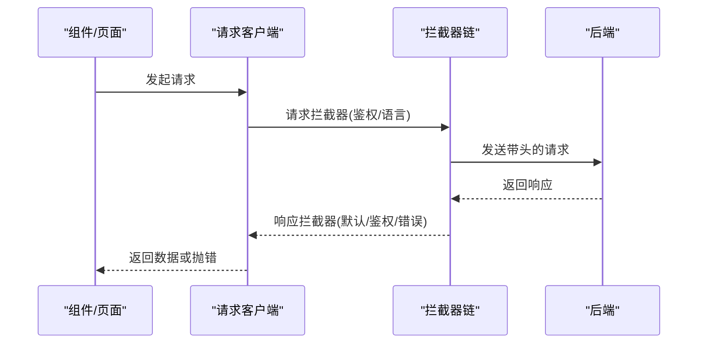
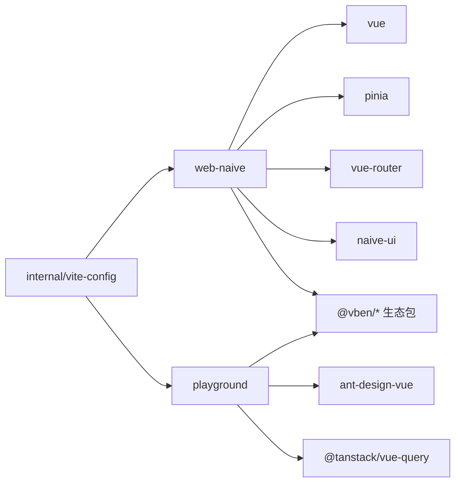

# 性能问题

<cite>
**本文引用的文件**
- [apps/web-naive/package.json](file://apps/web-naive/package.json)
- [apps/web-naive/vite.config.ts](file://apps/web-naive/vite.config.ts)
- [apps/web-naive/src/main.ts](file://apps/web-naive/src/main.ts)
- [apps/web-naive/src/bootstrap.ts](file://apps/web-naive/src/bootstrap.ts)
- [apps/web-naive/src/app.vue](file://apps/web-naive/src/app.vue)
- [apps/web-naive/src/api/request.ts](file://apps/web-naive/src/api/request.ts)
- [apps/web-naive/src/views/_core/fallback/offline.vue](file://apps/web-naive/src/views/_core/fallback/offline.vue)
- [apps/web-naive/src/views/_core/fallback/forbidden.vue](file://apps/web-naive/src/views/_core/fallback/forbidden.vue)
- [apps/web-naive/src/views/_core/fallback/internal-error.vue](file://apps/web-naive/src/views/_core/fallback/internal-error.vue)
- [apps/web-naive/src/views/_core/fallback/not-found.vue](file://apps/web-naive/src/views/_core/fallback/not-found.vue)
- [apps/web-naive/src/views/_core/fallback/coming-soon.vue](file://apps/web-naive/src/views/_core/fallback/coming-soon.vue)
- [apps/web-naive/src/router/routes/modules/dashboard.ts](file://apps/web-naive/src/router/routes/modules/dashboard.ts)
- [apps/web-naive/src/router/routes/modules/demos.ts](file://apps/web-naive/src/router/routes/modules/demos.ts)
- [apps/web-naive/src/router/routes/modules/vben.ts](file://apps/web-naive/src/router/routes/modules/vben.ts)
- [apps/web-naive/src/router/guard.ts](file://apps/web-naive/src/router/guard.ts)
- [apps/web-naive/src/store/auth.ts](file://apps/web-naive/src/store/auth.ts)
- [apps/web-naive/src/locales/index.ts](file://apps/web-naive/src/locales/index.ts)
- [apps/web-naive/src/preferences.ts](file://apps/web-naive/src/preferences.ts)
- [apps/web-naive/public/index.html](file://apps/web-naive/public/index.html)
- [playground/package.json](file://playground/package.json)
- [playground/vite.config.ts](file://playground/vite.config.ts)
- [playground/src/api/request.ts](file://playground/src/api/request.ts)
- [playground/src/main.ts](file://playground/src/main.ts)
- [playground/src/bootstrap.ts](file://playground/src/bootstrap.ts)
- [playground/src/app.vue](file://playground/src/app.vue)
- [playground/src/views/demos/features/vue-query/index.vue](file://playground/src/views/demos/features/vue-query/index.vue)
- [internal/vite-config/src/index.ts](file://internal/vite-config/src/index.ts)
- [internal/vite-config/src/config/application.ts](file://internal/vite-config/src/config/application.ts)
- [internal/vite-config/src/plugins/index.ts](file://internal/vite-config/src/plugins/index.ts)
- [internal/vite-config/src/plugins/inject-app-loading/index.ts](file://internal/vite-config/src/plugins/inject-app-loading/index.ts)
- [packages/@core/base/shared/src/utils/resources.ts](file://packages/@core/base/shared/src/utils/resources.ts)
- [packages/utils/src/helpers/unmount-global-loading.ts](file://packages/utils/src/helpers/unmount-global-loading.ts)
- [packages/effects/access/src/accessible.ts](file://packages/effects/access/src/accessible.ts)
- [packages/@core/base/shared/src/cache/storage-manager.test.ts](file://packages/@core/base/shared/src/cache/storage-manager.test.ts)
- [packages/@core/base/shared/src/utils/__tests__/resources.test.ts](file://packages/@core/base/shared/src/utils/__tests__/resources.test.ts)
- [packages/@core/base/shared/src/utils/state-handler.test.ts](file://packages/@core/base/shared/src/utils/state-handler.test.ts)
- [packages/@core/base/shared/src/utils/tree.test.ts](file://packages/@core/base/shared/src/utils/tree.test.ts)
- [README.md](file://README.md)
</cite>

## 目录

1. [简介](#简介)
2. [项目结构](#项目结构)
3. [核心组件](#核心组件)
4. [架构总览](#架构总览)
5. [详细组件分析](#详细组件分析)
6. [依赖分析](#依赖分析)
7. [性能考虑](#性能考虑)
8. [故障排查指南](#故障排查指南)
9. [结论](#结论)
10. [附录](#附录)

## 简介

本指南面向 shiyu-ui 项目，聚焦于应用性能问题的排查与优化，覆盖首屏加载时间、内存使用与 CPU 占用率的分析方法，并结合项目现有构建与运行时配置，给出可操作的优化建议。同时提供性能分析工具使用要点（Chrome DevTools Performance/Memory/Lighthouse）、内存泄漏识别与修复思路、组件重渲染与 API 请求超时的定位手段，以及代码分割、懒加载与缓存策略的落地建议。最后总结性能基准测试与持续监控的最佳实践。

## 项目结构

该项目采用多包工作区结构，包含 Web 应用与 Playground 示例应用，以及内部 Vite 配置与共享工具库。Web 应用基于 Vite 构建，使用 Vue 3 + Naive UI；Playground 使用 Ant Design Vue，便于演示特性与性能对比。

图表来源

- [apps/web-naive/src/main.ts:1-32](file://apps/web-naive/src/main.ts#L1-L32)
- [apps/web-naive/src/bootstrap.ts:1-77](file://apps/web-naive/src/bootstrap.ts#L1-L77)
- [apps/web-naive/src/app.vue:1-57](file://apps/web-naive/src/app.vue#L1-L57)
- [apps/web-naive/vite.config.ts:1-21](file://apps/web-naive/vite.config.ts#L1-L21)
- [apps/web-naive/src/api/request.ts:1-120](file://apps/web-naive/src/api/request.ts#L1-L120)
- [playground/src/main.ts:1-32](file://playground/src/main.ts#L1-L32)
- [playground/src/bootstrap.ts:1-77](file://playground/src/bootstrap.ts#L1-L77)
- [playground/src/app.vue:1-57](file://playground/src/app.vue#L1-L57)
- [playground/vite.config.ts:1-21](file://playground/vite.config.ts#L1-L21)
- [playground/src/api/request.ts:1-134](file://playground/src/api/request.ts#L1-L134)
- [internal/vite-config/src/index.ts:1-6](file://internal/vite-config/src/index.ts#L1-L6)
- [internal/vite-config/src/config/application.ts:1-124](file://internal/vite-config/src/config/application.ts#L1-L124)
- [internal/vite-config/src/plugins/index.ts:1-255](file://internal/vite-config/src/plugins/index.ts#L1-L255)
- [internal/vite-config/src/plugins/inject-app-loading/index.ts:51-66](file://internal/vite-config/src/plugins/inject-app-loading/index.ts#L51-L66)
- [packages/@core/base/shared/src/utils/resources.ts:1-21](file://packages/@core/base/shared/src/utils/resources.ts#L1-L21)
- [packages/utils/src/helpers/unmount-global-loading.ts:1-31](file://packages/utils/src/helpers/unmount-global-loading.ts#L1-L31)

章节来源

- [apps/web-naive/package.json:1-51](file://apps/web-naive/package.json#L1-L51)
- [apps/web-naive/vite.config.ts:1-21](file://apps/web-naive/vite.config.ts#L1-L21)
- [playground/package.json:1-63](file://playground/package.json#L1-L63)
- [playground/vite.config.ts:1-21](file://playground/vite.config.ts#L1-L21)
- [internal/vite-config/src/config/application.ts:58-98](file://internal/vite-config/src/config/application.ts#L58-L98)
- [internal/vite-config/src/plugins/index.ts:94-223](file://internal/vite-config/src/plugins/index.ts#L94-L223)

## 核心组件

- 应用入口与启动流程
  - Web 应用入口负责初始化偏好设置、启动引导并移除全局加载态；Playground 采用相似流程。
  - 引导阶段注册指令、国际化、状态管理、路由、动效插件等，随后挂载根组件。
- 请求客户端与拦截器
  - 统一请求客户端封装了鉴权头、语言头、响应体转换、错误提示与刷新令牌等逻辑。
- 构建与运行时配置
  - Vite 应用配置启用压缩、PWA、可视化分析、预热、资源输出命名策略等，有助于控制体积与首屏。
- 加载与资源管理
  - 提供全局加载态注入与卸载、脚本动态加载工具，避免重复注入与阻塞。

章节来源

- [apps/web-naive/src/main.ts:9-31](file://apps/web-naive/src/main.ts#L9-L31)
- [apps/web-naive/src/bootstrap.ts:19-77](file://apps/web-naive/src/bootstrap.ts#L19-L77)
- [apps/web-naive/src/api/request.ts:63-104](file://apps/web-naive/src/api/request.ts#L63-L104)
- [playground/src/main.ts:9-31](file://playground/src/main.ts#L9-L31)
- [playground/src/bootstrap.ts:19-77](file://playground/src/bootstrap.ts#L19-L77)
- [playground/src/api/request.ts:77-120](file://playground/src/api/request.ts#L77-L120)
- [internal/vite-config/src/config/application.ts:60-98](file://internal/vite-config/src/config/application.ts#L60-L98)
- [internal/vite-config/src/plugins/index.ts:167-182](file://internal/vite-config/src/plugins/index.ts#L167-L182)
- [packages/@core/base/shared/src/utils/resources.ts:5-19](file://packages/@core/base/shared/src/utils/resources.ts#L5-L19)
- [packages/utils/src/helpers/unmount-global-loading.ts:8-31](file://packages/utils/src/helpers/unmount-global-loading.ts#L8-L31)

## 架构总览

下图展示从浏览器到后端的关键路径与性能相关节点：入口初始化、路由守卫、请求拦截、PWA 缓存、构建产物与资源加载。

图表来源

- [apps/web-naive/src/main.ts:9-31](file://apps/web-naive/src/main.ts#L9-L31)
- [apps/web-naive/src/bootstrap.ts:56-71](file://apps/web-naive/src/bootstrap.ts#L56-L71)
- [apps/web-naive/src/router/guard.ts](file://apps/web-naive/src/router/guard.ts)
- [apps/web-naive/src/store/auth.ts](file://apps/web-naive/src/store/auth.ts)
- [apps/web-naive/src/api/request.ts:63-104](file://apps/web-naive/src/api/request.ts#L63-L104)

## 详细组件分析

### 入口与引导流程（首屏关键路径）

- 初始化顺序
  - 偏好设置命名空间生成与覆盖
  - 引导函数按序注册指令、国际化、状态、权限指令、动效插件、路由，最后挂载
- 关键性能点
  - 全局加载态注入与卸载，避免白屏闪烁
  - 预热配置减少首次请求冷启动延迟
  - PWA 与压缩插件降低网络传输成本

图表来源

- [apps/web-naive/src/main.ts:9-31](file://apps/web-naive/src/main.ts#L9-L31)
- [apps/web-naive/src/bootstrap.ts:19-77](file://apps/web-naive/src/bootstrap.ts#L19-L77)
- [packages/utils/src/helpers/unmount-global-loading.ts:8-31](file://packages/utils/src/helpers/unmount-global-loading.ts#L8-L31)
- [internal/vite-config/src/config/application.ts:82-89](file://internal/vite-config/src/config/application.ts#L82-L89)

章节来源

- [apps/web-naive/src/main.ts:9-31](file://apps/web-naive/src/main.ts#L9-L31)
- [apps/web-naive/src/bootstrap.ts:19-77](file://apps/web-naive/src/bootstrap.ts#L19-L77)
- [packages/utils/src/helpers/unmount-global-loading.ts:8-31](file://packages/utils/src/helpers/unmount-global-loading.ts#L8-L31)
- [internal/vite-config/src/config/application.ts:82-89](file://internal/vite-config/src/config/application.ts#L82-L89)

### 请求与鉴权拦截（API 性能与稳定性）

- 请求头统一注入 Authorization 与 Accept-Language
- 默认响应体转换与错误消息拦截
- 鉴权拦截：支持刷新令牌与重新认证策略
- Playground 版本对 JSON BigInt 的特殊处理，避免大数精度丢失

图表来源

- [apps/web-naive/src/api/request.ts:63-104](file://apps/web-naive/src/api/request.ts#L63-L104)
- [playground/src/api/request.ts:77-120](file://playground/src/api/request.ts#L77-L120)

章节来源

- [apps/web-naive/src/api/request.ts:63-104](file://apps/web-naive/src/api/request.ts#L63-L104)
- [playground/src/api/request.ts:77-120](file://playground/src/api/request.ts#L77-L120)

### 路由与权限（导航性能）

- 路由守卫在导航前校验访问权限，避免无效渲染
- keep-alive 与懒加载组件的名称映射，配合缓存策略减少重渲染

章节来源

- [apps/web-naive/src/router/guard.ts](file://apps/web-naive/src/router/guard.ts)
- [packages/effects/access/src/accessible.ts:118-139](file://packages/effects/access/src/accessible.ts#L118-L139)

### 构建与资源（体积与加载）

- 输出命名策略与最小化开关
- 压缩（Brotli/Gzip）与可视化分析
- 预热关键文件，降低首开等待
- PWA 与 importmap（按需启用）

章节来源

- [internal/vite-config/src/config/application.ts:60-98](file://internal/vite-config/src/config/application.ts#L60-L98)
- [internal/vite-config/src/plugins/index.ts:167-199](file://internal/vite-config/src/plugins/index.ts#L167-L199)
- [apps/web-naive/vite.config.ts:7-17](file://apps/web-naive/vite.config.ts#L7-L17)
- [playground/vite.config.ts:7-17](file://playground/vite.config.ts#L7-L17)

### 加载态与资源注入（用户体验与性能）

- 全局加载态注入与过渡动画，避免闪烁
- 动态脚本加载去重，防止重复注入与阻塞

章节来源

- [internal/vite-config/src/plugins/inject-app-loading/index.ts:51-66](file://internal/vite-config/src/plugins/inject-app-loading/index.ts#L51-L66)
- [packages/utils/src/helpers/unmount-global-loading.ts:8-31](file://packages/utils/src/helpers/unmount-global-loading.ts#L8-L31)
- [packages/@core/base/shared/src/utils/resources.ts:5-19](file://packages/@core/base/shared/src/utils/resources.ts#L5-L19)

## 依赖分析

- Web 应用依赖
  - Vue 3、Pinia、Vue Router、Naive UI、@vben 生态包
  - 通过 workspace:\* 与内部包解耦，利于统一升级与维护
- Playground 应用依赖
  - Ant Design Vue、TanStack Vue Query 等，便于演示缓存与并发场景
- 内部配置
  - Vite 应用配置集中于 internal/vite-config，统一插件与选项

图表来源

- [apps/web-naive/package.json:28-49](file://apps/web-naive/package.json#L28-L49)
- [playground/package.json:31-57](file://playground/package.json#L31-L57)
- [internal/vite-config/src/index.ts:1-6](file://internal/vite-config/src/index.ts#L1-L6)

章节来源

- [apps/web-naive/package.json:28-49](file://apps/web-naive/package.json#L28-L49)
- [playground/package.json:31-57](file://playground/package.json#L31-L57)
- [internal/vite-config/src/index.ts:1-6](file://internal/vite-config/src/index.ts#L1-L6)

## 性能考虑

- 首屏加载时间
  - 优化入口初始化与引导顺序，确保关键渲染路径最短
  - 启用预热与压缩，合理拆分入口与页面级代码
  - 使用 PWA 缓存静态资源，减少二次访问延迟
- 内存使用
  - 控制全局状态规模，避免冗余订阅
  - 合理使用 keep-alive 与懒加载，避免常驻内存的无用组件
  - 注意动态脚本注入的生命周期，及时清理
- CPU 占用
  - 减少不必要的响应式依赖与深层计算
  - 合理拆分任务，避免长任务阻塞主线程
  - 使用虚拟列表与分页，降低渲染压力

## 故障排查指南

- 首屏慢
  - 使用 Chrome DevTools Performance 面板记录首次交互到首屏就绪，关注长任务、同步 I/O、布局抖动
  - 使用 Lighthouse 评估性能得分与建议
  - 结合构建可视化分析报告定位大体积模块与重复依赖
- 内存泄漏
  - 使用 Memory 面板快照对比，定位未释放对象（定时器、事件监听、闭包引用）
  - 检查动态脚本注入是否正确移除
  - 校验 keep-alive 缓存策略，避免无界增长
- 组件重渲染过多
  - 使用 Vue DevTools Profiler 观察渲染热点
  - 检查响应式依赖范围，避免父组件频繁变更导致子组件重渲染
  - 合理拆分组件与使用浅比较
- API 请求超时
  - 检查请求拦截器中的鉴权与重试策略
  - 使用 Network 面板观察超时与重试次数
  - 优化分页与并发查询，必要时引入缓存与节流

## 优化建议

- 代码分割与懒加载
  - 页面级路由组件使用动态导入，按需加载
  - 大型第三方库按需引入或动态加载
- 缓存策略
  - 启用 PWA 与静态资源缓存
  - 合理利用浏览器缓存与服务端缓存头
  - 对于数据查询，结合缓存库与失效策略
- 构建优化
  - 开启 Brotli/Gzip 压缩
  - 使用可视化分析报告指导拆分与去重
  - 合理设置 rollup 输出命名，提升缓存命中

## 结论

通过对入口初始化、路由守卫、请求拦截、构建配置与资源注入的系统性梳理，结合 Chrome DevTools 与 Lighthouse 的实测手段，可有效定位并解决首屏慢、内存泄漏、重渲染与 API 超时等性能问题。建议在开发与发布流程中持续集成性能基线与监控告警，确保长期稳定。

## 附录

- 性能分析工具使用要点
  - Chrome DevTools Performance：记录交互到首屏过程，识别长任务与阻塞点
  - Chrome DevTools Memory：快照对比，定位泄漏与异常增长
  - Lighthouse：自动化评估性能、可访问性、最佳实践
- 项目文档与参考
  - 项目 README 提供整体背景与使用说明

章节来源

- [README.md](file://README.md)
