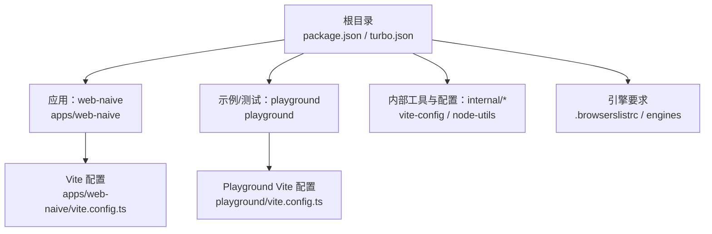
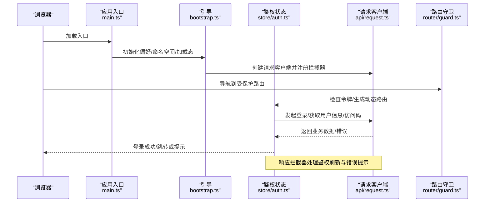
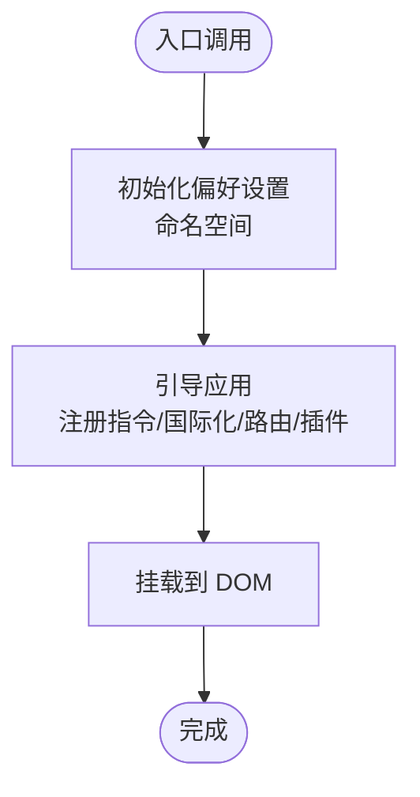
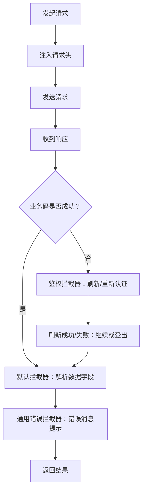
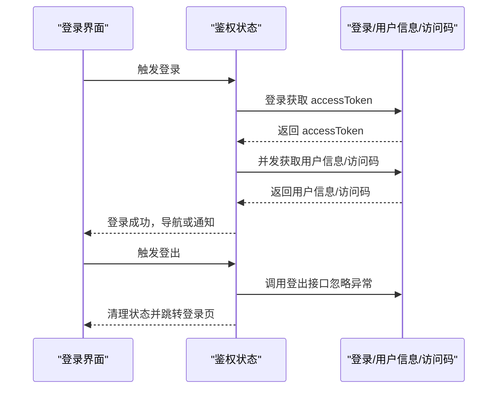
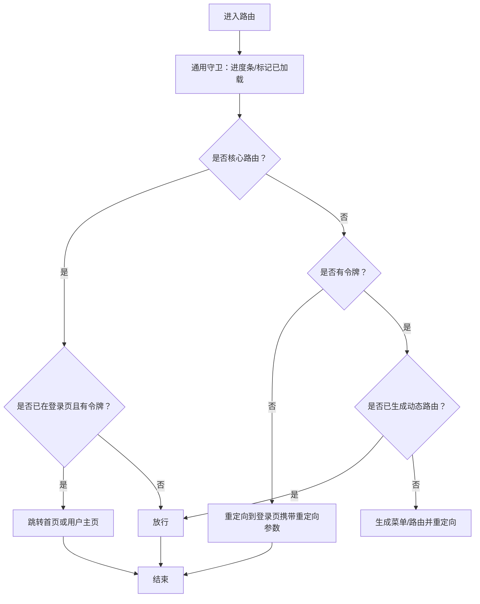
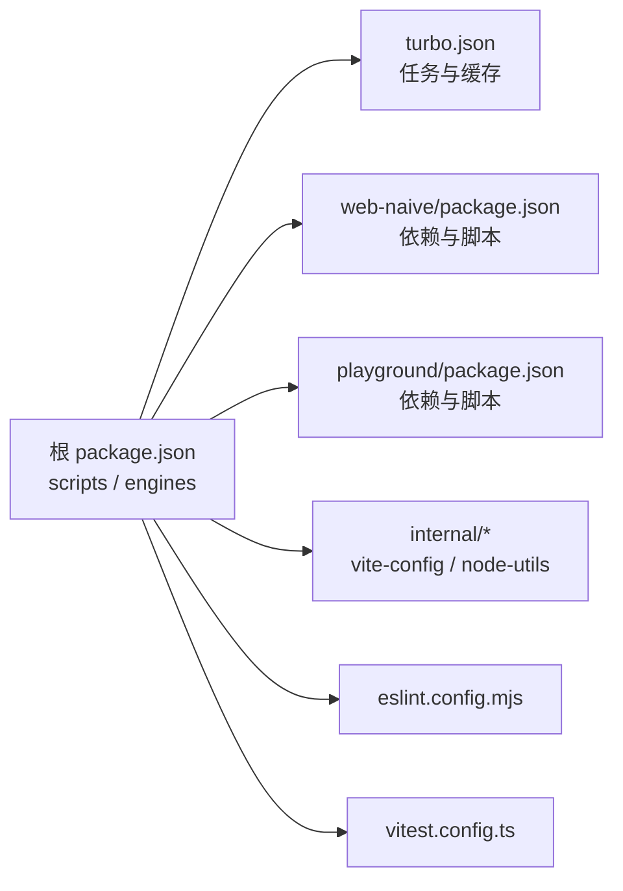

# 故障排除

<cite>
**本文引用的文件**
- [package.json](file://package.json)
- [turbo.json](file://turbo.json)
- [.browserslistrc](file://.browserslistrc)
- [apps/web-naive/package.json](file://apps/web-naive/package.json)
- [apps/web-naive/vite.config.ts](file://apps/web-naive/vite.config.ts)
- [apps/web-naive/src/main.ts](file://apps/web-naive/src/main.ts)
- [apps/web-naive/src/bootstrap.ts](file://apps/web-naive/src/bootstrap.ts)
- [apps/web-naive/src/api/request.ts](file://apps/web-naive/src/api/request.ts)
- [apps/web-naive/src/store/auth.ts](file://apps/web-naive/src/store/auth.ts)
- [apps/web-naive/src/router/guard.ts](file://apps/web-naive/src/router/guard.ts)
- [playground/vite.config.ts](file://playground/vite.config.ts)
- [playground/package.json](file://playground/package.json)
- [eslint.config.mjs](file://eslint.config.mjs)
- [vitest.config.ts](file://vitest.config.ts)
- [internal/vite-config/src/index.ts](file://internal/vite-config/src/index.ts)
- [internal/node-utils/src/index.ts](file://internal/node-utils/src/index.ts)
</cite>

## 目录

1. [简介](#简介)
2. [项目结构](#项目结构)
3. [核心组件](#核心组件)
4. [架构总览](#架构总览)
5. [详细组件分析](#详细组件分析)
6. [依赖分析](#依赖分析)
7. [性能考虑](#性能考虑)
8. [故障排除指南](#故障排除指南)
9. [结论](#结论)
10. [附录](#附录)

## 简介

本指南面向开发者与运维人员，聚焦于 shiyu-ui（基于 Vite + Vue 3 + Naive UI 的前端工程）在开发、构建与运行阶段的常见问题与系统化排障方法。内容涵盖：

- 开发环境与 Node.js/PNPM 版本要求
- 构建与打包错误定位
- 运行时异常与路由/鉴权相关问题
- 性能与内存问题的识别与优化
- 浏览器兼容性与代理配置
- 日志分析、错误追踪与性能分析实践
- E2E 与单元测试工具链的使用与问题定位

## 项目结构

该项目采用多包工作区（monorepo），以 Turbo 管道驱动构建与缓存，Vite 作为开发服务器与打包工具，Playground 提供示例与端到端测试环境。

图表来源

- [package.json:1-110](file://package.json#L1-L110)
- [turbo.json:1-49](file://turbo.json#L1-L49)
- [apps/web-naive/vite.config.ts:1-21](file://apps/web-naive/vite.config.ts#L1-L21)
- [playground/vite.config.ts:1-21](file://playground/vite.config.ts#L1-L21)
- [.browserslistrc:1-5](file://.browserslistrc#L1-L5)

章节来源

- [package.json:1-110](file://package.json#L1-L110)
- [turbo.json:1-49](file://turbo.json#L1-L49)
- [.browserslistrc:1-5](file://.browserslistrc#L1-L5)

## 核心组件

- 应用入口与启动流程：应用通过入口脚本初始化偏好设置、命名空间与全局加载态，随后异步引导应用并挂载。
- 请求客户端与拦截器：统一注入 Authorization 与语言头；内置响应拦截器处理业务码、鉴权刷新与错误提示。
- 鉴权与用户状态：登录、登出、拉取用户信息与访问码；结合路由守卫实现访问控制与动态路由生成。
- 路由守卫：通用进度条与访问控制，支持忽略权限路由、登录页自动跳转与重定向回原路径。
- 开发服务器与代理：提供 /api 代理至本地 Mock 服务，支持 WebSocket。

章节来源

- [apps/web-naive/src/main.ts:1-32](file://apps/web-naive/src/main.ts#L1-L32)
- [apps/web-naive/src/bootstrap.ts:1-77](file://apps/web-naive/src/bootstrap.ts#L1-L77)
- [apps/web-naive/src/api/request.ts:1-114](file://apps/web-naive/src/api/request.ts#L1-L114)
- [apps/web-naive/src/store/auth.ts:1-119](file://apps/web-naive/src/store/auth.ts#L1-L119)
- [apps/web-naive/src/router/guard.ts:1-133](file://apps/web-naive/src/router/guard.ts#L1-L133)
- [apps/web-naive/vite.config.ts:1-21](file://apps/web-naive/vite.config.ts#L1-L21)

## 架构总览

下图展示从浏览器到后端的典型请求链路与鉴权刷新机制。

图表来源

- [apps/web-naive/src/main.ts:1-32](file://apps/web-naive/src/main.ts#L1-L32)
- [apps/web-naive/src/bootstrap.ts:1-77](file://apps/web-naive/src/bootstrap.ts#L1-L77)
- [apps/web-naive/src/store/auth.ts:1-119](file://apps/web-naive/src/store/auth.ts#L1-L119)
- [apps/web-naive/src/api/request.ts:1-114](file://apps/web-naive/src/api/request.ts#L1-L114)
- [apps/web-naive/src/router/guard.ts:1-133](file://apps/web-naive/src/router/guard.ts#L1-L133)

## 详细组件分析

### 组件一：应用启动与引导

- 初始化偏好设置与命名空间，避免多项目键冲突
- 异步引导组件适配器、表单适配器、国际化、Pinia、权限指令、Motion 插件与标题动态更新
- 挂载后移除全局加载态

图表来源

- [apps/web-naive/src/main.ts:1-32](file://apps/web-naive/src/main.ts#L1-L32)
- [apps/web-naive/src/bootstrap.ts:1-77](file://apps/web-naive/src/bootstrap.ts#L1-L77)

章节来源

- [apps/web-naive/src/main.ts:1-32](file://apps/web-naive/src/main.ts#L1-L32)
- [apps/web-naive/src/bootstrap.ts:1-77](file://apps/web-naive/src/bootstrap.ts#L1-L77)

### 组件二：请求客户端与拦截器

- 请求头注入：Authorization 与 Accept-Language
- 响应拦截器：
  - 默认业务码映射
  - 鉴权刷新与重新认证
  - 通用错误消息提示
- 支持刷新令牌开关与格式化策略

图表来源

- [apps/web-naive/src/api/request.ts:1-114](file://apps/web-naive/src/api/request.ts#L1-L114)

章节来源

- [apps/web-naive/src/api/request.ts:1-114](file://apps/web-naive/src/api/request.ts#L1-L114)

### 组件三：鉴权与用户状态

- 登录：并发拉取用户信息与访问码，成功后写入状态并导航
- 登出：调用后端接口（忽略异常）、重置所有状态、清理登录过期标记并回退登录页
- 用户信息：按需拉取并写入用户状态

图表来源

- [apps/web-naive/src/store/auth.ts:1-119](file://apps/web-naive/src/store/auth.ts#L1-L119)

章节来源

- [apps/web-naive/src/store/auth.ts:1-119](file://apps/web-naive/src/store/auth.ts#L1-L119)

### 组件四：路由守卫

- 通用守卫：记录已加载页面、进度条控制
- 访问守卫：校验令牌、忽略权限路由、登录页自动跳转、动态路由生成与重定向

图表来源

- [apps/web-naive/src/router/guard.ts:1-133](file://apps/web-naive/src/router/guard.ts#L1-L133)

章节来源

- [apps/web-naive/src/router/guard.ts:1-133](file://apps/web-naive/src/router/guard.ts#L1-L133)

### 组件五：开发服务器与代理

- /api 代理至本地 Mock 服务，支持 WebSocket
- Playground 提供独立的代理配置与测试命令

章节来源

- [apps/web-naive/vite.config.ts:1-21](file://apps/web-naive/vite.config.ts#L1-L21)
- [playground/vite.config.ts:1-21](file://playground/vite.config.ts#L1-L21)

## 依赖分析

- 工作区与脚本：根脚本统一管理开发、构建、预览、测试与类型检查；Turbo 控制任务依赖与缓存
- 引擎与浏览器：Node/PNPM 版本要求与浏览器兼容范围
- 内部工具：vite-config 与 node-utils 提供配置与通用能力

图表来源

- [package.json:1-110](file://package.json#L1-L110)
- [turbo.json:1-49](file://turbo.json#L1-L49)
- [apps/web-naive/package.json:1-51](file://apps/web-naive/package.json#L1-L51)
- [playground/package.json:1-63](file://playground/package.json#L1-L63)
- [eslint.config.mjs:1-4](file://eslint.config.mjs#L1-L4)
- [vitest.config.ts:1-29](file://vitest.config.ts#L1-L29)
- [internal/vite-config/src/index.ts:1-6](file://internal/vite-config/src/index.ts#L1-L6)
- [internal/node-utils/src/index.ts:1-20](file://internal/node-utils/src/index.ts#L1-L20)

章节来源

- [package.json:1-110](file://package.json#L1-L110)
- [turbo.json:1-49](file://turbo.json#L1-L49)
- [apps/web-naive/package.json:1-51](file://apps/web-naive/package.json#L1-L51)
- [playground/package.json:1-63](file://playground/package.json#L1-L63)
- [eslint.config.mjs:1-4](file://eslint.config.mjs#L1-L4)
- [vitest.config.ts:1-29](file://vitest.config.ts#L1-L29)
- [internal/vite-config/src/index.ts:1-6](file://internal/vite-config/src/index.ts#L1-L6)
- [internal/node-utils/src/index.ts:1-20](file://internal/node-utils/src/index.ts#L1-L20)

## 性能考虑

- 构建内存：根脚本通过环境变量提升 Node 最大堆内存，缓解大型项目构建 OOM
- 进度条与懒加载：路由守卫对首次加载页面启用进度条，避免重复动画开销
- 代理与缓存：Turbo 缓存构建产物；Vite 开发服务器热更新与模块缓存
- 单测与 E2E：Happy DOM 环境与 Playwright 测试，减少真实浏览器资源消耗

章节来源

- [package.json:29](file://package.json#L29)
- [apps/web-naive/src/router/guard.ts:17-41](file://apps/web-naive/src/router/guard.ts#L17-L41)
- [turbo.json:15-48](file://turbo.json#L15-L48)
- [vitest.config.ts:5-29](file://vitest.config.ts#L5-L29)

## 故障排除指南

### 一、开发环境与版本问题

- Node.js 与 PNPM 版本
  - 现象：安装失败、脚本报错、构建中断
  - 排查：确认 Node 版本满足引擎要求；使用推荐的 PNPM 版本
  - 参考
    - [package.json:104-108](file://package.json#L104-L108)
- 浏览器兼容性
  - 现象：新特性在旧版浏览器不可用
  - 排查：查看浏览器列表配置，确认目标范围
  - 参考
    - [.browserslistrc:1-5](file://.browserslistrc#L1-L5)

章节来源

- [package.json:104-108](file://package.json#L104-L108)
- [.browserslistrc:1-5](file://.browserslistrc#L1-L5)

### 二、构建与打包错误

- 症状：构建卡住、内存不足、缓存失效
  - 步骤
    - 使用根脚本构建，观察内存参数是否生效
    - 清理缓存与锁文件后重试
    - 检查 Turbo 任务依赖与输出配置
  - 参考
    - [package.json:29](file://package.json#L29)
    - [turbo.json:15-48](file://turbo.json#L15-L48)

章节来源

- [package.json:29](file://package.json#L29)
- [turbo.json:15-48](file://turbo.json#L15-L48)

### 三、运行时异常与路由/鉴权问题

- 症状：登录后无法跳转、白屏、权限错误
  - 步骤
    - 检查路由守卫是否正确生成动态路由与重定向
    - 确认鉴权状态与用户信息是否写入
    - 查看请求拦截器是否触发重新认证或刷新
  - 参考
    - [apps/web-naive/src/router/guard.ts:47-119](file://apps/web-naive/src/router/guard.ts#L47-L119)
    - [apps/web-naive/src/store/auth.ts:28-79](file://apps/web-naive/src/store/auth.ts#L28-L79)
    - [apps/web-naive/src/api/request.ts:82-104](file://apps/web-naive/src/api/request.ts#L82-L104)

章节来源

- [apps/web-naive/src/router/guard.ts:47-119](file://apps/web-naive/src/router/guard.ts#L47-L119)
- [apps/web-naive/src/store/auth.ts:28-79](file://apps/web-naive/src/store/auth.ts#L28-L79)
- [apps/web-naive/src/api/request.ts:82-104](file://apps/web-naive/src/api/request.ts#L82-L104)

### 四、网络请求失败与代理问题

- 症状：/api 请求 404、跨域、WebSocket 不可用
  - 步骤
    - 检查开发服务器代理配置与目标地址
    - 确认后端 Mock 服务已启动
    - Playground 与 web-naive 的代理配置差异
  - 参考
    - [apps/web-naive/vite.config.ts:6-18](file://apps/web-naive/vite.config.ts#L6-L18)
    - [playground/vite.config.ts:6-18](file://playground/vite.config.ts#L6-L18)

章节来源

- [apps/web-naive/vite.config.ts:6-18](file://apps/web-naive/vite.config.ts#L6-L18)
- [playground/vite.config.ts:6-18](file://playground/vite.config.ts#L6-L18)

### 五、认证与权限错误排查

- 令牌无效/过期
  - 现象：频繁弹出登录框或被强制登出
  - 步骤
    - 检查刷新令牌开关与格式化策略
    - 查看重新认证逻辑与登录过期模式
  - 参考
    - [apps/web-naive/src/api/request.ts:32-45](file://apps/web-naive/src/api/request.ts#L32-L45)
    - [apps/web-naive/src/api/request.ts:82-92](file://apps/web-naive/src/api/request.ts#L82-L92)
- 登录页循环跳转
  - 现象：已登录仍跳转登录页
  - 步骤
    - 检查核心路由判断与登录页重定向逻辑
  - 参考
    - [apps/web-naive/src/router/guard.ts:53-63](file://apps/web-naive/src/router/guard.ts#L53-L63)

章节来源

- [apps/web-naive/src/api/request.ts:32-45](file://apps/web-naive/src/api/request.ts#L32-L45)
- [apps/web-naive/src/api/request.ts:82-92](file://apps/web-naive/src/api/request.ts#L82-L92)
- [apps/web-naive/src/router/guard.ts:53-63](file://apps/web-naive/src/router/guard.ts#L53-L63)

### 六、日志分析与错误追踪

- 浏览器控制台
  - 关注请求拦截器中的警告与错误消息
  - 检查路由守卫与状态变更日志
- 构建日志
  - 使用根脚本构建，关注内存参数与缓存命中
- 单元测试与 E2E
  - 使用 Vitest 与 Playwright，结合断言与截图定位问题
  - 参考
    - [vitest.config.ts:5-29](file://vitest.config.ts#L5-L29)
    - [playground/package.json:24-26](file://playground/package.json#L24-L26)

章节来源

- [apps/web-naive/src/api/request.ts:32-45](file://apps/web-naive/src/api/request.ts#L32-L45)
- [apps/web-naive/src/router/guard.ts:17-41](file://apps/web-naive/src/router/guard.ts#L17-L41)
- [package.json:29](file://package.json#L29)
- [vitest.config.ts:5-29](file://vitest.config.ts#L5-L29)
- [playground/package.json:24-26](file://playground/package.json#L24-L26)

### 七、性能与内存问题

- 症状：构建耗时长、内存溢出、页面卡顿
  - 步骤
    - 提升 Node 最大堆内存
    - 启用 Turbo 缓存与增量构建
    - 分析路由守卫与组件懒加载策略
  - 参考
    - [package.json:29](file://package.json#L29)
    - [turbo.json:15-48](file://turbo.json#L15-L48)
    - [apps/web-naive/src/router/guard.ts:17-41](file://apps/web-naive/src/router/guard.ts#L17-L41)

章节来源

- [package.json:29](file://package.json#L29)
- [turbo.json:15-48](file://turbo.json#L15-L48)
- [apps/web-naive/src/router/guard.ts:17-41](file://apps/web-naive/src/router/guard.ts#L17-L41)

### 八、开发工具使用与问题定位

- ESLint 配置
  - 使用统一配置，确保风格一致与静态问题尽早暴露
  - 参考
    - [eslint.config.mjs:1-4](file://eslint.config.mjs#L1-L4)
- Vite 配置
  - 通过 internal/vite-config 提供统一入口，避免重复配置
  - 参考
    - [internal/vite-config/src/index.ts:1-6](file://internal/vite-config/src/index.ts#L1-L6)
- Node 工具
  - 使用 internal/node-utils 提供的工具函数与日志输出
  - 参考
    - [internal/node-utils/src/index.ts:1-20](file://internal/node-utils/src/index.ts#L1-L20)

章节来源

- [eslint.config.mjs:1-4](file://eslint.config.mjs#L1-L4)
- [internal/vite-config/src/index.ts:1-6](file://internal/vite-config/src/index.ts#L1-L6)
- [internal/node-utils/src/index.ts:1-20](file://internal/node-utils/src/index.ts#L1-L20)

## 结论

本指南提供了从环境准备、构建流程、运行时问题到性能优化的系统化排障路径。建议在日常开发中：

- 严格遵循引擎与浏览器兼容要求
- 利用统一的配置与工具链减少偏差
- 通过拦截器与守卫的日志与断点快速定位问题
- 借助测试工具链保障质量与稳定性

## 附录

- 快速检查清单
  - Node/PNPM 版本是否满足要求
  - 构建脚本是否使用内存参数
  - 代理是否指向正确的后端地址
  - 鉴权令牌是否正确注入与刷新
  - 路由守卫是否生成动态路由并正确重定向
  - 单测/E2E 是否通过，必要时开启 UI 模式逐帧排查
