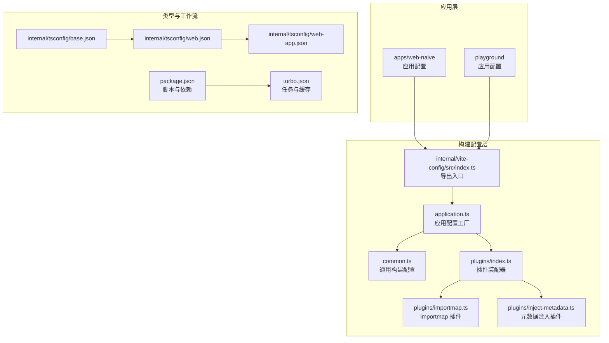
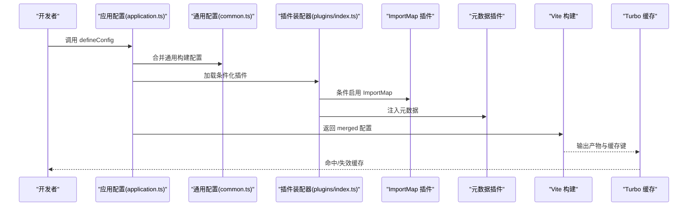
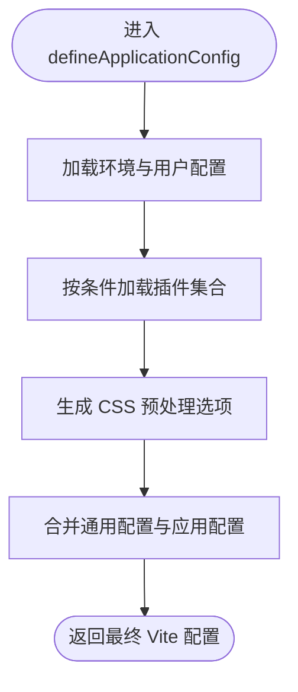
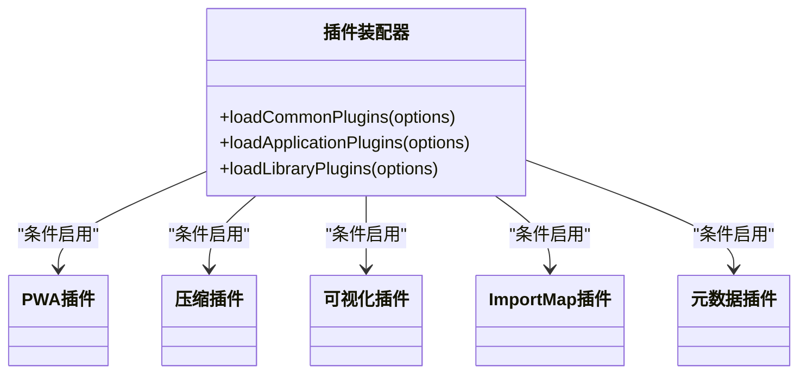
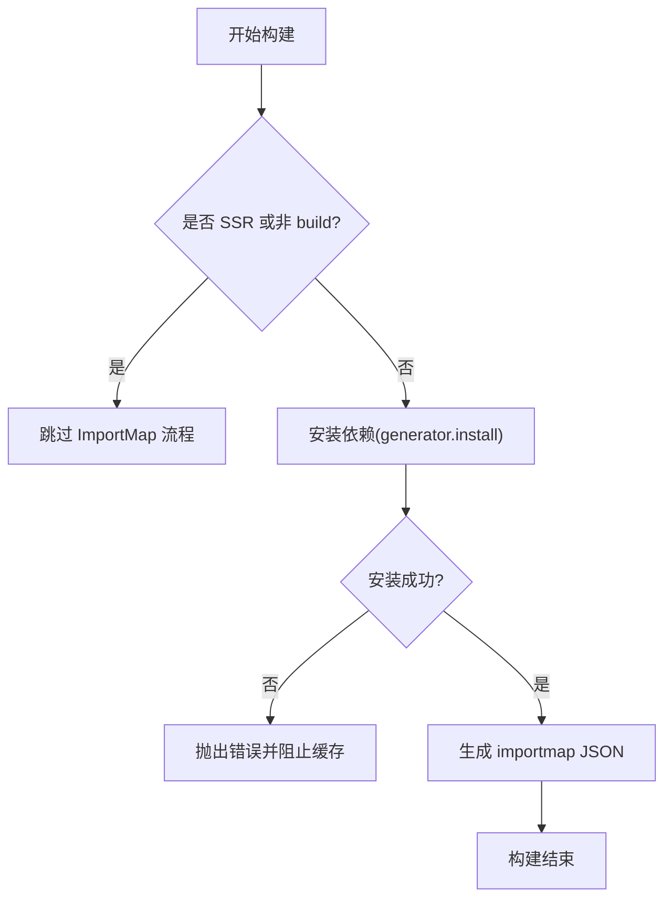
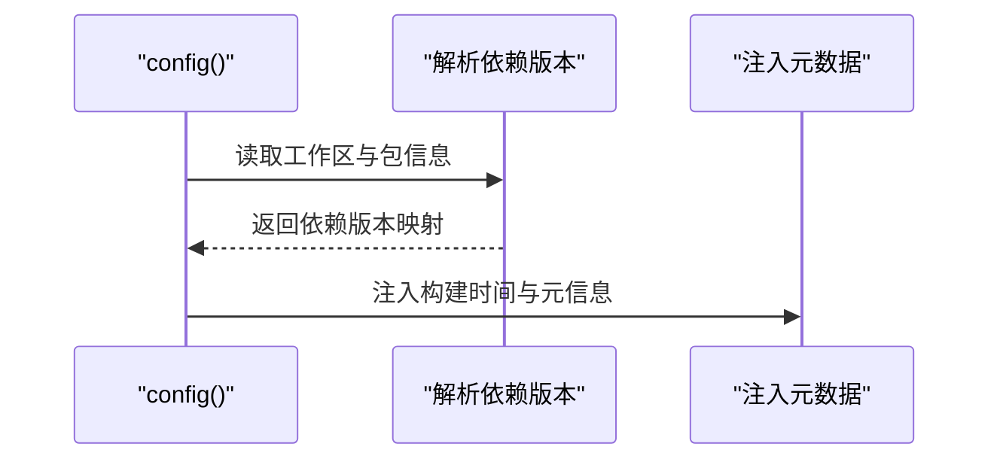
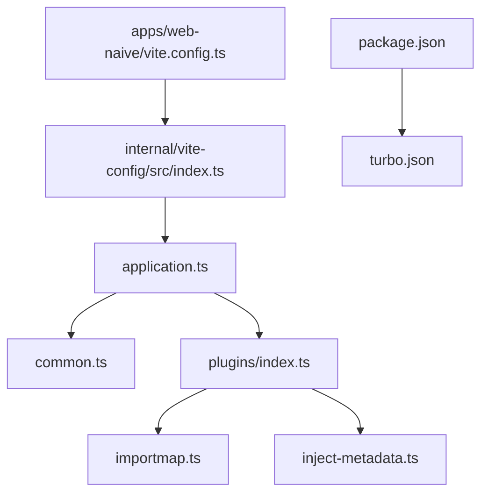

# 构建错误

<cite>
**本文引用的文件**
- [apps/web-naive/vite.config.ts](file://apps/web-naive/vite.config.ts)
- [playground/vite.config.ts](file://playground/vite.config.ts)
- [internal/vite-config/src/index.ts](file://internal/vite-config/src/index.ts)
- [internal/vite-config/src/config/application.ts](file://internal/vite-config/src/config/application.ts)
- [internal/vite-config/src/config/common.ts](file://internal/vite-config/src/config/common.ts)
- [internal/vite-config/src/plugins/index.ts](file://internal/vite-config/src/plugins/index.ts)
- [internal/vite-config/src/plugins/importmap.ts](file://internal/vite-config/src/plugins/importmap.ts)
- [internal/vite-config/src/plugins/inject-metadata.ts](file://internal/vite-config/src/plugins/inject-metadata.ts)
- [internal/tsconfig/base.json](file://internal/tsconfig/base.json)
- [internal/tsconfig/web.json](file://internal/tsconfig/web.json)
- [internal/tsconfig/web-app.json](file://internal/tsconfig/web-app.json)
- [package.json](file://package.json)
- [turbo.json](file://turbo.json)
</cite>

## 目录

1. [简介](#简介)
2. [项目结构](#项目结构)
3. [核心组件](#核心组件)
4. [架构总览](#架构总览)
5. [详细组件分析](#详细组件分析)
6. [依赖分析](#依赖分析)
7. [性能考量](#性能考量)
8. [故障排查指南](#故障排查指南)
9. [结论](#结论)
10. [附录](#附录)

## 简介

本指南面向 shiyu-ui 项目的构建与开发团队，聚焦于 Vite 构建过程中的常见错误类型：模块解析失败、类型检查错误、资源加载问题、打包配置错误，并提供可操作的排查步骤与修复建议。同时，结合项目内统一的 Vite 配置体系与 monorepo 工作流，帮助快速定位问题根因并验证修复效果。

## 项目结构

本项目采用 monorepo 结构，前端应用位于 apps 与 playground 目录，构建配置由 internal/vite-config 提供统一能力，类型检查与脚手架命令由根目录 package.json 与 turbo.json 管控。

**图表来源**

- [apps/web-naive/vite.config.ts:1-21](file://apps/web-naive/vite.config.ts#L1-L21)
- [playground/vite.config.ts:1-21](file://playground/vite.config.ts#L1-L21)
- [internal/vite-config/src/index.ts:1-6](file://internal/vite-config/src/index.ts#L1-L6)
- [internal/vite-config/src/config/application.ts:1-124](file://internal/vite-config/src/config/application.ts#L1-L124)
- [internal/vite-config/src/config/common.ts:1-14](file://internal/vite-config/src/config/common.ts#L1-L14)
- [internal/vite-config/src/plugins/index.ts:1-255](file://internal/vite-config/src/plugins/index.ts#L1-L255)
- [internal/vite-config/src/plugins/importmap.ts:39-153](file://internal/vite-config/src/plugins/importmap.ts#L39-L153)
- [internal/vite-config/src/plugins/inject-metadata.ts:1-86](file://internal/vite-config/src/plugins/inject-metadata.ts#L1-L86)
- [internal/tsconfig/base.json:1-40](file://internal/tsconfig/base.json#L1-L40)
- [internal/tsconfig/web.json:1-15](file://internal/tsconfig/web.json#L1-L15)
- [internal/tsconfig/web-app.json:1-9](file://internal/tsconfig/web-app.json#L1-L9)
- [package.json:1-110](file://package.json#L1-L110)
- [turbo.json:1-49](file://turbo.json#L1-L49)

**章节来源**

- [apps/web-naive/vite.config.ts:1-21](file://apps/web-naive/vite.config.ts#L1-L21)
- [playground/vite.config.ts:1-21](file://playground/vite.config.ts#L1-L21)
- [internal/vite-config/src/index.ts:1-6](file://internal/vite-config/src/index.ts#L1-L6)
- [internal/vite-config/src/config/application.ts:1-124](file://internal/vite-config/src/config/application.ts#L1-L124)
- [internal/vite-config/src/config/common.ts:1-14](file://internal/vite-config/src/config/common.ts#L1-L14)
- [internal/vite-config/src/plugins/index.ts:1-255](file://internal/vite-config/src/plugins/index.ts#L1-L255)
- [internal/vite-config/src/plugins/importmap.ts:39-153](file://internal/vite-config/src/plugins/importmap.ts#L39-L153)
- [internal/vite-config/src/plugins/inject-metadata.ts:1-86](file://internal/vite-config/src/plugins/inject-metadata.ts#L1-L86)
- [internal/tsconfig/base.json:1-40](file://internal/tsconfig/base.json#L1-L40)
- [internal/tsconfig/web.json:1-15](file://internal/tsconfig/web.json#L1-L15)
- [internal/tsconfig/web-app.json:1-9](file://internal/tsconfig/web-app.json#L1-L9)
- [package.json:1-110](file://package.json#L1-L110)
- [turbo.json:1-49](file://turbo.json#L1-L49)

## 核心组件

- 应用配置工厂：负责合并通用配置与应用特定配置，注入插件、CSS 预处理、服务与构建参数等。
- 统一插件装配器：按条件启用 Vue、JSX、Tailwind、PWA、压缩、可视化、Nitro Mock、ImportMap 等插件。
- ImportMap 插件：在生产构建中安装外部依赖并生成 importmap，失败会阻止缓存污染。
- 元数据注入插件：读取工作区与包信息，注入构建时间与版本等元数据。
- 类型配置：严格模式、模块解析策略、浏览器环境类型声明等，保障类型检查一致性。

**章节来源**

- [internal/vite-config/src/config/application.ts:17-99](file://internal/vite-config/src/config/application.ts#L17-L99)
- [internal/vite-config/src/plugins/index.ts:94-223](file://internal/vite-config/src/plugins/index.ts#L94-L223)
- [internal/vite-config/src/plugins/importmap.ts:44-153](file://internal/vite-config/src/plugins/importmap.ts#L44-L153)
- [internal/vite-config/src/plugins/inject-metadata.ts:70-86](file://internal/vite-config/src/plugins/inject-metadata.ts#L70-L86)
- [internal/tsconfig/base.json:4-36](file://internal/tsconfig/base.json#L4-L36)
- [internal/tsconfig/web.json:5-13](file://internal/tsconfig/web.json#L5-L13)
- [internal/tsconfig/web-app.json:4-8](file://internal/tsconfig/web-app.json#L4-L8)

## 架构总览

下图展示从应用配置到最终构建产物的关键流程，以及与插件、类型配置和工作流的关系。

**图表来源**

- [internal/vite-config/src/config/application.ts:93-98](file://internal/vite-config/src/config/application.ts#L93-L98)
- [internal/vite-config/src/config/common.ts:3-11](file://internal/vite-config/src/config/common.ts#L3-L11)
- [internal/vite-config/src/plugins/index.ts:94-223](file://internal/vite-config/src/plugins/index.ts#L94-L223)
- [internal/vite-config/src/plugins/importmap.ts:44-153](file://internal/vite-config/src/plugins/importmap.ts#L44-L153)
- [internal/vite-config/src/plugins/inject-metadata.ts:70-86](file://internal/vite-config/src/plugins/inject-metadata.ts#L70-L86)
- [turbo.json:15-48](file://turbo.json#L15-L48)

## 详细组件分析

### 应用配置工厂（application.ts）

- 职责：基于用户配置与环境变量，动态装配插件、CSS 预处理、服务器与构建参数；合并通用配置。
- 关键点：
  - 插件装配通过条件开关控制，如 PWA、压缩、Nitro Mock、ImportMap、打印信息等。
  - CSS 预处理支持全局 SCSS 注入与 NodePackageImporter。
  - 构建输出命名策略与最小化选项。
  - 开发服务器预热与端口配置。

**图表来源**

- [internal/vite-config/src/config/application.ts:17-99](file://internal/vite-config/src/config/application.ts#L17-L99)

**章节来源**

- [internal/vite-config/src/config/application.ts:17-99](file://internal/vite-config/src/config/application.ts#L17-L99)

### 插件装配器（plugins/index.ts）

- 职责：根据 isBuild、devtools、injectMetadata、visualizer 等选项，按需启用插件。
- 关键插件：
  - Vue/JSX/Tailwind：基础渲染与样式支持。
  - PWA：离线与清单配置。
  - 压缩：Brotli/Gzip。
  - 可视化：构建体积分析。
  - Nitro Mock：后端模拟。
  - ImportMap：生产外链依赖管理。
  - 元数据注入：构建信息注入。

**图表来源**

- [internal/vite-config/src/plugins/index.ts:50-223](file://internal/vite-config/src/plugins/index.ts#L50-L223)

**章节来源**

- [internal/vite-config/src/plugins/index.ts:50-223](file://internal/vite-config/src/plugins/index.ts#L50-L223)

### ImportMap 插件（importmap.ts）

- 职责：在生产构建阶段安装指定依赖并生成 importmap，失败时抛错以避免缓存污染。
- 关键行为：
  - 仅在 isBuild 且非 SSR 生效。
  - 通过 generator.install 安装依赖，记录安装状态与错误。
  - 在构建结束阶段校验是否成功生成 importmap。

**图表来源**

- [internal/vite-config/src/plugins/importmap.ts:100-144](file://internal/vite-config/src/plugins/importmap.ts#L100-L144)

**章节来源**

- [internal/vite-config/src/plugins/importmap.ts:44-153](file://internal/vite-config/src/plugins/importmap.ts#L44-L153)

### 元数据注入插件（inject-metadata.ts）

- 职责：读取工作区与包信息，注入作者、主页、许可证、版本与构建时间等元数据。
- 关键点：解析 monorepo 依赖版本，兼容 catalog 与 workspace:\* 版本占位。

**图表来源**

- [internal/vite-config/src/plugins/inject-metadata.ts:29-86](file://internal/vite-config/src/plugins/inject-metadata.ts#L29-L86)

**章节来源**

- [internal/vite-config/src/plugins/inject-metadata.ts:29-86](file://internal/vite-config/src/plugins/inject-metadata.ts#L29-L86)

### 类型配置（tsconfig）

- base.json：严格模式、模块解析策略、ESNext/DOM 等基础设置。
- web.json：浏览器环境类型、JSX 配置、bundler 解析。
- web-app.json：扩展全局类型，适配应用层。

**图表来源**

- [internal/tsconfig/base.json:4-36](file://internal/tsconfig/base.json#L4-L36)
- [internal/tsconfig/web.json:5-13](file://internal/tsconfig/web.json#L5-L13)
- [internal/tsconfig/web-app.json:4-8](file://internal/tsconfig/web-app.json#L4-L8)

**章节来源**

- [internal/tsconfig/base.json:4-36](file://internal/tsconfig/base.json#L4-L36)
- [internal/tsconfig/web.json:5-13](file://internal/tsconfig/web.json#L5-L13)
- [internal/tsconfig/web-app.json:4-8](file://internal/tsconfig/web-app.json#L4-L8)

## 依赖分析

- 应用配置通过 defineConfig 导入统一配置工厂，再由工厂合并通用配置与插件装配器。
- 插件装配器按条件启用 ImportMap 与 PWA 等功能，影响构建产物与运行时行为。
- 类型配置贯穿应用与库包，确保类型检查一致。
- Turbo 管控构建任务与缓存，构建失败或插件异常会导致缓存失效。

**图表来源**

- [apps/web-naive/vite.config.ts:1-21](file://apps/web-naive/vite.config.ts#L1-L21)
- [internal/vite-config/src/index.ts:1-6](file://internal/vite-config/src/index.ts#L1-L6)
- [internal/vite-config/src/config/application.ts:93-98](file://internal/vite-config/src/config/application.ts#L93-L98)
- [internal/vite-config/src/config/common.ts:3-11](file://internal/vite-config/src/config/common.ts#L3-L11)
- [internal/vite-config/src/plugins/index.ts:94-223](file://internal/vite-config/src/plugins/index.ts#L94-L223)
- [internal/vite-config/src/plugins/importmap.ts:44-153](file://internal/vite-config/src/plugins/importmap.ts#L44-L153)
- [internal/vite-config/src/plugins/inject-metadata.ts:70-86](file://internal/vite-config/src/plugins/inject-metadata.ts#L70-L86)
- [package.json:27-66](file://package.json#L27-L66)
- [turbo.json:15-48](file://turbo.json#L15-L48)

**章节来源**

- [apps/web-naive/vite.config.ts:1-21](file://apps/web-naive/vite.config.ts#L1-L21)
- [internal/vite-config/src/index.ts:1-6](file://internal/vite-config/src/index.ts#L1-L6)
- [internal/vite-config/src/config/application.ts:93-98](file://internal/vite-config/src/config/application.ts#L93-L98)
- [internal/vite-config/src/config/common.ts:3-11](file://internal/vite-config/src/config/common.ts#L3-L11)
- [internal/vite-config/src/plugins/index.ts:94-223](file://internal/vite-config/src/plugins/index.ts#L94-L223)
- [internal/vite-config/src/plugins/importmap.ts:44-153](file://internal/vite-config/src/plugins/importmap.ts#L44-L153)
- [internal/vite-config/src/plugins/inject-metadata.ts:70-86](file://internal/vite-config/src/plugins/inject-metadata.ts#L70-L86)
- [package.json:27-66](file://package.json#L27-L66)
- [turbo.json:15-48](file://turbo.json#L15-L48)

## 性能考量

- 构建体积与警告阈值：通用配置中设置了较大的体积警告阈值，便于在大型项目中及时发现异常膨胀。
- 源码映射：默认关闭，减少产物体积与调试成本。
- 压缩：可按需启用 Brotli/Gzip，平衡体积与 CPU。
- 可视化：仅在需要时开启，避免 CI/本地开发时的额外开销。
- 预热：开发服务器对关键入口进行预热，缩短首屏等待。

**章节来源**

- [internal/vite-config/src/config/common.ts:4-11](file://internal/vite-config/src/config/common.ts#L4-L11)
- [internal/vite-config/src/config/application.ts:60-76](file://internal/vite-config/src/config/application.ts#L60-L76)
- [internal/vite-config/src/plugins/index.ts:184-199](file://internal/vite-config/src/plugins/index.ts#L184-L199)

## 故障排查指南

### 一、模块解析失败

- 症状
  - 报错提示找不到模块或路径解析异常。
  - 在 monorepo 中出现包名解析不一致。
- 排查步骤
  - 确认模块解析策略与目标环境类型：
    - 浏览器端使用 bundler 解析，确保包导出字段正确。
    - 严格模式下禁止隐式 any 与未使用变量，检查类型声明。
  - 检查应用配置中的插件是否正确启用，尤其是 ImportMap 与 Nitro Mock。
  - 若使用 ImportMap，请确认生产构建已成功安装依赖并生成 importmap。
- 相关配置参考
  - [internal/tsconfig/web.json:10-12](file://internal/tsconfig/web.json#L10-L12)
  - [internal/tsconfig/base.json:13-24](file://internal/tsconfig/base.json#L13-L24)
  - [internal/vite-config/src/plugins/importmap.ts:100-144](file://internal/vite-config/src/plugins/importmap.ts#L100-L144)

**章节来源**

- [internal/tsconfig/web.json:10-12](file://internal/tsconfig/web.json#L10-L12)
- [internal/tsconfig/base.json:13-24](file://internal/tsconfig/base.json#L13-L24)
- [internal/vite-config/src/plugins/importmap.ts:100-144](file://internal/vite-config/src/plugins/importmap.ts#L100-L144)

### 二、类型检查错误

- 症状
  - TS 报错：缺少类型定义、未使用变量、严格模式相关错误。
  - JSX/TSX 文件类型不匹配。
- 排查步骤
  - 确认 tsconfig 链接顺序与浏览器类型声明：
    - web-app.json 扩展 web.json 并引入全局类型。
  - 在严格模式下，关注 strictNullChecks、noImplicitAny 等规则。
  - 使用统一的类型检查命令，确保所有包一致。
- 相关配置参考
  - [internal/tsconfig/web-app.json:4-8](file://internal/tsconfig/web-app.json#L4-L8)
  - [internal/tsconfig/web.json:5-13](file://internal/tsconfig/web.json#L5-L13)
  - [internal/tsconfig/base.json:16-24](file://internal/tsconfig/base.json#L16-L24)
  - [package.json:43-43](file://package.json#L43-L43)

**章节来源**

- [internal/tsconfig/web-app.json:4-8](file://internal/tsconfig/web-app.json#L4-L8)
- [internal/tsconfig/web.json:5-13](file://internal/tsconfig/web.json#L5-L13)
- [internal/tsconfig/base.json:16-24](file://internal/tsconfig/base.json#L16-L24)
- [package.json:43-43](file://package.json#L43-L43)

### 三、资源加载问题

- 症状
  - 静态资源 404、图片/字体无法加载、HTML 注入异常。
- 排查步骤
  - 检查 base 路径与构建输出命名策略，确保资源路径与部署路径一致。
  - 确认 HTML 插件与元数据插件未误改写关键节点。
  - 如使用 PWA，请核对清单与离线策略。
- 相关配置参考
  - [internal/vite-config/src/config/application.ts:58-91](file://internal/vite-config/src/config/application.ts#L58-L91)
  - [internal/vite-config/src/plugins/index.ts:167-182](file://internal/vite-config/src/plugins/index.ts#L167-L182)

**章节来源**

- [internal/vite-config/src/config/application.ts:58-91](file://internal/vite-config/src/config/application.ts#L58-L91)
- [internal/vite-config/src/plugins/index.ts:167-182](file://internal/vite-config/src/plugins/index.ts#L167-L182)

### 四、打包配置错误

- 症状
  - 构建产物体积异常、分包策略导致运行时错误、压缩失败。
- 排查步骤
  - 检查 rolldown 输出命名策略与最小化配置。
  - 确认压缩插件启用与目标平台兼容性。
  - 使用可视化插件定位大体积模块。
- 相关配置参考
  - [internal/vite-config/src/config/application.ts:60-76](file://internal/vite-config/src/config/application.ts#L60-L76)
  - [internal/vite-config/src/plugins/index.ts:184-199](file://internal/vite-config/src/plugins/index.ts#L184-L199)

**章节来源**

- [internal/vite-config/src/config/application.ts:60-76](file://internal/vite-config/src/config/application.ts#L60-L76)
- [internal/vite-config/src/plugins/index.ts:184-199](file://internal/vite-config/src/plugins/index.ts#L184-L199)

### 五、ImportMap 安装失败

- 症状
  - 构建结束时报错“Importmap installation failed”，随后构建被标记为失败。
- 排查步骤
  - 确认 isBuild 且非 SSR 环境。
  - 检查依赖安装日志与网络环境。
  - 重新执行安装或调整依赖范围。
- 相关实现参考
  - [internal/vite-config/src/plugins/importmap.ts:138-144](file://internal/vite-config/src/plugins/importmap.ts#L138-L144)

**章节来源**

- [internal/vite-config/src/plugins/importmap.ts:138-144](file://internal/vite-config/src/plugins/importmap.ts#L138-L144)

### 六、分析构建日志与错误堆栈

- 建议流程
  - 优先查看 Vite 插件报错位置（如 importmap 插件的 buildEnd 阶段）。
  - 结合 Turbo 任务日志定位具体包与阶段。
  - 使用可视化插件输出统计报告，识别大模块。
- 相关参考
  - [internal/vite-config/src/plugins/importmap.ts:138-144](file://internal/vite-config/src/plugins/importmap.ts#L138-L144)
  - [internal/vite-config/src/plugins/index.ts:79-87](file://internal/vite-config/src/plugins/index.ts#L79-L87)
  - [turbo.json:15-48](file://turbo.json#L15-L48)

**章节来源**

- [internal/vite-config/src/plugins/importmap.ts:138-144](file://internal/vite-config/src/plugins/importmap.ts#L138-L144)
- [internal/vite-config/src/plugins/index.ts:79-87](file://internal/vite-config/src/plugins/index.ts#L79-L87)
- [turbo.json:15-48](file://turbo.json#L15-L48)

### 七、TypeScript 编译错误

- 常见原因
  - 严格模式规则触发、类型缺失、模块解析失败。
- 修复建议
  - 补充缺失类型或调整 strict 设置。
  - 校正模块导入路径与包导出字段。
  - 使用统一的 tsconfig 链接。
- 相关参考
  - [internal/tsconfig/base.json:16-24](file://internal/tsconfig/base.json#L16-L24)
  - [internal/tsconfig/web.json:5-13](file://internal/tsconfig/web.json#L5-L13)
  - [internal/tsconfig/web-app.json:4-8](file://internal/tsconfig/web-app.json#L4-L8)

**章节来源**

- [internal/tsconfig/base.json:16-24](file://internal/tsconfig/base.json#L16-L24)
- [internal/tsconfig/web.json:5-13](file://internal/tsconfig/web.json#L5-L13)
- [internal/tsconfig/web-app.json:4-8](file://internal/tsconfig/web-app.json#L4-L8)

### 八、CSS 处理问题

- 常见原因
  - SCSS 全局注入路径错误、NodePackageImporter 不兼容当前平台。
- 修复建议
  - 确认全局 SCSS 注入逻辑仅在 apps 下生效。
  - 检查平台对应 sass-embedded 的二进制可用性。
- 相关参考
  - [internal/vite-config/src/config/application.ts:101-121](file://internal/vite-config/src/config/application.ts#L101-L121)

**章节来源**

- [internal/vite-config/src/config/application.ts:101-121](file://internal/vite-config/src/config/application.ts#L101-L121)

### 九、静态资源引用错误

- 常见原因
  - base 路径与部署路径不一致、资源命名策略导致路径变更。
- 修复建议
  - 对比构建输出与部署路径，统一 base。
  - 校验 rolldown 输出命名策略与实际访问路径。
- 相关参考
  - [internal/vite-config/src/config/application.ts:58-91](file://internal/vite-config/src/config/application.ts#L58-L91)

**章节来源**

- [internal/vite-config/src/config/application.ts:58-91](file://internal/vite-config/src/config/application.ts#L58-L91)

### 十、构建优化与性能诊断

- 优化建议
  - 合理启用压缩与可视化，CI 中关闭可视化。
  - 使用 ImportMap 将大依赖外链，降低首包体积。
  - 分析可视化报告，拆分大模块或替换重型依赖。
- 诊断技巧
  - 利用 chunkSizeWarningLimit 与可视化插件定位超限模块。
  - 在开发环境启用预热，缩短冷启动时间。
- 相关参考
  - [internal/vite-config/src/config/common.ts:4-11](file://internal/vite-config/src/config/common.ts#L4-L11)
  - [internal/vite-config/src/config/application.ts:82-89](file://internal/vite-config/src/config/application.ts#L82-L89)
  - [internal/vite-config/src/plugins/index.ts:184-199](file://internal/vite-config/src/plugins/index.ts#L184-L199)

**章节来源**

- [internal/vite-config/src/config/common.ts:4-11](file://internal/vite-config/src/config/common.ts#L4-L11)
- [internal/vite-config/src/config/application.ts:82-89](file://internal/vite-config/src/config/application.ts#L82-L89)
- [internal/vite-config/src/plugins/index.ts:184-199](file://internal/vite-config/src/plugins/index.ts#L184-L199)

## 结论

本指南围绕 shiyu-ui 的 Vite 构建体系，系统梳理了常见错误类型与排查路径，并结合统一配置、插件机制与 monorepo 工作流给出可落地的修复建议。建议在日常开发中：

- 严格遵循 tsconfig 链接与类型规则；
- 在生产构建中启用 ImportMap 与压缩；
- 使用可视化与体积警告监控构建质量；
- 通过 Turbo 任务与缓存策略提升迭代效率。

## 附录

- 应用配置示例入口
  - [apps/web-naive/vite.config.ts:1-21](file://apps/web-naive/vite.config.ts#L1-L21)
  - [playground/vite.config.ts:1-21](file://playground/vite.config.ts#L1-L21)
- 统一配置与插件
  - [internal/vite-config/src/index.ts:1-6](file://internal/vite-config/src/index.ts#L1-L6)
  - [internal/vite-config/src/config/application.ts:1-124](file://internal/vite-config/src/config/application.ts#L1-L124)
  - [internal/vite-config/src/config/common.ts:1-14](file://internal/vite-config/src/config/common.ts#L1-L14)
  - [internal/vite-config/src/plugins/index.ts:1-255](file://internal/vite-config/src/plugins/index.ts#L1-L255)
- 类型配置
  - [internal/tsconfig/base.json:1-40](file://internal/tsconfig/base.json#L1-L40)
  - [internal/tsconfig/web.json:1-15](file://internal/tsconfig/web.json#L1-L15)
  - [internal/tsconfig/web-app.json:1-9](file://internal/tsconfig/web-app.json#L1-L9)
- 工作流与脚本
  - [package.json:27-66](file://package.json#L27-L66)
  - [turbo.json:1-49](file://turbo.json#L1-L49)
